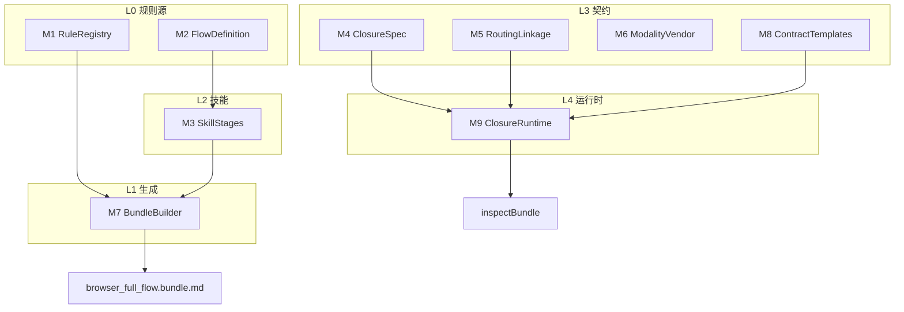
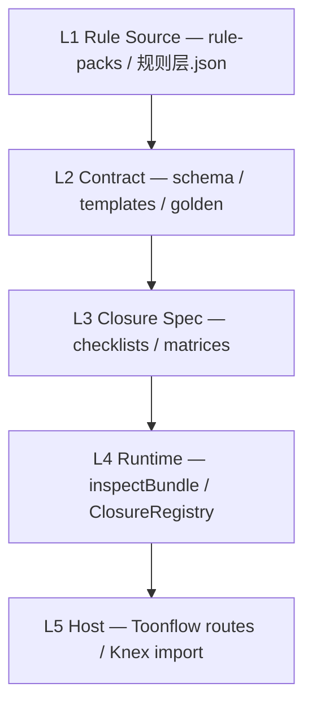

# Rule Engine Architecture (v2.0.1)

## Ten modules (M1–M10)

| Module | Artifact | Portable T1 |
|--------|----------|-------------|
| M1 RuleRegistry | `规则层.json`, `data/rule-packs/` | snapshot |
| M2 FlowDefinition | `stage_graph.yaml`, `rule_flow_*.json` | required |
| M3 SkillStages | `data/skills/browser_chat/` | subset |
| M4 ClosureSpec | DC/PC/GC/IC checklists | required |
| M5 RoutingLinkage | reverse_route, linkage_chains | required |
| M6 ModalityVendor | modality/fx fixtures | T3 only |
| M7 BundleBuilder | extract + bundle scripts | excluded |
| M8 ContractTemplates | schema + template-v2 + golden | required |
| M9 ClosureRuntime | unifiedDryRun + **inspectBundle** | required |
| M10 StyleOverlays | art/story skills | excluded |

## Five layers

## Module boundaries

| Layer | Module | Portable | Host |
|-------|--------|----------|------|
| L4 | `portable/inspectBundle` | ✓ API | re-export |
| L4 | `closure/ClosureRegistry` | ✓ | shared |
| L4 | `design/forwardTrace`, `bidirectionalTrace` | ✓ | shared |
| L4 | `bundle/*ClosureDryRun` | ✓ | shared |
| L5 | `importAdapter`, `facade`, routes | ✗ | Knex |

## Closure dimensions

- **DC** — design closure (15 checks)
- **PC** — production closure (T3)
- **GC** — generation feedback routing
- **IC** — intelligent repair / W93 / bidirectional

## Data flow

1. Parse bundle (ScriptBundle or EpisodeBundle)
2. `enrichBundleForwardTrace` → 11 chains
3. `runUnifiedClosure` → DC/PC/GC/IC
4. `buildReverseHints` → semantic reverse targets via `chain_trigger_map.json`
5. `repairHints` from `repair_hint_catalog.json`
6. `buildRePushPlan` from `reverse_route_table.json`

## Portable entry

Single function: `inspectBundle(raw, opts?)` — zero Knex.

See [rule-engine-portable.md](./rule-engine-portable.md) for doc index.

## Dual closure model

Toonflow exposes **two complementary validation tracks** — do not conflate them:

| Track | Entry | What it measures |
|-------|--------|------------------|
| **Unified closure** | `inspectBundle()` / `POST /inspectBundle` | DC/PC/GC/IC on ScriptBundle/EpisodeBundle — canonical for Chat export |
| **INT tier-0** | `validate` / `facade.dryRun` | ~8 proven runtime rules on EpisodePackage — production gate |

Import responses split both:

- `preImport` — unified closure (same as inspectBundle)
- `postImport.intValidation` — tier-0 facade result after DB sync

Do **not** use `ruleCoverage.hit/257` as Browser Chat closure completion; use `closureChecks.blocked`.
