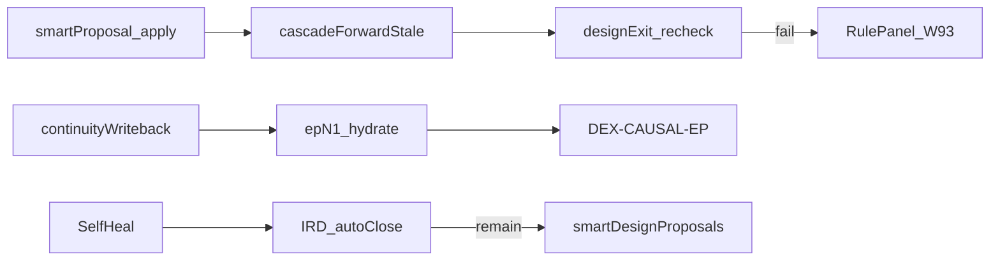

# v5 残余缺口计划（F1–F14 之后）

> 范围：主闭环 F1–F14 + night 已绿后的残余假绿 / 契约漂移 / 产品深化。  
> 更新：2026-07-30 — **G0–G15 主题胶水自愈**落地（Key 不挡质量流；compose 禁口含 HARD；Motion at_locus；soft_deliver 诚实；智能修复扩域）。

## 本轮已关

| 项 | 落地 |
|----|------|
| RulePanel / derive UX | Confirm/Reject/Apply + presentationFork；C12 → [x] |
| smartProposalMerger | `mergeConfirmedProposals` + `stampSmartDesignProposals`；`POST /api/scriptAgent/smartProposalOps` |
| 跨集系列 | `buildSeriesContinuitySeed` / hydrate / `auditSeriesContinuity`；blueprint `seriesContinuityByEpisode` |
| **V5-01** | apply 末尾 `applyCascadeAndReGate`；响应带 `exitGate`/`exitReassert`；禁假绿 |
| **V5-04** | `ensureCarryInfo` 禁止 invent `carry_prev_hook` 过 DEX-CAUSAL |
| **V5-09** | `hydrateSeriesContinuityFromBlueprint` 于 getPlanData/resolveContext |
| **V5-10** | diagnose / exportGate / setStepStatus / SelfHeal 自动 stamp `smartDesignProposals` |
| **V5-11** | IRD/VIRD/smartProposal apply → cascade + syncStoryboard + 清 videoPass |
| **V5-C1** | `audit:v5-contract-ci` + skill-matrix；exportGate stamp 与 Chat 同核 |
| **V5-C2** | SelfHeal → `applyDesignAutoCloseToBundle` + mid-conf proposals（禁双轨空转） |
| **V5-D** | pose handoff still-at-locus+「进入」→ BLOCK；MOD-02/03 空槽 BLOCK |
| **V5-N11b/d** | `skipPreflight` 禁绕 lit/contact；人审 `undo` 恢复 weak+清 videoPass |
| **V5-02/05/08** | `data/fixtures/v5_contract_hashes.json` + `yarn audit:v5-contract-ci` |
| **G0–G15** | Key 解耦；compose HARD+stillPoseAnchor 写回；Motion 同源；导入/autoClose 扩域；FE stub≠burn；ASSET stub→enqueue；`yarn test:g-smart-theme-glue` |
| **G-checklist** | PROP-CONT/INTENT-PIC/假绿派生进 autoAdapt（勿诱手改 JSON）；export CAM 高置信 untilClear；自报覆写后剥 DG-CAM-FIT-FALSE-GREEN；`yarn test:g-checklist-theme-glue` |

## Web 仓（V5-W / N1 / N2 / N5 / N11a）

生产仓 `Toonflow-web`：RulePanel W93、DebtBar 人审/fork/split、soft_defer 诚实 toast、`shouldBlockSilentStillRegen`、`exitReassert` 处理；`build:integrate` 同步 app `data/web`。

## 诚实 DEFER（P2 另项）

| ID | 缺口 |
|----|------|
| V5-03 | C11 I1–I20 全音频形态 |
| V5-06 | adaptation/retention/viral Smart 全域 |
| V5-07 | VisBeat enforce 全量 / Expression 全环 |
| — | OCR 休书、云端 VLM、全家族 SVG |

## 衍生闭环



## 验收命令

```bash
yarn test:g-smart-theme-glue
yarn test:g-checklist-theme-glue
yarn test:smart-proposal-merge
yarn test:series-continuity
yarn test:still-video-pose-handoff
yarn test:contact-event-loop
yarn audit:v5-contract-ci
yarn test:video-quality-chain
```

> 2026-07-30：`test:video-quality-chain` 已绿；FE chunk 断言改为扫描 `scripts/web/assets/index-*.js`（不再钉死 vite hash）。  
> 2026-07-30：`yarn test:video-quality-chain:night` **EXIT:0**（closure-shape-suite + audit:closure-gaps + verify:shot-783 + verify:track-1784325819186）。  
> 2026-07-30：G 波次 — 主题胶水 untilClear + Key 不挡质量流；见 `yarn test:g-smart-theme-glue`。  
> 2026-07-30：闭环清单诚实 — PROP-CONT/INTENT-PIC/假绿派生≠须手改 JSON；见 `yarn test:g-checklist-theme-glue`。
