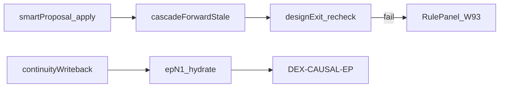

# v5 残余缺口计划（F1–F14 之后）

> 范围：主闭环 F1–F14 + night 已绿后的残余假绿 / 契约漂移 / 产品深化。  
> 本轮（2026-07-29）已落地：RulePanel W93 Confirm/Apply、smartProposal 全量 merge 写库、跨集 SH-SERIES-CONT 写回+hydrate+audit。

## 本轮已关（原 DEFER → MVP）

| 项 | 落地 |
|----|------|
| RulePanel / derive UX | Confirm/Reject/Apply + presentationFork CTA；C12 → [x] |
| smartProposalMerger | `mergeConfirmedProposals` 写 patch + fixPlan；`POST /api/scriptAgent/smartProposalOps` |
| 跨集系列 | `buildSeriesContinuitySeed` / hydrate / `auditSeriesContinuity`；blueprint `seriesContinuityByEpisode` |

## v5 仍须盯的假绿 / 漂移

| ID | 缺口 | 风险 | 建议 Wave |
|----|------|------|-----------|
| V5-01 | smartProposal `apply` 未强制 `runDesignExitGate` 再闸 | apply 后假绿 export | 在 apply 响应附 `exitGate.ok`；FE 禁跳过 |
| V5-02 | RulePanel 在 Toonflow-web 生产仓需复制同步 | 契约漂移 | 发布 checklist：copy docs/toonflow-web/* |
| V5-03 | C11 I1–I20 全音频形态仍 partial | 口型/OS 边角假绿 | 按形态矩阵逐项挂载，勿一次装全 |
| V5-04 | `ensureCarryInfo` 仍可 invent `carry_prev_hook` | 跨集因果纸面过站 | 仅当无 writeback seed 时 WARN，禁止 silent invent 过 DEX-CAUSAL |
| V5-05 | runtimeGapRegistry ~46 接线 RED | 偶发路径空洞 | 零增守护：night 跑 gap count baseline |
| V5-06 | adaptation/retention/viral Smart 域仍弱 | 导出 WARN 可过 | 非视频主链；另立项 |
| V5-07 | VisBeat enforce 全量 / Expression 全环 | 表演层假绿 | 与 IRD fork 合并验收 |
| V5-08 | portable-kit 全量镜像未每次同步 | kit 漂移 | F6 golden 变更时 copy；CI hash |

## 衍生闭环（做了 A 会触发 B）

## 建议执行序

1. **V5-01** apply→exitGate 硬再闸（半日）  
2. **V5-04** 禁 invent carry 假绿（半日）  
3. **V5-02** web 仓同步 + smoke（半日）  
4. **V5-05** gap baseline CI（半日）  
5. V5-03 / V5-06 / V5-07 单独立项  

## 非目标（继续诚实 DEFER）

- OCR 休书正文识别  
- 云端 VLM 厂商选型  
- 全家族 layout SVG  
- Chat browser_full_flow 全 skill 路径重验  
