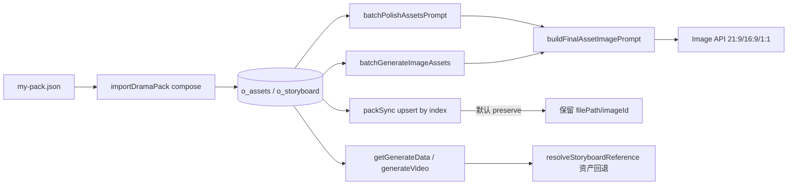

# Drama Pack 智能架构指南（v2.1 / my-pack v1.0.0）

本文档描述 Toonflow drama-pack 引擎的四层架构、字段同步机制、人格分裂资产策略与日常维护流程。

> **v2.1 变更摘要**（2026-07-05）：接入 `visualId` V42 解析、`personalitySwitch`/`L6-trigger`、`imagePromptRules` 三段语义（must-include / strip / CODE 引用）、PersonaAware T1 跳过、XC→LZH 同脸 reference 链、CEO 夜景 2800K 路由。详见 [`pack-persona-asset-guide.md`](./pack-persona-asset-guide.md)。

## 1. 四层架构

```
Layer 0  Normalize + Aliases     packNormalizer.ts
Layer 1  Field Registry         packFieldRegistry.ts + rules/* + productionRuleEngine.ts
Layer 2  Derivation + Sync       packDerivation.ts + packSync.ts + assetReconcile.ts
Layer 3  Validate + Coverage    validate.ts + buildCoverageReport()
```

| 层 | 职责 | 关键文件 |
|----|------|---------|
| L0 | author-v3 → canonical；L0-baseModel 别名；**imagePromptRules 与 constraints 双轨** | `packNormalizer.ts`, `tieredAssetPolicy.ts` |
| L1 | productionSpec/characterAssets → imagePrompt / videoDesc / associateCodes | `packFieldRegistry.ts`, `rules/*`, `productionRuleEngine.ts` |
| L2 | pack 变更 → deriveHash → 增量 recompose；stale 检测 | `packDerivation.ts`, `packSync.ts` |
| L3 | V24–V43、personalitySwitch、imagePromptRules 合规 | `validate.ts` |

## 2. 三层资产模型（零情绪 lockCode）

| 层级 | lockCode 示例 | 来源 | 用途 |
|------|--------------|------|------|
| **T0 脸型锚点** | `CHAR-WRJ` | `四视图.完整提示词` + L0-baseModel | 必须先生图；referenceList 同脸 |
| **T1 服化阶段** | `CHAR-WRJ:日常` | `分镜引用prompt_*` / L4 | 多服化角色必须；**LZH/XC 人格分裂角色可跳过** |
| **T2 表情** | （无独立资产） | 分镜 `imagePrompt` + `performance` + `videoPrompt` | 每镜文字描述 |

**PersonaAware 策略**（`personaPolicy.ts` + `composePackAssets`）：

- **WRJ**：保留 T1×3（`日常/潜入/落魄`）— 同脸、多服化
- **LZH / XC**：单服化人格 → **不建** `CHAR-LZH:白天` / `CHAR-XC:夜晚` DB 衍生行；`associateCodes` 仅链 T0
- **人格切换**：换 `assetCodes`（`CHAR-LZH` → `CHAR-XC`），非换 T1 stage

**禁止**：`CHAR-WRJ:震惊` 等情绪 lockCode。`import --reconcile-assets` 会删除错误衍生资产。

## 3. Registry Rules（imagePrompt 通道）

| Rule ID | 优先级 | Spec Block | 行为 |
|---------|--------|------------|------|
| `shotTypeRecommend` | 8 | shotTypeRules | 空 prompt 时按 emotionIntensity inject 景别英文 |
| `imagePromptRules` | 15 | imagePromptRules | **必须包含** inject；**禁止** strip；CODE 引用校验 |
| `colorToneMapping` | 10 | colorToneMapping | tone / colorTemp / saturation |
| `colorToneContrast` | 12 | colorToneMapping | contrast 数值 |
| `sceneColorRule` | — | sceneColorLock | 场景色温 |
| `sceneNightRouting` | 18 | sceneColorLock | CEO 夜景 → 2800K（`SCENE-CEO-night`） |
| `L0-baseModel` | 30 | — | 脸锚前缀；XC inject `same face as CHAR-LZH` |
| `cameraAnchor` | — | cameraAnchor | 机位英文化 |
| `constraints` | 50 | constraints | **仅** strip `禁止:` 词（与 imagePromptRules 双轨） |

**productionRuleEngine 内建**（manifest 已登记）：`transitionRules`、`dialogueActionSync`、`soundDesign`、`systemUIAppearance`、`emotionPerformanceMapping`、`personalitySwitch`（associate + videoDesc）。

完整清单：`yarn drama-pack manifest` → `docs/pack-field-manifest.md`。

## 4. 字段 → 输出通道

### 自动进生图（imagePrompt）

- `colorToneMapping`（含 **contrast**）、`sceneColorLock` / `sceneDesign`
- **`sceneNightRouting`**：镜 25–27 CEO 夜景 → 2800K
- `cameraAnchor` + `visualFocus.拍摄要求`（英文化）
- `characterAssets.分镜引用prompt_*`（服化 merge）
- `L0-baseModel.锁定描述`（前缀）；XC **same face as CHAR-LZH**
- `continuityTracking`、L5 磨损痕迹
- **`imagePromptRules`**：must-include inject + 禁止 strip
- **`constraints`**：仅 strip 禁止词（不含 must-include 语义）
- `--cref`/`--sref` token 在 merge 时 strip

### 自动进视频手册（videoDesc）

- `performance` 全字段含 `microExpression` / `physiological`
- `emotionPerformanceMapping`（performance 稀疏时 fallback）
- `transitionRules` + `emotionIntensity` 差 + **`personalitySwitch.progress`**
- **`L6-trigger`** → videoDesc 后缀 + 人格切换 `rule:人格切换`
- `dialogueActionSync`、`soundDesign` / `systemUIAppearance`
- `L6-personality` 精选行为 hint
- `cameraAnchor.name`、`characterFacing`、`positionInScene`

### associateCodes（referenceList）

- `resolveWardrobeAssociateCodes`：visualId V42 → T0 + 可选 T1
- **LZH/XC**：跳过 `:白天`/`:夜晚`；XC 镜前置 `CHAR-LZH`（同脸 secondary ref）
- `personalitySwitch` / `L6-trigger` 含雪辞 → 强制 `CHAR-XC`
- import 时 **LZH 排在 XC 前**（`resolveAssetIds` 排序）

### 剪辑/发布层（shotMeta.postProductionHints）

- `bgmRules` 或 **`episode.productLayer.bgm`** → `bgmHint`
- `subtitleRules` → `subtitleHint`
- `platformAdaption.默认` → `platformHint`

### 仅校验 / 存档

- `outputFormatRules`、`editingRules`
- `shotTypeRules.forbidden`（recommended 已部分进 compose）
- `characterAssetRules`（urban profile-skipped）
- `versionTracking`、`交付物清单`、`交付报告`

## 4.1 三通道与前端字段映射

Pack 规则经 compose 写入 DB 后，前端展示与生图/生视频 API 走三条独立通道：

| 通道 | Pack 来源 | DB 字段 | 前端 UI | 生图/生视频 API |
|------|-----------|---------|---------|----------------|
| **资产** | visualLock + characterAssets + assetPromptRules | `o_assets.prompt` | 资产库提示词框 | `batchGenerateImageAssets` / `batchPolishAssetsPrompt` / `batchGenerateAssetsImage` |
| **分镜** | storyboard + productionRuleEngine | `o_storyboard.prompt` / `videoDesc` / `videoPrompt` | 分镜生图；**videoDesc 默认不展示** | 分镜生图 API |
| **视频 track** | pack `videoPrompt` → sync 后 AI 扩写 | `o_videoTrack.prompt` | **视频面板 textarea** | `batchGeneratePrompt` |

**关键行为（v2.2）**：

- **资产通道**：`composePackAssets` + `applyAssetPromptRules` 为 scene/prop 注入 `PURE-SCENE` / `PURE-PROP` 与 `sceneGenerationRules.forbidden`；T0 四视图 / T1 服化单图由 `assetTierUtils.detectAssetTier(lockCode)` 决定；prop 生图比例 `1:1`。
- **分镜通道**：`imagePromptRules` 按 `shot.type` 注入；完整 `videoDesc`（音效/台词/表演/L6）写入 `o_storyboard.videoDesc`。
- **视频通道**：import 时 `o_videoTrack.prompt` = 短 `videoPrompt`；**sync 默认**调用 `expandProjectVideoTracks`（`respectImport=false`）用 `videoDesc` AI 扩写；recompose 分镜后同步刷新同 script 的 track。
- **derive API**：`batchGenerateAssetsImage` 在 `promptSource=import` 时**保留** pack prompt，不 AI 覆盖。

禁用 sync 自动扩写：`yarn drama-pack sync <id> ./pack.json --no-expand-video-prompts`

自测：`yarn drama-pack audit <projectId> ./my-pack.json`

## 5. visualId V42 格式

```
CHAR-CODE-阶段_动作     例：CHAR-LZH-白天_发现照片
SCENE-CODE_动作         例：SCENE-CEO_夜景
```

解析器：`visualIdParser.ts` → `parseVisualId()` / `wardrobeStageFromVisualId()`。

validate `VISUAL_ID_FORMAT` 已支持 V42；旧版 `角色名-阶段` 仍兼容。

## 6. imagePromptRules 双轨语义

| 块 | 语义 | compose 行为 |
|----|------|-------------|
| `productionSpec.imagePromptRules` | `必须包含:` / `禁止:` / `引用 CODE` | inject + strip + validate |
| `productionSpec.constraints` | 仅 `禁止:` 列表 | strip only |

**不再**将 imagePromptRules 别名复制到 constraints（`packNormalizer.syncProductionSpecAliases` 已禁用）。

示例（PURE-PROP）：

```json
"PURE-PROP": "必须包含: isolated, no hands, no person；比例 1:1；引用 PROP-CODE"
```

compose 后 imagePrompt 应含 `isolated, no hands, no person`。

## 7. personalitySwitch 与 L6-trigger

| 字段 | 镜 26 | 镜 27 |
|------|-------|-------|
| `personalitySwitch.progress` | `0%` | `100%` |
| `assetCodes` | `CHAR-LZH` | `CHAR-XC` |
| `videoDesc` | `rule:人格切换` + `persona:0%` | `rule:人格切换` + `progress:100%` |

validate：

- `progress=0%` → assetCodes 含 `from`
- `progress=100%` → assetCodes 含 `to`
- `L6-trigger` 含雪辞 → 建议 `CHAR-XC`

## 8. CLI 命令

```powershell
yarn drama-pack validate ./my-pack.json    # 0 error（允许 warning/info）
yarn drama-pack coverage ./my-pack.json    # 字段覆盖与 compose 一致
yarn drama-pack manifest                   # 重生 pack-field-manifest.md
yarn drama-pack sync <projectId> ./my-pack.json
yarn drama-pack audit <projectId> ./my-pack.json   # compose vs DB 对比，0 error 为通过
```

projectId 可用 scriptId（如 `1783139403414`），引擎自动解析为 `1783139305612`。

## 9. my-pack v1.0.0 验收清单

- [x] validate 0 error
- [x] sync 成功
- [x] T0×3（WRJ/LZH/XC）；T1 仅 WRJ×3（LZH/XC 跳过）
- [x] 镜 26→27 personalitySwitch + `rule:人格切换`
- [x] visualId V42 无 VISUAL_ID_FORMAT warning
- [x] PURE-PROP imagePromptRules inject
- [x] XC associate 含 CHAR-LZH（同脸链）
- [x] CEO 夜景 2800K（sceneNightRouting）

## 10. 故障排查

| 现象 | 原因 | 处理 |
|------|------|------|
| PURE-PROP 误报禁止词 | 旧版 constraints 别名 | 已拆双轨；重跑 sync |
| XC 换脸 | 未链 LZH T0 | 确认 associate 含 CHAR-LZH |
| 夜景色温偏冷 | 仅用 SCENE-CEO 4500K | sceneNightRouting 已注入 2800K |
| personalitySwitch schema 失败 | null 被 normalize 为 `—` | 已豁免 personalitySwitch |
| manifest 显示 archived 但已应用 | 硬编码在 engine | 查 manifest 内建规则段 |
| 视频提示词含路由推理 | user 缺 mode/多参；fallback skill | 见 playbook P1；`sanitizeVideoPromptOutput` |
| T0/T1 衍生换脸 | T1 无 T0 referenceList | T0 先出图；`batchGenerateImageAssets` 自动引用 |
| 工作台 segment 排版乱 | VueDraggable 缺 flex CSS | 更新 Toonflow-web `track.vue` |
| dev:gui ABI 127/143 | better-sqlite3 未为 Electron 编译 | `yarn rebuild:electron` |

更多人格/脸锚决策树见 [`pack-persona-asset-guide.md`](./pack-persona-asset-guide.md)。

## 11. 运行时四通道（v3）

Pack compose 写入 DB 后，以下四条运行时管线必须闭环，否则会出现「import 正确、生图/视频/sync 仍错」：



| 通道 | 关键模块 | 职责 |
|------|---------|------|
| **Polish** | `batchPolishAssetsPrompt` + `buildFinalAssetImagePrompt` | 润色后二次 merge；T0 四视图 / scene no people / prop 1:1 |
| **ImageGen** | `batchGenerateImageAssets` / `batchGenerateAssetsImage` | 与 polish 共用 builder；T0 画幅 `21:9` |
| **Sync** | `upsertEpisodeStoryboards`（默认 `preserveStoryboardImages=true`） | 按 index 保留分镜图；`--replace-storyboards` 全量替换 |
| **Workbench** | `reorderTracks` / `updateTrackMedias` / `getReferenceCandidates` | segment 排序；参考图持久化；无分镜图时资产图回退 |

**CLI**

```powershell
yarn drama-pack sync <projectId> ./my-pack.json              # 默认保留分镜图
yarn drama-pack sync <projectId> ./pack.json --replace-storyboards
yarn drama-pack audit <projectId> ./pack.json                  # IMAGE_PROMPT_SIMULATION 等
```

**Audit 新增检查码**：`IMAGE_PROMPT_SIMULATION`、`BROKEN_STORYBOARD_IMAGE`、`GENDER_DESCRIBE_MISMATCH`、`VIDEO_PROMPT_REASONING_LEAK`。

**端到端制作 Playbook**：[`short-drama-quality-playbook.md`](./short-drama-quality-playbook.md) — SOP、质量门禁、问题登记簿。
