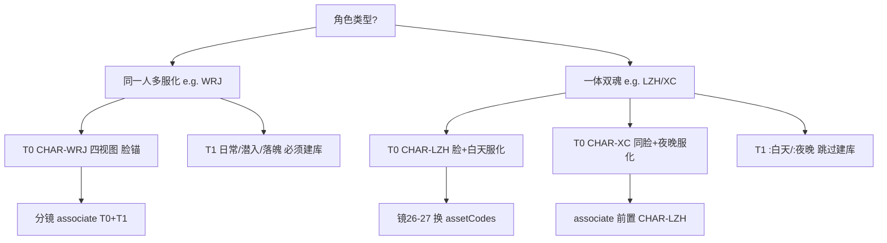

# Drama Pack 人格分裂与脸锚资产指南

> 面向 my-pack v1.0.0（兰芷蘅 / 雪辞一体双魂）及同类项目的资产分层、compose 与验收规范。

## 1. 核心问题速答

| 问题 | 答案 |
|------|------|
| `CHAR-LZH:白天` 有没有固定脸？ | **没有**。固定脸在 **T0 `CHAR-LZH`**（四视图 + L0-baseModel），`:白天` 仅是服化参考 lockCode |
| 人格分裂要不要 T1？ | **建议跳过**。LZH/XC 各仅一套服化，四视图已含唯一造型；人格用 **换 CHAR 码** 表达 |
| XC 如何保持同脸？ | T0 文案 `same face as CHAR-LZH` + **associate 链** `CHAR-LZH` → `CHAR-XC` + facePrefixRule inject |
| 镜 26→27 怎么切？ | `assetCodes` 从 `CHAR-LZH` 换为 `CHAR-XC`；`personalitySwitch.progress` 0%→100% |

## 2. 决策树：多服化 vs 人格分裂



## 3. 三层脸锚 vs 服化（my-pack 实测）

| 层级 | CHAR-LZH（兰芷蘅） | CHAR-XC（雪辞） | 固定脸？ |
|------|-------------------|-----------------|---------|
| **L0-baseModel** | 深棕瞳、凤眼… | `same face as CHAR-LZH` + 瞳孔血丝 | **是** |
| **T0 四视图** | 高马尾+西装 turnaround | 披发+睡袍 turnaround | **是（必须先出图）** |
| **T1 :白天/:夜晚** | `分镜引用prompt_白天` | `分镜引用prompt_夜晚` | **否** — 仅服化参考，脸靠 T0 referenceList |
| **T2 表情** | imagePrompt + performance | 同上 | 每镜文字，无 lockCode |

### 引擎实现（PersonaAwareTieredPolicy）

文件：`personaPolicy.ts`、`promptComposer.composePackAssets`、`packFieldRegistry.resolveWardrobeAssociateCodes`

```typescript
// LZH/XC 且 L4≤1 套服化 → 跳过 T1 衍生资产
shouldSkipT1ForChar("CHAR-LZH", entry) // → true
shouldSkipT1ForChar("CHAR-WRJ", entry) // → false
```

**DB 期望**（EP01 验收）：

- T0：`CHAR-WRJ`、`CHAR-LZH`、`CHAR-XC`
- T1：仅 `CHAR-WRJ:日常`、`CHAR-WRJ:潜入`、`CHAR-WRJ:落魄`
- **无** `CHAR-LZH:白天`、`CHAR-XC:夜晚`（或存在但不作脸锚、不 associate）

## 4. 同脸 reference 链（sameFaceRefChain）

### compose 侧

1. `facePrefixRule`：XC 镜 inject `same face as CHAR-LZH`
2. `finalizeAssociateCodes`：XC 分镜 associate 列表 **前置** `CHAR-LZH`
3. `importDramaPack.resolveAssetIds`：插入 DB 时 **LZH 排在 XC 前**（referenceList 顺序）

### 作者侧 pack 写法

```json
"CHAR-XC": {
  "L0-baseModel": {
    "锁定描述": "same face as CHAR-LZH, green spiderweb veins in sclera..."
  },
  "四视图": { "完整提示词": "..." }
}
```

分镜镜 27：

```json
"assetCodes": ["CHAR-XC"],
"visualId": "CHAR-XC-雪辞_初登场",
"imagePrompt": "... --cref CHAR-XC --sref SCENE-CEO"
```

sync 后 `associateCodes` 应含：`CHAR-LZH`, `CHAR-XC`, `SCENE-CEO`（及 PROP 等）。

## 5. personalitySwitch 与 L6-trigger

### 镜 26（切换起点，progress 0%）

```json
{
  "assetCodes": ["CHAR-LZH", "PROP-PHONE"],
  "visualId": "CHAR-LZH-白天_发现照片",
  "personalitySwitch": {
    "enabled": true,
    "from": "CHAR-LZH",
    "to": "CHAR-XC",
    "progress": "0%",
    "visualMark": "深棕瞳孔，无血丝，尚未切换"
  },
  "L6-trigger": "状态:平静→察觉"
}
```

### 镜 27（切换完成，progress 100%）

```json
{
  "assetCodes": ["CHAR-XC"],
  "visualId": "CHAR-XC-雪辞_初登场",
  "personalitySwitch": {
    "enabled": true,
    "from": "CHAR-LZH",
    "to": "CHAR-XC",
    "progress": "100%",
    "visualMark": "青色蛛网血丝完全蔓延，瞳孔泛青光"
  },
  "L6-trigger": "状态:雪辞人格切换完成"
}
```

### compose 输出（videoDesc）

- `rule:人格切换 1.5s`（来自 transitionRules）
- `persona:0%` / `progress:100%`
- `L6:状态:雪辞人格切换完成`

### validate 规则

| 检查码 | 条件 |
|--------|------|
| `PERSONALITY_SWITCH_ASSET` | progress=0% → assetCodes 含 `from`；100% → 含 `to` |
| `L6_TRIGGER_PERSONA` | L6-trigger 含雪辞 → 建议 CHAR-XC |
| `PERSONALITY_VISUAL_ID` | progress=100% 时 visualId 角色码应与 `to` 一致 |

## 6. visualId V42 与 wardrobe 回落

格式：`CHAR-CODE-阶段_动作`

| visualId | 解析结果 | wardrobe stage | associate |
|----------|----------|----------------|-----------|
| `CHAR-LZH-白天_发现照片` | char=LZH, stage=白天, action=发现照片 | 白天（跳过 T1） | CHAR-LZH |
| `CHAR-XC-雪辞_初登场` | char=XC, stage=雪辞, action=初登场 | 夜晚（fallback） | CHAR-LZH, CHAR-XC |
| `CHAR-WRJ-日常_新任务` | char=WRJ, stage=日常 | 日常 | CHAR-WRJ, CHAR-WRJ:日常 |

情绪 stage（震惊、社死…）**禁止**作 T1 lockCode；`mapVisualIdToWardrobeStage` 回落到 `WARDROBE_FALLBACK`。

解析器：`src/lib/dramaPack/visualIdParser.ts`

## 7. CEO 夜景色温（sceneNightRouting）

镜 25–27 使用 `SCENE-CEO` assetCode，但 `sceneName` / `colorTone` 为夜景：

- `isNightCeoShot()`：sceneName 含 CEO/夜景，或 colorTone=`雪辞出现`，或 visualId 含 CEO_02/03
- `sceneNightRule`：从 `sceneColorLock` 读取 `SCENE-CEO-night.baseTemp=2800` 注入 imagePrompt

作者可在 pack 保留 `SCENE-CEO`（日景资产），引擎在夜景镜自动叠加 2800K，无需改 assetCodes。

## 8. imagePromptRules 与 constraints 分工

| 块 | 示例 | compose |
|----|------|---------|
| `imagePromptRules.PURE-PROP` | `必须包含: isolated, no hands` | **inject** |
| `constraints.PURE-PROP` | `禁止: person, hands` | **strip** |

**不要**把 imagePromptRules 复制到 constraints（v2.1 已禁用别名）。

## 9. 字段应用矩阵（my-pack EP01）

| 字段 | compose 通道 | 状态 |
|------|-------------|------|
| `visualId` V42 | associate / stagePrompt lookup | ✅ applied |
| `personalitySwitch` | associate + videoDesc | ✅ applied |
| `L6-trigger` | videoDesc | ✅ applied |
| `imagePromptRules` | imagePrompt inject/strip | ✅ applied |
| `colorToneMapping.contrast` | imagePrompt | ✅ applied |
| `shotTypeRules.recommended` | imagePrompt（空 prompt 时） | ✅ partial |
| `productLayer.bgm` | postProductionHints | ✅ partial |
| `sceneColorLock` SCENE-CEO-night | imagePrompt 2800K | ✅ applied |
| `emotionPerformanceMapping` | videoDesc fallback | ✅（my-pack 每镜已填 performance → 等价未触发） |

## 10. 操作清单

```powershell
# 1. 校验 pack
yarn drama-pack validate ./my-pack.json

# 2. 同步到项目（scriptId 可自动解析 projectId）
yarn drama-pack sync 1783139305612 ./my-pack.json

# 3. 确认资产：T0 先生图，WRJ T1 后做，LZH/XC 仅 T0
# 4. 镜 26–27 检查 videoDesc 含 rule:人格切换
# 5. XC 镜检查 associate 含 CHAR-LZH
```

## 11. gender 字段映射（视频/生图 AI 载荷）

| Pack 字段 | DB / compose | 运行时通道 |
|-----------|--------------|-----------|
| `characterAssets.*.gender` | `o_assets.describe` 英文锚点 | `formatAssetPayloadForAi` → 视频工作台 XML |
| `narrative.characters[].gender` | fallback 读取 | `batchPolishAssetsPrompt` 结构化输入 |
| `L0-baseModel.锁定描述` | T0 describe 前缀 | 含 `young Chinese male/female` |
| `L1-makeup` | merge 进 describe | 润色 user 输入 |
| `L6-personality` | `videoDesc` | 依赖 `characterAssets` 持久化到 scriptAgent |

**持久化**：`importDramaPack` 显式写入 `scriptAgent.characterAssets` / `continuityTracking`（不经 `extractPackExtensions` 排除）。

**校验**：`yarn drama-pack audit` → `GENDER_DESCRIBE_MISMATCH`（如 CHAR-WRJ 缺 male/男）。

## 12. T0/T1 视觉一致性期望 vs 实现

| 维度 | 期望 | 当前实现 |
|------|------|---------|
| 脸型 | T0 锚点；T1 同脸 | T1 `same face` 文本锚点；**T1 生图自动引用 T0 图**（`batchGenerateImageAssets`） |
| 服化 | T1 可变（日常/潜入/落魄） | `分镜引用prompt_*` 短标签 + 16:9 单图 |
| 构图 | T0 四视图 21:9 | `buildFinalAssetImagePrompt` enforce back view |
| 手册 vs 运行时 | 一致 | derivative 手册曾要求四视图 img2img；builder 强制单 pose — 见 playbook P2 |

**原则**：允许服化差异，**不允许换脸**。详见 [`short-drama-quality-playbook.md`](./short-drama-quality-playbook.md) §P2。

## 13. 常见错误

| 错误写法 | 后果 | 正确做法 |
|----------|------|----------|
| 镜 26 assetCodes 用 CHAR-XC | 切换前脸错 | progress 0% 用 CHAR-LZH |
| 建 CHAR-LZH:白天 作脸锚 | 第二套脸漂移 | 仅 T0；T1 跳过或 optional |
| personalitySwitch: null 被 normalize 为 `—` | schema 失败 | 已豁免；保持 JSON `null` |
| imagePromptRules 写入 constraints | must-include 变 strip | 双轨分开写 |
| XC 生图不 cref LZH | 换脸 | associate 链 + same face 文案 |

---

相关文档：[`pack-architecture-guide.md`](./pack-architecture-guide.md)、[`pack-field-manifest.md`](./pack-field-manifest.md)
