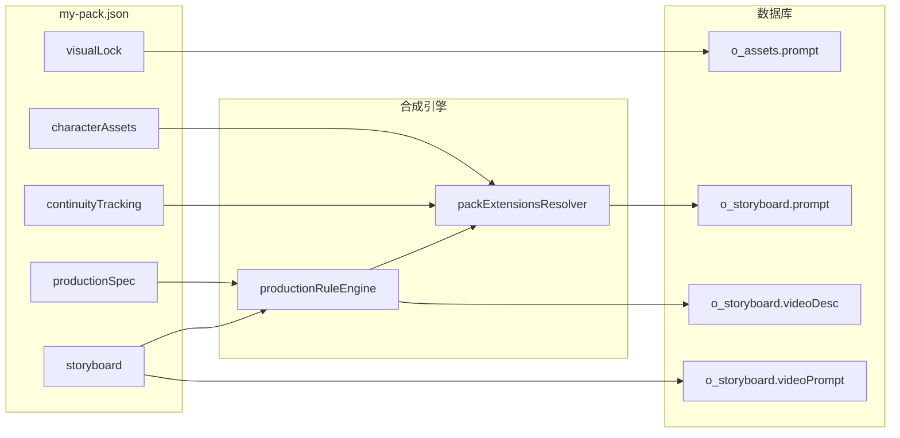

# drama-pack 字段 → 提示词智能应用：完整说明

> 适用版本：drama-pack v1.2 + packExtensions 引擎  
> 示例 pack：[`my-pack.json`](../my-pack.json)（《社畜的末路告白》EP01）  
> 核心实现：[`packExtensionsResolver.ts`](../src/lib/dramaPack/packExtensionsResolver.ts)、[`productionRuleEngine.ts`](../src/lib/dramaPack/productionRuleEngine.ts)、[`promptComposer.ts`](../src/lib/dramaPack/promptComposer.ts)

本文档说明 **my-pack.json 中各字段如何进入实际生图/生视频提示词**，以及本次完成的引擎增强与 pack 数据更新。

相关文档：[productionSpec 全字段教程](./productionSpec-tutorial.md)

---

## 0. 双格式支持与 normalize（v1.2+）

Toonflow 支持两种 pack 写法：

| 格式 | 标识 | 样例 | 说明 |
|------|------|------|------|
| **标准 canonical v1.2** | `meta.packFormat: "canonical-v1.2"`（或含完整 `plan.visualLock`） | [`drama-pack.example.json`](../data/examples/drama-pack.example.json) | 直接 import，无自动修复 |
| **作者 author-v3** | `镜号` / `sceneName` / `narrative` / `characterAssets` | [`drama-pack.author.example.json`](../data/examples/drama-pack.author.example.json)、[`my-pack.json`](../my-pack.json) | import 前自动 normalize |

### 作者格式 → 标准字段（自动）

| 作者字段 | 标准字段 | 规则 |
|---------|---------|------|
| `time: "0-3s"` | `duration: 3` | 解析区间秒数 |
| `directorNotes: []` | `directorNotes: "..."` | 数组 join |
| `sceneName` | `content` + `visualId` | 缺 content 时用 sceneName；visualId 从 assetCodes + sceneName 推断 |
| `characterAssets` | `plan.visualLock` | 合成 CHAR/SCENE/PROP |
| `narrative.*` | `plan.storySkeleton` 等 | 文本/对象转字符串 |
| `imagePromptRules` | `productionSpec.constraints` | 别名映射 |
| `continuityTracking.道具.*` | 扁平 `咖啡杯.镜7` | hint 注入用 |

### CLI

```bash
# 校验（内部先 normalize，info 级报告自动修复项）
yarn drama-pack validate ./my-pack.json

# 只看 fixes 报告
yarn drama-pack normalize ./my-pack.json --dry-run

# 写出 canonical pack 供 review
yarn drama-pack normalize ./my-pack.json -o ./my-pack.canonical.json

# 导入（同样先 normalize）
yarn drama-pack import <projectId> ./my-pack.json

# 增量同步：import + 全量 merge recompose + 资产 reconcile（推荐改 pack 后用）
yarn drama-pack sync <projectId> ./my-pack.json

# 字段覆盖率报告
yarn drama-pack coverage ./my-pack.json

# 项目 DB 状态（含 packContentHash / stale 人脸提示计数）
yarn drama-pack status <projectId>
```

实现：[`packNormalizer.ts`](../src/lib/dramaPack/packNormalizer.ts)、[`packSync.ts`](../src/lib/dramaPack/packSync.ts)

### sync 与 import 区别

| 命令 | 行为 |
|------|------|
| `import` | 写库 + 可选 `--merge-plan` / `--reconcile-assets`；**不**自动 recompose |
| `sync` | import + **始终** merge recompose 分镜提示词；face/stage 域变更时同步资产 prompt |
| `recompose-all` | 仅重算已有 DB 行的 prompt，不读 pack 结构变更 |

改 pack 后请用 **sync**，不要只 import。UI 数据在 **剧本 → EP01 → 制作**，不在小说 tab。

---

## 1. 四层数据模型

| 层级 | my-pack 中的块 | 引擎等级 | 落库位置 |
|------|----------------|---------|---------|
| **规范层** | `productionSpec.*` | A/B/C | `scriptAgent.productionSpec` |
| **锁定层** | `plan.visualLock` | A | `o_assets.prompt` + 分镜参考图关联 |
| **分镜层** | `episodes[].storyboard[]` | A | `o_storyboard.prompt` / `videoDesc` / `videoPrompt` |
| **扩展层** | `characterAssets`、`continuityTracking` | **A（v1.2+）** | `scriptAgent.packExtensions` + merge 时查表 |



---

## 2. 双通道原则（生图 vs 生视频）

| 目的 | 写字段 | 语言 | 策略 |
|------|--------|------|------|
| 静态画面 / 光影 / 构图 | `imagePrompt` | 英文 | **直通** + merge 补缺失片段 |
| 镜头运动 / 时间轴动画 | `videoPrompt` | 英文 | **直通**，import 后视频 API 不重写 |
| 微表演 / 呼吸 / 视线 | `performance` | 中文 | 合并进 `videoDesc` 动作位 |
| 规则查表（色温/转场/音效） | `colorTone`、`transition*`、`sound` | 键名/文本 | productionSpec 查表或分镜优先 |

**不要**把视频手册、中文 globalStyle 长段写进 `imagePrompt`（旧版污染模式，已修复）。

---

## 3. 角色与资产

### 3.1 三个数据源及其职责

my-pack 中角色信息出现在三处：

| 数据源 | 用途 | 引擎读取 |
|--------|------|---------|
| `plan.visualLock.characters[]` | 资产锁定码、基础 prompt、stages | `composePackAssets` |
| `characterAssets` | L1–L5 服化决策、分镜引用 prompt、四视图 | `packExtensionsResolver` |
| 分镜 `imagePrompt` | 单镜最终英文描述 | merge 保留原文 |

**权威策略（本次 pack 已对齐）**：

- **四视图定妆** → `characterAssets.*.四视图.完整提示词` 同步到 `visualLock.prompt`（基础 CHAR-* 资产）
- **阶段服化** → `characterAssets.分镜引用prompt_{阶段}` 同步到 `visualLock.stages[].visualMark`
- **分镜近景** → 分镜 `imagePrompt` 手工 baked；recompose 时从 `characterAssets` **补缺失英文片段**

### 3.2 characterAssets 引擎行为（新增）

[`lookupCharacterStagePrompt`](../src/lib/dramaPack/packExtensionsResolver.ts)：

1. 从 `visualId`（如 `温如珏-日常`）解析角色 + 阶段名
2. 查 `characterAssets[CHAR-WRJ].分镜引用prompt_日常`
3. merge 模式下，将 prompt 中**尚未出现**的英文片段追加到 `imagePrompt`

[`lookupTurnaroundPrompt`](../src/lib/dramaPack/packExtensionsResolver.ts)：

- 基础角色资产（非 stage 衍生）优先使用 `四视图.完整提示词` 作为 `o_assets.prompt`

### 3.3 参考图机制

- prompt 中的 `--cref CHAR-WRJ`、`--sref SCENE-OFFICE` 仅为**文档标记**
- 实际参考图来自 `o_assets2Storyboard` 已生成图片
- **必须先完成资产生图**，再分镜生图

---

## 4. productionSpec 字段应用表

| 字段 | 触发条件 | imagePrompt | videoDesc |
|------|---------|-------------|-----------|
| `colorToneMapping` | 分镜 `colorTone` 键名匹配 | tone/色温/saturation 前缀（去重） | 光影/情绪位 |
| `sceneColorLock` → sceneDesign | assetCodes 含 SCENE-* 且无色温 | `color temperature NK` | — |
| `transitionRules` | emotionIntensity 差值 + transition* | — | 运镜位 |
| `dialogueActionSync` | dialogue 粗分类 | — | `[actionLead:…]` |
| `soundDesign` | 分镜 `sound` **为空** | — | 环境音/心跳 |
| `systemUIAppearance` | **新增**：PURE-PROP + PROP-SYS + sound 空 | — | 补系统音效 |
| `constraints` | type=PURE-* | strip 禁止词 | — |
| `shotTypeRules` | intensity + shotType | — | validate warning only |
| `editingRules` / `subtitleRules` | — | — | 文档/validate |

---

## 5. 分镜富字段

| 字段 | 生图 | 生视频 | 说明 |
|------|------|--------|------|
| `imagePrompt` | **主输入** | — | merge 保留 + 扩展层补全 |
| `videoPrompt` | — | **主输入** | 本次 EP01 **28/28 镜已补齐** |
| `performance` | — | videoDesc 动作位 | 7 维表演描述 |
| `visualId` | stageMark + characterAssets 查表 | videoDesc 情绪 | 对齐 stages 或 `分镜引用prompt_*` |
| `assetCodes` | 参考图关联 | videoDesc 资产 ID | 雪辞镜用 `CHAR-XC` 非 `CHAR-LZH` |
| `type` | 模板 + constraints | — | PURE-SCENE/CHAR-SCENE 等 |
| `content` | 间接 | videoDesc 画面描述 | 连续性状态可写在此 |

---

## 6. continuityTracking（新增引擎 + pack 烘焙）

### 6.1 引擎行为

[`buildContinuityHints`](../src/lib/dramaPack/packExtensionsResolver.ts) 解析镜号键：

- `镜7` → 第 7 镜（1-based）
- `镜2-21` → 第 2–21 镜

在 recompose/import merge 时，将状态转为英文 hint 追加到 `imagePrompt`（去重），例如：

- 咖啡杯：`full coffee mug, liquid 1cm below rim`
- 黑眼圈：`dark circles intensity 2/5`
- 领带：`loose blue striped tie tilted 15 degrees left`

### 6.2 pack 内显式烘焙（本次已做）

关键镜已在 `content` / `imagePrompt` 写入状态，避免仅依赖引擎：

| 镜号 | 连续性项 | 烘焙内容 |
|------|---------|---------|
| 7 | 咖啡杯满杯 | `full coffee mug, liquid 1cm below rim` |
| 12 | 液面波动 | `coffee level near rim` |
| 16 | 泼洒 | content 补充「液面倾斜45°」 |
| 17 | 空杯 | `empty mug, 1cm residue at bottom` |

---

## 7. 视频设置

### 7.1 三级 videoPrompt

| 级别 | 位置 | 用途 |
|------|------|------|
| **单镜** | `storyboard[].videoPrompt` | 每镜 2–5s 可见动画（**本次 28 镜全部补齐**） |
| **高光轨** | `keyPrompts[].videoPrompt` | 段落级运镜（茶水间告白、雪辞初登场） |
| **自动生成** | `videoDesc` | AI 扩写兜底（无 import videoPrompt 时） |

### 7.2 雪辞镜修正（本次）

原第 26 镜（`兰芷蘅-夜晚`）使用 `CHAR-LZH` + 披发睡袍，与白天人格参考图冲突。

**已修正为**：

- `visualId`: `雪辞-夜晚`
- `assetCodes`: `["CHAR-XC", "PROP-PHONE", "SCENE-CEO"]`
- `imagePrompt`: CHAR-XC 夜晚造型，**尚无绿色血丝**（人格切换前奏）
- 第 27 镜：完整血丝 + 台词（`CHAR-XC` 已正确）

---

## 8. 本次代码变更摘要

| 文件 | 变更 |
|------|------|
| `src/lib/dramaPack/packExtensionsResolver.ts` | **新建**：characterAssets / continuityTracking / systemUI 解析与 merge |
| `src/lib/dramaPack/productionRuleEngine.ts` | 接入 extensions；systemUI sound 补全 |
| `src/lib/dramaPack/promptComposer.ts` | 四视图资产 prompt；compose 传递 extensions |
| `src/lib/dramaPack/importDramaPack.ts` | import 时传递 packExtensions |
| `src/lib/dramaPack/recomposeDramaPack.ts` | recompose 从 DB 读 packExtensions |
| `scripts/patch-my-pack.ts` | 一次性 pack 数据补丁脚本 |
| `my-pack.json` | videoPrompt×28、meta.episodeCount=1、雪辞镜、连续性、visualLock 同步 |

---

## 9. 使用工作流

### 9.1 首次导入

```bash
yarn drama-pack validate ./my-pack.json
yarn drama-pack import <projectId> ./my-pack.json
yarn drama-pack status <projectId>
```

### 9.2 修改 pack 或 productionSpec 后

```bash
# 保留 imagePrompt 原文，重跑 merge 规则 + extensions
yarn drama-pack recompose-all <projectId>

# 单剧本
yarn drama-pack recompose <projectId> <scriptId>
```

### 9.3 制作顺序

1. **资产生图** — CHAR/SCENE/PROP 参考图（四视图优先）
2. **分镜生图** — `o_storyboard.prompt` + 关联资产图
3. **视频生成** — `videoPrompt` 直通（import 模式）

### 9.4 项目设置

- `artStyle` 对齐 `meta.artStyleHint`（`realpeople_urban_modern`）
- 画质选手动设为导入建议的 **2K**

---

## 10. 字段编写速查（最佳实践）

### 写 characterAssets 时

```json
"分镜引用prompt_日常": "CHAR-WRJ, young Chinese male, ...（英文，无 --ar）",
"四视图": {
  "完整提示词": "... four-view character sheet, front view, side view ..."
}
```

- `分镜引用prompt_{阶段}` 键名必须与 `visualId` 后缀一致（`温如珏-日常` → `_日常`）
- L1–L5 是策划决策记录；真正进模型的是 `分镜引用prompt_*` 和 `四视图`

### 写分镜时

```json
{
  "visualId": "温如珏-日常",
  "assetCodes": ["CHAR-WRJ", "SCENE-OFFICE"],
  "colorTone": "紧张",
  "type": "CHAR-SCENE",
  "imagePrompt": "Close-up of CHAR-WRJ, ... English only ... --cref CHAR-WRJ --sref SCENE-OFFICE",
  "videoPrompt": "Slow zoom in, yawn, eyes watering, blink once",
  "performance": { "gaze": "直视屏幕，涣散", ... }
}
```

### 写 continuityTracking 时

```json
"咖啡杯": {
  "镜7": "右手, 满杯, 液面距杯沿1cm",
  "镜17": "右手垂落, 空杯, 杯底残余1cm"
}
```

- 引擎会在对应镜号 merge 英文 hint
- **关键状态仍建议写入** `content` / `imagePrompt` 双保险

---

## 11. 已知局限

1. **emotion 型 visualId**（如 `温如珏-社死`）无对应 `分镜引用prompt_*` 时，回落到「日常/白天/夜晚」fallback prompt
2. **continuityTracking 跨集**（如「第2集开场 3/5」）仅存档，不自动跨 script 注入
3. **shotTypeRules.recommended** 仍仅 validate，不自动改 shotType
4. **`--cref`/`--sref`** 不解析，参考图靠资产关联

---

## 12. 验证清单

导入后确认：

- [ ] `yarn drama-pack status <projectId>` 显示 28 分镜、36 资产
- [ ] 打开 EP01 → 制作 → 每镜有 `videoPrompt`
- [ ] 资产生图 prompt 含四视图描述（CHAR-* 基础资产）
- [ ] 雪辞相关镜关联 `CHAR-XC` 参考图
- [ ] `recompose-all` 后 imagePrompt 无中文视频手册前缀

---

*文档版本：2026-07-04，对应 packExtensions 引擎首次落地。*
