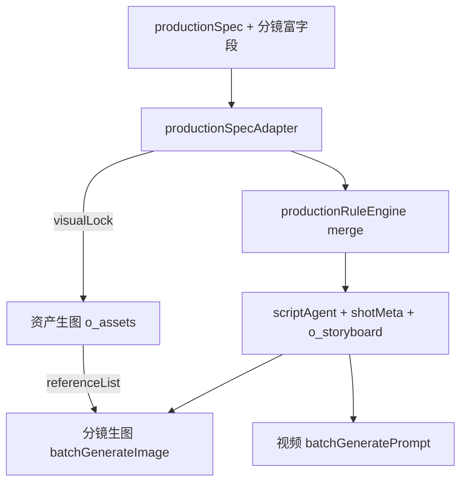

# productionSpec 全字段智能应用教程

> 适用版本：drama-pack **v1.2**  
> 参考实现：[`productionRuleEngine.ts`](../src/lib/dramaPack/productionRuleEngine.ts)、[`productionSpecAdapter.ts`](../src/lib/dramaPack/productionSpecAdapter.ts)  
> 示例 pack：[`my-pack.json`](../my-pack.json)（《社畜的末路告白》）

本文档逐字段说明 `productionSpec` 与分镜富字段在 Toonflow 中的**实际应用程度**：哪些会自动进入生图/生视频，哪些仅校验或存档，以及如何编写才能发挥最大效果。

相关文档：[drama-pack 导入指南](./drama-pack-guide.md) · [pack 字段最佳实践详解](./pack-prompt-best-practices.md)

---

## 1. 概述

### 1.1 productionSpec 是什么

`productionSpec` 是**生产规格书**：在 drama-pack 中集中定义角色/场景/道具外观、色调、表演基线、音效、转场、剪辑等规则。与标准 `plan.visualLock` 的关系：

- 提供 `productionSpec` 时可**省略** `plan.visualLock`，导入时由 [`productionSpecAdapter`](../src/lib/dramaPack/productionSpecAdapter.ts) 自动转换为 visualLock
- 也可两者并存：已有 visualLock 时保留手工版本，productionSpec 仍参与规则合并

### 1.2 智能应用三层等级

| 等级 | 含义 | 典型字段 |
|------|------|---------|
| **A 全自动** | 导入 / recompose 写入 DB，参与生图或生视频 | colorTone、performance、transition、sound（空时补全） |
| **B 半自动** | 转 visualLock、校验 warning、返回建议，需人工确认 | characterDesign、shotTypeRules、costTiers |
| **C 文档型** | 存 pack / flowData，不参与生成 API | continuityLock 细节、editingRules.transition、系统音表 |

### 1.3 merge 策略（v1.2 默认）

**智能合并**：保留分镜已有 `imagePrompt` / `videoPrompt`，仅注入缺失规则（色温、stageMark、表演、转场等）。避免覆盖你在 pack 里手工 baked 的英文 prompt。

代码入口：`applyProductionRules(..., mode: 'merge')`

### 1.4 数据流



**生图关键约束**：[`batchGenerateImage.ts`](../src/routes/production/storyboard/batchGenerateImage.ts) 使用：

1. `o_storyboard.prompt`（合成后的 imagePrompt）
2. `o_assets2Storyboard` 关联资产的**已生成图片**（base64 referenceList）

**不解析** prompt 中的 `--cref` / `--sref` token。一致性依赖：先按 visualLock 生成资产参考图，再关联到分镜。

---

## 2. 持久化与复用

导入后数据落库位置：

| 数据 | 存储位置 | 用途 |
|------|---------|------|
| 完整 productionSpec | `o_agentWorkData` key=`scriptAgent`.productionSpec | recompose、生图失败 hint |
| visualLock | `scriptAgent.visualLock` | recompose 阶段匹配 |
| 每镜富字段 | `o_storyboard.shotMeta`（JSON） | recompose 重建 shot |
| 合成 prompt | `o_storyboard.prompt` / `videoDesc` / `videoPrompt` | 生图 / 生视频 |
| continuityLock | productionAgent flowData | Agent / 人工 QA |

修改 productionSpec 后无需全量重导：

```bash
yarn drama-pack recompose <projectId> <scriptId>
yarn drama-pack recompose <projectId> <scriptId> --rebuild   # 完全重建 prompt
```

API：`POST /api/import/recomposeDramaPack`

---

## 3. productionSpec 字段百科

以下每节格式：**示例** → **应用等级** → **落库/触发** → **代码** → **最佳实践 / 局限**

---

### 3.1 characterDesign（角色设计）

**示例**（摘自 my-pack）：

```json
"CHAR-WRJ": {
  "name": "温如珏",
  "lockFace": "左眼下方泪痣, 泪痣直径1.2mm, 颜色浅褐",
  "intensity": { "darkCircles": 2 },
  "ageRange": "24-26",
  "hair": "黑色碎发, 额前发丝向右偏, 长度盖住额头1/3",
  "wardrobe": {
    "日常": "灰蓝牛津纺衬衫, 深灰直筒裤, 深蓝条纹领带（歪左15°）",
    "潜入": "黑色连帽卫衣, 拉链到顶, 深色束脚裤"
  }
}
```

| 子字段 | 等级 | 落库/用途 | 代码 |
|--------|------|----------|------|
| `name` | B→A | `plan.visualLock.characters[].name` | `visualLockFromProductionSpec` |
| `lockFace` | B→A | 资产 `prompt` + `o_assets.describe` 面部锚点 | `composeAssetPrompt` |
| `hair` / `ageRange` | B | 资产英文 prompt / 中文 desc | `buildCharacterPrompt` |
| `intensity.darkCircles` | B | 角色 desc「黑眼圈强度 2/5」 | `buildCharacterDesc` |
| `wardrobe.{stage}` | A | `stages[].visualMark`；stage 衍生资产 prompt | `collectStagesFromStoryboard` |

**动画说明**：角色层**不定义动画**。表演与运镜由分镜 `performance` + `videoPrompt` 驱动（见第 4 节）。

**最佳实践**：

- `visualId` 与 wardrobe 键对齐，如 `温如珏-日常` ↔ wardrobe `日常`
- 情绪阶段（社死、震惊）若不在 wardrobe，会从分镜 visualId 自动补 stage（visualMark 来自 colorToneMapping）

**局限**：

- `intensity.darkCircles` 不会按 `continuityLock.黑眼圈` 跨镜自动 2/5→3/5
- 分镜 imagePrompt 已含 lockFace 时，引擎不会重复注入

---

### 3.2 sceneDesign（场景设计）

**示例**：

```json
"SCENE-TEA": {
  "baseTemp": 3200,
  "tone": "暖黄+米白",
  "desc": "茶水间, 大理石桌, 饮水机, 暖黄顶灯"
}
```

| 子字段 | 等级 | 落库/用途 | 代码 |
|--------|------|----------|------|
| `desc` | B→A | 场景 name / prompt / desc | `visualLockFromProductionSpec` |
| `baseTemp` | A | 资产 prompt；merge 时分镜 prompt 无 `xxxK` 则追加 | `sceneBaseTempHint` |
| `tone` | B | 资产 prompt；汇总进 globalStyle.lighting | `buildScenePrompt` / `buildGlobalStyle` |

**局限**：my-pack 多数镜 imagePrompt 已写 `3200K` / `5000K`，merge 去重后不再追加。

---

### 3.3 propDesign（道具设计）

**示例**：

```json
"PROP-CUP": {
  "desc": "白色陶瓷杯, 字: 世界以痛吻我，我报之以哈欠",
  "size": "高12cm",
  "handle": "右侧"
}
```

| 子字段 | 等级 | 用途 |
|--------|------|------|
| `desc` | B→A | visualLock 道具 name/prompt |
| `size` / `handle` | B | 中文 describe；英文 prompt 含 handle |

模板占位符 `{道具描述}` 在 imagePrompt 为空时由 `buildFromTemplate` 填充。

---

### 3.4 performanceBaseline（表演基线）

**示例**：

```json
"performanceBaseline": {
  "bodyWeight": "居中",
  "shoulders": "自然下沉",
  "breath": "3s/次（吸1.5s 呼1.5s）",
  "gaze": "对话:对方眉心; 独白:画面左侧虚焦",
  "hands": "自然垂放",
  "mouth": "闭合; 开口前0.2s微张, 闭后0.1s过渡"
}
```

| 等级 | **A 全自动** |
|------|-------------|
| 触发 | 分镜**无** `performance` 对象时，作为 videoDesc **动作位**默认值 |
| 代码 | `formatPerformance` in `productionRuleEngine.ts` |
| 写入 | `o_storyboard.videoDesc` 第 6 字段（表演） |

**局限**：不进入 imagePrompt；视频模型对中文表演描述的理解因模型而异。

---

### 3.5 colorToneMapping（色调映射）

**示例**：

```json
"colorToneMapping": {
  "平静": { "colorTemp": 5000, "tone": "冷白+灰蓝", "saturation": 70 },
  "社死": { "colorTemp": 3200, "tone": "暖黄偏橙", "saturation": 50 },
  "雪辞出现": { "colorTemp": "3200->2800", "tone": "暖紫+墨绿", "saturation": 75 }
}
```

| 等级 | **A 全自动** |
|------|-------------|
| 触发 | 分镜 `colorTone` 键名与 mapping 键完全匹配 |
| 写入 imagePrompt | tone、色温、saturation 前缀（merge 去重） |
| 写入 videoDesc | 光影位 + 情绪位（visualId/colorTone） |
| 代码 | `colorToneHint` |

分镜侧需写：`"colorTone": "社死"` 才会查表。

---

### 3.6 shotTypeRules（景别规则）

**示例**：

```json
{ "intensity": 1, "recommended": ["全景"], "forbidden": ["特写"] }
```

| 等级 | **B 半自动（仅校验）** |
|------|----------------------|
| 触发 | `emotionIntensity` + `shotType` 命中 forbidden |
| 输出 | validate warning `SHOT_TYPE_RULE` |
| 代码 | `checkShotTypeRules` in `validate.ts` |

**局限**：不自动修改 shotType；`recommended` 列表当前未使用。

---

### 3.7 transitionRules（转场规则）

**示例**：

```json
"transitionRules": {
  "1to2": { "duration": "0.5-1s", "states": 0 },
  "1to5": { "duration": "1.5-2.5s", "states": "2-3" },
  "人格切换": { "duration": "1.0-1.5s", "states": 1 }
}
```

| 等级 | **A 全自动（videoDesc）** |
|------|-------------------------|
| 触发 | 分镜 `transitionType` / `transitionDuration` + 与上一镜 `emotionIntensity` 差值 |
| 写入 | videoDesc **运镜位**（cameraMotion）：如 `切 0.1s rule:1to5 1.5-2.5s` |
| 代码 | `resolveCameraMotion` |

**局限**：不进 imagePrompt；不控制剪辑软件或视频 API 的实际转场效果。

---

### 3.8 dialogueActionSync（台词动作同步）

**示例**：

```json
"内心独白": { "actionLead": "覆盖", "example": "动作同时进行独白" },
"欲言又止": { "actionLead": "0.5s+终止", "example": "微张→闭上→低头" }
```

| 等级 | **A 全自动（videoDesc 后缀）** |
|------|-------------------------------|
| 分类规则 | 独白/OS/内心 → 内心独白；`——`/`…` 短句 → 欲言又止；含 `！` → 情绪爆发 |
| 写入 | dialogue 字段追加 `[actionLead:0.3s]` 等 |
| 代码 | `classifyDialogueSync` / `dialogueActionLead` |

**局限**：`example` 仅文档；分类规则较粗，复杂台词建议把动作写进 `performance` 或 `content`。

---

### 3.9 imagePromptTemplates（生图模板）

**示例**：

```json
"CHAR-SCENE": "{角色锁定描述}, {场景描述}, {光线}, {构图}, {情绪强度}, 9:16 ... --cref {CHAR-CODE} --sref {SCENE-CODE}"
```

| 等级 | **B 半自动（fallback）** |
|------|-------------------------|
| 触发 | **仅当** 分镜 `imagePrompt` 为空或 rebuild 模式 |
| my-pack | 28/28 镜均有 imagePrompt → **导入时模板不触发** |
| 代码 | `buildFromTemplate` |

占位符：`{场景描述}` `{道具描述}` `{角色锁定描述}` `{光线}` `{构图}` `{色调}` `{情绪强度}` `{CHAR-CODE}` `{SCENE-CODE}` `{PROP-CODE}`

---

### 3.10 constraints（PURE 镜约束）

**示例**：

```json
"PURE-SCENE": "禁止: people, person, figure, character, human, body, face",
"PURE-PROP": "禁止: hands, person, holding, fingers, human"
```

| 等级 | **A 合成 strip + B validate warning** |
|------|--------------------------------------|
| 触发 | 分镜 `type` 为 `PURE-SCENE` / `PURE-PROP` |
| 合成 | 从 imagePrompt **删除**禁止词（英文整词匹配） |
| 校验 | `PURE_SHOT_CONSTRAINT` warning |
| 代码 | `stripForbiddenWords` / `checkPureShotConstraints` |

---

### 3.11 soundDesign（音效设计）

**示例**：

```json
"soundDesign": {
  "环境音": {
    "SCENE-OFFICE": "空调60Hz低频, 键盘, 打印机远响",
    "SCENE-TEA": "饮水机滴声, 空调, 室外交通"
  },
  "心跳": { "平静": "60-70bpm", "紧张": "80-100bpm", "恐惧": "110-130bpm" },
  "系统音": { "新任务": "短促电子音0.3s", "警告": "高低频混合1s" }
}
```

| 子块 | 等级 | 触发 |
|------|------|------|
| `环境音.SCENE-*` | A 部分 | 分镜 `sound` **为空** 且 assetCodes 含 SCENE-* |
| `心跳.*` | A 部分 | sound 为空 + colorTone 匹配 平静/紧张/社死/恐惧 |
| `系统音.*` | **C 未应用** | 无 shot 级事件键（如「新任务弹出」） |

**局限**：my-pack 绝大多数镜已写 `sound` 字符串，soundDesign 查表**不会覆盖**已有 sound。

---

### 3.12 editingRules（剪辑规则）

**示例**：

```json
"紧张": { "avgShot": "1.5-3s", "transition": "快速切" },
"转场": { "场景切换": "淡入淡出0.5s", "时间跳跃": "叠化0.8s" }
```

| 字段 | 等级 | 行为 |
|------|------|------|
| `avgShot` | B | validate：`EDITING_RULE_DURATION` warning（对比 colorTone 映射的情绪键） |
| `transition` | **C** | 不参与生成或剪辑 API |

---

### 3.13 continuityLock（连续性锁定）

**示例**：

```json
"continuityLock": {
  "咖啡杯": { "持有手": "温如珏右手", "液面": "逐步下降", "状态": "镜16泼洒" },
  "领带": { "歪斜方向": "左15°固定" },
  "黑眼圈": { "第1集开场": "2/5", "第1集结束": "3/5" }
}
```

| 等级 | **C 文档 + B QA warning** |
|------|---------------------------|
| 导入 | 写入 productionAgent `flowData.continuityLock` |
| 校验 | 跨镜 content 多次出现同一道具名 → `CONTINUITY_LOCK` warning |
| 局限 | **不**自动修改 prompt 液面/领带/黑眼圈数值 |

连续性靠分镜 narrative 自洽 + 人工 QA；建议在 `content` / `imagePrompt` 中显式写出状态变化。

---

### 3.14 costTiers / aiFailover

**示例**：

```json
"costTiers": {
  "T2-标准": { "res": "1536x864", "steps": 30, "cost": "1.5积分/张" }
},
"aiFailover": {
  "Step1": "调整提示词顺序, 重要描述前移",
  "Step2": "更换模型（MJ→Flux→SDXL）"
}
```

| 字段 | 等级 | 行为 |
|------|------|------|
| costTiers T2 | B | import 返回 `suggestedImageQuality: "2K"` |
| aiFailover Step1 | B | 分镜生图失败时 `reason` 追加建议文案 |
| Step2–4 | C | 仅文档 |

**局限**：不会自动写入 `o_project.imageQuality`，需在项目设置中手动选 2K/4K。

---

## 4. 分镜富字段百科（动画 / 描述 / 运镜）

这些字段不在 productionSpec 顶层，但与「动画、描述、表演」直接相关。导入时写入 `shotMeta`，供 recompose 复用。

| 字段 | 等级 | 生图 | 生视频 | 说明 |
|------|------|------|--------|------|
| `content` | A | 间接 | videoDesc 画面描述 | 中文叙事，Agent 可读 |
| `imagePrompt` | A | **主输入** | — | merge 保留原文 + 前缀 |
| `videoPrompt` | A | — | **动画主通道** | 英文运镜/动作；import 直通 |
| `performance` | A | 否 | videoDesc 动作位 | 核心表演/微动作 |
| `transitionType` / `transitionDuration` | A | 否 | videoDesc 运镜位 | 与 transitionRules 叠加 |
| `colorTone` | A | 前缀 | videoDesc 光影/情绪 | 查 colorToneMapping |
| `emotionIntensity` | B | 模板占位 | transitionRules 查表 | shotTypeRules 校验 |
| `type` | A | 模板 + constraints | — | PURE-SCENE / CHAR-SCENE 等 |
| `cameraAngle` | C | 仅空 prompt 时 `{构图}` | 否 | 有 prompt 时不生效 |
| `characterFacing` / `positionInScene` | C | 否 | 否 | 建议写入 content / imagePrompt |
| `visualId` | A | stageMark merge | videoDesc 情绪 | 对齐 visualLock.stages |
| `assetCodes` | A | 参考图关联 | videoDesc 资产 ID | 关联 o_assets 图片 |
| `sound` / `dialogue` | A | 否 | videoDesc | sound 优先于 soundDesign |
| `duration` / `shotType` / `track` | A | 否 | videoDesc + track | |

### 4.1 performance 写法（表演 / 微动画）

**示例**（my-pack 镜 2，温如珏打哈欠）：

```json
"performance": {
  "bodyWeight": "前倾",
  "shoulders": "微耸→下沉",
  "breath": "吸气打哈欠→呼气2s",
  "gaze": "直视屏幕，涣散",
  "hands": "右手握鼠标",
  "mouth": "张开→闭合，唇微干",
  "transition": "疲惫→系统提示音惊动"
}
```

导入后合并进 videoDesc 动作位，例如：

```
…、前倾，微耸→下沉，吸气打哈欠→呼气2s，直视屏幕涣散，…
```

### 4.2 videoPrompt 写法（运镜 / 时间轴动画）

**示例**：

```json
"videoPrompt": "Slow zoom in on face, yawn, eyes slightly watering, then blink once"
```

- 写入 `o_storyboard.videoPrompt` 与 `o_videoTrack.prompt`（track 级汇总）
- `batchGeneratePrompt` 在 `respectImport: true` 时**跳过 AI 重写**，直通视频模型
- 这是 my-pack 的**主要动画描述通道**（英文、面向视频模型）

### 4.3 推荐分工

| 目的 | 写在哪里 |
|------|---------|
| 静态画面 / 光影 / 构图 | `imagePrompt`（英文） |
| 镜头运动 / 时间轴动作 | `videoPrompt`（英文） |
| 角色微表演 / 呼吸 / 视线 | `performance`（中文，进 videoDesc） |
| 全局默认姿态 | `productionSpec.performanceBaseline` |
| 色温 / 饱和度 | 分镜 `colorTone` + `colorToneMapping` |

---

## 5. my-pack 三镜抽检示例

### 镜 1：PURE-SCENE（0–3s，场景建立）

**pack 输入要点**：

- `type: "PURE-SCENE"`, `colorTone: "平静"`, `assetCodes: ["SCENE-OFFICE"]`
- 已有完整 `imagePrompt`（含 4500K、no people）

**引擎行为**：

- colorToneMapping「平静」→ 若 prompt 无「冷白+灰蓝」则前缀追加
- constraints 检查并 strip 禁止词
- sound 已有「键盘敲击声…」→ 不查 soundDesign 环境音表
- videoDesc 含：content、SCENE-OFFICE 名、duration、shotType、cameraMotion（淡入 0.5s）、光影、音效

### 镜 2：CHAR-SCENE + performance + 独白（3–6s，温如珏打哈欠）

**pack 输入要点**：

- `visualId: "温如珏-日常"`, `performance: { ... }`, `dialogue: "独白：如果我知道…"`
- `videoPrompt: "Slow zoom in on face, yawn..."`

**引擎行为**：

- visualId 命中 stage「日常」→ wardrobe visualMark 合并进 imagePrompt（去重）
- performance 全文进 videoDesc 动作位（不用 baseline）
- dialogueActionSync → 分类「内心独白」→ `[actionLead:覆盖]`
- videoPrompt 原样落库，视频生成直通

### 镜 3：PURE-PROP + 系统 UI（6–8s）

**pack 输入要点**：

- `type: "PURE-PROP"`, `assetCodes: ["PROP-SYS"]`
- imagePrompt 含 `no hands, no person`

**引擎行为**：

- constraints 对 PURE-PROP 禁止词 strip
- 模板不触发（已有 prompt）
- videoPrompt 描述 UI 逐字动画：`Panel flickering on, text appearing...`

---

## 6. videoDesc 十二字段格式

合成后的 `videoDesc` 供视频 prompt AI 或人工阅读，格式：

```
（content、scene、assets、duration、shotType、performance、cameraMotion、emotion、lighting、dialogue、sound、assetIds）
```

代码：`buildStandardVideoDesc` in `productionRuleEngine.ts`

| 位序 | 字段 | 来源 |
|------|------|------|
| 1 | content | 分镜 `content` |
| 2 | scene | assetCodes 中 SCENE-* 名称 |
| 3 | assets | 关联资产名 |
| 4 | duration | 分镜 `duration` |
| 5 | shotType | 分镜 `shotType` |
| 6 | performance | 分镜 `performance` 或 performanceBaseline |
| 7 | cameraMotion | transitionType/Duration + transitionRules |
| 8 | emotion | visualId / colorTone |
| 9 | lighting | colorToneMapping |
| 10 | dialogue | dialogue + dialogueActionSync 后缀 |
| 11 | sound | sound 或 soundDesign 查表 |
| 12 | assetIds | assetCodes 合并 visualId 解析 |

---

## 7. 实操流程

### 7.1 编写与校验

```bash
yarn drama-pack validate ./my-pack.json
# 期望：valid: true（可有 warning，如台词超长、景别规则）
```

### 7.2 导入

```bash
yarn drama-pack import <projectId> ./my-pack.json
```

返回示例：`suggestedImageQuality: "2K"`，productionSpec 写入 scriptAgent。

**项目设置**：`artStyle` 建议与 `meta.artStyleHint` 一致（如 `realpeople_urban_modern`）。

### 7.3 制作顺序

1. **资产生图** — 按 visualLock 生成 CHAR/SCENE/PROP 参考图（必需，否则分镜无 referenceList）
2. **分镜生图** — 读 `o_storyboard.prompt` + 关联资产图
3. **视频生成** — 读 `videoPrompt`（import 直通）或 AI 从 videoDesc 生成

### 7.4 修改规格书后

```bash
yarn drama-pack recompose <projectId> <scriptId>
```

可选生图前刷新：`batchGenerateImage` 传 `recomposeBeforeGenerate: true`。

---

## 8. 应用等级速查表

| 区块 | 等级 | 一句话 |
|------|------|--------|
| characterDesign / sceneDesign / propDesign | B→A | 转 visualLock + 资产 prompt；参考图靠资产生成 |
| performanceBaseline + 分镜 performance | A | videoDesc 动作/表演 |
| colorToneMapping | A | merge 进 imagePrompt + videoDesc |
| transitionRules + 分镜 transition* | A | videoDesc 运镜 |
| dialogueActionSync | A | videoDesc dialogue 后缀 |
| soundDesign | A 部分 | 仅空 sound；系统音未接 |
| imagePromptTemplates | B | 仅空 imagePrompt |
| constraints | A+B | strip + validate |
| shotTypeRules / editingRules | B | validate only |
| continuityLock | C+B | flowData + QA warning |
| costTiers / aiFailover | B | 建议画质 + 失败 hint |
| 分镜 videoPrompt | A | 视频动画主通道 |
| cameraAngle / facing / position | C | 建议写入 content/prompt |

---

## 9. 已知局限与规避

### 9.1 `--cref` / `--sref` 不解析

prompt 中的 token 仅作文档标记。实际参考图来自 `o_assets2Storyboard` 已生成图片。**必须先完成资产生图**。

### 9.2 系统音 / 剪辑转场 / 连续性未全自动

- `soundDesign.系统音`：无 shot 事件绑定，请写入分镜 `sound`
- `editingRules.transition`：无剪辑 API，请用分镜 `transitionType`
- `continuityLock`：请在各镜 `content` / `imagePrompt` 显式描述状态

### 9.3 人格切换镜 assetCodes

镜「兰芷蘅-夜晚」若实际是雪辞造型，建议 `assetCodes` 使用 `CHAR-XC` 而非 `CHAR-LZH`，避免参考图关联错误。

### 9.4 merge 去重

imagePrompt 已含色温/色调关键词时，colorToneMapping 不会重复追加。若需强制刷新，使用 `recompose --rebuild` 或手工改 prompt。

### 9.5 生图 prompt 与 videoDesc 分通道（最佳实践）

| 通道 | 字段 | 合成策略 |
|------|------|---------|
| **生图** | `o_storyboard.prompt` ← pack `imagePrompt` | 英文 prompt **直通**；仅补英文色温/色调；**不**注入 `art_storyboard_video`（视频手册）或中文服化前缀 |
| **生视频** | `videoDesc` + `videoPrompt` | 十二字段中文结构 + performance/transition/sound 全规则 |

若你觉得「自动提示词错了、videoDesc 更准」，通常是旧版把视频手册和中文 styleHint 前缀进了 `prompt`。修复引擎后，用 **recompose** 从 `shotMeta.imagePrompt` 还原 pack 原文再重合成：

```bash
# 整个项目一键清理（推荐）
yarn drama-pack recompose-all <projectId>

# 仅分镜（不动资产）
yarn drama-pack recompose-all <projectId> --storyboards-only

# 单个剧本
yarn drama-pack recompose <projectId> <scriptId>
```

**污染范围说明**：

| 数据 | 是否被旧引擎污染 | 清理方式 |
|------|----------------|---------|
| `o_storyboard.prompt` | 是（视频手册+中文前缀） | `recompose-all` |
| `o_storyboard.videoDesc` | 否（本来就该是中文） | 无需清理 |
| `o_assets.prompt` | 是（整本 art_skills 手册+globalStyle） | `recompose-all`（需先更新引擎） |

勿用 `--rebuild` 做污染清理：会丢弃 pack 里手工写的 `imagePrompt`，改用模板生成。污染清理请用默认 **merge** 模式。

### 9.6 分镜详情选图列表为空

分镜生图历史写入 `o_image.storyboardId`。`assets/getImage` 在传入分镜 id 时会自动回退到分镜模式，并将已有 `filePath` 懒迁移为历史记录。批量生图、工作流导出、上传选图均会写入 `o_image`。

---

## 10. FAQ

**Q：只有 productionSpec，没有 plan，能导入吗？**  
A：可以。v1.2 自动转换 visualLock，`yarn drama-pack validate` 应返回 valid: true。

**Q：改 productionSpec 后必须重新 import 吗？**  
A：不必。运行 `yarn drama-pack recompose` 即可刷新分镜 prompt/videoDesc。

**Q：动画写在哪里最有效？**  
A：镜头运动写 `videoPrompt`（英文）；角色微表演写 `performance`（进 videoDesc）；全局默认写 `performanceBaseline`。

**Q：为什么 soundDesign 好像没生效？**  
A：分镜已有 `sound` 字段时优先用分镜值，不查表。仅空 sound 时才会填环境音/心跳。

**Q：import 后 Agent 能读到 continuityLock 吗？**  
A：能。在 productionAgent flowData.continuityLock，供 productionAgent 与人工 QA 使用。

**Q：为什么自动 imagePrompt 不如 videoDesc 准确？**  
A：旧引擎误将 `art_storyboard_video`（视频手册）和中文 globalStyle/stageMark 前缀进生图 prompt。v1.2.1 已分通道：生图用英文 imagePrompt，视频叙事用 videoDesc。recompose 后刷新 DB。

**Q：分镜详情图片列表一直为空？**  
A：需 `o_image.storyboardId` 历史记录。重新生图或打开详情触发懒迁移；也可调用 `production/storyboard/getStoryboardImage`。

**Q：validate 里 SHOT_TYPE_RULE warning 要改吗？**  
A：建议人工确认；引擎不会自动改 shotType。intensity 1 用「特写（屏幕）」等复合景别可能误报。

---

## 11. 相关代码索引

| 模块 | 路径 | 职责 |
|------|------|------|
| 规格书 → visualLock | `src/lib/dramaPack/productionSpecAdapter.ts` | normalize、stage 收集 |
| 规则合并引擎 | `src/lib/dramaPack/productionRuleEngine.ts` | merge/rebuild 全规则 |
| 导入 | `src/lib/dramaPack/importDramaPack.ts` | 持久化 spec、shotMeta |
| 重合成 | `src/lib/dramaPack/recomposeDramaPack.ts` | recompose CLI/API |
| 校验 | `src/lib/dramaPack/validate.ts` | shotType、editing、continuity |
| 分镜生图 | `src/routes/production/storyboard/batchGenerateImage.ts` | prompt + referenceList |
| 视频 prompt | `src/routes/production/workbench/batchGeneratePrompt.ts` | respectImport、recomposeBeforeGenerate |

Schema：[`data/drama-pack.schema.json`](../data/drama-pack.schema.json)
