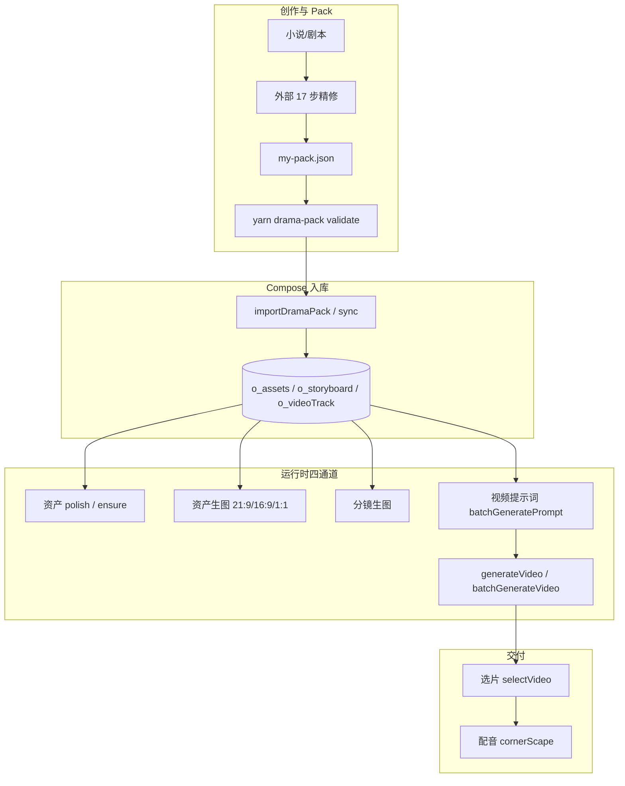

# 高质量短剧实现流程 Playbook

本文档是 Toonflow **端到端短剧制作**的操作手册与**问题登记簿**。适用于路径 B（外部 drama-pack 导入）；路径 A 见 [`drama-pack-guide.md`](./drama-pack-guide.md)。

相关文档：

- 引擎架构：[`pack-architecture-guide.md`](./pack-architecture-guide.md)
- 人格/脸锚：[`pack-persona-asset-guide.md`](./pack-persona-asset-guide.md)
- Prompt 最佳实践：[`pack-prompt-best-practices.md`](./pack-prompt-best-practices.md)

---

## 1. 端到端流程



---

## 2. 标准 SOP（导入后）

### 2.1 入库

```powershell
yarn drama-pack validate ./my-pack.json
yarn drama-pack sync <projectId> ./my-pack.json          # 默认保留分镜图
yarn drama-pack audit <projectId> ./my-pack.json
```

### 2.2 资产中心

1. **T0 脸型锚点先出图**（`CHAR-*` 原资产，21:9 四视图）
2. **T1 服化衍生后出**（`CHAR-*:日常` 等，16:9 单图；自动引用 T0 图作 reference）
3. 场景/道具：空 prompt 时先 `batchEnsureAssetPrompts`
4. 人工对照 visualLock 抽检：T0 四格含 back view；T1 同脸、服化可变

### 2.3 分镜

1. `batchGenerateImage` 生成分镜图
2. sync 默认 `preserveStoryboardImages=true`，同 index 保留 `filePath`
3. 裂图排查：`pollingImage` / audit `BROKEN_STORYBOARD_IMAGE`

### 2.4 视频工作台

1. 确认项目 **videoModel** + **mode**（设置 → 项目）
2. segment 拖拽排序 → `reorderTracks` 持久化
3. 参考图：分镜图优先，无图时 `fallbackAssetSrc`（关联资产图）
4. **批量生成提示词** → 抽检 `o_videoTrack.prompt` 无推理泄漏
5. **生成视频** → 缺图时 API 返回 `missingRefs`
6. 选片 → 配音

### 2.5 开发环境（Electron GUI）

```powershell
yarn rebuild:electron    # 首次或 yarn install / Electron 升级后必跑
yarn dev:gui
```

`frame: false` 使用自定义标题栏（`toonflow://windowMinimize` 等）；服务未启动时按钮不可用。

---

## 3. 质量门禁

| 阶段 | 门禁 | 通过标准 |
|------|------|---------|
| Pack | `yarn drama-pack validate` | 0 error |
| Sync | `yarn drama-pack sync`（默认保留图） | 同 index `filePath` 不变 |
| 资产 | `yarn drama-pack audit` | 无 `IMAGE_PROMPT_SIMULATION`；T0 含 back view |
| 分镜 | pollingImage | 无大面积裂图 |
| 视频提示词 | audit + 人工抽检 | 无 `VIDEO_PROMPT_REASONING_LEAK` |
| 视频 | generateVideo | 缺图时 `missingRefs` 明确报错 |

---

## 4. 问题登记簿

### P1 — 视频提示词输出推理文本

| 项 | 内容 |
|----|------|
| **现象** | `o_videoTrack.prompt` 出现大段「Wan2.6 / 通用多参 / 模型路由」推理，而非 `[References]` + `[Instruction]` |
| **根因** | user 消息缺 `mode`/`多参`；`singleImage` 等未命中 skill 路由 → DB fallback 要求 LLM 自行路由；无输出净化 |
| **修复** | `videoPromptUtils.ts` 注入 mode/多参 + `sanitizeVideoPromptOutput`；audit `VIDEO_PROMPT_REASONING_LEAK` |
| **临时规避** | 设置 → 模型绑定 `data/modelPrompt/video/*.md`；`universalAi` 用非 reasoning 模型 |
| **验证** | 批量生成提示词后抽检；`yarn drama-pack audit` 无 `VIDEO_PROMPT_REASONING_LEAK` |

### P2 — T0 原资产与 T1 衍生图差异大

| 项 | 内容 |
|----|------|
| **现象** | `CHAR-WRJ` 四视图与 `温如珏-日常` 脸型/妆感/构图差异明显；T0 第 3 格可能重复侧脸 |
| **根因** | T0 用 `四视图.完整提示词`（21:9）；T1 用短 `分镜引用prompt_*`（16:9 单图）；T1 曾无自动 T0 参考图 |
| **修复** | `batchGenerateImageAssets` T1 自动解析 T0 `referenceList`；`buildFinalAssetImagePrompt` enforce 四视图/back view |
| **期望** | **允许服化差异，不允许换脸** |
| **验证** | T0 出图后再出 T1，人工对照；audit `GENDER_DESCRIBE_MISMATCH` |

### P3 — 分镜台 segment 拖拽后排版乱

| 项 | 内容 |
|----|------|
| **现象** | 轨道卡片纵向堆叠、横向滚动失效 |
| **根因** | `VueDraggable` 插入 `.trackDraggable` 但无 flex CSS |
| **修复** | `track.vue` 为 `.trackDraggable` 补 `display:flex` |
| **验证** | 拖拽后卡片仍横向排列、可滚动 |

### P4 — dev:gui better-sqlite3 ABI 不匹配

| 项 | 内容 |
|----|------|
| **现象** | `NODE_MODULE_VERSION 127` vs `143`；服务启动失败；感知「无窗口按钮」 |
| **根因** | `yarn install` 针对系统 Node 编译；Electron 40 需 ABI 143；无 rebuild 钩子 |
| **修复** | `yarn rebuild:electron`；`electron-builder.yml` asarUnpack `better-sqlite3` |
| **验证** | `yarn rebuild:electron && yarn dev:gui` 正常启动 |

### P5 — T1 自动创建与 UI 双轨（lockCode vs assetsId）

| 项 | 内容 |
|----|------|
| **现象** | 导入后出现 `温如珏-日常/潜入/落魄` 等资产，剧本正文无对应字样；资产中心多张「原资产」平级显示 |
| **根因** | Pack `characterAssets` 含 `分镜引用prompt_日常` 等服化 key → `composePackAssets` 自动建 T1 行（`lockCode:CHAR-WRJ:日常`，`assetsId=null`）；旧 UI 仅用 `assetsId` 判断父子，T1 无法挂到 T0 下 |
| **设计** | **剧本无字样但 Pack 有服化 key 即会建资产**；WRJ 保留 T1×3，LZH/XC 因 PersonaAware 跳过 T1 |
| **修复** | `getAssetsApi` 按 `lockCode` 前缀归组 T1 到 T0 `sonAssets`；返回 `assetTier` / `lockCode`；前端子行显示「衍生·日常」标签 |
| **可选** | `yarn drama-pack import/sync --t1-stages-from-storyboard` 仅建本集 `visualId` 实际用到的 stage |
| **FAQ** | 剧本页资产列表（`o_scriptAssets`）是**本集子集**；资产中心是**全量**；未出镜 T1 仍可能存在 → audit `UNUSED_T1_STAGE` |
| **验证** | 资产中心 `CHAR-WRJ` 下折叠显示日常/潜入/落魄；`yarn drama-pack audit` 输出 `assetGraph` |

### P6 — 视频 @图N 参考契约

| 项 | 内容 |
|----|------|
| **现象** | `@图3/@图5/@图6` 无缩略图；AI 写 `@图3 : [温如珏-日常]` 但上传第 3 张是分镜 P3 |
| **根因** | 三套编号并行：AI Skill 按资产 XML 顺序、UI `references` 仅认 `src`（不含 `fallbackAssetSrc`）、`genText` 用未排序 raw medias |
| **设计** | **@图N = 参考条带中第 N 张有 resolvedSrc 的 image**（资产优先 → 分镜）；非资产名、非分镜 index |
| **修复** | `refSlotBuilder` 统一 `resolvedSrc`/排序/label；`getGenerateData` 返回 enriched medias + `refSlots`；前端 `references`/upload/genText 同源 |
| **AI 输入** | `generateVideoPrompt` 注入 `<ref slot="3" source="assets" lockCode="CHAR-WRJ:日常" />` XML，禁止 LLM 自行编号 |
| **审计** | `REF_SLOT_EMPTY` / `PROMPT_REF_ORPHAN` / 生成前 `missingRefs` |
| **FAQ** | 分镜无自有图时 `fallbackAssetSrc` 可上传但须计入 refSlot；手改 prompt 后 orphan 需重新生成 |
| **验证** | 视频工作台 `@图3` 缩略图 = 温如珏-日常；upload 顺序与 refSlots 一致 |

---

## 7. 一次性验收清单（十四步）

```powershell
yarn drama-pack:verify 1783331635294 ./my-pack.json
```

| 阶段 | 步骤 | 命令/操作 | 通过标准 |
|------|------|-----------|----------|
| 0 | 部署 | `yarn build:fast` → `data/web` → 重启 GUI | bundle 存在 |
| 1-2 | 数据 | `audit` + `backfill-prompts` | 记录 baseline |
| 3-6 | 资产 | T0 → 删旧 T1 → 重生 | 同脸仅服化变 |
| 7-8 | 分镜 | `batchGenerateImage` | 无 broken image |
| 9-12 | 视频 | 重置条带 → genText → batch → generateVideo | 无 orphan/missingRefs |
| 13-14 | 门禁 | `audit` + 人工抽检台词/@图N | `valid: true` |

---

## 5. 三通道与前端映射（速查）

| 通道 | DB 字段 | API |
|------|---------|-----|
| 资产 | `o_assets.prompt` | `batchPolishAssetsPrompt` / `batchGenerateImageAssets` |
| 分镜 | `o_storyboard.prompt` / `videoDesc` | `batchGenerateImage` |
| 视频 track | `o_videoTrack.prompt` | `batchGeneratePrompt` / `generateVideo` |

运行时 enforce 见 [`pack-architecture-guide.md` §11](./pack-architecture-guide.md)。

---

## 6. 回归命令

```powershell
yarn drama-pack audit 1783139305612 ./my-pack.json
yarn rebuild:electron
yarn dev:gui
```

人工：资产页 T0/T1 对照；工作台生成提示词抽检一条 track。
