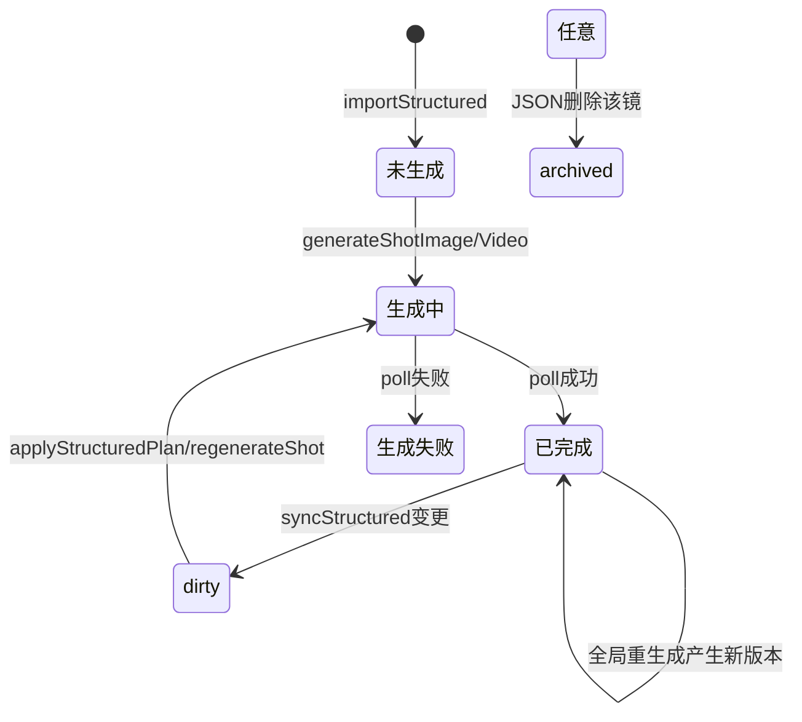

# 结构化生产 · 前端详细设计文档

> 版本：v1.0  
> 面向：Toonflow-web 工作台「结构化生产」Tab  
> 后端路径：`/api/structured/*`  
> 关联后端文档：[structured-script-api.md](./structured-script-api.md)

---

## 1. 产品目标

实现「导入 → 查看 → 同步 → 按规则解释 → 可配置自动/手动重生成 → 拼接」的完整闭环。

**核心原则：**

| 原则 | 说明 |
|------|------|
| JSON 为真源 | 结构化 JSON 是剧本/分镜的权威来源 |
| DB 可微调 | 允许单镜 override（后续扩展），不与 JSON 冲突时以 sync 为准 |
| 同步不覆盖资源 | sync 只更新元数据并标 `dirty`，旧图/旧视频保留 |
| 规则驱动 UI | 前端不写死「纸条/短信/字幕」分支，读 `getStructuredRules` |
| 原描述可追溯 | 网格与详情始终展示 `original` / `reference` / `explain` |

---

## 2. 信息架构（页面布局）

```
┌─────────────────────────────────────────────────────────────┐
│ 顶栏：质量档位 | 自动重生成开关 | 预览 | 导入 | 同步 | 一键更新 | 全局重生成 │
├──────────────────────────────┬──────────────────────────────┤
│ 分镜网格（主区）              │ 解释面板（右侧）              │
│ - 镜号/状态/缩略图            │ - compileLog / qualityGate    │
│ - 原描述折叠区                │ - sync diff / 推荐原因        │
│ - 单镜操作                    │ - 规则命中 handlers           │
├──────────────────────────────┴──────────────────────────────┤
│ 任务条：applyStructuredPlan / pollStructured 进度            │
└─────────────────────────────────────────────────────────────┘
```

### 2.1 顶栏控件

| 控件 | API | 说明 |
|------|-----|------|
| 质量档位下拉 | `getStructuredRules.qualityProfiles` | draft / prod / ultra |
| 自动重生成开关 | `setStructuredAutoApplyPolicy` | `enabled` + `autoApplyOnSync` |
| 作用范围 | `setStructuredAutoApplyPolicy` | `scope: dirtyOnly \| all` |
| 预览编译 | `previewStructured` | 导入前评估 |
| 导入 | `importStructured` | 落库并初始化 history |
| 同步 JSON | `syncStructured` | diff + dirty；若开启 autoApply 则自动触发 plan |
| 一键更新 dirty | `applyStructuredPlan` scope=`dirty` | 仅重生成 dirty 镜头 |
| 全局重生成 | `applyStructuredPlan` scope=`all` | 二次确认后执行 |

### 2.2 分镜卡片字段（来自 `getStructuredGrid`）

| 字段 | 用途 |
|------|------|
| `id` | storyboardId，所有单镜 API 入参 |
| `镜号` | 用户识别 |
| `state` | 灰/加载/绿/橙/隐藏（见 renderRules.stateColors） |
| `imageSrc` | 当前分镜图缩略图 |
| `videoVersions[]` | 多版本视频，`active` 为当前选中 |
| `reference` | **原镜头描述摘要**（sceneName、dialogue、visualEffect） |
| `original` | **导入时原始 prompt / shotMeta** |
| `prompt` / `videoPrompt` | 当前生效编译结果 |
| `lastSyncRevision` | 最近一次 sync 变更摘要 |
| `explain` | 解析自 `reason` 的 compileLog / syncDiff |

### 2.3 解释面板（选中镜头时）

1. 调 `getStructuredShotHistory` 获取完整历史
2. 展示 `reference` + `original` + `lastSyncRevision`
3. 展示 `explain.compileLog` / `explain.qualityGate`（来自 grid 或 validate）

---

## 3. 三种生产模式

| 模式 | 用户操作 | 后端行为 |
|------|----------|----------|
| **快速出片** | 导入 → 一键编排 | `applyStructuredPlan` phases 全量 |
| **规则增强（推荐）** | 同步后查看 diff → 一键更新 dirty | `syncStructured.diffByShot` + manual apply |
| **精修** | 单镜 validate → 重出图/视频 | `validateStructuredShot` + `regenerateShot` |

质量档位由 `qualityProfiles` 决定 tier/resolution/concurrency，不硬编码。

---

## 4. 状态机



**UI 映射（来自 `renderRules`）：**

| state | 颜色 token | 可用 actions |
|-------|------------|--------------|
| 未生成 | gray | generateImage, generateVideo |
| dirty | warning | regenerateImage, regenerateVideo, viewDiff |
| 已完成 | success | regenerate, selectVideo, viewHistory |
| 生成中 | loading | poll |
| archived | disabled | 隐藏或折叠 |

---

## 5. API 契约（前端必接）

统一响应：`{ code: 200, message, data }`。axios 拦截器已解包时取 `res.data`。

### 5.1 规则与策略

#### `POST /api/structured/getStructuredRules`

```json
// 请求
{ "projectId": 1, "scriptId": 12 }

// 响应 data
{
  "version": "1.0",
  "fieldRegistry": [{ "field": "dialogue", "level": "G1", "handler": "dialogueSyncInjector", "implemented": true }],
  "qualityProfiles": [{ "id": "prod", "label": "生产", "imageTier": "2K", "videoResolution": "720p", "audioDefault": true, "concurrency": 3 }],
  "renderRules": { "stateColors": {}, "actionsByState": {}, "pollIntervalMs": 2500, "confirmGlobalRegenerate": true },
  "autoApplyPolicy": { "enabled": false, "scope": "dirtyOnly", "autoApplyOnSync": false, "phases": ["variants","images","videos"], "qualityProfileId": "prod" },
  "scopes": [{ "id": "dirty", "label": "仅更新 dirty 镜头" }, { "id": "all", "label": "全局重生成" }],
  "phases": [{ "id": "images", "label": "分镜图" }]
}
```

#### `POST /api/structured/setStructuredAutoApplyPolicy`

```json
// 请求
{
  "projectId": 1,
  "scriptId": 12,
  "policy": {
    "enabled": true,
    "autoApplyOnSync": true,
    "scope": "dirtyOnly",
    "qualityProfileId": "prod",
    "phases": ["variants", "images", "videos"]
  }
}

// 响应 data：合并后的完整 policy
```

### 5.2 导入 / 查看 / 同步

#### `POST /api/structured/importStructured`

- 创建 `o_script`（一集剧本）、`o_storyboard`、`o_videoTrack`
- 初始化 `structuredShotHistory`（每镜 original 快照）
- 响应：`scriptId`, `storyboardIds`, `shotCount`, `preview`

#### `POST /api/structured/getStructuredGrid`

```json
// 响应 data.shots[] 关键字段
{
  "id": 101,
  "镜号": 4,
  "state": "dirty",
  "prompt": "当前编译 image prompt",
  "videoPrompt": "当前编译 video prompt",
  "videoDesc": "画面描述",
  "imageSrc": "/oss/...",
  "reference": {
    "sceneName": "OFFICE_04_纸条内容",
    "dialogue": { "type": "纸条", "text": "我知道你在偷看她——十年了。今晚零点，来天台。" },
    "visualEffect": { "type": "纸条文字", "content": "...", "style": "手写体..." }
  },
  "original": {
    "prompt": "导入时 prompt",
    "videoPrompt": "导入时 videoPrompt",
    "shotMeta": { "镜号": 4, "...": "..." }
  },
  "lastSyncRevision": { "at": 1710000000, "changedFields": ["dialogue.text"], "impact": "both" },
  "explain": { "compileLog": {}, "syncDiff": {} },
  "videoVersions": [{ "id": 20, "state": "生成成功", "src": "...", "active": true }]
}
```

#### `POST /api/structured/syncStructured`

```json
// 响应 data（扩展）
{
  "changedShots": [4],
  "dirtyShots": [4],
  "suggestions": [{ "storyboardId": 103, "镜号": 4, "targets": ["image", "video"] }],
  "diffByShot": [{
    "shotNo": 4,
    "storyboardId": 103,
    "hashBefore": "a1b2",
    "hashAfter": "c3d4",
    "changedFields": ["dialogue.text", "visualEffect.content"],
    "impact": "both",
    "recommendationReason": "文本载体字段变更；规则命中: visualEffect",
    "promptBefore": "...",
    "promptAfter": "...",
    "videoPromptBefore": "...",
    "videoPromptAfter": "..."
  }],
  "autoApplyResult": {
    "started": true,
    "taskId": 55,
    "message": "dirty 镜头更新已启动",
    "planSummary": { "scope": "dirty", "storyboardCount": 3 }
  }
}
```

**注意：** `autoApplyResult` 仅在 `policy.enabled && policy.autoApplyOnSync` 且存在 dirty 时出现。

### 5.3 校验与历史

#### `POST /api/structured/validateStructuredShot`

```json
// 请求
{
  "projectId": 1,
  "storyboardId": 103,
  "shot": { "镜号": 4, "dialogue": { "text": "..." }, "...": "..." },
  "target": "both"
}

// 响应 data
{
  "passed": true,
  "issues": [{ "field": "prompt", "code": "QUALITY_GATE", "severity": "warning", "message": "..." }],
  "compilePreview": {
    "image": { "prompt": "...", "duration": 1.7, "compileLog": {} },
    "video": { "prompt": "...", "mode": "singleImage", "audio": true }
  },
  "explain": { "route": {}, "qualityGate": { "passed": true, "score": 85 }, "handlers": {} }
}
```

#### `POST /api/structured/getStructuredShotHistory`

```json
// 响应 data
{
  "history": {
    "shotMetaOriginal": {},
    "promptOriginal": "...",
    "syncRevisions": [{ "at": 1710000000, "changedFields": ["dialogue.text"], "reason": "..." }],
    "overrideRevisions": []
  },
  "reference": { "sceneName": "...", "dialogue": {} }
}
```

### 5.4 可配置重生成

#### `POST /api/structured/applyStructuredPlan`

```json
// 请求 — 全局重生成
{
  "projectId": 1,
  "scriptId": 12,
  "mode": "manualApply",
  "scope": "all",
  "qualityProfileId": "prod",
  "phases": ["variants", "images", "videos", "assemble"]
}

// 请求 — 仅 dirty
{ "projectId": 1, "scriptId": 12, "scope": "dirty" }

// 响应 data
{
  "taskId": 56,
  "startedAt": 1710000000,
  "message": "全局重生成已启动",
  "planSummary": {
    "scope": "all",
    "storyboardCount": 44,
    "phases": ["variants","images","videos"],
    "tier": "2K",
    "audio": true
  }
}
```

配合 `POST /api/structured/pollStructured` 轮询（间隔 `renderRules.pollIntervalMs`，默认 2500ms）。

---

## 6. 推荐交互流程

### 6.1 首次使用

```
1. 进入生产页 → 选集 → 工作台 → 结构化生产 Tab
2. getStructuredRules（加载档位与 policy）
3. 选 JSON → previewStructured（看 warnings / fieldCoverage）
4. importStructured
5. getStructuredGrid（展示网格 + original/reference）
6. applyStructuredPlan scope=all 或分步 generateShotImage → generateShotVideo
7. pollStructured 直到完成
8. assembleEpisode
```

### 6.2 JSON 修订后

```
1. syncStructured（展示 diffByShot 面板）
2. 若未开 autoApply：用户点「一键更新 dirty」
3. pollStructured → getStructuredGrid 刷新
4. 对比 original vs 当前 prompt（卡片折叠区）
```

### 6.3 全局重生成（保留旧版本）

```
1. 二次确认弹窗（confirmGlobalRegenerate=true）
2. applyStructuredPlan scope=all
3. 旧 videoVersions 仍保留，active 切换用 selectStructuredVideo
4. 原描述始终在 reference/original 区展示
```

---

## 7. 前端组件拆分建议（Toonflow-web）

| 组件 | 路径建议 | 职责 |
|------|----------|------|
| `StructuredProductionTab` | `workbench/structured/index.vue` | 页面容器 |
| `StructuredToolbar` | `structured/Toolbar.vue` | 档位、policy、导入同步按钮 |
| `StructuredShotGrid` | `structured/ShotGrid.vue` | 网格卡片 |
| `StructuredShotCard` | `structured/ShotCard.vue` | 单镜展示 + 原描述折叠 |
| `StructuredExplainPanel` | `structured/ExplainPanel.vue` | diff / compileLog / validate |
| `StructuredTaskBar` | `structured/TaskBar.vue` | poll + taskId 进度 |

**Store 建议：**

```typescript
interface StructuredState {
  projectId: number;
  scriptId: number; // = episodesId
  rules: RulesResponse | null;
  policy: AutoApplyPolicy;
  shots: GridShot[];
  selectedShotId: number | null;
  lastSyncDiff: SyncDiffResult | null;
  activeTaskId: number | null;
}
```

---

## 8. 异常处理

| 场景 | code | 前端处理 |
|------|------|----------|
| JSON 校验失败 | 400 | 展示 Zod message，阻止导入 |
| 未登录 | 401 | 跳转登录 |
| UNIQUE 资产关联 | 400 | 提示重新导入（后端已去重修复） |
| 无分镜图出视频 | 400 | 卡片提示「请先出图」 |
| apply 无 dirty | 200 skipped | Toast「无待处理镜头」 |
| 批量单项失败 | 200 含 error | 失败镜头标红，提供重试 |
| ngrok 参考图失败 | 400 | 提示配置 ossURL |

---

## 9. 与现有生产接口的关系

| 能力 | 结构化 API | 原生产 API | 说明 |
|------|------------|------------|------|
| 分镜列表 | getStructuredGrid | getStoryboardData | 结构化网格含 reference/original |
| 批量出图 | generateShotImage | batchGenerateImage | 结构化走 GCE 编译 |
| 视频生成 | generateShotVideo | workbench generate | 共用 vendor |
| 任务记录 | applyStructuredPlan → o_tasks | taskList | 统一任务中心展示 |

结构化 Tab **优先使用** `/api/structured/*`；精修时可跳转原分镜台（共享 storyboardId）。

---

## 10. 验收清单

- [ ] 导入后 grid 可见 44 镜，每镜有 `reference` 与 `original`
- [ ] sync 修改台词后 `state=dirty`，`diffByShot` 可解释原因
- [ ] 关闭 autoApply 时 sync 不自动跑生成
- [ ] 开启 autoApplyOnSync 后 sync 返回 `autoApplyResult.started=true`
- [ ] 「全局重生成」二次确认后 `scope=all` 启动任务
- [ ] 重生成后旧 `videoVersions` 仍可切换
- [ ] `validateStructuredShot` 编辑时实时预览 compilePreview
- [ ] poll 完成后网格状态更新为「已完成」

---

## 11. 后续扩展（非 M1 阻塞）

- 单镜 override 持久化 → `overrideRevisions` 写入
- JSON 可视化编辑器（按 fieldRegistry 动态表单）
- 字段级 diff 高亮（dialogue.text 前后对比）
- 失败镜头批量重试 API
