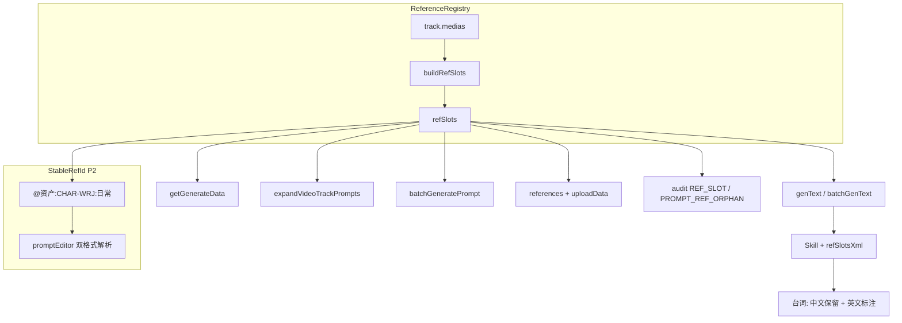
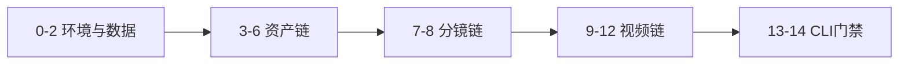

# 视频参考与 T1 脸锚 — 一次性闭环总计划（P0 + P1 + P2）

## 目标

在已落地 [`refSlotBuilder.ts`](i:/toonflow/Toonflow-app/src/lib/dramaPack/refSlotBuilder.ts) 基础上，**一次性**完成代码 + 数据 + 文档 + 验收脚本，再对项目 `1783331635294` 跑完整链路。避免「后端已修、前端未部署、旧图未重生」导致的半套现象。

---

## 根因速查（你反馈的三类问题）

| 现象 | 根因 | 对应实施块 |
|------|------|------------|
| 默认 prompt 无 @图N；片段引用错位 | import/expand/batch 未走 refSlots；条带有图数 < prompt 引用数 | P0-B + P2 稳定引用 |
| 重生成中文变英文 | `videoPromptUtils` 与 Skill 模板冲突 | P0-A |
| T1 衍生脸型差异大 | stage 英文脸描述 + 旧像素 + backfill 无 extensions | P0-C + 数据重生 |
| 视频联动未测 | orphan 仅 warn；batch 路径未对齐 | P1 + 十四步验收 |

---

## 统一架构（终态）

**铁律**：凡写入 `o_videoTrack.prompt` 的路径（import 短句除外）必须携带同一份 `refSlots`；`@图N` 与 `@资产:lockCode` 可并存，解析均回落到 registry。

---

## P0 — 核心断链修复

### A. 台词语言契约（中文对白 / 独白 / VO）

| # | 文件 | 改动 |
|---|------|------|
| 1 | [`videoPromptUtils.ts`](i:/toonflow/Toonflow-app/src/lib/dramaPack/videoPromptUtils.ts) L116 | 删除「翻译为英文」；改为保持原始语言 + 标注类型 |
| 2 | [`universalMulti-parameterMode.md`](i:/toonflow/Toonflow-app/data/modelPrompt/video/universalMulti-parameterMode.md) 及 seedance/wan/首尾帧以外多参 Skill | L115 模板改为「保持原始语言」；与规则 4 一致 |
| 3 | `generateVideoPrompt` / `batchGeneratePrompt` / `expandVideoTrackPrompts` | 生成后 `detectChineseDialogueInEnglishPrompt` → 失败写 `reason` 或自动重试 1 次 |

### B. refSlots 全路径贯通

| # | 文件 | 改动 |
|---|------|------|
| 4 | [`expandVideoTrackPrompts.ts`](i:/toonflow/Toonflow-app/src/lib/dramaPack/expandVideoTrackPrompts.ts) | 读 track `medias` → `buildRefSlots` → `refSlotsBlock` |
| 5 | [`batchGeneratePrompt.ts`](i:/toonflow/Toonflow-app/src/routes/production/workbench/batchGeneratePrompt.ts) | 请求 `refSlots[]`；`await Promise.all` |
| 6 | [`track.vue`](i:/toonflow/Toonflow-web/src/views/production/components/workbench/generate/components/track.vue) | `batchGenText` 提交 refSlots；`inferMediaSource` 替代 `?? "storyboard"` |
| 7 | [`generate/index.vue`](i:/toonflow/Toonflow-web/src/views/production/components/workbench/generate/index.vue) | 全模式 `info` = `buildUploadInfoFromMedias`；与 `imageList` 同源 |
| 8 | [`getGenerateData.ts`](i:/toonflow/Toonflow-app/src/routes/production/workbench/getGenerateData.ts) | 无 `@图` 且 `refSlots.length>0` 时返回 `promptHint`（推荐方案 1） |

### C. T1 脸锚加强

| # | 文件 | 改动 |
|---|------|------|
| 9 | [`backfill-asset-prompts.ts`](i:/toonflow/Toonflow-app/scripts/backfill-asset-prompts.ts) + [`batchEnsureAssetPrompts.ts`](i:/toonflow/Toonflow-app/src/routes/assetsGenerate/batchEnsureAssetPrompts.ts) + [`polishAssetsPrompt.ts`](i:/toonflow/Toonflow-app/src/routes/assetsGenerate/polishAssetsPrompt.ts) | 传 `packCtx.extensions` |
| 10 | [`promptComposer.ts`](i:/toonflow/Toonflow-app/src/lib/dramaPack/promptComposer.ts) + pack 字段规范 | T1 stage 剥离 jawline/tear mole/hairline 等脸句；脸仅 `lock face:` + T0 ref |
| 11 | [`assetImagePromptBuilder.ts`](i:/toonflow/Toonflow-app/src/lib/dramaPack/assetImagePromptBuilder.ts) | T1 优先英文 `锁定描述` 作 lock face（与 stage 同语言） |
| 12 | [`audit-drama-pack.ts`](i:/toonflow/Toonflow-app/scripts/audit-drama-pack.ts) | 新增 `T1_LOCK_FACE_MISSING`、`T1_STAGE_FACE_LEAK`（stage prompt 含脸关键词） |

---

## P1 — 质量门禁与 UX

| # | 项 | 改动 |
|---|-----|------|
| 13 | [`generateVideo.ts`](i:/toonflow/Toonflow-app/src/routes/production/workbench/generateVideo.ts) | `findOrphanRefIndices` → **400 blocking** |
| 14 | `updateVideoPrompt` | 写 `promptSource: "manual"` |
| 15 | G-REF-03 | 换轨 / medias 变更且 prompt 含 orphan → Dialog 提示重生成 |
| 16 | `derive_child` | [`assetTierUtils`](i:/toonflow/Toonflow-app/src/lib/dramaPack/assetTierUtils.ts) 子资产走 T1 规则或显式 audit 排除，避免四视图误用 |
| 17 | 部署 | `yarn build:fast` → `data/web`；验证 Electron 与 ngrok 加载**同一** bundle |

---

## P2 — 纳入本期（原「可后续」项统一并入）

### D. 稳定引用 ID（降低 LLM 编号漂移）

| # | 项 | 说明 |
|---|-----|------|
| 18 | [`refSlotBuilder.ts`](i:/toonflow/Toonflow-app/src/lib/dramaPack/refSlotBuilder.ts) | `formatStableRef(lockCode)` → `@资产:CHAR-WRJ:日常` |
| 19 | AI Skill + `buildRefSlotsXml` | References 块同时输出 `@图N` 与 `@资产:lockCode` 映射表 |
| 20 | [`promptEditor.vue`](i:/toonflow/Toonflow-web/src/components/promptEditor.vue) | 解析 `@资产:CODE` 与 `@图N` 双格式；标签显示 lockCode label |
| 21 | `findOrphanRefIndices` | 扩展识别 `@资产:xxx` orphan |

### E. getReferenceCandidates 与参考条带治理

| # | 项 | 说明 |
|---|-----|------|
| 22 | [`getReferenceCandidates.ts`](i:/toonflow/Toonflow-app/src/routes/production/workbench/getReferenceCandidates.ts) | 前端 `imageSelect` 拉候选；分镜无图时展示 fallback 资产 |
| 23 | 视频工作台「重置参考条带」 | 按 `getGenerateData` 默认 medias 覆盖本地 cache + `updateTrackMedias`；清历史错误顺序 |
| 24 | medias 持久化 schema | 存 `resolvedSrc`/`label`/`lockCode` 快照，减少 warmUp 前空槽 |

### F. 数据与 Pack 运维（测试前必跑）

| # | 命令 | 用途 |
|---|------|------|
| 25 | `yarn drama-pack:backfill-prompts 1783331635294` | prompt 文本对齐新规则 |
| 26 | `yarn drama-pack sync 1783331635294 ./my-pack.json` | 可选：recompose 资产 + expand video（改后应带 refSlots） |
| 27 | `yarn drama-pack import/sync --t1-stages-from-storyboard` | 新导入时减少未出镜 T1；**已有项目**用 audit `UNUSED_T1_STAGE` 甄别 |
| 28 | T0 → T1 **强制重生成** | 旧像素不随 backfill 更新；测试前删除或覆盖 WRJ T1 图 |

### G. 画风手册与文档

| # | 项 | 说明 |
|---|-----|------|
| 29 | 各画风 `art_character_derivative.md` | 与 realpeople 对齐：T1 = 16:9 单图服化，禁止四视图衍生 |
| 30 | [`short-drama-quality-playbook.md`](i:/toonflow/Toonflow-app/docs/short-drama-quality-playbook.md) | P6 已有；增补 **§7 一次性验收清单**（见下） |

### H. 模型边界（文档化，不阻塞本期）

| # | 项 | 说明 |
|---|-----|------|
| 31 | Vendor face ref 强度 | agnes 等无 cref 权重；验收以「传对图 + prompt 对」为准，脸漂记为 vendor 上限 |
| 32 | 模式矩阵 | `singleImage`/首尾帧 Skill **禁止 @图N**；多参 `imageReference:N` 才测 @ 引用链路 |

---

## 一次性验收 — 1783331635294 十四步全链路

### Phase 0 — 环境与基线（自动化 + 人工）

| 步 | 操作 | 通过标准 |
|----|------|----------|
| 0 | `yarn build:fast` → 复制 `dist/*` → `data/web`；重启 `dev:gui` | bundle 含新逻辑（见下 verify） |
| 1 | `yarn drama-pack audit 1783331635294 ./my-pack.json` | 保存 baseline JSON |
| 2 | `yarn drama-pack:backfill-prompts 1783331635294` | 12/12 或等价更新；再 audit 对比 |

### Phase 1 — 资产链（脸锚）

| 步 | 操作 | 通过标准 |
|----|------|----------|
| 3 | CornerScape：WRJ 折叠 | 「原资产」+「衍生·日常/潜入/落魄」 |
| 4 | 生成 **T0 CHAR-WRJ** | 21:9 四视图；audit 无 `T1_MISSING_T0_REF` 前置条件 |
| 5 | **删除或覆盖** 旧 T1 图后逐张重生 T1 | 同脸；仅服化变；无 `T1_PROMPT_HAS_FOUR_VIEW` |
| 6 | XC 镜（若有）抽检 | T0 生图含 LZH secondary ref（`SAME_FACE_SECONDARY_REF`） |

### Phase 2 — 分镜链

| 步 | 操作 | 通过标准 |
|----|------|----------|
| 7 | `batchGenerateImage` 本分镜 | 无 `BROKEN_STORYBOARD_IMAGE` |
| 8 | 抽检 PURE-SCENE 镜 | 无 `SB_PURE_SCENE` |

### Phase 3 — 视频链（含 batch 回归）

| 步 | 操作 | 通过标准 |
|----|------|----------|
| 9 | track #2：**重置参考条带** → 拖入 T1 有图资产 → 有图分镜 | `refSlots` 槽位与条带一致 |
| 10 | **单轨** `genText`（多参 imageReference 模式） | `[References]` 含 `@图N`；`@图3` 缩略图 = 温如珏-日常；台词中文保留 |
| 11 | **批量** `batchGenText` 全轨 | 同上；无 batch 路径回退 |
| 12 | `generateVideo` | 无 `missingRefs`；orphan `@图N` **blocking** |

### Phase 4 — 终检门禁

| 步 | 操作 | 通过标准 |
|----|------|----------|
| 13 | `yarn drama-pack audit 1783331635294 ./my-pack.json` | `valid: true`；零 error；warning 仅允许 `UNUSED_T1_STAGE` 等 info 级 |
| 14 | `yarn drama-pack verify 1783331635294`（**新增**） | CLI 聚合：audit + bundle 标记检查 + 关键表计数 |

### 新增 CLI：`yarn drama-pack verify`

实现于 [`scripts/verify-drama-pack-project.ts`](i:/toonflow/Toonflow-app/scripts/verify-drama-pack-project.ts)（新建）：

1. 调用 audit，error>0 则 exit 1
2. 检查 `data/web` 最近 build 时间 / 关键 chunk 存在
3. 输出 **人工勾选清单**（十四步 Markdown）供测试记录
4. package.json 注册 `drama-pack:verify`

---

## 模式与配置速查（高质量生成）

| 配置项 | 推荐值 | 避免 |
|--------|--------|------|
| 视频 mode | JSON 数组含 `imageReference:N`（N = 条带有图 image 数） | `singleImage`、首尾帧（Skill 禁 @图N） |
| 参考条带顺序 | 有图 T1 资产 → 有图分镜 → 无图项 | 仅 2 图却 prompt 引用 @图3~5 |
| 提示词来源 | 条带就绪后点「生成提示词」或 batch | 仅依赖 import 短英文默认 prompt |
| T1 顺序 | T0 完成后再 T1 | T0 无图时 batch 应 blocking |
| 手改 prompt 后 | 勿 sync 覆盖；`promptSource=manual` | 未重生成却改 medias 顺序 |

---

## 验收对照（截图 → 预期）

| 截图现象 | 全量完成后预期 |
|----------|----------------|
| `@图3~5` 无缩略图 | 条带补图或 orphan blocking；稳定引用 `@资产:CHAR-WRJ:日常` 可解析 |
| References 写分镜图、条带是资产 | expand/batch/单轨均 refSlots 对齐 |
| 重生成中文变英文 | 台词契约 + 生成后 DIALOGUE 校验 |
| WRJ 三衍生脸型不一 | T0 稳定 + T1 重生成 + stage 剥离脸 + lockFace 英文 |
| cornerScape 平级 | 新 bundle `sonCard` 归组 |
| track 竖排 | `.trackDraggable { display:flex }` 在部署 bundle 内 |

---

## 实施顺序（开发）

1. P0-A 台词 → P0-B refSlots 全路径 → P0-C 脸锚  
2. P1 门禁 + G-REF-03 + derive_child  
3. P2-D 稳定引用 → P2-E 候选/重置条带 → P2-F 数据命令 → P2-G 文档  
4. `verify` CLI + playbook §7  
5. **最后** build 前端 → 十四步验收（避免测到半套）

---

## 风险与边界

- **历史 medias JSON**：测试前建议 track 级「重置参考条带」（P2-E #23）
- **manual prompt**：sync/recompose 须 respect `promptSource=manual`
- **ngrok vs Electron**：确认 URL 指向的静态资源与 `data/web` 一致
- **Vendor 上限**：脸锚 100% 同脸不保证；审计与阻断保证「输入正确」
