# Toonflow 日志分析整体架构方案（v8 · 细节优化 · 架构冻结）

## 一、现状诊断（为何「日志没有放出」）

| 能力 | 现状 | 影响 |
|------|------|------|
| 文件持久化 | [`src/logger.ts`](src/logger.ts) 已实现，但 [`src/app.ts`](src/app.ts) 第 1 行 `// import "./logger"` **未启用** | `data/logs/app.log` 实际为空 |
| 结构化日志 | 纯文本 `console.*`，无 JSON schema | 无法按厂商/模型/项目聚合 |
| 链路追踪 | 无 `traceId` / `requestId` | HTTP → Socket → AI 无法串联 |
| AI 错误 | 图/视频走 [`o_tasks`](src/utils/taskRecord.ts)；文本 Agent 仅 `console.error` | 第三方 LLM 失败信息大量丢失 |
| 厂商上下文 | VM 仅 `【VM】` + JSON 到 stdout | 无 status/latency/tokens/retry |
| 日志暴露 | Electron 仅能 [`openFolder("logs")`](src/routes/setting/fileManagement/openFolder.ts)；**无 API/无 UI 查看器** | 用户看不到、远程无法排查 |
| 外部采集 | 无 OTLP/Loki/Filebeat 适配 | 服务端无法集中分析 |
| 开关控制 | 无统一/局部开关 | 无法按模块降噪或按需启用 |
| 可复用性 | 日志逻辑与业务强耦合 | 难以接入其他应用 |
| 工程基座 | **无 monorepo / packages/**，[`package.json`](package.json) 无 workspaces | 组件化无处落地 |
| 标准协议 | 无 W3C traceparent / OTLP | 跨应用、跨服务链路断裂 |
| 融合模式 | 仅描述 SDK 嵌入 | 外部应用无法「推日志过来」或 sidecar 采集 |
| 问题定位 | 无错误指纹、无相似聚合、无诊断 Playbook | 同类问题重复排查，无法快速定位 |
| 查询性能 | 无全文索引、无查询缓存 | 日志量大时检索慢 |
| 文档 | 无接入教程、无故障排查手册 | 接入成本高、排障靠口口相传 |
| 智能推荐 | 无厂商排名、无 Profile、无配置建议 | 用户不知最优接入方案与开关组合 |
| 运维边界 | 无降级/离线、无版本关联、无成本追踪、无数据删除 | 升级/合规/成本场景覆盖不足 |

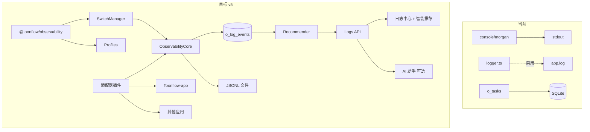

---

## 二、核心设计：可集成组件包

### 2.1 包结构（Monorepo 内独立包，后期可发布 npm）

**工程基座变更（P0a 必做）**——当前仓库为单包结构，需先初始化：

```
# 根 package.json 新增
"workspaces": ["packages/*"]

packages/
  observability/                 # @toonflow/observability（核心，零业务依赖）
  observability-browser/       # @toonflow/observability-browser（可选，<5KB 前端 SDK）
  observability-cli/           # @toonflow/observability-cli（可选，init 脚手架）
```

```
packages/observability/
  package.json                   # exports 子路径，支持 tree-shaking
  src/
    index.ts                     # createObservability(config)
    presets.ts                   # electron / express / docker / ai-worker 一键预设
    configFile.ts                # 读取 observability.config.json
    types.ts
    core/
      logger.ts
      context.ts                 # W3C traceparent 解析/生成
      switchManager.ts
      redact.ts
      errors.ts
      sampler.ts
      shutdown.ts
      writeQueue.ts              # 异步批量写入 + 背压
      schemaRegistry.ts          # schemaVersion 注册与迁移
      metrics.ts                 # 轻量指标 counter/histogram
      health.ts                  # 子系统健康状态
      fingerprint.ts             # 错误指纹 errorFingerprint（归并同类错误）
      diagnosis.ts               # 诊断 Playbook 引擎（规则归因，非 LLM）
    transports/
      stdout.ts | file.ts | sqlite.ts | external.ts | noop.ts
      buffer.ts                  # external 失败时的本地死信缓冲
    adapters/
      express.ts | socketio.ts | ai-sdk.ts | morgan.ts
    fusion/                      # ★ 快速融合层
      embed.ts                   # SDK 嵌入模式
      push.ts                    # 远程推送客户端
      sidecar.ts                 # 文件 tail / stdout 采集说明
    schemas/ ...
    plugins/registry.ts
    analyze/ aggregate.ts | rules.ts | playbooks.ts | recommender.ts | profiles.ts
    testing/
      mock.ts                    # createMockObservability() 供消费方单测
      fixtures.ts
  observability.config.example.json
  README.md
```

**Subpath exports（按需引入，减小体积）：**

```json
{
  "exports": {
    ".": "./dist/index.js",
    "./express": "./dist/adapters/express.js",
    "./ai-sdk": "./dist/adapters/ai-sdk.js",
    "./presets": "./dist/presets.js",
    "./testing": "./dist/testing/mock.js"
  }
}
```

**Toonflow-app 集成方式**（薄封装，不污染业务）：

```
src/observability/
  bootstrap.ts       # createObservability + 注入 u.db / getPath
  config.ts          # 读取 env + o_setting，合并为 SwitchConfig
  routes/            # 仅 Toonflow 特有的 /logs API 路由
```

其他应用只需：

```typescript
import { createObservability, expressAdapter, aiSdkAdapter } from "@toonflow/observability";

const obs = createObservability({ appId: "my-app", switches: { ... } });
app.use(obs.express.traceMiddleware());
obs.aiSdk.wrap(generateText);
```

### 2.2 组件化原则

| 原则 | 说明 |
|------|------|
| **零业务依赖** | 组件包不 import `@/utils`、不依赖 Toonflow DB schema；通过注入 adapter |
| **适配器模式** | Express/Socket/AI SDK 均为可选 peer dependency |
| **Transport 插件** | 新增存储只需实现 `Transport.write(event)` + `Transport.flush()` |
| **Analyzer 插件** | 规则告警、AI 助手均为可注册插件，默认可不装 |
| **Schema 版本化** | 每条事件带 `schemaVersion: 1`，向后兼容 |
| **配置即代码** | `createObservability(config)` 纯函数，易单测 |

---

## 三、多级开关体系（统一 + 局部）

### 3.1 开关层级（优先级：局部 > 分类 > 全局）

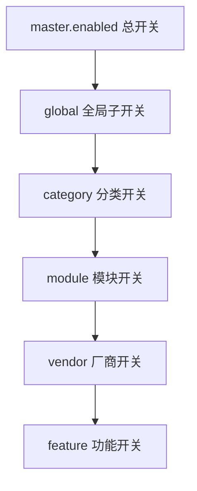

**配置来源（合并，后者覆盖前者）：**

1. 代码默认值（`packages/observability` 内置）
2. 环境变量（部署级，适合 Docker/CI）
3. `o_setting` 表（运行时可改，适合 Electron 用户）
4. 请求级 override（仅 debug，如 `X-Log-Debug: 1`，限管理员）

### 3.2 开关清单

#### 总开关

| Key | 默认 | 说明 |
|-----|------|------|
| `observability.enabled` | `true` | **总开关**；`false` 时全部 Transport 走 noop，零开销 |

#### 全局子开关（Transport 级）

| Key | 默认 | 说明 |
|-----|------|------|
| `observability.stdout` | `true` | stdout JSON/pretty |
| `observability.file` | `true` | JSONL 文件 |
| `observability.sqlite` | `true` | 热表可查询 |
| `observability.external` | `false` | Loki/OTLP 推送 |
| `observability.level` | `info` | 全局最低级别 |
| `observability.retentionDays` | `30` | 保留天数 |

#### 分类开关（Category 级）

| Key | 默认 | 说明 |
|-----|------|------|
| `observability.category.http` | `true` | HTTP 访问 |
| `observability.category.ai_call` | `true` | LLM 文本调用 |
| `observability.category.vendor` | `true` | 图/视频/音频厂商 |
| `observability.category.system` | `true` | 进程级/未捕获异常 |
| `observability.category.task` | `true` | 任务生命周期 |
| `observability.category.client` | `false` | 前端错误上报（默认关，防噪音） |

#### 模块开关（Module 级，局部）

| Key | 默认 | 说明 |
|-----|------|------|
| `observability.module.scriptAgent` | `true` | 剧本 Agent |
| `observability.module.productionAgent` | `true` | 生产 Agent |
| `observability.module.structured` | `true` | 结构化生产 |
| `observability.module.socket` | `true` | WebSocket 事件 |
| `observability.module.vm` | `true` | VM 沙盒 vendor |

模块开关通过 `log.child({ module: "scriptAgent" })` 或 `withContext({ module })` 自动匹配。

#### 厂商开关（Vendor 级，局部）

存 `o_setting` JSON：`observability.vendor.{vendorId}` = `true|false`

示例：`observability.vendor.volcengine=false` 关闭火山引擎相关日志（排查其他厂商时降噪）。

#### 功能开关（Feature 级）

| Key | 默认 | 说明 |
|-----|------|------|
| `observability.feature.trace` | `true` | traceId 生成与透传 |
| `observability.feature.sampler` | `true` | poll 采样（关则全量） |
| `observability.feature.redact` | `true` | 脱敏（**生产必须开**） |
| `observability.feature.promptDebug` | `false` | 记录完整 prompt（仅排障时开） |
| `observability.feature.alerts` | `true` | 规则告警 |
| `observability.feature.aiAssistant` | `false` | AI 日志助手 |
| `observability.feature.clientReport` | `false` | 接受前端 POST /logs/client |
| `observability.feature.ingest` | `false` | 接受外部 POST /logs/ingest（Push 模式） |
| `observability.feature.metrics` | `true` | 轻量指标计数 |
| `observability.feature.webhook` | `false` | 规则告警推送到 webhook |
| `observability.feature.startupCheck` | `true` | 启动自检（ossURL 等） |
| `observability.feature.fingerprint` | `true` | 错误指纹计算与归并 |
| `observability.feature.playbook` | `true` | 诊断 Playbook 自动归因 |
| `observability.feature.fts` | `true` | SQLite FTS5 全文检索 |
| `observability.feature.recommend` | `true` | 智能推荐引擎（规则驱动，默认开） |
| `observability.feature.autoTune` | `false` | 自动调优（采样率/保留天数，需确认后应用） |

### 3.3 SwitchManager 实现要点

```typescript
// packages/observability/src/core/switchManager.ts
interface SwitchConfig {
  master: { enabled: boolean };
  transports: Record<string, boolean>;
  categories: Record<string, boolean>;
  modules: Record<string, boolean>;
  vendors: Record<string, boolean>;
  features: Record<string, boolean>;
  level: LogLevel;
}

// 写入前判定：任一上级关闭则丢弃
shouldLog(event: LogEvent): boolean;

// 支持运行时热更新（o_setting 变更后 reload，无需重启）
reload(config: Partial<SwitchConfig>): void;
```

**局部开关 API（业务侧）：**

```typescript
// 某次调试临时提高 verbosity，不影响全局
obs.withLocalSwitch({ level: "debug", categories: { vendor: true } }, () => {
  return aiImage.run(...);
});

// 某厂商临时静默
obs.vendor("klingai").mute();
```

### 3.4 开关管理 UI

设置页新增 **「可观测性」** 分区（读写 `o_setting` + 展示 env 只读项）：

- 总开关 + Transport 四选一
- 分类 / 模块 / 厂商 树形勾选
- 功能开关（AI 助手、prompt 调试、前端上报）
- 「恢复默认」「导出配置 JSON」

---

## 四、目标架构（五层，解耦可扩展）

### Layer 1 — 组件内核 `@toonflow/observability`

- **pino** 作为底层，输出统一 `LogEvent` schema
- **SwitchManager** 在 write 前过滤
- **Redactor** 在 write 前脱敏
- **Sampler** 对 vendor poll 等高频道事件采样

**LogEvent 标准结构：**

```typescript
interface LogEvent {
  schemaVersion: 1;
  ts: number;
  level: "trace" | "debug" | "info" | "warn" | "error" | "fatal";
  category: "http" | "ai_call" | "vendor" | "system" | "task" | "client";
  message: string;
  traceId?: string;
  spanId?: string;
  appId: string;           // "toonflow" | 其他应用
  module?: string;           // scriptAgent / structured / ...
  vendorId?: string;
  model?: string;
  projectId?: number;
  taskId?: number;
  payload?: Record<string, unknown>;  // 扩展字段
}
```

**环境变量映射**（兼容 dotenv，与 o_setting 键一一对应）：

| 环境变量 | o_setting 键 | 默认 |
|----------|--------------|------|
| `OBS_ENABLED` | `observability.enabled` | `1` |
| `LOG_LEVEL` | `observability.level` | `info` |
| `LOG_FILE_ENABLED` | `observability.file` | `1` |
| `LOG_SQLITE_ENABLED` | `observability.sqlite` | `1` |
| `LOG_EXTERNAL_URL` | — | 空 |
| `LOG_RETENTION_DAYS` | `observability.retentionDays` | `30` |
| `LOG_AI_ASSISTANT` | `observability.feature.aiAssistant` | `0` |

在 [`src/app.ts`](src/app.ts) 最早处 `import "@/observability/bootstrap"` 替代注释掉的 logger。

---

### Layer 2 — 链路上下文（适配器插件）

**express 适配器**（替代裸 morgan + 不安全 error handler）：

- 生成/透传 `X-Trace-Id`，响应头回写
- 注入 ALS：`traceId`, `userId`, `path`, `method`, `module`
- HTTP 访问日志结构化（method, path, status, latencyMs）
- **安全 error handler**：只返回 `{ message, traceId }`，完整 err 写 `category=system`

**socket.io 适配器**：

- connection 接受 `traceId` query
- connect/disconnect/error 结构化

**结构化生产**：`traceId` 写入 `o_tasks` / `compileLog`

---

### Layer 3 — AI / 厂商可观测（ai-sdk 适配器，**必做**）

| 入口 | 包裹点 | 必采字段 |
|------|--------|----------|
| `Ai.Text.invoke/stream` | ai-sdk 适配器 | vendorId, model, aiType, latencyMs, tokens, errorCategory |
| `Ai.Image/Video/Audio.run` | 同上 + pollTask | externalTaskId, pollCount, retryAttempt |
| VM `logger()` | vendor schema | 原始 vendor message + vendorId |
| `pollTask()` | sampler 控制 | 仅 status 变化 / 失败 / 末次 poll 写入 |

**错误分类**（`errors.ts`）：

```typescript
type AiErrorCategory =
  | "auth" | "rate_limit" | "timeout" | "provider_down"
  | "invalid_request" | "content_filter" | "quota_exceeded" | "unknown";
```

**必须修复的现有漏洞（纳入 P3 正式交付）：**

- [`AiAudio.run`](src/utils/ai.ts) 空 `catch {}` → 记录 `category=vendor, level=error` 并 rethrow
- `policy.retry` 接入时写 `retryAttempt` + `traceId`
- 全局 error handler 安全化（见 Layer 2）

**脱敏（`feature.redact` 控制）：**

- prompt：默认 `sha256` + 前 80 字符；`promptDebug=true` 时记全文（同时 UI 警告）
- base64 / API Key / Authorization 一律 redact

---

### Layer 4 — 存储与暴露

#### 4.1 SQLite 热表 `o_log_events`

| 字段 | 类型 | 说明 |
|------|------|------|
| id | integer | 主键 |
| ts | integer | 时间戳 ms |
| level | string | |
| category | string | |
| traceId | string | |
| appId | string | 支持多应用接入同一 DB |
| module | string? | |
| projectId | integer? | |
| vendorId | string? | |
| model | string? | |
| message | text | |
| errorFingerprint | string? | 错误归并键（error 级别必填） |
| payload | text | JSON |
| taskId | integer? | |

索引：`(ts)`, `(traceId)`, `(errorFingerprint, ts)`, `(category, vendorId, ts)`, `(appId, ts)`, `(projectId, ts)`

**FTS5 虚拟表** `o_log_events_fts`：索引 `message` + `payload` 文本，支持关键词快速搜索。

#### 4.2 扩展 `o_tasks`

新增列：`endTime`, `latencyMs`, `traceId`；`done()` 时自动写入。

#### 4.3 日志 API

| 端点 | 能力 |
|------|------|
| `GET /logs/query` | 分页筛选 + FTS 关键词 |
| `GET /logs/aggregate` | 厂商/模型/错误类型统计 |
| `GET /logs/trace/:traceId` | 链路时间轴 |
| `GET /logs/similar` | 同类错误聚合（by fingerprint） |
| `GET /logs/diagnose` | Playbook 诊断结论 + 建议 |
| `GET /logs/suggest` | 搜索自动补全 |
| `GET /logs/export` | JSONL/CSV 导出 |
| `GET /logs/switches` | 读取当前开关配置 |
| `PUT /logs/switches` | 更新 o_setting 开关（管理员） |
| `POST /logs/savedFilters` | 保存常用筛选视图 |
| `POST /logs/client` | 前端错误上报 |
| `POST /logs/ingest` | 外部 Push 接入 |
| `POST /logs/analyze` | 可选 AI 助手 |

#### 4.4 前端日志中心

- 筛选 + 链路时间轴 + 厂商错误聚合面板
- **开关管理**子页（见 3.4）
- Electron：保留 openFolder；Web：在线 API

#### 4.5 外部采集（Docker）

- stdout JSONL → `docker logs`
- `LOG_EXTERNAL_URL` → Loki / OTLP（`external` transport 插件）

---

### Layer 5 — 智能分析（插件化，均可独立关闭）

#### 5.1 结构化检索（必做，`feature.alerts` 无关）

- 厂商失败率、P95 延迟、errorCategory 分布
- 24h 新错误类型高亮

#### 5.2 规则告警引擎（`feature.alerts`，可插拔规则）

内置规则 + `plugins/registry` 注册自定义规则：

| 规则 ID | 条件 | 动作 |
|---------|------|------|
| `vendor_fail_burst` | 5min 内同 vendor 失败 ≥3 | warn 事件 + UI 通知 |
| `rate_limit_storm` | 连续 rate_limit ≥2 | 建议切换模型 |
| `auth_error` | auth 错误 | 提示检查 API Key |
| `startup_misconfig` | ossURL 未配置且参考图 URL 为 localhost | system warn |

规则配置存 `o_setting.observability.rules`（JSON），支持启用/禁用单条规则。

#### 5.3 AI 日志助手（`feature.aiAssistant`，默认关）

- 读 `o_log_events` → 脱敏摘要 → `Ai.Text`
- 输出：根因假设 + 建议操作
- 可作为 `analyze/aiAssistant.ts` 插件单独禁用

---

## 五、原「未考虑事项」正式纳入（每项均有开关/归属层）

| 类别 | 原遗漏 | 正式方案 | 归属 | 相关开关 |
|------|--------|----------|------|----------|
| **安全** | error handler 泄露 stack | express 适配器安全 handler | Layer 2 | 不可关 |
| **安全** | API Key/prompt 泄露 | Redactor 强制脱敏 | Layer 1 | `feature.redact` |
| **安全** | 日志 API 未鉴权 | JWT + 管理员校验 | Layer 4 | 不可关 |
| **稳定性** | uncaughtException 不退出 | `shutdown.ts`：写 fatal → 优雅关闭 | Layer 1 | `category.system` |
| **稳定性** | 日志写盘失败拖垮主流程 | Transport 异步队列 + 写失败降级到 stdout | Layer 1 | — |
| **前端** | 浏览器错误未上报 | `POST /logs/client` + 限流 | Layer 4 | `feature.clientReport` |
| **性能** | poll 刷屏 | Sampler：变化/失败/末次 | Layer 1 | `feature.sampler` |
| **性能** | SQLite 写入瓶颈 | 批量 insert（100ms flush）+ 索引优化 | Layer 4 | — |
| **隐私** | prompt/台词明文 | hash + 截断 | Layer 1 | `feature.promptDebug` |
| **隐私** | 日志导出含敏感字段 | export 强制 redact | Layer 4 | `feature.redact` |
| **运维** | OSSURL vs ossURL 不一致 | 启动自检 + system 日志 + 文档统一 | Layer 5 | `feature.startupCheck` |
| **运维** | 无保留策略 | retention job 清 SQLite + JSONL | Layer 1 | `retentionDays` |
| **兼容** | 旧 `exportLogs()` | 新 API 读 JSONL，旧函数 deprecated 转发 | Layer 4 | — |
| **兼容** | 旧 console 调用 | bootstrap 可选 console 桥接（过渡期） | Layer 1 | `observability.legacyConsole` |
| **测试** | 无契约测试 | 组件包单测：schema/switch/redact/ai 包裹 | 全层 | — |
| **文档** | 无运维手册 | `docs/observability.md` + 组件 README | — | — |
| **多应用** | 无法复用 | `@toonflow/observability` 独立包 | Layer 0 | `appId` 区分 |
| **可观测** | 开关不可视 | 设置页开关管理 UI | Layer 4 | — |
| **Vendor** | 厂商信息不全 | ai-sdk 适配器强制 vendorId/model/errorCategory | Layer 3 | `category.vendor` |
| **Vendor** | TTS 静默失败 | AiAudio catch 修复 | Layer 3 | — |
| **Vendor** | retry 未记录 | Executor 重试写 retryAttempt | Layer 3 | — |

---

## 六、对外集成契约（三种融合模式 · 快速简单）

### 6.0 三种融合模式（按复杂度递增）

| 模式 | 适用场景 | 接入成本 | 方式 |
|------|----------|----------|------|
| **Embed 嵌入** | 同进程 Node/Electron 应用 | **3 行代码** | `createObservability` + 挂适配器 |
| **Push 推送** | 异构应用（Python/Go/其他服务） | **1 个 HTTP 调用** | `POST /logs/ingest` 推送标准 LogEvent |
| **Sidecar 旁路** | 不便改代码的遗留应用 | **1 个配置文件** | tail JSONL / stdout → Toonflow 采集器 |

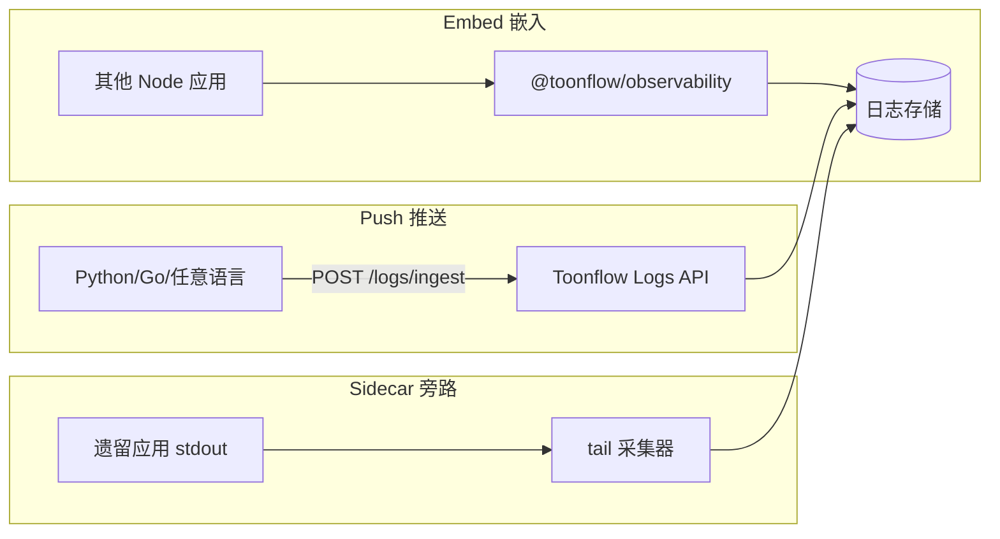

### 6.1 最快接入：Preset 预设（零配置可跑）

```typescript
import { createFromPreset } from "@toonflow/observability/presets";

// 场景 1：Express API — 一行
const obs = createFromPreset("express-api", { appId: "my-service" });

// 场景 2：Electron 桌面 — 注入路径
const obs = createFromPreset("electron", { appId: "my-app", logDir: userData + "/logs" });

// 场景 3：纯 AI Worker（无 HTTP）
const obs = createFromPreset("ai-worker", { appId: "batch-gen" });

// 场景 4：Docker 服务端
const obs = createFromPreset("docker", { appId: "toonflow", externalUrl: process.env.LOG_EXTERNAL_URL });
```

预设内置合理默认值（开关、transport、采样、脱敏），消费方只需 `appId`。

### 6.2 配置文件接入（无 o_setting 依赖）

其他应用可完全脱离 Toonflow DB，仅用 JSON 配置：

```json
// observability.config.json（放项目根目录，CLI init 自动生成）
{
  "appId": "partner-app",
  "preset": "express-api",
  "switches": {
    "master": { "enabled": true },
    "categories": { "ai_call": true, "http": true }
  },
  "transports": {
    "file": { "dir": "./logs", "retentionDays": 14 },
    "push": { "endpoint": "http://toonflow-host:10588/logs/ingest", "apiKey": "..." }
  }
}
```

```typescript
import { createFromConfigFile } from "@toonflow/observability";
const obs = createFromConfigFile(); // 自动找 cwd 下 observability.config.json
```

### 6.3 CLI 脚手架（30 秒初始化）

```bash
npx @toonflow/observability-cli init --preset express-api
# 生成：observability.config.json + bootstrap 模板 + .env.example
```

### 6.4 Embed 模式（3 行代码）

```typescript
import { createFromPreset } from "@toonflow/observability/presets";
import { expressAdapter } from "@toonflow/observability/express";

const obs = createFromPreset("express-api", { appId: "other-app" });
app.use(expressAdapter.trace(obs));
app.use(expressAdapter.errorHandler(obs));
```

### 6.5 Push 模式（异构应用，1 个 HTTP 调用）

Toonflow 暴露 `POST /logs/ingest`（`feature.ingest=true`）：

```bash
# 任意语言，推送单条标准事件
curl -X POST http://toonflow:10588/logs/ingest \
  -H "Authorization: Bearer $API_KEY" \
  -d '{"appId":"python-worker","category":"ai_call","level":"error","vendorId":"openai","message":"429 rate limit","traceId":"abc-123"}'
```

提供多语言示例片段（Python requests / Go net/http）写入 `docs/observability.md`。

### 6.6 事件 Hook（不写 Transport 也能消费）

```typescript
obs.on("log", (event) => {
  myMetrics.increment("ai_errors", { vendor: event.vendorId });
});
obs.on("alert", (rule) => { sendDingTalk(rule); });
```

消费方无需实现完整 Transport，监听事件即可联动自有系统。

### 6.7 测试 Mock（消费方单测零依赖）

```typescript
import { createMockObservability } from "@toonflow/observability/testing";
const { obs, events } = createMockObservability();
await myService.run(obs);
expect(events).toContainEqual(expect.objectContaining({ category: "ai_call" }));
```

### 6.8 扩展接入

| 需求 | 方式 |
|------|------|
| 自定义存储 | 实现 `Transport` 接口，`obs.registerTransport(myTransport)` |
| 自定义分析 | 实现 `AnalyzerPlugin`，注册到 `plugins/registry` |
| 自定义 schema | 扩展 `payload`，`category` 用 `custom.*` 命名空间 |
| 仅 AI 观测 | 只引 `@toonflow/observability/ai-sdk` |
| Electron | `preset: "electron"` + 注入 `logDir` |
| 跨服务追踪 | 透传 W3C `traceparent` 头（见第十节） |

### 6.9 与 Toonflow 的边界

- **@toonflow/observability**：零 Toonflow 依赖，可单独 npm 发布
- **@toonflow/observability-browser**：前端错误上报 SDK（可选独立包）
- **src/observability/**：Toonflow 薄 bootstrap（DB 注入、路由、o_setting 同步、ingest API）
- **@toonflow/observability-ui**：日志中心 UI（Phase 7+ 可选，Toonflow 先内嵌）

---

## 十、基础架构待完善项（v3 正式纳入）

以下是目前方案仍缺的**基础设施能力**，与日志组件同等重要，一并纳入实施计划：

### 10.1 工程基座（P0a）

| 缺口 | 现状 | 方案 |
|------|------|------|
| Monorepo | 单包，无 `packages/` | 根 `workspaces: ["packages/*"]` |
| 组件构建 | 无独立 build | `packages/observability` 独立 `tsc` + `exports` |
| dotenv | 依赖存在但未用 | bootstrap 统一加载 `.env` |
| 类型共享 | 无 | `packages/observability/src/types.ts` 导出 LogEvent 等 |

### 10.2 可观测性内核能力

| 缺口 | 方案 | 归属 | 开关 |
|------|------|------|------|
| **W3C traceparent** | 解析/生成 `traceparent` / `tracestate` 头，跨 HTTP 传播 traceId | `context.ts` | `feature.trace` |
| **instanceId** | 多实例/多容器部署时区分来源 | LogEvent.`instanceId`（默认 hostname+pid） | 不可关 |
| **写入队列 + 背压** | 异步批量写 SQLite/file，队列满时降级丢弃低优先级 category | `writeQueue.ts` | — |
| **死信缓冲** | external transport 失败时写本地 buffer 文件，恢复后重放 | `transports/buffer.ts` | `observability.external` |
| **Schema 迁移** | `schemaVersion` + `schemaRegistry` 处理 payload 字段演进 | `schemaRegistry.ts` | — |
| **轻量指标** | `metrics.ts`：ai_call_total、ai_error_total、latency_histogram | 与日志同事务写入 payload | `feature.metrics` |
| **健康检查** | `GET /logs/health` 返回 transport 状态、队列深度、最后写入时间 | `health.ts` | 不可关 |
| **审计日志分离** | `category=audit`（开关变更、导出、登录失败）与 `category=system` 分开 | schemas/audit.ts | `category.audit` |
| **Webhook 告警** | 规则触发时推 Slack/钉钉/通用 webhook | `analyze/rules.ts` + webhook transport | `feature.webhook` |
| **ingest API** | `POST /logs/ingest` 供 Push 模式 | Layer 4 新增端点 | `feature.ingest` |
| **OpenAPI** | `/logs/*` 接口契约文档，代码生成友好 | `docs/observability-openapi.yaml` | — |

### 10.3 伴生组件包（按需引入）

| 包名 | 职责 | 何时需要 |
|------|------|----------|
| `@toonflow/observability` | 核心 SDK | 必装 |
| `@toonflow/observability-browser` | 前端 `reportError()` + traceId 透传 | 有 Web 前端时 |
| `@toonflow/observability-cli` | `init` 脚手架 | 新应用接入时 |
| `@toonflow/observability-ui` | 日志中心 React 组件（后期） | 多应用统一后台时 |

### 10.4 与现有 Toonflow 模块的衔接

| 模块 | 衔接方式 |
|------|----------|
| `o_tasks` | 增加 traceId/endTime/latencyMs，与 LogEvent 互链 |
| `o_setting` | 存开关 JSON；非 Toonflow 应用用 config 文件替代 |
| `taskRecord.ts` | 调用 `obs.task.start/done` 自动写日志 |
| `switchAiDevTool` | 与 `feature.aiAssistant` 独立，互不干扰 |
| 结构化生产 `compileLog` | payload 中带 traceId，日志中心可跳转 |

---

## 十一、快速融合决策树（给接入方）

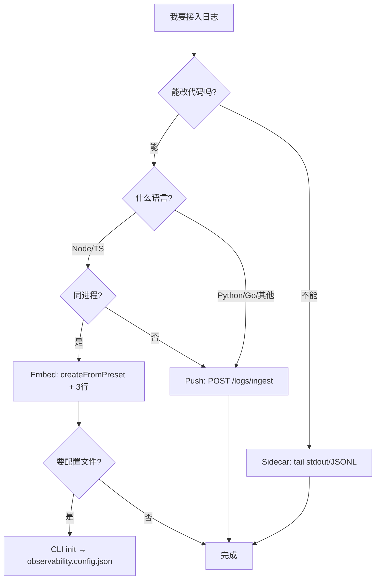

**推荐路径：**
- 新 Node 服务 → `npx @toonflow/observability-cli init` → `createFromPreset("express-api")`
- Electron 子应用 → `createFromPreset("electron", { logDir })`
- Python 批处理 → `requests.post("/logs/ingest", json=event)`
- 已有 Toonflow → `src/observability/bootstrap.ts` 薄封装即可

---

---

## 十二、六维质量保障（性能 / 安全 / 智能 / 简单 / 易扩展 / 好维护）

### 12.1 性能（低开销、高吞吐、快查询）

| 策略 | 实现 | 目标 |
|------|------|------|
| **热路径零阻塞** | `writeQueue` 异步批量写，主线程仅入队 | AI 调用延迟增加 < 1ms |
| **总开关短路** | `OBS_ENABLED=0` → noop，无 pino 实例 | 完全关闭时零开销 |
| **分级采样** | poll 仅变化/失败/末次；`debug` 级别可局部开启 | 稳定轮询不产生海量日志 |
| **背压降级** | 队列满时丢弃 `category=http` 低优先级，保留 `error` | 日志系统不拖垮业务 |
| **SQLite 批量写** | 100ms flush 或 50 条一批 insert | 写入 TPS > 1000 |
| **FTS5 全文索引** | `o_log_events_fts` 虚拟表索引 message + payload 关键词 | 关键词搜索 < 200ms（10 万条） |
| **复合索引** | `(ts DESC)`, `(traceId)`, `(errorFingerprint, ts)`, `(vendorId, errorCategory, ts)` | 筛选查询走索引 |
| **查询分页 + 游标** | `cursor` 分页替代深 offset | 大结果集翻页稳定 |
| **聚合缓存** | `aggregate` 结果 60s 内存缓存（按 filter hash） | 仪表盘刷新不重复扫表 |
| **冷数据归档** | 超 `retentionDays` 的 JSONL 压缩为 `.gz`，SQLite 删除 | 控制磁盘占用 |
| **子路径 tree-shaking** | `@toonflow/observability/express` 不引入 ai-sdk | 嵌入包体积最小化 |

**性能预算（写入侧）：**

```
noop 模式:     0 overhead
info 热路径:   < 0.5ms（入队）
error 含指纹:  < 1ms（入队 + fingerprint hash）
sqlite flush:  异步，不阻塞
```

### 12.2 安全（默认安全、最小暴露）

| 层级 | 措施 | 说明 |
|------|------|------|
| **脱敏** | Redactor 强制：API Key、Authorization、base64、邮箱、手机号 | `feature.redact` 生产不可关 |
| **prompt 保护** | 默认 sha256 + 80 字符；`promptDebug` 需管理员 + UI 二次确认 | 防台词/剧本泄露 |
| **API 鉴权** | `/logs/*` 全部 JWT；`/logs/ingest` 独立 API Key；`/logs/export` 仅管理员 | RBAC 三级 |
| **速率限制** | ingest/client 各 60 req/min/IP；query 120 req/min | 防刷与 DoS |
| **注入防护** | ingest 校验 LogEvent schema（zod）；拒绝超 64KB 单条 | 防日志注入攻击 |
| **错误响应** | 客户端仅 `{ message, traceId }`；stack 只写日志 | 防信息泄露 |
| **导出审计** | `category=audit` 记录谁导出了什么 | 可追溯 |
| **文件权限** | JSONL 目录 `0700`（Electron userData） | 防本机其他用户读取 |
| **跨应用隔离** | query 默认按 `appId` 过滤；管理员可看全部 | 多租户安全 |
| **CORS** | ingest 端点限制 origin（可配置白名单） | 防浏览器滥用 |

### 12.3 智能（准确诊断，非黑盒）

智能分三层，**不依赖 LLM 也能准确定位**：

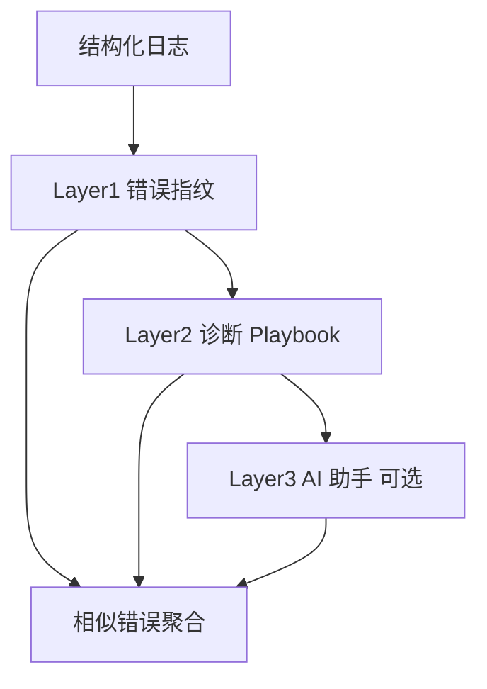

**Layer 1 — 错误指纹 `errorFingerprint`**

写入时对每条 error 计算指纹，用于归并同类问题：

```typescript
// fingerprint = hash(vendorId + errorCategory + normalizedMessage)
// normalizedMessage: 去掉动态 ID、时间戳、token 数等变量部分
```

- 新增 API：`GET /logs/similar?fingerprint=xxx` — 查所有同类错误
- UI：错误详情页展示「同类错误 N 次，最近发生于…」

**Layer 2 — 诊断 Playbook（规则归因，默认可用）**

内置可扩展 Playbook，匹配 `errorCategory + vendorId + payload` 输出：

| Playbook ID | 匹配条件 | 诊断结论 | 建议操作 |
|-------------|----------|----------|----------|
| `pb_auth_invalid` | errorCategory=auth | API Key 无效或过期 | 检查设置 → 模型配置 → Key |
| `pb_rate_limit` | errorCategory=rate_limit | 厂商限流 | 等待重试 / 切换模型 / 降并发 |
| `pb_oss_localhost` | message 含 localhost 参考图 | 外部 API 无法拉取本地图 | 配置 ossURL 环境变量 |
| `pb_timeout_poll` | vendor poll 超时 | 异步任务超时 | 检查厂商任务状态 / 增大 timeout |
| `pb_content_filter` | errorCategory=content_filter | 内容审核拦截 | 修改 prompt / 换模型 |
| `pb_quota` | errorCategory=quota_exceeded | 额度不足 | 充值 / 换厂商 |

- API：`GET /logs/diagnose?traceId=xxx` → `{ conclusion, suggestions[], relatedEvents[] }`
- Playbook 存 `packages/observability/src/analyze/playbooks.ts`，支持 `registerPlaybook()` 扩展

**Layer 3 — AI 助手（可选，`feature.aiAssistant`）**

- 输入：traceId 或 fingerprint
- 上下文：已脱敏的关联事件 + Playbook 结论 + **Recommender 排名** 作为 hint
- 输出：自然语言归因 + 操作步骤
- **不替代 Layer 1/2/4**，仅在前几层无法给出结论时补充

**Layer 4 — 智能推荐引擎 Recommender（规则驱动，默认开，`feature.recommend`）**

不依赖 LLM，基于日志统计 + 规则 + Profile 模板，自动给出**最优方案建议**：

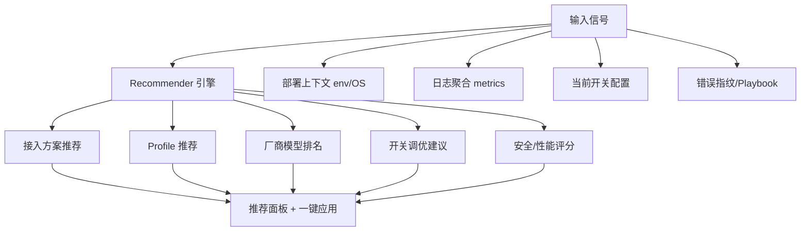

详见 **第十八章**。

### 12.4 简单（最低接入成本）

| 原则 | 落地 |
|------|------|
| 一行启动 | `createFromPreset("express-api", { appId })` |
| 零配置可跑 | Preset 内置开关/transport/脱敏默认值 |
| 配置可选 | 不需要 o_setting，JSON 文件即可 |
| CLI 初始化 | `npx @toonflow/observability-cli init` 30 秒 |
| 渐进增强 | 先 Embed stdout → 再加 sqlite → 再加 ingest |
| 错误自解释 | 启动时 `startupCheck` 输出明确 warn（如 ossURL 缺失） |
| UI 一键操作 | 复制 traceId、跳转链路、查看 Playbook 建议 |

### 12.5 易扩展（插件化、契约稳定）

| 扩展点 | 接口 | 示例 |
|--------|------|------|
| Transport | `Transport.write(event)` | 写 ClickHouse / ES |
| Adapter | `Adapter.wrap(app, obs)` | 新框架适配 |
| Analyzer | `AnalyzerPlugin.analyze(events)` | 自定义聚合 |
| Playbook | `registerPlaybook(matcher, diagnose)` | 业务专属归因 |
| Schema | `schemaRegistry.register(v2)` | payload 字段演进 |
| Redactor | `registerRedactRule(pattern)` | 自定义敏感字段 |
| Preset | `registerPreset("my-stack", config)` | 团队标准预设 |

**契约稳定性承诺：**
- `LogEvent` 核心字段（ts/level/category/message/traceId）不变
- 新字段只加 payload 或可选顶层字段
- `schemaVersion` 升级提供迁移函数
- 废弃 API 保留 2 个大版本 + deprecation warn

### 12.6 好维护（可测试、可观测、可演进）

| 措施 | 说明 |
|------|------|
| **组件包独立单测** | schema / switch / redact / fingerprint / playbook 全覆盖 |
| **契约测试** | ingest API 的 zod schema 快照测试 |
| **自监控** | `GET /logs/health` + `category=system` 记录自身异常 |
| **ESLint 规则** | 禁止业务代码直接 `console.log`（仅允许 obs API） |
| **CHANGELOG** | `packages/observability/CHANGELOG.md` 按 semver |
| **Deprecation 策略** | 旧 `src/logger.ts` 标记 deprecated，bootstrap 桥接 1 版本 |
| **Debug 模式** | `OBS_DEBUG=1` 输出组件内部诊断（队列深度、丢弃计数） |
| **示例即测试** | `docs/examples/` 下每个示例可 `tsx` 直接运行验证 |

---

## 十三、精准定位与快速检索（核心用户体验）

### 13.1 定位路径（用户从报错到根因的最短路径）

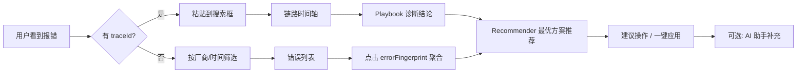

### 13.2 查询 API 扩展

| 端点 | 用途 | 关键参数 |
|------|------|----------|
| `GET /logs/query` | 通用分页检索 | level, category, vendorId, model, traceId, projectId, keyword, timeRange |
| `GET /logs/trace/:traceId` | 链路时间轴（按 ts 排序全事件） | — |
| `GET /logs/similar` | 同类错误聚合 | fingerprint 或 eventId |
| `GET /logs/diagnose` | Playbook 诊断 | traceId 或 fingerprint |
| `GET /logs/aggregate` | 统计面板 | groupBy=vendorId/errorCategory/hour |
| `GET /logs/suggest` | 搜索建议（自动补全 vendor/model/category） | prefix |
| `POST /logs/savedFilters` | 保存常用筛选（存 o_setting 或 localStorage） | name, filter |

**FTS 查询示例：**

```sql
-- o_log_events_fts 支持
SELECT * FROM o_log_events WHERE id IN (
  SELECT rowid FROM o_log_events_fts WHERE o_log_events_fts MATCH 'rate_limit AND volcengine'
) ORDER BY ts DESC LIMIT 50;
```

### 13.3 日志中心 UI 功能清单（P5）

| 功能 | 说明 |
|------|------|
| **全局搜索框** | 支持 traceId / 关键词 / 厂商名，Enter 即查 |
| **快捷筛选 Chips** | 「仅错误」「最近 1h」「AI 调用」「某厂商」一键切换 |
| **链路时间轴** | 纵向时间线：HTTP → Socket → AI → Task，点击展开 payload |
| **错误指纹侧栏** | 显示「同类错误 12 次」+ 首次/最近发生时间 |
| **Playbook 卡片** | 诊断结论 + 建议操作（带跳转链接，如「去模型配置」） |
| **一键复制** | traceId / fingerprint / 导出片段 |
| **关联跳转** | 从日志跳到 o_tasks / 分镜 / 项目 |
| **保存筛选** | 常用查询存为「我的视图」 |
| **实时 tail** | Electron 可选 SSE 实时追加（`GET /logs/tail`） |

### 13.4 LogEvent 诊断必填字段（确保「能准确定位」）

除基础字段外，error 级别事件 **payload 强制包含**：

```typescript
interface ErrorPayload {
  errorCategory: AiErrorCategory;
  errorFingerprint: string;       // 归并键
  httpStatus?: number;
  externalTaskId?: string;        // 厂商侧任务 ID
  latencyMs?: number;
  retryAttempt?: number;
  upstreamMessage?: string;       // 厂商原始错误（已截断 500 字符）
  suggestion?: string;            // Playbook 自动填充
}
```

---

## 十四、完整文档体系（P8 正式交付）

### 14.1 文档目录结构

```
docs/observability/
  README.md                      # 总览 + 5 分钟快速入门
  architecture.md                # 架构图、数据流、开关层级
  quickstart/
    01-express-3-lines.md        # Express 3 行接入
    02-electron-desktop.md       # Electron 桌面接入
    03-python-push.md            # Python Push 模式
    04-go-push.md                # Go Push 模式
    05-ai-worker-only.md         # 纯 AI Worker（无 HTTP）
    06-sidecar-tail.md           # Sidecar 采集
  cookbook/
    01-switch-config.md          # 全局/局部开关配置大全
    02-vendor-debug.md           # 排查某厂商 AI 错误
    03-trace-cross-service.md    # 跨服务 traceparent 传播
    04-custom-transport.md       # 自定义 Transport 写 ES
    05-custom-playbook.md        # 注册业务诊断 Playbook
    06-multi-app-ingest.md       # 多应用推送到同一 Toonflow
  troubleshooting/
    01-no-logs-generated.md      # 日志没生成？检查开关
    02-auth-401.md               # API Key 无效
    03-rate-limit-429.md         # 限流
    04-reference-image-fail.md   # 参考图 localhost 问题
    05-poll-timeout.md           # 异步任务超时
    06-log-query-slow.md         # 查询慢？索引与归档
    07-ingest-rejected.md        # Push 被拒绝？鉴权与 schema
  api/
    openapi.yaml                 # 全部 /logs API 契约
    query-examples.md            # 每个 API 的请求/响应示例
  examples/                      # 可运行示例（tsx / python / go）
    express-minimal/
    electron-minimal/
    python-ingest/
    go-ingest/
    custom-playbook/
  migration/
    from-console-log.md          # 从 console.log 迁移指南
    from-legacy-logger.md        # 从 src/logger.ts 迁移
  CHANGELOG.md                   # 组件包版本变更
```

### 14.2 文档质量标准

每篇教程必须包含：

1. **适用场景**（何时用这种模式）
2. **前置条件**（Node 版本、环境变量）
3. **完整可运行代码**（copy-paste 即可跑）
4. **预期输出**（日志长什么样、UI 哪里看）
5. **常见错误**（FAQ 至少 2 条）
6. **下一步**（链接到相关进阶文档）

### 14.3 故障排查手册（troubleshooting）与 Playbook 对齐

每个 troubleshooting 文档对应一个 Playbook ID，形成闭环：

| 文档 | Playbook | 用户入口 |
|------|----------|----------|
| `03-rate-limit-429.md` | `pb_rate_limit` | 日志中心 Playbook 卡片「查看详细说明」 |
| `04-reference-image-fail.md` | `pb_oss_localhost` | 启动 warn + Playbook 卡片 |

### 14.4 包内 README 与 CLI 集成

- `packages/observability/README.md`：API 参考 + 最小示例
- CLI `init` 生成的项目自带 `docs/observability-quickstart.md` 链接到主文档
- 设置页「帮助」按钮跳转对应 troubleshooting 文档

---

## 十八、智能推荐引擎与最佳实践 Profile（v5 新增）

### 18.1 设计原则：基础智能，不靠 LLM

| 原则 | 说明 |
|------|------|
| **规则优先** | 推荐由可测试的规则 + 统计数据驱动，结果可解释 |
| **默认最优** | 新用户零配置即获得 Balanced Profile（安全+性能+简单平衡） |
| **推荐可拒绝** | 所有推荐均为建议，一键应用需用户确认 |
| **评分明示** | 每条推荐附带置信度、理由、影响范围 |
| **插件扩展** | `registerRecommendationRule()` 注册业务专属推荐 |
| **LLM 增强可选** | Layer 3 AI 助手可引用 Recommender 结论，不替代它 |

### 18.2 最佳实践 Profile（开箱最优配置）

内置四套 Profile 模板，覆盖安全/性能/简单三角平衡：

| Profile | 适用场景 | 安全 | 性能 | 简单 | 核心差异 |
|---------|----------|------|------|------|----------|
| **`balanced`** ★默认 | 生产环境通用 | 高 | 高 | 高 | 脱敏开、采样开、sqlite+file、ingest 关 |
| **`secure`** | 对外服务/多租户 | 最高 | 中 | 中 | +ingest 白名单、export 禁、promptDebug 锁死、audit 全开 |
| **`performance`** | 高并发 AI 批处理 | 高 | 最高 | 中 | sqlite 采样写、http 日志关、聚合缓存加长、保留 7 天 |
| **`debug`** | 临时排障（限时） | 中 | 低 | 最高 | promptDebug 开、采样关、全 category 开；**默认 2h 自动回退 balanced** |

```typescript
// 应用 Profile（一键最优）
obs.applyProfile("balanced");           // 默认
obs.applyProfile("debug", { ttl: "2h" }); // 限时调试，到期自动回退

// CLI 初始化时自动选择
npx @toonflow/observability-cli init --profile balanced
```

**Profile 选取推荐规则（Recommender 自动匹配）：**

| 检测到 | 推荐 Profile |
|--------|--------------|
| `NODE_ENV=prod` + Electron | `balanced` |
| `NODE_ENV=prod` + Docker + 有 `LOG_EXTERNAL_URL` | `performance` |
| 对外暴露 ingest API | `secure` |
| 近 1h 错误率 > 30% 且用户打开日志中心 | 临时建议 `debug`（2h） |

### 18.3 六类智能推荐（Recommender 输出）

#### A. 接入方案推荐（融合模式匹配）

CLI `init` 或 `GET /logs/recommend/integration` 自动检测项目特征：

| 检测信号 | 推荐方案 | 置信度依据 |
|----------|----------|------------|
| 有 `express` / `package.json` main 指向 Node | **Embed** + preset `express-api` | 依赖扫描 |
| 有 `electron` 依赖 | **Embed** + preset `electron` | 依赖扫描 |
| 纯 Python/Go 项目（无 Node） | **Push** + ingest 示例 | 语言检测 |
| 无法改源码，有 stdout 日志 | **Sidecar** + tail 配置 | 用户声明 |
| 微服务，已有 OTLP Collector | **Embed** + `external` transport | env 检测 |

```bash
# CLI 智能初始化（自动匹配最优方案）
npx @toonflow/observability-cli init --smart
# 输出：检测到 Electron 项目 → 推荐 preset=electron, profile=balanced
#       生成 observability.config.json + bootstrap 模板
```

#### B. 开关配置推荐（安全 + 性能调优）

`GET /logs/recommend/switches` 对比当前配置与 Profile 最优值：

| 推荐 ID | 触发条件 | 建议 | 维度 |
|---------|----------|------|------|
| `rec_disable_prompt_debug` | `promptDebug=true` 超 2h | 关闭 promptDebug | 安全 |
| `rec_enable_sampler` | poll 日志量 > 1000/min | 开启 sampler | 性能 |
| `rec_reduce_retention` | 磁盘使用 > 80% | retention 30→14 天 | 性能 |
| `rec_enable_ingest_key` | ingest 开但无 API Key | 生成并配置 Key | 安全 |
| `rec_disable_client_report` | client 上报噪音 > 50% | 关闭 clientReport | 性能 |
| `rec_enable_external` | Docker 部署且无 file 备份 | 开启 external push | 可维护 |

每条推荐格式：

```typescript
interface Recommendation {
  id: string;
  category: "security" | "performance" | "simplicity" | "integration" | "vendor";
  title: string;
  reason: string;           // 人可读理由
  confidence: 0.0 - 1.0;
  impact: "low" | "medium" | "high";
  action: { type: "setSwitch" | "applyProfile" | "changeVendor"; payload: object };
  safe: boolean;            // true = 可一键应用，false = 需二次确认
}
```

#### C. 厂商 / 模型智能排名（基于日志统计）

`GET /logs/recommend/vendors?taskClass=image&projectId=1`

基于近 7 天 `o_log_events` + `o_tasks` 聚合，按维度排名：

| 排名维度 | 计算方式 | 用途 |
|----------|----------|------|
| **成功率** | `1 - fail/(success+fail)` | 首选厂商 |
| **P95 延迟** | ai_call/vendor 事件 latencyMs | 速度优先场景 |
| **错误分布** | errorCategory 占比 | 识别系统性问题 |
| **性价比** | 成功率 / P95延迟（归一化） | 综合推荐 |

输出示例：

```json
{
  "taskClass": "image",
  "rankings": [
    { "vendorId": "volcengine", "model": "doubao-seed", "score": 0.92, "successRate": 0.96, "p95Ms": 3200, "badge": "recommended" },
    { "vendorId": "minimax", "model": "image-01", "score": 0.78, "successRate": 0.89, "p95Ms": 5100, "badge": "fallback" }
  ],
  "suggestion": "volcengine 近 7 天成功率最高；minimax 可作为 fallback"
}
```

**与 Toonflow 模型配置联动：**
- 日志中心「智能推荐」面板展示排名
- 一键「设为 fallback」写入 `o_agentDeploy`（需确认）
- `ModelRouter` 可读取推荐排名作为路由权重（可选，`feature.autoTune`）

#### D. 错误 → 方案匹配（指纹 + Playbook + 推荐联动）

当用户查看某条错误时，除 Playbook 诊断外，额外推荐：

| 错误模式 | 自动推荐 |
|----------|----------|
| `rate_limit` + vendor A | 切换到 vendor B（排名次之且近 24h 无限流） |
| `auth` + vendor A | 检查 Key + 推荐「模型配置」页直达链接 |
| `timeout` + poll > 60 次 | 推荐增大 timeout 或换同步 API 厂商 |
| 同类 fingerprint 本周首次出现 | 标记「新错误」，推荐开启临时 debug Profile |

#### E. 安全 / 性能健康评分

`GET /logs/recommend/health-score`

```json
{
  "security": { "score": 85, "issues": ["ingest 未配置 API Key"], "profile": "balanced" },
  "performance": { "score": 92, "issues": [] },
  "simplicity": { "score": 78, "issues": ["3 个模块开关不一致，建议 applyProfile(balanced)"] },
  "overall": 85,
  "topAction": { "id": "rec_apply_balanced", "safe": true }
}
```

评分规则（可扩展）：

- 安全：redact 开 +10；promptDebug 开 -20；ingest 无 Key -30；export 无审计 -10
- 性能：sampler 开 +10；队列丢弃率 > 1% -15；FTS 未建 -5
- 简单：偏离 balanced Profile 每项 -5

#### F. 保留策略 / 采样自动调优（`feature.autoTune`，默认关）

检测到日志量激增时，**先推荐、后应用**（不自动静默修改）：

| 信号 | 推荐调优 |
|------|----------|
| 日写入 > 10 万条 | retention 30→14；http category 关闭 |
| poll 占比 > 60% | 加大采样间隔 |
| SQLite 文件 > 500MB | 归档 + 建议开启 external |

### 18.4 推荐 API 一览

| 端点 | 用途 |
|------|------|
| `GET /logs/recommend` | 综合推荐列表（按 priority 排序） |
| `GET /logs/recommend/integration` | 接入方案 + preset 匹配 |
| `GET /logs/recommend/switches` | 开关调优建议 |
| `GET /logs/recommend/vendors` | 厂商/模型排名 |
| `GET /logs/recommend/health-score` | 安全/性能/简单评分 |
| `GET /logs/recommend/profiles` | 可用 Profile 列表 + 当前偏离度 |
| `POST /logs/recommend/apply` | 一键应用（仅 `safe:true` 项；其余需 confirm token） |

### 18.5 前端「智能推荐」面板（P5）

日志中心新增 Tab：

```
┌─────────────────────────────────────────────┐
│ 健康评分  安全 85 │ 性能 92 │ 简单 78       │
├─────────────────────────────────────────────┤
│ ★ 推荐操作（可一键应用）                      │
│  • 应用 balanced Profile（偏离 3 项）  [应用] │
│  • 关闭 promptDebug（已开 3h）         [应用] │
├─────────────────────────────────────────────┤
│ 厂商排名（图片生成 · 近 7 天）               │
│  1. volcengine  96%  ★推荐                  │
│  2. minimax     89%  备选                   │
├─────────────────────────────────────────────┤
│ 需确认                                        │
│  • 切换 fallback 模型为 minimax      [查看]   │
└─────────────────────────────────────────────┘
```

### 18.6 扩展机制

```typescript
// 注册业务推荐规则
obs.recommender.register({
  id: "rec_structured_dirty_batch",
  match: (ctx) => ctx.module === "structured" && ctx.errorRate > 0.5,
  recommend: () => ({
    title: "结构化生产失败率过高，建议 scope=dirtyOnly",
    action: { type: "setSwitch", payload: { "structured.autoApplyOnSync": false } },
    confidence: 0.85,
    safe: false,
  }),
});

// 注册自定义 Profile
obs.registerProfile("my-team", { extends: "balanced", switches: { ... } });
```

### 18.7 安全边界（推荐引擎自身）

| 约束 | 说明 |
|------|------|
| 推荐只读日志 | 不访问 prompt 明文（仅 hash/统计） |
| 一键应用白名单 | 仅 `safe:true` 且 `impact:low` 可免确认 |
| 厂商切换需确认 | 改模型/厂商一律 `safe:false` |
| debug Profile 限时 | 最长 24h，到期强制回退 balanced |
| 推荐审计 | `category=audit` 记录应用了哪条推荐 |
| 可关闭 | `feature.recommend=false` 完全禁用 |

### 18.8 文档补充（P8）

`docs/observability/cookbook/` 新增：

- `07-profiles-guide.md` — 四套 Profile 详解与选取
- `08-recommender-custom.md` — 注册自定义推荐规则
- `09-vendor-ranking.md` — 厂商排名算法与 fallback 配置

`docs/observability/troubleshooting/` 新增：

- `08-which-profile.md` — 我该用哪个 Profile？
- `09-recommendation-wrong.md` — 推荐不准确时如何反馈/覆盖

---

## 十九、终审补充考量（v6 · 最后一轮缺口）

> v5 已覆盖采集、诊断、推荐、融合、文档主链路。以下为**边界场景与长期运维**仍易遗漏的 12 项，纳入计划但不无限扩张 scope——按 **MVP / 增强 / 可选** 分级。

### 19.1 方案成熟度自检

| 维度 | v5 已覆盖 | v6 补充 |
|------|-----------|---------|
| 采集与存储 | ✅ | — |
| 诊断与定位 | ✅ | 采样完整性标记 |
| 智能推荐 | ✅ | 用户反馈闭环 |
| 安全 | ✅ | API Key 轮转、删除权 |
| 性能 | ✅ | 写入侧限流 cap |
| 融合接入 | ✅ | 多实例汇聚 |
| 文档 | ✅ | CI/运维手册 |
| 合规 | 部分 | 数据生命周期、本地优先 |
| 成本 | ❌ | Token 成本估算 |
| 降级/离线 | ❌ | Transport 降级链 |
| 版本关联 | 部分 | appVersion 强制字段 |
| 业务深链 | 部分 | entityRefs 标准字段 |

### 19.2 十二项补充（含优先级）

#### ① 降级与离线模式（MVP，P1）

日志系统自身不能成为单点故障：

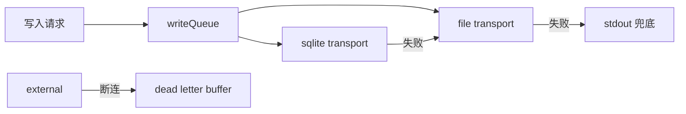

| 场景 | 行为 |
|------|------|
| SQLite 锁/损坏 | 自动降级仅写 JSONL + warn |
| 磁盘满 | 停止低优先级 category，保留 error |
| Electron 离线 | 本地 file+sqlite 正常，external 缓冲 |
| external 恢复 | buffer 自动重放 |

开关：`observability.feature.degradedMode`（默认开，不可关）

#### ② 版本与发布关联（MVP，P2）

每条 `LogEvent` 强制携带：

```typescript
{ appVersion: "1.1.8", buildId?: string, nodeVersion: process.version }
```

- 日志中心可按版本筛选、对比错误率
- API：`GET /logs/aggregate?groupBy=appVersion`
- 升级后错误激增 → Recommender 推荐「查看版本变更说明」

#### ③ 业务实体深链接 `entityRefs`（MVP，P3）

统一业务关联字段，快速从日志跳到业务对象：

```typescript
entityRefs?: {
  projectId?: number;
  storyboardId?: number;
  assetId?: number;
  taskId?: number;
  scriptId?: number;
}
```

UI：日志详情展示可点击链接 → 项目/分镜/任务页。

#### ④ Token / 成本追踪（增强，P6）

AI 调用 payload 记录 `tokensIn/tokensOut`；扩展：

| 能力 | 说明 |
|------|------|
| 成本估算 | 按 vendor 单价表（`o_setting` 可配）估算单次/日/项目成本 |
| 成本 API | `GET /logs/aggregate?metric=cost&groupBy=vendorId` |
| 预算告警 | 日成本超阈值 → 规则告警 |
| Recommender | 同等质量下推荐更低成本厂商 |

开关：`feature.costTracking`（默认关，需用户配置单价后开）

#### ⑤ 数据生命周期与合规（增强，P4）

| 能力 | 说明 |
|------|------|
| **保留策略** | 已有 retentionDays |
| **按项目删除** | `DELETE /logs/purge?projectId=` 清除该项目相关日志（管理员+审计） |
| **导出权** | 用户可导出自己项目日志（GDPR 风格，Electron 本地优先） |
| **本地优先** | Electron 默认数据不出本机；ingest/external 需显式开启 |
| **同意机制** | `clientReport` 开启前 UI 弹窗说明采集范围 |

#### ⑥ 采样完整性标记（MVP，P2）

采样丢弃时，在 trace 头事件标记 `sampled: true, droppedCategories: ["vendor"]`，避免用户误以为链路完整。

#### ⑦ 写入侧限流 Cap（MVP，P1）

防止异常循环刷日志：

| Cap | 默认值 |
|-----|--------|
| 每模块 | 500 条/分钟 |
| 每 vendor poll | 30 条/分钟（采样后） |
| 全局 | 5000 条/分钟 |

超限：降级为 counter 汇总（`{ message: "poll x120 suppressed" }`）而非逐条写。

#### ⑧ 多实例汇聚（增强，P4）

多台 Toonflow / 子应用向同一 ingest 推送时：

- `instanceId` + `appId` 区分来源
- 聚合 API 支持 `groupBy=instanceId`
- 日志中心「实例」筛选器

#### ⑨ 时段对比分析（增强，P5）

`GET /logs/compare?baseline=7d&current=1d&groupBy=errorFingerprint`

- 输出：新增错误、消失错误、错误率变化 Top N
- UI：「本周新增问题」面板
- 用于发布前后对比，不依赖 ML

#### ⑩ 异常基线检测（增强，P6）

规则驱动（非 ML）：

- 错误率较 7 日基线超 2σ → `anomaly` 事件
- 某 vendor 成功率骤降 > 20% → 告警 + Recommender 推荐 fallback

开关：`feature.anomaly`（默认开）

#### ⑪ API Key 轮转（增强，P4）

- ingest 支持 **双 Key 并行**（`primary` + `secondary`）
- `PUT /logs/ingest/rotate-key` 生成新 Key，旧 Key 7 天后失效
- 审计日志记录轮转操作

#### ⑫ 推荐反馈闭环（增强，P6）

```typescript
POST /logs/recommend/feedback { recommendationId, helpful: boolean }
```

- 统计每条推荐的 helpful 率
- helpful 率 < 30% 的规则自动降权（不删除，可人工恢复）
- 不训练 ML，仅规则优先级调整

### 19.3 Electron 特有补充

| 项 | 方案 | 阶段 |
|----|------|------|
| 主进程 vs 渲染进程 | 主进程 obs 实例；渲染进程经 `reportError()` 上报主进程 | P5 browser SDK |
| IPC trace 传播 | `ipcMain` 携带 traceId | P2 |
| 系统通知 | 致命错误 + `vendor_fail_burst` → Electron Notification（可关） | P6 |
| 日志目录随用户迁移 | 导出/导入 `data/logs` + `o_log_events` 备份指南 | P8 文档 |

### 19.4 CI / 测试集成（增强，P7+）

| 项 | 方案 |
|----|------|
| CI 日志 | GitHub Actions 示例：失败步骤 Push 关键事件到 ingest |
| 契约测试 | `packages/observability` 独立 `yarn test` |
| 负载基准 | `benchmarks/write-throughput.ts`：目标 > 5000 events/s 入队 |
| 回归 | PR CI 跑 schema 快照 + switch 单测 |

### 19.5 国际化（增强，P5）

- Playbook / Recommender / UI 文案走 i18n key（复用 Toonflow-web 现有 zh-CN/en 体系）
- 日志 `message` 保持原始语言（厂商返回中文/英文不翻译）
- 诊断结论与建议操作支持多语言

### 19.6 明确不做（防止 scope 膨胀）

| 不做 | 原因 |
|------|------|
| 完整 APM（分布式追踪 UI） | OTLP 导出即可对接 Jaeger/Grafana |
| 日志 ML 聚类 | 指纹 + 规则已够；避免不可解释 |
| 实时日志全文搜索引擎 | SQLite FTS 够用；超大可接 Loki |
| 替换现有任务中心 | `o_tasks` 保留，日志中心并列 |
| 用户行为埋点 | 与 observability 分离，独立体系 |

### 19.7 文档补充（并入 P8）

`docs/observability/` 新增：

| 文档 | 内容 |
|------|------|
| `cookbook/10-offline-degraded.md` | 离线/降级行为说明 |
| `cookbook/11-cost-tracking.md` | Token 成本配置 |
| `cookbook/12-multi-instance.md` | 多实例 ingest 汇聚 |
| `troubleshooting/10-disk-full.md` | 磁盘满处理 |
| `troubleshooting/11-after-upgrade.md` | 升级后错误增多排查 |
| `migration/backup-restore.md` | 日志备份与换机迁移 |
| `migration/schema-upgrade.md` | o_log_events 表结构升级 |
| `operations/ci-integration.md` | CI 接入示例 |

### 19.8 分级实施建议（避免一次做太多）

| 级别 | 包含项 | 建议阶段 |
|------|--------|----------|
| **MVP 必做** | ①降级 ②版本 ③entityRefs ⑥采样标记 ⑦写入 cap | P1–P3 |
| **增强** | ④成本 ⑤合规 ⑧多实例 ⑨对比 ⑩异常 ⑪Key轮转 ⑫反馈 | P4–P6 |
| **可选** | CI 基准、系统通知、i18n 全覆盖 | P7–P8 |

---

## 二十、方案完整性结论

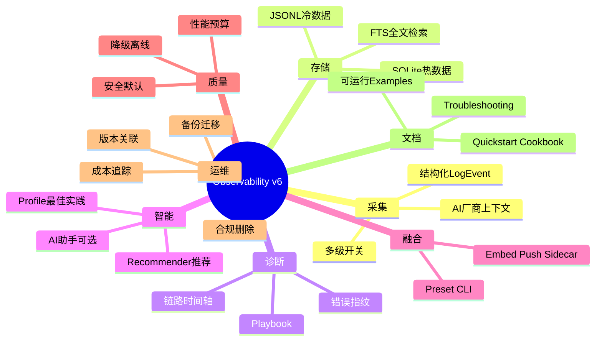

**结论：v8 在架构、系统、细节三层均已闭环，设计冻结。** 见第二十二章 22.8；下一步为 **P0 实施**。

1. **P0–P1**（1–2 周）：组件包 + 内核 + 降级链 + bootstrap 生命周期
2. **P2–P4**（2–3 周）：AI 观测 + 存储 + 诊断/推荐 API + 事件中心写穿
3. **P5–P6**（2 周）：UI + 统一事件中心 + Playbook + Recommender
4. **P7–P8**（1–2 周）：可选 OTLP + 完整文档 + 应急演练手册

---

## 二十一、系统整体性考量（v7）

> 单点能力（采集、诊断、推荐）已齐；本章从**系统边界、数据一致性、生命周期、协作流程**四个维度查漏，避免「组件很好、系统不通」。

### 21.1 系统边界与依赖图

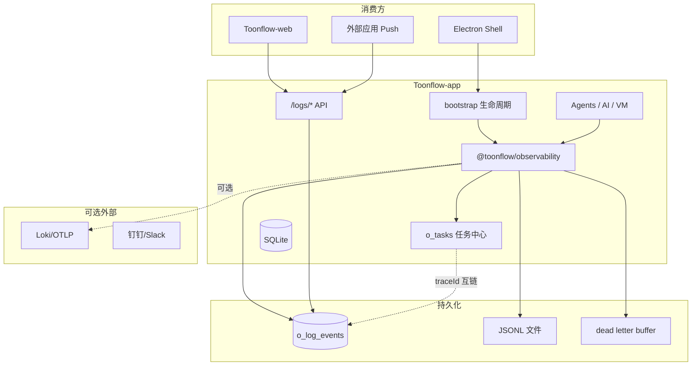

**边界原则：**
- 组件包不依赖 Toonflow 业务表；互链通过 `traceId` / `entityRefs` / `taskId` 松耦合
- Toonflow-web 只通过 `/logs/*` REST 消费，不直接读 SQLite 文件
- 外部应用只通过 ingest 契约接入，不共享 DB

### 21.2 启动生命周期（Bootstrap Ordering）

避免「DB 未就绪写 SQLite transport 失败」等鸡生蛋问题：

| 顺序 | 步骤 | 说明 |
|------|------|------|
| 1 | `import "@/observability/bootstrap"` | 最早加载，在 `app.ts` 第 1 行 |
| 2 | 初始化 **file + stdout** transport | 不依赖 DB，立即可写 |
| 3 | `env.ts` / dotenv 加载 | 开关解析 |
| 4 | DB 迁移完成（`initDB`） | 现有流程 |
| 5 | **延迟挂载 sqlite transport** | `obs.attachSqlite(u.db)` |
| 6 | Express / Socket 适配器挂载 | trace 中间件 |
| 7 | `startupCheck` 自检 | ossURL、磁盘、权限 |
| 8 | `applyProfile("balanced")` | 若无可观测性配置 |

```typescript
// bootstrap.ts 伪代码
const obs = createFromPreset("electron", { transports: { file: true, stdout: true } });
export async function attachObservabilityAfterDb(knex) {
  obs.attachTransport(sqliteTransport(knex));
  await obs.startupCheck();
}
```

### 21.3 数据一致性：双写与 SSOT

当前存在 **o_log_events（运行时日志）** 与 **o_tasks（业务任务）** 双轨：

| 数据 | SSOT | 另一方 |
|------|------|--------|
| 任务状态/结果 | `o_tasks` | 日志记 `task.start/done` 事件镜像 |
| 运行时错误上下文 | `o_log_events` | `o_tasks.reason` 仅存摘要 |
| 诊断归因 | Playbook 引擎 | 结论写入日志 payload，任务 reason 可引用 traceId |

**写穿规则（P3–P4）：**
- `taskRecord()` 自动：`obs.task.start()` → 写日志 + 插 o_tasks
- `done(-1)` 时：日志写完整 error payload；`o_tasks.reason` 只存 `message + traceId`
- 禁止两处各写各的字符串——以 **traceId 为关联键**

### 21.4 配置优先级与冲突检测

```
请求级 override > o_setting > 环境变量 > Profile 默认 > 代码默认
```

**冲突检测（启动时 + `GET /logs/switches`）：**
- env `OBS_ENABLED=0` 但 o_setting `enabled=true` → warn，以 env 为准
- `secure` Profile 但 `promptDebug=true` → 标红冲突，Recommender 推荐修复
- `ingest` 开但无 API Key → 阻塞 ingest，file/sqlite 正常

输出：`{ sources: { env, db, profile }, conflicts: [...] }`

### 21.5 统一事件中心（Incident Hub）

用户不应在「任务中心 / 日志中心 / 弹窗报错」三处来回找：

| 来源 | 汇入 |
|------|------|
| `o_log_events` level=error | 事件中心 |
| `o_tasks` state=生成失败 | 事件中心（带 traceId） |
| 前端 `POST /logs/client` | 事件中心 |
| 规则告警 / 异常基线 | 事件中心 |

**API：** `GET /logs/incidents` — 聚合去重（同 fingerprint 合并），按严重度排序

**UI：** 日志中心默认 Tab 为「事件」而非原始日志流；原始日志为高级视图

### 21.6 跨仓库协作（Toonflow-app ↔ Toonflow-web）

| 契约 | 责任方 |
|------|--------|
| `docs/observability/api/openapi.yaml` | app 维护，web 消费 |
| 日志中心 UI | web 实现，通过 `/logs/*` 仅调用 API |
| `traceId` 透传 | web axios 拦截器附加 `X-Trace-Id` |
| 类型共享 | 可选 `packages/observability` 导出 TS 类型，web 引用 |

**版本对齐：** app 与 web 联调时，OpenAPI 版本号与 app `appVersion` 对应表写入文档

### 21.7 循环依赖与元观测边界

| 风险 | 防护 |
|------|------|
| AI 助手分析日志时又产生 AI 调用日志 | `obs.withLocalSwitch({ category: { ai_call: false } })` 包裹助手调用 |
| 日志写日志无限递归 | writeQueue 处理自身错误只写 stdout，不再入队 |
| Recommender 读日志时锁表 | 只读副本查询或 WAL 模式；聚合走缓存 |

开关：`feature.aiAssistant` 调用自动套「静默上下文」，用户无感

### 21.8 多进程与部署形态

| 形态 | 注意点 | 方案 |
|------|--------|------|
| Electron 主进程 | 唯一 obs 实例 | 渲染进程走 IPC上报 |
| PM2 cluster | 多实例同写 SQLite | **单实例写** 或仅 file transport + 外挂聚合；默认文档建议 PM2 `instances: 1` |
| Docker 多副本 | 同 ingest | `instanceId` 区分；避免 SQLite 共享卷 |
| 开发热重载 | 重复 bootstrap | `globalThis.__obs` 单例防双实例 |

### 21.9 时间、顺序与幂等

| 项 | 规范 |
|----|------|
| 存储时间戳 | **UTC ms**（`ts`），UI 按用户时区展示 |
| 同 trace 内顺序 | 写入时带 `spanSeq` 递增序号 |
| ingest 幂等 | 客户端可选 `eventId`（UUID）；重复 `eventId` 忽略 |
| 时钟偏移 | 跨机器 trace 允许 ±5min 窗口合并 |

### 21.10 开关组合矩阵（非法组合拦截）

| 组合 | 处理 |
|------|------|
| `OBS_ENABLED=0` + 任何 feature 开 | 全部忽略，启动 warn |
| `promptDebug` + `secure` Profile | 拒绝应用 Profile，需先关 promptDebug |
| `ingest` 开 + 无 Key | ingest 503，其他正常 |
| `external` 开 + 无 URL | 降级 file，warn |
| `debug` Profile + 无 ttl | 强制 `ttl=2h` |

`SwitchManager.validate()` 在启动与 `PUT /logs/switches` 时执行

### 21.11 威胁模型（精简 STRIDE）

| 威胁 | 缓解 |
|------|------|
| **S** 伪造 ingest | API Key + 限流 + schema 校验 |
| **T** 日志篡改 | 本地 SQLite 仅管理员；audit 记导出 |
| **R** 重放 ingest | eventId 幂等 + 时间窗口 |
| **I** 越权读日志 | JWT + projectId 过滤 |
| **D** 日志洪水 DoS | 写入 cap + 背压 |
| **E** 敏感信息泄露 | redact + 安全 error handler |

文档：`docs/observability/operations/threat-model.md`（P8）

### 21.12 应急运维（Runbook）

| 场景 | 操作 |
|------|------|
| 日志拖垮性能 | `OBS_ENABLED=0` 或 `applyProfile("performance")` |
| 磁盘爆满 | 自动降 retention；手动 `purge` + 删 JSONL |
| 升级后异常 | 按 `appVersion` 筛选；回滚版本 |
| SQLite 损坏 | 自动降级 JSONL；从 JSONL 重建索引工具（P4 可选） |
| 误开 promptDebug | Recommender 告警 + 2h 强制关 |

文档：`docs/observability/operations/emergency-runbook.md`（P8）

### 21.13 子系统 SLO（日志系统自身）

| 指标 | 目标 |
|------|------|
| 热路径入队延迟 P99 | < 2ms |
| error 事件丢失率 | 0%（背压时丢 info，不丢 error） |
| query P95（10 万条） | < 500ms |
| ingest 可用性 | 99.5%（仅服务端模式） |
| 降级恢复时间 | external buffer 重放 < 5min |

`GET /logs/health` 暴露与 SLO 相关的实时指标

### 21.14 治理与演进

| 项 | 约定 |
|----|------|
| **ADR** | 重大决策写 `docs/observability/adr/001-observability-architecture.md` |
| **Semver** | `@toonflow/observability` 独立版本；breaking 升 major |
| **兼容矩阵** | 文档维护 obs 包版本 ↔ Toonflow-app 最低版本 |
| **贡献指南** | 新 Playbook/RecommendationRule 需单测 + 文档 |
| **发布** | electron-builder 打包时包含 `packages/observability/dist` |

### 21.15 用户支持工作流

```
用户报错 → 复制 traceId → 事件中心搜索 → 链路时间轴
         → Playbook 结论 → 若未解决 → 导出脱敏片段 → 提 issue/客服
```

UI：错误弹窗统一展示 `traceId` +「查看详情」跳转事件中心（P5）

### 21.16 系统性「仍不做」清单（克制）

| 不做 | 系统性原因 |
|------|------------|
| 集中式日志 SaaS | 与 Electron 本地优先策略冲突 |
| 强一致分布式追踪 | 超出单机/单应用主线，交 OTLP |
| 替代所有业务状态 | o_tasks / 分镜 state 仍是 SSOT |
| 实时 ML 异常检测 | 规则基线 + 对比已够 |

### 21.17 v7 成熟度总表

| 系统维度 | 状态 |
|----------|------|
| 边界与依赖 | ✅ 二十一章 |
| 启动生命周期 | ✅ bootstrap 分阶段 |
| 数据一致性 | ✅ SSOT + traceId 写穿 |
| 配置治理 | ✅ 优先级 + 冲突检测 |
| 用户统一视图 | ✅ Incident Hub |
| 跨仓库契约 | ✅ OpenAPI |
| 多部署形态 | ✅ Electron/PM2/Docker |
| 安全威胁 | ✅ STRIDE |
| 应急运维 | ✅ Runbook |
| 子系统 SLO | ✅ |
| 治理演进 | ✅ ADR/Semver |
| 支持流程 | ✅ traceId 工作流 |

**系统性结论（v7）。** v8 第二十二章已补细节优化与架构冻结声明；**无重大遗漏**。

### 21.18 文档补充（P8）

- `operations/threat-model.md`
- `operations/emergency-runbook.md`
- `operations/slo.md`
- `adr/001-observability-architecture.md`
- `architecture/incident-hub.md`
- `architecture/bootstrap-lifecycle.md`

---

## 二十二、细节优化清单（v8 · 最后一轮）

> v7 解决系统通不通；本章解决**好不好用、稳不稳、细处是否漏风**。按 **MVP / Polish** 分级；Polish 不阻塞首版上线。

### 22.1 写入路径细节

| 细节 | 方案 | 级别 |
|------|------|------|
| **payload 大小上限** | 单条 `payload` 入库前截断至 16KB，超出记 `payloadTruncated: true` | MVP |
| **message 清洗** | 去除控制字符、规范化换行，防日志注入/终端破坏 | MVP |
| **writeQueue 内存上限** | 队列最大 10_000 条，满则背压（与第十九章 cap 联动） | MVP |
| **临时模块调试** | `obs.debugModule("scriptAgent", "15m")` 局部提升 level，到期自动恢复 | Polish |
| **可复现采样** | 采样用 `hash(traceId) % N`，同一 trace 采样结果一致 | Polish |
| **替换 morgan** | express 适配器完全替代裸 `morgan("dev")`，HTTP 日志结构化 | MVP |

### 22.2 存储与索引细节

| 细节 | 方案 | 级别 |
|------|------|------|
| **SQLite WAL 模式** | `PRAGMA journal_mode=WAL` + 定期 checkpoint，减写入锁竞争 | MVP |
| **FTS 同步** | insert 时同步写 `o_log_events_fts`；删除/ purge 同步清理 | MVP |
| **JSONL 按日命名** | `logs/2026-07-09.jsonl`，UTC 切日，与 retention 对齐 | MVP |
| **JSONL 行级容错** | 读取跳过损坏行，记 `category=system` 告警，不整文件失败 | MVP |
| **Windows 文件锁** | file transport 用 `fs.open` 追加 + 短时重试，避免 Electron 并发写冲突 | MVP |
| **UTF-8 强制** | JSONL 无 BOM，`\u` 转义非 ASCII；UI 正确显示中文厂商错误 | MVP |
| **索引维护任务** | 每周低峰 `VACUUM` + FTS rebuild（`feature.maintenance`，默认开） | Polish |
| **旧 JSONL 压缩** | 超 7 天 `.jsonl` → `.jsonl.gz`（与 retention 协同） | Polish |

### 22.3 查询与 API 细节

| 细节 | 方案 | 级别 |
|------|------|------|
| **SQL 参数化** | 所有 query 走 knex 绑定参数，禁止拼接 SQL | MVP |
| **批量 ingest** | `POST /logs/ingest/batch` 最多 100 条，逐条校验，返回 `{ accepted, rejected[] }` | MVP |
| **大导出流式** | `GET /logs/export` 用 stream，避免一次性加载内存 | MVP |
| **查询限流响应** | 超限时 `429` + `Retry-After` 头 | MVP |
| **trace 对比** | `GET /logs/diff?traceA=&traceB=` 高亮差异事件（Polish，排障利器） | Polish |
| **分享链接** | `POST /logs/share` 生成 24h 有效只读 token（管理员，脱敏快照） | Polish |
| **健康检查磁盘** | `/logs/health` 含 `diskFreePercent`，< 20% 标 `degraded` | MVP |

### 22.4 与 Toonflow 现有模块衔接细节

| 模块 | 细节优化 |
|------|----------|
| **结构化生产** | `compileLog` / `qualityGate` 写入 `entityRefs.storyboardId` + `payload.compileStage` |
| **QualityGate** | `retryHint` 映射到 Playbook `pb_quality_retry`，日志中心展示 |
| **ModelRouter** | 路由决策写 `payload.routeReason`，Recommender 可解释「为何选此模型」 |
| **VM 沙盒** | 捕获 vm 超时/内存异常 → `category=vendor, errorCategory=timeout` |
| **axios 调用** | 统一经 `normalizeError`，`upstreamMessage` 截断 500 字符入库 |
| **Socket 重连** | 重连携带原 `traceId` query，避免 Agent 会话链路断裂 |
| **缩略图/oss** | `app.ts` 缩略图失败记 `category=system`，关联 `entityRefs` |
| **JWT 长效任务** | AI 长任务与 HTTP 鉴权解耦；trace 查询不依赖 JWT 未过期 |

### 22.5 UI / UX 细节（P5 Polish 包）

| 细节 | 说明 |
|------|------|
| **默认「事件」Tab** | 见 21.5 Incident Hub |
| **虚拟滚动** | 日志列表 > 200 条时虚拟列表，防卡顿 |
| **空状态引导** | 无日志时展示「如何开启 / 常见问题」 |
| **Cmd+K / Ctrl+K** | 全局搜索 traceId / 关键词 |
| **一键复制** | traceId、fingerprint、**Markdown 排障摘要**（给客服/issue） |
| **时区显示** | 默认本地时区，可切换 UTC |
| **payload 折叠** | JSON 树形折叠，默认隐藏大字段 |
| **严重度色标** | error/warn/info 行背景区分 |
| **加载骨架屏** | 查询/链路加载态 |
| **i18n** | Playbook/推荐文案走现有 zh-CN/en 体系（第十九章） |

**Markdown 排障摘要示例：**

```markdown
## Toonflow 排障摘要
- traceId: abc-123
- 版本: 1.1.8
- 厂商: volcengine / doubao-seed
- 结论: rate_limit（pb_rate_limit）
- 建议: 等待 60s 或切换 minimax
```

### 22.6 平台与打包细节

| 细节 | 方案 |
|------|------|
| **Electron asar** | `packages/observability/dist` 打入 asar；原生依赖（若有）走 `asarUnpack` |
| **开发热重载** | `globalThis.__obs` 单例（21.8） |
| **权限失败** | 复用 `checkPermissions()`，写 `category=system` 后 `dialog` |
| **渐进发布** | `o_setting.observabilityRollout=1` 全量；新装默认开，老用户升级向导 | 
| **升级向导** | 首次启用弹窗：说明本地存储、可关 `OBS_ENABLED`、打开日志中心 |

### 22.7 MVP vs Polish 汇总

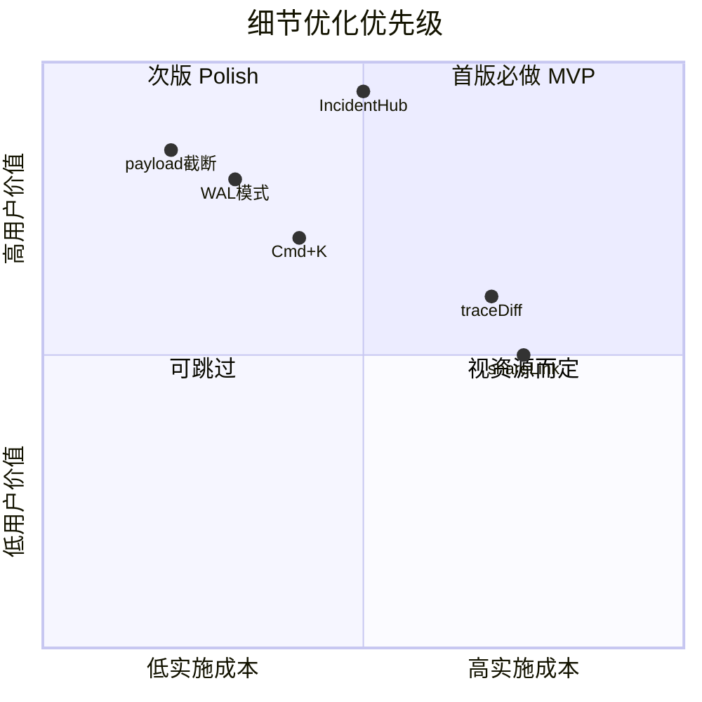

| 级别 | 数量 | 阶段 |
|------|------|------|
| **MVP 细节** | ~20 项 | P1–P4 随功能完成 |
| **Polish 细节** | ~12 项 | P5–P8 或 v1.1 迭代 |

### 22.8 架构冻结声明

| 冻结项 | 说明 |
|--------|------|
| **核心模型** | `LogEvent` + `traceId` + `errorFingerprint` + `entityRefs` 不再改名 |
| **存储主线** | SQLite 热 + JSONL 冷，不引入第二套存储 |
| **智能主线** | 指纹 → Playbook → Recommender → AI（可选），不新增第五层 |
| **融合主线** | Embed / Push / Sidecar 三种，不新增第四种 |
| **扩展方式** | 只通过插件注册（Transport/Playbook/Rule/Profile），不改内核 |
| **后续变更** | 走 ADR + minor/major 版本，写入 CHANGELOG |

**v8 最终结论：**

- **架构 / 系统 / 细节** 三层均已文档化
- 继续「还能考虑什么」的边际收益极低
- **建议冻结设计，进入 P0 实施**
- 实施中若发现新问题，走 ADR 增量修订，而非再扩一大章

### 22.9 文档补充（并入 P8）

- `architecture/detail-checklist.md` — 本章 MVP 勾选清单
- `operations/maintenance.md` — VACUUM、FTS rebuild、磁盘监控
- `cookbook/13-support-markdown-export.md` — 客服排障摘要格式

---

## 十五、实施分期

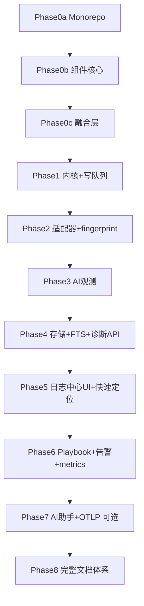

| 阶段 | 交付物 | 关键文件 |
|------|--------|----------|
| **P0a** | yarn workspaces、packages 构建链 | 根 `package.json` |
| **P0b** | 类型、SwitchManager、Transport/Adapter 接口、Mock | `packages/observability/src/core/*` |
| **P0c** | Presets、**Profiles**、CLI init **--smart**、融合契约 | `presets.ts`, `profiles.ts`, `fusion/*` |
| **P1** | pino、writeQueue、降级链、写入 cap、**分阶段 bootstrap** | `bootstrap.ts`, `degraded.ts` |
| **P2** | 适配器、traceparent、fingerprint、**appVersion**、**sampled 标记** | `fingerprint.ts` |
| **P3** | ai-sdk 适配器、AiObservability、**entityRefs**、**task 写穿** | `adapters/ai-sdk.ts` |
| **P4** | o_log_events + FTS + WAL、**payload 截断**、batch ingest、**/logs/incidents** | `routes/logs/*` |
| **P5** | 事件中心 + **UX Polish**（虚拟滚动、Cmd+K、Markdown 复制） | Toonflow-web |
| **P6** | Playbook、Recommender、**异常基线**、**成本追踪**、**推荐反馈** | `recommender.ts`, `cost.ts` |
| **P7** | AI 助手（可选）、OTLP/Loki、OpenAPI | `aiAssistant.ts`, `external.ts` |
| **P8** | 完整文档 + **Profile/推荐引擎指南** + examples | `docs/observability/**` |

---

## 十六、关键设计原则

1. **组件优先**：核心逻辑在 `packages/observability`，Toonflow 只做薄集成
2. **默认最优**：新装即用 `balanced` Profile，安全+性能+简单三角平衡
3. **智能四层**：指纹 → Playbook → **Recommender** → AI 助手（可选），前三层不依赖 LLM
4. **推荐可解释**：每条建议有 reason + confidence + impact，可一键应用或拒绝
5. **定位优先**：traceId 搜、fingerprint 聚合、Playbook 给建议、Recommender 给最优方案
6. **性能预算**：热路径 < 1ms，查询 < 200ms，推荐计算异步不阻塞写入
7. **安全默认**：脱敏开、ingest 需 Key、debug Profile 限时、危险推荐需确认
8. **开关分层**：总开关 → Transport → Category → Module → Vendor → Feature
9. **Profile 一键**：`applyProfile("balanced")` 恢复最佳实践，无需手动调 20 个开关
10. **插件扩展**：Transport / Playbook / **RecommendationRule** / Profile 可注册
11. **文档即产品**：教程可运行，Profile/Recommender 有专门 Cookbook
12. **智能可选**：`feature.recommend=false` 时仍保留指纹+Playbook 定位能力
13. **韧性优先**：Transport 降级链保证「日志系统不拖垮业务」
14. **可运维**：版本关联、备份迁移、合规删除有文档与 API
15. **克制扩张**：明确「不做」清单，避免做成重型 APM
16. **细节到位**：payload 截断、WAL、参数化查询、Windows 文件锁等 MVP 细节随 P1–P4 落地
17. **架构冻结**：v8 后仅 ADR 增量修订，不再扩一大章

---

## 十七、验收标准

**性能**
- [ ] `OBS_ENABLED=0` 时零开销；热路径入队 < 1ms
- [ ] poll 采样开启时，稳定轮询日志量 < 全量的 5%
- [ ] 10 万条日志下 keyword 搜索 < 200ms（FTS5）
- [ ] 队列满时仅丢弃低优先级，error 不丢

**安全**
- [ ] API 500 仅返回 `{ message, traceId }`
- [ ] ingest 无 API Key 返回 401；超 64KB 拒绝
- [ ] 导出操作写入 audit 日志
- [ ] `feature.redact` 开启时日志无 API Key 明文

**精准定位**
- [ ] 同厂商同类错误共享 `errorFingerprint`，`GET /logs/similar` 可聚合
- [ ] `GET /logs/diagnose?traceId=xxx` 返回 Playbook 结论 + 建议操作
- [ ] 日志中心：粘贴 traceId → 3 秒内展示链路时间轴
- [ ] Playbook 卡片可跳转 troubleshooting 文档
- [ ] 错误 payload 含 vendorId / errorCategory / externalTaskId

**持久化与暴露**
- [ ] `data/logs/` 有按日 JSONL；`GET /logs/query` / `aggregate` / `trace` 可用
- [ ] `PUT /logs/switches` 热更新无需重启

**AI / 厂商**
- [ ] 模拟 401/429/超时，日志含完整诊断字段
- [ ] trace 视图可见 HTTP → Socket → AI 全链

**融合接入**
- [ ] `createFromPreset("express-api")` 一行可用
- [ ] CLI init + Python/Go ingest 示例可运行
- [ ] `createMockObservability()` 单测可用

**智能推荐**
- [ ] 新装默认 `balanced` Profile，安全/性能/简单评分均 > 80
- [ ] `GET /logs/recommend/vendors` 返回近 7 天成功率排名
- [ ] `rate_limit` 错误自动推荐 fallback 厂商（需确认后应用）
- [ ] `CLI init --smart` 自动检测项目类型并推荐 preset
- [ ] `debug` Profile 2h 后自动回退 `balanced`
- [ ] `feature.recommend=false` 时推荐 API 返回 404，其他功能正常

**智能（可选 LLM）**
- [ ] AI 助手关闭时，指纹 + Playbook + Recommender 仍可定位并给建议
- [ ] webhook 告警可推送

**运维与边界（v6–v7）**
- [ ] SQLite 失败时自动降级 JSONL，业务不中断
- [ ] bootstrap：DB 就绪前仅 file/stdout，就绪后 attach sqlite
- [ ] `taskRecord` 与日志通过 traceId 写穿，无重复矛盾 reason
- [ ] `GET /logs/incidents` 聚合 error 日志 + 失败任务 + 告警
- [ ] 错误弹窗展示 traceId 并可跳转事件中心
- [ ] AI 助手调用不产生递归 ai_call 日志
- [ ] ingest 重复 eventId 幂等忽略
- [ ] `SwitchManager.validate()` 拦截非法开关组合
- [ ] 每条日志含 `appVersion`；可按版本对比错误率
- [ ] `entityRefs` 可从日志详情跳转项目/分镜/任务
- [ ] 写入超 cap 时汇总而非刷屏
- [ ] `DELETE /logs/purge?projectId=` 可清除项目日志并写 audit
- [ ] `GET /logs/compare` 可对比两时段错误变化
- [ ] ingest 双 Key 轮转流程可用

**细节优化（v8 MVP）**
- [ ] 单条 payload 超 16KB 截断且标记 `payloadTruncated`
- [ ] SQLite 使用 WAL；JSONL 按 UTC 日切文件
- [ ] 损坏 JSONL 行可跳过，不导致查询崩溃
- [ ] `POST /logs/ingest/batch` 支持部分成功/失败响应
- [ ] 导出大结果集为流式，不 OOM
- [ ] `/logs/health` 含磁盘剩余空间
- [ ] Socket 重连保留 traceId；compileLog 带 storyboardId

**细节优化（v8 Polish，可 v1.1）**
- [ ] 日志中心 Cmd+K 搜索、Markdown 排障摘要复制
- [ ] `GET /logs/diff` trace 对比（可选）

**文档（P8）**
- [ ] `packages/observability/docs/` 为 SSOT；根 `docs/observability/README.md` 导航正确
- [ ] quickstart ×6、cookbook ×9、troubleshooting ×9 就位
- [ ] `packages/observability/examples/` 每个示例可独立运行
- [ ] `adr/001–003` 就位；`ROADMAP.md` 含 v1.1 规划
- [ ] Playbook ID 与 troubleshooting 文档一一对应

---

## 二十三、独立架构实施总计划（执行版）

> **决策：可观测性作为独立子架构开发**，与 Toonflow 业务解耦；**文档、ADR、示例与代码同仓**，作为后期迭代唯一基座（SSOT）。

### 23.1 独立架构 vs 宿主集成

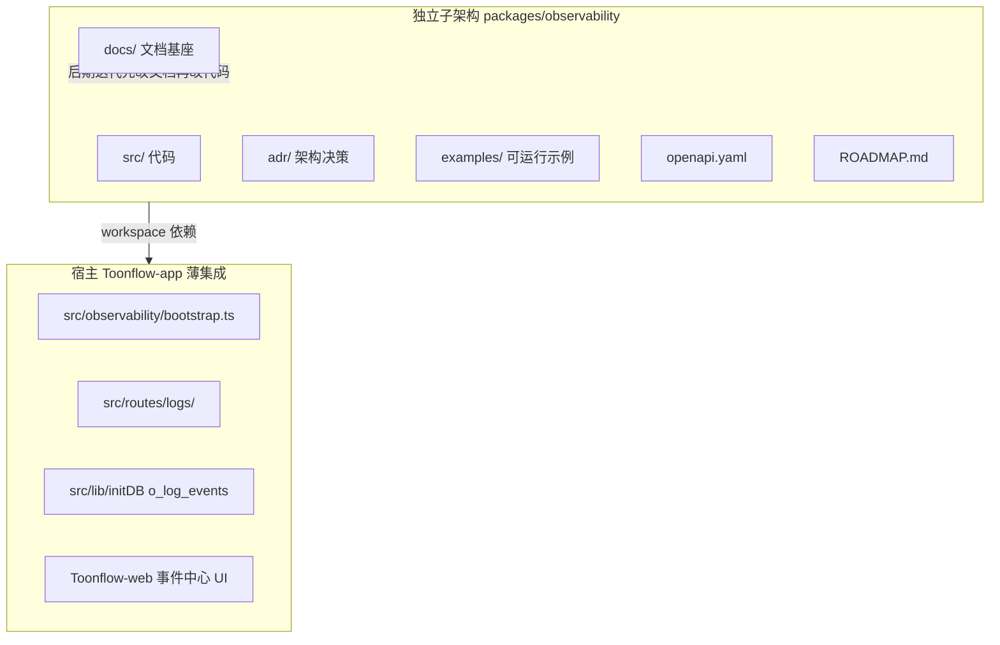

| 层级 | 路径 | 职责 | 迭代归属 |
|------|------|------|----------|
| **独立子架构** | `packages/observability/` | 全部核心逻辑、契约、文档、测试 | **主迭代基座** |
| **CLI** | `packages/observability-cli/` | init --smart 脚手架 | 随子架构版本 |
| **Browser SDK** | `packages/observability-browser/` | 前端 reportError（P7） | 随子架构版本 |
| **宿主桥接** | `src/observability/` | bootstrap、o_setting 同步、DB 注入 | 仅胶水代码 |
| **宿主 API** | `src/routes/logs/` | Express 路由（调用子架构服务） | 薄封装 |
| **宿主 UI** | Toonflow-web | 消费 OpenAPI | 独立前端迭代 |
| **根索引** | `docs/observability/README.md` | 指向 `packages/observability/docs/` | 导航入口 |

**原则：** 新功能默认在 `packages/observability` 实现；宿主只增加适配，不复制逻辑。

### 23.2 独立子架构目录（P0 一次性落地）

```
packages/observability/
  package.json                 # name: @toonflow/observability, exports 子路径
  tsconfig.json
  ARCHITECTURE.md              # 架构总览（从本计划精简）
  ROADMAP.md                   # 版本路线图 v1.0 → v1.1 → v2.0
  CHANGELOG.md
  README.md                    # 5 分钟接入
  docs/                        # ★ 文档 SSOT，后期迭代基座
    README.md
    architecture/
      overview.md
      bootstrap-lifecycle.md
      incident-hub.md
      detail-checklist.md
    quickstart/                # ×6
    cookbook/                  # ×9+
    troubleshooting/           # ×9+
    api/
      openapi.yaml
      query-examples.md
    operations/
      threat-model.md
      emergency-runbook.md
      slo.md
      maintenance.md
    migration/
      from-legacy-logger.md
      backup-restore.md
      schema-upgrade.md
    adr/
      001-observability-architecture.md
      002-standalone-package.md
      003-logevent-schema.md
  examples/                    # 可运行，CI 验证
    express-minimal/
    electron-minimal/
    python-ingest/
    custom-playbook/
  src/
    index.ts
    presets.ts
    profiles.ts
    core/ ...
    transports/ ...
    adapters/ ...
    analyze/ ...
    fusion/ ...
    testing/mock.ts
  tests/                       # 子架构独立单测
    unit/
    contract/
  benchmarks/
    write-throughput.ts
```

根目录导航（P0 创建）：

```
docs/observability/README.md   → 见 packages/observability/docs/README.md
```

### 23.3 分期实施计划（全量）

#### P0 — 独立基座立起来（约 1 周）

**目标：** 子架构可 build、可测试；文档骨架就位；零业务依赖。

| # | 任务 | 产出文件 |
|---|------|----------|
| 0.1 | 根 `package.json` 增加 `workspaces: ["packages/*"]` | `package.json` |
| 0.2 | 创建 `@toonflow/observability` 包脚手架 | `packages/observability/package.json`, `tsconfig.json` |
| 0.3 | 定义 `LogEvent`、`SwitchConfig`、`Transport` 接口 | `src/types.ts` |
| 0.4 | 实现 `SwitchManager` + `Profiles`（balanced/secure/performance/debug） | `src/core/switchManager.ts`, `src/profiles.ts` |
| 0.5 | 实现 `Presets` + `createFromPreset` | `src/presets.ts` |
| 0.6 | `createMockObservability` 测试工具 | `src/testing/mock.ts` |
| 0.7 | **文档基座**：ARCHITECTURE.md、ROADMAP.md、adr/001–003、docs 目录骨架 | `packages/observability/docs/**` |
| 0.8 | 根 `docs/observability/README.md` 导航 | `docs/observability/README.md` |
| 0.9 | 子架构 `yarn test` / `yarn build` 脚本 | `package.json` scripts |
| 0.10 | `observability.config.example.json` | 包根目录 |

**DoD：** `cd packages/observability && yarn build && yarn test` 通过；文档目录结构完整可浏览。

---

#### P1 — 运行时内核（约 1 周）

**目标：** 日志能写入 JSONL；降级链可用；宿主 bootstrap 骨架。

| # | 任务 | 产出 |
|---|------|------|
| 1.1 | pino 封装 + `createObservability` | `src/core/logger.ts`, `src/index.ts` |
| 1.2 | `writeQueue` + 背压 + 写入 cap | `src/core/writeQueue.ts` |
| 1.3 | file transport（按日 JSONL、UTF-8、Windows 锁） | `src/transports/file.ts` |
| 1.4 | stdout transport | `src/transports/stdout.ts` |
| 1.5 | noop transport | `src/transports/noop.ts` |
| 1.6 | 降级链 degraded | `src/core/degraded.ts` |
| 1.7 | redact + message 清洗 | `src/core/redact.ts` |
| 1.8 | env + configFile 解析 | `src/configFile.ts` |
| 1.9 | 宿主 `src/observability/bootstrap.ts`（仅 file+stdout） | 宿主桥接 |
| 1.10 | `app.ts` 第 1 行 `import "@/observability/bootstrap"` | 启用 |
| 1.11 | 文档：`quickstart/01-express-3-lines.md` | docs |

**DoD：** 启动后 `data/logs/YYYY-MM-DD.jsonl` 有结构化日志；`OBS_ENABLED=0` 零开销。

---

#### P2 — 链路与安全（约 1 周）

**目标：** traceId 贯穿；错误指纹；HTTP 安全化。

| # | 任务 | 产出 |
|---|------|------|
| 2.1 | AsyncLocalStorage 上下文 + W3C traceparent | `src/core/context.ts` |
| 2.2 | express 适配器（替代 morgan） | `src/adapters/express.ts` |
| 2.3 | socket.io 适配器 + 重连 traceId | `src/adapters/socketio.ts` |
| 2.4 | `errorFingerprint` | `src/core/fingerprint.ts` |
| 2.5 | 安全 error handler（仅 message+traceId） | express 适配器 |
| 2.6 | `appVersion` 注入每条事件 | bootstrap |
| 2.7 | 采样完整性标记 | sampler |
| 2.8 | graceful shutdown | `src/core/shutdown.ts` |
| 2.9 | 文档：`architecture/bootstrap-lifecycle.md` | docs |

**DoD：** HTTP 响应头含 `X-Trace-Id`；500 不泄露 stack。

---

#### P3 — AI / 厂商观测（约 1 周）

**目标：** 第三方 AI 错误可诊断；与 task 写穿。

| # | 任务 | 产出 |
|---|------|------|
| 3.1 | ai-sdk 适配器包裹 invoke/stream | `src/adapters/ai-sdk.ts` |
| 3.2 | `AiObservability` 服务层 | `src/analyze/aiObservability.ts` |
| 3.3 | 错误分类 `AiErrorCategory` | `src/core/errors.ts` |
| 3.4 | VM `logger()` → 结构化 vendor 事件 | 改 `src/utils/vm.ts` |
| 3.5 | poll 采样 | `src/core/sampler.ts` |
| 3.6 | `taskRecord` 写穿 traceId | 改 `src/utils/taskRecord.ts` |
| 3.7 | 修 `AiAudio` 静默 catch | 改 `src/utils/ai.ts` |
| 3.8 | `entityRefs` schema | `src/schemas/` |
| 3.9 | 文档：`cookbook/02-vendor-debug.md` | docs |

**DoD：** 模拟 429/401，日志含 vendorId/model/errorCategory/traceId。

---

#### P4 — 存储、API、事件中心（约 1.5 周）

**目标：** 可查询、可推荐、可 incidents 聚合；SQLite 热数据。

| # | 任务 | 产出 |
|---|------|------|
| 4.1 | `o_log_events` + FTS5 + WAL migration | `src/lib/initDB.ts` |
| 4.2 | sqlite transport（延迟 attach） | `src/transports/sqlite.ts` |
| 4.3 | `attachObservabilityAfterDb` 生命周期 | `bootstrap.ts` |
| 4.4 | `/logs/query|trace|similar|diagnose|health` | `src/routes/logs/` |
| 4.5 | `/logs/incidents` 统一事件中心 | routes |
| 4.6 | `/logs/recommend/*` | routes |
| 4.7 | `/logs/ingest` + batch + 幂等 eventId | routes |
| 4.8 | `/logs/switches` GET/PUT + validate | routes |
| 4.9 | payload 16KB 截断 | sqlite transport |
| 4.10 | OpenAPI 初版 | `docs/api/openapi.yaml` |
| 4.11 | 文档：troubleshooting 01–07 | docs |

**DoD：** `GET /logs/trace/:id` 返回全链；`GET /logs/incidents` 聚合失败任务+错误日志。

---

#### P5 — 前端事件中心（约 1 周）

**目标：** 用户可搜 traceId、看链路、看推荐。

| # | 任务 | 产出 |
|---|------|------|
| 5.1 | 事件中心 Tab（默认） | Toonflow-web |
| 5.2 | 全局搜索 + trace 时间轴 | UI |
| 5.3 | Playbook 卡片 + 跳转文档 | UI |
| 5.4 | 智能推荐面板 + 健康评分 | UI |
| 5.5 | 错误弹窗统一 traceId +「查看详情」 | UI |
| 5.6 | 开关管理页 | UI |
| 5.7 | UX MVP：复制 traceId、payload 折叠 | UI |
| 5.8 | axios `X-Trace-Id` 透传 | web |

**DoD：** 用户从报错到看到 Playbook 建议 < 30 秒。

---

#### P6 — 智能与告警（约 1 周）

**目标：** Playbook + Recommender + 异常基线上线。

| # | 任务 | 产出 |
|---|------|------|
| 6.1 | Playbook 引擎 + 6 条内置 | `src/analyze/playbooks.ts` |
| 6.2 | Recommender 引擎 + 6 类推荐 | `src/analyze/recommender.ts` |
| 6.3 | 厂商排名聚合 | recommender |
| 6.4 | 健康评分 health-score | recommender |
| 6.5 | 规则告警 + webhook（可选） | `src/analyze/rules.ts` |
| 6.6 | 异常基线检测 | rules |
| 6.7 | 推荐反馈 `POST /logs/recommend/feedback` | routes |
| 6.8 | 结构化生产 compileLog 衔接 | services |
| 6.9 | 文档：cookbook 07–09、profiles-guide | docs |

**DoD：** `feature.recommend=true` 时面板有厂商排名；`rate_limit` 有 Playbook 结论。

---

#### P7 — 可选增强（约 1 周，可并行）

| # | 任务 | 产出 |
|---|------|------|
| 7.1 | AI 日志助手（静默上下文） | `src/analyze/aiAssistant.ts` |
| 7.2 | OTLP/Loki external transport | `src/transports/external.ts` |
| 7.3 | `observability-browser` SDK | `packages/observability-browser/` |
| 7.4 | CLI `init --smart` | `packages/observability-cli/` |
| 7.5 | 成本追踪 | `src/analyze/cost.ts` |
| 7.6 | JSONL 重建 SQLite 工具 | `src/tools/reindex.ts` |

---

#### P8 — 文档收官与 v1.0.0 发布（约 1 周）

| # | 任务 | 产出 |
|---|------|------|
| 8.1 | 填齐全部 quickstart/cookbook/troubleshooting | docs |
| 8.2 | examples 全部可 `tsx` 运行 | examples/ |
| 8.3 | 契约测试 + 负载基准 | tests/, benchmarks/ |
| 8.4 | CI：`packages/observability` 独立 lint/test/build | GitHub Actions 或本地脚本 |
| 8.5 | CHANGELOG v1.0.0 + ROADMAP v1.1 规划 | 包根目录 |
| 8.6 | 升级向导（老用户首次启用） | 宿主 UI |
| 8.7 | 应急 Runbook 演练清单 | operations/emergency-runbook.md |

**DoD：** 文档 SSOT 完整；`@toonflow/observability@1.0.0` 可发布（npm 可选）。

### 23.4 后期迭代基座工作流

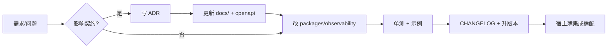

| 迭代类型 | 先改什么 | 版本 |
|----------|----------|------|
| 新 Playbook | `docs` + `playbooks.ts` | patch |
| 新 Transport | ADR + `Transport` 接口 | minor |
| LogEvent 字段变更 | ADR-003 修订 + migration | major |
| 仅 UI 文案 | Toonflow-web | 独立 |

### 23.5 依赖关系与并行

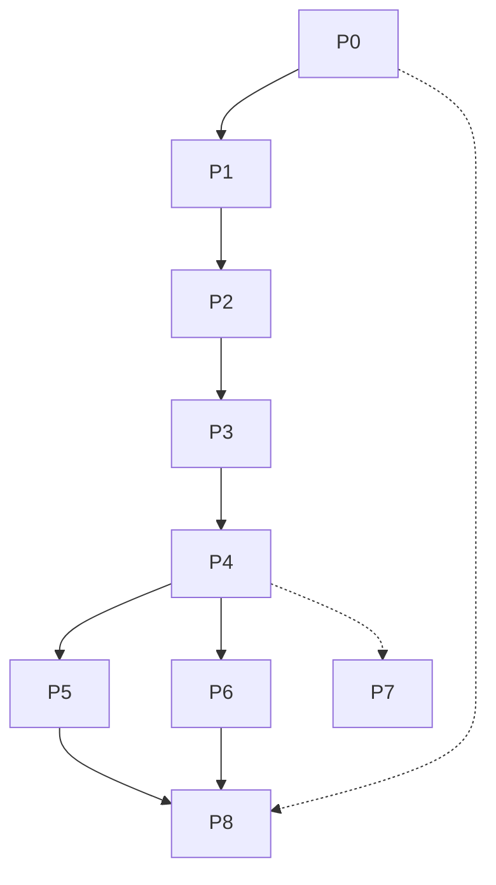

- **P5 与 P6** 可在 P4 完成后并行
- **P7** 全程可选，不阻塞 v1.0
- **P8 文档** 从 P0 骨架起持续填充，P8 收官验收

### 23.6 里程碑与工期（预估）

| 里程碑 | 阶段 | 工期 | 可交付能力 |
|--------|------|------|------------|
| **M0 基座** | P0 | 1 周 | 包可 build；文档骨架 |
| **M1 能写** | P1 | 1 周 | JSONL 结构化日志 |
| **M2 能追** | P2–P3 | 2 周 | traceId + AI 错误 |
| **M3 能查** | P4 | 1.5 周 | API + incidents |
| **M4 能用** | P5–P6 | 2 周 | UI + 推荐 |
| **M5 v1.0** | P8 | 1 周 | 文档全 + 发布 |
| **合计** | P0–P8 | **~8.5 周** | 不含 P7 可选 |

### 23.7 宿主集成清单（Toonflow-app 改动面）

| 文件 | 改动 |
|------|------|
| `package.json` | workspaces + 依赖 `@toonflow/observability` |
| `src/app.ts` | bootstrap import；去 morgan |
| `src/observability/bootstrap.ts` | 新建，薄封装 |
| `src/lib/initDB.ts` | o_log_events 表 |
| `src/routes/logs/*` | 新建 API |
| `src/utils/ai.ts` | AiObservability 包裹 |
| `src/utils/vm.ts` | 结构化 vendor log |
| `src/utils/taskRecord.ts` | traceId 写穿 |
| `src/err.ts` | 接入 obs fatal |
| Toonflow-web | 事件中心 UI |
| `docs/observability/README.md` | 导航到子架构 docs |

**不改：** 业务路由逻辑、Agent 核心、vendor 插件契约（仅加观测包裹）。

### 23.8 v1.0 发布标准（总 DoD）

- [ ] `@toonflow/observability` 独立 `build` + `test` 通过
- [ ] 宿主启用后 JSONL + SQLite 双写
- [ ] `/logs/incidents` + `/logs/trace` + `/logs/recommend` 可用
- [ ] 事件中心 UI 可完成「报错 → traceId → 诊断」闭环
- [ ] `packages/observability/docs/` 为 SSOT，quickstart 至少 3 篇可跑通
- [ ] ADR 001–003 就位；ROADMAP v1.1 已规划
- [ ] 架构冻结项（22.8）无未经 ADR 的变更

---

## 二十四、执行入口

**下一步（实施模式）：** 从 **P0** 开始——创建 `packages/observability` 脚手架 + 文档基座 + workspaces，不改动业务逻辑。

确认后执行顺序：`P0 → P1 → P2 → P3 → P4（含宿主桥接）→ P5∥P6 → P8`，`P7` 按需。
