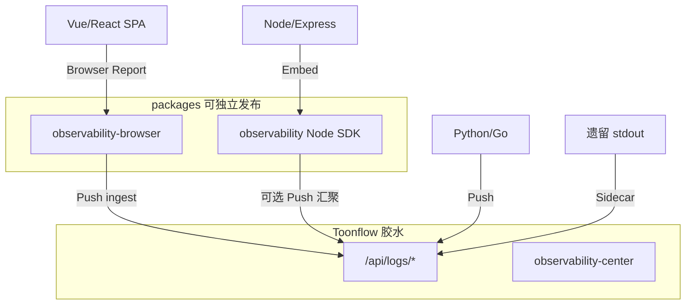
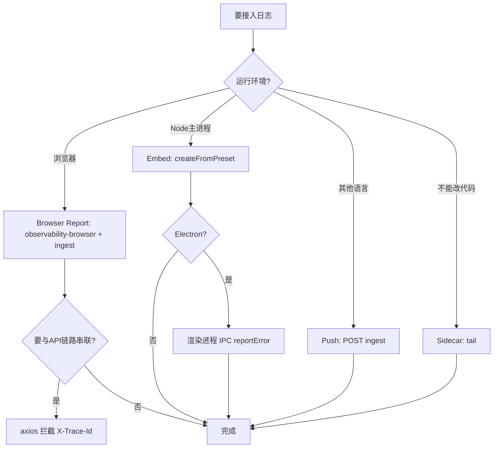

# 日志模块独立拆分与最简适配方案（含 Web 等全场景）

## 核心原则：两层边界

| 层级 | 路径 | 职责 | 能否被其他应用直接复用 |
|------|------|------|------------------------|
| **独立子架构** | [`packages/observability/`](packages/observability/) | LogEvent、开关、Transport、适配器、Playbook | 是（零 `@/` 依赖） |
| **Browser SDK** | [`packages/observability-browser/`](packages/observability-browser/) | 前端 `reportError`、traceId 透传钩子 | 是（<5KB，无 Node 依赖） |
| **宿主胶水** | [`src/observability/`](src/observability/) | `getPath`、Knex、`o_log_events`、JWT 路由 | 否（仅 Toonflow） |



**拆分判据：** 内核在 `packages/*`；Toonflow 特有 DB/JWT/UI 只在 `src/observability` + `src/routes/logs`。

---

## 四种接入模式（原三种 + Web）

| 模式 | 运行环境 | 接入成本 | 典型场景 |
|------|----------|----------|----------|
| **Embed** | Node/Electron 主进程 | 3 行代码 | Express API、AI Worker、Electron main |
| **Browser Report** | 浏览器 / WebView | 2 行 + axios 拦截器 | Toonflow-web、独立 SPA、内嵌 H5 |
| **Push** | 任意语言/进程 | 1 个 HTTP | Python/Go/Java、CI、小程序后端 |
| **Sidecar** | 不改业务 | 运维配置 | 遗留服务 stdout、Docker 日志文件 |

### 模式 A：Embed（Node 主进程）

```typescript
import { createFromPreset, traceMiddleware, createStdoutSink, createFileSink } from "@toonflow/observability";

const obs = createFromPreset("express", { appId: "partner-svc", logDir: "./logs" });
obs.registerSink(createStdoutSink());
obs.registerSink(createFileSink("./logs"));
app.use(traceMiddleware(obs));
```

### 模式 B：Browser Report（Web 前端）— 原方案未展开，现正式纳入

**为何单独列出：** 浏览器不能跑 Node SDK，也不能写 SQLite；但用户 80% 的「看不到日志」来自前端报错与 API 链路断裂。

**最简接入（不改 Toonflow 后端）：**

```typescript
// 1. 安装 @toonflow/observability-browser
import { reportError, setReportHandler } from "@toonflow/observability-browser";

// 2. 启动时注册 Push（走已有 /api/logs/ingest）
setReportHandler(async (event) => {
  await fetch("/api/logs/ingest", {
    method: "POST",
    headers: { "Content-Type": "application/json", Authorization: `Bearer ${token}` },
    body: JSON.stringify({ ...event, category: "client", level: "error" }),
  });
});

// 3. 全局错误捕获
window.addEventListener("unhandledrejection", (e) => reportError(e.reason, { module: "vue" }));
```

**链路打通（与后端 trace 串联）：**

```typescript
// axios 请求拦截：读响应头 X-Trace-Id，错误弹窗展示 + 跳转事件中心
axios.interceptors.response.use(
  (res) => { sessionStorage.setItem("lastTraceId", res.headers["x-trace-id"]); return res; },
  (err) => { reportError(err, { traceId: err.response?.headers["x-trace-id"] }); throw err; }
);
```

**开关：** `categories.client` 默认 `false`（防噪音）；生产排障时通过 `/api/logs/switches/updateSwitches` 开启 `client` 分类。

**Toonflow-web（独立仓库）：** 只消费 OpenAPI，不读 SQLite；事件中心 Tab 调 `/api/logs/query`、`/trace/:id`、`/recommend/list`。当前仓库内已有静态 MVP：[`data/web/observability-center/`](data/web/observability-center/index.html)。

### 模式 C：Push（异构 / 远程）

```http
POST /api/logs/ingest
Authorization: Bearer <JWT>
{ "level": "error", "category": "ai_call", "message": "...", "traceId": "..." }
```

批量 + 幂等：[`POST /api/logs/ingest/batch`](src/routes/logs/ingest/batch.ts)。

### 模式 D：Sidecar（零改代码）

tail JSONL / stdout → batch ingest；或 Fluent Bit → Toonflow endpoint。

---

## 全场景覆盖清单（含原先易遗漏项）

| # | 场景 | 推荐模式 | 关键点 | 教程文档（待填齐） |
|---|------|----------|--------|-------------------|
| 1 | Express / Koa API | Embed | `traceMiddleware` + `errorHandler` | `quickstart/01-express-3-lines.md` |
| 2 | Electron 桌面 | Embed + Browser | 主进程 obs；渲染进程 IPC → `reportError` | `quickstart/02-electron-desktop.md` |
| 3 | **Vue/React SPA（Toonflow-web）** | **Browser Report** | axios `X-Trace-Id`；错误弹窗带 traceId | `quickstart/05-browser-web.md`（新增） |
| 4 | 静态页 / 内嵌 H5 | Browser Report | 同 ingest，token 从登录态取 | cookbook `06-multi-app-ingest` |
| 5 | Socket.io 实时 | Embed | 服务端 [`attachSocketObservability`](packages/observability/src/adapters/socketio.ts)；客户端 handshake 带 `traceId` | `cookbook/03-trace-cross-service.md` |
| 6 | 纯 AI Worker（无 HTTP） | Embed preset `ai-worker` | 只开 `ai_call`/`vendor`/`task` 分类 | `quickstart/05-ai-worker-only.md` |
| 7 | Python / Go 微服务 | Push | OpenAPI + `examples/python-ingest` | `quickstart/03-python-push.md` |
| 8 | Java / .NET 遗留 | Sidecar 或 Push | 不能装 Node 时走 HTTP | `quickstart/04-go-push.md` |
| 9 | Docker / K8s | Embed 或 Sidecar | preset `docker`：stdout only；或 sidecar tail | cookbook `12-multi-instance` |
| 10 | **微信小程序 / 小游戏** | Push | 无 Node；后端或云函数 POST ingest | `cookbook/13-miniprogram-push.md`（新增） |
| 11 | CI / GitHub Actions | Push | 失败步骤推关键事件 | `operations/ci-integration.md` |
| 12 | 多应用汇聚同一 Toonflow | Push | `appId` + `instanceId` 区分来源 | `cookbook/06-multi-app-ingest.md` |
| 13 | 离线 Electron | Embed | 本地 file+sqlite；`external` 缓冲待联网 | `cookbook/10-offline-degraded.md` |
| 14 | 只读排查（不改代码） | 消费 API | 日志中心 UI 或 `GET /logs/trace/:id` | `api/query-examples.md` |

### 明确不做（防 scope 膨胀）

- 完整 APM UI（用 OTLP 导出对接 Jaeger/Grafana）
- 用户行为埋点（与 observability 分离）
- 替换现有 `o_tasks` 任务中心（并列展示于 incidents）

---

## 扩展决策树（含 Web）



---

## 详细教程与示例体系（v8 标准，执行时填齐）

文档 SSOT：[`packages/observability/docs/`](packages/observability/docs/)

### 每篇教程必须包含（质量标准）

1. **适用场景** — 何时选这种模式
2. **前置条件** — Node 版本、JWT、环境变量、`OBS_ENABLED`
3. **完整可运行代码** — copy-paste 可跑
4. **预期输出** — JSONL 样例 / UI 截图说明 / `GET /logs/trace/:id` 响应
5. **常见错误 FAQ** — 至少 2 条，对应 troubleshooting 文档

### Quickstart（6 篇，含 Web）

| 文件 | 内容 | 配套示例 |
|------|------|----------|
| `01-express-3-lines.md` | Express 最小接入 | `examples/express-minimal/` |
| `02-electron-desktop.md` | 主进程 + IPC + 渲染进程 | `examples/electron-minimal/`（待建） |
| `03-python-push.md` | `requests.post` ingest | `examples/python-ingest/`（待建） |
| `04-go-push.md` | Go HTTP client | `examples/go-ingest/`（待建） |
| `05-browser-web.md` | **Vue/React + browser SDK + axios** | `examples/browser-spa/`（待建） |
| `06-sidecar-tail.md` | tail JSONL → batch | `scripts/tail-to-ingest.sh`（待建） |

### Cookbook（9+ 篇，场景深化）

| 文件 | 场景 |
|------|------|
| `01-switch-config.md` | 全局/局部开关、Profile |
| `02-vendor-debug.md` | AI 厂商错误 + Playbook |
| `03-trace-cross-service.md` | traceparent / Socket / 微服务 |
| `04-custom-transport.md` | 自定义 Sink（ES/Loki） |
| `05-custom-playbook.md` | 注册业务 Playbook |
| `06-multi-app-ingest.md` | 多应用推同一 Toonflow |
| `07-structured-production.md` | compileLog / entityRefs |
| `08-web-error-ux.md` | **错误弹窗 traceId + 跳转事件中心**（新增） |
| `09-miniprogram-push.md` | **小程序云函数 Push**（新增） |

### Troubleshooting（9 篇，与 Playbook ID 一一对应）

| 文件 | Playbook |
|------|----------|
| `01-no-logs-generated.md` | 开关检查 |
| `02-auth-401.md` | `pb_auth_invalid` |
| `03-rate-limit-429.md` | `pb_rate_limit` |
| `04-reference-image-fail.md` | `pb_oss_localhost` |
| `05-poll-timeout.md` | `pb_timeout_poll` |
| `06-log-query-slow.md` | FTS/索引 |
| `07-ingest-rejected.md` | JWT/schema |
| `08-client-noise.md` | **前端 client 分类噪音**（新增） |
| `09-trace-broken.md` | **Web 链路 traceId 未透传**（新增） |

### API 参考

- [`docs/api/openapi.yaml`](packages/observability/docs/api/openapi.yaml) — logs + Agnes
- `docs/api/query-examples.md` — 每个端点请求/响应示例（待填）

---

## Toonflow 宿主最薄集成（保持不变）

1. [`src/observability/bootstrap.ts`](src/observability/bootstrap.ts)
2. [`src/observability/store.ts`](src/observability/store.ts)
3. [`src/routes/logs/*`](src/routes/logs/)
4. [`src/app.ts`](src/app.ts) — bootstrap + `traceMiddleware` + Socket observability

业务只调 `getObs()`，不碰 SQLite。

---

## 其他应用接入对照表（更新）

| 场景 | 改 Toonflow？ | 方式 | 工作量 |
|------|--------------|------|--------|
| Node API | 否 | Embed 3 行 | ~5 min |
| **Vue/React Web** | **否** | **browser SDK + ingest** | **~15 min** |
| Electron | 否 | Embed + IPC | ~20 min |
| Python/Go | 否 | Push | ~5 min |
| 小程序 | 否 | Push（云函数） | ~10 min |
| 遗留 Java | 否 | Sidecar | 运维 |
| Toonflow 本身 | 仅胶水 | 已完成 | — |

---

## 验收标准

- `packages/observability` 无 `@/`、Knex、`o_*` 表
- `packages/observability-browser` 可在纯浏览器环境使用
- **Web quickstart 示例可跑通：** 前端报错 → ingest → 事件中心可见 trace
- quickstart/cookbook/troubleshooting 各篇满足五要素质量标准
- 外部应用仅依赖 npm 包 + OpenAPI，无需 fork Toonflow
