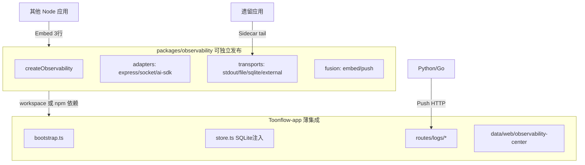
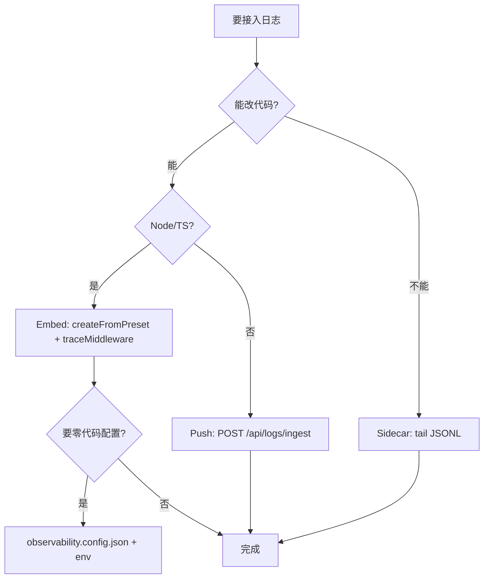

# 日志模块独立拆分与最简适配方案

## 核心原则：两层边界

当前仓库已基本按 v8 落地，关键是**严守边界**：

| 层级 | 路径 | 职责 | 能否被其他应用直接复用 |
|------|------|------|------------------------|
| **独立子架构** | [`packages/observability/`](packages/observability/) | LogEvent、开关、Transport、适配器、Playbook/Recommender | 是（零 `@/` 依赖） |
| **宿主胶水** | [`src/observability/`](src/observability/) | `getPath`、Knex、`o_log_events`、JWT 路由 | 否（仅 Toonflow 特有） |



**拆分判据：** 新功能默认写在 `packages/observability`；只有 Toonflow 特有的 DB 表、JWT、`getPath` 才留在 `src/observability`。

---

## 三种融合模式（按接入成本从低到高）

### 模式 A：Embed 嵌入 — Node/TS 同进程，**3 行代码**

适用：能改代码的 Express/Electron/Worker。

```typescript
import { createFromPreset, traceMiddleware, createStdoutSink, createFileSink } from "@toonflow/observability";

const obs = createFromPreset("express", { appId: "partner-svc", logDir: "./logs" });
obs.registerSink(createStdoutSink());
obs.registerSink(createFileSink("./logs"));
app.use(traceMiddleware(obs));
```

已有能力：
- [`packages/observability/src/presets.ts`](packages/observability/src/presets.ts) — `express` / `electron` / `docker` / `ai-worker`
- [`packages/observability/src/fusion/embed.ts`](packages/observability/src/fusion/embed.ts) — `createEmbedClient(obs)` 暴露精简 API
- [`observability.config.example.json`](packages/observability/observability.config.example.json) + [`configFile.ts`](packages/observability/src/configFile.ts) — 无 DB 也可纯 JSON 配置

Toonflow 自身仅多一步：DB 就绪后 [`attachObservabilityAfterDb`](src/observability/bootstrap.ts) 注入 SQLite Sink（[`store.ts`](src/observability/store.ts) 实现 `createSqliteSink(writer)` 回调，**schema 不进入独立包**）。

### 模式 B：Push 推送 — 任意语言，**1 个 HTTP 调用**

适用：Python/Go/微服务、不能装 Node SDK。

```http
POST /api/logs/ingest
Authorization: Bearer <JWT>
Content-Type: application/json

{ "level": "error", "category": "ai_call", "message": "...", "vendorId": "agnesai", "traceId": "..." }
```

批量：[`POST /api/logs/ingest/batch`](src/routes/logs/ingest/batch.ts)（支持 `eventId` 幂等）。

Node 侧可用 [`createPushClient`](packages/observability/src/fusion/push.ts)：

```typescript
const push = createPushClient({
  endpoint: "http://toonflow-host:10588/api/logs/ingest",
  getToken: () => process.env.TOONFLOW_TOKEN!,
});
await push.ingest({ level: "error", category: "system", message: "job failed" });
```

**其他应用完全不改 Toonflow 代码**，只需配置 endpoint + token。

### 模式 C：Sidecar 旁路 — **零改业务代码**

适用：遗留应用只能打 stdout/写文件。

1. 业务继续输出 JSONL 到 `./logs/YYYY-MM-DD.jsonl`（或 stdout 重定向到文件）
2. 旁路进程 tail 文件 → `POST /api/logs/ingest/batch`
3. 或用 Fluent Bit / Filebeat 转发到 Toonflow ingest（计划文档 [`docs/quickstart/06-sidecar-tail.md`](packages/observability/docs/quickstart/06-guide.md) 占位，可补全为运维手册）

---

## 快速决策树



---

## Toonflow 宿主「最薄」集成清单（已实现，保持不再膨胀）

当前胶水层应**只保留**以下 4 处，避免业务代码直接依赖 DB：

1. [`src/observability/bootstrap.ts`](src/observability/bootstrap.ts) — 早期 file+stdout；DB 后 attach sqlite
2. [`src/observability/store.ts`](src/observability/store.ts) — `o_log_events` + FTS 写入器注入
3. [`src/routes/logs/*`](src/routes/logs/) — 查询/诊断/ingest API
4. [`src/app.ts`](src/app.ts) 顶部 `import "@/observability/bootstrap"` + `traceMiddleware` + `errorHandler`

业务侧（AI/任务）只调 `getObs().log()` / `logAiError()`，不碰 SQLite。

---

## 独立发布与跨仓复用（建议补全的 4 项）

为让「其他应用不改 Toonflow 代码、只装包」真正成立：

1. **npm 发布** — `@toonflow/observability` 从 monorepo workspace 发布（或 git submodule / `file:` 依赖），子路径 exports 已就绪：`.`, `./express`, `./presets`, `./testing`
2. **零参配置入口** — 补 `createFromConfigFile()` 无参版（自动读 cwd 下 `observability.config.json`），对齐 v8 6.2 节
3. **CLI init** — 完善 [`packages/observability-cli`](packages/observability-cli/)：`npx toonflow-obs-init` 生成 config + bootstrap 模板
4. **Sidecar 示例** — 补 `examples/python-ingest/` 与 tail→batch 脚本，文档 SSOT 在 [`packages/observability/docs/`](packages/observability/docs/)

---

## 其他应用接入对照表

| 场景 | 改 Toonflow 代码？ | 接入方式 | 工作量 |
|------|-------------------|----------|--------|
| 新 Node API 服务 | 否 | yarn add `@toonflow/observability` + Embed 3 行 | ~5 分钟 |
| Electron 子窗口 | 否 | Preset `electron` + `logDir` | ~10 分钟 |
| Python 批处理 | 否 | Push `requests.post(/api/logs/ingest)` | ~5 分钟 |
| 遗留 Java 服务 | 否 | Sidecar tail + batch ingest | 运维配置 |
| Toonflow 本身 | 仅胶水层 | 已有 bootstrap + store | 已完成 |

---

## 验收标准（独立拆分是否成功）

- `packages/observability` 内 **无** `import "@/`、无 Knex、无 `o_*` 表定义
- 外部 Express 示例 [`examples/express-minimal/server.ts`](packages/observability/examples/express-minimal/server.ts) 可独立 `tsx` 运行并产出 JSONL
- Python/任意客户端仅通过 OpenAPI [`docs/api/openapi.yaml`](packages/observability/docs/api/openapi.yaml) 的 ingest 即可写入，无需 fork Toonflow
- Toonflow 升级日志内核时，只改 `packages/observability` 版本号，宿主胶水 < 200 行不变
