# Browser Chat 全流程 · 优化版 v2.0

> **版本**：v2.0.0（browser-chat-optimized）  
> **定位**：在 [`主流程.txt`](主流程.txt) V5.0（14 层 / 697 规则注册）与 [`规则层.json`](规则层.json)（257 可执行规则库）之上，增加 **Browser Chat 外部执行轨**——单 System Prompt 闭环，与内部 scriptAgent / RuleEngine **同规则 ID、同阶段闸门、异执行环境**。  
> **替代**：`design_flow.bundle.md` v1.1、`adaptation_flow.bundle.md` 骨架 → 统一为 `browser_full_flow.bundle.md` v2.0。

---

## 讨论汇总索引（本轮全部纳入）

| # | 主题 | 计划章节 | 关键产出 |
|---|------|----------|----------|
| 1 | 原创/改编双路径 + 三档 T1/T2/T3 | §目标架构、§三档交付 | ScriptBundle / EpisodeBundle-lite / full |
| 2 | planData + designBrief 落库 | §schema、planData-schema todo | import → o_agentWorkData |
| 3 | 257 规则外部四级实现 L1-L4 | §规则分层、rule_cards | checklist + structured + audit |
| 4 | 规则逐项检测（五维） | §附录 E、rule-application-audit | ruleApplicationReport |
| 5 | **剧本智能检测 SD** | §SD 模块 | smartDetection + supervision A/B/C/D |
| 6 | **智能修复 SF** | §附录 F | fixPlan + autoFixLibrary + L0-L3 分级 |
| 7 | **角色智能设计 CD** | §CD 模块 | L0-L6 + arcStages + art_skills 联动 |
| 8 | **资产流水线 AS** | §AS 模块 | assetPipeline + assetGapReport |
| 9 | **图锚点三层** | §附录 H | visualLockTable + cref/sref + H5-4 |
| 10 | 设计阶段细化 | §阶段表 SB/EN 子阶段 | C3-C6 边界 + T1 BP bootstrap |
| 11 | 四模态 MD + H 回滚 | §全链路架构、附录 D | modalityAudit + rollbackLayer |
| 12 | browser_chat 多文件套件 | §Skill 目录 | manifest.json + stages/production/ |
| 13 | **规则流程 Browser Chat 版** | **§规则流程双轨** | rule_flow_browser_chat.json |
| 14 | **六链全闭环逐项边界** | **§六链闭环对照** | 附录 I + linkageRepairPlan |
| 15 | **T1 前期设计包** | **§T1 PreDesignPack** | GB+SB lines 必填 |
| 16 | **设计→提示词质量走廊** | **§质量走廊** | 附录 K 边界+SD/SF |
| 17 | **正推/反推双向闭环** | **§11 正推反推** | 附录 L + rePushPlan |
| 18 | **质量问题 QP + 四模态规范** | **§12** | 附录 M |
| 19 | **V5×Chat 统一闭环** | **§13** | 附录 N |
| 20 | **制作实现闭环** | **§14** | 附录 O + identityAudit |

---

## 计划重心：设计→提示词质量走廊（Design→Prompt Corridor）

> **用户要求**：扩展都纳入，但**重点**是设计到提示词阶段之间的——**严格遵守规范、设计联动、智能分析、智能修复、边界细化、提高质量**。

### 1. 走廊定义（本计划第一优先级）

```
上游（P/G/W 智能分析）          【质量走廊 · 本计划核心】              下游（MD 触达/生成）
─────────────────────    W3 → designBrief → GB → SB → EN    ─────────────────────
     SD-P/M/W/S                  ↑ 规范+联动+SD+SF ↑                  MD 四模态
     SF fixPlan                  每阶段 BLOCK 闸门                   T3 才外部写 prompt
```

| 区段 | 阶段 | 产出 | 严禁越界 |
|------|------|------|----------|
| **剧本** | W3 | `script` 文学剧本 | 禁镜头/景别/BGM/色温/分镜表 |
| **联动意图** | designBrief | B 层 11 条结构化意图 | 禁 shot 级字段、禁 prompt 文本 |
| **导演规划** | GB | `scriptPlan` 分场/情绪/过渡 | 禁光影色温、禁切镜设计（C3） |
| **分镜结构** | SB | `shots[]` lines/type/emotion/景别 | 禁 compiled/image/video/audioPrompt |
| **引擎编译** | EN | Transform→Compile→Polish(保护锚点) | 禁直接调 API；Polish 禁改锚点 token |
| **提示词** | MD | 四模态 prompt（T2 EN 草案 / T3 完整） | 必须 trace 回 SB 字段 |

**走廊外（次优先级，仍纳入）**：P 预检、CD/AS/BP 资产、MD 生成 API、Z/H 打包——为走廊提供输入或消费 EN 产出，但不替代走廊内规范。

### 2. 四支柱 · 走廊内每阶段必挂载

| 支柱 | 代号 | 作用 | 产出字段 |
|------|------|------|----------|
| **严格遵守规范** | **SPEC** | rule_cards L2 BLOCK + 阶段 CAN/CANNOT | ruleAudit.[stage] |
| **设计联动** | **LINK** | B→GB→SB→EN 字段因果链 + H1 七依赖链 | designBrief + markers + linkageAudit |
| **智能分析** | **SD** | 阶段末质量诊断（非仅 checkbox） | smartDetection.[stage] |
| **智能修复** | **SF** | BLOCK→fixPlan/linkageRepairPlan→重跑 | fixPlan / linkageRepairPlan |

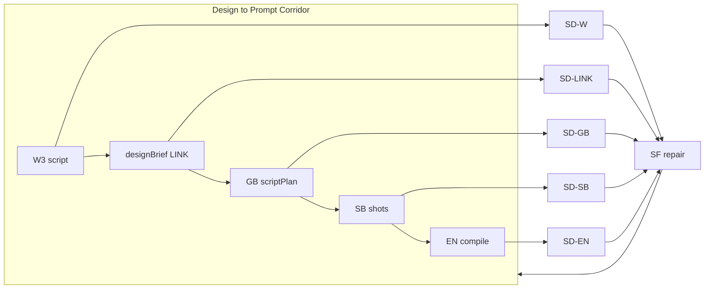

### 3. 走廊阶段 · 边界+联动+SD+SF 逐项矩阵（核心交付）

#### 3.1 W3 · 剧本

| 维度 | 规范 SPEC | 设计联动 LINK | 智能分析 SD | 智能修复 SF |
|------|-----------|---------------|-------------|-------------|
| **必产出** | script 引号台词、△ 场景、场标 | → designBrief 每字段有 W 来源 | SD-W：密度/钩子/台词保真/可拍性 | R2 删改→fixPlan 回 W3 |
| **BLOCK** | R2、W12/W13、三大密度 | infoLinkageChain 雏形在 script 注释 | supervision W3 ≥B | linkageRepair 故事链 |
| **禁止** | 景别/镜头/BGM/色温/分镜 JSON | 不写 shots/prompt | — | — |

#### 3.2 designBrief · B 层联动桥

| 维度 | SPEC | LINK | SD | SF |
|------|------|------|----|----|
| **必产出** | B1-B11 对应字段非空 | G→arcToneMap/visualLockHints；W→emotionCurve | SD-LINK：H1 七链预检 | B8 断链→linkageRepairPlan |
| **BLOCK** | emotionCurveOutline、infoLinkageChain、sceneEmotions | 交叉规则联动表 7 链 upstream 齐全 | 层间一致性 WARN→BLOCK 可配置 | fixPlan B 层模板 |
| **禁止** | 镜级 shotSize/duration/prompt | 不替代 GB/SB | — | — |

**linkageAudit**（新增 JSON，走廊专用）：

```json
{
  "linkageAudit": {
    "chains": [
      { "id": "W→B→GB", "from": "designBrief.emotionCurveOutline", "to": "scriptPlan.scenes[].emotion", "status": "applied|partial|broken" }
    ]
  }
}
```

#### 3.3 GB · 导演规划

| 维度 | SPEC | LINK | SD | SF |
|------|------|------|----|----|
| **必产出** | 分场表、台词数、场情绪、过渡 | 读 designBrief；→ SB sceneName 对齐 | SD-GB：场数/台词总数 vs script | 场界错误→rollback GB |
| **BLOCK** | 每场有 emotion；transitions 覆盖切场 | scriptPlan 情绪曲线与 brief 偏差≤1档 | — | — |
| **禁止** | 光影/色温/配乐/切镜/景别（C3） | 不写 shots | — | — |

#### 3.4 SB · 分镜结构（T1 核心）

| 维度 | SPEC | LINK | SD | SF |
|------|------|------|----|----|
| **必产出** | lines/type/emotion/shotSize/duration/visualDescription | markers.hook/infoLink/arcStage；← GB 场情绪 | SD-SB：hash、空镜、重复 lines | R2→拆镜/合并 fixPlan |
| **BLOCK** | externalHashCheck；V1 type；100% 台词映射 | 每镜 infoLink 对应 brief 链一环 | supervision SB ≥B | linkageRepair SB↔brief |
| **禁止** | image/video/audioPrompt；色温词（C5） | 不改 L0-L6（C4） | — | — |

#### 3.5 EN · 引擎编译（T2 入口，走廊终点）

| 维度 | SPEC | LINK | SD | SF |
|------|------|------|----|----|
| **必产出** | compiled.image/video/audio 草案 | Y1-Y10 映射 trace；锚点 token 列表 | SD-EN：H5-1 槽位齐全；H5-4 漂移 | autoFixLibrary；回退 compiled |
| **BLOCK** | 必填槽位：角色/情绪/景别/锚点/时长 | SB 字段→prompt 一一 trace | polished 漂移→BLOCK | rollback EN 或 SB |
| **禁止** | Polish 改 cref/情绪/type/时长 | 不凭空增删 lines | — | — |

**走廊出口判定**：`linkageAudit` 全链 `applied` + `ruleAudit` 走廊阶段全 PASS + `preDesignQuality≥B`（T1）或 `modalityAudit` ready（T3）→ 才允许进入 MD。

### 4. 规范遵守 · 走廊硬边界汇总（写入 bundle §0 + 附录 K）

| ID | 边界 | 上游 | 下游 | 违反处理 |
|----|------|------|------|----------|
| **B-W3** | 剧本禁分镜/prompt | W3 | GB/SB | SF rollback W3 |
| **B-BRIEF** | brief 禁镜级/prompt | designBrief | GB | SF 删越界字段 |
| **B-GB** | GB 禁光影/切镜 | GB | SB | C3 fixPlan |
| **B-SB** | SB 禁 prompt 文本 | SB | EN | SF 剥离 prompt 字段 |
| **B-EN** | EN 禁 API + 锚点漂移 | EN | MD | H5-4b 回退 |
| **B-LINK** | 联动字段必有 upstream | 全走廊 | linkageAudit | linkageRepairPlan |
| **B-HASH** | 台词 hash 一致 | W3 | SB | R2 BLOCK |

### 5. 智能分析 SD · 走廊挂载点（细化）

| SD 点 | 触发 | 检测项 | 最低通过 |
|-------|------|--------|----------|
| SD-W | W3 末 | 密度/钩子/R2/可拍性 | supervision ≥B |
| SD-LINK | designBrief 末 | H1 七链 + B1-B11 覆盖 | 0 broken chain |
| SD-GB | GB 末 | 场界/台词总数/情绪曲线偏差 | 场100%有 emotion |
| SD-SB | SB 末 | hash/空镜/映射%/景别分布 | hash match + ≥B |
| SD-EN | EN 末（T2+） | H5 槽位/锚点 drift/Y trace | Tier-0 PASS |

### 6. 智能修复 SF · 走廊修复分级

| 级别 | 触发 | 动作 | 示例 |
|------|------|------|------|
| **SF-1 字段** | SPEC BLOCK | fixPlan 单字段 | V1 改 type |
| **SF-2 联动** | LINK broken | linkageRepairPlan 跨阶段 | brief↔SB infoLink 断 |
| **SF-3 回滚** | SD≥2 BLOCK 或 supervision C/D | rollbackStage 重跑 | H3→SB |
| **SF-4 增强** | SD WARN + W93 触发 | 附录 G 建议（用户确认） | 爆点不足 |

### 7. 扩展 Q16-Q20（纳入，走廊增强）

| ID | 扩展 | 与走廊关系 | 落点 |
|----|------|------------|------|
| **Q16** | T1 轻量 BP：sceneName→sceneCode 文本映射 | SB 阶段 LINK 增强，仍不写完整 visualLockTable | preDesignPack.sceneCodeMap |
| **Q17** | novel 事件三级追溯 ID | P0 事件→W3 场→SB 镜 | provenance.eventTrace[] |
| **Q18** | 同 script 双 SB 方案 A/B | SB 阶段质量对比，用户选优 | preDesignPack.shotsVariant? |
| **Q19** | token 预算器 + Q15 精简模式 | 走廊内减 visualDescription 字数，**不砍 lines/type** | projectConfig.tokenBudget |
| **Q20** | import 前 SB markdown 预览 | 二期前端；bundle 提供 `toStoryboardMarkdown()` 话术 | Toonflow-web 二期 |

### 8. 新增交付 · 附录 K + linkageAudit

```
附录 K · 设计→提示词质量走廊（边界 B-W3~B-EN + SD/SF 挂载 + LINK 字段 trace 表）
§5.0  走廊总览（四支柱 SPEC/LINK/SD/SF）
§5.1-§5.5  各阶段规范（与 3.1-3.5 同构，写入 bundle 正文）
linkageAudit schema + EN→MD trace 表

browser_chat/stages/corridor_W3.md
browser_chat/stages/corridor_design_brief.md
browser_chat/stages/corridor_GB.md
browser_chat/stages/corridor_SB.md
browser_chat/stages/corridor_EN.md
browser_chat/stages/T1_quality_gate.md  （三重闸门 + linkageAudit）
```

### 9. 实施优先级（修订）

| 优先级 | Wave | 内容 |
|--------|------|------|
| **P0** | 1-2 | **rule_flow_unified.json** + 走廊 stage + linkageAudit + QP catalog |
| **P0** | 2-3 | bundle §5.0–M + **§13 统一闭环** + T1 PreDesignPack |
| **P1** | 3-4 | import 合流 Pipeline + skip SB + validate/dryRun 对称 |
| **P1** | 4-5 | applyAutoFix/fix_templates + **I1-I10 INT 首批** + G1-G55 |
| **P2** | 5+ | ModalityOrchestrator/Touch + I11-I20 + 预览 UI |

### 10. 验收 G31-G35（走廊质量）

| # | 验收 |
|---|------|
| G31 | 走廊每阶段 ruleAudit + smartDetection 有记录 |
| G32 | linkageAudit 七链 0 broken（T1 出口） |
| G33 | 违反 B-W3~B-SB 任一 → SF 触发且不得 output |
| G34 | EN compiled 每字段可 trace 到 SB/brief（T2） |
| G35 | Q16-Q20 schema 字段存在且文档化 |

### 11. 正推 / 反推双向联动闭环（Forward–Reverse Loop）

> 用户关切：**构图、镜头智能、台词、故事分析**等是否有设计联动**正推或反推**闭环？  
> 例如：台词/情绪不符 → **反推**修正故事设计、剧本画面改展示方式 → **再正推**分镜/提示词。

#### 11.1 现状 vs 本计划补齐

| 能力 | 计划原有 | 缺口 | 补齐 |
|------|----------|------|------|
| **正推** | LINK 链 W3→brief→GB→SB→EN | 缺构图/镜头/故事维度显式 trace | **正推表 §11.2** |
| **反推** | rollbackLayer 附录 D、SF-3 | 缺「症状→反推目标→重推策略」 | **反推路由表 §11.3** |
| **重推** | fixPlan 单点修 | 缺从上游 stage **正向重跑**话术 | **rePushPlan §11.4** |
| **跨维** | linkageRepairPlan | 缺「改剧本展示 vs 改分镜」双路径 | **presentationFork §11.5** |

#### 11.2 正推链路（设计域 → 提示词域）

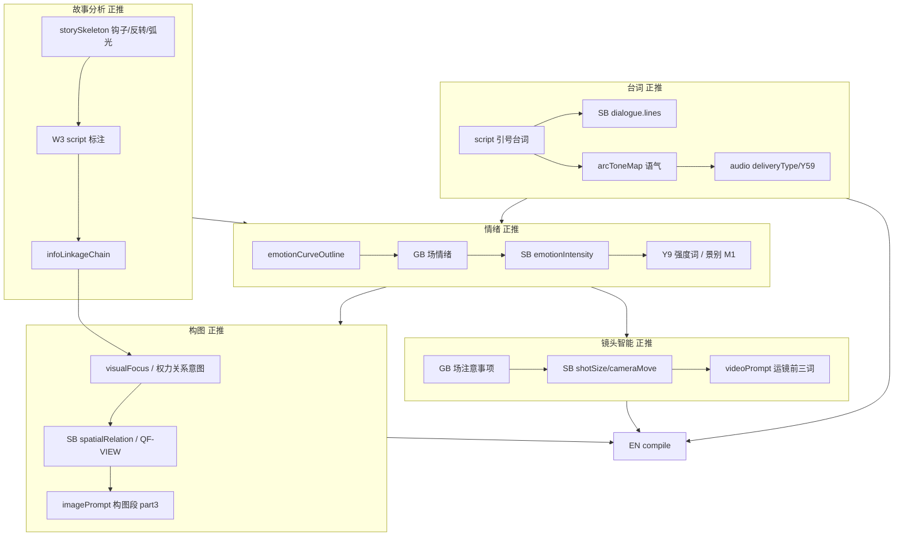

**正推验收**：`linkageAudit` + `forwardTrace[]` 每条 `{ domain, from, to, ruleId, status }`。

#### 11.3 反推路由表（症状 → 反推目标 → 重推策略）

检测可在 **SD-* / validate / 用户反馈** 任一点触发；反推**不得跳阶段**，须从 `reverseTarget` **正向重跑**至当前 stage。

##### A. 台词域

| 症状 | 检测规则/SD | 反推目标 | 重推策略（rePushStrategy） |
|------|-------------|----------|---------------------------|
| 台词 hash 不一致 | R2/H3、SD-SB | **SB**（首选）或 **W3**（引号分段有问题） | SB：拆镜/合并镜；W3：调整引号分段或补 OS/VO 标记 |
| 台词语气与弧光不符 | B3、arcToneMap vs deliveryType | **designBrief** 或 **W3** | brief：修正 arcToneMap；W3：改台词用词/句式 |
| 台词过长无法 fit duration | V10 | **SB** 或 **W3** | SB：拆镜+增 duration；W3：精简台词（须 R2 用户确认） |
| 对白/旁白类型错 | Y59、AG | **SB** dialogue.type | 改 deliveryType；必要时反推 W3 标注 OS/VO |

##### B. 情绪域

| 症状 | 检测 | 反推目标 | 重推策略 |
|------|------|----------|----------|
| 场情绪与集曲线冲突 | SD-GB vs emotionCurveOutline | **designBrief** 或 **W1** 骨架 | 修正 curve 或调整该场在 script 中的情绪铺垫 |
| 镜 emotion 与场情绪偏差>2 | B1、SD-SB | **GB** 或 **SB** | GB：重标场情绪；SB：调整镜级 intensity |
| 情绪单调（Q3） | preDesignQuality | **GB** + **SB** | 增缓冲镜/波动；或反推 W3 补情绪动作描写 |
| 高情绪无缓冲 | W8 | **W1** 骨架 或 **W3** | 骨架补缓冲设计；W3 加过渡动作 |

##### C. 构图 / 画面展示域

| 症状 | 检测 | 反推目标 | 重推策略 |
|------|------|----------|----------|
| 构图无法表达权力/关系 | S3、QF-VIEW、SD-SB | **presentationFork** | 路径1：**W3** 改 △ 展示方式（站位/道具/空间）；路径2：**SB** 改 spatialRelation/景别 |
| 视觉焦点与 infoLink 脱节 | B8、linkageAudit | **W3** 或 **designBrief** | 补写/script 注释视觉焦点；或修正 infoLinkageChain |
| 可拍性不足（△ 难转镜） | SD-W shootability | **W3** | 改场景描写为「可拍」具象动作/空间 |
| 纯景/纯道具 type 错 | V2/V3 | **SB** type | 改 CHAR-SCENE 等；若根因是剧本角色缺失 → 反推 **W3** |

##### D. 镜头智能域

| 症状 | 检测 | 重推策略 |
|------|------|----------|
| 景别与情绪不匹配 | M1/B2 | 反推 **SB** shotSize；仍不符 → **GB** 场备注 → **brief** sceneEmotions |
| 运镜与节奏冲突 | M11、I2、rhythmOutline | 反推 **SB** cameraMove；或 **designBrief** rhythmOutline |
| 需脱钩表演（手/道具特写） | H3-4、高情绪台词 | 反推 **W3** 补画面锚点 △；或 **SB** decoupleDesign + visualFocus |
| 时长与切换不匹配 | I层、duration | 反推 **SB** duration/transitionType |

##### E. 故事分析域

| 症状 | 检测 | 反推目标 | 重推策略 |
|------|------|----------|----------|
| infoLinkage 断链 | linkageAudit broken | **W3** / **W2** / **W1**（按断裂层级） | 浅层：W3 补场/注释；深层：W2 策略或 W1 骨架改钩子/反转 |
| 钩子/反转未落地 | W12/W13、markers 缺失 | **W3** 或 **W1** | 补第一场/集末钩子；或骨架登记表重排 |
| 因果链 W41 断裂 | H3-1 | **W3** 对话段落 | 补写因果衔接；或 **SB** 增过渡镜 |
| 跨集钩子未承接 | C4、continuity | **W3** 首場 | 补承接场；或修正 continuity |

##### F. 提示词 / 生成域（反推回走廊）

| 症状 | 检测 | 反推目标 | 重推策略 |
|------|------|----------|----------|
| EN 槽位缺失 H5-1 | SD-EN | **SB** 或 **BP** | 补 SB 字段；缺色温 → BP sceneColorLock |
| 锚点漂移 H5-4 | validate | **EN** 回退 compiled；根因 **SB** refs | 重 compile；必要时 SB 改 assetCodes |
| 生图失败 prompt | generationFeedback | **EN**→**SB**→**W3** | 分类：prompt 问题→EN；构图不可行→SB/W3 改展示 |
| 口型/表情失败 | 用户反馈 | **SB** duration/type 或 **W3** 拆短台词 | 限 3 轮（与规则引擎一致） |

#### 11.4 rePushPlan · 反推重推契约（Chat + import 共用）

```json
{
  "rePushPlan": {
    "round": 1,
    "maxRounds": 3,
    "trigger": {
      "domain": "dialogue|emotion|composition|shot|story|prompt",
      "symptom": "台词语气与 arcToneMap 不符",
      "detectedAt": "SD-SB",
      "ruleIds": ["B3", "R2"]
    },
    "reverseTarget": "designBrief",
    "rePushStrategy": "修正 arcToneMap.裴青梧 为「觉醒期·短句带刺」→ 重跑 GB→SB→hash 检",
    "presentationFork": null,
    "forwardStages": ["designBrief", "GB", "SB"],
    "status": "pending|applied|skipped",
    "userConfirmed": true
  }
}
```

**Chat 反推工作流（写入 bundle §5.7 + corridor_repush.md）**：

```
1. SD/validate/linkageAudit 检出症状
2. 查 §11.3 反推路由表 → reverseTarget + rePushStrategy
3. 若构图/展示类 → presentationFork 双路径供用户选
4. 生成 rePushPlan → 用户确认（SF-4 可建议 W93 增强）
5. 从 reverseTarget 正向重跑 forwardStages（禁止跳过）
6. 重跑 linkageAudit + externalHashCheck
7. round++；round>3 → 标注例外 + 输出 partial JSON（与 H 层一致）
```

#### 11.5 presentationFork · 剧本展示 vs 分镜表现（双路径）

当 **构图/可拍性/视觉焦点** 类问题，bundle 必须提供**双路径**（用户选，不可自动替用户决定改剧本还是改分镜）：

| 路径 | 改什么 | 适用 | 反推目标 |
|------|--------|------|----------|
| **P1 改剧本展示** | W3 △ 空间/站位/道具/动作描写 | 故事意图对但文学描写难拍 | W3 |
| **P2 改分镜表现** | SB spatialRelation/shotSize/visualDescription | 剧本已对但镜头表达不足 | SB |
| **P3 联动双改** | brief visualFocus + W3 一句 + SB 一镜 | infoLink 链断裂 | designBrief + W3 + SB |

写入 `rePushPlan.presentationFork: { options: ["P1","P2","P3"], selected: "P1" }`。

#### 11.6 与 SF / linkageRepair / rollback 关系

| 机制 | 粒度 | 方向 |
|------|------|------|
| **fixPlan** | 单 ruleId 单字段 | 就地修 |
| **linkageRepairPlan** | 跨 stage 字段链 | 联动修 |
| **rePushPlan** | 整 stage **重跑** | **反推+正推** |
| **rollbackLayer** | 内部 validate | 与 rePushPlan.reverseTarget 对齐 |

内部 [`FEEDBACK_ROUTING`](src/ruleEngine/validators/autoFix.ts) 扩展映射到同一 `reverseTarget` 枚举。

#### 11.7 新增交付

```
§5.7  正推/反推双向闭环（rePushPlan + presentationFork）
附录 L · 正推 trace 表 + 反推路由表（§11.2–11.3 完整版）
browser_chat/stages/corridor_repush.md
data/fixtures/reverse_route_table.json     （extract 自规则层+主流程，机器可读）
ScriptBundle.rePushPlan[]                  （可多轮历史）
```

#### 11.8 验收 G36-G40（正推/反推）

| # | 验收 |
|---|------|
| G36 | 台词 hash fail → rePushPlan.reverseTarget 为 SB 或 W3，含 forwardStages |
| G37 | 情绪/arcTone 不符 → 反推 designBrief 或 W3，重跑后 linkageAudit 恢复 |
| G38 | 构图类问题触发 presentationFork 双路径，用户选后重跑 |
| G39 | 故事 infoLink broken → 反推 W3/W2/W1 分级正确（浅/深断裂） |
| G40 | round≤3 限制；第 3 轮仍 fail 输出 partial + 例外标注 |

### 12. 质量问题目录（QP）· 边界细化 + 四模态 Prompt 规范

> 用户关切：画面缺失、内容/台词问题、太单调、钩子不够、没张力、不够吸引人等——**有无覆盖？边界是否优化？提示词是否齐全？是否符合 AI 生图/视频/特效/声音规范？**

#### 12.1 现状 vs 补齐

| 能力 | 原有 | 缺口 | 补齐 |
|------|------|------|------|
| 钩子/密度/单调 | SD-W、Q3-Q4 零散 | 无统一 **QP 目录** | **QP-01~20** |
| 张力/吸引力 | W93 摘要 | 无量化指标 + 反推路由 | **QP-05/06 + engagementScore** |
| 画面缺失 | 可拍性 SD-W | 无「场/镜/△ 覆盖」检 | **QP-01/08 coverageAudit** |
| 四模态 prompt | MD_* 规划 | **无 per-modality 必填槽位清单** | **modalityPromptAudit §12.4** |
| AI  vendor 规范 | art_skills 分散 | bundle **未汇总触达规范** | **附录 M + VendorPack 对齐** |

#### 12.2 质量问题目录 QP-01 ~ QP-20

每条含：**检测 SD** · **阈值** · **反推 rePush** · **影响模态**

| ID | 症状（用户话术） | 检测点/规则 | 阈值/判定 | 反推目标 | 模态 |
|----|------------------|-------------|-----------|----------|------|
| **QP-01** | 缺少画面/场戏太少 | coverageAudit：script 场数 vs GB.scenes vs SB 覆盖 | 每场≥1镜；无 orphan 场 | W3 补 △ / GB 补场 / SB 补镜 | IMG |
| **QP-02** | visualDescription 空/泛 | SD-SB 具象词计数 | 每镜≥8 具象词，禁「很美」类空词 | SB 或 W3 △（presentationFork） | IMG/VID |
| **QP-03** | 内容稀薄/信息密度低 | 三大密度·信息维 | 信息密度<中 | W3 补信息点 / W2 策略 | 故事 |
| **QP-04** | 台词太少/功能弱 | W11、场台词数 vs scriptPlan | 低于 brief 预期 30% | W3 补对白 | AUD/VID |
| **QP-05** | 台词太多/难拍 | V10、duration 预估 | 单镜台词超 V10 | SB 拆镜 或 W3 精简（R2 确认） | AUD |
| **QP-06** | 太单调 | Q3 emotion 方差、shotSize 多样性 | 连续5镜 emotion 波动<2 或景别全 MS | GB/SB/brief | IMG/VID |
| **QP-07** | 钩子不够 | W12/W13、hookOk、首镜 markers | 首 3 镜无 hook；集末无 hook | W1/W3 | 故事 |
| **QP-08** | 没有张力/冲突弱 | conflictMarkers、虐/爽/爆标注 | 全集中性≤4 且无爆点 | W2/W3 / W93 | 故事 |
| **QP-09** | 不够吸引人 | **engagementScore** 综合 | 综合<6/10 | W93-W100 + SF-4 | 全链 |
| **QP-10** | 节奏平/拖 | rhythmCheck 3-15-45 | act 偏差>1 档 | designBrief.rhythm / GB | VID |
| **QP-11** | 付费点无刺激 | paypointMarkers vs SB | 90% 位无高 emotion 镜 | W1/W9 / SB | 故事 |
| **QP-12** | 情绪与台词脱节 | B3 arcTone vs lines 语气 | SD 语义不一致 | brief 或 W3 | AUD |
| **QP-13** | 画面与情绪脱节 | SB emotion vs visualDescription | 高情绪+静态空镜 | SB 或 W3 | IMG |
| **QP-14** | 缺少视觉悬念 | W12 视觉异常项 | 第一场无道具/空间异常 | W3 | IMG |
| **QP-15** | 反转/铺垫不足 | 反转登记表 vs SB markers | 预埋镜缺失 | W2/W3/SB | 故事 |
| **QP-16** | 跨镜视觉不连贯 | QF-VIEW、orientation 链 | 同场 180° 跳轴 | SB | VID |
| **QP-17** | 脱钩表演缺失 | H3-4 高情绪对白镜 | 应有 decouple 无标记 | W3/SB | VID |
| **QP-18** | 音效/留白设计缺失 | SB 无 sfx/silence 意图 | 高情绪镜无音效标注 | SB → EN audio | AUD |
| **QP-19** | 特效镜未标记 | visualEffect 空但 script 有特效描写 | 词表匹配 fail | W3 或 SB | FX |
| **QP-20** | 多集衔接弱 | continuity 承接检 | ep≥2 首镜未承接 hooks | W3 / continuity | 故事 |

**产出字段**（ScriptBundle）：

```json
{
  "qualityDiagnostics": {
    "qpResults": [
      { "id": "QP-07", "status": "fail", "severity": "BLOCK", "evidence": "首镜无 hook 标记", "suggestedRePush": "W3" }
    ],
    "engagementScore": 6.5,
    "coverageAudit": { "scriptScenes": 5, "gbScenes": 5, "sbCoveredScenes": 4, "orphanScenes": ["宫门"] }
  }
}
```

**与 SD/SF 关系**：SD-W/SB 末跑 QP 扫描；**BLOCK 级 QP** 触发 `rePushPlan`（查 §11.3 + 本表反推列）；WARN 级可 SF-4 / W93 建议。

#### 12.3 边界优化 · QP 阶段分工

| 问题类型 | 应在哪阶段拦截（优先） | 不应在哪阶段修 |
|----------|------------------------|----------------|
| 故事/钩子/张力 | **W1/W2/W3**、designBrief | 不在 MD prompt 硬凑 |
| 台词/content | **W3**、SB lines | 不在 imagePrompt 塞台词 |
| 单调/节奏 | **GB/SB**、brief 曲线 | 不靠后期特效补救 |
| 画面缺失/空泛 | **W3 △** 或 **SB visualDescription** | presentationFork 用户选 |
| prompt 不合规 | **EN/MD** | 不反推改 script 正文（除非根因是内容） |

#### 12.4 四模态 Prompt 齐全性 · modalityPromptAudit（T2 EN / T3 MD）

**原则**：compiled（规则槽位）与 polished（art_skills 风格）分离；触达前 **modalityPromptAudit** 必过。

##### IMG · 生图（对齐 art_skills/director_storyboard + Y4-Y9 + V2/V3 + Z9）

| 槽位 | 必填 | 来源 | 禁止 |
|------|------|------|------|
| stylePrefix | ✓ | art_skills prefix | — |
| subject+arc | ✓ | SB+BP L0-L3 | — |
| shotSize 词 | ✓ | M1/Y5 | — |
| emotion 强度词 | ✓ | Y9 | — |
| scene/色温 | ✓ | BP sceneColorLock / EN | GB/SB narrative 禁写 |
| composition/part3 | ✓ | spatialRelation/S3 | — |
| negative 模板 | ✓ | art_skills 负向词 | — |
| **no subtitle/watermark** | ✓ | 风格模板固定句 | 台词进 image |
| `--ar` / ratio | ✓ | Z9 platformProfile | — |
| `--cref/--sref` | 条件 | assetCodes V4-V6 | 缺则 BLOCK |

##### VID · 生视频（Y10 + V65-68 + AG）

| 槽位 | 必填 | 来源 | 禁止 |
|------|------|------|------|
| motion 前三词 | ✓ | Y10 cameraMove | 静态堆砌 |
| duration 匹配 | ✓ | SB duration | — |
| lip sync 标注 | 条件 | 有对白镜 | OS/VO 镜禁 lip |
| first_frame 策略 | ✓ | MODE-AGNES | 无首位帧禁 batch 视频 |
| orientation 连贯 | ✓ | QF-VIEW 链 | 跳轴 WARN/BLOCK |
| 台词不进 video 主体 | ✓ | 规则引擎 §1740 | 台词走 audio |

##### AUD · 声音（Y59-Y74 + V74 + Z109 + audioPolicy）

| 槽位 | 必填 | 来源 | 禁止 |
|------|------|------|------|
| deliveryType/节奏词 | ✓ | Y59-Y65 | — |
| 台词原文/停顿 | ✓ | SB lines | — |
| speed | ✓ | L6 V74 | — |
| sfx/env | 条件 | D层/镜意图 | — |
| silence/留白 | 高情绪镜 | I层 | — |
| **BGM** | 按 audioPolicy | 配置化 | storyboard 表禁 BGM 冲突已统一：BGM 仅 audioPolicy/Z109 轨 |
| 时间戳/duration | T3 | Z109 | — |

##### FX · 特效（V77 + Z12）

| 槽位 | 必填 | 来源 |
|------|------|------|
| visualEffect.type | 条件 | script/SB 特效描写 |
| 特效词入 video/post | ✓ | V77 词表 |
| 与 emotion 对齐 | ✓ | 高情绪可加强；低情绪禁过度 |

**modalityPromptAudit schema（T3 / import 后 EN）**：

```json
{
  "modalityPromptAudit": {
    "perShot": [{
      "shotIndex": 1,
      "IMG": { "complete": true, "missingSlots": [], "forbiddenHits": [] },
      "VID": { "complete": false, "missingSlots": ["motionPrefix"], "forbiddenHits": [] },
      "AUD": { "complete": true, "missingSlots": [] },
      "FX":  { "complete": true, "na": true }
    }],
    "tier0Pass": false
  }
}
```

#### 12.5 触达层 QualityGate 对齐（内外一致）

| Level | 条件 | 动作 |
|-------|------|------|
| **L0 BLOCK** | QP BLOCK / H5 fail / 缺 cref / modality 缺 Tier-0 槽 | 禁止触达 API |
| **L1 WARN** | QP WARN / stub 规则 N/A | 可生成但标记 |
| **L2 PASS** | modalityPromptAudit.tier0Pass + 资产齐全 | 正常生图/视/音 |

Chat T3：出口前跑 **modalityPromptAudit**；T1/T2：声明「prompt 由 import 后 EN 生成」，但 **SB 字段必须满足 EN 输入前置**（否则 QP-02/13 BLOCK）。

#### 12.6 仍易遗漏 · 已纳入 QP 或附录 M

| 遗漏风险 | 处理 |
|----------|------|
| 字幕 vs image no subtitle 矛盾 | 字幕走 SUB 轨，不进 imagePrompt（规则引擎已定义） |
| 4K/cinematic 标签堆砌 | negative + VendorPack 禁词 |
| 竖屏人物裁切 | Z9 + CU 占比 QP 扩展 |
| 模型不支持 multi-ref | VendorPack 能力声明 + cref 数量上限 |
| 方言/外语台词 | script 保真 + TTS 能力 WARN |
| 超长集镜数爆炸 | Q19 tokenBudget + 镜数上限 WARN |
| 敏感/合规 | compliance-pack WARN（不 BLOCK 主流程） |

#### 12.7 新增交付

```
§5.8  质量问题目录 QP + qualityDiagnostics + engagementScore
§5.9  四模态 Prompt 规范 + modalityPromptAudit
附录 M · QP-01~20 完整表 + IMG/VID/AUD/FX 槽位清单 + VendorPack 对齐说明
browser_chat/stages/quality_scan_qp.md
browser_chat/production/MD_prompt_compliance.md
data/fixtures/qp_catalog.json
data/fixtures/modality_prompt_slots.json
```

#### 12.8 验收 G41-G50

| # | 验收 |
|---|------|
| G41 | SD-W/SB 末输出 qualityDiagnostics.qpResults |
| G42 | QP-07 fail（钩子）触发 rePush W3/W1 |
| G43 | QP-06 fail（单调）触发 GB/SB 反推 |
| G44 | T3 modalityPromptAudit 每镜 IMG 含 negative+no subtitle |
| G45 | 有对白镜 VID 含 lip 策略或 OS 豁免 |
| G46 | AUD 含 Y59 delivery；BGM 仅 audioPolicy 轨 |
| G47 | FX 镜 visualEffect 与 V77 词表一致 |
| G48 | Tier-0 缺槽 → L0 BLOCK，不 output T3 |
| G49 | qp_catalog.json 与 bundle 附录 M 同步 |
| G50 | golden T3 fixture 通过 G44-G48 |

---

## 13. 统一闭环：原 V5 内部规则流程 × Browser Chat 对齐补齐

> 用户要求：**不仅 Chat 版，原规则流程（V5/scriptAgent/RuleEngine）缺失也要查，两轨闭环统一补齐**。

### 13.1 统一原则（Single Rule Flow）

```
                    ┌─────────────────────────────────────┐
                    │  规则源（唯一，不可分叉）              │
                    │  主流程.txt + 规则层.json + autoFix  │
                    │  rulePackVersion 2.0.1               │
                    └──────────────┬──────────────────────┘
                                   │
              ┌────────────────────┼────────────────────┐
              ▼                    ▼                    ▼
        轨1 内部 Agent      轨2 Browser Chat      轨3 合流（权威）
     scriptAgent            bundle SD/SF/QP       importScript/
     productionAgent        EXT L2 audit          importBundle
     RuleEngine INT         preDesignPack         validate INT
     Touch/ModalityOrch     T1/T2/T3              applyAutoFix
              │                    │                    │
              └────────────────────┴────────────────────┘
                                   │
                    共享：ruleId / stage / rollbackLayer /
                          rePushPlan / QP / linkageAudit /
                          modalityPromptAudit / schema
```

**三条铁律**：
1. **同一 ruleId、同一 rollbackLayer 表**（附录 D = 内部 H 路由 = Chat rePush）
2. **同一 JSON schema**（ScriptBundle/EpisodePackage 字段内外一致）
3. **Chat 不替代 INT**：外部 EXT 引导质量；**import 后 INT 为最终验收**

### 13.2 原 V5 内部流程 · 缺口清单（对照 [`规则引擎架构重构`](plan/规则引擎架构重构_00e6d84c.plan.md)）

| # | 内部缺口 | 现状代码 | Chat 计划是否覆盖 | **统一补齐方案** |
|---|----------|----------|-------------------|------------------|
| I1 | INT validate 仅 ~8 条 | `validators/index.ts` | 外部 257 L2 | **Wave INT-1**：分批落地 Tier-0；Chat audit 矩阵跟踪 |
| I2 | o_storyboard 缺 40+ 字段 | `initDB` 仅 prompt/videoDesc | T1 preDesignPack.shots | **EpisodeShot 双层模型** narrative+generation；import 写全字段 |
| I3 | BP/visualLockTable 未建 | blueprint API 有，Agent 无 | T2 CD/AS/BP | **production_execution_blueprint** + import→o_projectBlueprint |
| I4 | autoFix 3 条硬编码 | `autoFix.ts` | SF fixPlan 20+ | **fix_templates.json** 内外共用；applyAutoFix 读库 |
| I5 | GenerationFeedback 弱 | 正则 6 条 | rePush + QP | **统一 FEEDBACK_ROUTING** = reverse_route_table |
| I6 | videoDesc 自由文本 | batchGeneratePrompt | EN compile | **videoDesc 引擎生成**（规则引擎 §12.3 B 方案） |
| I7 | 生成失败不回流 | 最大断层 | generationFeedback O5 | **ModalityOrchestrator** + rePushPlan 合流 |
| I8 | continuityTracking 写回 | 规划 P1-B | continuity §8 | **Pipeline 结束写回** G 锚点+characterState |
| I9 | H3 因果/脱钩 validator | 待建 | S5/S6 rePush | **H3 滑动窗口** 与 Chat externalHashCheck 对齐 |
| I10 | Transform B/M 层 | autoDesign heuristic | designBrief | **autoDesign 读 brief+preDesignPack** 非裸 heuristic |
| I11 | promptCompiler 简化 | buildImageIR 部分 | modalityPromptAudit | **Y1-Y10 分批** + art_skills 负向词 |
| I12 | QualityGate 触达前 | 无 Gate | modalityPromptAudit L0 | **Touch Layer** L0/L1/L2 与 Chat T3 同表 |
| I13 | compiled/polished 双轨 | 规划 | H5-4 附录 H | **promptPolisher** + 漂移回退 |
| I14 | ConflictResolver | 未建 | linkageAudit | **G 锚点 vs continuity merge** 策略 |
| I15 | PipelineGate 确认闸门 | V5 逐步确认 | T1 三重闸门 | **requireConfirm** 配置化（改编 P 步默认 true） |
| I16 | Z109 时间轴 | 未定义算法 | MD_audio | **timestamp = Σduration** 落 Z109 |
| I17 | W93-W100 落库 | stub | 附录 G SF-4 | **smartDesignProposals[]** 用户确认 merge |
| I18 | 697 vs 257 规则 | 440 stub | rule_cards | **ruleRegistry 统一** stub 登记不执行 |
| I19 | Trace appliedRules | 无 | ruleAudit | **ValidationReport.appliedRules[]** + 外部 ruleAudit 对称 |
| I20 | compliance-pack | 未覆盖 | WARN 不 BLOCK | **可选插件**，两轨均不阻断主链 |

### 13.3 Chat 独有 · 反哺内部

| Chat 能力 | 内部原先 | 统一反哺 |
|-----------|----------|----------|
| SD-P/M/W/S/R | supervision 部分 | **supervisionAgent 读 smartDetection schema** |
| QP-01~20 | 无统一目录 | **validate 前跑 qp_catalog 子集**（Tier-0 QP） |
| linkageAudit | H1 部分 | **validate 输出 linkageBroken[]** |
| rePushPlan | rollback 无结构化 | **applyAutoFix API 返回 rePushPlan 建议** |
| preDesignPack | autoDesign 重写 SB | **import 优先落库，skip SB** |
| modalityPromptAudit | 无 | **dryRun 含 modalityPromptAudit** |
| presentationFork | 无 | **revision UI 双路径**（二期） |

### 13.4 统一产物 · 单一真相源

| 产物 | 路径 | 用途 |
|------|------|------|
| **rule_flow_unified.json** | `data/fixtures/rule_flow_unified.json` | 合并 browser + internal stages、gates、rollback |
| rule_flow_browser_chat.json | 同上目录 | Chat 子集引用 unified |
| rule_flow_internal.json | 同上目录 | Agent/RuleEngine 子集引用 unified |
| reverse_route_table.json | 同上 | rePush + FEEDBACK_ROUTING 共用 |
| qp_catalog.json | 同上 | Chat SD + internal validate |
| modality_prompt_slots.json | 同上 | EN/MD/Touch 共用 |
| fix_templates.json | `_generated/` | SF + applyAutoFix 共用 |

**extract 脚本一次生成上述文件**（`yarn extract:rule-flow-unified`）。

### 13.5 合流点 · import 后统一 Pipeline（轨3 权威）

```
importScript / importBundle
  → resolveContext（continuity + blueprint merge）
  → merge preDesignPack.shots → o_storyboard（有则 skip autoDesign SB）
  → autoDesign（仅 EN 或 bootstrap BP）
  → validatePackage（INT + QP 子集）
  → dryRun → modalityPromptAudit（T2/T3）
  → 失败：rePushPlan 建议（内外同一 JSON）→ 用户/Agent 修订 → 再 import
  → 通过：QualityGate → ModalityOrchestrator → GenerationFeedback 回流
  → Pipeline 结束：continuityTracking 写回 + ruleAudit 持久化
```

**与 Chat 出口对齐**：Chat 已跑的 `externalHashCheck`、`linkageAudit`、`qualityDiagnostics` **import 时写入 episode meta**，validate **不重复劳动**但 **INT 权威复核**。

### 13.6 阶段对照 · 内外同一 stageId

| stageId | V5 内部 | Browser Chat | 合流字段 |
|---------|---------|--------------|----------|
| P0-P09 | scriptAgent sub | stages/P0* | planData.* |
| G | get/setBlueprint | §3 globalAnchors | planData.globalAnchors + DB |
| W1-W3 | script_execution_* | §4 + corridor_W3 | script + smartDetection |
| designBrief | autoDesign 输入 | §5 LINK | designBrief |
| GB | director_plan Agent | corridor_GB + preDesignPack.scriptPlan | scriptPlan |
| SB | storyboard_table Agent | corridor_SB + preDesignPack.shots | shots[] |
| CD/AS/BP | 待建 Agent | T2 production/* | visualLockTable |
| EN | RuleEngine compile | T2 EN_engine | generation.compiled |
| MD | workbench + Touch | T3 MD_* | generation.polished |
| SD/SF/QP | validate 部分 | 全阶段 EXT | smartDetection/fixPlan/qualityDiagnostics |
| H/Z | validate/export | ruleAudit/modalityAudit | ValidationReport |

### 13.7 与 [`规则引擎架构重构`](plan/规则引擎架构重构_00e6d84c.plan.md) 分工

| 范围 | 规则引擎重构计划 | 本计划（Browser+统一） |
|------|-------------------|------------------------|
| RuleRegistry 697 | Phase A/B stub | rule_cards + unified flow 索引 |
| Validator 分批 | Wave INT-1~N | Chat EXT 先行；import 后 INT 对齐 |
| ModalityOrchestrator | P0 Touch | modalityPromptAudit + MD skills |
| ConflictResolver | P1 | linkageAudit + import merge |
| Trace/Metrics | P1-P2 | ruleAudit + appliedRules 对称 |
| **Browser bundle** | 未涵盖 | **本计划主交付** |
| **unified schema** | EpisodeShot 双层 | **ScriptBundle=import 契约** |

**不重复造轮子**：内部 INT 落地以规则引擎重构为主；本计划负责 **Chat bundle + import 契约 + unified JSON + EXT/INT 对齐验收**。

### 13.8 新增交付 · 附录 N

```
附录 N · V5×Chat 统一闭环（I1-I20 缺口表 + 合流 Pipeline + stageId 对照）
§11  扩展：rule_flow_unified.json 摘要
docs/RULE_FLOW_UNIFIED.md          （双轨+合流开发者文档）
scripts/extract-rule-flow-unified.ts
```

同步更新 [`DESIGN_FLOW_GUIDE.md`](docs/DESIGN_FLOW_GUIDE.md)、[`RULE_ENGINE_TEST_GUIDE.md`](docs/RULE_ENGINE_TEST_GUIDE.md) 增加「外部 Chat / 内部 Agent / import 合流」三章。

### 13.9 验收 G51-G55（统一闭环）

| # | 验收 |
|---|------|
| G51 | `rule_flow_unified.json` stageId 与 browser/internal 子集一致 |
| G52 | 同一 ruleId BLOCK：Chat ruleAudit 与 validate INT 结论不冲突（或可解释差异） |
| G53 | import preDesignPack → skip autoDesign SB → validate dialogueFidelity PASS |
| G54 | rePushPlan.reverseTarget 与 FEEDBACK_ROUTING/rollbackLayer 表一致 |
| G55 | I1-I20 每项在 unified 缺口表有 owner（Chat/INT/合流）和 wave 标记 |

---

## 14. 制作实现闭环（Production Implementation Closure）

> 用户关切：方案是否考虑 **制作实现闭环**？多端（设计/图/视/音/特效）统一、特效 AI 可实现性、分镜不合理反推、故事因果正反向、首次出场标准等。

### 14.1 五问对照 · 原计划 vs 本段补齐

| # | 用户问题 | 原计划覆盖 | 缺口 | 补齐 |
|---|----------|------------|------|------|
| **Q1** | 设计男/提示词女/语音女等多端不一致 | BP L0-L6、CHAR-CODE、cref | **无跨模态 identity 审计** | **identityAudit §14.2** |
| **Q2** | 特效→prompt→AI 无法实现→智能修正 | V77、generationFeedback 摘要 | **无可行性分级+降级策略** | **fxFeasibilityAudit §14.3** |
| **Q3** | 分镜不合理→反推重设计 | rePush、QP 部分 | **无制作向「合理性」专检** | **SB reasonableness + rePush §14.4** |
| **Q4** | 故事剧本因果正反向（非仅台词） | infoLinkage、W41 摘要 | **无叙事因果图** | **narrativeCausalityGraph §14.5** |
| **Q5** | 人物/场景首次出场标准介绍 | 无 | **完全缺失** | **debutIntroPack §14.6** |

### 14.2 多端身份一致性 · identityAudit（Q1）

**问题**：角色设计为男，但 imagePrompt 写 female/woman，video 同，TTS 女声。

**锁定链（正推）**：

```
CD/BP characterAssets.L0.identity（含 gender/age）
  → G1 人物锚点
  → SB charCodes + arcStage
  → EN image/video：主体段 gender 词 + --cref 绑定 CHAR-CODE
  → EN audio：L6.voice.gender + voiceId + deliveryType
  → modalityPromptAudit.identitySlot
```

**identityAudit（每镜 cross-modal 检测）**：

```json
{
  "identityAudit": {
    "perShot": [{
      "shotIndex": 3,
      "charCode": "CHAR-LIWEI",
      "designGender": "male",
      "slots": {
        "IMG": { "genderTerms": ["man","male"], "match": true },
        "VID": { "genderTerms": ["woman"], "match": false },
        "AUD": { "voiceProfile": "female", "match": false }
      },
      "severity": "BLOCK",
      "rePush": { "reverseTarget": "EN", "forwardStages": ["EN","MD-AUD","MD-VID"] }
    }]
  }
}
```

| 检测项 | 规则 | BLOCK 条件 | 反推 |
|--------|------|------------|------|
| 性别词一致 | B9/G1 + Y8 | design male 但 prompt 含 woman/female/她 | EN 重 compile；根因 BP 错 → CD |
| 音色一致 | L6.voice + V74 | voiceId 与 L6.gender 冲突 | EN audio / BP L6 |
| 服色/弧光 | arcStage + L3 | 认命期却穿觉醒期服色 | BP/SB arcStage |
| cref 人物 | V4/V72 | --cref 指向错误 CHAR-CODE | SB charCodes / 资产库 |
| 跨镜同角色 | V12 | 同 CODE 不同 gender 词 | EN 全镜重编译 |

**Chat T3**：出口前 `identityAudit` 全镜 PASS；**内部**：QualityGate L0 + 生成后用户标「人物不对」→ Feedback `identity_mismatch` → rePushPlan。

### 14.3 特效可行性闭环 · fxFeasibilityAudit（Q2）

**问题**：剧本/分镜设计「全身火焰」「时间倒流」等，prompt 写了但 AI 无法实现。

**正推**：

```
W3 script 特效描写 → SB visualEffect.type/intensity
  → EN FX 段 + videoPrompt 特效词（V77）
  → fxFeasibilityPreflight（触达前）
  → 生成 / 后检 MediaProbe
```

**可行性分级**（`data/fixtures/fx_feasibility_matrix.json`）：

| 级别 | 含义 | 示例 | 策略 |
|------|------|------|------|
| **F0 原生可出** | 模型默认可做 | 雨、光晕、慢动作 | 直接生成 |
| **F1 prompt 可出** | 靠 prompt+参考 | 简单粒子、刀光 | 加强 EN 词+refs |
| **F2 需降级** | 全特效难，局部可 | 「全身火焰」→ 手部/面部光 | **degradeFixPlan** 改 SB+W3 |
| **F3 需拆镜** | 一镜不可 | 变身+爆炸同镜 | 拆 SB 为多镜 |
| **F4 后期合成** | AI 单镜不可 | 复杂合成、时间倒流 | 标记 `postProductionOnly`；prompt 只做基底 |
| **F5 不可实现** | 当前 Vendor 不支持 | 指定物理违反 | **rePush** 改 W3 展示方式或删特效 |

**fxFeasibilityAudit schema**：

```json
{
  "fxFeasibilityAudit": {
    "items": [{
      "shotIndex": 8,
      "designedFx": "全身火焰包围",
      "feasibility": "F2",
      "aiCapability": "partial",
      "degradeSuggestion": "改为面部/手部光效+ smoke overlay",
      "rePushPlan": { "reverseTarget": "SB", "presentationFork": ["P1改剧本描写","P2改分镜局部特效"] }
    }]
  }
}
```

**智能修正闭环**：

```
SD-EN/FX 检测 → 查 fx_feasibility_matrix
  → F0-F1：通过
  → F2-F3：degradeFixPlan（autoFixLibrary H9 模板）→ 用户确认 → 重跑 SB/EN
  → F4：postProductionOnly 标记 + 基底 prompt
  → F5：rePush W3/SB + linkageRepair 故事链
  → 生成失败 generationFeedback → 升档 F4/F5 重判
```

### 14.4 分镜合理性反推 · SB Reasonableness（Q3）

**超出 QP 的「制作向」不合理检测**：

| ID | 不合理类型 | 检测 | 反推 |
|----|------------|------|------|
| **PR-01** | 一镜多场景 | 同 shotIndex 多 sceneName | SB 拆镜 |
| **PR-02** | 一镜多角色对白 | lines 多 speaker 无 OS 拆分 | SB 拆镜（AG-AUD-03） |
| **PR-03** | 时长与内容不匹配 | 长台词+短 duration | SB duration 或 W3 精简 |
| **PR-04** | 景别与情绪脱节 | 高 emotion + WS 全景无特写 | SB shotSize 或 GB 备注 |
| **PR-05** | 运镜不可执行 | cameraMove 不在白名单 | SB 改运镜 |
| **PR-06** | 首位帧缺失却应生图 | shouldGenerateImage 与 MODE-AGNES | SB-3 |
| **PR-07** | 特效+大动作同镜过载 | FX F3 + 复杂 action | 拆镜或降级 FX |
| **PR-08** | 脱钩缺失 | 高情绪特写台词无 decouple | W3/SB rePush |

触发 **rePushPlan**（非仅 fixPlan 单字段）；supervision SB 级 **C/D** 等同 PR BLOCK。

### 14.5 故事/剧本因果图谱 · narrativeCausalityGraph（Q4）

**超越台词 hash（R2/H3）的叙事层因果**：

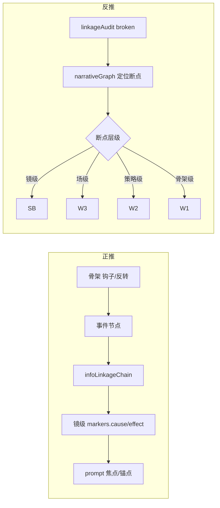

**narrativeCausalityGraph schema**：

```json
{
  "narrativeCausalityGraph": {
    "nodes": [
      { "id": "E1", "type": "event", "source": "W3:场2", "label": "发现密信" },
      { "id": "E2", "type": "event", "source": "W3:场3", "label": "宫门对峙" }
    ],
    "edges": [
      { "from": "E1", "to": "E2", "relation": "cause", "ruleId": "W41" }
    ],
    "broken": [],
    "reverseHints": []
  }
}
```

| 因果类型 | 正推落点 | 反推检测 | 规范 |
|----------|----------|----------|------|
| 事件因果 | W3 场序 + infoLinkage | 边缺失 | W41 |
| 动机因果 | 角色 action 链 | arcStage 与 action 矛盾 | G1/B9 |
| 信息因果 | 铺垫镜→揭晓镜 | 反转登记表 vs SB markers | W14 |
| 情绪因果 | 曲线→场→镜 | 跳变无缓冲 W8 | brief/GB |
| 视觉因果 | visualFocus 链 | infoLink 断 | B8 |
| 台词因果 | lines 链（已有 R2） | hash | H3 |

**Chat 工作流**：W3 末生成 **事件节点草稿** → designBrief.infoLinkage → SB 每镜 `markers.causeId/effectId` → 出口 `narrativeCausalityGraph` 无 broken。

### 14.6 首次出场 · debutIntroPack（Q5）

**规则**：角色/场景/道具 **全剧首次可识别出场**需「最佳标准介绍」——文案+镜头+可选特效，避免观众懵。

| 类型 | 首次判定 | 标准包内容 | 落点 |
|------|----------|------------|------|
| **角色** | charCode 首次出现在 SB | 定场镜(CU/MS)+identity 词+可选 name card | SB shotSize + visualDescription；T3 SUB 轨 |
| **场景** | sceneCode 首次 |  establishing WS/LS + 环境 2 句 | SB + sceneColorLock |
| **道具** | propCode 首次（关键道具） | 特写 + propState 初始 | anchorProps + SB |
| **关系** | 两角色首次同框 | 站位 spatialRelation + 权力关系 | SB + image part3 |

**debutIntroPack**：

```json
{
  "debutIntroPack": {
    "characters": [{
      "code": "CHAR-LIWEI",
      "firstShotIndex": 1,
      "introTemplate": "establishing_MS",
      "copyHint": "首次出场：姓名/身份/视觉特征一句",
      "subtitleCard": optional,
      "fxHint": null
    }],
    "scenes": [{ "code": "SCENE-PALACE", "firstShotIndex": 4, "introTemplate": "establishing_WS" }]
  }
}
```

**与 QP 联动**：首次出场镜若 visualDescription 空泛 → **QP-02 BLOCK**；缺 establishing 景别 → **QP-PR-04 WARN**。

**特效**：首次重要角色可加 **F1 级** 光晕/粒子（fx matrix）；禁止 F4/F5 级首次出场（易失败）。

### 14.7 制作实现 · 正推/反推扩展验证表

| 域 | 正推链 | 反推触发 | 重推 stage | 多端统一检 |
|----|--------|----------|------------|------------|
| 身份 | CD→BP→SB→EN→MD | identityAudit fail | EN/BP/CD | IMG+VID+AUD |
| 台词 | W3→SB→AUD/VID | R2/H3 hash | SB/W3 | lines+lip |
| 情绪 | brief→GB→SB→Y9 | QP-06/PR-04 | GB/SB/brief | IMG+VID |
| 构图 | brief→SB→EN | presentationFork | W3/SB | IMG |
| 镜头 | GB→SB→Y10 | PR-05 | SB | VID |
| 特效 | W3→SB→FX→VID | fxFeasibility F2+ | SB/W3/EN | FX+VID |
| 故事因果 | W1→W3→graph | graph.broken | W1-W3/SB | 全链 |
| 首次出场 | debutPack→SB | 缺 establishing | SB/W3 | IMG+SUB |
| 生成后 | Gate→API | generationFeedback | rePush 合流 | 触达层 |

### 14.8 制作闭环 · 与 §13 合流

```
设计走廊（§5-§12）→ import（§13）
  → identityAudit + fxFeasibilityPreflight + narrativeGraph 复核
  → QualityGate L0
  → ModalityOrchestrator（图→视→音→FX→SUB）
  → MediaProbe / 用户反馈
  → generationFeedback → rePushPlan（§11）→ 修订 → 再 validate
  → continuity + debut 状态写回（下集 debut 不重复 full intro）
```

### 14.9 新增交付 · 附录 O

```
§6   制作实现闭环总览（identity+FX+PR+因果+debut）
附录 O · 制作实现正推/反推验证表 + fx_feasibility_matrix + debut 模板
browser_chat/stages/production_identity_audit.md
browser_chat/stages/production_fx_feasibility.md
browser_chat/stages/production_debut_intro.md
browser_chat/production/MD_prompt_compliance.md  （增 identity+FX 段）
data/fixtures/fx_feasibility_matrix.json
data/fixtures/debut_intro_templates.json
```

### 14.10 验收 G56-G65（制作实现闭环）

| # | 验收 |
|---|------|
| G56 | identityAudit：design male 时 IMG/VID/AUD 无 female 冲突 |
| G57 | fxFeasibility F5 镜不得 output T3 未降级 |
| G58 | F2 特效输出 degradeFixPlan + 用户确认流 |
| G59 | PR-01~08 任 BLOCK 触发 rePushPlan（非仅 fixPlan） |
| G60 | narrativeCausalityGraph 无 broken 或均有 reverseHints |
| G61 | 每主角色/主场景有 debutIntroPack 条目 |
| G62 | 首次出场镜 shotSize 含 establishing 类 |
| G63 | generationFeedback identity_mismatch 路由到 EN/BP |
| G64 | 内外 identityAudit 字段一致（Chat T3 = import dryRun） |
| G65 | golden 含「男设计/女prompt」反例必 BLOCK |

---

## 规则流程双轨：V5 内部版 vs Browser Chat 优化版 v2.0

### 1. 三轨关系

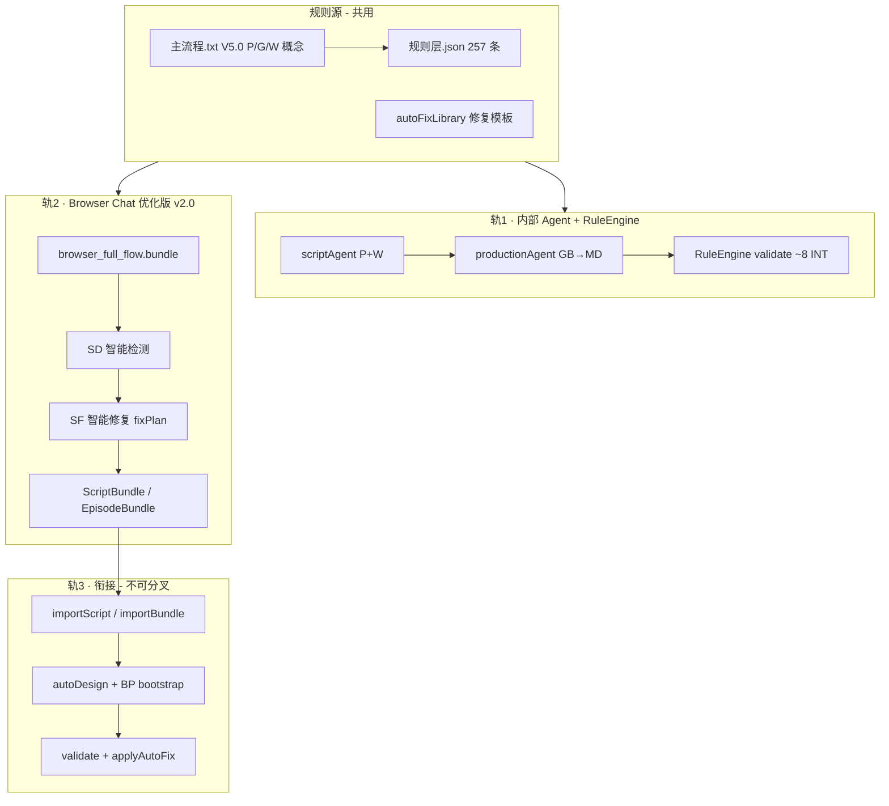

| 维度 | V5 内部版 | Browser Chat 优化版 v2.0 | 衔接约束 |
|------|-----------|---------------------------|----------|
| **执行者** | scriptAgent / productionAgent | 外部 LLM + bundle | ruleId 一致 |
| **规则执行** | API validate（~8 条 INT） | L2 自检 + L4 audit（257 登记） | import 后 INT 复检 |
| **智能检测** | supervisionAgent API | SD-P/M/W/S/R 外部等效 | 同 A/B/C/D 口径 |
| **智能修复** | applyAutoFix 3 条 | SF fixPlan + autoFixLibrary | import 后 L0 机器修 |
| **设计联动** | autoDesign heuristic | designBrief + visualLockDraft | autoDesign 读 bundle 字段 |
| **资产/锚点** | o_assets + blueprint API | AS extract + BP visualLockTable | T2 写 o_projectBlueprint |
| **四模态** | workbench 内部 | T3 外部 MD prompt | importBundle 直落库 |
| **反馈闭环** | H→rollbackLayer | 附录 D + generationFeedback | 同一回滚表 |

### 2. Browser Chat 优化版 · 完整阶段流（相对 V5 的增量）

V5 [`主流程.txt`](主流程.txt) 原路径：`源材料 → P(0→0.9) → G → W → B转化 → 制作(B→Z→H)`

**优化版 v2.0 扩展路径**（在 W 与制作之间插入 CD/AS/BP，并包裹 SD/SF）：

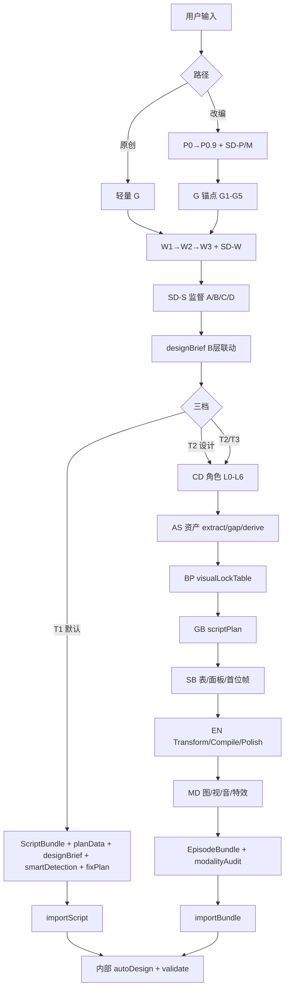

**相对 V5 新增阶段**（写入 `rule_flow_browser_chat.json`）：

| 阶段 ID | 名称 | V5 对应 | 优化版增量 |
|---------|------|---------|------------|
| SD-* | 智能检测 | 无（分散在 P 报告） | 结构化 smartDetection |
| SF | 智能修复 | H9 autoFix 内部 | 外部 fixPlan 闭环 |
| CD | 角色智能设计 | 步骤0.6 人物锚点 | L0-L6 + W93 弧光 |
| AS | 资产流水线 | 角色资产（隐含） | extract/gap/derive/CODE |
| BP | 资产蓝图 | D 层部分 | visualLockTable 完整 |
| designBrief | 设计联动桥 | B 层转化 | T1 必填，替代纯 W 输出 |

### 3. 14 层规则 · Browser Chat 挂载表（优化版）

| 层级 | 规则数 | V5 内部挂载点 | Browser Chat v2.0 挂载点 | implLevel |
|------|--------|---------------|---------------------------|-----------|
| **P** | 18 | scriptAgent sub-agent | stages/P0*.md + SD-P | L1-L3 |
| **G** | 5 | get/setBlueprint API | §3 G 模板 + planData.globalAnchors | L3 |
| **W** | 46 | script_execution_* | §4 W1-W3 + SD-W + SD-S | L1-L4 |
| **B** | 12 | autoDesign | designBrief（T1 必填） | L3 |
| **D** | 12 | BP 待建 | BP visualLockTable + AS | L3 |
| **V** | 15 | validate 部分 | W3 L2 + SB/EN T2+ | L2 |
| **M/S/I/X** | 50 | SB 字段 | SB 扩展 + checklists_production | L2 |
| **Y** | 74 | promptCompiler | EN + MD T3 | L2-L3 |
| **Z** | 20 | exportPackage | T3 EpisodeBundle Z 段 | L3 |
| **H** | 35 | validate | ruleAudit + 附录 D 回滚 | L4 |
| **L** | 10 | tier0 | rule_cards 引用 | L1 |
| **W93-100** | L6 创意 | 规划态 | 附录 G 触发式增强 | L1 |

### 4. 新产物：`rule_flow_browser_chat.json`

由 `extract-rule-checklists.ts` 同步生成，作为 **Browser Chat 规则流程机器可读索引**：

```json
{
  "version": "2.0.0",
  "codename": "browser-chat-optimized",
  "baseFlow": "主流程.txt V5.0",
  "rulePackVersion": "2.0.0",
  "tracks": {
    "internal": { "entry": "scriptAgent", "stages": ["P","G","W","BP","GB","SB","EN","MD","Z","H"] },
    "browserChat": { "entry": "browser_full_flow.bundle", "stages": ["P","G","W","SD","SF","designBrief","CD","AS","BP","GB","SB","EN","MD","Z","H"] }
  },
  "tiers": {
    "T1": {
      "exitStage": "SB",
      "output": "ScriptBundle+preDesignPack",
      "mandatory": ["scriptPlan", "shots[].narrative.dialogue.lines", "preDesignQuality"],
      "internalContinue": ["EN","MD","validate"],
      "skipOnImport": ["autoDesign.SB when shots present"]
    },
    "T2": { "exitStage": "EN", "output": "EpisodeBundle-lite" },
    "T3": { "exitStage": "MD", "output": "EpisodeBundle-full" }
  },
  "stages": [
    {
      "id": "P0",
      "name": "源材料预检",
      "rules": ["P1-P18"],
      "smartDetection": "SD-P",
      "gate": { "blockNext": "P03", "criteria": "preCheck 六维度草稿已确认" },
      "outputs": ["planData.preCheck"]
    }
  ]
}
```

**同步更新**：
- [`browser_flow_orchestration.md`](data/skills/browser_flow_orchestration.md) — 正文嵌入双轨对照摘要
- [`DESIGN_FLOW_GUIDE.md`](docs/DESIGN_FLOW_GUIDE.md) — 增加「Browser Chat 优化版 v2.0」章节
- 旧 bundle 头部 redirect：`design_flow.bundle.md` / `adaptation_flow.bundle.md` → v2.0

### 5. 阶段闸门表（优化版 · 含 SD/SF/CD/AS）

| 阶段 | 入口 | 出口产出 | BLOCK 未过 |
|------|------|----------|------------|
| P0 | 有源材料 | planData.preCheck + SD-P 草稿 | 不得 P03 |
| P03 | P0 | adaptationMatrix + SD-M | 不得 P06 |
| P06 | P03 | storyCore | 不得 P08 |
| P08 | P06 | postCheck 六维度≥5 | 不得 P09/W1 |
| P09 | P08 | reinforcement | 不得 W1 |
| G | P09 或原创 | globalAnchors | 不得 W |
| W1-W3 | G | script + SD-W 扫描 | 不得 SD-S |
| SD-S | W* | supervisionReport A/B/C/D | C/D 不得下一阶段 |
| designBrief | W3+SD-S | designBrief 齐全 | 不得 SF 终检 |
| SF | 任一 BLOCK | fixPlan → 修订 → 重检 | 不得 output |
| output T1 | 上列全过 | ScriptBundle | — |
| CD | T2+ | characterAssets L0-L6 | 不得 AS |
| AS | CD/T2 | assetPipeline + codes | 不得 BP |
| BP | AS | visualLockTable | 不得 GB |
| GB→MD | BP | 同 V5 制作链 | 同附录 D |
| output T2/T3 | MD audit | EpisodeBundle | — |

---

## 目标与现状差距

用户需要：**一个 System Prompt** 即可完成「原创主流程 + 智能分析 + 规则适配 + 生成导入文件」的完整闭环。


| 模块          | 现状                                                                            | 缺口                                                                    |
| ----------- | ----------------------------------------------------------------------------- | --------------------------------------------------------------------- |
| 原创直写        | `[design_flow.bundle.md](data/skills/design_flow.bundle.md)` v1.1 可用          | 无 P 分析、无 planData、无规则 ID 自检                                           |
| 改编 P+W      | `[adaptation_flow.bundle.md](data/skills/adaptation_flow.bundle.md)` 仅 30 行骨架 | 未合并 execution skill 细则                                                |
| P 阶段源 skill | `[adaptation_execution_*.md](data/skills/)` ×5 均为 stub                        | 需从 `[主流程.txt](主流程.txt)` 展开                                            |
| 规则适配        | 内部 RuleEngine 257 条注册，外部仅少量自检                                                 | P/G 在 `[主流程.txt](主流程.txt)`，W~H 在 `[规则层.json](规则层.json)`，需分层整理进 bundle |
| 导入契约        | ScriptBundle 无 planData                                                       | import 无法落库 P+W 分析产物                                                  |
| 生成脚本        | `[bundle-design-flow.ts](scripts/bundle-design-flow.ts)` 自引用，无真实合并            | 需新建统一 bundle 生成器                                                      |


## 目标架构（优化版 v2.0 · 含 SD/SF/CD/AS）

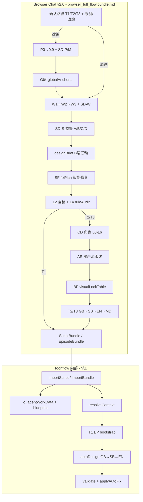


**双路径规则（写入 bundle 开头）：**

- **改编路径**：用户提供小说/梗概 → 必须走完 P0→P0.9 → G 锚点 → W1→W2→W3 → 输出 ScriptBundle
- **原创路径**：用户已有大纲/剧本 → 可跳过 P，轻量 G 锚点 → 直写 W3（或 W1→W3）→ 输出 ScriptBundle
- **共同终点**：默认输出 **ScriptBundle**；高级模式输出 **EpisodeBundle**（含分镜 JSON + 四模态 prompt + Z 包）

---

## browser_full_flow.bundle 完整闭环与边界细则

`browser_full_flow.bundle.md` 是**唯一对外 System Prompt 入口**（单文件模式），必须自包含：**流程编排 + 阶段细则 + 规则实现 + 产出契约 + 边界红线 + 导入说明**，使用户在不调 Toonflow API 的情况下完成可导入的合格产出。

### 1. 什么叫「完整闭环」（bundle 内必须写清）

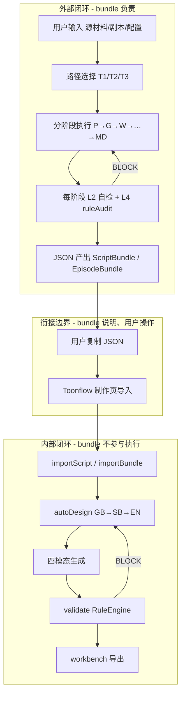

| 闭环段 | 谁负责 | bundle 必须提供 |
|--------|--------|----------------|
| **对话闭环** | 外部 LLM | 阶段顺序、解锁条件、自检、产出格式 |
| **契约闭环** | L2 统一 | JSON schema 与内部 import 一致 |
| **落库闭环** | 用户 + Toonflow | 导入步骤说明；bundle 不调 API |
| **制作闭环** | Toonflow 内部 | import 后链路说明（autoDesign→validate→生成） |

**bundle 正文开头固定声明**：
> 你处于 **L1 对话层**。设计标准见本文件（L2 契约）；合格终审在 Toonflow import 后 RuleEngine（L3 不可绕过）。本文件不调任何 HTTP/Socket API。

### 2. 三层边界（L1 / L2 / L3）

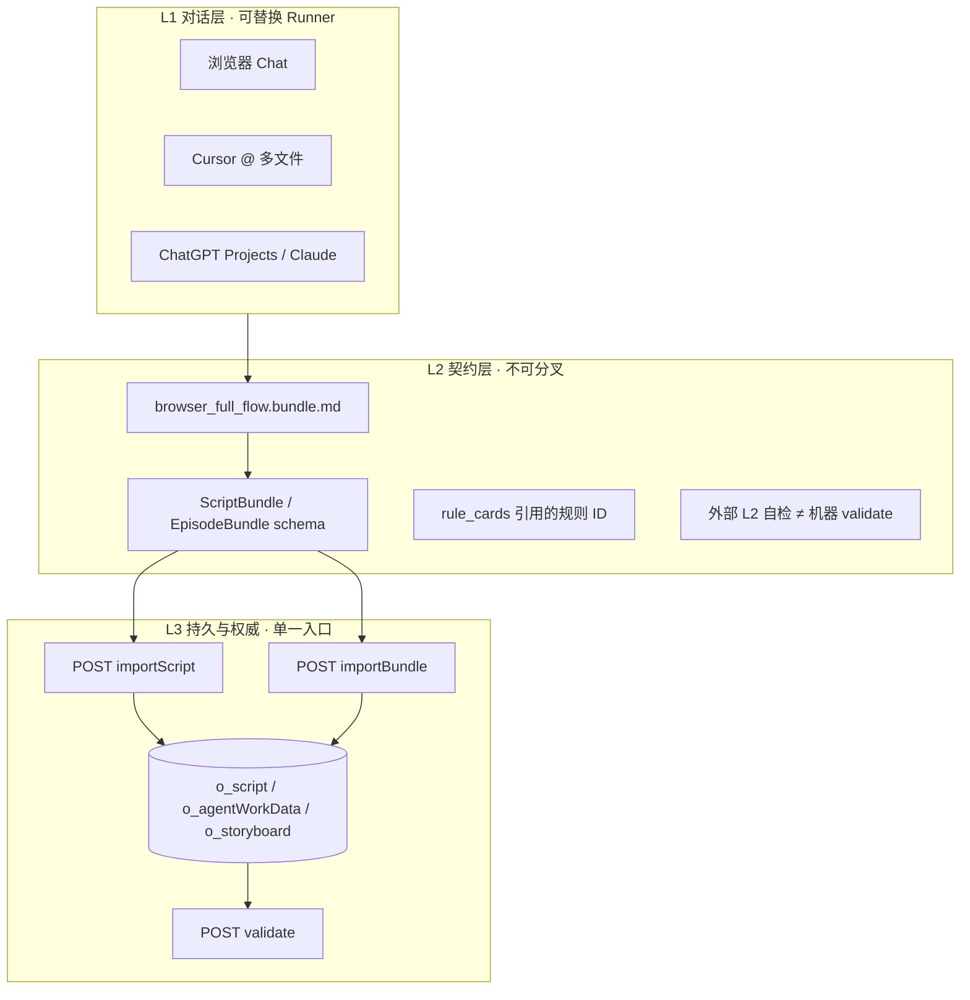

| 边界 | 归属 | 规则 | bundle 写法 |
|------|------|------|-------------|
| **怎么聊** | L1 Runner | 可换 Chat 产品，Skill 内容不变 | §0 用法；多文件套件为 L1 优化 |
| **标准是什么** | L2 Skill | 全项目唯一；与 `design_flow.md` / `规则层.json` ID 对齐 | 各阶段细则 + rule_cards |
| **外部合不合格** | L2 自检 | LLM checkbox + ruleAudit；**非终审** | 每阶段 BLOCK 清单 |
| **机器合不合格** | L3 validate | import 后 RulePanel 权威 | §9 说明「导入后 validate」 |
| **产出格式** | L2 JSON | 一种 ScriptBundle；一种 EpisodeBundle（T2/T3） | §7–§8 schema + 样例 |
| **怎么进系统** | L3 import | **唯一落库口**；Chat 禁止假装已写入 DB | §9 导入说明；红线「不调 API」 |

### 3. 四边界矩阵（职责 / 数据 / 规则 / 接口）

#### 3.1 职责边界

| 事项 | 外部 bundle | Toonflow 内部 | 禁止 |
|------|-------------|---------------|------|
| P+W 智能分析 | ✓ | 可选 scriptAgent 重做 | 外部跳过 BLOCK 自检 |
| G 锚点 | ✓ 写入 planData | 可读 o_projectBlueprint 合并 | 两源冲突无 merge 策略 |
| 剧本 script | ✓ | upsert o_script | 外部改 import 后库内剧本 |
| designBrief | ✓ T1 | autoDesign 消费 | 无 designBrief 且用户要求高质量 GB |
| BP/GB/SB/EN | T2/T3 可选 | autoDesign / productionAgent | T1 外部写完整分镜 |
| 四模态 prompt | T3 可选 | promptCompiler + workbench | T1 外部写 imagePrompt |
| 生图/生视频/配音 | ✗ | workbench API | bundle 内假装已生成媒体 |
| validate | 自检 only | RuleEngine API | 外部声称「已通过全部 257 条机器校验」 |

#### 3.2 数据边界

| 数据 | 外部携带 | 内部补全 | merge 策略 |
|------|----------|----------|------------|
| planData | ScriptBundle.planData | o_agentWorkData | bundle 非空字段覆盖 DB |
| designBrief | ScriptBundle.designBrief | autoDesign 输入 | JSON 优先 |
| continuity/anchors | ScriptBundle | resolveContext 读上一集 | 缺则读库 |
| script | ScriptBundle.script | o_script.content | upsert |
| storyboard[] | EpisodeBundle T2/T3 | o_storyboard + flowData | importBundle mergeStrategy |
| shots[].generation | EpisodeBundle T3 | EpisodePackage | replaceAll 默认 |
| ruleAudit | ScriptBundle 可选 | 日志/可选持久化 | 仅记录 |
| 媒体 URL/bin | ✗ | o_storyboard.src | 不在 bundle 输出 |

#### 3.3 规则边界（按三档）

| 档位 | bundle 内规则范围 | 内部 validate 补检 |
|------|-------------------|-------------------|
| **T1** | P+G+W+B+H1 + **GB→SB 前期设计包** (~120 卡片) | EN/Y/Z + MD 四模态 |
| **T2** | T1 + CD/AS/BP + EN compile 草案 (~180) | 扩展字段 + H5 部分 |
| **T3** | T2 + MD×4 + modalityAudit (~220+) | H5 + AG + MediaProbe |

#### 3.4 接口边界

| 接口 | 外部 | 说明 |
|------|------|------|
| HTTP/Socket | **禁止** | bundle 红线 §0 |
| importScript | 用户手动 | T1 唯一推荐落库口 |
| importBundle | 用户手动 | T2/T3 |
| validate | 用户手动（可选） | 导入后在制作页 RulePanel |
| exportScriptBundle | 对称 | 改稿 roundtrip |

### 4. 三档路径 · 入口/出口条件（bundle §1）

| 档位 | 入口条件 | 必经阶段 | 出口 JSON | 内部后续 |
|------|----------|----------|-----------|----------|
| **T1 默认** | 有源材料或剧本意图 | P?→G→W→designBrief→**GB→SB**→SF→ruleAudit | **ScriptBundle+preDesignPack** | importScript → **有 shots 则跳过 SB** → EN/validate |
| **T2 设计** | T1 后继续或声明「补蓝图/编译」 | T1 + CD→AS→BP→EN | EpisodeBundle-lite | importBundle → validate → MD 内部 |
| **T3 全模态** | 用户声明「外部生成 prompt」 | T2 + MD×4→modalityAudit | EpisodeBundle-full | importBundle → 直接生成 / validate |

**路径互斥与升级**：
- 默认 **T1**；未声明不得输出 EpisodeBundle
- T1→T2：用户说「继续分镜设计」→ 加载附录 A 流程
- T2→T3：用户说「生成提示词/准备生图」→ 加载附录 B MD 规则

### 5. 阶段闸门（每阶段 entry / exit / BLOCK）

bundle 每个阶段统一模板：

```
### 阶段 [ID] · [名称]
**入口**：前置阶段 ruleAudit 通过 + 必填输入
**执行**：细则（合并自 execution skill）
**规则**：L2 checklist（BLOCK 项列表）
**出口**：产出字段 + ruleAudit.[stage]
**禁止**：越权事项
```

| 阶段 | 入口 | 出口产出 | BLOCK 未过 |
|------|------|----------|------------|
| P0 | 有源材料 | planData.preCheck + SD-P | 不得进 P03 |
| P03 | P0 passed | adaptationMatrix + SD-M | 不得进 P06 |
| P06 | P03 | storyCore | 不得进 P08 |
| P08 | P06 | postCheck（六维度≥5） | 不得进 P09 / W1 |
| P09 | P08 有残留 | reinforcement | 不得进 W1 |
| G | P09 或原创跳过 P | globalAnchors | 不得进 W |
| W1-W3 | G | script + SD-W | 不得 SD-S |
| SD-S | W* | supervisionReport | C/D 不得下一阶段 |
| designBrief | SD-S passed | designBrief 齐全 | 不得 GB |
| GB | designBrief | scriptPlan + episodeBeat | 不得 SB |
| SB | GB | **shots[] 含 dialogue.lines** | 不得 SF 终检 |
| SF | 任一 BLOCK | fixPlan 修订后重检 | 不得 output T1 |
| output T1 | 上列全过 + **preDesignQuality≥B** | ScriptBundle+preDesignPack | — |
| CD | T2 声明 | L0-L6 characterAssets | 不得 AS |
| AS | CD | assetPipeline + codes | 不得 BP |
| BP | AS | visualLockTable | 不得 EN（T2） |
| EN | SB/BP | compiled prompts 草案 | 不得 MD |
| MD-* | EN | per-shot prompts + modalityAudit | 不得 output T3 |
| output T3 | MD audit 全过 | EpisodeBundle-full | — |

### 6. browser_full_flow.bundle.md 正文目录（生成目标 TOC）

单文件必须包含以下章节（多文件套件 `00_index.md` 同构）：

```
§0  用法·红线·三层边界·三档路径选择
§1  输入契约（项目配置/集数/源材料/provenance）
§2  改编路径 P0→P0.9（5 阶段完整细则）
§3  G 层全局锚点 G1-G5 模板
§4  W 阶段 W1→W2→W3（合并 script_execution_* 要点）
§5.0 设计→提示词质量走廊（SPEC/LINK/SD/SF 四支柱 · 附录 K）
§5.1  台词链规范（R2/H3/Y59/AG 分工）
§5.2  资产链规范（AS/BP/refs 分工）
§5.3  连贯性链规范（continuity merge 规则）
§5.4  视听联动链规范（B→M→Y 映射 + C3）
§5.5  故事信息链规范（infoLinkage + 钩子/反转）
§5.6  修复链规范（SF + linkageRepair + rollback）
§6  规则自检清单（P+G+W，从 rule_cards 渲染）
§7  T1 输出 · ScriptBundle JSON schema + 官方样例
§8  多集衔接 continuity / prevEpisodeKey / anchors
§9  导入 Toonflow（步骤·深链·import 后内部链路说明）
§10 对话话术模板
§11 规则流程 Browser Chat 版（双轨对照 + rule_flow_browser_chat.json 摘要）
附录 A  T2 · CD/AS/BP/GB/SB/EN
附录 B  T3 · MD 四模态
附录 C  ruleAudit / modalityAudit / smartDetection
附录 D  H 层 BLOCK → 回滚阶段
附录 E  规则应用逐项检测（五维）
附录 F  智能修复 fixPlan + autoFixLibrary
附录 G  智能设计增强 W93-W100 + CD 弧光
附录 H  图锚点 visualLockTable + cref/sref + 漂移保护
附录 I  六链逐项边界对照 + linkageRepairPlan
附录 J  T1 PreDesignPack + Q1-Q15
附录 K  设计→提示词质量走廊（边界+SD/SF+linkageAudit）
附录 L  正推/反推双向闭环
附录 M  质量问题目录 QP + 四模态 Prompt 合规
附录 N  V5×Chat 统一闭环
附录 O  制作实现闭环（identity+FX+PR+因果+debut）
```

### 7. 外部 CAN / CANNOT（bundle §0 红线）

**CAN**
- 分阶段对话，每阶段产出写入对话上下文
- 对源材料做 P 分析、W 编剧、designBrief 设计标注
- T2/T3 下产出分镜 JSON 与四模态 prompt 文本
- 输出符合 schema 的 JSON 供用户复制
- 对照 rule_cards 做 L2 自检并写 ruleAudit

**CANNOT**
- 调用 Toonflow 任何 API / Socket
- 声称已 import、已 validate、已生图/生视频
- T1 下输出 **imagePrompt / videoPrompt / audioPrompt**（T2 EN / T3 MD；**shots[] 与 dialogue.lines 必须输出**）
- 跳过 BLOCK 自检直接输出最终 JSON
- 跳过 GB→SB 直接 output T1
- 修改 rulePackVersion 或自造规则 ID
- 在剧本正文写 BGM/镜头调度（W3 铁律）；结构化 shots 字段允许景别/情绪/画面描述

### 8. 与 Toonflow 衔接 · 导入后内部链路（bundle §9）

用户粘贴 JSON 后，**bundle 内固定说明**（不需 API）：

```
T1 ScriptBundle
  → 制作页「导入 ScriptBundle」或 #/production?import=1
  → POST importScript（autoDesign ✓）
  → resolveContext（上一集/资产/planData/designBrief）
  → autoDesign：GB→SB→EN
  → validate → RulePanel
  → productionAgent：生图→生视频→配音→workbench

T2/T3 EpisodeBundle
  → POST importBundle
  → 落库 flowData + o_storyboard + EpisodePackage
  → validate → 生成（T3 可跳过 autoDesign 部分阶段）
```

**深链**（写入 bundle）：`#/production?import=1`、`?scriptId=&autoDesign=1`

### 9. 黄金路径验收（bundle 闭环 DoD）

| # | 路径 | 验收步骤 |
|---|------|----------|
| G1 | T1 改编 | 源材料 → P→W→ScriptBundle → import → autoDesign → RulePanel 无 BLOCK |
| G2 | T1 原创 | 跳过 P → W3+designBrief → import → 同上 |
| G3 | T1 多集 | ep-02 带 continuity + prevEpisodeKey → resolveContext 衔接 |
| G4 | T2 | EpisodeBundle-lite → importBundle → 分镜刷新仍在 |
| G5 | T3 | EpisodeBundle-full → shots[].generation 非空 → validate H5 |
| G6 | roundtrip | exportScriptBundle → 外部改 script → re-import |
| G7 | 规则一致 | 外部 ruleAudit.checked 的 ID ⊆ 内部 ruleRegistry |

### 10. 单文件 vs 多文件边界

| | browser_full_flow.bundle.md | browser_chat/ 套件 |
|--|------------------------------|-------------------|
| 内容 | 附录 A/B **折叠/摘要**或完整合并 | 分文件完整展开 |
| 体积 | ≤25k tokens（附录 B 可「见套件文件」） | 每文件 2–5k |
| 阶段加载 | 一次注入，对话内分阶段 | `@stages/` `@production/` |
| 边界 | 同 L2 契约 | manifest.json 定义解锁 |
| 生成 | merge 脚本输出 | 同脚本输出目录 |

**默认**：单文件含 T1 全文 + T2/T3 附录摘要 + 「完整细则见 browser_chat/」指针；`yarn bundle:browser-full-flow` 可选 `--full-appendix` 生成超大单文件。

---

## 规则逐项检测：故事设计 → 四模态「是否应用」

用户要求：**逐项检测**从故事设计（剧本/画面/台词/情绪/故事）到 AI 生图/视频/语音/特效的规则是否**在设计链路中被应用**（不仅是注册，还要可追溯、可验收）。

### 1. 检测模型：规则应用三态

每条规则在系统中处于以下之一（写入 `rule_application_matrix.json`）：

| 状态 | 代号 | 含义 | 验收 |
|------|------|------|------|
| **已入 Skill** | `SKILL` | 出现在 browser_full_flow / rule_cards | grep ruleId in bundle |
| **外部可检** | `EXT` | 有 L2 passCriteria，Chat 可 checkbox | ruleAudit / modalityAudit |
| **内部可执行** | `INT` | RuleEngine validator 或 promptCompiler 实际执行 | validate 报告 hit |
| **仅注册** | `REG` | ruleRegistry 有，未落地 | getReport skipped |
| **未覆盖** | `GAP` | 规则层.json 有，三处皆无 | audit 报红 |

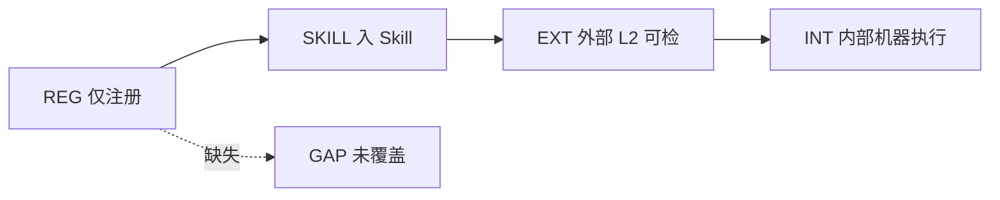

**目标覆盖率（分阶段）**：
- T1：P/G/W/B + designBrief 相关规则 → **SKILL+EXT 100%**，INT 随 RuleEngine 迭代
- T2：+ V/M/S/D/I/X 分镜字段 → SKILL+EXT ≥90%
- T3：+ Y/Z/AG 四模态 → SKILL+EXT ≥85%，INT ≥ Tier-0 全集

### 2. 五维设计物 → 规则链 → 四模态（逐项追溯表）

依据 [`示例3.txt`](示例3.txt) §4.2 五维覆盖 + [`交叉规则联动表`](规则层.json) 依赖链。

#### 2.1 文字类（剧本 / 台词）

| 设计物 | 源字段 | 规则链 | 应用到 | 四模态 | 外部检测点 | 内部检测点 |
|--------|--------|--------|--------|--------|------------|------------|
| 剧本正文 | `script` | W41-W46 → R2 | SB.dialogue.lines | AUD | W3 L2 R2 台词保真 | dialogueFidelityGate |
| 台词长度 | dialogue.lines | V10, W11 | duration | VID/AUD | W-TIME 字数上限 | tier0Validators V10 |
| 台词→情绪 | lines 文本 | B1/B3/B4 | emotionIntensity | IMG/VID | designBrief.sceneEmotions | Transform（待建） |
| 台词→交付 | dialogue.type | Y59-Y65 | audioPrompt | AUD | MD_audio L2 | compile audioIR |
| 台词→口型 | dialogue 非空 | V530区, AG | videoPrompt lip sync | VID | MD_video checklist | validate（待建） |
| 独白/旁白 | OS/VO 标记 | AG-AUD, H4-5 | audioPrompt 轨 | AUD | script FMT + MD_audio | Z109 schema |
| 接话速度 | L6.voice.speed | V74 | duration 公式 | AUD | MD_audio V76 公式 | DurationCalculator（规划） |

**链路验收**：script 引号内台词 → SB 每镜 lines **hash 一致**（R2/H3）→ audioPrompt 含交付词（Y59）→ 生视频含 lip sync（若有对白）。

#### 2.2 视觉类（画面 / 分镜 / 提示词）

| 设计物 | 源字段 | 规则链 | 应用到 | 四模态 | 外部检测点 | 内部检测点 |
|--------|--------|--------|--------|--------|------------|------------|
| 场级画面 | △ 场景描述 | W → SB.画面描述 | imagePrompt 主体 | IMG | W3 可拍性 | SB 字段存在 |
| 景别 | shotSize | M1-M5, Y5 | image/videoPrompt | IMG/VID | SB 必填 | tier0 V11 WARN |
| 机位/运动 | camera/cameraMove | M6-M10, Y10 | videoPrompt 前 3 词 | VID | MD_video Y10 | buildVideoIR |
| 色温/光质 | colorTone/lighting | S2, Y4/Y6, D5 | imagePrompt | IMG | BP sceneColorLock | validate（待建） |
| 构图/站位 | spatialRelation | S3, QF-VIEW | imagePrompt 权力关系 | IMG | SB 扩展字段 | validate（待建） |
| 道具状态 | propState | D3/D7, V11 | imagePrompt 道具词 | IMG | BP anchorProps | validate（待建） |
| 纯景/纯道具 | type | V2/V3 | image constraints | IMG | MD_image V2/V3 | tier0Validators |
| 资产引用 | assetCodes | V4-V6, Y8, Z3-Z5 | --cref/--sref | IMG | MD_image structured | validate（待建） |
| 竖屏比例 | platform | Z9, V11 | --ar 9:16 | IMG | MD_image Z9 | config.platformProfile |

**链路验收**：designBrief.visualLockHints → SB 场景/色温 → EN imagePrompt 含 Y4/Y5/Y6/Y8 → 生图 API 参数 aspectRatio。

#### 2.3 情绪类（曲线 / 强度 / 缓冲）

| 设计物 | 源字段 | 规则链 | 应用到 | 四模态 | 外部检测点 | 内部检测点 |
|--------|--------|--------|--------|--------|------------|------------|
| 集级曲线 | emotionCurveType | W1-W5, W16 | episodeBeat | GB/SB | designBrief.emotionCurveType | autoDesign GB |
| 场级情绪 | sceneEmotions | B1, W8 | emotionIntensity | IMG/VID/AUD | designBrief 逐场 | SB 字段（待扩展） |
| 情绪→景别 | emotionIntensity | M1, B2 | shotSize | IMG/VID | MD_image Y9 | buildImageIR tags |
| 情绪→切换 | emotionIntensity | M11, I2/I3 | transitionType/rhythmZone | VID | MD_video I2 | validate（待建） |
| 情绪→词强度 | emotionIntensity | Y3/Y9 | prompt 强度词 | IMG | MD_image Y9 checklist | validate（待建） |
| 付费点对齐 | paypointMarkers | W9, V18 | paypoint 字段 | SB | designBrief W9 | validate（待建） |
| 高情绪缓冲 | W8 | W8 | 缓冲镜 emotion≤2 | SB | W1 骨架缓冲设计 | validate（待建） |

**链路验收**：W3 梗概标注爆/虐/爽 → designBrief.emotionCurveOutline → GB scriptPlan 分场情绪 → SB 每镜 emotionIntensity → Y9 强度词入 prompt。

#### 2.4 故事类（弧光 / 反转 / 钩子 / 信息）

| 设计物 | 源字段 | 规则链 | 应用到 | 四模态 | 外部检测点 | 内部检测点 |
|--------|--------|--------|--------|--------|------------|------------|
| 集末钩子 | 集末钩子 | W13, V3 | previewSlots | W3/script | W13 L2 BLOCK | episodeBeat.markers |
| 开篇钩子 | 第一场 | W12, V2 | 前 3 镜 | W3 | W12 L2 BLOCK | validate V2（待建） |
| 反转点 | 反转登记表 | W2, W14 | 反转标记+铺垫镜 | SB | W1 骨架登记表 | H5（待建） |
| 信息联动链 | infoLinkageChain | W11, B8 | visualFocus | IMG/VID | designBrief | validate（待建） |
| 角色弧光 | arcToneMap/G1 | G1, B9, S5/S8/S9 | 造型/语气/服色 | IMG/AUD | G 锚点 + designBrief | visualLockTable |
| 因果链 | 对话段落 | W41-W46 | 镜间因果 | SB | W3 L2 W41 | H3-1（待建） |
| 脱钩设计 | decoupleDesign | H3-4 | video 焦点 | VID | SB 字段 T2+ | validate（待建） |

**链路验收**：storySkeleton 钩子/反转 → W3 script 钩子注释 → designBrief.infoLinkageChain → SB 镜级标记 → videoPrompt focus on hands（脱钩时）。

#### 2.5 风格 / 特效 / 多轨类

| 设计物 | 源字段 | 规则链 | 应用到 | 四模态 | 外部检测点 | 内部检测点 |
|--------|--------|--------|--------|--------|------------|------------|
| 风格基调 | G3, artStyle | G3, art_skills | imagePrompt 前缀 | IMG | @art_skills | config.artStyle in IR |
| BGM 情绪 | 场景基调 | Y66, I层 | audioPrompt BGM | AUD | MD_audio | Z109（待建） |
| 音效 | sfx/env | D层, Y层 | audioPrompt sfx | AUD | MD_audio | buildAudioIR |
| 视觉特效 | visualEffect | V77, Z12 | video+后期 | FX | MD_effects V77 | EffectsTouch（规划） |
| 字幕/标题卡 | recap/preview | V 钩子区 | 第 4-6 镜 | SUB | SB markers | validate（待建） |
| 多轨时间轴 | duration | V76, Z109 | 轨时间戳 | AUD/SUB | MD_audio 公式 | workbench |

**链路验收**：G3 调性 → art_skills prefix → imagePrompt；visualEffect.type → videoPrompt 特效描述 → workbench 合成。

### 3. 阶段 × 模态 规则应用矩阵（摘要）

| 阶段 | IMG | VID | AUD | FX | 关键规则 ID |
|------|-----|-----|-----|-----|-------------|
| W3 剧本 | 意图 | 意图 | 台词文本 | — | R2, W12, W13, W41 |
| designBrief | 色温/锚点 | 节奏 | 弧光语气 | — | B1, B9, G1 |
| BP | visualLock | — | L6.voice | — | D1-D12, V4-V6 |
| GB | 场情绪 | 曲线 | — | — | W1-W10, B10 |
| SB | type/景别/情绪 | duration/运动 | dialogue 结构 | visualEffect | V1, M*, I* |
| EN/Y | imagePrompt | videoPrompt | audioPrompt | 特效词 | Y1-Y10 |
| MD 触达 | Z1-Z11 | Y10,V65-68 | Y59,V74,Z109 | V77,Z12 | 生成 API |
| H 校验 | H5-1 | H5-2 | H5-3 | H1-3 | 全链路 |

### 4. 检测工具与产出（`yarn audit:rule-application`）

新建 [`scripts/audit-rule-application.ts`](scripts/audit-rule-application.ts)：

```
输入:
  - 规则层.json（257 条定义）
  - rule_cards.json（Skill 覆盖）
  - ruleRegistry.ts（注册表）
  - validators/*.ts + promptCompiler.ts（INT 扫描 ruleId 字符串）
  - browser_full_flow.bundle.md（SKILL 扫描）

输出:
  - data/skills/_generated/rule_application_matrix.json
  - docs/RULE_APPLICATION_REPORT.md（人类可读）
```

**每条规则记录**：

```json
{
  "ruleId": "Y9",
  "layer": "Y",
  "designDimension": "情绪类",
  "sourceArtifact": "emotionIntensity",
  "targetModality": ["IMG"],
  "pipelineStages": ["EN", "MD-IMG"],
  "coverage": { "skill": true, "external": true, "internal": false },
  "detectionMethod": "检查 imagePrompt 强度词与 emotionIntensity 映射表",
  "linkedRules": ["M1", "B2"],
  "rollbackLayer": "EN"
}
```

**聚合报告三分**（对齐 getReport）：

| 指标 | 说明 |
|------|------|
| `registered` | ruleRegistry 总数 |
| `inSkill` | rule_cards + bundle 命中 |
| `externalCheckable` | 有 passCriteria 的 EXT |
| `internalExecutable` | validators/compiler 命中 |
| `gap` | REG 且非 SKILL |

### 5. 外部 Chat 逐项检测工作流（写入 bundle 附录 E）

用户在 T2/T3 或 import 前，可要求 LLM 输出 **`ruleApplicationReport`**：

```json
{
  "episodeKey": "ep-01",
  "dimensions": {
    "文字类": { "total": 12, "applied": 11, "gaps": ["V530"] },
    "视觉类": { "total": 28, "applied": 26, "gaps": ["V28","D21"] },
    "情绪类": { "total": 15, "applied": 15, "gaps": [] },
    "故事类": { "total": 10, "applied": 9, "gaps": ["H3-4"] },
    "风格特效类": { "total": 8, "applied": 7, "gaps": ["V77"] }
  },
  "modalityReadiness": {
    "IMG": { "ready": true, "missingRules": [] },
    "VID": { "ready": false, "missingRules": ["Y10"] },
    "AUD": { "ready": true, "missingRules": [] },
    "FX": { "ready": false, "missingRules": ["V77"] }
  },
  "traceSamples": [
    { "from": "script 场1 台词", "via": ["R2","B3","Y59"], "to": "audioPrompt", "status": "applied" }
  ]
}
```

**检测步骤（bundle 附录 E 固定流程）**：

1. **字段清单**：列出本集 script / designBrief / SB / generation 全部关键字段  
2. **维度映射**：按五维表查「源字段 → 规则链 → 目标模态」  
3. **逐项打标**：applied / partial / missing + ruleId  
4. **模态就绪**：IMG/VID/AUD/FX 四列是否满足 Tier-0 EXT 清单  
5. **BLOCK 处理**：missing 且 severity=BLOCK → 不得 output T3 / 不得声称可生成  

### 6. 内部 import 后检测（与外部对齐）

| 时机 | 检测 | 产出 |
|------|------|------|
| importScript 后 | planData/designBrief 是否落库 | import 日志 |
| autoDesign 后 | SB 是否含 emotionIntensity 等扩展字段 | dryRun diff |
| validate 后 | ruleCoverage.executed vs ruleApplicationMatrix | RulePanel |
| 生图前 | MODE-AGNES + V2/V3 + Z9 | workbench 拦截 |
| 生视频前 | Y10 + duration | batchGenerate 前置检查（规划） |

**闭环对齐**：外部 `ruleApplicationReport` 与内部 `ValidationReport.ruleCoverage` 使用**同一 ruleId 命名**；G7 验收：`external.applied ⊆ internal.registered` 且 Tier-0 交集 **INT 执行率 ≥80%**（随 RuleEngine 迭代提升）。

### 7. browser_full_flow.bundle 新增附录 E

```
附录 E · 规则应用逐项检测
  E.1 五维追溯表（摘要，完整见 rule_application_matrix.json）
  E.2 阶段×模态矩阵
  E.3 ruleApplicationReport 输出 schema
  E.4 检测话术：「请对本集执行规则应用检测」
  E.5 GAP 规则处理：partial 可 WARN 继续，BLOCK 必须回滚阶段
```

### 8. 当前已知 GAP（实施基线，audit 脚本首批输出）

| 区域 | 现状 | 计划补齐 |
|------|------|----------|
| RuleEngine INT | ~8 条可执行（V1/V2/V3/V10/R2/H3/MODE-AGNES） | 规则引擎重构 Wave 分批落地 |
| SB 扩展字段 | emotionIntensity 等多数缺失 | autoDesign + SB skill 扩展 + 镜级 charCodes/sceneCode/propState |
| BP/visualLock | 待建 stub | CD+AS+visualLockTable 完整结构 + T1 bootstrap |
| 资产流水线 | derive 内部有，外部无 | AS 阶段 + assetGapReport + assetPipeline schema |
| 图锚点 | 附录 E 提及 | 附录 H：cref/sref + H5-4 漂移 + sceneColorLock/anchorProps |
| Y 层 INT | promptCompiler 简化 IR，未跑 Y1-Y10 全检 | EN 阶段 + validate 扩展 |
| AG/特效 | 规划态，无 validator | ModalityOrchestrator + EffectsTouch |
| P/G 层 | 不在 规则层.json | 主流程.txt → rule_cards 单独索引 |
| **六链闭环** | 五维表有追溯，**无逐项边界+修复链** | **附录 I** + linkageRepairPlan + G20-G24 |

---

## 全链路闭环：台词·资产·连贯性·视听联动·故事联动·修复

> 用户关切：Chat 版是否涵盖**设计全流程**，且台词/资产/连贯性/视听/故事联动到修复是否**全闭环**？  
> **结论（v2.0.1 修订）**：T1 **必须输出 GB+SB 前期设计包**（含 `shots[].narrative.dialogue.lines`），出口前 **外部 hash 自检**；import 后 INT validate 复核。T2/T3 在 T1 基础上补 BP/EN/MD。

### 1. 六链闭环模型

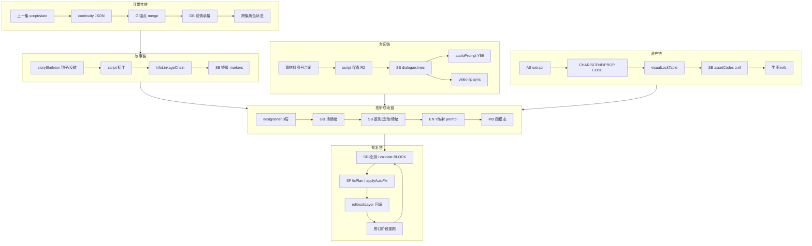

**闭环判定**：每条链必须满足 **源字段可追溯 → 中间阶段有落点 → 下游模态可验收 → BLOCK 有 rollback + fixPlan**。

### 2. 六链 · 逐项边界对照表（Chat vs 内部）

图例：**T1**=ScriptBundle 默认 · **T2**=EpisodeBundle-lite · **T3**=EpisodeBundle-full · **INT**=内部 Agent/RuleEngine

#### 2.1 台词链（7 项）

| # | 链路节点 | 规则 | INT 实现 | T1 Chat | T2 | T3 | 实现边界 | 断裂修复 | 闭环 |
|---|----------|------|----------|---------|----|----|----------|----------|------|
| D1 | 源材料→script 保真 | R2 | scriptAgent | W3 L2 比对源材料 | 同 T1 | 同 T1 | 引号台词零删改 | SF→修订 W3 | ✅ |
| D2 | script→SB lines | R2/H3 | dialogueFidelityGate | **T1 shots[].lines 必填** | 同 T1 | 同 T1 | 每句台词映射到镜 | rollback SB + fixPlan R2 | ✅ |
| D3 | lines hash 一致 | H3 | stableHash gate | **T1 出口 externalHashCheck** | EXT L2 | INT validate | 输出前自检，import 复核 | SF 重拆镜 | ✅ |
| D4 | 台词字数→duration | V10/W11 | tier0 V10 WARN | W3 场级字数统计 | SB duration 字段 | MD_audio 公式 | GB 禁写时长细节 | autoFix 缩台词 / 拆镜 | ⚠️ |
| D5 | 台词→emotionIntensity | B1/B3 | Transform 待建 | designBrief.sceneEmotions | SB emotionIntensity | EN Y9 | B 层在 brief，不在 script 正文 | fixPlan B3 补情绪 | ⚠️ |
| D6 | 台词→audioPrompt | Y59-Y65 | buildAudioIR 简化 | designBrief.arcToneMap 语气 | EN audioPrompt | T3 MD_audio L2 | 台词不进 imagePrompt（C5） | rollback EN/AUD | ⚠️ T1 内部补 |
| D7 | 对白→口型 video | AG lip sync | 待建 | MD_video 说明 | MD_video checklist | T3 modalityAudit | 纯 OS/VO 镜跳过 lip | 改 type 或拆镜 | ❌ INT 待建 |

**台词链闭环路径**：T1 `script(R2)` → import → `autoDesign(SB lines)` → `validate(hash)` → `EN(audio)` → T3 `MD(lip)`。bundle **§5.1 台词链** + `stages/linkage_dialogue.md`。

#### 2.2 资产链（8 项）

| # | 链路节点 | 规则 | INT | T1 | T2 | T3 | 实现边界 | 断裂修复 | 闭环 |
|---|----------|------|-----|----|----|-----|----------|----------|------|
| A1 | script→角色/场景名 | extract | productionAgent | assetPipeline.extracted | 同+CODE | 同 | 只 extract 不创建 DB 资产 | AS suggest 用户确认 | ⚠️ |
| A2 | 名→CHAR/SCENE CODE | V4-V6 | BP 待建 | deriveHints only | visualLockTable.codes | SB charCodes | T1 无 CODE | import bootstrap CODE | ⚠️ |
| A3 | 库内资产 gap | G8 | resolveContext.assets | assetGapReport WARN | 同 T1 | 同 | 外部不读 o_assets | 用户补资产或 AS-3 | ⚠️ |
| A4 | 角色 L0-L6 | D1-D12 | BP 待建 | characterDesign 轻量 | CD 完整 | BP+SB refs | T1 仅 arcToneMap | fixPlan V4 补定义 | ⚠️ |
| A5 | 衍生变体 | derive | derive_assets skill | deriveHints | AS-4 规则 | derive 写入 | 道具不 derive（硬边界） | 删非法 derive | ✅ 规则清晰 |
| A6 | 定妆图→cref | V72/Z3 | 待建 | 不生成图 | 用户外部 API | generation.imageRefs | Chat 不声称已生图 | generationFeedback | ⚠️ T3 |
| A7 | sceneColorLock→色温 | V7/Y6 | 待建 | visualLockHints 文本 | BP 结构化 | EN compile | GB 禁色温词 C3 | rollback BP/EN | ⚠️ |
| A8 | propState 连续 | V11/D3 | 待建 | — | anchorProps 状态机 | SB propState | 跨场道具状态 | fixPlan V11 改 state | ❌ INT 待建 |

**资产链闭环路径**：T2 `AS→BP→SB refs→EN cref→MD 生图`。T1 止于 extract+hint，**import 后内部 AS-4~6**。

#### 2.3 连贯性链（7 项）

| # | 链路节点 | 规则 | INT | T1 | T2 | T3 | 实现边界 | 断裂修复 | 闭环 |
|---|----------|------|-----|----|----|-----|----------|----------|------|
| C1 | 上一集 script | W-CONT | resolveContext 读库 | continuity 可选 | 同 | 同 | **库内有则 JSON 可省略** | generateContinuity API | ✅ |
| C2 | prevEpisodeSummary | G2 | autoDesign 注入 | continuity 字段 | 同 | 同 | 外部批量多集必填 | SF 补写 summary | ⚠️ |
| C3 | characterState | G1 | merge continuity | continuity.characterState | 同+BP L6 | 同 | 与 G 锚点两源 | ConflictResolver merge | ⚠️ |
| C4 | unresolvedHooks | W13 | GB 前情 | continuity.unresolvedHooks | SB markers | 同 | 钩子必须被承接 | fixPlan W13 补场 | ⚠️ |
| C5 | globalAnchors 跨集 | G1-G5 | o_projectBlueprint | planData.globalAnchors | 同 | 同 | 项目级不随集覆盖 | setBlueprint merge | ⚠️ |
| C6 | 集末→下集首 | continuityTracking | 规划 P1 | bundle §8 说明 | 同 | 同 | **Pipeline 结束写回待建** | 手动 continuity | ❌ 写回待建 |
| C7 | 多集 prevEpisodeKey | provenance | importAdapter | 必填 ep-02+ | 同 | 同 | 排序 importSeries 二期 | 重排 episodeKey | ⚠️ |

**连贯性链闭环路径**：`continuity JSON` ↔ `resolveContext merge` ↔ `GB 前情` ↔ `W3 W-CONT 自检` ↔ **C6 写回（二期）**。

#### 2.4 视听联动链（8 项）

| # | 链路节点 | 规则 | INT | T1 | T2 | T3 | 实现边界 | 断裂修复 | 闭环 |
|---|----------|------|-----|----|----|-----|----------|----------|------|
| AV1 | W 情绪→B 转化 | B1-B11 | autoDesign heuristic | designBrief + **GB 场情绪** | 同 T1 | 同 T1 | T1 必跑 GB | fixPlan B 层 | ✅ |
| AV2 | 情绪→景别 | M1/B2 | Transform 待建 | **SB shotSize 必填** | 同 T1 | EN Y5 | T1 结构化 | rollback SB | ✅ T1 |
| AV3 | 情绪→切换节奏 | M11/I2 | 待建 | rhythmOutline | SB rhythmZone | MD_video | GB 禁切镜设计 | SB 阶段补 | ❌ |
| AV4 | 景别→imagePrompt | Y5 | buildImageIR | 不产出 prompt | EN compile | T3 MD | 剧本禁镜头 | EN 阶段 | ⚠️ T3 |
| AV5 | 运动→videoPrompt | Y10 | buildVideoIR | 不产出 | EN | T3 MD | 先图后视频顺序 | generationFeedback | ⚠️ T3 |
| AV6 | 色温→image | Y4/Y6/S2 | 待建 | visualLockHints | sceneColorLock | EN | C3 分工 | rollback BP | ⚠️ |
| AV7 | 音效/BGM | Y66/Z109 | buildAudioIR 简化 | 剧本禁 BGM | MD_audio | T3 | director 禁配乐 | audioPolicy 配置 | ⚠️ |
| AV8 | 跨层 H1 一致 | H1 | validate 部分 | W3_design_brief H1 预检 | checklists_linkage | modalityAudit | 7 依赖链 EXT | linkageRepairPlan | ⚠️ |

**视听联动闭环路径**：T1 `designBrief(B+H1)` → import → `autoDesign(GB→SB→EN)` → T3 `MD+modalityAudit`。

#### 2.5 故事信息联动链（7 项）

| # | 链路节点 | 规则 | INT | T1 | T2 | T3 | 实现边界 | 断裂修复 | 闭环 |
|---|----------|------|-----|----|----|-----|----------|----------|------|
| S1 | 骨架钩子→剧本 | W13 | scriptAgent | W1→W3 注释 | 同 | 同 | 骨架必引用于 W3 | SF 补钩子场 | ⚠️ |
| S2 | infoLinkageChain | B8/W11 | 待建 | designBrief 必填 | SB visualFocus | video focus | 每环可追溯 | fixPlan B8 | ⚠️ |
| S3 | 反转登记表→铺垫镜 | W14 | 待建 | storySkeleton 表 | SB markers | 同 | 预埋<揭晓 | rollback W2/SB | ⚠️ |
| S4 | 弧光→服色语气 | B9/G1 | BP L6 | arcToneMap | CD+BP | EN | T1 仅语气 | fixPlan B9 | ⚠️ |
| S5 | 因果链 W41 | H3-1 | 待建 | W3 L2 | SB 镜间因果 | validate | LLM-assist | rollback W3/SB | ❌ |
| S6 | 脱钩表演 | H3-4 | 待建 | — | SB decoupleDesign | video focus | 高情绪镜 | fixPlan H3-4 | ❌ |
| S7 | 付费点 W9 | V18 | 待建 | paypointMarkers | SB paypoint | 同 | 90% 位对齐 | fixPlan W9 | ⚠️ |

**故事联动修复**：新增 `linkageRepairPlan`（与 fixPlan 并列，专用于**跨阶段故事/信息链**断裂）：

```json
{
  "linkageRepairPlan": {
    "chain": "infoLinkage|dialogue|continuity|av|asset",
    "breakAt": { "stage": "W3", "field": "infoLinkageChain[2]", "expected": "引出：宫门对峙", "actual": "缺失" },
    "rollbackStage": "W3",
    "suggestions": ["第三场补宫门对峙伏笔", "designBrief 补 visualFocus"],
    "status": "pending"
  }
}
```

#### 2.6 修复链（6 项）

| # | 环节 | INT | Chat | 实现边界 | 闭环 |
|---|------|-----|------|----------|------|
| R1 | 检测 SD/validate | validate ~8 条 | SD-* + ruleAudit | 外部 L2，内部 INT 权威 | ⚠️ |
| R2 | fixPlan 生成 | applyAutoFix 3 条 | SF + autoFixLibrary | 同 ruleId 话术 | ⚠️ |
| R3 | linkageRepairPlan | 无 | **新增** | 跨链断裂专用 | ❌ 待建 |
| R4 | rollbackLayer | H 路由表 | 附录 D | H2→GB H3→SB 等 | ✅ |
| R5 | 修订重跑 | Agent 重跑 stage | 对话内回滚 stage 文件 | 禁止静默跳阶段 | ✅ |
| R6 | 生成失败回流 | generationFeedback | 附录 F O5 | 资产问题 vs prompt 问题分流 | ⚠️ |

### 3. Chat 版设计全流程覆盖 · 分档对照

| 设计阶段 | V5 内部 | Chat 必须涵盖（bundle） | T1 | T2 | T3 |
|----------|---------|-------------------------|----|----|-----|
| P 预检改编 | scriptAgent | stages/P0*.md + SD-P | ✅ | ✅ | ✅ |
| G 锚点 | blueprint API | §3 + planData.globalAnchors | ✅ | ✅ | ✅ |
| W 编剧 | script_execution_* | §4 + SD-W/S | ✅ | ✅ | ✅ |
| B 设计联动 | autoDesign 输入 | designBrief + §5.5 + linkage | ✅ | ✅ | ✅ |
| CD/AS/BP | 待建 Agent | production/CD,AS,BP | 轻量 | ✅ | ✅ |
| GB/SB/EN | productionAgent | production/GB,SB + **T1 必跑** | **✅ GB+SB** | EN 编译 | EN+MD |
| MD 四模态 | workbench | MD_* + modalityAudit | import 后 EN | 部分 | ✅ |
| 连贯性 | resolveContext | §8 + linkage_continuity.md | ✅ | ✅ | ✅ |
| 六链修复 | validate+autoFix | SF + linkageRepairPlan + 附录 I | ✅ | ✅ | ✅ |

**Chat 涵盖设计全流程（v2.0.1）**：
- **T1 必含前期设计包** = W3 script + designBrief + **GB scriptPlan + SB shots（含 lines）**
- **出口质量闸门** = supervision≥B + preDesignQuality≥B + externalHashCheck 通过
- **import 策略** = 有 `shots[]` → **落库 o_storyboard，skip autoDesign SB** → 仅 EN/validate

---

## T1 前期设计包（PreDesignPack）· 高质量硬性要求

> 用户决策：**T1 也必须输出 SB lines 等**，务必保证前期设计智能、高质量。

### 1. T1 与 T2/T3 新分界

| 档位 | 外部必产出 | 外部不产出 | import 后内部 |
|------|------------|------------|---------------|
| **T1** | script + planData + designBrief + **scriptPlan + shots[]** + preDesignQuality | image/video/audioPrompt、visualLockTable 完整版 | 落库 SB；**skip autoDesign SB**；跑 EN（可选）+ validate |
| **T2** | T1 + CD/AS/BP + EN compiled 草案 | MD 四模态 API 参数 | importBundle；补 compile |
| **T3** | T2 + MD prompts + modalityAudit | — | 直落库 + 生成 |

### 2. preDesignPack 必填 Schema（ScriptBundle 内嵌）

```json
{
  "preDesignPack": {
    "scriptPlan": {
      "scenes": [{ "name": "寝殿", "dialogueCount": 3, "emotion": "压抑", "notes": "…" }],
      "transitions": [{ "from": "寝殿", "to": "宫门", "reason": "空间/情绪跳变" }],
      "episodeBeat": { "emotionCurve": [4,5,6,5,7], "paypoint": "90%" }
    },
    "shots": [{
      "shotIndex": 1,
      "sceneName": "寝殿",
      "narrative": {
        "type": "CHAR-SCENE",
        "visualDescription": "裴青梧坐于床榻，烛火摇曳",
        "emotionIntensity": 4,
        "duration": 3,
        "dialogue": { "character": "裴青梧", "lines": "……", "deliveryType": "对白" }
      },
      "shotSize": "MS",
      "markers": { "hook": false, "infoLink": "苏醒", "arcStage": "认命期" }
    }],
    "externalHashCheck": {
      "scriptDialogueHash": "sha256:…",
      "shotsDialogueHash": "sha256:…",
      "match": true,
      "unmappedLines": []
    },
    "preDesignQuality": {
      "supervisionGrade": "B",
      "densityScore": { "情绪": "高", "信息": "中", "情节": "高" },
      "hookOk": true,
      "dialogueMappedPercent": 100,
      "overall": "B"
    }
  }
}
```

**shots 必填字段（Tier-0 BLOCK）**：

| 字段 | 规则 | BLOCK 条件 |
|------|------|------------|
| `narrative.dialogue.lines` | R2 | 剧本每句引号台词必须出现在某镜 lines |
| `narrative.type` | V1 | CHAR-SCENE / PURE-SCENE / PURE-PROP / CHAR-PROP |
| `narrative.emotionIntensity` | B1/M1 | 1-10，场级与 scriptPlan 一致 |
| `shotSize` | M1 | MS/CU/WS 等 |
| `narrative.duration` | V10 | 与台词字数匹配区间 |
| `narrative.visualDescription` | W 可拍性 | 禁光影色温词 C5 |
| `sceneName` | — | 与 scriptPlan.scenes 对齐 |

### 3. T1 出口前三重质量闸门

```
闸门1 · SD-S 监督层：W3+SB 综合 ≥ B（C/D 不得 output）
闸门2 · externalHashCheck：scriptDialogueHash === shotsDialogueHash，unmappedLines=[]
闸门3 · preDesignQuality.overall ≥ B，hookOk=true，dialogueMappedPercent=100
```

未过闸门 → SF fixPlan / linkageRepairPlan → 修订 GB 或 SB → 重检。

### 4. GB→SB 外部执行顺序（T1 固定）

```
W3 script 定稿
  → designBrief 生成
  → GB：scriptPlan（分场/台词数/情绪/过渡）
  → SB：按场拆镜，逐镜填 lines/type/emotion/shotSize/duration
  → SD-W3+SB 扫描 + SD-S 监督
  → externalHashCheck
  → preDesignQuality 自评
  → 输出 ScriptBundle
```

新建 stage 文件：
- `browser_chat/stages/GB_director_plan_lite.md`（T1 版，禁光影）
- `browser_chat/stages/SB_storyboard_table_t1.md`（lines 必填 + 拆镜规则）
- `browser_chat/stages/T1_quality_gate.md`（三重闸门）

### 5. import 行为变更

[`importAdapter.ts`](src/ruleEngine/bundle/importAdapter.ts)：

```
if bundle.preDesignPack?.shots?.length:
  → 写入 o_storyboard（与 importBundle 同结构）
  → autoDesign 跳过 SB 生成，仅 EN compile（若尚无 compiled）
  → validate 立即跑 dialogueFidelityGate
else:
  → 现有 heuristic autoDesign（兼容旧 bundle，WARN deprecated）
```

### 6. 前期设计高质量 · 其他考量（纳入计划）

| # | 考量项 | 说明 | 落点 |
|---|--------|------|------|
| Q1 | **台词逐句映射审计** | 引号台词清单 ↔ shots 逐条对应表 | T1_quality_gate + externalHashCheck |
| Q2 | **镜密度/节奏** | 3-15-45 + 每场景镜数上下限 | SD-W rhythmCheck + rule_cards I层 |
| Q3 | **情绪曲线单调检测** | 连续 5 镜 emotion 无波动 → WARN | preDesignQuality |
| Q4 | **钩子镜强制** | 第 1 镜 + 最后 2 镜 hook/paypoint 标记 | W12/W13 + shots.markers |
| Q5 | **空镜/重复 lines** | 无 lines 无画面的废镜、台词重复分配 | SB L2 BLOCK |
| Q6 | **场间过渡完整性** | scriptPlan.transitions 覆盖所有场切换 | GB 出口检 |
| Q7 | **genre/style 模板** | `@story_skills/{genre}/` 密度与钩子基准 | manifest 可选 @ |
| Q8 | **平台竖屏约束** | 9:16 镜数建议、CU 占比 | projectConfig.platformProfile |
| Q9 | **多集承接镜** | ep≥2 第 1 场须承接 continuity.unresolvedHooks | linkage_continuity |
| Q10 | **W93-W100 增强触发** | 爆点不足/节奏拖沓/弧光弱 → 附录 G 建议 | SF 半自动 |
| Q11 | **反模式清单** | 台词进 visualDescription、GB 写色温、一镜多场景 | bundle §0 红线 |
| Q12 | **golden 样例** | 每 genre 1 个 T1 完整 JSON fixture | data/fixtures/t1-golden-*.json |
| Q13 | **改稿 roundtrip** | exportScriptBundle 含 preDesignPack，再 import diff | test-bundle-roundtrip |
| Q14 | **人工确认点** | supervision C/D 或 quality C → 用户显式确认才可降级继续 | T1_quality_gate |
| Q15 | **token 预算模式** | 「精简模式」仍保留 lines/type/emotion，可减 visualDescription 字数 | §0 可选 |

### 7. 验收 G25-G30（T1 前期设计包）

| # | 验收 |
|---|------|
| G25 | T1 JSON 含 preDesignPack.scriptPlan + shots[]≥1 |
| G26 | 100% 引号台词映射到 shots.lines，externalHashCheck.match=true |
| G27 | preDesignQuality.overall≥B 且 supervisionGrade≥B |
| G28 | import 后 o_storyboard 有数据且 autoDesign **未覆盖** shots |
| G29 | validate dialogueFidelityGate PASS（与外部 hash 一致） |
| G30 | golden fixture 每主 genre 至少 1 个通过 G25-G29 |

### 4. 新增交付：附录 I + linkage stage 文件

```
附录 I · 六链逐项边界对照（本表摘要 + linkageRepairPlan schema）
§5.1  台词链规范（R2/H3/Y59/AG 分工）
§5.2  资产链规范（AS/BP/refs 分工）
§5.3  连贯性链规范（continuity merge 规则）
§5.4  视听联动链规范（B→M→Y 映射 + C3）
§5.5  故事信息链规范（infoLinkage + 钩子/反转）
§5.6  修复链规范（SF + linkageRepair + rollback）

browser_chat/stages/linkage_dialogue.md
browser_chat/stages/linkage_continuity.md
browser_chat/stages/linkage_av_sync.md
browser_chat/stages/W3_design_brief.md   （已有，增 H1 七链预检）

data/fixtures/linkage_chains.json        （六链节点→stage→ruleId→field 机器索引）
```

`rule_flow_browser_chat.json` 增加 `linkageChains: ["dialogue","asset","continuity","av","story","repair"]` 每链 `nodes[]` 引用上表 D1-D7 等 ID。

### 5. 验收补充 G20-G24（六链闭环）

| # | 验收 |
|---|------|
| G20 | T1 含 infoLinkageChain + continuity + **preDesignPack** |
| G21 | **T1 出口 externalHashCheck.match=true**；import 后 dialogueFidelityGate PASS |
| G22 | T1 shots 含 type/shotSize/emotion；T2 + charCodes/sceneCode |
| G23 | modalityAudit 四模态 applied/partial/missing 与附录 I 节点一致 |
| G24 | BLOCK 时输出 fixPlan 或 linkageRepairPlan，含 rollbackStage |

### 6. 诚实基线：尚未全闭环的 5 项（与规则引擎重构共享）

| 缺口 | 影响链 | 负责计划 |
|------|--------|----------|
| INT validate 仅 ~8 条 | 全链机器验收 | 规则引擎架构重构 |
| continuityTracking 写回 | 连贯性 C6 | 规则引擎 P1-B |
| H3 因果/脱钩 validator | 故事 S5/S6、台词 D2 | 规则引擎 P0 |
| Transform B/M 层 | 视听 AV2/AV3 | autoDesign 增强 |
| lip sync / Z109 全链路 | 台词 D7、AV7 | ModalityOrchestrator |

Chat 版 T1 通过 **PreDesignPack（GB+SB+lines+hash）+ 三重质量闸门 + import 落库** 实现前期高质量闭环；剩余 5 项 INT 缺口与规则引擎重构共享。

---

## 剧本智能检测 & 智能修复（现状 / 计划 / 缺口）

### 现状对照：计划里有什么、缺什么

| 能力 | 内部（已有） | 计划/bundle（已有） | 缺口 |
|------|-------------|---------------------|------|
| **P0 六维度预检** | scriptAgent + preCheck sub-agent | P0 阶段细则（待展开 stub） | 无「半自动草稿」流程 |
| **改编矩阵推荐** | 无 | P03 矩阵 skill | I2 矩阵推荐未写 |
| **W3 密度/钩子检测** | script 监督部分口径 | W3 L2 BLOCK 清单 | 非结构化报告 |
| **监督层审核** | `script_agent_supervision.md` + API | **未纳入外部 bundle** | 外部无 A/B/C/D 报告 |
| **规则 BLOCK 自检** | validate | ruleAudit / ruleApplicationReport | ✓ 已规划 |
| **机器 autoFix** | `applyAutoFix` 仅 **3 条**（V1/V3/MODE-AGNES） | 未写 | autoFixLibrary **20+** 未接入 |
| **生成失败回流** | `generationFeedback` 正则路由 | 未写 | bundle 无附录 |
| **H9 修复建议** | 规则层.json autoFixLibrary | 未提取 | 内外修复话术不一致 |
| **W93-W100 智能设计** | 规划态 | **未纳入** | 爆点/节奏 AI 增强 |
| **import 前 dryRun** | API 有 | §9 提及 | bundle 无 dryRun 话术 |
| **P0.8 解锁卡点** | getAdaptationSteps | 阶段闸门表 | 外部无「通过/不通过」结构化 |

**结论**：计划含 **基础智能分析（P+W）+ L2 自检**，但 **「剧本智能检测」与「智能修复」未成体系**；需补 § 下述模块 + 附录 F/G。

### 1. 剧本智能检测（Smart Script Detection）

外部 bundle 增加 **`smartDetection` 模块**（与 ruleAudit 并列，专注「质量诊断」而非「规则 ID 勾选」）。

#### 1.1 检测分层

| 层 | 名称 | 时机 | 产出 | 对应内部 |
|----|------|------|------|----------|
| **SD-P** | 源材料智能预检 | P0 入口 | 六维度评分草稿 + 问题清单 | adaptation_execution_precheck |
| **SD-M** | 矩阵智能推荐 | P03 | 12 维推荐默认值（可改） | I2 设计改版规划 |
| **SD-W** | 剧本质量扫描 | W3 后 | 三大密度/钩子/节奏报告 | script_execution_script 自检 |
| **SD-S** | 监督层等效审核 | W1/W2/W3/P0.8 | A/B/C/D + 问题表 | script_agent_supervision |
| **SD-R** | 规则合规扫描 | 各阶段末 | ruleAudit（已有） | validate 前置 |

#### 1.2 SD-P：P0 六维度半自动（写入 bundle §2）

```
1. 读源材料 → 自动填六维度草稿（1-10 分 + 理由 + 段落定位）
2. 输出问题清单表 + 综合等级（优/良/中/差）
3. 用户确认/修改后定稿 → planData.preCheck
4. P0.8：六维度再评分，全部 ≥5 才 unlock W1
```

#### 1.3 SD-W：W3 剧本智能扫描（写入 stages/W3_script.md）

| 检测项 | 方法 | 输出字段 |
|--------|------|----------|
| 三大密度 | 逐场扫描情绪/信息/情节 | `smartDetection.densityScore` |
| 3-15-45 | 时间轴标注 | `smartDetection.rhythmCheck` |
| 爆/虐/爽 | 类型标注 | `smartDetection.emotionPeaks[]` |
| 台词保真 | 与源材料 diff 摘要 | `smartDetection.dialogueFidelity` |
| 可拍性 | △ 是否可转镜头 | `smartDetection.shootability` |

#### 1.4 SD-S：外部监督层（新建 `stages/supervision_review.md`）

复用 [`script_agent_supervision.md`](data/skills/script_agent_supervision.md) 口径，**外部无 API 版**：

- 触发点：W1 骨架完成后 / W2 策略完成后 / W3 剧本完成后 / P0.8 后检
- 输出：`supervisionReport`（A/B/C/D + 问题表 + 需用户决定项）
- **C/D 级**：不得进入下一阶段；**B 级**：列出 fixPlan 建议后用户确认可继续
- 与内部 `run_supervision_agent` **同评分标准**，便于内外一致

#### 1.5 ScriptBundle 扩展字段

```json
{
  "smartDetection": {
    "p0Draft": { "dimensions": { "情绪支撑": 7, "反转密度": 6, ... }, "grade": "良" },
    "w3Scan": { "densityScore": { "情绪": "高", "信息": "中", "情节": "高" }, "rhythmOk": true },
    "supervision": [
      { "stage": "W3", "grade": "B", "blockers": 0, "summary": "钩子合格，中段信息略稀" }
    ]
  }
}
```

import 时可写入日志；RulePanel 可展示「外部监督 B 级」。

### 2. 智能修复（Smart Fix）

分 **外部 LLM 修复** 与 **内部机器修复**，共用 [`autoFixLibrary`](规则层.json) 话术。

#### 2.1 外部智能修复（bundle 附录 F）

**流程**：

```
检测发现问题（SD-* / ruleAudit BLOCK）
  → 查 autoFixLibrary 模板（按 ruleId）
  → 生成 fixPlan（可多方案）
  → 用户选择采纳 / 跳过 / 手动改
  → 修订草稿 → 重跑检测
  → 全过才输出 JSON
```

**fixPlan schema**（ScriptBundle / EpisodeBundle 可选）：

```json
{
  "fixPlan": {
    "items": [
      {
        "ruleId": "W12",
        "severity": "BLOCK",
        "problem": "第一场缺视觉悬念",
        "suggestions": [
          "增加异常道具特写（如：未燃尽的纸条）",
          "增加空间错位描写（如：寝殿布局与记忆不符）"
        ],
        "autoFixTemplate": "规则层 W12 完善后内容",
        "status": "pending|applied|skipped",
        "rollbackStage": "W3"
      }
    ]
  }
}
```

**extract 脚本扩展**：从 `规则层.json` → `autoFixLibrary` → `fix_templates.json`，bundle 附录 F 引用。

#### 2.2 内部智能修复（代码增强，与 bundle 对齐）

| 现状 | 计划 |
|------|------|
| `applyAutoFix` 3 条硬编码 | 扩展读取 `fix_templates.json`，覆盖 V2/V10/V28/D21/W1/B3 等 |
| `FEEDBACK_ROUTING` 6 条 | 与附录 D 回滚表 + H 层统一 |
| `generationFeedback` 正则 | 增强：关联 ruleId + fixPlan 建议 + rollbackLayer |
| applyAutoFix API 只返回 patches | 增加 `suggestions[]`（不可自动执行的规则） |

**内外一致**：同一 ruleId → 同一 fix 模板 → 外部 LLM 改文案 / 内部 API 改 patch。

#### 2.3 修复分级

| 级别 | 处理方式 | 示例 |
|------|----------|------|
| **L0 自动** | 内部 applyAutoFix confidence≥0.8 | V3 追加 `--ar 1:1` |
| **L1 半自动** | 模板 + LLM 改一字段 | V10 精简台词 |
| **L2 人工** | fixPlan 多方案，用户选 | W12 重写第一场 |
| **L3 回滚** | 回到 rollbackStage 重跑 | H3 → SB |

外部 bundle **只做 L1/L2**（LLM+用户）；L0 声明「import 后可用 RulePanel 一键修复」。

### 3. 其他缺失与优化补充（纳入计划）

#### 3.1 必须补（阻塞高质量闭环）

| # | 项 | 说明 | 落点 |
|---|-----|------|------|
| M1 | **监督层外部化** | SD-S + supervisionReport | stages/supervision_review.md |
| M2 | **autoFixLibrary 提取** | fix_templates.json | extract-rule-checklists 扩展 |
| M3 | **fixPlan 字段** | schema + bundle 附录 F | ScriptBundle schema |
| M4 | **P0 半自动草稿** | SD-P 流程 | adaptation_execution_precheck 展开 |
| M5 | **applyAutoFix 扩展** | 20+ 模板 | src/ruleEngine/validators/autoFix.ts |
| M6 | **dryRun 导入预览** | import 前 diff 摘要 | §9 + 话术「导入前 dryRun」 |

#### 3.2 应补（体验 / 质量）

| # | 项 | 说明 | 落点 |
|---|-----|------|------|
| O1 | **W93-W100 智能设计** | 爆点不足/节奏拖沓 → 触发增强建议 | 附录 G + rule_cards |
| O2 | **novel 事件联动** | P0 读 chapter/event（外部：用户粘贴事件表） | P0 skill + provenance |
| O3 | **continuity 自动生成** | 无 continuity 时从上一集末 500 字摘要 | import resolveContext（已有）+ bundle 说明 |
| O4 | **冲突合并策略** | 再 import 时 replaceAll/preserveMedia | §9 边界 + importAdapter 已有 |
| O5 | **生成失败闭环** | 生图/视失败 → generationFeedback → fixPlan | 附录 F + MD skill |
| O6 | **token/镜数预估** | autoDesign 前估算 | I10，bundle 可选提示 |
| O7 | **制作页复制 bundle** | H8 内嵌工作流 | Toonflow-web（二期） |

#### 3.3 可选（二期）

| # | 项 |
|---|-----|
| P1 | importSeries 多集批量 |
| P2 | 撤销导入 snapshot |
| P3 | RulePanel 展示外部 smartDetection |
| P4 | W 层 ruleEngine.trigger('W93') 内部 hook |

### 4. browser_full_flow.bundle 新增附录

```
附录 F · 智能修复（fixPlan + autoFixLibrary 模板索引 + 修复话术）
附录 G · 智能设计增强（W93-W100 触发条件与建议结构）
```

**§0 红线补充**：
- 智能修复：**先出 fixPlan，用户确认后再改**（禁止静默大改剧本）
- 监督 C/D 级：**不得跳过**进入 W3 或输出 JSON

### 5. 验收补充（G10-G12）

| # | 验收 |
|---|------|
| G10 | P0 输出六维度草稿 + 用户确认流 |
| G11 | W3 BLOCK 时输出 fixPlan，含 ≥1 条 autoFixLibrary 建议 |
| G12 | import 后 applyAutoFix 覆盖 ≥10 条 ruleId（非仅 3 条） |

---

## 全链路 Skill 架构（剧本设计 → 生图/生视频/语音/特效）

提高质量需要 **14 层规则 + 分阶段 Skill + 四模态触达** 贯通，不是只做 P+W 剧本。

### 1. 端到端流水线（与主流程.txt / 规则引擎对齐）

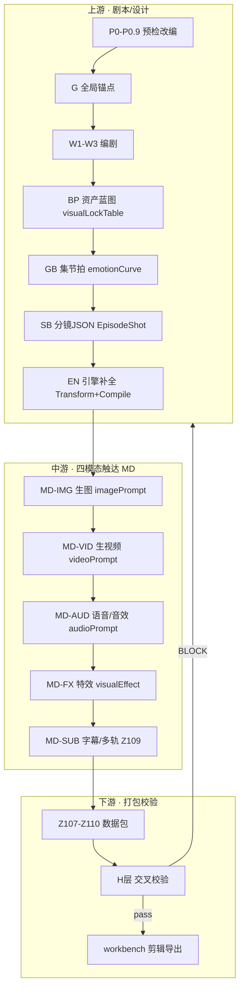


| 阶段      | 代码/Skill                                   | 规则层                   | 关键产出                             |
| ------- | ------------------------------------------ | --------------------- | -------------------------------- |
| P0-P0.9 | `adaptation_execution_*`                   | P1-P18                | planData.preCheck…reinforcement  |
| G       | `browser_flow` G 段                         | G1-G5                 | globalAnchors                    |
| W1-W3   | `script_execution_*`                       | W1-W46 + W层16条        | script + designBrief             |
| BP      | **新建** `production_execution_blueprint.md` | D1-D12, V4-V6         | visualLockTable                  |
| GB      | `production_execution_director_plan.md`    | B1-B12, W1-W10        | scriptPlan + episodeBeat         |
| SB      | `production_execution_storyboard_table.md` | V/M/S/I/X             | EpisodeShot[] 扩展字段               |
| EN      | RuleEngine Transform+Compile               | B/Y 映射                | PromptIR + compiled prompts      |
| MD-IMG  | **新建** `modality_image.md`                 | Y1-Y9, Z1-Z11, V2/V3  | imagePrompt                      |
| MD-VID  | **新建** `modality_video.md`                 | Y10, V65-V68, QF-VIEW | videoPrompt                      |
| MD-AUD  | **新建** `modality_audio.md`                 | Y59-Y74, V74/V76, AG  | audioPrompt + TTS                |
| MD-FX   | **新建** `modality_effects.md`               | V77, Z12              | visualEffect 字段                  |
| Z       | exportPackage                              | Z107-Z110             | 单集数据包                            |
| H       | validate                                   | H1-H10, H3-H5         | ValidationReport + rollbackLayer |


### 2. 三档交付（质量递进）


| 档位          | 名称                 | 外部 Skill 范围                 | 内部补全                                  | 适用               |
| ----------- | ------------------ | --------------------------- | ------------------------------------- | ---------------- |
| **T1 剧本包**  | ScriptBundle       | P→W→designBrief             | import → autoDesign(GB→SB→EN) → MD 内部 | 默认浏览器 Chat       |
| **T2 设计包**  | EpisodeBundle-lite | + BP/GB/SB/EN 外部分镜          | importBundle → MD 内部触达                | 外部分镜已完成          |
| **T3 全模态包** | EpisodeBundle-full | + MD 四模态 prompt + Z107-Z110 | importBundle 直落库 → validate → 生图/视/音  | 外部全流程或 Cursor 深度 |


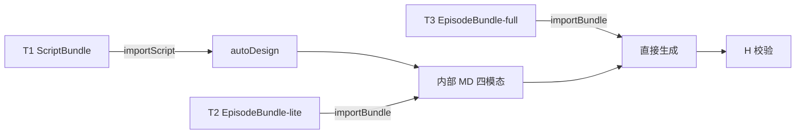


### 3. Skill 文件体系（目录架构）

```
data/skills/
├── browser_chat/                    # 外部多文件套件（yarn 生成）
│   ├── 00_index.md                  # 主编排（三档路径分支）
│   ├── manifest.json
│   ├── stages/                      # P/G/W 阶段（T1）
│   ├── production/                  # T2/T3 扩展（新增）
│   │   ├── BP_blueprint.md
│   │   ├── GB_director_plan.md      # 摘要+规则，细则 read 源 skill
│   │   ├── SB_storyboard_table.md
│   │   ├── EN_engine_complete.md    # Transform 字段补全说明
│   │   ├── MD_image.md              # 生图规则+模板
│   │   ├── MD_video.md
│   │   ├── MD_audio.md
│   │   ├── MD_effects.md
│   │   └── MD_workbench.md          # 剪辑/多轨 Z109
│   ├── rules/
│   │   ├── rule_cards.json
│   │   ├── checklists_pgw.md
│   │   ├── checklists_linkage.md
│   │   ├── checklists_production.md # V/M/S/D/I/X 分镜规则
│   │   └── checklists_modality.md   # Y/Z/AG/H5 四模态规则
│   └── output/
│       ├── script_bundle_schema.md
│       └── episode_bundle_schema.md # 含 generation 层
│
├── adaptation_execution_*.md        # P 阶段源（内部+外部共用源）
├── script_execution_*.md            # W 阶段源
├── production_execution_*.md        # GB/SB/EN/Gen 源（内部 Agent）
├── production_execution_blueprint.md # BP 源（新建）
├── production_execution_modality_*.md # MD 四模态源（新建 ×4）
├── production_skills/               # 技法（分镜表/提示词）
├── art_skills/{style}/              # 风格专属 prompt 规则
└── story_skills/{genre}/            # 叙事专属规则
```

**懒加载对齐**：内部 `read_skill_file` ↔ 外部 `@production/MD_image.md`；风格层 `@art_skills/2D_chinese_guofeng/...`

### 4. 四模态触达 · 外部规则实现（T3 专项）

每条模态 skill 采用统一结构：**工具说明 → 输入字段 → prompt 模板 → L2 规则卡片 → L4 audit**

#### MD-IMG 生图（`modality_image.md`）


| 规则组      | 规则 ID        | implLevel  | passCriteria                                |
| -------- | ------------ | ---------- | ------------------------------------------- |
| 类型限制     | V2/V3        | checklist  | PURE-SCENE 含 no people；PURE-PROP 含 --ar 1:1 |
| 资产引用     | V4/V5/V6, Y8 | structured | assetCodes 含 CHAR/SCENE/PROP-CODE           |
| 情绪词      | Y3/Y9        | checklist  | emotionIntensity N → 对应强度词                  |
| 光线/景别/色调 | Y4/Y5/Y6     | checklist  | lighting/shotType/colorTone 出现在 prompt      |
| 质量/比例    | Z1/Z6-Z9     | checklist  | 9:16、质量词、背景控制                               |
| 一致性      | Z3/Z4/Z5     | structured | 同 CODE 的 --cref/--sref 一致                   |


**imagePrompt 固定字段顺序**（来自规则引擎重构 §18，禁止漂移）：

```
[CHAR锚点] + [emotionIntensity词] + [shotType] + [主体动作] + [scene/colorTone/lighting] + [constraints] + [--ar 9:16]
```

#### MD-VID 生视频（`modality_video.md`）


| 规则组   | 规则 ID                | 外部实现                                |
| ----- | -------------------- | ----------------------------------- |
| 运动映射  | Y10, M6-M10          | camera 关键词在 videoPrompt 前 3–10 词    |
| 时长    | Y7, V76              | duration 数值出现在 prompt               |
| 视轴/朝向 | QF-VIEW              | orientation/spatialRelation 与上一镜连贯  |
| 脱钩表演  | H3-4, decoupleDesign | 说A做B 时 focus on hands               |
| 特效入口  | V77                  | visualEffect 有值 → transitionType 建议 |


**videoPrompt 模板**：

```
[camera运动], [shotType], [主体动作], [环境变化], [情绪氛围], [Ns duration]
```

#### MD-AUD 语音/音效（`modality_audio.md`）


| 规则组   | 规则 ID          | 外部实现                            |
| ----- | -------------- | ------------------------------- |
| 台词→交付 | Y59-Y65, B3/B4 | 快速短句/慢速重音/脱钩 → audioPrompt 强化词  |
| 语速    | V74, L6.voice  | 愤怒 4字/s vs 悲伤 2字/s              |
| 时长公式  | V76            | duration ≥ 字数/语速 + 停顿 + 动作 + 1s |
| 多轨    | Z109           | dialogue/sfx/bgm 分轨 + 时间戳       |
| 厂商策略  | AG-AUD         | agnes/wan 等 TTS 模板分支            |


**audioPrompt 模板**（示例3.txt §3.5.3）：

```
[交付方式：慢速重音/快速/发抖] + [BGM情绪] + [音效] + [留白Ns]
```

#### MD-FX 特效（`modality_effects.md`）


| 规则组   | 规则 ID           | 外部实现                           |
| ----- | --------------- | ------------------------------ |
| 特效字段  | V77, Z12        | visualEffect 枚举 + 与 emotion 对齐 |
| 爆发点强化 | H1-1~H1-3       | 爆发点 → 慢放+特写+弦乐（写入 video+audio） |
| 禁止堆砌  | art_skills R 规则 | 特效服务叙事，禁止无意义粒子堆叠               |


### 5. EpisodeShot 扩展字段（SB 阶段必填，触达前置）

来自 `[规则引擎架构重构` plan §16.3](plan/规则引擎架构重构_00e6d84c.plan.md)：


| 字段                        | 规则      | 触达             |
| ------------------------- | ------- | -------------- |
| `type`                    | V1      | 图              |
| `emotionIntensity`        | 1-7     | 图/视/音          |
| `rhythmZone`              | B10/I1  | 视              |
| `visualEffect`            | V77/Z12 | 特效             |
| `propState`               | V11/D3  | 图/视            |
| `decoupleDesign`          | H3-4    | 视              |
| `dialogue.type/character` | AG-AUD  | 音              |
| `duration`                | V76     | 视/音（SB 阶段公式计算） |


外部 T2/T3：`SB_storyboard_table.md` 须强制输出含上述字段的 JSON 数组，而非仅 Markdown 表。

### 6. EpisodeBundle-full 契约（T3 输出）

```json
{
  "bundleType": "episode",
  "flowData": { "script", "scriptPlan", "storyboardTable", "storyboard": [...] },
  "package": {
    "episodeBeat": { "emotionCurve", "markers" },
    "visualLockTable": { "characterAssets", "sceneColorLock", "anchorProps" },
    "shots": [{
      "narrative": { "type", "emotionIntensity", "duration", "dialogue", "visualEffect", ... },
      "generation": {
        "imagePrompt": "...",
        "videoPrompt": "...",
        "audioPrompt": "...",
        "compiled": { "image", "video", "audio" }
      }
    }]
  },
  "modalityAudit": {
    "IMG": { "passed": true, "checked": ["Y9","Z9","V2"] },
    "VID": { "passed": true, "checked": ["Y10","Y7"] },
    "AUD": { "passed": true, "checked": ["Y59","V74"] },
    "FX":  { "passed": true, "checked": ["V77"] }
  },
  "ruleAudit": { ... }
}
```

### 7. H 层质量反馈 → Skill 回滚映射


| H 失败           | rollbackLayer | 重跑 Skill / 文件                                 |
| -------------- | ------------- | --------------------------------------------- |
| H2-1 情绪曲线      | GB            | `GB_director_plan.md` / autoDesign GB         |
| H3-5 信息悬浮      | W/SB          | `W3_script.md` 补锚点 / `SB_storyboard_table.md` |
| H4-11 道具僵化     | D/BP          | `BP_blueprint.md` 增 propState                 |
| H5-1 提示词缺失     | Y/EN          | `MD_image.md` / `EN_engine_complete.md`       |
| H5-3 audio 不完整 | AUD           | `MD_audio.md`                                 |
| V77 特效         | FX            | `MD_effects.md`                               |


写入 `00_index.md` 与 `browser_flow_orchestration.md`：**校验 BLOCK 时按上表回到对应 stage 文件修订**。

### 8. 内部 vs 外部 · 全阶段矩阵


| 阶段     | 内部执行                              | 外部 T1        | 外部 T2                   | 外部 T3                 |
| ------ | --------------------------------- | ------------ | ----------------------- | --------------------- |
| P+W    | scriptAgent                       | stages/*     | 同 T1                    | 同 T1                  |
| BP     | 待建 API/Agent                      | —            | production/BP           | production/BP         |
| GB→EN  | autoDesign / productionAgent      | designBrief  | production/GB-SB-EN     | 同 T2                  |
| MD 四模态 | workbench routes + promptCompiler | —            | —                       | production/MD_*       |
| 校验     | RuleEngine validate               | ruleAudit 自检 | + checklists_production | + modalityAudit       |
| 生成     | generate_storyboard_images 等      | —            | —                       | 用户外部 API 或 import 后内部 |


### 9. extract 脚本扩展（全链路 rule_cards）

`rule_cards.json` 按 `pipelineStage` 索引：


| pipelineStage     | 规则层                   | 卡片数（约） |
| ----------------- | --------------------- | ------ |
| P/G/W             | 主流程 + W层              | ~85    |
| BP                | D + V4-V6             | ~20    |
| GB/SB             | B + V + M + S + I + X | ~80    |
| EN                | B + Y 映射              | ~30    |
| MD-IMG/VID/AUD/FX | Y + Z + AG + H5       | ~40    |
| H                 | H1-H10                | ~10    |


输出额外文件：`checklists_production.md`、`checklists_modality.md`、`rule_stage_index.json`（含 pipelineStage 维度）。

### 10. 与现有代码衔接


| 已有                                                                                             | 本方案增强                                      |
| ---------------------------------------------------------------------------------------------- | ------------------------------------------ |
| `[promptCompiler.ts](src/ruleEngine/compilers/promptCompiler.ts)` buildImageIR/VideoIR/AudioIR | EN 阶段规则来源；外部 MD skill 模板与 IR 字段对齐          |
| `[production_agent_decision.md](data/skills/production_agent_decision.md)` 六阶段                 | 扩展为 BP + MD 四模态（后期 Agent 挂接）               |
| `[importAdapter.ts](src/ruleEngine/bundle/importAdapter.ts)`                                   | 支持 EpisodeBundle-full 的 shots[].generation |
| `[autoDesign.ts](src/ruleEngine/bundle/autoDesign.ts)`                                         | 读 designBrief + visualLockTable 草案         |
| art/story_skills                                                                               | 外部 T3 生图时 `@art_skills/{projectStyle}/`    |


---

## 角色智能设计 / 资产 / 图锚点 & 设计阶段细化

> 对照 [`规则引擎架构重构_00e6d84c.plan.md`](plan/规则引擎架构重构_00e6d84c.plan.md) §16 / P0-B 与 [`设计改版闭环规划_49add52f.plan.md`](plan/设计改版闭环规划_49add52f.plan.md) G8-G9 / I8。

### 现状：计划里有什么、还缺什么

| 主题 | 已有（计划/代码） | 缺口 |
|------|------------------|------|
| **G 全局锚点** | G1-G5、`continuity.anchors` | 与 BP visualLockTable **未打通**；两源冲突无 merge |
| **designBrief** | arcToneMap / visualLockHints | 非结构化 L0-L6；无 CHAR-CODE |
| **BP 资产蓝图** | `production_execution_blueprint.md` 待建 | **无细则**：L0-L6 / sceneColorLock / anchorProps |
| **角色智能设计** | art_skills L0-L5 在 `art_character*.md` | 外部 bundle **无角色设计阶段**；W93 仅附录 G 摘要 |
| **资产流水线** | 内部 `derive_assets` / `generate_assets` | 外部 **无 AS 阶段**；无 assetGapReport |
| **图锚点** | 附录 E 五维表提及 `--cref/--sref` | 无 **锚点漂移 H5-4**、无 compiled/polished 双轨 |
| **T1 默认路径** | autoDesign GB→SB→EN | **跳过 BP**，色温/道具/角色 CODE 全靠 heuristic |
| **设计子阶段** | GB/SB/EN 单层 | 缺 SB 三子阶段、EN 三子阶段、MD 首位帧 |

### 1. 角色智能设计（Character Intelligent Design）

#### 1.1 阶段定位：**CD**（Character Design，W3 后、BP 前或 BP 内嵌）

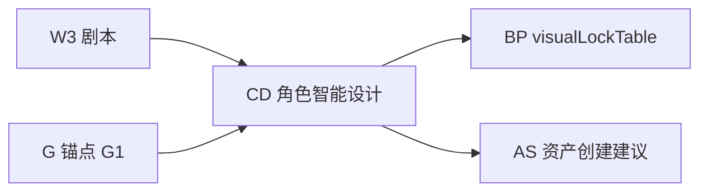

| 子步 | 输入 | 产出 | 规则 |
|------|------|------|------|
| CD-1 角色清单 | script.characters + G1 人物锚点 | 角色表 + 弧光阶段 | W1/W21, G1, B9 |
| CD-2 L0-L6 草案 | 剧本 + arcToneMap | 每角色 L0-L6 JSON | D1-D12, S5-S9 |
| CD-3 服色/裂缝 | 场次 + 情绪曲线 | arcStages + crackMarkers | W8, B5 |
| CD-4 音色映射 | L6.personality | voice.speed / voiceId 建议 | V74, Y59 |
| CD-5 衍生预判 | 换装/变身场次 | deriveHints[] | derive_assets 规则 |

**L0-L6 结构**（对齐规则引擎 §16.3 + art_character）：

```json
{
  "characterAssets": [{
    "code": "CHAR-PEIQINGWU",
    "name": "裴青梧",
    "L0": { "identity": "庶女", "age": "16" },
    "L1": { "face": "...", "body": "..." },
    "L2": { "hair": "...", "makeup": "..." },
    "L3": { "costume": "月白寝衣" },
    "L4": { "accessory": "..." },
    "L5": { "crackMarker": "认命期·眼神空洞" },
    "L6": {
      "voice": { "speed": 3.0, "tone": "短句/无语气词" },
      "arcStages": ["认命期", "觉醒期", "反击期"]
    }
  }]
}
```

**外部 T1**：CD 轻量版 — 只输出 `designBrief.arcToneMap` + `characters[]` + `deriveHints`（不要求完整 L0-L6）。  
**外部 T2/T3**：完整 CD → 写入 `visualLockTable.characterAssets` + EpisodeBundle。

**新建文件**：
- [`production_execution_character_design.md`](data/skills/production_execution_character_design.md) — CD 源 skill
- [`browser_chat/production/CD_character_design.md`](data/skills/browser_chat/production/CD_character_design.md) — 外部摘要
- 附录 G 扩展：**W93-W100 角色/弧光增强**（爆点不足 → 补 arcStage；节奏拖沓 → 调整 L6.voice）

#### 1.2 与 art_skills 联动

| 项目风格 | 读取路径 | 用途 |
|----------|----------|------|
| `projectStyle` | `@art_skills/{style}/art_prompt/art_character.md` | L0-L3 定妆 prompt |
| 衍生 | `art_character_derivative.md` | 换装/变身衍生 desc |
| 场景 | `art_scene.md` / `art_scene_derivative.md` | sceneColorLock 基准 |

manifest.json 增加：`art_skills/{projectStyle}/` 可选 @ 引用；bundle §6 声明「生图前必须读项目风格 art_character」。

### 2. 资产阶段（AS · Asset Pipeline）

内部已有 [`production_execution_derive_assets.md`](data/skills/production_execution_derive_assets.md) + [`generate_assets.md`](data/skills/production_execution_generate_assets.md)，计划 **补 AS 为显式流水线阶段**：

```
AS-1 extractAssets   从 script 抽角色/场景/道具名
AS-2 assetGapReport  对比 o_assets / ScriptBundle.characters → WARN 缺失
AS-3 assetSuggest    批量「是否创建资产」确认（I8）
AS-4 deriveAssets    角色变身/场景时间变体（规则同 derive skill）
AS-5 genAssetImages  定妆图（外部 T3 用户自调 API；内部 generate_assets_images）
AS-6 assignCodes     CHAR-/SCENE-/PROP-CODE 写入 BP
```

**ScriptBundle 扩展**：

```json
{
  "assetPipeline": {
    "extracted": { "characters": [], "scenes": [], "props": [] },
    "gapReport": { "missing": ["宫门"], "severity": "WARN" },
    "deriveHints": [{ "parent": "裴青梧", "variant": "战斗服", "reason": "第三场换装" }],
    "codes": { "裴青梧": "CHAR-PEIQINGWU", "寝殿": "SCENE-BEDROOM" }
  }
}
```

**首集 bootstrap（G9）**：无 G 锚点 / 无 blueprint 时，import 后从 script + assetPipeline 生成 `scriptMeta` + 建议 anchors + 最小 visualLockTable 草案。

**T1 边界**：外部只产 extract + gapReport + deriveHints；**内部 import 后**跑 AS-4→AS-6（或用户确认创建）。

### 3. 图锚点体系（Image Anchor System）

#### 3.1 三层锚点模型

| 层 | 字段 | 来源 | 触达 |
|----|------|------|------|
| **叙事锚点** | G1-G5, continuity.characterState | planData / ScriptBundle | designBrief, GB 情绪 |
| **视觉锁定** | visualLockTable | BP | SB refs, EN compile |
| **生成锚点** | --cref / --sref / aspectRatio | EN → MD-IMG | 生图 API |

#### 3.2 visualLockTable 完整结构（BP 核心产出）

```json
{
  "visualLockTable": {
    "characterAssets": [ "见 CD L0-L6" ],
    "sceneColorLock": [{
      "code": "SCENE-BEDROOM",
      "name": "寝殿",
      "colorTemp": "4500K",
      "tone": "暖黄烛火",
      "lightQuality": "soft"
    }],
    "anchorProps": [{
      "code": "PROP-LETTER",
      "name": "未燃尽纸条",
      "states": ["完好", "半燃", "灰烬"],
      "defaultState": "半燃",
      "sceneBindings": [{ "scene": "寝殿", "state": "半燃" }]
    }]
  }
}
```

#### 3.3 镜级锚点字段（SB 扩展，T2+ 必填）

| SB 字段 | 来源 | 规则 |
|---------|------|------|
| `charCodes[]` | BP | V4, Y8 |
| `sceneCode` | BP.sceneColorLock | V7, Y6 |
| `propCodes[]` + `propState` | BP.anchorProps | V11, D3 |
| `arcStage` | L6.arcStages | Y21-Y26 |
| `imageRefs.--cref` / `--sref` | 资产图 URL | V72, Z3-Z5 |
| `visualEffect` | 特效词 | V77 |

#### 3.4 锚点保护与漂移（EN / MD）

| 机制 | 说明 | 落点 |
|------|------|------|
| **compiled / polished 双轨** | compile 后 immutable token 列表 | promptCompiler + 规则引擎 §3.2 |
| **H5-4 漂移检测** | polished 不得改 cref/情绪/时长/type | validate + MD skill 红线 |
| **H5-4b 回退** | 漂移 → 回退 compiledPrompt | generationFeedback |
| **资产图陈旧** | BP 更新 → 标记镜级 stale → 强制重编译 | 规则引擎 P1 资产双管线 |

**bundle 附录 H · 图锚点规范**：锚点类型表、immutable 字段清单、SB→EN→MD 传递示例、常见 BLOCK（cref 缺失/色温冲突/道具状态断裂）。

### 4. 设计阶段细化（原先未单列的子阶段）

#### 4.1 完整阶段表（含新增 AS / CD / 子阶段）

| 阶段 | 子阶段 | 负责 Skill | 关键边界 |
|------|--------|------------|----------|
| **N-1** | 小说清洗 | adaptation N-1 规则 | 改编路径可选；原创跳过 |
| **A** | ScriptMeta | import 侧车 | title/characters/scenes 落库 |
| **P→W** | … | 已有 | — |
| **G** | G1-G5 | browser G 段 | 项目级，跨集 |
| **CD** | CD-1~5 | **新建** character_design | W3 后；T1 轻量 |
| **AS** | AS-1~6 | derive + extract 升级 | T1 外部 extract；内部 derive |
| **BP** | BP-1 visualLock | **新建** blueprint | **不得写分镜** |
| **GB** | GB-1 scriptPlan | director_plan | **禁光影/色温词**（C3） |
| **SB** | SB-1 表 / SB-2 面板 / SB-3 出图 | storyboard_table / panel / gen | 表→面板→首位帧 |
| **EN** | EN-1 Transform / EN-2 Compile / EN-3 Polish | RuleEngine + art_skills | Polish 保护锚点 |
| **MD** | IMG→VID→AUD→FX→SUB | modality_* ×4 | MODE-AGNES 首位帧 |
| **Z/H** | 打包校验 | export + validate | BLOCK→回滚 |

#### 4.2 关键阶段边界（易混，写入 bundle §0）

| 边界 ID | 规则 | 原因 |
|---------|------|------|
| **C3** | GB/SB narrative **禁**光影色温；EN 从 sceneColorLock **推导** | director_plan 红线 vs BP 色温职责 |
| **C4** | BP **禁** shot 级字段；SB **禁**改 L0-L6 | 层级不越权 |
| **C5** | 剧本 △ **可**写氛围；分镜画面描述 **禁**重复色温 | W vs SB 分工 |
| **C6** | T1 import 无 BP 时，autoDesign **必须**从 designBrief 合成最小 visualLockTable | 避免 GB heuristic 裸奔 |

#### 4.3 T1 内部 BP bootstrap（autoDesign 增强）

当 ScriptBundle **无** `visualLockTable` 时：

```
designBrief.visualLockHints + characters + scenes
  → 合成 sceneColorLock（解析 4500K 等）
  → 合成 characterAssets L3/L6 最小集
  → 写入 episodePackage.meta.visualLockDraft
  → GB/SB/EN 消费
```

对应 [`autoDesign.ts`](src/ruleEngine/bundle/autoDesign.ts) 增强项（与 planData-schema todo 合并）。

#### 4.4 SB 三子阶段（内部 Agent 已有，外部 T2 需对齐）

| 子阶段 | Skill | 产出 |
|--------|-------|------|
| SB-1 | `production_execution_storyboard_table.md` | EpisodeShot[] JSON |
| SB-2 | `production_execution_storyboard_panel.md` | 面板分组/associateAssetIds |
| SB-3 | `production_execution_storyboard_gen.md` | shouldGenerateImage + 首位帧 |

外部 T2：至少完成 SB-1；T3：SB-1 + generation 字段。

### 5. Schema 汇总（新增字段）

ScriptBundle / EpisodeBundle 在已有 `designBrief` / `smartDetection` / `fixPlan` 基础上增加：

```typescript
assetPipeline?: { extracted, gapReport, deriveHints, codes };
visualLockTable?: { characterAssets, sceneColorLock, anchorProps }; // T2+
characterDesign?: { arcStages, deriveHints, l6VoiceMap };          // T1 轻量 CD
```

importAdapter：T2+ 写入 `o_projectBlueprint` + merge `visualLockTable`；T1 写 visualLockDraft 到 episode meta。

### 6. 验收补充（G13-G16）

| # | 验收 |
|---|------|
| G13 | T1 ScriptBundle 含 characters + designBrief.arcToneMap + assetPipeline.extracted |
| G14 | T2 EpisodeBundle 含完整 visualLockTable + SB 镜级 charCodes/sceneCode |
| G15 | EN imagePrompt 含 Y4/Y6/Y8 + --cref 与 assetCodes 一致 |
| G16 | assetGapReport：script 角色 vs 库内 assets diff 可输出 WARN |

### 7. browser_full_flow.bundle 新增/扩展

```
§5.6  角色智能设计 CD（T1 轻量 / T2 完整）
§5.7  资产流水线 AS + assetGapReport
§5.8  图锚点三层模型 + immutable 清单
附录 H  图锚点与 visualLockTable 规范
附录 A  扩展：CD + AS 插入 BP 之前
production/CD_character_design.md
production/AS_asset_pipeline.md
```

---

## 规则分层策略（回答：257 条要不要整理进外部？）

**结论：要整理，按三档交付分阶段纳入，T3 覆盖全链路 257 条。**

### 为什么「不入库外部无法完善」？

外部 Chat 默认只产出 **ScriptBundle（剧本）**，不做分镜面板。规则按**适用阶段**分三档：


| 档位                  | 规则来源                                  | 适用阶段                  | 是否必须进 bundle | 不入库后果              |
| ------------------- | ------------------------------------- | --------------------- | ------------ | ------------------ |
| **A · 剧本/analysis** | `[主流程.txt](主流程.txt)` P/G/W（~69 条概念规则） | 外部 P0→W3              | **必须**       | 预检/骨架/剧本质量无标准，输出随机 |
| **B · 设计/分镜**       | B/V/M/S/I/X/D + BP/GB/SB              | T2 EpisodeBundle-lite | **T2 必须**    | 外部分镜模式             |
| **C · 四模态**         | Y/Z/AG/H5 + MD 规则                     | T3 EpisodeBundle-full | **T3 必须**    | 生图/视/音/特效质量        |
| **D · 权威判定**        | RuleEngine validate                   | import 后              | 不进 bundle    | RulePanel 终审       |


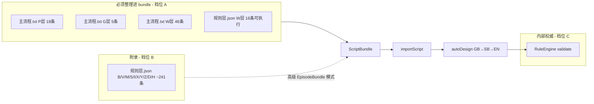


### 关键澄清

1. **外部不是「不完善」**，而是**职责边界不同**：
  - 外部负责：P+G+W 智能分析 + 剧本 + planData → **这部分规则必须整理进 bundle**
  - 内部负责：GB→SB→EN 分镜设计 + 257 条机器校验 → **import 后自动补全**
2. **P/G 规则不在 `规则层.json`**：目前 JSON 只有 V/M/S/W/I/X/Y/Z/B/D/H 共 257 条；P/G 定义在 `[主流程.txt](主流程.txt)`。extract 脚本需**双源合并**。
3. **W 层双源对齐**：主流程 W1–W46（概念/流程规则）+ 规则层 W层 16 条（可执行检查逻辑，`完善后内容` 字段）合并为一份 W 自检清单，规则 ID 保持一致。
4. **257 条全量**：不塞进主 bundle 正文（token 爆炸），而是：
  - **正文 §6**：P+G+W 全量自检（~69+16 条，分阶段挂载）
  - **附录 B**：从 `规则层.json` 自动生成 GB/SB/EN/V/M/S/Y/Z/H 自检清单，供 `[production_external_revision.md](data/skills/production_external_revision.md)` 高级 EpisodeBundle 模式引用
5. **内部 validate 现状**：注册 257 条，实际执行 ~5–8 条（Tier-0 + dialogueFidelity + modeAgnes）。外部嵌入规则的价值是**生成阶段引导**，不是替代机器校验。后续 RuleEngine 落地更多 validator 时，bundle 通过 `yarn bundle:browser-full-flow` 一键同步 `规则层.json` 更新。

### 设计联动规范：外部也需要，且规范已存在

用户关切：**外部 Chat 也需要设计联动（B 层转化桥、层间一致性、情绪→视听映射等），这些规则/规范有没有？要不要整理进 bundle？**

**答案：有，且必须整理进 bundle——但分「设计意图 brief」与「完整分镜设计」两档。**

#### 规范来源（已存在，目前分散）


| 来源                                                                                           | 内容                                       | 状态       |
| -------------------------------------------------------------------------------------------- | ---------------------------------------- | -------- |
| `[主流程.txt](主流程.txt)` §3.4                                                                    | B层 B1–B12：情绪→景别/时长、台词→情绪/表演、弧光→语气、三幕→节奏  | 概念完整     |
| `[规则层.json](规则层.json)` `B层_转化桥`                                                              | B1–B11 可执行 `完善后内容`（台词→情绪推导、信息揭示→视觉焦点联动等） | 可提取      |
| `[规则层.json](规则层.json)` `H层` H1                                                               | 层间一致性：W→B→V→M/S→X/I/Y→D→Z 数据流追踪          | 联动总纲     |
| `[规则层.json](规则层.json)` `交叉规则联动表`                                                             | 7 条依赖链 + 6 级校验优先级                        | 结构化      |
| `[示例3.txt](示例3.txt)` §3.2–3.5                                                                | 信息联动链、台词→提示词映射表、B/V/M/S 自动生成输出项          | 格式模板     |
| `[design_flow.md](data/skills/design_flow.md)`                                               | GB scriptPlan + episodeBeat 结构           | 内部 GB 阶段 |
| `[production_execution_director_plan.md](data/skills/production_execution_director_plan.md)` | 导演规划方法论                                  | GB 执行细则  |


#### 外部两档设计联动

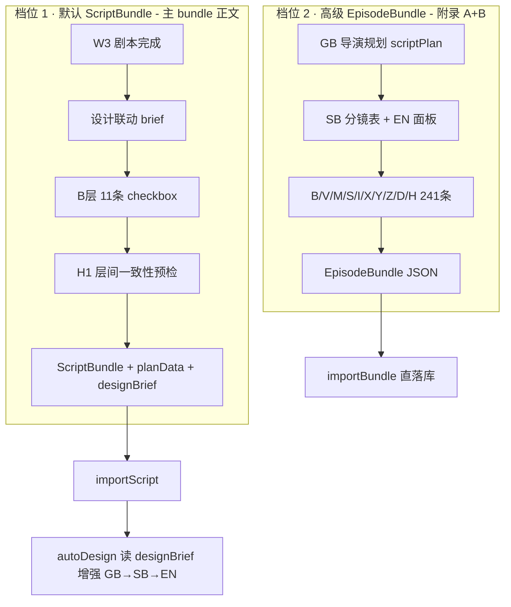


| 档位         | 外部做什么                              | 设计联动规则范围                       | 产出            |
| ---------- | ---------------------------------- | ------------------------------ | ------------- |
| **1 · 默认** | W3 后输出 **designBrief**（设计意图，非完整分镜） | B层 11 条 + H1 摘要 + G→anchors 联动 | ScriptBundle  |
| **2 · 高级** | 外部完成 GB→SB→EN                      | 附录 B 全量 241 条 + GB/SB/EN skill | EpisodeBundle |


**档位 1 的 designBrief**（新增 ScriptBundle 字段，import 后 autoDesign 读取）：

```json
{
  "designBrief": {
    "emotionCurveOutline": [4, 5, 6, 5, 7],
    "rhythmOutline": { "act1": "fast", "act2": "medium+slow", "act3": "slow+留白" },
    "infoLinkageChain": ["钩子：苏醒", "承接：认命", "引出：宫门对峙"],
    "arcToneMap": { "裴青梧": "认命期→短句/无语气词" },
    "visualLockHints": ["寝殿烛火 4500K", "月白服饰"],
    "paypointMarkers": [{ "position": "90%", "type": "身份差" }],
    "sceneTransitionPlan": [{ "from": "寝殿", "to": "宫门", "reason": "情绪/空间" }]
  }
}
```

对应内部 `[autoDesign.ts](src/ruleEngine/bundle/autoDesign.ts)` 增强：优先读 `designBrief.emotionCurveOutline` 构造 scriptPlan，而非纯 heuristic 推断。

#### 主 bundle 新增 §5.5「设计联动规范」


| 小节              | 来源                    | 内容                                                           |
| --------------- | --------------------- | ------------------------------------------------------------ |
| B层转化桥 checklist | 规则层.json B1–B11       | 11 条 checkbox，W3 输出 script 前 + 最终 JSON 前各跑一遍                 |
| 层间联动预检 H1       | 规则层.json H1 + 交叉规则联动表 | W→B→designBrief 字段必须有来源（emotion 来自 W 情绪高点，visual 来自 G 锚点）    |
| 信息联动链模板         | 示例3.txt §3.2          | 每集信息因果锁链格式                                                   |
| G→B→anchors 联动  | 主流程 G1–G5 + B9        | globalAnchors 必须映射到 designBrief.arcToneMap / visualLockHints |
| 反馈回路说明          | 主流程 §反馈回路             | 告知用户 import 后 H 层 BLOCK 会回滚到哪一层（H2→GB, H3→SB）                |


W3 阶段末尾新增一步：**「设计联动 brief 生成」**——不要求外部分镜，但要求把 B 层转化逻辑的前置意图写入 `designBrief`，供 import 后 autoDesign 精准 GB→SB→EN。

#### 附录 B 扩展（高级模式才启用）

- GB/SB/EN 完整 skill 摘要（来自 `production_execution_`* + `design_flow.md`）
- B/V/M/S/I/X/Y/Z/D/H 241 条全量 checkbox
- 台词→image/video/audio 映射表（示例3.txt Y59–Y74）
- 交叉规则联动表 7 条依赖链

### 每阶段规则挂载点（写入 bundle 编排）


| 外部阶段     | 挂载规则                              | 自检时机                                 |
| -------- | --------------------------------- | ------------------------------------ |
| P0 预检    | P1–P18                            | 输出 `<preCheck>` 前                    |
| P0.3 矩阵  | P13–P18 + 矩阵维度                    | 输出 `<adaptationMatrix>` 前            |
| P0.6 核心  | W1–W5 摘要 + 故事核心边界                 | 输出 `<storyCore>` 前                   |
| P0.8/0.9 | P7 质量等级 + 六维度≥5                   | 输出 `<postCheck>`/`<reinforcement>` 前 |
| G 锚点     | G1–G5                             | 写入 planData.globalAnchors 前          |
| W1 骨架    | W1–W46 全文 + W层 JSON 16 条          | 输出 `<storySkeleton>` 前               |
| W2 策略    | W6–W15 + 改编 8 要点                  | 输出 `<adaptationStrategy>` 前          |
| W3 剧本    | W16–W46 + 台词保真/密度/钩子              | 输出 script 前                          |
| W3 设计联动  | B1–B11 + H1 层间预检 + designBrief 模板 | 输出 script 后、JSON 前                   |
| 最终 JSON  | 汇总上述全部 ✓ + designBrief 非空校验       | 输出 ScriptBundle 前                    |


---

## 交付物清单

### 1. 扩展源 Skill（内部维护用，bundle 从此合并）

从 `[主流程.txt](主流程.txt)` 第二节（步骤 0–0.9）展开 5 个 stub 文件，每个包含：输入/输出格式、六维度评分标准、边界条件、XML/Markdown 产出模板：


| 文件                                                                                     | 来源         | 产出标签                 |
| -------------------------------------------------------------------------------------- | ---------- | -------------------- |
| `[adaptation_execution_precheck.md](data/skills/adaptation_execution_precheck.md)`     | 主流程 §步骤0   | `<preCheck>`         |
| `[adaptation_execution_matrix.md](data/skills/adaptation_execution_matrix.md)`         | 主流程 §步骤0.3 | `<adaptationMatrix>` |
| `[adaptation_execution_story_core.md](data/skills/adaptation_execution_story_core.md)` | 主流程 §步骤0.6 | `<storyCore>`        |
| `[adaptation_execution_postcheck.md](data/skills/adaptation_execution_postcheck.md)`   | 主流程 §步骤0.8 | `<postCheck>`        |
| `[adaptation_execution_reinforce.md](data/skills/adaptation_execution_reinforce.md)`   | 主流程 §步骤0.9 | `<reinforcement>`    |


W 阶段直接复用已有完整 skill（无需重写）：

- `[script_execution_skeleton.md](data/skills/script_execution_skeleton.md)`
- `[script_execution_adaptation.md](data/skills/script_execution_adaptation.md)`
- `[script_execution_script.md](data/skills/script_execution_script.md)`

新增 `[browser_flow_orchestration.md](data/skills/browser_flow_orchestration.md)` 作为 bundle 合并的**主编排源文件**（frontmatter + 双路径流程表 + **V5/Browser Chat 双轨对照** + G 层锚点模板 + ScriptBundle 输出契约 + 红线），替代当前分散在 `design_flow.bundle.md` / `adaptation_flow.bundle.md` 的编排逻辑。

**Browser Chat 规则流程索引**（优化版 v2.0 新增）：

| 文件 | 说明 |
|------|------|
| [`data/fixtures/rule_flow_browser_chat.json`](data/fixtures/rule_flow_browser_chat.json) | 阶段→规则→产出→闸门 JSON（extract 同步生成） |
| [`data/skills/_generated/rule_stage_index.json`](data/skills/_generated/rule_stage_index.json) | pipelineStage 维度索引（含 internal/browser 双轨） |

### 1.5 ScriptBundle 优化版 v2.0.1 · 全字段 Schema 汇总

```typescript
// T1 必填核心
script, episodeKey, characters?, scenes?, provenance?
planData: { preCheck, adaptationMatrix, storyCore, postCheck, reinforcement, globalAnchors }
designBrief: { emotionCurveOutline, rhythmOutline, infoLinkageChain, arcToneMap, visualLockHints, ... }
ruleAudit: { stages: Record<stageId, { passed, blockers, checkedRuleIds[] }> }

// T1 必填 · 前期设计包（v2.0.1）
preDesignPack: { scriptPlan, shots[], externalHashCheck, preDesignQuality, sceneCodeMap? }  // T1 必填；Q16
linkageAudit?: { chains: LinkageChainStatus[] }
rePushPlan?: RePushPlanItem[]          // 反推重推；maxRounds=3
qualityDiagnostics?: { qpResults[], engagementScore, coverageAudit }
identityAudit?: { perShot[] }              // 多端性别/音色/cref 一致
fxFeasibilityAudit?: { items[] }            // 特效 AI 可实现性
narrativeCausalityGraph?: { nodes, edges, broken[] }
debutIntroPack?: { characters[], scenes[], props[] }
provenance?: { eventTrace?: EventTrace[] }        // Q17 novel 三级追溯

// 检测/修复/资产
smartDetection?, fixPlan?, linkageRepairPlan?
assetPipeline?, characterDesign?

// T2+ 扩展
visualLockTable?, generation?: { compiled? }   // EN 草案
modalityAudit?, ruleApplicationReport?         // T3

rulePackVersion: "2.0.1"
bundleVersion: "browser-chat-optimized"
```

### 2. 规则适配层（双源提取 → 分阶段自检清单）

新建 `[scripts/extract-rule-checklists.ts](scripts/extract-rule-checklists.ts)`（`yarn extract:rule-checklists`）：

**双源输入：**

- `[主流程.txt](主流程.txt)` §3.1 P层 + §3.2 G层 + §3.3 W层 → 概念规则 + 边界条件
- `[规则层.json](规则层.json)` `ruleDetailPlan.`* → 每条取 `完善后内容`（fallback `current`）作为可执行检查语句

**双文件 + 联动文件输出：**


| 输出文件                                                                                                                     | 内容                                 | 用途                    |
| ------------------------------------------------------------------------------------------------------------------------ | ---------------------------------- | --------------------- |
| `[data/skills/_generated/rule_checklists_pgw.md](data/skills/_generated/rule_checklists_pgw.md)`                         | P+G+W 全量，按阶段分组 + 规则 ID + checkbox  | 主 bundle §6 正文        |
| `[data/skills/_generated/rule_checklists_linkage.md](data/skills/_generated/rule_checklists_linkage.md)`                 | B层 11条 + H1 + 交叉规则联动表 7链 + 示例3 映射表 | 主 bundle §5.5 设计联动    |
| `[data/skills/_generated/rule_checklists_design_appendix.md](data/skills/_generated/rule_checklists_design_appendix.md)` | B/V/M/S/I/X/Y/Z/D/H 全量（去重 B 层）     | 附录 B，高级 EpisodeBundle |


**生成格式示例：**

```markdown
### P0 预检 · 规则自检
- [ ] **P1** 情绪支撑度 1–10 分，附评分理由（段落定位）
- [ ] **P7** 综合质量等级：优≥8 / 良≥6 / 中≥4 / 差<4
...
### W3 剧本 · 规则自检
- [ ] **W41** 每段对话形成因果链，步数≤2
- [ ] **R2** 台词保真：引号内原文零删改
```

**外部规则适配原则**（写入 bundle）：

- 规则 ID 与内部一致，双源 W 层去重合并
- 外部 LLM **逐条 checkbox 自检**，不调 validate API
- BLOCK 级（Tier-0 / 阶段卡点）必须全 ✓ 才能进入下一阶段
- 标注 `rulePackVersion: "2.0.0"`；`规则层.json` 更新后重跑 extract + bundle 同步

---

### 2.5 外部规则实现方案（剧本设计专项）

外部 Chat **会涉及完整剧本设计**（P 分析 → W1 骨架 → W2 策略 → W3 剧本 → designBrief 设计联动），不能只给 checkbox 清单，需要定义**每条规则在外部如何实现、如何判定、如何落字段**。

#### 实现分级（Rule Implementation Level）


| 级别         | 代号           | 外部实现方式                           | 适用规则                         | 产出                     |
| ---------- | ------------ | -------------------------------- | ---------------------------- | ---------------------- |
| **L1 指南**  | `guideline`  | 写入 skill 正文，LLM 生成时内化            | P 层方法论、骨架招式、改编 8 要点          | 自然语言产出                 |
| **L2 自检**  | `checklist`  | 阶段末尾跑 checkbox，BLOCK 不过不进入下一阶段   | P1–P18、G1–G5、W41–W46、R2 台词保真 | 对话内确认                  |
| **L3 结构化** | `structured` | 强制写入 planData / designBrief 指定字段 | W1–W16 曲线、B1–B11 联动、G 锚点     | JSON 字段                |
| **L4 审计**  | `audit`      | 汇总本阶段 L2/L3 结果写入 `ruleAudit`     | 每阶段结束                        | ScriptBundle.ruleAudit |


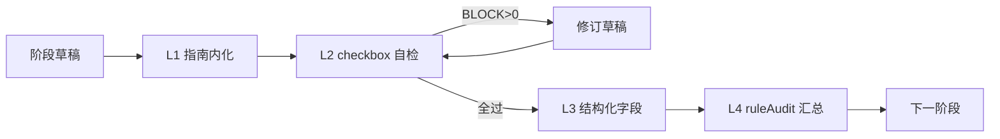


#### 规则卡片标准格式（extract 脚本核心产出）

新建 `[data/skills/_generated/rule_cards.json](data/skills/_generated/rule_cards.json)`，每条规则一张卡片：

```json
{
  "ruleId": "W12",
  "layer": "W",
  "stage": "W3",
  "implLevel": "checklist",
  "severity": "BLOCK",
  "title": "开篇钩子设计",
  "checkPrompt": "检查本集前 3 秒/第一场是否同时具备视觉悬念和情感悬念",
  "passCriteria": "第1场含视觉异常（道具/空间/动作）+ 情感异常（冲突/反差/关系张力）",
  "failAction": "修订第一场后再输出 script",
  "outputField": null,
  "sourceText": "规则层.json W12.完善后内容",
  "linkedRules": ["W13", "V2"]
}
```

extract 脚本从双源生成卡片：

- **P/G/W 概念规则** ← `主流程.txt`（implLevel 多为 guideline/checklist）
- **W/B 可执行规则** ← `规则层.json` 的 `完善后内容`（implLevel 多为 checklist/structured）
- **交叉联动** ← `交叉规则联动表`（implLevel=structured，outputField 指向 designBrief）

Markdown 清单（`rule_checklists_*.md`）从 `rule_cards.json` **渲染生成**，保证 ID 一致。

#### 剧本设计三阶段 · 外部规则挂载详表

##### W1 故事骨架（`stages/W1_skeleton.md`）


| 规则组  | 规则 ID     | implLevel  | 外部实现                                           |
| ---- | --------- | ---------- | ---------------------------------------------- |
| 结构门禁 | 骨架 XML 格式 | structured | 必须输出 `<storySkeleton>`，含故事核/三幕/分集/付费卡点/反转登记表   |
| 压缩比  | 全局删减      | checklist  | 压缩比 ≤40%，表格可量化                                 |
| 钩子   | 每集集末钩子    | checklist  | 分集表每行有「集末钩子」列且非空                               |
| 反转   | 股价级反转     | structured | 《股价级反转登记表》≈3 行，预埋集 < 揭晓集                       |
| 人物   | 大三角 ≤4 人  | checklist  | 人物小传 ≤4，主角五要素+金手指边界齐全                          |
| 曲线预设 | W16       | structured | 写入 `designBrief.emotionCurveType`（W型/陡坡/波浪/U型） |


##### W2 改编策略（`stages/W2_strategy.md`）


| 规则组   | 规则 ID      | 外部实现                     |
| ----- | ---------- | ------------------------ |
| 8 大要点 | 改编策略 skill | L1 指南 + L2 每条原则 checkbox |
| 删留决策  | 三大密度       | checklist                |
| 同质化   | 金手指/桥段     | BLOCK checklist          |
| 矛盾升级  | W36–W40    | checklist                |


##### W3 分集剧本（`stages/W3_script.md`）— **外部实现最细**

**Step 1 · 生成前读取**（从对话上下文 / planData）

- `storySkeleton` 本集行（戏剧功能/场景核心/钩子/删减）
- `adaptationStrategy` 核心原则
- `globalAnchors` G1–G5
- 上一集 script 末尾（衔接）

**Step 2 · 生成中内化（L1）**

- 三大密度、黄金单集公式、3-15-45 节奏、爆/虐/爽至少 1 个
- 展示不要告诉、台词保真、场标格式
- 来源：`[script_execution_script.md](data/skills/script_execution_script.md)` Skills 区

**Step 3 · 生成后自检（L2 BLOCK 项，不过不输出 JSON）**


| 类别     | 规则 ID     | passCriteria（外部可判）                      |
| ------ | --------- | --------------------------------------- |
| **格式** | FMT-1     | `<scriptItem name="...">` 包裹，name 与标题一致 |
| **格式** | FMT-2     | 场标 `{场号} {场景} {时间}/{内外}` 连续             |
| **台词** | R2        | 引号内台词与源材料一致，零删改                         |
| **时长** | W-TIME    | 正文 1000 字以内或项目时长×150字/分 ±10%            |
| **密度** | W-DEN-1   | 三大密度自检三项非「低」                            |
| **节奏** | W-RHY-345 | 前 3 秒冲击 / 15 秒变化 / 45 秒强期待（标注在剧情梗概）     |
| **钩子** | W12       | 第一场：视觉悬念 + 情感悬念                         |
| **钩子** | W13       | 最后一场：未回答问题（? / 会…吗 / …是谁）               |
| **情绪** | W6–W10    | 本集至少 1 个爆/虐/爽点（梗概中标注类型）                 |
| **公式** | W-GOLD    | 情节承接 + 冲突升级 + 价值转变 + 下集勾连（梗概 4 句）       |
| **因果** | W41–W46   | 每段对话有承接/引出，步数 ≤2                        |
| **衔接** | W-CONT    | 与上集角色状态/未解钩子一致（continuity）              |


**Step 4 · 设计标注（L3 structured → designBrief）**

W3 完成后**不要求写分镜**，但必须输出剧本级设计标注（供 import 后 GB 消费）：

```json
{
  "designBrief": {
    "emotionCurveOutline": [4, 3, 5, 6, 5, 7],
    "emotionCurveType": "W型",
    "rhythmOutline": { "act1": "fast", "act2": "medium", "act3": "slow+hook" },
    "sceneEmotions": [
      { "scene": "1-1 寝殿", "emotion": 4, "beat": "苏醒茫然" },
      { "scene": "1-2 宫门", "emotion": 6, "beat": "认命对峙" }
    ],
    "infoLinkageChain": ["视觉：苏醒", "信息：身份", "悬念：宫门何人"],
    "arcToneMap": { "裴青梧": "认命期·短句" },
    "paypointMarkers": [{ "position": "85%", "type": "情感暴击" }],
    "hookSlots": { "opening": "W12✓", "closing": "W13✓" }
  }
}
```

对应规则层 W1–W16 中**可在剧本阶段判定**的子集（曲线类型、开篇/结尾钩子、付费点对齐 W9、缓冲 W8 设计意图）。

**Step 5 · B 层设计联动自检（L2，W3_design_brief.md）**


| 规则 ID | 外部检查                                   |
| ----- | -------------------------------------- |
| B1    | emotionCurveOutline 与 sceneEmotions 一致 |
| B3    | 台词换角色测试：关键台词绑定主角背景                     |
| B7    | emotion 跳变 ≥3 处须有台词/动作变化               |
| B9    | arcToneMap 与 G1 角色灵魂锚点一致               |
| H1    | designBrief 每个字段能追溯到 W/G 产出            |


**Step 6 · 阶段审计（L4 → ruleAudit）**

ScriptBundle 新增可选字段：

```json
{
  "ruleAudit": {
    "rulePackVersion": "2.0.0",
    "stages": {
      "W3": {
        "passed": true,
        "blockCount": 0,
        "warnCount": 1,
        "checked": ["W12","W13","R2","W-DEN-1","B1","B7","H1"],
        "warnings": [{ "ruleId": "W8", "msg": "高情绪区段建议加缓冲场" }]
      }
    }
  }
}
```

import 时写入日志/可选持久化，RulePanel 可展示「外部自检已通过 N 条」。

#### 外部 vs 内部规则对照（剧本设计范围）


| 规则         | 外部实现                                 | 内部 validate           | 说明                        |
| ---------- | ------------------------------------ | --------------------- | ------------------------- |
| R2 台词保真    | L2 checklist + 源材料比对                 | dialogueFidelityGate  | 外部先检，内部权威                 |
| W12/W13 钩子 | L2 checklist + designBrief.hookSlots | V2/V3 Tier-0          | 外部在剧本阶段检                  |
| W1–W5 曲线   | L3 designBrief.emotionCurve*         | GB emotionCurve       | 外部给意图，内部 GB 展开            |
| B1–B11 联动  | L2 + L3 designBrief                  | Transform P1          | 外部 brief，内部 autoDesign 执行 |
| V/M/S/Y 视听 | 附录 B（高级模式）                           | validatePackage       | 默认 import 后补              |
| H1 层间一致    | L2 W3 末尾                             | buildValidationReport | 外部预检，内部终审                 |


#### 多文件套件中的规则落地

每个 `stages/*.md` 文件**末尾固定附**：

1. 本阶段 **L2 checklist**（从 rule_cards.json 按 stage 过滤渲染）
2. 本阶段 **L3 输出字段 schema**（若有）
3. **「阶段完成指令」**：跑完 checklist → 输出 ruleAudit 摘要 → 提示加载下一阶段文件

`rules/rule_cards.json` 随套件分发，供高级用户或脚本校验。

#### extract 脚本增强输出


| 文件                                   | 内容                                         |
| ------------------------------------ | ------------------------------------------ |
| `rule_cards.json`                    | 全量规则卡片（机器可读，含 implLevel/stage/outputField） |
| `rule_checklists_pgw.md`             | 从 cards 渲染的人类可读 checklist                  |
| `rule_checklists_linkage.md`         | B+H1+映射表                                   |
| `rule_checklists_design_appendix.md` | 高级分镜规则                                     |
| `rule_stage_index.json`              | stage → ruleId[] 索引，供 manifest 引用          |


新增 yarn script：`yarn extract:rule-checklists`

---

**可以。** 浏览器 Chat 支持多文件联动，计划采用 **双交付模式**，同源生成、内容一致：

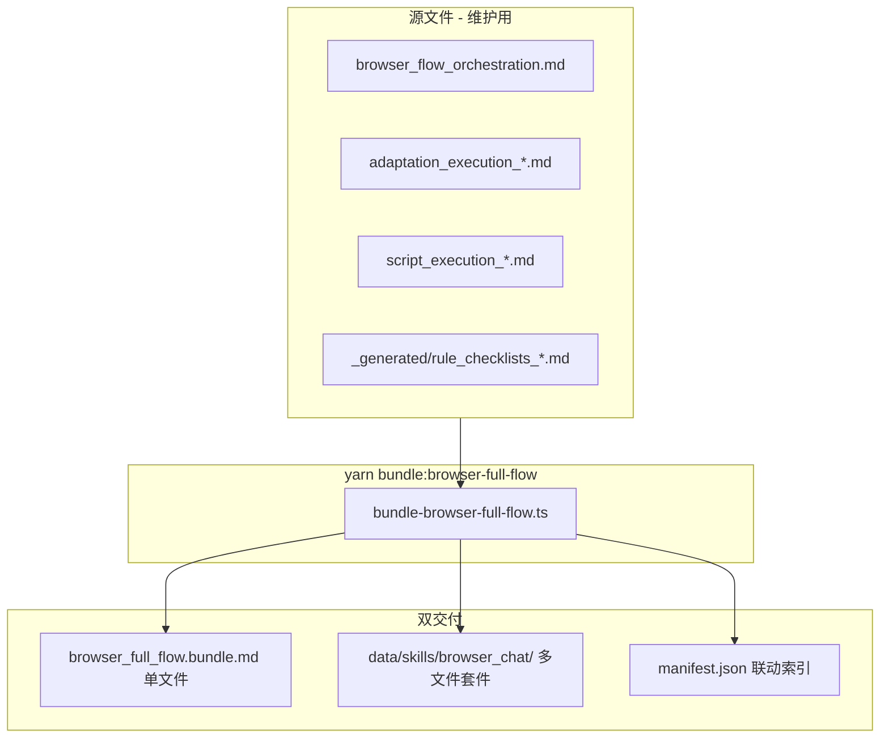


#### 模式 A · 单文件（简单用户）

- 输出：`[browser_full_flow.bundle.md](data/skills/browser_full_flow.bundle.md)`
- 用法：全文复制为 System Prompt，一次粘贴即可
- 适合：ChatGPT/Claude 普通对话、不想管理多文件的用户
- 缺点：体积大（~20k+ tokens），更新需整文件替换

#### 模式 B · 多文件套件（推荐 Cursor / Projects）

- 输出目录：`[data/skills/browser_chat/](data/skills/browser_chat/)`
- 用法：主编排作 System Prompt，各阶段按需 `@` 引用或上传 companion 文件
- 适合：**Cursor**（@ 多文件）、ChatGPT Projects、Claude Projects、Kimi 知识库
- 优点：分阶段加载省 token、改一个 stage 文件不影响其他、与内部 `read_skill_file` 模式对齐

**多文件套件结构：**

```
data/skills/browser_chat/
├── README.md                      # 多文件联动用法（3 种 Runner）
├── manifest.json                  # 阶段→文件映射 + 触发条件
├── 00_index.md                    # 主编排入口（System Prompt，含双路径流程）
├── stages/
│   ├── P0_precheck.md
│   ├── P03_matrix.md
│   ├── P06_story_core.md
│   ├── P08_postcheck.md
│   ├── P09_reinforce.md
│   ├── G_global_anchors.md
│   ├── W1_skeleton.md
│   ├── W2_strategy.md
│   ├── W3_script.md
│   └── W3_design_brief.md         # B层联动 + designBrief 生成
├── rules/
│   ├── checklists_pgw.md          # 从 _generated 复制
│   ├── checklists_linkage.md      # B+H1+映射表
│   └── checklists_design_appendix.md  # 高级模式
├── output/
│   ├── script_bundle_schema.md    # JSON 契约 + 样例
│   └── episode_bundle_schema.md   # 高级 EpisodeBundle
└── browser_full_flow.bundle.md    # 软链/副本：单文件合并版（与根目录同步）
```

**manifest.json 联动索引（机器可读 + UI 展示）：**

```json
{
  "kitVersion": "2.0.0",
  "rulePackVersion": "2.0.0",
  "entryFile": "00_index.md",
  "modes": ["single-file", "multi-file"],
  "stages": [
    { "id": "P0", "file": "stages/P0_precheck.md", "requires": [], "outputs": ["planData.preCheck"] },
    { "id": "P03", "file": "stages/P03_matrix.md", "requires": ["P0"], "outputs": ["planData.adaptationMatrix"] },
    { "id": "W3", "file": "stages/W3_script.md", "requires": ["W1","W2"], "outputs": ["script"] },
    { "id": "designBrief", "file": "stages/W3_design_brief.md", "requires": ["W3","G"], "outputs": ["designBrief"] },
    { "id": "output", "file": "output/script_bundle_schema.md", "requires": ["W3","designBrief"], "outputs": ["ScriptBundle JSON"] }
  ],
  "paths": {
    "adapt": ["P0","P03","P06","P08","P09","G","W1","W2","W3","designBrief","output"],
    "original": ["G","W3","designBrief","output"],
    "design_lite": ["...T1","BP","GB","SB","EN","output_episode_lite"],
    "design_full": ["...design_lite","MD_image","MD_video","MD_audio","MD_effects","MD_workbench","output_episode_full"]
  },
  "tiers": {
    "T1": { "output": "ScriptBundle", "pathKey": "adapt|original" },
    "T2": { "output": "EpisodeBundle-lite", "pathKey": "design_lite" },
    "T3": { "output": "EpisodeBundle-full", "pathKey": "design_full" }
  }
}
```

#### 三种 Runner 的多文件联动方式


| Runner                        | 联动方式   | 操作                                                                                            |
| ----------------------------- | ------ | --------------------------------------------------------------------------------------------- |
| **Cursor**                    | `@` 引用 | System Prompt = `00_index.md`；进入 P0 时 `@stages/P0_precheck.md`；可同时 `@rules/checklists_pgw.md` |
| **ChatGPT / Claude Projects** | 项目知识库  | 上传整个 `browser_chat/` 文件夹；对话中引用「请按 P0 阶段执行」，LLM 从知识库检索对应文件                                     |
| **普通浏览器 Chat**                | 分轮粘贴   | 每阶段开始粘贴对应 stage 文件内容；或用单文件 `browser_full_flow.bundle.md`                                      |


#### 多文件间的状态传递（不靠 API）

文件之间**不自动读写**，靠对话上下文 + 最终 JSON 契约衔接（与内部 planData 一致）：

```
P0 产出 preCheck（XML/Markdown）
  → 保留在对话历史
  → W3 阶段 index 提示「读取上方 preCheck/storySkeleton」
  → 最终 ScriptBundle.planData 汇总全部阶段产物
  → import 落库 o_agentWorkData
```

`00_index.md` 主编排须写明：

- 每阶段开始前：**请用户 @ 或确认已加载对应 stage 文件**
- 每阶段结束后：**将产出摘要写入对话上下文，供后续阶段引用**
- 禁止跳阶段（manifest.paths 定义解锁顺序）

#### 与内部 read_skill_file 对齐


|     | 内部 Agent                             | 外部多文件套件                           |
| --- | ------------------------------------ | --------------------------------- |
| 主编排 | `script_agent_decision.md`           | `00_index.md`                     |
| 懒加载 | `activate_skill` + `read_skill_file` | 用户 `@stages/xxx.md` 或 Projects 检索 |
| 状态  | planData in DB                       | planData in ScriptBundle JSON     |
| 规则  | RuleEngine validate                  | rules/checklists_*.md checkbox    |


新建 `[scripts/bundle-browser-full-flow.ts](scripts/bundle-browser-full-flow.ts)`（`yarn bundle:browser-full-flow`）：

```
输入: 源 skill + _generated 规则清单
输出:
  1. data/skills/browser_full_flow.bundle.md     （单文件合并版）
  2. data/skills/browser_chat/                   （多文件套件目录）
  3. data/skills/browser_chat/manifest.json      （联动索引）
  4. data/skills/browser_chat/README.md          （用法说明）
```

**单文件合并顺序**（与多文件内容一致，保证同源）：

1. browser_flow_orchestration.md（frontmatter + 编排）
2. adaptation_execution_*.md ×5（去 frontmatter）
3. script_execution_skeleton/adaptation/script.md（去 frontmatter，W 阶段）
4. design_flow.bundle.md 中「剧本编写规则 + ScriptBundle 字段说明」（抽取段落，避免重复）
5. _generated/rule_checklists_pgw.md（主规则清单）
6. _generated/rule_checklists_linkage.md（设计联动 B+H1+映射表）
7. _generated/rule_checklists_design_appendix.md（附录 B）
8. script-bundle-template.json 内嵌为「官方样例」

→ 输出 data/skills/browser_full_flow.bundle.md + browser_chat/ 套件

```

保留现有 bundle 作为别名/兼容：
- `[design_flow.bundle.md](data/skills/design_flow.bundle.md)` → 顶部加 redirect 注释指向 `browser_full_flow.bundle.md`
- `[adaptation_flow.bundle.md](data/skills/adaptation_flow.bundle.md)` → 同上

更新 `[package.json](package.json)` scripts：
```json
"bundle:browser-full-flow": "tsx scripts/bundle-browser-full-flow.ts"
```

### 4. ScriptBundle 契约扩展（planData 落库）

**Schema** — `[schema.ts](src/ruleEngine/bundle/schema.ts)` 新增可选字段：

```typescript
planData: z.object({
  preCheck: z.string().optional(),
  adaptationMatrix: z.string().optional(),
  storyCore: z.string().optional(),
  postCheck: z.string().optional(),
  reinforcement: z.string().optional(),
  globalAnchors: z.string().optional(),
  storySkeleton: z.string().optional(),
  adaptationStrategy: z.string().optional(),
}).optional(),

designBrief: z.object({
  // ... 已有字段 ...
}).optional(),

smartDetection: z.object({
  p0Draft: z.any().optional(),
  w3Scan: z.any().optional(),
  supervision: z.array(z.object({
    stage: z.string(),
    grade: z.enum(["A", "B", "C", "D"]),
    blockers: z.number(),
    summary: z.string().optional(),
  })).optional(),
}).optional(),

fixPlan: z.object({
  items: z.array(z.object({
    ruleId: z.string(),
    severity: z.string(),
    problem: z.string(),
    suggestions: z.array(z.string()),
    status: z.enum(["pending", "applied", "skipped"]).optional(),
    rollbackStage: z.string().optional(),
  })),
}).optional(),

ruleAudit: z.object({
  rulePackVersion: z.string().optional(),
  stages: z.record(z.object({
    passed: z.boolean(),
    blockCount: z.number(),
    warnCount: z.number().optional(),
    checked: z.array(z.string()),
    warnings: z.array(z.object({ ruleId: z.string(), msg: z.string() })).optional(),
  })),
}).optional()
```

**Import 增强** — `[autoDesign.ts](src/ruleEngine/bundle/autoDesign.ts)`：

- 若 bundle 含 `designBrief`，GB 阶段优先用 `emotionCurveOutline` / `rhythmOutline` 构造 scriptPlan
- `visualLockHints` → 注入 SB 阶段场景/色温参考
- `infoLinkageChain` → 注入 episodeBeat.markers

**Types** — `[types.ts](src/ruleEngine/bundle/types.ts)` 同步 `ScriptBundle.planData` 与 `ScriptBundle.designBrief`

**Import** — `[importAdapter.ts](src/ruleEngine/bundle/importAdapter.ts)` `importScriptBundle` 中：

- 若 bundle 含 `planData`，merge 写入 `o_agentWorkData`（key=`scriptAgent`），与 `[resolveContext.ts](src/ruleEngine/bundle/resolveContext.ts)` 的 `PLAN_DEFAULTS` 对齐
- merge 策略：`bundle.planData` 非空字段覆盖 DB 已有值（外部 Chat 为权威来源）

**Export** — `exportScriptBundle` 对称导出 planData（从 DB 读取）

**Fixture** — 更新 `[script-bundle-template.json](data/fixtures/script-bundle-template.json)` 增加 planData 示例块

### 5. browser_full_flow.bundle.md 内容结构（生成后约 15k–25k 字）

```
---
name: browser_full_flow_bundle
description: 浏览器 Chat 完整闭环 · 原创/改编双路径 · P+W 智能分析 · 规则自检 · ScriptBundle 导入
version: "2.0.0"
mode: external
rulePackVersion: "2.0.0"
---

# 浏览器 Chat 完整闭环（Toonflow 外部版）

## 0. 用法与红线
## 1. 路径选择（原创 / 改编）
## 2. 输入契约（源材料 / 项目配置 / 集数）
## 3. P 阶段 · 智能分析（P0→0.9 完整细则）
## 4. G 层 · 全局记忆锚点（G1-G5 模板）
## 5. W 阶段 · 编剧（骨架→策略→剧本 完整细则）
## 5.5 设计联动规范（B层 11条 + H1 层间预检 + designBrief 模板）
## 6. 规则自检清单（P+G+W 全量，分阶段 checkbox）
## 7. 最终输出 · ScriptBundle JSON（含 planData）
## 8. 多集衔接（continuity + prevEpisodeKey）
## 9. 导入说明（用户复制 JSON → Toonflow 制作页 → 内部 autoDesign + validate）
## 附录 A：高级 EpisodeBundle（production_external_revision 模式）
## 附录 B：设计/分镜规则全量（B/V/M/S/I/X/Y/Z/D/H 241 条，仅高级模式启用）
```

**ScriptBundle 最终输出示例**（bundle 内嵌）：

```json
{
  "bundleVersion": "2.0.0",
  "bundleType": "script",
  "meta": { "episodeKey": "ep-01", "episodeIndex": 1, "provenance": { "source": "external-chat", "flowPath": "adapt" } },
  "script": "...",
  "planData": {
    "preCheck": "...",
    "adaptationMatrix": "...",
    "storyCore": "...",
    "postCheck": "...",
    "reinforcement": "...",
    "globalAnchors": "...",
    "storySkeleton": "...",
    "adaptationStrategy": "..."
  },
  "continuity": { "characterState": {}, "unresolvedHooks": [] },
  "anchors": { "visual": [], "emotionCarry": "" },
  "designBrief": {
    "emotionCurveOutline": [4, 5, 6],
    "rhythmOutline": { "act1": "fast", "act2": "medium", "act3": "slow" },
    "infoLinkageChain": ["钩子→承接→引出"],
    "arcToneMap": { "裴青梧": "认命期" },
    "visualLockHints": ["寝殿烛火"],
    "paypointMarkers": [],
    "sceneTransitionPlan": []
  }
}
```

原创路径：`planData` 中 P 字段可省略或留空，保留 `storySkeleton`/`adaptationStrategy`（若有）。

### 6. 测试与文档

**测试** — 扩展 `[test-bundle-roundtrip.ts](scripts/test-bundle-roundtrip.ts)`：

- 带 planData 的 ScriptBundle import → 验证 `o_agentWorkData` 写入
- export 对称性
- autoDesign 能读到 planData 中的 storySkeleton

**文档** — 更新 `[DESIGN_FLOW_GUIDE.md](docs/DESIGN_FLOW_GUIDE.md)`：

- 主入口：`browser_full_flow.bundle.md`（单文件）或 `browser_chat/`（多文件套件）
- 补充 manifest.json 阶段联动说明 + Cursor @ 引用示例
- 补充 planData / designBrief 字段说明与双路径流程图
- 黄金路径：复制/上传 → Chat → ScriptBundle → 制作页导入 → RulePanel

---

## 实施顺序（优化版 v2.0 · 五波）

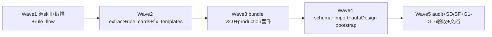

| Wave | 内容 | 产出 |
|------|------|------|
| **P0** | 1 | **走廊 stage + rule_cards 走廊段** + P skills + rule_flow JSON |
| **P0** | 2-3 | **bundle §5.0-K + linkageAudit** + T1 PreDesignPack + SD/SF |
| **P1** | 3-4 | import skip SB + EN trace + validate hash + applyAutoFix 走廊 |
| **P1** | 4-5 | audit linkage + **G1-G35** + Q16-Q20 |
| **P2** | 5+ | MD 四模态 + 预览 UI + 规则引擎 INT 补齐 |

---

## 验收标准（优化版 v2.0 · G1-G16）

### 基础闭环 G1-G9
- G1：`browser_full_flow.bundle.md` v2.0 可独立作 System Prompt（§0–§11 + 附录 A–H）
- G2：改编路径 P0→0.9→W + 每阶段 rule_cards L2 自检
- G3：`yarn extract:rule-checklists` 双源生成，ruleId 与内部一致，`rulePackVersion: 2.0.0`
- G4：原创路径可跳过 P，仍输出合规 ScriptBundle
- G5：JSON 通过 scriptBundleSchema，planData 落库 o_agentWorkData
- G6：designBrief + ruleAudit.W3 BLOCK 全过才 output
- G7：T2 EpisodeBundle-lite / T3 full 含扩展字段 + modalityAudit
- G8：H BLOCK → rollbackLayer → stage 文件可执行（附录 D）
- G9：`yarn bundle:browser-full-flow` 生成单文件 + browser_chat/ + manifest.json

### 智能检测修复 G10-G12
- G10：P0 六维度 SD-P 草稿 + 用户确认流
- G11：BLOCK 时输出 fixPlan，含 autoFixLibrary 建议
- G12：import 后 applyAutoFix ≥10 ruleId

### 角色资产锚点 G13-G16
- G13：T1 含 characters + arcToneMap + assetPipeline.extracted
- G14：T2 含 visualLockTable + 镜级 charCodes/sceneCode
- G15：imagePrompt 含 Y4/Y6/Y8 + cref 与 assetCodes 一致
- G16：assetGapReport 可 WARN 缺失资产

### 规则流程 v2.0
- G17：`rule_flow_browser_chat.json` 与 browser_flow_orchestration 阶段 ID 一致
- G18：DESIGN_FLOW_GUIDE 含 V5 内部版 vs Browser Chat 优化版双轨说明
- G19：旧 design_flow / adaptation_flow bundle 头部 redirect 至 v2.0

### 六链闭环 G20-G30
- G20-G24：六链 + linkageRepair
- **G25-G30：T1 PreDesignPack（shots+lines+hash+import 落库）**
- G8：`yarn audit:rule-application` 产出 matrix；gap 清单可追踪
- G9：T3 输出 ruleApplicationReport；四模态 readiness 与 missingRules 一致
- 五维追溯：文字/视觉/情绪/故事/风格特效 各 ≥1 条 traceSample 可验证
- `yarn test:bundle-roundtrip` 通过 planData 路径

## 风险与约束

- **Bundle 体积**：合并 W 阶段 skill 后约 20k+ tokens，需在 bundle 开头注明「分阶段对话，不要一次输出全部阶段」
- **planData 大小**：SQLite TEXT 字段足够，但建议单字段 ≤50KB，bundle 内提示压缩冗余 Markdown
- **旧 bundle 兼容**：design/adaptation bundle 保留 redirect，前端导入提示文案可后续在 Toonflow-web 更新
- **设计联动**：主 bundle 必含 B层 11 条 + H1 + designBrief；完整 GB/SB/EN 规则在附录 B（高级模式）
- **双交付模式**：单文件给简单用户；多文件套件给 Cursor/Projects，分阶段 @ 加载省 token
- **Bundle 体积控制**：单文件 ~20k tokens；多文件模式每 stage 独立 ~2–5k tokens
- **规则同步**：`规则层.json` / `主流程.txt` 变更 → 重跑 extract + bundle，避免内外规则漂移

