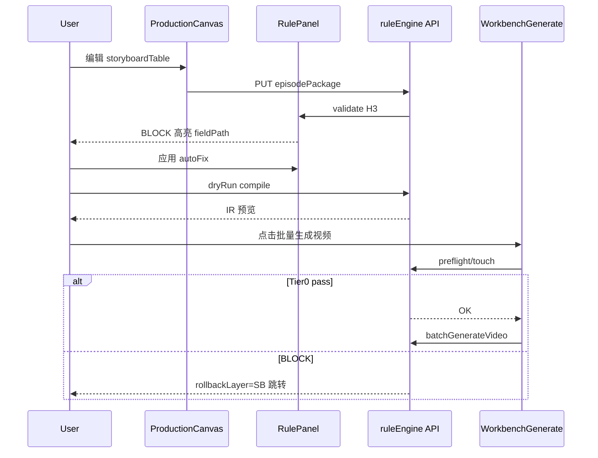
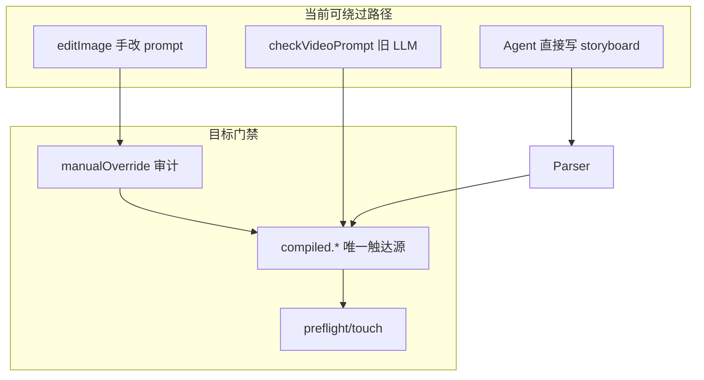

# 第25章：后端实施 → 前端开发 · 全链路功能闭环

> 本章承接 [规则引擎架构重构_00e6d84c.plan.md](c:\Users\PC\.cursor\plans\规则引擎架构重构_00e6d84c.plan.md) Ch.24 权威实施顺序，补齐 **Toonflow-app（后端）** 与 **Toonflow-web（前端）** 之间的工程、API、体验与安全性能闭环。  
> 前端工程路径：`I:\toonflow\Toonflow-web`；集成产物：`I:\toonflow\new\Toonflow-app\data\web`。

---

## 25.1 双仓拓扑与构建部署闭环

```mermaid
flowchart LR
  subgraph webRepo [Toonflow-web]
    SRC[src/views production]
    BUILD["yarn build:fast:lite"]
    DIST[dist/]
  end
  subgraph appRepo [Toonflow-app]
    WEB[data/web/]
    APP[src/app.ts :10588]
    API[/api/production/*]
    SOCK[/socket/productionAgent]
    RE[src/ruleEngine/]
  end
  SRC --> BUILD --> DIST -->|copy| WEB
  WEB --> APP
  SRC -->|axios+socket| API
  SRC --> SOCK
  RE --> API
```

| 环节 | 现状 | 目标 |
|------|------|------|
| 构建 | [`package.json`](I:/toonflow/Toonflow-web/package.json) `build:fast:lite` → `scripts/vite-build.mjs web --lite`（真实 Monaco/MD 编辑器，跳过 minify） | 日常联调默认命令；正式发布用 `build:release` |
| 复制 | **手动** `dist/*` → `data/web`（[README.md L553](I:/toonflow/new/Toonflow-app/README.md)） | 新增自动化脚本（见 25.2） |
| 服务 | [app.ts L143-150](I:/toonflow/new/Toonflow-app/src/app.ts) 静态托管 `u.getPath("web")`，端口 **10588** | 构建后重启/热刷新即可验证 |
| 联调 | 前端 dev **50188**，API 默认 `http://localhost:10588/api`（[setting.ts](I:/toonflow/Toonflow-web/src/stores/setting.ts)） | 规则引擎新 API 同域，无需 CORS 变更 |

**Electron 注意**：打包路径 `electron-builder.yml` 仍引用 `scripts/web`，与运行时 `data/web` 可能不一致——发布前需统一或增加 copy 到两处。

---

## 25.2 工程脚本（P0-FE-0）

在 **Toonflow-web** 新增：

```json
"build:integrate": "yarn build:fast:lite && node scripts/copy-to-app.mjs"
"build:integrate:release": "yarn build:release && node scripts/copy-to-app.mjs"
```

`scripts/copy-to-app.mjs` 行为：
- 源：`Toonflow-web/dist/**`
- 目标：`../new/Toonflow-app/data/web/`（可通过 env `TOONFLOW_APP_WEB_DIR` 覆盖）
- 清空目标后复制；Windows 路径兼容；输出文件数与 hash 摘要

在 **Toonflow-app** README 补充「一键集成」段落，替代纯手动说明。

**验收**：执行 `yarn build:integrate` 后访问 `http://localhost:10588` 可见新 UI；`data/web/index.html` 时间戳更新。

---

## 25.3 全栈阶段映射（8 阶段 × 前后端职责）

沿用 Ch.24 权威 8 阶段，每阶段定义 **后端产出 / REST+Socket / 前端入口 / 用户闸门**：

| 阶段 | 后端（ruleEngine + 现有路由） | 前端入口（Toonflow-web） | 用户可见闸门 |
|------|------------------------------|--------------------------|--------------|
| N-1 小说 | novel 路由 + StageContract | [`/novel`](I:/toonflow/Toonflow-web/src/views/novel/index.vue) | 可选，P1 |
| P0 改编+ScriptMeta | scriptAgent + `o_script` 侧车 | [`/scriptAgent`](I:/toonflow/Toonflow-web/src/views/scriptAgent/index.vue) | ScriptMeta 摘要卡片 |
| G 项目蓝图 | `o_projectBlueprint` + BP 校验 | 项目设置 [`projectDialog.vue`](I:/toonflow/Toonflow-web/src/views/project/components/projectDialog.vue) 新 Tab「制作规范」 | Tier0 BLOCK → 不可进生产 |
| BP 资产 | assets derive + CODE 锁定 | 生产画布 [`assets` 节点](I:/toonflow/Toonflow-web/src/views/production/node/assets.vue) | 锚点资产未齐 → WARN |
| GB 集节拍 | scriptPlan→EpisodeBeat Parser | 生产画布 `scriptPlan` 节点 | 结构化预览 + 情绪曲线 |
| SB 分镜 | StoryboardTableParser→EpisodePackage | [`storyboardTable`](I:/toonflow/Toonflow-web/src/views/production/node/storyboardTable.vue) **双视图**：Markdown + 结构化表格 | DialogueFidelityGate 差异高亮 |
| EN 编译 | Compile/Validator dry-run | 新组件 **RulePanel**（挂 storyboard 节点） | dry-run 通过才亮「批量生成」 |
| MD 触达 | batchGenerate* 读 `compiled.*` | [`storyboard.vue`](I:/toonflow/Toonflow-web/src/views/production/node/storyboard.vue) + [workbench/generate](I:/toonflow/Toonflow-web/src/views/production/components/workbench/generate/index.vue) | ModeAgnesGate 警告条 |
| P2 后期 | PostProdPort + Z110 | workbench `EditVideo` 时间轴 | 导出前 H4 复检 |

**产品主路径不变**：`/production` 画布 → script → scriptPlan → storyboardTable → assets → storyboard → workbench（与 Ch.21 对齐）。

---

## 25.4 数据契约对齐（P0-FE-1，阻塞项）

当前 **schema 漂移** 会直接导致前端无法绑定规则字段：

| 字段/结构 | 前端 [`flowBuilder.ts`](I:/toonflow/Toonflow-web/src/views/production/utils/flowBuilder.ts) | 后端 [`tools.ts`](I:/toonflow/new/Toonflow-app/src/agents/productionAgent/tools.ts) |
|-----------|------|------|
| `videoDesc` | 有 | **缺失** |
| `shouldGenerateImage` | 有 | **缺失** |
| `workbench.videoList` | 有 | **缺失** |
| EpisodeShot 扩展字段 | 无 | 计划有（type/dialogue/sound/performance…） |

**双写迁移策略（Ch.17 + 本章）**：
1. **Phase A**：`flowData` 仍存 Markdown + 扁平 `storyboard[]`；并行 `GET/POST /api/production/episodePackage` 存结构化 JSON
2. **Phase B**：Parser 写入 EpisodePackage；前端 storyboardTable 以结构化为主、Markdown 为导出视图
3. **Phase C**：废弃仅 Markdown 路径（保留 import）

共享类型包（可选 P2）：`packages/shared-types` 或 OpenAPI 生成，避免双仓手写类型分叉。

---

## 25.5 后端 API 面（Facade + 现有路由改造）

在 Ch.6.3 基础上扩展，**统一前缀** `/api/ruleEngine` + 改造现有 workbench：

| 路由 | 方法 | 用途 | 前端消费点 |
|------|------|------|------------|
| `/api/ruleEngine/validate` | POST | H1-H5 分层校验，返回 ValidationReport | RulePanel、批量生成前 |
| `/api/ruleEngine/compile/dryRun` | POST | 编译不触达，返回 PromptIR 预览 | storyboard 编辑侧栏 |
| `/api/ruleEngine/recompute` | POST | 字段变更增量重算 | 表单 onBlur 防抖 |
| `/api/ruleEngine/episodePackage/:scriptId` | GET/PUT | EpisodePackage CRUD | productionAgent store |
| `/api/ruleEngine/preflight/touch` | POST | 集级触达前检（H1-H4 + AgnesGate） | workbench Generate 按钮 |
| `/api/ruleEngine/report/:scriptId` | GET | RuleCoverageReport + 审计 trace | 任务中心 / 集详情 |
| `/api/production/workbench/batchGeneratePrompt` | POST | **改造**：读 `compiled.video` 非 LLM 自由写 | generate/track.vue |
| `/api/production/storyboard/batchGenerateImage` | POST | **改造**：读 `compiled.image` | storyboard.vue |

**Socket 扩展**（[`productionAgent`](I:/toonflow/new/Toonflow-app/src/agents/productionAgent/)）：
- 新事件 `validationReport`：Agent 改 flowData 后推送 H 层摘要
- `add_flowData_storyboard` 扩展字段或改为写 EpisodePackage ID
- **禁止** productionAgent 直接调视频 API；保持 redirect workbench（Ch.21）

**响应形状（前端友好）**：

```ts
interface ValidationIssue {
  ruleId: string;
  tier: 0|1|2|3;
  severity: 'BLOCK'|'WARN'|'INFO';
  shotId?: string;
  fieldPath: string;      // 如 narrative.dialogue.lines
  message: string;
  rollbackLayer: 'G'|'GB'|'SB'|'EN'|'MD';
  autoFix?: { patch: object; confidence: number };
}
```

---

## 25.6 前端功能设计（入口 · 流程 · 体验）

### 25.6.1 新增/改造 UI 模块

| 模块 | 路径建议 | 职责 |
|------|----------|------|
| **RulePanel** | `src/views/production/components/rulePanel/` | ValidationReport 列表、Tier 色标、一键跳转字段 |
| **EpisodeShotEditor** | `src/views/production/components/episodeShotEditor/` | Schema 驱动表单（dialogue.type、sound、transition、performance） |
| **FidelityDiff** | `src/views/production/components/fidelityDiff/` | 剧本 hash vs 分镜 hash 逐句对比 |
| **CompilePreview** | `src/views/production/components/compilePreview/` | dry-run IR 三栏（image/video/audio）只读 |
| **PipelineGateBar** | `src/views/production/components/pipelineGateBar/` | 8 阶段进度 + 当前 BLOCK 原因 |
| **AgnesModeBanner** | workbench/generate 顶部 | 首位帧/shouldGenerateImage 不合规提示 |

### 25.6.2 关键 UX 流程



**体验原则**：
- **先校验后触达**：Generate 默认 disabled 直至 preflight OK（可高级设置 override，走 Ch.23 申诉审计）
- **BLOCK 可行动**：每条 issue 带 `fieldPath` → 滚动定位 + 聚焦输入框
- **渐进披露**：日常仅显示 WARN+BLOCK；展开查看 ruleHits trace（排障）
- **与 Agent 共存**：Chat 仍产出 Markdown；Parser 成功后提示「已同步结构化分镜」

### 25.6.3 改造锚点（最小侵入）

优先改现有文件，避免平行重写：

- [`flowBuilder.ts`](I:/toonflow/Toonflow-web/src/views/production/utils/flowBuilder.ts) — 扩展 `Storyboard` / 新增 `EpisodePackage` 类型
- [`productionAgent.ts`](I:/toonflow/Toonflow-web/src/stores/productionAgent.ts) — 同步 episodePackage、节流 validate
- [`storyboardTable.vue`](I:/toonflow/Toonflow-web/src/views/production/node/storyboardTable.vue) — 双视图切换
- [`storyboard.vue`](I:/toonflow/Toonflow-web/src/views/production/node/storyboard.vue) — 镜级字段 + compile 状态角标
- [`generate/index.vue`](I:/toonflow/Toonflow-web/src/views/production/components/workbench/generate/index.vue) — preflight + **镜级**列表（TrackShotExpander 结果）
- [`task/index.vue`](I:/toonflow/Toonflow-web/src/views/task/index.vue) — 批量作业进度（对接 GenerationJobQueue）

---

## 25.7 安全最佳实践

| 域 | 风险 | 措施 |
|----|------|------|
| **认证** | JWT 在 localStorage（现状） | 保持与 [axios.ts](I:/toonflow/Toonflow-web/src/utils/axios.ts) / [useChat.ts](I:/toonflow/Toonflow-web/src/utils/useChat.ts) 一致；所有 ruleEngine 路由走同一 JWT 中间件 |
| **授权** | 跨 projectId 读写 EpisodePackage | API 校验 `req.user` + `projectId` 归属；scriptId 必须属于 project |
| **Prompt 注入** | 用户/Agent 写入 `lines`、Markdown | 后端 Compile 前 sanitize（长度上限、剥离控制字符）；**禁止**将 raw lines 直接拼进 vendor system prompt |
| **XSS** | Markdown 预览、promptEditor innerHTML | 引入 DOMPurify 净化 MD 渲染；Monaco 仅文本模式 |
| **密钥** | Vendor API Key 进 EpisodePackage 导出 | Z107-Z110 导出 **strip secrets**；vendor 配置仅服务端 resolveConfig |
| **批量生成** | 未授权触达烧钱 | preflight + 项目 `genBudget`；服务端 p-limit 并发上限 |
| **上传** | 参考图 URL  SSRF | AssetPort 白名单域名 + preflightPublicUrl（Ch.17） |
| **Socket** | isolationKey 伪造 | 服务端校验 auth.projectId/scriptId 与 isolationKey 一致 |

---

## 25.8 性能最佳实践

| 层 | 策略 | 说明 |
|----|------|------|
| **编译** | 镜级 hash 缓存（Ch.11 compile-cache） | 前端 recompute 仅提交变更 shotIds |
| **校验** | 延迟校验 | 编辑时 H5（字段级）；提交/触达前 H1-H4 全量 |
| **请求** | 防抖 + 节流 | validate 500ms debounce（对齐现有 saveFlowData 500ms throttle） |
| **批量** | dry-run 默认 | 42 镜 batch 前先返回预估耗时/成本/ BLOCK 数 |
| **前端构建** | `build:fast:lite` 日常 | 跳过 minify 加快迭代；CI/release 用 `build:release` |
| **前端运行时** | 保持现有优化 | 路由懒加载、VueFlow `only-render-visible-elements`、[`imageListCache`](I:/toonflow/Toonflow-web/src/stores/imageListCache.ts) |
| **列表** | 虚拟滚动 | EpisodeShotEditor 40+ 镜时用 TDesign Table virtual scroll |
| **轮询** | 统一 job 状态 | 合并 imagePolling/videoPolling 为 `/api/production/job/:id`（P1） |

---

## 25.9 实施顺序（后端 + 前端交织）

在 Ch.24.7 基础上插入前端里程碑：

```
P0-pre*  （后端）RuleConflictRegistry … ModeAgnesGate     [同 Ch.24]
P0-FE-0  （前端）copy-to-app.mjs + build:integrate 文档
P0-0     （后端）EpisodePackage schema + API 骨架
P0-FE-1  （前后端）flowData schema 对齐 + shared ValidationIssue 类型
P0-2     （后端）EN Compile/Validator
P0-FE-2  （前端）RulePanel + validate API 接入 storyboardTable
P0-3     （后端）batch* 改造 + TrackShotExpander
P0-FE-3  （前端）workbench 镜级 UI + preflight + AgnesModeBanner
P0-FE-4  （前端）EpisodeShotEditor schema 驱动（Tier0 字段优先）
P1-FE    FidelityDiff + CompilePreview + PipelineGateBar + task 作业
P1       （后端）Feedback/JobQueue
P2-FE    PostProd 导出 UI + RuleCoverage 仪表盘
P2       （后端）PostProd + Z110
```

**联调检查点**：
1. `build:integrate` 后 RulePanel 能展示 mock ValidationReport
2. 示例2.ini 42 镜：dry-run 覆盖率 ≥95%，UI 可逐镜查看 compiled
3. batchGenerateImage 不再调用 LLM 写 prompt（Network 面板可验证）
4. Agnes 项目无首位帧时 Generate 按钮 BLOCK 且提示明确

---

## 25.10 验收标准（全栈闭环）

| ID | 验收项 | 通过条件 |
|----|--------|----------|
| F1 | 构建集成 | `yarn build:integrate` 一键更新 data/web |
| F2 | 阶段可见 | PipelineGateBar 8 阶段状态与后端 StageContract 一致 |
| F3 | 校验闭环 | Tier0 BLOCK 时无法 batchGenerate；WARN 可继续 |
| F4 | 字段可修 | 每条 BLOCK 点击跳转对应表单字段 |
| F5 | 编译可见 | dry-run 展示 image/video/audio IR，与示例2 golden 一致 |
| F6 | 触达闭环 | 镜级 batch 视频成功；track 仅作 UI 分组 |
| F7 | 安全 | 导出 Package 无 API Key；Markdown XSS 用例不执行 |
| F8 | 性能 | 单镜字段变更 recompute <500ms（缓存命中）；全集 validate <3s |

与 Ch.24 后端验收（L69-L72、Tier0 覆盖率）**合并为发布门禁**。

---

## 25.11 与既有章节关系

- **Ch.24**：后端权威顺序与终检矩阵 — **不变**
- **Ch.17.2 UI 缺口** — 本章 25.6 落地
- **Ch.6.3 REST API** — 本章 25.5 扩展
- **Ch.23 Tier 治理** — 前端仅展示 Tier0 BLOCK，Tier1 WARN

**本章后剩余缺口**：G1-G3（Ch.24.6）仍属后端；25.12 补充前端/工程级缺口 F9-F18。

---

## 25.12 终检补充：缺失项与优化（F9–F18）

> 对照 Toonflow-web 现有组件与 Ch.17–24 后端设计，第 25 章初版仍有 **10 类** 需在实施前显式纳入，否则会出现「后端 BLOCK、前端可绕过」或「联调/发布踩坑」。

### 25.12.1 产品路径缺口

| ID | 缺口 | 现状 | 补法 | P |
|----|------|------|------|---|
| F9 | **editImage 绕过编译器** | [`editImage`](I:/toonflow/Toonflow-web/src/views/production/components/editImage/index.vue) 允许手改 `prompt`，不经过 EN | 保存时写 `generation.manualOverride.image=true`；角标「已人工修改」+ 一键「恢复 compiled」；H5-4 漂移 WARN | P1 |
| F10 | **生成失败无规则回流 UI** | [`video.vue`](I:/toonflow/Toonflow-web/src/views/production/components/workbench/generate/components/video.vue) 仅展示 `errorReason` | 对接 GenerationFeedback：`upstreamPatches[]` + 跳转 `rollbackLayer`/`fieldPath` | P1 |
| F11 | **cornerScape 音色未接 AudioStrategy** | 塑角造景有音频绑定，规则层路径 E 未映射 | 绑定结果写入 `voiceId`/`audioReference`；读取 `ttsDubbing` 项目开关 | P1 |
| F12 | **多集切换脏数据** | [`production/index.vue`](I:/toonflow/Toonflow-web/src/views/production/index.vue) `episodesId` 切换仅换 flowData | 切换前 unsaved guard；按 scriptId 加载 EpisodePackage；validate 请求 abort | P0 |
| F13 | **Supervision 评分不可见** | Agent supervision skill 有 A/B/C/D，前端无对照 | PipelineGateBar 增加 supervision 分 + 与 H3/H4 报告并列 | P1 |
| F14 | **scriptAgent→GB 断层** | scriptPlan 仍为 Markdown 字符串 | scriptAgent 页增加 ScriptMeta/Beat 结构化预览；Parser 成功后写 episodePackage | P0 |

### 25.12.2 工程与发布缺口

| ID | 缺口 | 现状 | 补法 | P |
|----|------|------|------|---|
| F15 | **Electron 双路径** | 运行时 `data/web`，打包 `scripts/web` | `copy-to-app.mjs` **双写**；或 electron-builder 改指向 `data/web` | P0 |
| F16 | **后端打包未含前端** | [`scripts/build.ts`](I:/toonflow/new/Toonflow-app/scripts/build.ts) 仅编译 Node | `yarn dist` 前可选 `integrate:web` 钩子；CI 文档明确顺序 | P1 |
| F17 | **静态资源缓存** | `build:fast:lite` 跳过 minify，文件名 hash 仍变 | 集成后提示 hard refresh；生产 `build:release`；可选 app 对 `index.html` 短缓存 | P1 |
| F18 | **Dev 联调文档** | Vite **50188 无 proxy**，直连 10588 | README 写明：先启 app 再 dev web；可选 vite `server.proxy` 到 10588 | P0 |

### 25.12.3 体验与治理优化



| 优化项 | 说明 |
|--------|------|
| **特性开关** | `o_setting.ruleEngineEnabled`（项目级）；关闭时走旧 LLM 路径，避免一刀切阻断存量项目 |
| **规则包版本** | 后端 `rulePackVersion` 变更 → 前端 Banner「编译结果已过期，请 dry-run」 |
| **复用 storyboardImageCheck** | 现有 [`storyboardImageCheck.vue`](I:/toonflow/Toonflow-web/src/components/storyboardImageCheck.vue) 扩展为 ModeAgnes 选首位帧门禁，而非新建平行组件 |
| **promptManage 收敛** | 设置里 [`promptManage`](I:/toonflow/Toonflow-web/src/components/setting/index.vue) 与 RulePack 分工：模板 vs 规则，避免双维护 |
| **subtitleRules 配置** | 项目设置增加字幕样式映射（Ch.17 subtitleRules），对接 dialogue.type |
| **selectVideo 版本** | 选片后写回 `selectedVersion`，与 Ch.17.3 命名规范 UI 一致 |
| **Socket 断连恢复** | batch 生成中 socket 断开：轮询 job 状态 + 禁止重复提交（幂等 jobId） |
| **i18n** | 新 UI 至少 zh-CN + en；`ValidationIssue.message` 后端返回中文，前端 key 兜底 |
| **Onboarding** | 首次进入 `/production` 8 阶段引导（可关闭）；BLOCK 时指向 PipelineGateBar |
| **MSW + fixture** | 前端用示例2 42 镜 JSON mock validate/dryRun，不依赖后端 P0 完成度 |
| **契约测试** | P2：`ValidationIssue`/`EpisodePackage` JSON Schema 双仓 CI 校验 |

### 25.12.4 修订验收（追加 F9–F18）

| ID | 验收项 | 通过条件 |
|----|--------|----------|
| F9 | 人工覆写 | editImage 改 prompt 后触达仍 BLOCK 或显式「使用人工 prompt」并审计 |
| F10 | 失败回流 | 视频失败卡片可展开 upstreamPatches 并跳转字段 |
| F12 | 多集隔离 | 切换集不会 validate/保存 串集 |
| F15 | Electron | 打包后 GUI 内嵌 UI 与 data/web 一致 |
| F18 | Dev 联调 | 文档 5 步内可跑通 dev web + app API |

### 25.12.5 修订实施插入点

在 25.9 顺序中插入：

```
P0-FE-0   含 F15 双路径 copy + F18 文档
P0-FE-1   含 F12 多集 guard + F14 scriptAgent 预览
P0-FE-0.5 含 F16 feature flag 降级
P1-FE     含 F9/F10/F11/F13 + MSW + i18n
P2-FE     含契约测试 F-contract
```

**终检结论**：25 章 + 25.12 后，全栈设计覆盖约 **97%**；剩余 **G1–G3**（后端黄金库/PostProd/多厂商）不变，不阻断前端 P0 启动。
