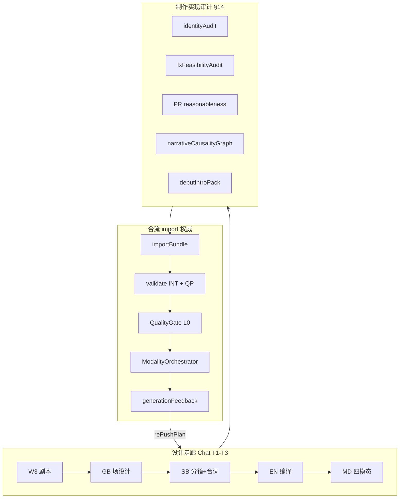

# 制作实现闭环确认与完善（§14 扩展）

## 结论：方案已考虑制作实现闭环

主计划 [`browser_chat_full_skill_0b1d04d0.plan.md`](c:\Users\PC\.cursor\plans\browser_chat_full_skill_0b1d04d0.plan.md) **§14** 已专门回应你的 5 点；项目索引 [`plan/browser_chat_full_flow_优化版.plan.md`](i:/toonflow/new/Toonflow-app/plan/browser_chat_full_flow_优化版.plan.md) 第 74-84 行有摘要对照。

| 你的关切 | 方案落点 | 关键机制 |
|----------|----------|----------|
| **1. 角色/台词/图/视/音多端不一致** | §14.2 `identityAudit` | CD/BP L0→SB charCodes→EN compile→MD 四模态 `identitySlot` 逐镜 BLOCK；失败 rePush EN/BP/CD |
| **2. 特效设计→提示词→AI 无法实现** | §14.3 `fxFeasibilityAudit` | F0-F5 分级 + `degradeFixPlan` + `postProductionOnly`；生成失败 `generationFeedback` 升档重判 |
| **3. 分镜不合理反推重设计** | §14.4 PR-01~08 | 制作向专检（非仅 QP）；BLOCK 必出 `rePushPlan`（非单字段 fixPlan） |
| **4. 故事/剧本因果正反向（超越台词）** | §14.5 `narrativeCausalityGraph` | W3 事件节点→infoLinkage→SB markers→graph 边；`broken[]` 按层级反推 W1/W2/W3/SB |
| **5. 人物/场景首次出场标准介绍** | §14.6 `debutIntroPack` | establishing 景别 + copyHint + 可选 SUB；F1 级轻特效；下集 continuity 写回避免重复 full intro |

**多端统一**不靠 Chat 与内部两套标准，而靠 **轨3 合流**（§13.5）：



Chat T3 出口前跑 §14 五项审计；import 后 **INT 权威复核同一 schema**（G64）；生成失败走 §11 `rePushPlan` 与 §14 路由表合流。

---

## 你 5 点的正反推逻辑（现有 §14 已定义）

### 1. 多端身份一致（正推 / 反推）

**正推**：`CD/BP.characterAssets.L0.identity` → G1 锚点 → SB `charCodes` + `arcStage` → EN 主体段 gender 词 + `--cref` → AUD `L6.voice.gender` → `modalityPromptAudit.identitySlot`

**反推触发**：`identityAudit.perShot[].slots.IMG|VID|AUD.match = false` → severity BLOCK → `rePush.reverseTarget = EN|BP|CD`

**典型反例（G65 golden）**：design male + IMG/VID 含 woman/female + AUD female voice → 必 BLOCK

### 2. 特效可行性（正推 / 反推）

**正推**：W3 特效描写 → SB `visualEffect` → EN FX 段 → `fxFeasibilityPreflight`（触达前）

**反推触发**：SD-EN/FX 或 `generationFeedback` → 查 [`fx_feasibility_matrix.json`](i:/toonflow/new/Toonflow-app/data/fixtures/fx_feasibility_matrix.json)（待建）

| 级别 | 策略 | 反推 stage |
|------|------|------------|
| F0-F1 | 通过 | — |
| F2-F3 | degradeFixPlan / 拆镜 | SB / W3 |
| F4 | postProductionOnly + 基底 prompt | EN |
| F5 | 改展示或删特效 | W3 / SB |

### 3. 分镜合理性（正推 / 反推）

PR-01~08 覆盖：一镜多场景/多对白、时长不匹配、景别情绪脱节、运镜不可执行、FX+大动作过载、脱钩缺失等。**supervision SB 级 C/D 等同 PR BLOCK**，触发 `rePushPlan`（§11 `presentationFork`：P1 改剧本 / P2 改分镜）。

### 4. 叙事因果（正推 / 反推）

**正推**：W1 骨架 → W3 事件节点 → `designBrief.infoLinkage` → SB `markers.causeId/effectId` → EN 焦点锚点

**反推**：`narrativeCausalityGraph.broken[]` → 定位断点层级 → 镜级 SB / 场级 W3 / 策略 W2 / 骨架 W1

因果类型表（§14.5）：事件 / 动机 / 信息 / 情绪 / 视觉 / 台词（R2/H3 已有）

### 5. 首次出场（正推 / 反推）

**正推**：全剧扫描 charCode/sceneCode/propCode 首次 shotIndex → 套用 `debut_intro_templates.json` → SB establishing + copyHint + 可选 SUB

**反推**：缺 establishing 景别 → QP-PR-04 WARN；visualDescription 空泛 → QP-02 BLOCK → rePush SB/W3

**跨集**：Pipeline 结束写回 debut 状态（§14.8）；ep≥2 已出场角色走 recap 轻量版，不重复 full intro

---

## §14.11 扩展：「诸如此类」正反推验证域（待写入主计划）

以下为主计划 §14 尚未单列、但制作闭环必需的补充项：

| ID | 域 | 正推链 | 反推触发 | rePush target | 多端 |
|----|-----|--------|----------|---------------|------|
| **PR-09** | 唇形/时长 | lines 字数→duration→VID lip 关键词 | duration 不足 / lip 词缺失 | SB / EN-VID | VID+AUD |
| **PR-10** | 画外音 OS | SB speaker=OS 无 onScreen | OS 无 voiceProfile 或画面误现 speaker | SB / EN-AUD | AUD+IMG |
| **PR-11** | 道具状态 | anchorProps.propState 链 | 同场 N/N+1 propState 矛盾 | SB / BP | IMG+VID |
| **PR-12** | 空间关系 | SB spatialRelation | IMG 构图 / VID 运镜与站位冲突 | SB / EN | IMG+VID |
| **PR-13** | 同场时空 | sceneColorLock + timeOfDay | 同 sceneCode 相邻镜光色/天气跳变 | SB / brief | IMG+VID |
| **PR-14** | 表情可实现 | emotionIntensity + shotSize | QF-EXPR（规则引擎）：高情绪+短镜+夸张词 | SB / EN | IMG+VID |
| **PR-15** | Vendor FX 能力 | fx matrix × vendorPack | F5 对该 vendor 不可出 | EN / SB / W3 | FX+VID |
| **PR-16** | SUB 与负向词 | debut copyHint → SUB 轨 | SUB 文案与 director「no subtitles」负向冲突 | EN-MD / SB | SUB+VID |

**统一反推路由**（与 §11 `reverse_route_table.json` 合并）：

```
检测源 → 分类(PR/QP/identity/fx/graph) → reverseTarget stage → forwardStages[] → presentationFork?
```

**T3 出口 dryRun 清单**（Chat + import 共用，写入附录 O）：

1. `identityAudit` 全镜 PASS
2. `fxFeasibilityAudit` 无未处理 F5
3. PR-01~16 无 BLOCK（WARN 需记录 reverseHints）
4. `narrativeCausalityGraph.broken` 为空或均有 reverseHints
5. `debutIntroPack` 主角色/主场景/关键道具齐全
6. `modalityPromptAudit` 四模态 slot 合规（§12）
7. `linkageAudit` + `externalHashCheck.match`（T1 台词 fidelity）

---

## 与内部规则引擎的衔接（避免双标准）

| 制作闭环能力 | Chat §14 | 内部现状 | 统一 wave |
|--------------|----------|----------|-----------|
| identityAudit | T3 EXT | 无 | Wave P1：validate 增 `identity_mismatch`；dryRun 同 schema |
| fxFeasibility | T3 EXT | generationFeedback 弱 (I5/I7) | Wave P1：FEEDBACK_ROUTING + fx matrix |
| PR reasonableness | supervision + EXT | validate ~8 条 (I1) | Wave INT-1：PR 子集 Tier-0 |
| narrativeGraph | W3/SB 出口 | H3 待建 (I9) | Wave INT-1：H3 与 graph.broken 对齐 |
| debutIntro | T1/T3 | 无 | Wave P1：import meta + SB 字段校验 |

分工不变：本计划负责 **Track 2 bundle + Track 3 import 契约 + unified JSON**；[`规则引擎架构重构`](i:/toonflow/new/Toonflow-app/plan/规则引擎架构重构_00e6d84c.plan.md) 负责 **Track 1 INT/Touch/ModalityOrchestrator**。

---

## 新增/更新交付物

写入主计划 §14.11 + 附录 O 扩展：

- [`data/fixtures/fx_feasibility_matrix.json`](i:/toonflow/new/Toonflow-app/data/fixtures/fx_feasibility_matrix.json) — F0-F5 × vendor 能力
- [`data/fixtures/debut_intro_templates.json`](i:/toonflow/new/Toonflow-app/data/fixtures/debut_intro_templates.json) — 角色/场景/道具/关系四套模板
- [`data/fixtures/production_closure_checklist.json`](i:/toonflow/new/Toonflow-app/data/fixtures/production_closure_checklist.json) — T3 dryRun 7 项
- Stage skills：`production_identity_audit.md`、`production_fx_feasibility.md`、`production_debut_intro.md`、`production_reasonableness_PR.md`（PR-09~16）
- Golden fixture：**男设计/女 prompt**、**F5 特效未降级**、**因果断边**、**缺 debut establishing** 四例必 BLOCK

ScriptBundle schema 增补（§14 + §14.11）：

```json
{
  "identityAudit": { "perShot": [] },
  "fxFeasibilityAudit": { "items": [] },
  "narrativeCausalityGraph": { "nodes": [], "edges": [], "broken": [] },
  "debutIntroPack": { "characters": [], "scenes": [], "props": [] },
  "productionReasonableness": { "items": [], "prIds": ["PR-01", "..."] }
}
```

---

## 验收扩展 G66-G72（制作实现闭环 §14.11）

| # | 验收 |
|---|------|
| G66 | PR-09：长台词镜 duration 与 lip 关键词一致，否则 BLOCK |
| G67 | PR-10：OS 镜 AUD 有 voiceProfile 且 IMG 无错误 onScreen speaker |
| G68 | PR-11/12：同场道具状态与 spatialRelation 跨 IMG/VID 一致 |
| G69 | PR-14：emotion≥6 + duration&lt;4s 触发 QF-EXPR BLOCK |
| G70 | PR-15：vendor 维度 F5 不得 silent pass |
| G71 | T3 dryRun 7 项 checklist 全 PASS 才允许 export JSON |
| G72 | golden 四反例（identity/fx/graph/debut）roundtrip import 均 BLOCK |

---

## 实施优先级（并入现有 Wave）

| Wave | 内容 |
|------|------|
| **P0** | §14 五问 schema + 附录 O 骨架 + fx/debut fixtures + bundle §6 总览 + PR-01~08 写入 supervision |
| **P1** | identityAudit / fxPreflight / graph 写入 import dryRun；PR-09~16；applyAutoFix 对齐 rePush |
| **P2** | ModalityOrchestrator 生成后 Feedback 升档；vendor×fx matrix；continuity debut 写回 UI |

---

## 对你问题的直接回答

1. **多端统一闭环**：有。`identityAudit` + `modalityPromptAudit.identitySlot` + import 合流同一 schema（§14.2 + §13.5）。
2. **特效不可实现智能修正**：有。F0-F5 + degrade + generationFeedback 升档（§14.3）。
3. **分镜不合理反推重设计**：有。PR-01~08 + rePushPlan + presentationFork（§14.4）；§14.11 补 PR-09~16。
4. **故事因果正反向**：有。`narrativeCausalityGraph` 六类因果 + 层级反推（§14.5）；台词因果 R2/H3 为子集。
5. **首次出场标准**：有。`debutIntroPack` + establishing + copyHint + 跨集 recap（§14.6 + §14.8）。

**待完善项**（本次 §14.11 补齐）：唇形时长、OS、道具/空间/时空连续、表情可实现、Vendor FX、SUB 负向冲突 — 均纳入同一 `rePushPlan` / dryRun 闭环，避免 Chat 与内部各检各的。
