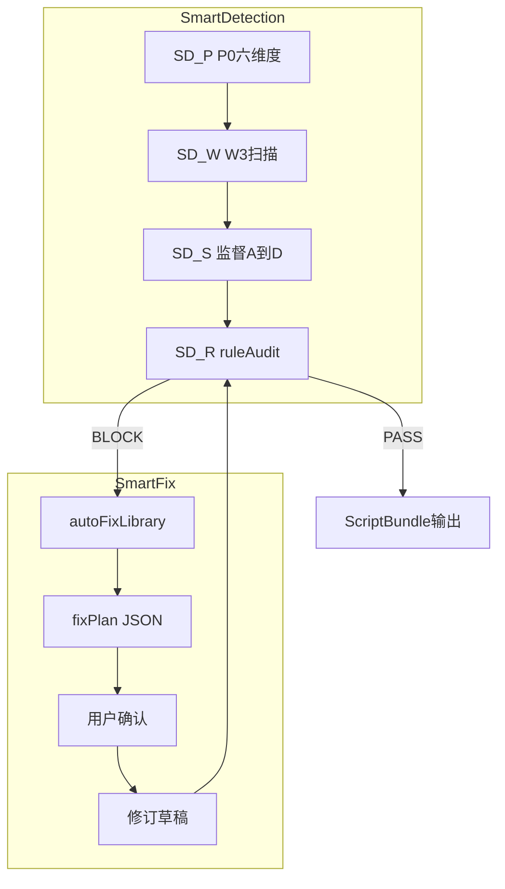

# 剧本智能检测 & 智能修复 — 计划补充说明

## 直接回答

### 是否带「剧本智能检测」？

**部分有，未成体系。** 原计划已包含：
- P0→P0.9 智能分析阶段（[`adaptation_execution_*.md`](data/skills/adaptation_execution_precheck.md) 待展开）
- W3 L2 BLOCK 自检 + [`ruleAudit`](c:\Users\PC\.cursor\plans\browser_chat_full_skill_0b1d04d0.plan.md) / `ruleApplicationReport`（附录 E）

**原先缺失、现已补入计划：**
- **SD-P**：P0 六维度半自动草稿 + 用户确认 → `planData.preCheck`
- **SD-W**：W3 密度/钩子/台词保真/可拍性结构化扫描 → `smartDetection.w3Scan`
- **SD-S**：外部监督层等效（复用 [`script_agent_supervision.md`](data/skills/script_agent_supervision.md) A/B/C/D 口径）→ `supervisionReport`
- **SD-M**：P03 矩阵智能推荐（I2）

### 是否带「智能修复」？

**原先基本缺失。** 内部仅有 [`applyAutoFix`](src/ruleEngine/validators/autoFix.ts) **3 条**（V1/V3/MODE-AGNES），[`generationFeedback`](src/ruleEngine/ports/generationFeedback.ts) 为正则路由；[`规则层.json`](规则层.json) 的 **autoFixLibrary 20+ 模板未接入**。

**现已补入计划：**
- **附录 F**：智能修复闭环（检测 → 查 autoFixLibrary → `fixPlan` → 用户确认 → 修订 → 重检）
- **ScriptBundle 新字段**：`fixPlan.items[]`（ruleId / suggestions / rollbackStage / status）
- **extract 脚本扩展**：`规则层.json` → `fix_templates.json`
- **内部对齐**：扩展 `applyAutoFix` + `generationFeedback`，与外部 fix 模板同 ruleId 同话术
- **修复分级**：L0 机器自动 / L1 LLM 半自动 / L2 用户选方案 / L3 回滚 stage

### 其他缺失 / 优化（已纳入计划）

**必须补（M1-M6）：**
- 监督层外部化、autoFixLibrary 提取、fixPlan schema、P0 半自动、applyAutoFix 扩展、import 前 dryRun 话术

**应补（O1-O7）：**
- W93-W100 智能设计（附录 G）、novel 事件联动、continuity 说明、冲突合并、生图失败回流、token 预估、制作页复制 bundle（二期）

**可选二期（P1-P4）：**
- importSeries 批量、撤销 snapshot、RulePanel 展示 smartDetection、内部 W93 trigger

---

## 架构关系（检测 → 修复 → 输出）

---

## 新增交付物

| 文件/产物 | 内容 |
|-----------|------|
| [`stages/supervision_review.md`](data/skills/browser_chat/stages/supervision_review.md) | 外部监督层话术 |
| `fix_templates.json` | 从 autoFixLibrary 提取 |
| [`browser_full_flow.bundle.md`](data/skills/browser_full_flow.bundle.md) 附录 F/G | 修复 + W93-W100 |
| ScriptBundle schema | `smartDetection` + `fixPlan` |
| `autoFix.ts` 扩展 | 10+ ruleId 机器修复 |
| 验收 G10-G12 | P0 草稿 / fixPlan / applyAutoFix 覆盖 |

---

## 与现有计划 todos 的关系

新增 2 项 todo（已写入主计划 frontmatter）：
- `smart-detect-fix` — SD 模块 + fixPlan + supervision 外部化
- `autofix-expand` — applyAutoFix + generationFeedback 与 autoFixLibrary 对齐

其余 9 项 todo 不变，实施顺序建议：
1. Wave 1：P skills + rule_cards + **fix_templates 提取**
2. Wave 2：bundle + **附录 F/G** + supervision_review.md
3. Wave 3：schema（planData + **smartDetection + fixPlan**）+ import
4. Wave 4：**applyAutoFix 扩展** + audit + G10-G12 测试

完整细节见已更新的 [`browser_chat_full_skill_0b1d04d0.plan.md`](c:\Users\PC\.cursor\plans\browser_chat_full_skill_0b1d04d0.plan.md) 中 **「剧本智能检测 & 智能修复」** 章节。
