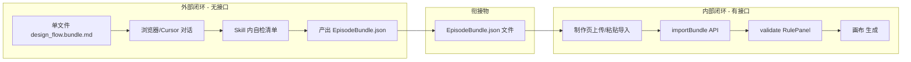

# 浏览器 Chat 外部闭环 + 内部导入闭环（v5）

## 核心纠正

**外部主流程不能调 Toonflow 接口**（无 validate / importBundle / getFlowData）。

因此是 **两条独立闭环**，用 **EpisodeBundle JSON 文件** 衔接：



---

## 一、外部闭环（浏览器 Chat）— 完整清单

### 1.1 用户做什么

| 步骤 | 动作 |
|------|------|
| 1 | 打开任意浏览器 Chat（或 Cursor） |
| 2 | 将 **`design_flow.bundle.md` 全文** 作为 system prompt（一个文件，无接口） |
| 3 | 发送原故事/剧本 + episodeKey |
| 4 | 按 AI 引导完成三阶段（GB→SB→EN） |
| 5 | 每阶段结束 AI **对照 Skill 内嵌自检清单**自行修订（不调 API） |
| 6 | 复制最终 **EpisodeBundle JSON** 保存为文件 |
| 7 | （另一步）进入 Toonflow 制作页导入该 JSON |

### 1.2 外部需要什么（仅 2 样东西）

| # | 交付物 | 说明 | 状态 |
|---|--------|------|------|
| 1 | **`design_flow.bundle.md`** | 单文件、自包含：主编排 + 三阶段细则 + 规则自检清单 + 输出 schema | **待生成**（`yarn bundle:design-flow`） |
| 2 | **`episode-bundle-template.json`** | 输出样例，给用户/AI 对齐格式 | 已有 fixture |

**不需要**：validate API、Socket、Pinia、宿主拼装、子文件引用。

### 1.3 外部闭环内流程（全在对话里完成）

```
输入：原故事
  ↓
[P0 可选] 整理为 script（bundle 内嵌改编规则）
  ↓
[GB] 导演规划 → scriptPlan + episodeBeat
      → 自检：情绪曲线、场次全覆盖、场间过渡（bundle 内嵌 GB 检查清单）
  ↓
[SB] 分镜表 → storyboardTable
      → 自检：台词零删改、≤15s、人物不消失（bundle 内嵌 SB 检查清单）
  ↓
[EN] 分镜面板 → storyboard[]（含 clientId、prompt）
      → 自检：每镜有 prompt/duration（bundle 内嵌 EN 检查清单）
  ↓
输出：EpisodeBundle JSON（纯文本，用户复制保存）
```

### 1.4 外部规则怎么处理（无 API）

| 层级 | 外部做法 |
|------|---------|
| 500+ 规则全文 | **不进**外部文件 |
| 各阶段关键规则 | **写入 bundle** 为可执行自检清单（LLM 逐条对照） |
| 权威判定 | **推迟到内部** import 后 `validate` API |

外部 = Skill 自检（定性）；内部 import 后 = RuleEngine（定量）。

### 1.5 bundle 文件应包含什么（单文件完整内容）

```
1. 角色与目标
2. 输入契约（原故事、episodeKey）
3. 三阶段流程 + 每阶段完整执行细则（从 production_execution_*.md 合并，非仅文件名引用）
4. 每阶段「自检清单」（从规则层摘关键项，可勾选格式）
5. EpisodeBundle JSON schema + 完整示例
6. 输出指令：最终消息只输出 ```json ... ``` 
7. 红线（台词不删改、禁止跳过阶段等）
```

**不包含**：任何 API URL、importBundle、validate 调用说明（那些只写在内部文档）。

---

## 二、内部闭环（Toonflow 制作页）— 完整清单

### 2.1 用户做什么

| 步骤 | 动作 |
|------|------|
| 1 | 登录 → 项目 → 创建/选择剧集 |
| 2 | 制作页 → 导入 → 粘贴外部产出的 EpisodeBundle JSON |
| 3 | 查看 RulePanel 校验报告（**此时才调 validate**） |
| 4 | 按报告修订 → 可导出再回外部改，或画布内改 |
| 5 | compileDryRun → 分镜图/视频生成 |

### 2.2 内部需要什么

| # | 模块 | 文件/接口 | 状态 |
|---|------|----------|------|
| 1 | 导入适配器 | `POST /ruleEngine/importBundle` | **待开发** |
| 2 | storyboard 落库 | `storyboardSync`（修 bug） | **待开发** |
| 3 | 校验 | `POST /ruleEngine/validate`（已有） | 已有 |
| 4 | 导入 UI | 制作页导入框 + 首集引导 | **待修** |
| 5 | RulePanel | `visible: true` 等 | **待修** |
| 6 | 主编排（内部用） | `design_flow.md`（可引用 API） | 已有 |
| 7 | 导出 | `exportBundle`（可回外部改） | 待开发 |

### 2.3 内部闭环流程

```
EpisodeBundle.json（外部文件）
  ↓
importBundle（写 o_agentWorkData + o_storyboard + o_episodePackage）
  ↓
validate → RulePanel 展示 ValidationReport
  ↓
[未通过] 画布修改 或 导出 JSON 回外部 Chat 改
  ↓
[通过] compileDryRun → preflight → 生成
```

---

## 三、内外关系（不要混）

| | 外部浏览器 Chat | 内部 Toonflow |
|--|----------------|---------------|
| 调 API | **否** | **是** |
| Skill 形态 | **单文件 bundle** | design_flow.md + 子 skill / API |
| 规则判定 | Skill 内自检清单 | RuleEngine validate |
| 落库 | **否**，只产出 JSON 文件 | importBundle |
| 衔接 | 输出 EpisodeBundle.json | 导入同一 JSON |

**后期内部 Agent 接入**：属于内部侧，可调 API；外部 bundle 不变。

---

## 四、待办（按阻塞顺序）

1. **`yarn bundle:design-flow`** → 生成 `design_flow.bundle.md`（外部唯一入口）
2. **`importBundle` API** + storyboard 落库（内部入口）
3. **导入 UI 修复**（制作页粘贴外部 JSON）
4. **RULE_ENGINE_TEST_GUIDE** 增补：外部产出 → 内部导入路径
5. （可选）内部设计模式：复用同一对话 UI，但可走 API 版 design_flow.md

---

## 五、验收

**外部**（无 Toonflow、无网络 API）：
- 粘贴 bundle → 对话完成三阶段 → 得到合法 EpisodeBundle JSON

**内部**：
- 粘贴该 JSON → importBundle → 刷新不丢分镜 → validate 有报告 → 可生成

**roundtrip**：
- 外部 JSON → 内部导入 → exportBundle → 可再拿回外部改
