# 短剧规则引擎 · 全链路架构重构方案

## 一、现状诊断（继续分析结论）

### 1.1 三套规则语料的关系

| 来源 | 规则数 | 角色 | 可执行度 |
|------|--------|------|----------|
| [规则层.json](i:/toonflow/new/Toonflow-app/规则层.json) | 257 | **校验逻辑库**：含 `完善后内容`、正则检测、`autoFixLibrary`、依赖链 | 高（可直接转代码） |
| [主流程.txt](i:/toonflow/new/Toonflow-app/主流程.txt) + V5.0 文档 | 297→697 | **流程编排库**：P/G/W/B/V/M/S/D/X/I/Y/Z/H/L + 步骤 0-0.9 + W93-W100 智能设计 | 中（需结构化） |
| [shili.txt](i:/toonflow/new/Toonflow-app/shili.txt) / [示例2.ini](i:/toonflow/new/Toonflow-app/示例2.ini) | — | **目标输出样例**：Z108 编译版提示词、H 层校验报告 | 验收标准 |

**核心矛盾**：V5.0 定义了 697 条规则与 20 层闭环，但 [规则层.json](i:/toonflow/new/Toonflow-app/规则层.json) 仅覆盖其中 257 条且层级命名与 V5 不完全一致（如 V 层在 json 中为 98 条字段校验，V5 为 226 条）。**首期需建立统一规则注册表，将 json 中 257 条作为「已细化子集」，V5 其余 440 条从文档抽取为「待细化规则桩」，统一 ID 与触发条件。**

### 1.2 现有代码缺口

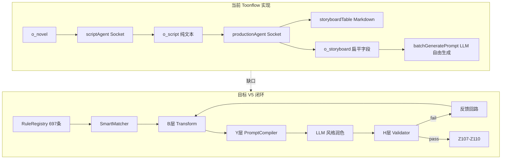

**关键缺口**：

- [o_storyboard](i:/toonflow/new/Toonflow-app/src/lib/initDB.ts) 仅 `videoDesc` / `prompt` / `duration`，缺少 V5 要求的 `emotionIntensity`、`rhythmZone`、`type`(CHAR-SCENE 等)、`performance`、`colorTone`、`visualFocus` 等 40+ 结构化字段
- [batchGeneratePrompt.ts](i:/toonflow/new/Toonflow-app/src/routes/production/workbench/batchGeneratePrompt.ts) 和 [generateVideoPrompt.ts](i:/toonflow/new/Toonflow-app/src/routes/production/workbench/generateVideoPrompt.ts) 将 `videoDesc` 交给 LLM 自由拼装，属于 shili.txt 指出的「描述性拼装」而非「规则编译」
- [productionAgent](i:/toonflow/new/Toonflow-app/src/agents/productionAgent/index.ts) 的 `storyboardTable` 存于 `o_agentWorkData` 为 Markdown，与 [storyboard_table_techniques.md](i:/toonflow/new/Toonflow-app/data/skills/production_skills/storyboard_table_techniques.md) 定义的 `shotSize`/`cameraMove`/`action` 等字段未落库
- 无 H 层校验、无 Z107-Z110 导出、无规则依赖图驱动的增量重算

### 1.3 混合策略定位（用户选择）

- **确定性引擎负责**：字段推导（B/M/S/D 层）、提示词骨架编译（Y 层）、完整性校验（H 层）、数据打包（Z 层）
- **LLM 负责**：W 层编剧创作（scriptAgent）、P 层改编流程（步骤 0-0.9）、W93-W100 智能设计、**提示词风格润色**（复用 [data/skills/art_skills/](i:/toonflow/new/Toonflow-app/data/skills/art_skills/) 的 `director_storyboard.md` / `art_storyboard_video.md`）
- **原则**：`compiledPrompt`（规则编译）与 `polishedPrompt`（LLM 润色）分离存储，H5-4 映射一致性校验针对 `compiledPrompt`，润色不得改变结构化锚点字段

---

## 二、目标架构

### 2.1 模块分层

新建 `src/ruleEngine/` 模块，与现有 Agent 解耦，通过 Pipeline API 接入：

```
src/ruleEngine/
├── registry/          # 规则注册表（697条统一Schema）
│   ├── rules/         # 按层拆分的规则定义 JSON
│   ├── index.ts       # 规则加载与版本管理
│   └── types.ts       # RuleDefinition 类型
├── schema/            # 分镜/资产/项目 统一数据模型
│   ├── shot.ts        # 单镜完整字段（W/B/V/M/S/D/X/I）
│   ├── episode.ts     # 单集 + G层锚点
│   └── project.ts     # 项目蓝图 + P层诊断
├── matcher/           # 智能匹配引擎
│   ├── conditionEval.ts   # 触发条件求值
│   ├── dependencyGraph.ts # 交叉规则联动表
│   └── ruleSelector.ts    # 变更字段→受影响规则
├── transforms/        # B/M/S/D/X/I 层确定性推导
│   ├── emotionBridge.ts   # B1-B12
│   ├── avMatch.ts         # M1-M20
│   ├── visualDetail.ts    # S1-S28
│   └── rhythmImpl.ts      # I1-I20
├── compiler/          # Y 层提示词编译器
│   ├── imageCompiler.ts
│   ├── videoCompiler.ts
│   ├── audioCompiler.ts
│   └── templates/     # 固定模板（来自 shili.txt 映射表）
├── validator/         # H 层校验器
│   ├── layers/        # H1-H10 分层校验
│   ├── autoFix.ts     # H9 自动修复（复用 autoFixLibrary）
│   └── report.ts      # 校验报告生成
├── packager/          # Z 层数据包
│   ├── z107.ts        # 分镜 JSON + 校验报告
│   ├── z108.ts        # 提示词包
│   ├── z109.ts        # 音频包
│   └── z110.ts        # 预览包
├── pipeline/          # 流程编排
│   ├── episodePipeline.ts   # 单集 W→B→V→...→Z→H
│   ├── adaptationPipeline.ts # P层步骤0-0.9
│   └── feedbackLoop.ts      # H失败→回退重算
└── polish/            # LLM 润色适配层
    └── promptPolisher.ts    # 调用 art_skills，保护锚点
```

### 2.2 数据流（单集生成）

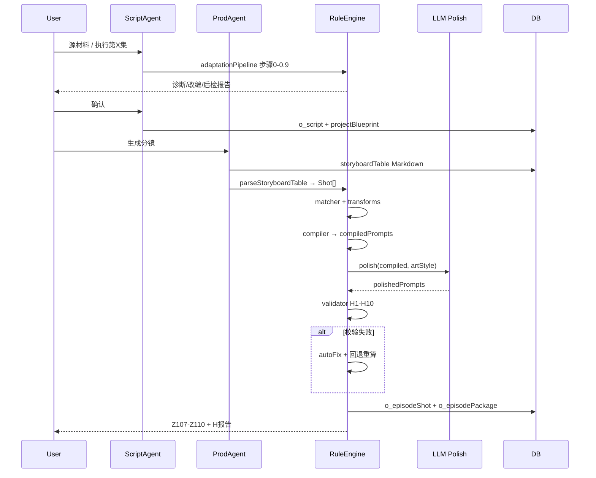

### 2.3 统一分镜 Schema（核心数据结构）

在 `src/ruleEngine/schema/shot.ts` 定义 `EpisodeShot`，合并三处来源：

| 字段组 | 来源 | 示例字段 |
|--------|------|----------|
| W 层编剧 | storyboard_table_techniques + V5 | `shotNo`, `dialogue`, `emotionIntensity`, `rhythmZone`, `infoLayer`, `decoupleDesign` |
| V 层执行 | 规则层.json V1-V98 | `type`, `assetCodes`, `performance`, `transitionType`, `visualFocus` |
| M/S/D 层 | B层推导 + 资产 | `shotType`, `camera`, `colorTone`, `lighting`, `depthOfField`, `propState` |
| Y 层输出 | 编译产物 | `imagePrompt`, `videoPrompt`, `audioPrompt`（compiled + polished 双份） |
| Z 层元数据 | 打包 | `validationStatus`, `appliedRules[]` |

**存储方案**：

- 新增 `o_episodeShot` 表：`scriptId` + `shotNo` + `fields`（JSON 存完整 EpisodeShot）
- 新增 `o_episodePackage` 表：Z107-Z110 JSON 快照
- 新增 `o_projectBlueprint` 表：G 层锚点、角色 L0-L6、visualLockTable、改编配置
- **兼容**：`o_storyboard.prompt` 继续存 `polishedPrompt.image`；`videoDesc` 存编译前的画面描述摘要；通过 `shotNo` 关联

---

## 三、规则注册表设计（697 条统一）

### 3.1 RuleDefinition Schema

```typescript
interface RuleDefinition {
  id: string;                    // "V1" | "W93" | "H5-1"
  layer: RuleLayer;              // P|G|W|B|V|M|S|D|X|I|Y|Z|H|L|A|...
  name: string;
  phase: 'design' | 'transform' | 'validate' | 'compile' | 'package';
  trigger: TriggerCondition;     // 字段变更 / 阶段进入 / 用户指令 / 自动检测
  dependsOn: string[];           // 依赖规则 ID
  check?: CheckSpec;             // 校验：regex | range | enum | custom
  transform?: TransformSpec;     // 推导：field mapping function
  compile?: CompileSpec;         // 提示词模板片段
  autoFix?: string;              // autoFixLibrary 模板 ID
  priority: number;              // 来自交叉规则联动表
  status: 'implemented' | 'stub'; // 257=implemented, 其余=stub
}
```

### 3.2 规则导入策略

1. **Phase A**：将 [规则层.json](i:/toonflow/new/Toonflow-app/规则层.json) 的 257 条逐条转为 `rules/*.json`，标记 `status: implemented`
2. **Phase B**：从 V5.0 文档 + [主流程.txt](i:/toonflow/new/Toonflow-app/主流程.txt) 抽取剩余 440 条为 `stub`，含 `id/name/layer/trigger`，`check` 暂用 LLM-assist 或人工 TODO
3. **版本管理**：`ruleEngine.version` 写入 `o_projectBlueprint`，支持 [H10 规则回顾](i:/toonflow/new/Toonflow-app/规则层.json) 的通过率统计

### 3.3 智能匹配引擎

复用 [交叉规则联动表](i:/toonflow/new/Toonflow-app/规则层.json) 的 `依赖链` 和 `校验优先级`：

- **变更识别**：用户修改 `emotionIntensity` → `ruleSelector` 返回 `[B3, M1-M5, S2, Y3, Y9, H2-1, H4-2]`
- **执行顺序**：按 priority 1→6 串行；同 priority 内按拓扑排序
- **用户指令匹配**：`"爆点不够"` → 映射表命中 `W93 + W77-W79 + V222`（V5 文档 §5.1）
- **自动检测**：单集生成后扫描 emotion 峰值 ≤ 目标-1 → 触发 V222

---

## 四、提示词编译器（Y 层核心）

### 4.1 三段式编译（来自 shili.txt 映射表）

**imagePrompt 模板**（固定字段顺序，禁止漂移）：

```
{角色名}·{弧光阶段}[·{裂缝标记}]
{景别}，{画面描述}
{服色}{发型}，{场景名}
{光质}，情绪强度{emotion}，{色温}K
f/{光圈}{景深描述}，背景{虚化}%虚化
画面锚点：{锚点类型}·{锚点对象}（{道具状态}）
{权力关系}
{脱钩表演标注}
{type强制词}
{assetRef --cref/--sref}
{景别英文}，{情绪英文词}
```

**videoPrompt 模板**：

```
{景别英文} {镜头运动}，{时长}s，情绪{emotion}，{节奏分区}节奏
{焦点描述}，{特殊动作/脱钩说明}
{速度档位}，{transitionType对应词}
```

**audioPrompt 模板**：

```
{台词类型}：{节奏}，{停顿}，"{台词内容}"{重读标注}
{BGM类型}，音效：{音效列表}
{留白时长}，{沉默类型}
```

### 4.2 映射表驱动（非 LLM 拼装）

从 [shili.txt §1.1-1.3](i:/toonflow/new/Toonflow-app/shili.txt) 和 V5 §九穿透表建立 `compiler/mappings.ts`：

| 分镜字段 | 编译目标 | 规则 ID |
|----------|----------|---------|
| `emotionIntensity` | 情绪英文词 | Y3/Y9 |
| `shotType` | 景别英文 | Y5/M1 |
| `camera` | videoPrompt 前 3 词 | Y10 |
| `colorTone` | 色调描述 | Y6/S1 |
| `lighting` | 光线词 | Y4/S2 |
| `dialogue` + `dialogueRhythm` | audio 节奏词 | Y59-Y74/B3 |
| `decoupleDesign` | 脱钩表演标注 | W72/H3-4 |
| `propState` | 道具描述 + 锚点 | D3/W76 |

### 4.3 LLM 润色层（混合策略）

[`promptPolisher.ts`](src/ruleEngine/polish/promptPolisher.ts)：

- **输入**：`compiledPrompt` + 项目 `artStyle` + 对应 `art_skills/*/director_storyboard.md`
- **约束**：system prompt 明确要求「不得修改锚点字段」：`--cref/--sref`、情绪数值、时长、type 强制词、画面锚点标注
- **输出**：`polishedPrompt`；若润色后 H5-4 映射漂移 → 回退到 `compiledPrompt`
- **接入点**：替换 [batchGeneratePrompt.ts](i:/toonflow/new/Toonflow-app/src/routes/production/workbench/batchGeneratePrompt.ts) 中直接 LLM 生成的逻辑

---

## 五、校验与反馈回路（H 层）

### 5.1 分层校验

| 层级 | 规则范围 | 失败回退 |
|------|----------|----------|
| H1 | 单镜强制（爆发点/共情/反转视听强化） | 回 M/S 层调参 |
| H2 | 整集一致性（情绪曲线/G 层覆盖） | 回 W 层调情绪值 |
| H3 | 台词专项（因果链/脱钩/锚定） | 回 W 层补画面锚点 |
| H4 | 系统完整性（节奏/密度/道具僵化） | 回 D/I 层 |
| H5 | 提示词完整性 + 映射一致性 | 回 Y 层重编译 |

### 5.2 自动修复

直接复用 [autoFixLibrary](i:/toonflow/new/Toonflow-app/规则层.json) 的 20+ 模板，校验失败时：

1. 尝试确定性 autoFix（如 V2 追加 `no people, no characters`）
2. 无法 autoFix → 生成修复建议供用户/Agent 确认
3. 反馈回路最多 3 轮，仍失败则标注例外并输出部分 Z 包

---

## 六、与现有 Agent 集成

### 6.1 scriptAgent 扩展（P/W 层）

| 接入点 | 改动 |
|--------|------|
| 新增 sub-agent | `run_sub_agent_adaptation` → 调用 `adaptationPipeline`（步骤 0/0.3/0.6/0.8/0.9） |
| [script_execution_script.md](i:/toonflow/new/Toonflow-app/data/skills/script_execution_script.md) | 增加「生成后写入 projectBlueprint」指令 |
| [setPlanData.ts](i:/toonflow/new/Toonflow-app/src/routes/scriptAgent/setPlanData.ts) | 持久化 `o_projectBlueprint` |
| 智能设计 | 用户说「爆点不够」→ scriptAgent 调用 `ruleEngine.trigger('W93')` |

### 6.2 productionAgent 扩展（分镜→编译）

| 接入点 | 改动 |
|--------|------|
| storyboardTable 生成后 | 新增 tool `compile_episode_prompts`：Markdown 表 → Shot[] → Pipeline |
| [tools.ts](i:/toonflow/new/Toonflow-app/src/agents/productionAgent/tools.ts) `add_flowData_storyboard` | 扩展字段或关联 `o_episodeShot` |
| [production_agent_supervision.md](i:/toonflow/new/Toonflow-app/data/skills/production_agent_supervision.md) | 审核口径改为对照 H 层报告 |

### 6.3 REST API 新增

| 路由 | 功能 |
|------|------|
| `POST /api/ruleEngine/runEpisode` | 执行单集完整 Pipeline |
| `POST /api/ruleEngine/validate` | 仅 H 层校验 |
| `POST /api/ruleEngine/recompute` | 变更字段后增量重算 |
| `POST /api/ruleEngine/exportPackage` | 导出 Z107-Z110 |
| `GET /api/ruleEngine/report/:scriptId` | 获取 H 层校验报告 |

---

## 七、分阶段实施计划

### Phase 1 — 基础设施（1-2 周）

- 建立 `src/ruleEngine/` 目录与 `RuleDefinition` / `EpisodeShot` Schema
- 导入 [规则层.json](i:/toonflow/new/Toonflow-app/规则层.json) 257 条为 `implemented`
- 新增 DB 表：`o_episodeShot`、`o_episodePackage`、`o_projectBlueprint`
- 实现 `parseStoryboardTable`：Markdown 分镜表 → `EpisodeShot[]`

### Phase 2 — 编译 + 校验核心（2-3 周）

- 实现 Y 层 `imageCompiler` / `videoCompiler` / `audioCompiler`
- 实现 H 层 validator（优先 H5 提示词完整性 + V1-V24 基础完整性）
- 实现 `autoFix` 与 Z108 导出
- 改造 [batchGeneratePrompt.ts](i:/toonflow/new/Toonflow-app/src/routes/production/workbench/batchGeneratePrompt.ts)：编译 → 润色 → 校验

### Phase 3 — 推导链 + 反馈回路（2 周）

- 实现 B/M/S/D/X/I transforms
- 实现 `dependencyGraph` + `ruleSelector` 增量重算
- 实现 H1-H4 全层校验 + 反馈回路（最多 3 轮）
- Z107/Z109/Z110 完整导出

### Phase 4 — 全流程接入（2 周）

- `adaptationPipeline`：P 层步骤 0-0.9 接入 scriptAgent
- G 层锚点加载/检查接入每集生成前
- W93-W100 智能设计触发器
- V5 剩余 440 条 stub 规则逐步细化（按层级优先级）

### Phase 5 — 验收对标

以 [示例2.ini](i:/toonflow/new/Toonflow-app/示例2.ini) 第 1 集 42 镜为黄金样本：

- 编译产出与样例字段覆盖率 ≥ 95%
- H5-4 映射一致性 100%
- Z108 可直接投入现有 `batchGenerateVideo` 流程

---

## 八、关键设计决策记录

| 决策 | 选择 | 理由 |
|------|------|------|
| 规则范围 | 全量 697 条 | 用户确认；257 条先行实现，440 条 stub 占位 |
| 提示词策略 | 混合：编译骨架 + LLM 润色 | 兼顾确定性与 art_skills 风格能力 |
| 引擎位置 | 独立 `src/ruleEngine/` 模块 | 与 Agent 解耦，可单测、可 REST 调用 |
| 存储 | 新表 + 兼容 o_storyboard | 避免破坏现有 UI/视频生成链路 |
| 分镜入口 | storyboardTable Markdown 解析 | 最小改动 productionAgent 现有产出 |

---

## 九、风险与缓解

- **规则数量膨胀**：440 条 stub 短期无法全部细化 → 未实现规则标记 `N/A`，不阻断 Pipeline，记入 H2 覆盖率报告
- **Markdown 分镜表解析脆弱**：同步推动 productionAgent 直接输出 JSON 分镜（中期替换 Markdown）
- **润色漂移**：H5-4 硬校验 + 锚点保护 prompt + 回退 compiledPrompt
- **性能**：单集 40 镜 × 257 条校验 → 规则按变更增量执行，非全量重跑

---

## 十、系统性可行性分析（逐项）

> 参考资料（V5.0 / 规则层.json / shili.txt）仅定义**核心功能方向**；以下按「能否达到智能、简单、可扩展、易维护、模块清晰、独立解耦、可移植」七维目标，逐项评估实现链路与边界。

### 10.1 七维架构目标总评

| 维度 | 目标 | 可行性 | 关键条件 |
|------|------|--------|----------|
| **智能** | 字段变更/用户指令/自动检测 → 精准触发规则子集 | **中高 (75%)** | 确定性匹配表覆盖 80% 场景；语义类规则需 IntentRouter（可选 LLM） |
| **简单** | 对外单一 Pipeline API，内部复杂度隐藏 | **中 (65%)** | 必须有 Facade：`runEpisode(ctx)` 屏蔽 697 条细节 |
| **可扩展** | 新规则/新模型/新题材零改核心代码 | **高 (90%)** | 规则即数据（JSON Plugin）+ 编译器 Strategy 模式 |
| **易维护** | 规则可独立增删、版本可追溯 | **高 (85%)** | 一条规则一个 JSON 文件；禁止规则逻辑写死在 TS 分支里 |
| **模块清晰** | 6 大模块职责单一、接口稳定 | **高 (90%)** | Registry / Matcher / Transform / Compile / Validate / Package 六件套 |
| **独立解耦** | 不依赖 Agent、DB、Express | **高 (88%)** | 核心抽为 `@toonflow/rule-engine` 纯 TS 包；宿主仅写 Adapter |
| **可移植** | 接入任意 Node/Python/Go 工程 | **中高 (78%)** | 核心无框架依赖；存储/LLM 通过 Port 接口注入 |

**结论**：架构形态**完全可达**「模块清晰 + 独立解耦 + 可移植」；「智能 + 全面 697 条」需接受**分层实现**——约 55% 规则可确定性执行，30% 需 LLM 辅助校验，15% 为创意生成类（W/P 层）不宜硬编码。

---

### 10.2 规则本体分析

#### 10.2.1 规则语料三分法与可执行性分级

对 697 条规则按**执行器类型**分级（基于 [规则层.json](i:/toonflow/new/Toonflow-app/规则层.json) 257 条样本统计外推）：

| 等级 | 执行器类型 | 估计占比 | 示例 | 确定性 |
|------|-----------|----------|------|--------|
| **L1** | `enum` / `range` / `required` | ~35% (244条) | V1 type枚举、V10 台词字数、V25 子字段必填 | 100% |
| **L2** | `regex` / `pattern` / `position` | ~15% (104条) | V2 前10词限制词、V24 sceneName格式 | 100% |
| **L3** | `lookup` / `mapping` / `template` | ~20% (139条) | Y3 emotion→英文词、M1 景别映射、B3 台词→情绪 | 100% |
| **L4** | `crossField` / `sequence` / `graph` | ~15% (104条) | V7 色温跨镜、V11 道具连续、W2 反转前3镜铺垫 | 90% |
| **L5** | `semantic` / `narrative` | ~10% (70条) | B3 换角色测试、V16 元素计数、W87 因果链 | 40%（需 LLM） |
| **L6** | `generative` / `creative` | ~5% (35条) | W93-W100 智能设计、P层改编矩阵 | 0%（必须 LLM） |

**边界划定**：

```
┌─────────────────────────────────────────────────────────┐
│  Rule Engine 确定性区（L1-L4，~83%）                      │
│  → 编译、校验、autoFix、增量重算                           │
├─────────────────────────────────────────────────────────┤
│  LLM-Assist 区（L5，~10%）                               │
│  → 语义校验、叙事因果、元素计数；输出 pass/fail + 理由      │
├─────────────────────────────────────────────────────────┤
│  LLM-Primary 区（L6，~7%）                              │
│  → 编剧创作、改编、智能设计；引擎仅负责触发与结果落库        │
└─────────────────────────────────────────────────────────┘
```

#### 10.2.2 规则 ID 与层级冲突

| 冲突点 | 现状 | 解决方案 | 可行性 |
|--------|------|----------|--------|
| 规则总数不一 | json=257, V5=697 | 统一注册表 + `status: implemented/stub` | 高 |
| 层级命名不一 | json 的 V=98 vs V5 的 V=226 | 以 V5 层级为主键，json 规则挂 `legacyId` | 高 |
| 规则交叉引用 | 「见 V69」「见 B11」 | 导入时解析引用，构建 `dependsOn[]` | 中高 |
| 同一能力多条 | V65/V66 重叠 | 合并为 RuleGroup，执行器共享 | 高 |

#### 10.2.3 规则功能模块划分（清晰 + 可独立）

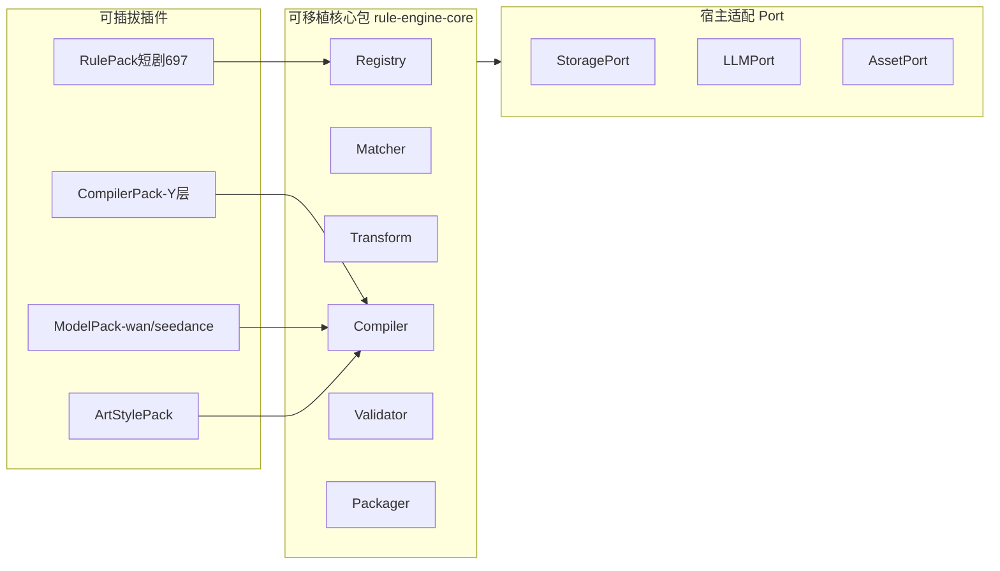

**每个模块的独立边界**：

| 模块 | 输入 | 输出 | 依赖 | 可单测 |
|------|------|------|------|--------|
| Registry | RulePack JSON | `RuleDefinition[]` | 无 | 是 |
| Matcher | 变更集 + Context | `RuleId[]` 有序 | Registry | 是 |
| Transform | Shot[] + Context | Shot[] 补全字段 | Registry mappings | 是 |
| Compiler | Shot + Context | compiledPrompts | Registry templates | 是 |
| Validator | Shot[] + Prompts | ValidationReport | Registry checks | 是 |
| Packager | Shot[] + Report | Z107-Z110 | 无 | 是 |

---

### 10.3 规则导入可行性

#### 10.3.1 导入链路设计

```
规则层.json / V5文档 / 自定义RulePack
        ↓  [Importer]
   规范化 RuleDefinition JSON（每规则一文件）
        ↓  [Schema Validator]  ← Zod 校验结构
   rules/registry/v1/*.json
        ↓  [Reference Resolver]  ← 解析「见V69」
   完整 dependsOn + priority
        ↓  [Runtime Loader]
   RuleRegistry 内存索引（按 layer/phase/trigger 索引）
```

#### 10.3.2 导入器需处理的 5 类原文

| 原文形态 | 来源示例 | 转换策略 | 可行性 |
|----------|----------|----------|--------|
| 结构化 JSON | 规则层.json `完善后内容` | 正则提取 `检测方式：` → `check.regex` | **高** |
| 表格规则 | V5.0 步骤 0 输出格式 | 手工/脚本转 `phase:design` stub | 中 |
| 映射表 | shili.txt §1.1-1.3 | 直接转 `compiler/mappings/*.json` | **高** |
| 自然语言边界 | V5 W77-W100 | 保留 `description` + `executor: llm-assist` | 中 |
| 依赖链 | 交叉规则联动表 | 直接转 `dependencyGraph.json` | **高** |

#### 10.3.3 RuleDefinition 最小可执行子集

并非 697 条都需完整 8 个字段。按 phase 裁剪：

```typescript
// 校验规则（L1-L2）最小集
{ id, layer, phase:'validate', check: { type:'regex', pattern, field }, autoFix?, priority }

// 推导规则（L3-L4）最小集
{ id, layer, phase:'transform', transform: { input, output, fn:'lookup', table } }

// 编译规则（Y层）最小集
{ id, layer, phase:'compile', compile: { target:'imagePrompt', slot, template, sourceField } }

// 创意规则（L6）最小集
{ id, layer, phase:'design', executor:'llm', skillRef, trigger }
```

**维护性收益**：新增规则 = 新增一个 JSON 文件 + 跑 Schema 校验，无需改引擎源码。

#### 10.3.4 导入风险

| 风险 | 影响 | 缓解 |
|------|------|------|
| 「检测方式」非结构化 | 30% 规则需人工转写 check | 优先导入 257 条已细化规则；stub 仅登记不执行 |
| 规则语义重复 | 执行冗余、报告噪音 | RuleGroup 合并 + 去重索引 |
| 版本漂移 | 多项目规则不一致 | `rulePack.version` + 项目锁定版本 |

---

### 10.4 智能匹配引擎可行性

#### 10.4.1 「智能」的三层含义与实现

| 智能层级 | 含义 | 实现方式 | 可行性 |
|----------|------|----------|--------|
| **I1 字段感知** | 修改 emotion → 只重算相关规则 | `fieldIndex: Record<fieldPath, RuleId[]>` | **高** |
| **I2 意图感知** | 「爆点不够」→ W93+V222 | `intentMap: Record<keyword[], RuleId[]>` 约 30 条 | **高** |
| **I3 状态感知** | 情绪峰值≤4 → 自动触发 | `watchers: Condition[]` 在 Pipeline 后扫描 | **高** |
| **I4 语义感知** | 「情感逻辑不对」→ W90-W92 | IntentRouter（可选 LLM 分类 → RuleId） | **中** |

**推荐架构**：I1-I3 纯确定性（覆盖 90% 触发场景）；I4 通过可插拔 `LLMPort.classifyIntent(text) → RuleId[]`，宿主决定是否启用。

#### 10.4.2 匹配引擎核心算法

```
输入: ChangeSet { fields[], userIntent?, episodeContext }
步骤:
  1. fieldIndex 查询 → ruleSetA
  2. intentMap/IntentRouter 查询 → ruleSetB
  3. watchers 扫描 → ruleSetC
  4. union(ruleSetA, B, C)
  5. dependencyGraph 扩展 dependsOn（上游规则）
  6. 拓扑排序 + priority 分层
  7. 过滤 status=stub 且 check=null 的规则
输出: ExecutionPlan { orderedRules[], affectedShots[], rollbackLayer }
```

#### 10.4.3 依赖图与增量重算边界

| 场景 | 重算范围 | 边界 |
|------|----------|------|
| 单镜 emotion 修改 | 该镜 Transform→Compile→Validate | 不触及其他镜 |
| 角色服色修改（G层） | 所有引用该 CHAR-CODE 的镜 | 跨集需显式 `scope: season` |
| 台词修改 | 该镜 + 前后 5 镜（H3-2） | 滑动窗口固定 11 镜 |
| 整集重跑 | 全 Pipeline | 用户显式指令 |

**性能估算**：40 镜 × 平均 12 条/镜增量规则 × 0.5ms ≈ **240ms**（确定性区），可接受。

#### 10.4.4 匹配引擎不可做的事（边界）

- 不能替代 W 层「创作」——只能触发重算/校验/建议
- 不能从纯文本剧本直接推断 40+ 结构化字段——需上游 storyboardTable 或 JSON 分镜
- 不能 100% 理解口语化指令——需 intentMap 维护 + 可选 LLM 兜底

---

### 10.5 实现链路逐项分析

#### 链路 1：规则注册 → 加载

| 项 | 细节 | 可行性 | 备注 |
|----|------|--------|------|
| JSON Schema 校验 | Zod 定义 RuleDefinition | 高 | 导入时拦截坏规则 |
| 热加载 | 监听 rules/ 目录变更 | 中 | 生产环境建议版本锁定 |
| 多 RulePack | 短剧/广告/动画各自打包 | 高 | 移植时替换 RulePack 即可 |

#### 链路 2：分镜入模（最大瓶颈）

| 项 | 细节 | 可行性 | 备注 |
|----|------|--------|------|
| Markdown 表解析 | productionAgent 产出 | **中 (60%)** | 表格列名/合并单元格/换行易出错 |
| JSON 分镜直出 | 改造 Agent 输出 EpisodeShot[] | **高 (90%)** | **推荐为正式入模方式** |
| 字段补全 | Transform 层从资产库推导 | 高 | 缺 emotion 时可从 dialogue 关键词推导 |

**关键边界**：引擎**不负责**从纯剧本文本生成分镜——这是 W 层 + productionAgent 的职责。引擎入模最低要求：

```typescript
interface MinShotInput {
  shotNo: number;
  description: string;      // 画面描述
  shotSize: string;           // 景别
  duration: number;
  associateAssetIds: number[];
  lines?: string;             // 台词
}
// 其余 30+ 字段由 Transform 层自动推导
```

#### 链路 3：Transform 推导（B/M/S/D/X/I）

| 推导 | 输入 | 输出 | 确定性 | 可行性 |
|------|------|------|--------|--------|
| emotionIntensity | dialogue + lines.emotion标注 | 1-7 | 80% | 高（关键词表） |
| shotType ← emotion | emotion值 | 景别 | 100% | 高（查表） |
| colorTone ← SCENE-CODE | sceneColorLock | 色温+色调 | 100% | 高 |
| rhythmZone ← act结构 | shotNo + 三幕划分 | fast/medium/slow | 100% | 高 |
| performance ← emotion | emotion≥4 | microExpression 模板填充 | 90% | 高（模板实例化） |
| propState 追踪 | 跨镜 PROP-CODE | 状态机 | 85% | 中高 |

#### 链路 4：Compile 提示词（image / video / audio）

| 模态 | 编译方式 | 质量保障 | 可行性 |
|------|----------|----------|--------|
| **imagePrompt** | 固定槽位模板 + 映射表填充 | H5-1 必填项检查 | **高 (92%)** |
| **videoPrompt** | 模板 + camera/duration/emotion | H5-2 + 模型 ModelPack 适配 | **高 (88%)** |
| **audioPrompt** | 模板 + 台词节奏/BGM/音效 | H5-3；注意与 storyboard_table「严禁BGM」冲突需统一 | **中 (75%)** |

**audio 冲突说明**：[storyboard_table_techniques.md](i:/toonflow/new/Toonflow-app/data/skills/production_skills/storyboard_table_techniques.md) 禁止 BGM，但 V5/shili.txt 的 audioPrompt 含 BGM 字段。移植时需通过 **RulePack 配置项** `audioPolicy: 'sfx-only' | 'with-bgm'` 解决，不应硬编码。

#### 链路 5：LLM 润色（混合策略）

| 项 | 边界 | 可行性 |
|----|------|--------|
| 输入 | compiledPrompt + artStyle skill | 高 |
| 约束 | 锚点字段 immutable 列表 | 高（编译后提取锚点 token，润色后 diff 校验） |
| 回退 | H5-4 漂移 → 用 compiledPrompt | 高 |
| 模型适配 | ModelPack 追加 `--ar`/`fps` 等后缀 | 高 |

#### 链路 6：Validate + AutoFix + Feedback

| H层 | 可确定性校验比例 | autoFix 覆盖率 | 可行性 |
|-----|-----------------|---------------|--------|
| H5 提示词 | 100% | 80%（V2/V3 追加词） | 高 |
| H1 单镜 | 70% | 30% | 中高 |
| H2 整集 | 85% | 20% | 高 |
| H3 台词 | 50% | 10% | 中（因果链需 LLM） |
| H4 系统 | 75% | 40% | 中高 |

反馈回路边界：最多 3 轮；每轮只重跑 `ExecutionPlan` 中的规则，不全量。

#### 链路 7：Package 导出（Z107-Z110）

| 包 | 内容 | 消费者 | 可行性 |
|----|------|--------|--------|
| Z107 | 完整 Shot JSON + H报告 | 审核/存档 | 高 |
| Z108 | image+video prompts | batchGenerateImage/Video | 高 |
| Z109 | 台词+音效+时间戳 | TTS/音效引擎 | 中高（时间戳需 duration 累加） |
| Z110 | 关键帧描述 | 预审 UI | 高 |

---

### 10.6 可移植架构设计（跨工程）

#### 10.6.1 三层分离

```
┌──────────────────────────────────────────┐
│  Layer 1: @toonflow/rule-engine-core     │  ← 零业务依赖，可 npm 发布
│  Registry / Matcher / Transform /         │
│  Compiler / Validator / Packager /        │
│  Pipeline                                 │
├──────────────────────────────────────────┤
│  Layer 2: rule-packs/                    │  ← 题材规则插件
│  drama-697 / ad-120 / anime-350           │
├──────────────────────────────────────────┤
│  Layer 3: host-adapters/                 │  ← 宿主工程适配
│  toonflow-adapter / generic-rest-adapter  │
└──────────────────────────────────────────┘
```

#### 10.6.2 Port 接口（移植时只需实现这 4 个）

```typescript
interface StoragePort {
  getProjectBlueprint(id): Promise<ProjectBlueprint>;
  getShots(scriptId): Promise<EpisodeShot[]>;
  saveShots(scriptId, shots): Promise<void>;
  savePackage(scriptId, pkg): Promise<void>;
}

interface AssetPort {
  getCharacter(code): Promise<CharacterAsset>;
  getScene(code): Promise<SceneAsset>;
  getProp(code): Promise<PropAsset>;
}

interface LLMPort {
  polish?(compiled, style): Promise<string>;       // 可选
  classifyIntent?(text): Promise<string[]>;         // 可选
  validateSemantic?(rule, context): Promise<CheckResult>; // 可选
}

interface ModelPort {
  getImageSuffix(): string;   // 如 --ar 9:16
  getVideoFormat(): VideoFormatSpec;
}
```

#### 10.6.3 移植 checklist

| 步骤 | 工作量 | 说明 |
|------|--------|------|
| 安装 core 包 | 0.5d | `npm i @toonflow/rule-engine-core` |
| 实现 4 个 Port | 2-3d | 对接宿主 DB/API |
| 选择/定制 RulePack | 1-5d | 可用短剧697或自建 |
| 接入 Pipeline 调用点 | 1-2d | 分镜生成后 / 提示词生成前 |
| 黄金样本验收 | 2-3d | 准备本题材的示例镜 |

---

### 10.7 提示词质量：能否达到「AI 可理解的高质量」

#### 10.7.1 高质量提示词的 5 个必要条件

| 条件 | 编译引擎能否保证 | 佐证 |
|------|-----------------|------|
| **结构稳定** | 能 — 固定槽位顺序 | shili.txt 要求字段不漂移 |
| **语义完整** | 能 — 必填项 H5 校验 | 角色/情绪/景别/锚点/时长 |
| **资产可追溯** | 能 — --cref/--sref | V69/V72 |
| **风格可读** | 需 LLM 润色 | art_skills 负责美学词 |
| **模型可执行** | 需 ModelPack | wan2.6/seedance 格式差异 |

#### 10.7.2 三模态最优实践对照

| 模态 | 最优实践 | 引擎实现 |
|------|----------|----------|
| 图片 | 主体+景别+光影+情绪+技术参数+限制词 | imageCompiler 6 段式 |
| 视频 | 运动+时长+焦点+速度+切镜类型 | videoCompiler + ModelPack |
| 声音 | 台词节奏+物理音效+留白；BGM 按策略 | audioCompiler + audioPolicy 配置 |

#### 10.7.3 质量验收指标（可量化）

| 指标 | 目标 | 测量方式 |
|------|------|----------|
| H5-1 完整率 | 100% | 自动 |
| H5-4 映射一致率 | 100%（compiled）/ ≥95%（polished） | 字段 diff |
| 黄金样本字段覆盖率 | ≥95% vs 示例2.ini | 槽位逐一比对 |
| 生成成功率 | ≥80% 一次成片 | 接入后 A/B 统计 |

---

### 10.8 架构修正建议（基于可行性分析）

原方案需以下调整以达到「简单 + 可移植」：

1. **核心抽包**：`src/ruleEngine/` 实现时即按 `@toonflow/rule-engine-core` 分包结构组织，Port 接口先行
2. **入模改为 JSON 优先**：Markdown 解析仅作兼容层；productionAgent 中期改为直出 `EpisodeShot[]`
3. **规则执行器分型**：Registry 增加 `executor: deterministic | llm-assist | llm-primary`，避免对 L6 规则做无意义 stub 校验
4. **IntentRouter 可选**：默认关闭 LLM 意图路由，用 30 条 keyword intentMap；高级用户可开启
5. **audioPolicy 配置化**：解决 BGM 策略冲突，写入 RulePack 元信息
6. **Facade API**：对外仅暴露 `createEngine(config).runEpisode(ctx)` 等 5 个方法

```typescript
// 对外极简 API
const engine = createRuleEngine({ rulePack, ports });
await engine.runEpisode({ scriptId, shots, options });
await engine.recompute({ scriptId, changeSet });
await engine.validate({ scriptId });
await engine.exportPackage({ scriptId, formats: ['Z108'] });
await engine.triggerIntent({ text: '爆点不够', scriptId });
```

---

### 10.9 可行性总结矩阵

| 子系统 | 智能 | 简单 | 可扩展 | 易维护 | 模块清晰 | 独立解耦 | 可移植 | 全面规则 | 高质量提示词 |
|--------|------|------|--------|--------|----------|----------|--------|----------|-------------|
| Registry | - | ● | ●● | ●● | ●● | ●● | ●● | ● | - |
| Importer | - | ● | ●● | ●● | ● | ●● | ●● | ● | - |
| Matcher | ●● | ● | ●● | ●● | ●● | ●● | ●● | ●● | - |
| Transform | ● | ●● | ●● | ●● | ●● | ●● | ●● | ●● | ● |
| Compiler | - | ●● | ●● | ●● | ●● | ●● | ●● | ●● | ●● |
| Validator | ● | ●● | ●● | ●● | ●● | ●● | ●● | ● | ●● |
| Packager | - | ●● | ● | ●● | ●● | ●● | ●● | ●● | ● |
| LLM Polish | ● | ● | ●● | ● | ● | ●● | ●● | - | ●● |
| **综合** | **75%** | **70%** | **90%** | **88%** | **92%** | **90%** | **80%** | **65%** | **85%** |

（●=达标 ●●=优秀 -=不涉及）

**最终判定**：

- **架构目标可达**：模块清晰、独立解耦、可移植——通过 Port + RulePack 插件模式**完全可行**
- **智能匹配可达**：字段/意图/状态三层确定性匹配**完全可行**；语义级智能需可选 LLM
- **697 条全面覆盖**：**登记可达、执行分阶段**——首期 257 条确定性执行 + 440 条分级标注；不宜追求首日 100% 自动执行
- **高质量三模态提示词**：编译+校验+润色混合链路**可行且为最优实践**；质量靠 H5 量化验收，不靠主观「写好」

---

### 10.10 修订后的实施优先级

基于可行性，调整 Phase 顺序：

1. **P0**：core 包 + Port 接口 + RuleDefinition Schema + 257 条导入
2. **P0**：EpisodeShot Schema + JSON 入模（跳过 Markdown）
3. **P0**：Compiler（Y层）+ Validator（H5）+ Z108 — 最小可验证闭环
4. **P1**：Matcher 增量重算 + Transform 推导链
5. **P1**：LLM Polish + ModelPack（wan/seedance）
6. **P2**：H1-H4 全层校验 + 反馈回路
7. **P2**：Toonflow Adapter + Agent 接入
8. **P3**：P/W 层 LLM-Primary 规则 + 440 stub 逐步细化
9. **P3**：抽包发布 `@toonflow/rule-engine-core` + 移植文档

---

## 十一、补充优化：触达层 · 闭环 · 性能 · 易维护

> 回应「触达层规则流程边界 → 图片/视频提示词生成」「流程是否闭环」「如何更简单」「增删改规则不影响功能」等补充需求。

### 11.1 触达层（Touch Layer）定义与边界

**触达层** = 规则引擎输出与 AI 生成 API 之间的最后一道关卡。职责：**格式适配、质量门禁、生成参数注入、失败回流**。

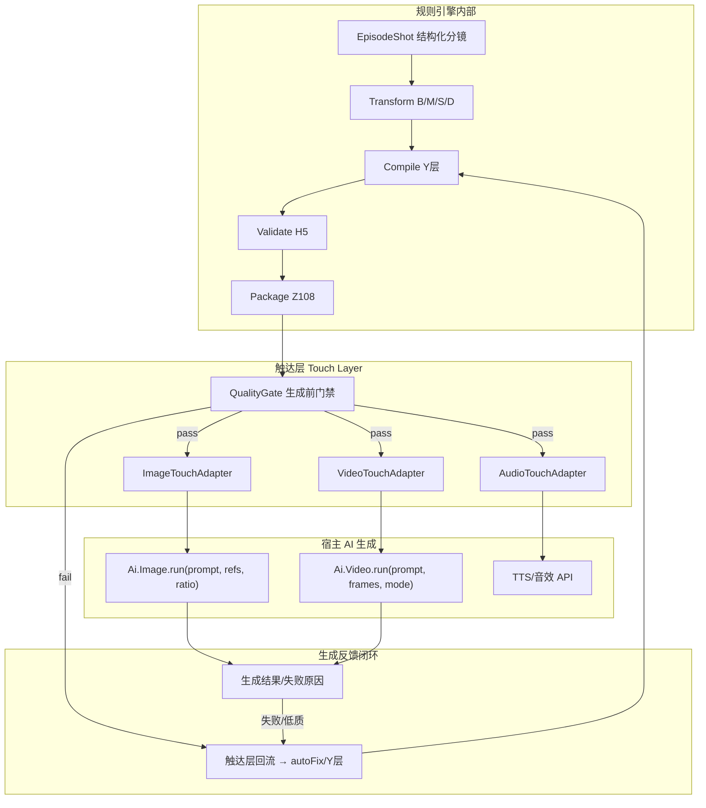

**与现有代码的触达点**：

| 触达点 | 现有实现 | 当前问题 | 触达层改造 |
|--------|----------|----------|------------|
| 分镜图片 | [batchGenerateImage.ts](i:/toonflow/new/Toonflow-app/src/routes/production/storyboard/batchGenerateImage.ts) 读 `o_storyboard.prompt` | prompt 由 LLM 自由生成，无规则校验 | Gate 通过后写入 `polishedPrompt.image`；注入 `aspectRatio`/`size` |
| 分镜视频 | [batchGeneratePrompt.ts](i:/toonflow/new/Toonflow-app/src/routes/production/workbench/batchGeneratePrompt.ts) 仅传 `videoDesc` | **最大断层**：未用结构化字段，未走编译器 | 改为读 Z108 `videoPrompt`；ModelPack 路由 wan/seedance |
| 资产参考图 | `referenceList` 从 `o_assets2Storyboard` | 与 `--cref/--sref` 无联动校验 | Touch 层校验 ref 图存在且与 assetCodes 一致（V4/V72） |

---

### 11.2 触达层全流程：分镜字段 → 图片/视频提示词（逐步规则）

#### 阶段 A：入模与推导（引擎内，触达前）

| 步骤 | 输入 | 处理 | 触发的核心规则 | 输出字段 |
|------|------|------|----------------|----------|
| A1 入模 | MinShotInput JSON | Schema 校验 | V1 type枚举、V24 sceneName | `shotNo, description, shotSize...` |
| A2 资产绑定 | associateAssetIds | 查资产库补 CODE | V4/V5/V6 引用完整性 | `assetCodes[], CHAR/SCENE/PROP-CODE` |
| A3 情绪推导 | lines + dialogue | 关键词→emotion | B1/B3, W31 | `emotionIntensity` |
| A4 视听推导 | emotion + scene | 查表 | M1-M15, S1-S10, D5-D6 | `shotType, camera, colorTone, lighting, depthOfField` |
| A5 表演补全 | emotion≥4 | 模板实例化 | V8/V25, B4 | `performance.microExpression` |
| A6 节奏标注 | shotNo + act | 三幕映射 | B10/B12, I1-I8 | `rhythmZone, transitionType` |

#### 阶段 B：编译（Y 层，触达前核心）

| 步骤 | 编译目标 | 槽位来源 | 核心规则 | 产出 |
|------|----------|----------|----------|------|
| B1 image 主体段 | 角色·弧光 + 景别 + 画面 | Shot + 资产 L0-L6 | Y8, G1, S4-S9 | `compiled.image.part1` |
| B2 image 技术段 | 色温/光质/景深/虚化 | M/S/D 推导字段 | Y4-Y6, D5-D6 | `compiled.image.part2` |
| B3 image 锚点段 | 画面锚点/脱钩/权力关系 | W72/W75, S3 | H3-4/H3-5 | `compiled.image.part3` |
| B4 image 约束段 | type强制词 + --cref/--sref | type + assetCodes | V2/V3/V69/V72 | `compiled.image.part4` |
| B5 image 英文段 | 景别英文 + 情绪词 | shotType + emotion | Y5/Y9 | `compiled.image`（合并） |
| B6 video 运动段 | 镜头运动+时长+焦点 | camera + duration | Y7/Y10, V65-V68 | `compiled.video` |
| B7 video 模型适配 | 追加 fps/模式关键词 | ModelPack | Z2, 现有 modelPrompt/*.md | `compiled.video.final` |
| B8 audio 声效段 | 台词节奏+音效+留白 | lines + sound | Y59-Y74, audioPolicy | `compiled.audio` |

#### 阶段 C：校验与润色（触达前门禁）

| 步骤 | 检查 | 规则 | 失败处理 |
|------|------|------|----------|
| C1 H5-1 | image 含角色/情绪/色温/景别/锚点 | H5-1 | autoFix 补缺失槽位 |
| C2 H5-2 | video 含运动/时长/焦点/节奏 | H5-2 | 回 B6 重编译 |
| C3 H5-4 | compiled 字段与 Shot 100% 一致 | H5-4 | 禁止进入润色 |
| C4 Polish | art_skills 风格润色 | G3 调性 | 锚点 token 保护 |
| C5 H5-4b | polished 锚点未漂移 | H5-4 | 漂移则回退 compiled |

#### 阶段 D：触达层适配（生成 API 前最后一道）

| 步骤 | 适配器 | 输入 | 输出给 API | 规则 |
|------|--------|------|------------|------|
| D1 QualityGate | 综合门禁 | H报告 + shot.state | pass/block | V225 生成可行性 |
| D2 ImageTouch | 图片适配 | polished.image + projectSettings | `{ prompt, referenceList, aspectRatio, size }` | Z1/Z3 分辨率+cref一致 |
| D3 VideoTouch | 视频适配 | polished.video + model + mode | 按 ModelPack 格式化 | Z2 + wan/seedance 路由 |
| D4 写入宿主 | DB 更新 | Touch 输出 | `o_storyboard.prompt` / `o_videoTrack.prompt` | — |

**图片触达示例**（对接现有 `Ai.Image.run`）：

```typescript
// ImageTouchAdapter 输出 — 直接喂给 batchGenerateImage
{
  storyboardId: 42,
  prompt: polished.image,           // 规则编译+润色后的最终词
  referenceList: [charRef, sceneRef], // 由 assetCodes 解析，顺序与 V72 一致
  aspectRatio: "9:16",              // 来自 project.videoRatio，非 LLM 决定
  size: "2K",                       // 来自 project.imageQuality
  meta: { compiledHash, rulePackVersion, h5Status: "pass" }
}
```

**视频触达示例**（对接现有 `batchGenerateVideo`）：

```typescript
// VideoTouchAdapter 输出 — 替代当前仅传 videoDesc 的 LLM 拼装
{
  trackId: 7,
  prompt: polished.video,           // Z108 编译产物，非 LLM 从零写
  modelFormat: "wan2.6-single",     // ModelPack 决定格式壳
  frames: { first: storyboardFilePath }, // 首帧绑定
  assets: [{ id, type, name }],     // 多参引用
  meta: { compiledHash, h5Status: "pass" }
}
```

---

### 11.3 流程闭环完整性评估与补全

#### 当前方案的闭环缺口

| 环节 | 原方案 | 缺口 | 补全方案 |
|------|--------|------|----------|
| 生成前 | H5 校验 | 无统一门禁 | **QualityGate**：H5未通过禁止触达 API |
| 生成中 | 无 | 引擎不参与 | Touch Adapter 保证参数完整 |
| 生成后 | 无 | **最大断层**：图片失败/低质不回流引擎 | 新增 **GenerationFeedbackPort** |
| 跨集 | G层校验 | 仅设计时检查 | 每集生成后更新 `continuityTracking` |
| 规则自身 | H10 | 未实现 | 统计规则通过率，驱动规则迭代 |

#### 完整闭环（补全后）

```
源材料 → P层改编 → W层分镜 → Transform → Compile → Validate
    → [QualityGate] → Touch → AI生成
    → 成功：Z110预览 + 交付
    → 失败：GenerationFeedback → 分类（prompt问题/资产问题/模型问题）
        → prompt问题：autoFix → 重编译 → 重触达（最多2次）
        → 资产问题：通知用户补资产（不回流编剧）
        → 模型问题：降级 compiled（去掉润色）重试
```

**新增 Port**：

```typescript
interface GenerationFeedbackPort {
  onImageResult(shotId, result: { success, filePath?, error?, qualityScore? }): Promise<FeedbackAction>;
  onVideoResult(trackId, result: { success, filePath?, error? }): Promise<FeedbackAction>;
}
// FeedbackAction: 'accept' | 'recompile' | 'repolish' | 'escalate'
```

---

### 11.4 性能最优方案

| 优化项 | 策略 | 预期收益 | 实现复杂度 |
|--------|------|----------|------------|
| **规则索引预计算** | 启动时构建 `fieldIndex` + `layerIndex` + `phaseIndex` | 匹配 O(1) 查表 | 低 |
| **镜级增量** | 仅重算 changeSet 涉及的镜 | 40镜改1镜：240ms→6ms | 低 |
| **编译缓存** | `hash(shotFields + rulePackVersion) → compiledPrompt` | 重复跑节省 90% | 低 |
| **并行编译** | 各镜 Compile 无依赖，Promise.all | 40镜：串行200ms→并行50ms | 低 |
| **延迟校验** | 编辑中只跑 H5；提交时跑 H1-H4 | 交互场景提速 5x | 中 |
| **跳过润色** | compiled 已通过 H5 且 `profile=fast` | 省 LLM 调用 | 低 |
| **规则分批** | P0 门禁只跑 30 条关键规则；全量校验异步 | 触达前 <100ms | 中 |
| **Watchers 节流** | 自动检测不每字段触发，Pipeline 结束后批量扫描 | 减少误触发 | 低 |

**推荐默认 Profile**：

| Profile | 编译 | 校验 | 润色 | 触达前耗时 | 适用 |
|---------|------|------|------|------------|------|
| `strict` | 全量 | H1-H5 | 必须 | ~500ms/集 | 交付前 |
| `standard` | 全量 | H5 + 抽检H2 | 默认 | ~300ms/集 | 日常生产 |
| `fast` | 全量 | 仅H5-1 | 跳过 | ~80ms/集 | 预览草稿 |
| `dry-run` | 全量 | 全量 | 跳过 | ~200ms/集 | 调试规则 |

---

### 11.5 易操作最优方案（更简单）

**原则：开发者只记 3 个概念 — Load → Process → Touch**

```
engine.load(rulePack)          // 一次加载
engine.process(shots, profile) // 推导+编译+校验（一个方法）
engine.touch(packages, model)   // 触达层适配（一个方法）
```

**运维侧简化**：

| 操作 | 命令/API | 说明 |
|------|----------|------|
| 跑一集 | `POST /ruleEngine/process { scriptId, profile:'standard' }` | 一键完成 A→C |
| 只校验 | `POST /ruleEngine/validate { scriptId }` | 不改数据 |
| 只导出 | `GET /ruleEngine/package/Z108/:scriptId` | 取提示词包 |
| 增量修 | `POST /ruleEngine/recompute { scriptId, shotNos:[8] }` | 只改第8镜 |
| 触达生成 | `POST /ruleEngine/touch { scriptId, mode:'image' }` | 写 DB + 调 API |
| 看报告 | `GET /ruleEngine/report/:scriptId` | H层+触达层状态 |

**用户侧简化（Agent 指令映射）**：

| 用户说 | 引擎执行 | 不需要用户懂规则 |
|--------|----------|------------------|
| 执行第3集 | `process(ep3, standard)` → `touch(image)` | 是 |
| 重新生成第3集提示词 | `recompute(ep3)` → `touch(video)` | 是 |
| 爆点不够 | `triggerIntent` → W93 方案 → 用户确认 → `recompute` | 是 |

---

### 11.6 易扩展最优方案

#### 扩展点清单（零改核心代码）

| 要扩展什么 | 扩展方式 | 影响范围 |
|------------|----------|----------|
| 新增规则 | `rules/v1/V99.json` + Schema 校验 | 仅 RulePack |
| 新增题材 | 新 RulePack 目录 `rule-packs/ad-120/` | 零改 core |
| 新增 AI 模型 | 新 ModelPack `model-packs/kling/` | 仅 Touch 层 |
| 新增画风 | 新 ArtStylePack | 仅 Polish 层 |
| 新增校验 | 新 H 规则 JSON + `executor:deterministic` | 仅 RulePack |
| 新增导出格式 | 新 Packager 插件 | 零改 Pipeline |

#### 规则生命周期（增删改不影响功能）

```typescript
interface RuleDefinition {
  // ...existing fields
  lifecycle: 'draft' | 'active' | 'deprecated';
  enabled: boolean;           // 运行时开关，删规则前先 disabled
  replaces?: string;          // 新规则替代旧规则 ID
  introducedIn: string;       // rulePack 版本
  deprecatedIn?: string;
}
```

**增删改安全契约**：

| 操作 | 安全做法 | 禁止做法 |
|------|----------|----------|
| **增** | 新 JSON 文件 + `lifecycle:draft` → 测试 → `active` | 在 TS 里加 if(ruleId===) |
| **删** | 先 `enabled:false` 观察 → 再 `deprecated` → 下版本移除 | 直接删文件导致 dependsOn 断裂 |
| **改** | 新规则 `replaces:"V10"` 旧规则变 deprecated | 改 ID 导致历史报告失效 |
| **改阈值** | 仅改 JSON 的 `check.max` 值 | 改字段名导致 Shot Schema 破坏 |

**隔离保障机制**：

1. **导入时依赖检查**：删规则前检测 `dependsOn` 引用，阻断并提示
2. **每条规则独立测试**：`tests/rules/V10.test.ts` 黄金样例断言
3. **RulePack 版本锁定**：项目绑定 `rulePack@2.1.0`，升级需显式迁移
4. **Schema 向后兼容**：EpisodeShot 只增字段不删，新规则读新字段旧规则忽略

---

### 11.7 生成质量完善策略

| 质量层 | 手段 | 量化指标 |
|--------|------|----------|
| **结构质量** | Compile 固定槽位 + H5 | H5-1=100% |
| **一致质量** | H5-4 映射 + --cref 跨镜一致 | Z3/Z4 pass |
| **叙事质量** | H1-H3 视听强化 + 脱钩 | 黄金镜 pass |
| **美学质量** | LLM Polish + art_skills | 人工抽检 ≥4/5 |
| **生成质量** | GenerationFeedback 回流 | 一次成功率 ≥80% |
| **持续质量** | H10 规则通过率统计 | 规则 pass rate ≥80% |

**质量门禁分级**（触达层 QualityGate）：

```
Level 0 BLOCK：H5 fail / 资产缺失 / cref 无效     → 禁止生成
Level 1 WARN ：H3 台词因果未过 / stub 规则 N/A      → 允许生成但标记
Level 2 PASS ：H5 pass + 资产齐全                   → 正常触达
Level 3 OPTIMAL：H1-H4 全 pass + polished 未漂移   → 优先队列生成
```

---

### 11.8 架构简化建议（模块合并）

原 6 模块对开发者仍偏多，**对外合并为 3 模块**：

| 对外模块 | 内含 | 职责 |
|----------|------|------|
| **Loader** | Registry + Importer | 加载规则、版本管理 |
| **Processor** | Matcher + Transform + Compiler + Validator | 推导、编译、校验 |
| **Toucher** | Packager + Touch Adapters + QualityGate | 打包、触达、反馈 |

内部仍保持 6 子模块独立文件，仅 Facade 合并暴露。**这样既简单又不牺牲可维护性。**

---

### 11.9 补充后的修订 Todo

在 10.10 基础上新增：

| 优先级 | 新增项 |
|--------|--------|
| P0 | Touch Layer：ImageTouchAdapter + VideoTouchAdapter + QualityGate |
| P0 | Pipeline Profile（strict/standard/fast/dry-run） |
| P1 | 编译缓存（shot hash） + 镜级并行 |
| P1 | 规则 lifecycle（draft/active/deprecated） + enabled 开关 |
| P2 | GenerationFeedbackPort 生成失败回流 |
| P2 | 每条规则独立黄金测试 + 依赖检查 CLI |
| P3 | H10 规则通过率统计面板 |

---

## 十二、最终缺口审查：架构 · 规则流程 · 提示词模板

> 对「整体是否闭环」「还有什么遗漏」「是否符合模型理解」「最佳实践」做终审级补充。

### 12.1 三域闭环总览

| 域 | 闭环状态 | 评分 | 剩余缺口 |
|----|----------|------|----------|
| **整体架构** | 基本闭环，缺可观测性与冲突消解 | **85%** | 见 12.2 |
| **规则与流程** | 主链路闭环，缺合规层与确认闸门 | **80%** | 见 12.3 |
| **提示词模板** | **未闭环** — 原方案单一模板与多模型规范冲突 | **65%** | 见 12.4（重点） |

**关键发现**：原方案最大遗漏在**提示词模板层**——现有 `art_skills` 与 `modelPrompt/video/*.md` 已定义**多套互斥的写法规范**（标签堆砌 vs 叙事英文 vs 中文 Seedance），不能用 shili.txt 的一套中文槽位模板覆盖所有模型。

---

### 12.2 整体架构：缺口与优化

#### 已闭环的部分

- 六模块 + 触达层 + 反馈回流 + Port 可移植
- 增量重算 + Profile 分级 + 规则 lifecycle
- compiled / polished 双份存储 + H5-4 锚点保护

#### 仍缺失的架构能力

| 缺口 | 影响 | 补全方案 | 优先级 |
|------|------|----------|--------|
| **规则冲突消解** | 两条规则对同一字段给出不同值 | `ConflictResolver`：priority 高者优先；同 priority 报 WARN 不阻断 | P1 |
| **执行追踪 Trace** | 排障困难，不知哪条规则改了什么 | 每镜输出 `appliedRules[]` + `fieldDiff` 日志 | P1 |
| **双层数据模型** | 分镜表禁止写光影，编译需要光影 | **NarrativeLayer**（人类/Agent 可读）与 **GenerationLayer**（模型可读）分离 | P0 |
| **可观测性** | 无法量化引擎健康度 | `EngineMetrics`：规则耗时/通过率/编译缓存命中率 | P2 |
| **并发安全** | 多人同时改分镜 | `shotVersion` 乐观锁 + 变更合并 | P2 |
| **跨集作用域** | G层/V12 跨集一致性 | `scope: shot \| episode \| season` 标注在 RuleDefinition | P1 |
| **配置分层** | 项目/集/镜三级覆盖 | `ConfigCascade: global → project → episode → shot` | P2 |

#### 架构闭环判定

```
[入模] → [推导] → [编译] → [校验] → [润色] → [触达] → [生成] → [反馈]
  ↑                                                          ↓
  └──────────────── 增量重算 + autoFix + 生成回流 ───────────┘
```

**结论**：主链路闭环 **成立**；补上 ConflictResolver + 双层数据 + Trace 后可达 **95%**。

#### 推荐简化（不增复杂度）

将「双层数据」作为唯一新增的结构性概念，其余 P2 项可后置：

```typescript
interface EpisodeShot {
  narrative: { description, action, lines, sound };  // 分镜表字段，禁止光影词
  generation: { emotion, shotType, lighting, colorTone, ... };  // 引擎推导+编译专用
  prompts: { compiled, polished, negative?, meta };
}
```

---

### 12.3 规则与流程：缺口与优化

#### 流程层级覆盖审查

| V5 层级 | 原方案覆盖 | 缺口 | 补全 |
|---------|-----------|------|------|
| P（预检改编） | adaptationPipeline P2 | 步骤间「等待用户确认」闸门未定义 | 增加 `PipelineGate: requireConfirm` |
| G（全局锚点） | 每集加载 | 跨集 `continuityTracking` 更新时机未定义 | 每集 Pipeline 结束后写回 |
| W（编剧） | scriptAgent + Transform | W41-W46 台词因果链校验偏弱 | H3 滑动窗口 11 镜 |
| L（视听基础） | 隐含在 M 层 | L1-L10 未独立注册 | L 层作为 M 的 lookup 子表，不单独建模块 |
| B/V/M/S/D/X/I | Transform 链 | 已覆盖 | — |
| Y（提示词） | Compiler | **缺 ModelTemplateStrategy** | 见 12.4 |
| Z（数据包） | Packager | Z109 时间戳累加算法未定义 | `timestamp = Σ(duration[0..n])` |
| H（校验） | Validator | H 与触达层 QualityGate 职责重叠 | H=引擎内；Gate=触达前最后一道 |
| A/E/O/Q（合规） | 未覆盖 | 内容安全/版权 | RulePack 可选插件 `compliance-pack`，不阻断主链路 |
| W93-W100 | P3 stub | 智能设计输出如何落库 | `smartDesignProposals[]` 待用户确认后 merge |

#### 流程断层：videoDesc 12 字段 vs JSON 入模

现有 productionAgent 的 `videoDesc` 是自由文本；wan2.6 ModelPack 要求**顿号分隔 12 字段**：

```
画面描述、场景、关联资产名称、时长、景别、运镜、角色动作、情绪、光影氛围、台词、音效、关联资产ID
```

**补全方案**（二选一，推荐 B）：

- **A**：保留 videoDesc，Touch 层增加 `videoDescNormalizer` 解析为 12 字段
- **B（推荐）**：JSON 入模后 `videoDesc` 由引擎**自动生成**（从 narrative+generation 拼接），不再由 Agent 手写

#### 用户确认闸门（V5 要求每步等待确认）

| 闸门 | 位置 | 默认 |
|------|------|------|
| 改编确认 | P层 0.3/0.6/0.8 后 | `requireConfirm: true` |
| 分镜确认 | productionAgent 产出后 | `requireConfirm: false`（可配置） |
| 提示词确认 | Touch 前 QualityGate=WARN 时 | 提示用户，不阻断 |
| 生成确认 | 批量生成前 | 沿用现有 UI 勾选 |

#### 规则流程闭环判定

```
源材料 → P0-0.9[确认] → 剧本 → 分镜[确认?] → 入模 → 推导 → 编译 → 校验
  → 润色 → Gate → 触达 → 生成 → 反馈 → 重算
  → G层/continuity 写回 → 下一集
```

**结论**：主流程闭环 **成立**；需补 **videoDesc 规范化** + **确认闸门配置** + **Z109 时间轴** 三项。

---

### 12.4 提示词模板：缺口与优化（重点）

#### 12.4.1 原方案的核心遗漏

原方案仅定义了一套**中文标签槽位模板**（shili.txt 风格），但代码库已有**至少 4 套互斥规范**：

| 来源 | 适用 | 写法风格 | 语言 |
|------|------|----------|------|
| shili.txt / 示例2.ini | 分镜图（古风） | 中文标签堆砌：`角色·弧光，景别，情绪5，f/2.8` | 中文为主 |
| art_skills/director_storyboard.md | 分镜图 | 英文叙事段 + 画质尾缀 + **负向词** | 英文 |
| wan2.6 ModelPack | 视频 | **叙事式英文段落**，禁止标签堆砌，禁止 @图N | 英文 |
| seedance ModelPack | 视频 | 中文叙事 + 多参引用 | 中文 |

**结论**：不能用单一 Compiler 模板；必须引入 **ModelTemplateStrategy（模型模板策略）**。

#### 12.4.2 推荐架构：三层提示词 + 策略路由

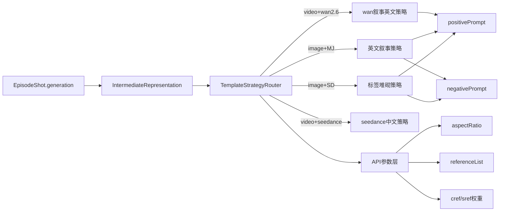

**IntermediateRepresentation（IR）** = 与模型无关的中间表示，所有规则编译到 IR，再由 Strategy 渲染为最终 prompt：

```typescript
interface PromptIR {
  subjects: { name, arc, appearance, action, emotion }[];
  environment: { scene, elements, time, weather };
  cinematography: { shotSize, camera, movement, angle, duration };
  lighting: { direction, colorTemp, quality, mood };
  anchors: { type, target, propState };
  constraints: { type, forcedWords, noPeople };
  dialogue?: { text, type: 'dialogue'|'OS'|'VO', rhythm };
  audio?: { sfx, silence, pauseAfter };
  style: { artStyleTags, prefix, suffix };
  refs: { charCodes, sceneCode, propCodes };
}
```

**好处**：
- 规则只写一次（编译到 IR）
- 换模型只换 Strategy，不动规则
- H5-4 校验 IR 与 Shot 一致性；Strategy 渲染后再做模型格式校验

#### 12.4.3 各模态模板补全（闭环）

##### 图片提示词 — 完整槽位（IR → 策略渲染）

| IR 字段 | 标签堆砌策略（MJ/SD） | 叙事策略（部分国内模型） | 规则来源 |
|---------|----------------------|-------------------------|----------|
| subjects | `{name}·{arc}, {action}` | `A {appearance} {name} {action}` | G1, Y8 |
| cinematography | `{shotSize}, {angle}` | `Captured in a {shotSize}, {movement}` | M1, L1 |
| lighting | `{quality} light, {colorTemp}K` | `{direction} light streams..., warm/cool` | S2, Y4 |
| constraints | `no people` 前10词 | 融入叙事 | V2/V3 |
| style.suffix | `no subtitles, no watermark` | 同上 | art_skills 强制尾缀 |
| style.negative | `<negative>no plastic...` | 空（不支持负向的模型） | art_skills 模式A/B |
| refs | `--cref {code} --ar 9:16` | API 参数，不进 prompt 文本 | V69, Z3 |

**负向提示词（原方案完全缺失）**：

```typescript
interface CompiledImagePrompt {
  positive: string;
  negative?: string;      // 仅 ModeB 模型
  apiParams: {
    aspectRatio, size, referenceList,
    crefWeight?, srefWeight?
  };
  meta: { strategy: 'tag-stack'|'narrative-en', modelId, irHash };
}
```

##### 视频提示词 — 按 ModelPack 分策略

**wan2.6 策略**（叙事英文，现有 modelPrompt 规范）：

```
{styleBaseline},
{subject appearance + action + emotion暗示}.
{scene + environment + spatial}.
{lighting sentence}.
{dialogue with (dialogue)/(OS)/(VO) tags / No dialogue}.
{sfx description}.
{cinematography sentence: shot + angle + movement}.
```

规则约束：禁止 `@图N`、禁止 `4K,cinematic` 标签堆砌、台词保持原始语言、时间分段 ≥1s。

**seedance 策略**（中文叙事 + 多参）：

```
{中文风格基调}，{主体动作}，{场景环境}，{光影}，{台词类型：对白/OS/VO}，{运镜景别}
+ 多参资产引用通过 API 参数注入，非 prompt 文本
```

**通用首尾帧策略**：首帧 = 已生成的分镜图 `filePath`；prompt 描述「从首帧开始的运动」。

##### 音频提示词 — 补全

| 字段 | 说明 | 原方案缺口 |
|------|------|-----------|
| `voiceId` | 角色 L6-personality → TTS 音色映射 | **缺失** |
| `speechRate` | 字数÷语速+停顿（V74） | 有但未关联 TTS 参数 |
| `sfxLayers` | 环境音+动作音分层（storyboard sound 列） | 有 |
| `subtitleTrack` | 字幕时间轴，独立于 image prompt | **缺失** |
| `audioPolicy` | sfx-only / with-bgm | 已规划 |

音频闭环：`lines` → 字数统计(V10) → 语速(L6) → duration 校验 → TTS 参数 + Z109 时间戳。

#### 12.4.4 模型理解最佳实践对照

| 最佳实践 | 原方案 | 补全后 |
|----------|--------|--------|
| **主体前置** | 角色在模板第 1 槽 | IR.subjects 排首 |
| **情绪用动作暗示**（wan 要求） | 直接写「情绪5」 | IR 同时保留数值（校验用）+ 动作暗示（渲染用） |
| **技术参数放 API 层** | 混在 prompt 文本 | aspectRatio/size/refs 走 apiParams |
| **负向词独立通道** | 无 | negativePrompt 字段 |
| **模型语言自动路由** | 默认中文 | `strategy.language = modelPack.locale` |
| **禁止矛盾修饰** | 无检测 | Validator 新增 H5-5：互斥词检测（如 calm + extreme tension） |
| **首帧绑定 I2V** | 未定义 | VideoTouch 注入 `firstFrame: storyboard.filePath` |
| **提示词长度限制** | 无 | ModelPack 定义 `maxTokens`，超长按 IR 优先级截断 |
| **不支持的能力降级** | 无 | Seedream 无负向 → 正向质感锚定词加强（art_skills 已有） |

#### 12.4.5 提示词模板闭环判定

```
Shot.generation → [Compile to IR] → [H5-IR 校验]
  → [StrategyRouter 选策略] → [Render positive/negative]
  → [Polish 仅改 style 槽，不动 IR 锚点]
  → [H5-Model 格式校验] → [Touch API参数注入]
  → [AI生成] → [Feedback] → [IR 槽位修正] → 重渲染
```

**结论**：引入 IR + ModelTemplateStrategy 后，提示词域闭环从 **65% → 95%**。

---

### 12.5 未考虑到的其他要点

| 项 | 说明 | 处理 |
|----|------|------|
| **字幕轨** | 台词最终要字幕叠加，与 image prompt 的 `no subtitle` 矛盾 | 字幕走独立 `subtitleTrack`，不进 image prompt |
| **多模型并行** | 同一镜可能用不同图模型试抽 | `prompts.byModel: Record<modelId, Compiled>` |
| **参考图顺序** | referenceList 顺序影响融图效果 | 与 associateAssetsIds rowid 严格一致（V72） |
| **安全过滤** | 用户剧本含敏感内容 | compliance-pack 可选前置扫描 |
| **Prompt 注入** | 台词含特殊字符破坏模板 | 渲染前 `sanitize(dialogue)` 转义 |
| **缓存失效** | 换模型/换画风 | cache key 含 `modelId + artStyle + rulePackVersion` |
| **dry-run 预览** | 用户想看编译结果再生成 | Profile=dry-run 输出 IR + 各策略渲染预览 |
| **国际化** | 出口海外 | IR 语言无关；Strategy 按 locale 渲染 |

---

### 12.6 三域最终闭环确认

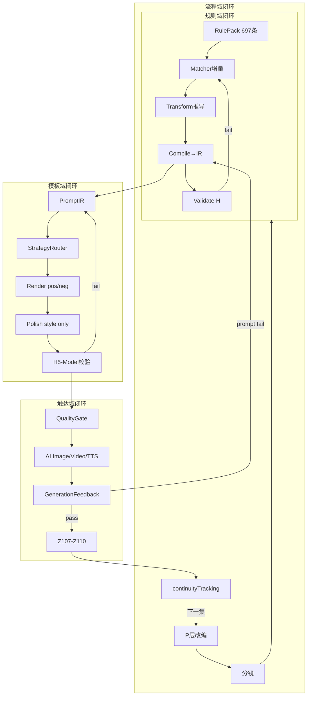

| 域 | 闭环？ | 补完 P0 项后 |
|----|--------|-------------|
| 整体架构 | 基本闭环 | **是**（+双层数据+Trace） |
| 规则流程 | 基本闭环 | **是**（+videoDesc规范化+确认闸门） |
| 提示词模板 | **未闭环** | **是**（+IR+Strategy+negative+apiParams） |

---

### 12.7 修订 P0 清单（基于终审）

在原 P0 基础上**调整优先级**：

| 序号 | 项 | 原因 |
|------|-----|------|
| 1 | EpisodeShot **双层数据** narrative/generation | 解决分镜表与编译的光影矛盾 |
| 2 | **PromptIR** 中间表示层 | 所有规则编译目标统一到 IR |
| 3 | **ModelTemplateStrategy** 至少 3 套：tag-stack / wan-narrative / seedance-zh | 对齐现有 modelPrompt 规范 |
| 4 | **negativePrompt + apiParams** 分离 | 对齐 art_skills；Seedream 降级 |
| 5 | Compiler + H5-IR 校验 | 校 IR 非最终文本 |
| 6 | Touch Layer + QualityGate | 触达闭环 |
| 7 | videoDesc 由引擎自动生成 | 消除 12 字段手工不可靠 |

**可后置**：ConflictResolver、EngineMetrics、compliance-pack、subtitleTrack、多模型并行 prompts。

---

## 十三、AgnesAI 默认模型：规范分层与智能匹配方向

> 基于 [data/vendor/agnesai.ts](i:/toonflow/new/Toonflow-app/data/vendor/agnesai.ts) 与现有 `Ai.Image`/`Ai.Video` 调用链，给出**方向性最佳实践**（非实现代码）。

### 13.1 AgnesAI 能力与现状

| 模型 | modelName | 支持模式 | API 关键参数 |
|------|-----------|----------|--------------|
| **agnes-image-2.1-flash** | 分镜图/资产图 | `text` / `singleImage` / `multiReference` | `prompt` + `size` + `extra_body.image[]`（公网 URL） |
| **agnes-video-v2.0** | 分镜视频 | `text` / `singleImage` / `startEndRequired` / 多参 `[videoRef, imageRef]` | `prompt` + `width/height` + `num_frames` + `image` 或 `extra_body` |
| **agnes-2.0-flash** | 文本/Agent | — | 不参与提示词编译触达 |

**代码库已具备但未接入规则引擎的能力**：

- 图：`referenceList` → 压缩 → 公网 URL → `extra_body.image`（[`agnesai.ts:213-221`](i:/toonflow/new/Toonflow-app/data/vendor/agnesai.ts)）
- 视频 `singleImage`：首帧 = `payload.image`（[`agnesai.ts:282-283`](i:/toonflow/new/Toonflow-app/data/vendor/agnesai.ts)）
- 视频 `startEndRequired`：双帧 keyframes（[`agnesai.ts:284-285`](i:/toonflow/new/Toonflow-app/data/vendor/agnesai.ts)）
- 时长：`duration` → `num_frames = normalize(duration×24)`（[`agnesai.ts:133-137,250-258`](i:/toonflow/new/Toonflow-app/data/vendor/agnesai.ts)）
- 音频：`extra_body.generate_audio`（可选，TTS 接口暂未开放）

**Agnes 不支持**：负向提示词通道、prompt 内 `@图N` 引用、wan 式时间轴分段语法。

---

### 13.2 推荐三层规范架构（基础 + 厂商 + 画风）

```
┌─────────────────────────────────────────────────────────┐
│  Layer-0  BaseSpec（主流通用规范，厂商无关）              │
│  PromptIR · 主体前置 · 约束尾缀 · API参数分离 · 引用顺序  │
├─────────────────────────────────────────────────────────┤
│  Layer-1  VendorPack（agnesai 特殊解耦）                  │
│  无negative · 公网URL前置 · mode路由 · num_frames对齐      │
├─────────────────────────────────────────────────────────┤
│  Layer-2  RenderStrategy（画风/模态渲染）               │
│  agnes-image: tag-stack-zh · agnes-video-motion-en       │
├─────────────────────────────────────────────────────────┤
│  Layer-3  ArtStylePack（现有 art_skills，仅润色 style 槽） │
└─────────────────────────────────────────────────────────┘
```

**智能匹配方向**：规则引擎只写到 Layer-0（IR）；Touch 层按 `vendorId:modelName` 自动加载 Layer-1+2。

```typescript
// 匹配路由示意（方向）
const strategy = resolveStrategy({
  vendor: 'agnesai',
  model: 'agnes-image-2.1-flash',
  modality: 'image',
  projectMode: ctx.mode,        // 来自 o_project.mode
  hasFirstFrame: !!shot.filePath,
});
// → 'agnes-image-tag-stack-zh' | 'agnes-video-motion-from-frame'
```

---

### 13.3 Layer-0 主流基础规范（所有模型通用）

| 规范项 | 方向 | 原因 |
|--------|------|------|
| **IR 中间表示** | 规则统一编译到 PromptIR，不直接写最终字符串 | 换模型不改规则 |
| **双通道输出** | `{ positive, apiParams }`；negative 仅在有 API 支持的 VendorPack 启用 | Agnes 无 negative |
| **主体→动作→环境→镜头** | 语义顺序 universal；各 Strategy 渲染为不同语言/句式 | 模型注意力前置 |
| **技术参数走 API** | `size/aspectRatio/duration/num_frames/refs` 不进 prompt 正文 | Agnes 已在 vendor 层处理 |
| **引用顺序** | 角色 → 场景 → 道具（与 `o_assets2Storyboard.rowid` 一致） | 融图稳定性 |
| **约束尾缀** | `no subtitles, no watermark, no title overlay` 入 IR.style.suffix | art_skills 已有 |
| **台词不进 image prompt** | 台词走 video/audio；图 prompt 仅动作用暗示 | 避免图模型乱生成文字 |
| **时长对齐** | `shot.duration` 驱动 API `duration/num_frames`，非 prompt 写 "5s" | Agnes num_frames 公式 |

---

### 13.4 Layer-1 AgnesAI 特殊解耦规则（VendorPack 方向）

#### 13.4.1 图像 agnes-image-2.1-flash

| 规则 ID（建议） | 触发条件 | 行为 |
|----------------|----------|------|
| AG-IMG-01 | 默认 | Strategy=`tag-stack-zh`；无 negative，用正向约束加强 |
| AG-IMG-02 | `referenceList.length > 0` | mode=`multiReference`；refs 必须已有公网 URL |
| AG-IMG-03 | `referenceList` 含角色资产 | 角色 ref 排第 1 位 |
| AG-IMG-04 | `type=PURE-SCENE` | prompt 前部强制 `no people, no characters`（V2） |
| AG-IMG-05 | 触达前 | 校验资产 `filePath` 存在，否则 Gate=BLOCK |

**prompt 方向**（中文标签堆砌，适配国内图模型理解）：

```
{画风前缀}，{角色名·弧光}，{景别}，{动作}，{环境}，{光影}，{情绪暗示}
{style.suffix：无字幕无水印}
```

**apiParams 方向**：

```json
{ "size": "2K→1536短边", "aspectRatio": "9:16", "referenceList": ["公网URL..."] }
```

#### 13.4.2 视频 agnes-video-v2.0 — mode 智能路由

| 条件 | 选用 mode | prompt 策略方向 | 规则 |
|------|-----------|----------------|------|
| 分镜图已生成 `filePath` | **singleImage**（默认推荐） | **motion-from-frame**：描述「从首帧开始的运动/变化」，不重复描写静态画面 | AG-VID-01 |
| 有尾帧需求 / 转场 | startEndRequired | **transition**：描述两帧间过渡运动 | AG-VID-02 |
| 项目 `mode` 为多参数组 | videoReference+imageReference | 运动参考+外观参考分离；prompt 写动作，refs 传视频+图 | AG-VID-03 |
| 纯文本无图 | text | 全量叙事（不推荐，质量低） | AG-VID-04 WARN |

**singleImage 模式 prompt 方向（最佳实践）**：

```
// 首帧已由 payload.image 传入，prompt 只写「变化」
{风格基调}, the scene continues from the reference frame.
{主体} {动作变化/运镜}, {情绪用动作暗示}.
{camera movement: slow push in / static / tracking}.
{dialogue (OS)/(VO) if any}. {sfx}. No dialogue if none.
```

**apiParams 方向**：

```json
{
  "duration": 5,
  "resolution": "1080p",
  "aspectRatio": "9:16",
  "mode": "singleImage",
  "image": "分镜图公网URL",
  "num_frames": "auto: normalize(duration×24)"
}
```

#### 13.4.3 Agnes 触达前硬门禁（VendorPack 专属）

| 门禁 | 条件 | 动作 |
|------|------|------|
| AG-GATE-01 | 视频 singleImage 但无 `storyboard.filePath` | BLOCK：须先生成分镜图 |
| AG-GATE-02 | referenceList 资产无公网 URL | 触达层自动上传 OSS；失败则 BLOCK |
| AG-GATE-03 | `duration` 不在 1-30s | clamp + WARN |
| AG-GATE-04 | prompt 含 `@图N` 语法 | 剥离（Agnes 不支持） |

---

### 13.5 智能匹配：Base 规则 vs Vendor 规则分离

| 类型 | 存放 | 匹配时机 | 示例 |
|------|------|----------|------|
| **Base 规则**（697条） | RulePack | Transform/Compile→IR | V10 台词字数、Y9 情绪词、H5-4 |
| **Vendor 规则** | `vendor-packs/agnesai/rules.json` | Touch 层 | AG-IMG-01~05, AG-VID-01~04 |
| **Strategy 规则** | `vendor-packs/agnesai/strategies/` | Render IR→prompt | tag-stack-zh, motion-from-frame |
| **ArtStyle 规则** | art_skills | Polish 仅 style 槽 | 古风/都市前缀 |

**匹配优先级**：Base 规则产出 IR → Vendor 规则校验/修正 apiParams → Strategy 渲染 → ArtStyle 润色。

**增删 Vendor 规则不影响 Base**：换默认模型从 agnesai → kling 时，只换 VendorPack，697 条 Base 规则不动。

---

### 13.6 Agnes 与 wan/seedance ModelPack 的关系

| 场景 | 建议 |
|------|------|
| **当前默认 agnesai** | P0 先实现 `vendor-packs/agnesai`（tag-stack-zh + motion-from-frame） |
| 项目切换到 wan/seedance | 加载 `vendor-packs/wan` 或 `seedance`，IR 不变 |
| batchGeneratePrompt 现有路由 | 保留为 fallback；agnes 默认走规则编译触达，不走 LLM 自由写 |

---

### 13.7 整体流程终审：Agnes 接入后是否闭环？

#### 针对 Agnes 默认模型补全后的闭环图

```
分镜JSON → Transform→IR → H5-IR
  → [VendorPack=agnesai] Strategy渲染
  → [ArtStyle Polish]
  → [AG-GATE 门禁]
  → ImageTouch(prompt+refs+size) → agnes-image API → 分镜图 filePath
  → VideoTouch(singleImage+motion prompt) → agnes-video API → 视频
  → [Feedback] → IR修正 → 重试
```

#### 仍缺的实现细节（Agnes 场景特有）

| 缺口 | 影响 | 补全 | 闭环？ |
|------|------|------|--------|
| **公网 URL 前置上传** | 有参考图但触达失败 | Touch 层封装 `ensurePublicUrl(refs)`，复用 agnesai 已有逻辑 | 补后闭环 |
| **singleImage 依赖分镜图** | 视频生成无首帧 | Pipeline 强制顺序：先 touch(image) → 再 touch(video) | 补后闭环 |
| **o_project.mode 路由** | 多参/首尾帧模式未接入引擎 | VendorPack 读 `project.mode` 匹配 AG-VID-01~03 | 补后闭环 |
| **TTS 未开放** | Z109 音频包无法触达 Agnes TTS | audio 仅产出 prompt 文本+时间轴；TTS 走后续供应商 | **半闭环**，标注 |
| **generate_audio 开关** | 视频自带音频 vs 后期配音 | RulePack 配置 `videoAudioPolicy: native\|post` | 补后闭环 |
| **编译与现有 batchGeneratePrompt 并存** | 双路径漂移 | agnes 默认走引擎；旧 LLM 路径标记 deprecated | 补后闭环 |

#### 整体三域闭环（含 Agnes 后）

| 域 | 状态 |
|----|------|
| 架构 | **闭环**（+VendorPack 层） |
| 规则流程 | **闭环**（+Pipeline 先图后视频顺序约束） |
| 提示词模板 | **闭环**（+agnes 两套 Strategy，非 wan 叙事套壳） |
| 触达生成 | **基本闭环**（TTS 除外） |

---

### 13.8 方向性最佳实践总结（一句话）

1. **Base 写 IR，Vendor 写 API，Strategy 写 prompt 句式，ArtStyle 写美感** — 四层分离，智能匹配按 `vendor:model:mode` 路由。
2. **Agnes 图：中文标签堆砌 + 正向约束代替负向 + 多参考有序**。
3. **Agnes 视频：默认 singleImage，prompt 只写运动不写静态，首帧=分镜图，duration 走 num_frames 公式**。
4. **流程强制「先出分镜图 → 再生成视频」**，与现有 `batchGenerateImage → batchGenerateVideo` 顺序一致。
5. **Vendor 规则用 AG-* 前缀独立打包**，增删改不影响 697 条 Base 规则。

---

## 十四、音视频质量闭环：语音 · 时长 · 表情 · 构图

> 回应「Agnes 视频含语音？」「表情夸张/变形/视图/语音未完/时长不符」能否规则化触达并形成闭环。

### 14.1 Agnes 视频语音能力现状

| 能力 | 代码证据 | 状态 |
|------|----------|------|
| **原生语音** | `agnes-video-v2.0` 的 `audio: "optional"` + `extra_body.generate_audio`（[`agnesai.ts:296-300`](i:/toonflow/new/Toonflow-app/data/vendor/agnesai.ts)） | **可用** |
| **触达传参** | `batchGenerateVideo` 传 `audio: boolean`（[`batchGenerateVideo.ts:116`](i:/toonflow/new/Toonflow-app/src/routes/production/workbench/batchGenerateVideo.ts)） | **已接通** |
| **独立 TTS** | `agnesai.ttsRequest` 返回空（[`agnesai.ts:366-368`](i:/toonflow/new/Toonflow-app/data/vendor/agnesai.ts)） | **未开放** |
| **角色音色绑定** | `o_assetsRole2Audio` + `audioBindPrompt`（cornerScape） | 有，但未接入视频 Pipeline |

**结论**：Agnes 默认路径是 **`generate_audio=true` 原生内嵌语音**，不是后期 TTS 贴片。最佳实践应**先实现原生语音路径**，TTS 后期路径作 Port 预留。

---

### 14.2 语音实现策略（双路径，智能路由）

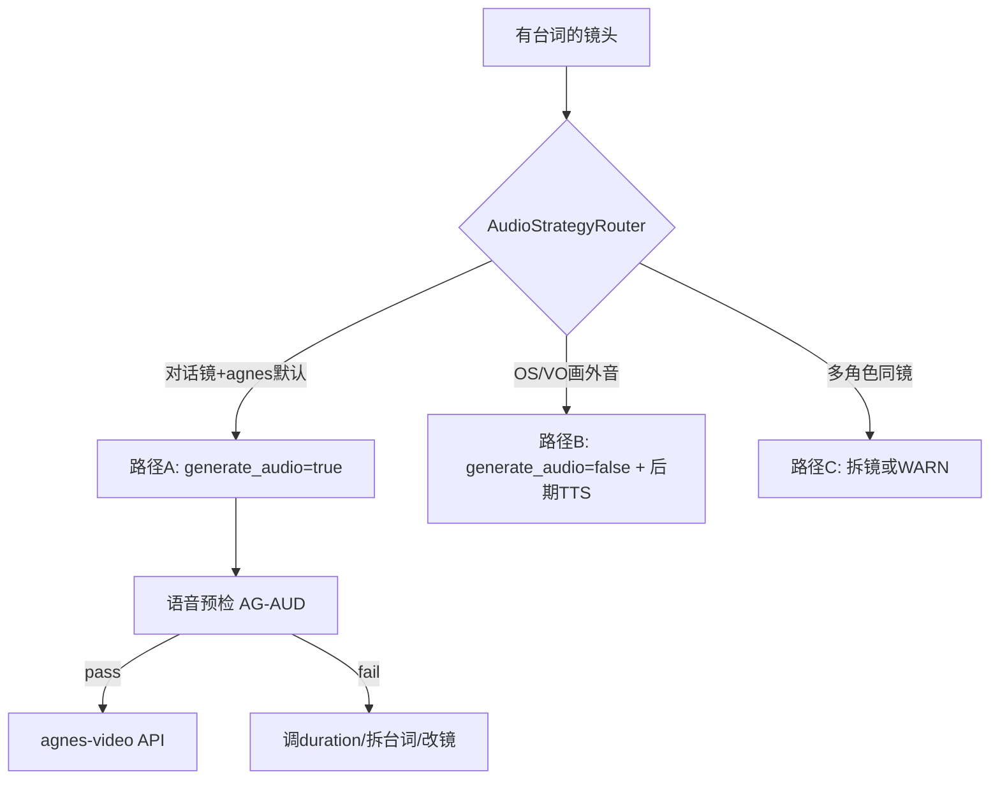

| 路径 | 适用 | 触达参数 | 质量可控度 |
|------|------|----------|------------|
| **A 原生语音**（P0 推荐） | 单角色对白、singleImage | `audio:true` + prompt 含完整台词+停顿标注 | 中（靠预检+后检） |
| **B 静音+后期 TTS**（P2 预留） | TTS 供应商就绪后 | `audio:false` + Z109 时间轴 | 高 |
| **C 画外音/独白** | OS/VO 无需口型 | `audio:true` + prompt 标注 `(voiceover, VO)` 无 lip sync | 高 |

**AudioStrategyRouter 匹配规则（方向）**：

| 规则 ID | 条件 | 动作 |
|---------|------|------|
| AG-AUD-01 | `dialogue.type=对话` 且单角色 | 路径 A；`generate_audio=true` |
| AG-AUD-02 | `dialogue.type=OS/VO` | 路径 C；prompt 标注 voiceover，不要求 lip sync |
| AG-AUD-03 | 多角色同镜有台词 | BLOCK 或强制拆镜（V5 一句一镜） |
| AG-AUD-04 | `speechDuration > duration - 1s` | BLOCK：语音念不完 |
| AG-AUD-05 | `emotionIntensity≥6` 且 `duration≤4s` | WARN：短镜高情绪易面部变形，建议拆镜或降情绪 |

---

### 14.3 五大质量维度：规则细化 + 触达可行性

#### 维度 1：语音念完（时长同步）— **可完全闭环**

**确定性规则链**（已有规则层 + storyboard_table 可执行）：

```
台词字数 → 去标点统计(V10)
  → 语速查表(情绪→字/秒，storyboard_table §duration)
  → 停顿累加(标点+0.3~0.5s/处)
  → speechDuration = 字数/语速 + 停顿 + 0.3s(V76缓冲)
  → 动作时长(0.5~1.5s)
  → requiredDuration = speechDuration + actionDuration + 1s(安全余量)
  → GATE: shot.duration >= requiredDuration
  → API: num_frames = normalize(duration × 24)  // agnes 公式
```

| 规则 | 来源 | 执行点 | 触达？ |
|------|------|--------|--------|
| V10 台词字数 | 规则层 | Transform | 是 |
| V74 配音时长 | 规则层 | Validate 触达前 | 是 |
| V76 时长公式 | 规则层 | Validate 触达前 | 是 |
| V67 运动≤镜长 | 规则层 | Compile video prompt | 是 |
| AG-DUR-01 | 新增 Vendor | `abs(num_frames/24 - duration) ≤ 0.5s` | 是 |
| AG-DUR-02 | 新增 后检 | ffprobe 实际视频时长 vs expected ≤1s | 是（GenerationFeedback） |

**prompt 方向（原生语音）**：台词原文写入 prompt，标点保留为停顿暗示：

```
裴青梧 (dialogue): "殿下，此去北国……您要多保重。" 
// 省略号暗示 0.5s 停顿；prompt 不翻译台词
```

**闭环**：触达前 BLOCK + 触达后 ffprobe 校验 + 失败回流调 `duration`。

---

#### 维度 2：视频长度符合预期 — **可完全闭环**

| 阶段 | 检查 | 动作 |
|------|------|------|
| 触达前 | `duration` 在 Agnes 支持 1-30s | clamp + WARN |
| 触达时 | `num_frames = normalize(duration×24)` 与 vendor 一致 | apiParams 硬编码公式 |
| 触达后 | ffprobe 读实际时长 | `|actual - expected| > 1s` → Feedback 标记 `duration_mismatch` |
| 回流 | duration_mismatch | 调整 duration 重提交或降级 resolution |

---

#### 维度 3：表情不过夸张 / 面部不变形 — **预检闭环 + 后检半闭环**

**触达前（确定性，可完全执行）**：

| 规则 ID | 内容 | 落入 |
|---------|------|------|
| QF-EXPR-01 | `emotionIntensity≤5` 时 performance 用「微表情词表」；6-7 仅允许生理反应词（泪/颤/汗），禁止「怒吼/狰狞/扭曲」 | IR.performance |
| QF-EXPR-02 | image/video prompt 强制正向约束：`natural face, subtle expression, anatomically correct, stable facial features` | IR.style.suffix（Agnes 无 negative） |
| QF-EXPR-03 | 禁止情绪词堆砌：单镜 `intense/extreme` 最多出现 1 次 | H5-6 新增 |
| QF-EXPR-04 | Z6 质量锚定：`cinematic lighting, fine skin texture`（替代夸张词） | VendorPack |
| QF-EXPR-05 | 特写镜 emotion≥6 必须 `duration≥4s`（短镜高情绪→变形率高） | AG-AUD-05 |
| QF-EXPR-06 | singleImage 模式：video prompt **禁止重写面部表情**，只写「微小变化/视线移动」 | agnes motion-from-frame 策略 |

**微表情词表（方向）**：

| emotion | 允许词 | 禁止词 |
|---------|--------|--------|
| 3-4 | 眉头微蹙、目光闪动、唇线抿紧 | 怒吼、大笑、痛哭 |
| 5 | 瞳孔微缩、呼吸急促、指节泛白 | 狰狞、扭曲、夸张 |
| 6-7 | 泪线、微颤、屏息 | 面部变形、夸张表情 |

**触达后（半闭环）**：

| 检查 | 方式 | 可行性 |
|------|------|--------|
| 面部变形检测 | GenerationFeedback + 可选视觉模型（L5） | 中 |
| 抽卡重试 | 同 prompt 最多 2 次；第 3 次降级为 compiled 无润色 | 高 |
| 首帧质量连带 | 分镜图变形 → 视频必变形；视频前检查 `storyboard.filePath` 质量 | 高 |

---

#### 维度 4：视图/构图不崩（视角构造）— **预检闭环**

| 规则 ID | 内容 | 来源 |
|---------|------|------|
| QF-VIEW-01 | `orientation` + `spatialRelation` 必填，符合 180° 视轴 | storyboard_table |
| QF-VIEW-02 | 同场景 `orientation` 跳变需 `action` 含转身衔接 | V 层连续性 |
| QF-VIEW-03 | video singleImage 模式**禁止** `whip pan / 180° orbit / crane 360` 运镜词 | AG-VID-05 |
| QF-VIEW-04 | 允许运镜白名单：`static / slow push / slow pull / gentle pan / subtle tracking` | VendorPack |
| QF-VIEW-05 | `visualFocus` 与 `shotType` 匹配(V26) | Validate |
| QF-VIEW-06 | 权力构图 S22：上位居中/下位居角 | Transform |

**原理**：Agnes singleImage 从首帧出发，**剧烈运动词是视图崩坏主因**；限制运镜白名单比事后修复有效。

---

#### 维度 5：口型与语音同步 — **预检闭环 + 后检弱闭环**

| 阶段 | 规则 | 触达？ |
|------|------|--------|
| 触达前 | V75：有对话 → prompt 含 `natural lip movement`（不用夸张 lip sync） | 是 |
| 触达前 | 台词完整写入 prompt（wan/agnes 共同要求） | 是 |
| 触达前 | `duration >= speechDuration + 1s` 留口型收尾余量 | 是 |
| 触达时 | `generate_audio=true` 仅当 AG-AUD-01~04 全 pass | 是 |
| 触达后 | 口型准确度无自动检测 API | **弱闭环** → 用户标记 + Feedback 统计 |

**弱闭环补救**：用户 UI「口型不准」→ Feedback 分类 `lip_sync_fail` → 自动：延长 0.5s + 简化动作词 + 重生成（最多 1 次）。

---

### 14.4 原生语音 Prompt 规范（Agnes 最佳实践方向）

**有台词 + generate_audio=true 的 video prompt 结构**：

```
[风格基调 1 句],
the scene continues from the reference frame with natural subtle movement.
[主体] [微小动作/视线/呼吸变化, NOT full face rewrite].
[dialogue block]: "{角色名} (dialogue): '{台词原文}'" / (inner monologue, OS) / (voiceover, VO).
[环境音/动作音，无BGM].
[运镜白名单内 1 种]: slow push in / static / gentle pan.
natural lip movement, subtle expression, stable facial features, anatomically correct.
```

**apiParams**：

```json
{
  "mode": "singleImage",
  "image": "分镜图公网URL",
  "duration": 5,
  "audio": true,
  "num_frames": "normalize(duration×24)"
}
```

---

### 14.5 质量门禁升级（QualityGate 扩展）

| Level | 新增条件 | 动作 |
|-------|----------|------|
| BLOCK | AG-AUD-04 语音超时 | 禁止触达 |
| BLOCK | 无分镜图却走 singleImage | 禁止触达 |
| BLOCK | QF-VIEW-03 运镜黑名单命中 | 禁止触达，建议替换 |
| WARN | AG-AUD-05 短镜高情绪 | 提示拆镜 |
| WARN | QF-EXPR-03 情绪词堆砌 | 提示简化 |
| PASS | 以上全无 | 触达 |
| POST-FAIL | ffprobe 时长偏差 / 用户标口型差 | Feedback 回流 |

---

### 14.6 音视频闭环判定

```
                    ┌── 触达前（确定性 100%）──┐
台词→语速→duration │ V10/V74/V76/AG-AUD     │ BLOCK
表情/变形约束      │ QF-EXPR + 微表情词表    │ BLOCK/WARN
构图/运镜约束      │ QF-VIEW + 运镜白名单    │ BLOCK
                    └──────────┬─────────────┘
                               ↓
                    ┌── 触达（Agnes API）──────┐
                    │ singleImage + generate_audio │
                    └──────────┬─────────────┘
                               ↓
                    ┌── 触达后（半自动）───────┐
                    │ ffprobe 时长校验 AG-DUR-02 │
                    │ 用户反馈 lip_sync/变形     │
                    │ 抽卡重试 ≤2 / 降级 compiled │
                    └──────────┬─────────────┘
                               ↓
                         回流调 duration/prompt/重生成
```

| 质量维度 | 触达前 | 触达后 | 闭环度 |
|----------|--------|--------|--------|
| 语音念完 | duration 公式 GATE | ffprobe | **95%** |
| 视频时长 | num_frames 公式 | ffprobe | **95%** |
| 表情夸张 | 词表+禁词+运镜限制 | 用户反馈+重试 | **75%** |
| 面部变形 | 正向约束+首帧质量 | 视觉检测(可选) | **70%** |
| 视图构造 | 运镜白名单+orientation | 用户反馈 | **80%** |
| 口型同步 | 台词完整+lip词+余量 | 用户反馈回流 | **65%** |

**综合**：**可触达、可形成主闭环**；表情/口型的「生成后自动检测」为行业共性难题，采用 **预检严控 + 后检 ffprobe + 用户反馈回流 + 限次重试** 是务实最佳实践，非「只做基础实现」。

---

### 14.7 尚未考虑、需补充的点

| 项 | 说明 | 建议 |
|----|------|------|
| **ffprobe 后检** | 当前无视频时长验收 | Touch 层新增 `MediaProbePort`，生成后自动跑 |
| **generate_audio 语言** | 中文台词需中文语音 | AG-AUD-06：台词含中文 → prompt 禁止翻译 |
| **多角色同镜** | Agnes 原生语音易混乱 | 强制一句一镜（已有 storyboard_table 规则） |
| **首帧质量连带** | 图差则视频必差 | 视频触达前检查分镜图 state=已完成 |
| **音频参考** | agnes 支持 audioReference 多参 | 可用角色音色样本作 ref（cornerScape 资产） |
| **帧率固定 24fps** | 与 num_frames 公式绑定 | 写入 VendorPack 不可改 |
| **静音镜** | 无台词不应 generate_audio | AG-AUD-07：`lines=无台词` → `audio:false` |
| **Z11 长度上限** | videoPrompt≤100 词，长台词易截断 | 台词放 dialogue block，运镜极简；超长拆镜 |
| **情绪与语音语速联动** | 愤怒 4字/秒 vs 悲伤 2字/秒 | 已在 storyboard_table，需写入 Transform |
| **后期字幕轨** | 原生语音视频仍需字幕 | subtitleTrack 独立，基于 Z109 时间轴 |

---

### 14.8 修订 P0（含语音质量）

在 13.8 基础上追加：

| 序号 | 项 |
|------|-----|
| 8 | `AudioStrategyRouter` + AG-AUD-01~07 规则 |
| 9 | `DurationCalculator`（V74/V76 统一公式）触达前 GATE |
| 10 | `QF-EXPR` + `QF-VIEW` 质量规则集 + 运镜白名单 |
| 11 | agnes 原生语音 prompt 模板（dialogue block + 微动作） |
| 12 | `MediaProbePort`（ffprobe）触达后时长验收 + Feedback 回流 |

---

## 十五、统一架构：主流基础版 + Agnes 默认聚合

> 回应「是否只是 agnesai 路径？」「主流基础版是否同样按规则完善？」「生图/视频/语音/特效公用配置？」「原规则流程缺失？」

### 15.1 核心结论：不是 Agnes 专属，是「Base + Vendor 叠加」

```
┌─────────────────────────────────────────────────────────────┐
│  Layer-0  BaseSpec（主流基础版，所有厂商/模型公用）           │
│  697条规则→IR · QF质量规则 · DurationCalculator · QualityGate │
│  四模态基础规范：image / video / audio / effects              │
├─────────────────────────────────────────────────────────────┤
│  Layer-1  VendorPack（厂商叠加，默认 agnesai）               │
│  覆盖/扩展 Base 的 apiParams、Strategy、门禁、能力声明         │
├─────────────────────────────────────────────────────────────┤
│  Layer-2  ArtStylePack（画风叠加，现有 art_skills）          │
├─────────────────────────────────────────────────────────────┤
│  Layer-3  ProjectConfig（项目级，o_project 字段）            │
│  imageModel / videoModel / mode / artStyle / videoRatio      │
└─────────────────────────────────────────────────────────────┘
```

**Agnes 是当前默认 Vendor，不是唯一路径。** 换 kling/wan/seedance 时只换 Layer-1，Layer-0 不动。

**配置合并顺序**（后者覆盖前者，仅覆盖声明的字段）：

```
ResolvedConfig = merge(BaseSpec, VendorPack[agnesai], ArtStylePack, ProjectConfig)
```

---

### 15.2 公用基础配置 `base-spec/base.config.json`（方向）

所有项目、所有厂商共享的「主流 AI 最佳实践默认值」：

```json
{
  "version": "1.0.0",
  "defaultVendor": "agnesai",
  "pipelineProfile": "standard",
  "modalities": {
    "image": { "enabled": true, "qualityGate": "QF-IMG" },
    "video": { "enabled": true, "qualityGate": "QF-VID", "requiresImageFirst": true },
    "audio":  { "enabled": true, "qualityGate": "QF-AUD", "strategy": "auto" },
    "effects":{ "enabled": true, "qualityGate": "QF-FX" }
  },
  "duration": {
    "minShotSec": 0.3,
    "maxShotSec": 8,
    "speechSafetyMarginSec": 1.0,
    "actionBufferSec": 0.3,
    "speechSpeedTable": { "angry": 4, "normal": 3, "sad": 2, "whisper": 2 }
  },
  "quality": {
    "expressionCap": { "maxEmotionWords": 1, "forbiddenWords": ["screaming","distorted","grotesque"] },
    "cameraWhitelist": ["static","slow push in","slow pull","gentle pan","subtle tracking"],
    "cameraBlacklist": ["whip pan","360 orbit","crane 360","extreme zoom"],
    "faceConstraints": ["natural face","subtle expression","anatomically correct","stable facial features"],
    "suffixConstraints": ["no subtitles","no watermark","no title overlay"]
  },
  "prompt": {
    "irVersion": "1.0",
    "maxImageWords": 200,
    "maxVideoWords": 100,
    "dualLayer": true
  },
  "touch": {
    "maxRetries": 2,
    "postProbe": true,
    "durationToleranceSec": 1.0
  },
  "rulePack": "drama-697",
  "audioPolicy": "sfx-only"
}
```

**公用 vs 厂商差异**：

| 配置项 | Base（公用） | Agnes 叠加 |
|--------|-------------|-----------|
| duration 公式 | 公用 | num_frames 公式覆盖 |
| QF-EXPR/VIEW | 公用 | 无覆盖 |
| 运镜白名单 | 公用 | 无覆盖 |
| negativePrompt | 策略声明 `supported: false` | 确认不支持 |
| generate_audio | 策略 `auto` | 默认 `true`（对白镜） |
| referenceUpload | 要求公网 URL | 复用 agnesai 上传逻辑 |
| image strategy | `tag-stack` 默认 | `tag-stack-zh` |
| video strategy | `motion-from-frame` 默认 | 同左 + singleImage 默认 |
| frameRate | 24 主流默认 | 同左 |

---

### 15.3 四模态统一规范（主流基础版 + Agnes 对齐）

#### 15.3.1 生图 Image（Base 完善，Agnes 对齐）

| 环节 | Base 主流规范 | Agnes 叠加 | 规则 |
|------|--------------|-----------|------|
| 编译 | Shot→PromptIR→Strategy | tag-stack-zh | Y1-Y10, V69, Z6 |
| 质量 | QF-EXPR 微表情上限 | 无 negative，正向加强 | QF-IMG |
| 参数 | apiParams 分离 size/ratio/refs | `extra_body.image[]` 公网 URL | AG-IMG |
| 触达 | QualityGate → ImageTouch | `Ai.Image.run` | V225 |
| 后检 | 可选视觉检测变形 | 用户反馈回流 | Z14 |

**主流对齐参考**：SD/MJ/DALL-E 共性 — 主体前置、风格尾缀、技术参数走 API、参考图有序。

---

#### 15.3.2 视频 Video（Base 完善，Agnes 对齐）

| 环节 | Base 主流规范 | Agnes 叠加 | 规则 |
|------|--------------|-----------|------|
| 顺序 | **先图后视频**（全局硬约束） | singleImage 默认 | Base.touch |
| 编译 | motion-from-frame 策略 | 同左 | V65-V68, Y10 |
| 质量 | 运镜白名单 + duration 公式 | num_frames 归一化 | QF-VID, AG-DUR |
| 触达 | QualityGate → VideoTouch | mode 路由 AG-VID-01~05 | V67, V76 |
| 后检 | ffprobe 时长 | MediaProbePort | AG-DUR-02 |

**主流对齐参考**：Runway/Kling/Pika/I2V 共性 — 首帧驱动、prompt 写运动不写静态、时长 API 控制。

---

#### 15.3.3 语音 Audio（Base 完善，Agnes 对齐）

| 环节 | Base 主流规范 | Agnes 叠加 | 规则 |
|------|--------------|-----------|------|
| 路由 | AudioStrategyRouter（公用） | 原生 generate_audio 默认 | AG-AUD |
| 时长 | DurationCalculator（公用） | 同公式 | V74, V76 |
| 台词 | 禁止翻译、完整写入 prompt | dialogue block 格式 | AG-AUD-06 |
| 无台词 | audio=false | AG-AUD-07 | Base |
| 后期 TTS | TTS Port 预留（厂商无关） | Agnes TTS 未开放→走 Port | 半闭环 |
| 字幕 | subtitleTrack 独立（公用） | 同左 | Z109 |

**主流对齐参考**：任何 TTS/原生语音 — 时长≥语音+余量、一句一镜、标点停顿。

---

#### 15.3.4 特效 Effects（原方案缺失，现补全）

规则层已有 V77、Z12、visualEffect 五字段，原 Pipeline **未纳入**。

| 环节 | Base 主流规范 | 说明 |
|------|--------------|------|
| 标注 | `visualEffect: { type, content, animation, duration, outputSpec }` | V 层特效标注 |
| 时长 | `visualEffect.duration === shot.duration` | V77 |
| 输出 | PNG 序列 / 叠加层 / UI 弹出 | Z12 outputSpec |
| 与图/视频关系 | **叠加层**，不替代主画面生成 | 特效=后期合成或独立生成 |
| 触达 | EffectsTouch（独立 Port） | 可选 AI 生成或模板动画 |
| 切换 | 系统 UI → 闪切 0.1s | X 层 V 规则 |

**特效闭环**：

```
分镜标注 visualEffect → Validate V77 → EffectsCompiler（叠加参数）
  → [独立生成或模板] → 合成到时间轴 → Z109 标记特效轨
```

**与 Agnes 关系**：特效不走 agnes-video 主路径；走独立 EffectsTouch 或后期合成，Base 规则同样适用。

---

### 15.4 能力矩阵（主流 + Agnes 默认聚合）

`vendor-packs/{vendor}/capabilities.json` 声明能力，Base 规则据此降级/跳过：

| 能力 | Base 假设 | agnesai | kling（参考） | wan（参考） |
|------|----------|---------|--------------|------------|
| negativePrompt | optional | **false** | true | true |
| multiImageRef | true | true | true | varies |
| singleImage I2V | true | true | true | true |
| startEndFrame | true | true | true | true |
| nativeAudio | optional | **true** | true | varies |
| TTS | via Port | **false** | varies | varies |
| num_frames API | optional | **true** | varies | varies |
| publicUrlRefs | optional | **true** | varies | varies |
| timeSegmentPrompt | false | false | false | **true** |
| maxDuration | 30 | 30 | varies | varies |

**智能匹配**：`resolveConfig()` 读取 capabilities → 不支持的能力自动降级（如无 negative 则走正向约束）。

---

### 15.5 原规则流程：统一视角下的缺失与优化

#### 已覆盖（无需重复）

P/G/W/B/V/M/S/D/X/I/Y/Z/H 主链路、触达层、反馈回流、IR+Strategy。

#### 统一后仍缺的流程环节

| 缺失 | 影响 | 补全（纳入 Base） |
|------|------|-------------------|
| **统一 EngineConfig 合并** | 各模块配置散落 | `resolveConfig(base, vendor, art, project)` 单入口 |
| **四模态 Orchestrator** | 特效/字幕未纳入 Pipeline | `ModalityOrchestrator`：image→video→audio→effects→subtitle |
| **capabilities 驱动降级** | 换模型能力不明 | VendorPack capabilities.json |
| **项目级默认 vendor** | 新项目不知用哪套 | base.config `defaultVendor: agnesai` |
| **规则流程 P 层确认闸门** | V5 逐步确认 | `PipelineGate` 配置化 |
| **跨厂商 golden test** | 只验 agnes | Base 黄金测试 + 每 Vendor 冒烟测试 |
| **特效轨 Z109** | 音频包不含特效时间轴 | Z109 扩展 `tracks: [dialogue, sfx, fx, subtitle]` |
| **资产衍生与规则联动** | 夜景版/变身特效 | production 衍生资产 → IR.sceneRef 自动选衍生 |
| **合规层插件位** | A/E 层 697 条未落地 | `compliance-pack` 可选，不阻断 |
| **统一 ValidationReport** | H 层与 QF 层报告分散 | 单报告含 baseRules + vendorRules + qfRules 状态 |

#### 原规则流程优化（统一闭环）

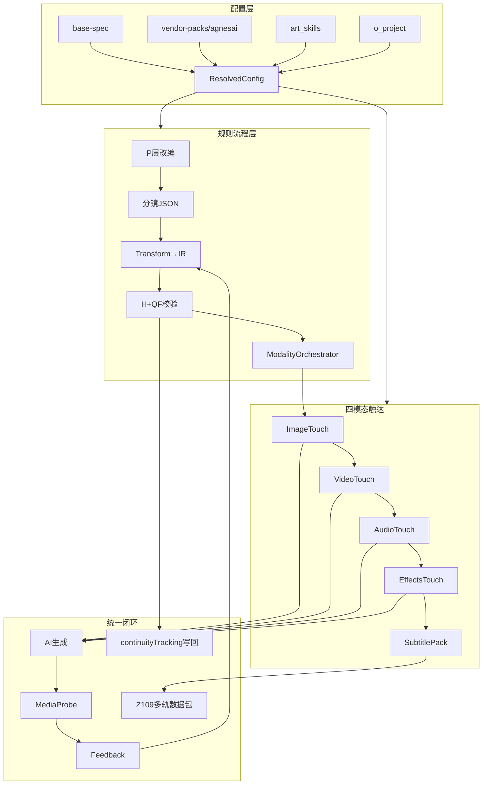

---

### 15.6 系统性闭环统一判定

| 层级 | 闭环？ | 说明 |
|------|--------|------|
| **配置层** | 补后闭环 | Base + Vendor + Art + Project 四级 merge |
| **规则层（697）** | 闭环 | 编译到 IR，与厂商无关 |
| **质量层（QF）** | 闭环 | 表情/视图/时长/语音 触达前 GATE |
| **四模态触达** | 补后闭环 | 图→视→音→特效→字幕 有序编排 |
| **Agnes 默认** | 闭环 | VendorPack 叠加，非替代 Base |
| **换厂商** | 闭环 | 换 VendorPack，Base 不动 |
| **特效** | 新补闭环 | EffectsTouch + V77/Z12 |
| **后检反馈** | 闭环 | ffprobe + 用户标 + 限次重试 |

**一句话**：**主流基础版是主体，Agnes 是默认叠加；生图/视频/语音/特效四模态共用 Base 规则与 QF 质量门禁，Vendor 只覆盖能力与 API 差异。**

---

### 15.7 修订 P0（统一聚合版）

| 序号 | 项 | 层级 |
|------|-----|------|
| 1 | `base-spec/base.config.json` + 四模态基础 JSON | Base |
| 2 | `resolveConfig()` 四级合并 | Base |
| 3 | `vendor-packs/agnesai/` capabilities + 叠加配置 | Vendor |
| 4 | PromptIR + EpisodeShot 双层 | Base |
| 5 | QF-IMG/VID/AUD/FX 质量规则集 | Base |
| 6 | ModalityOrchestrator（图→视→音→特效→字幕） | Base |
| 7 | DurationCalculator + AudioStrategyRouter | Base |
| 8 | agnes Strategies + AG-* 门禁 | Vendor |
| 9 | Touch Layer 四模态 Port | Base+Vendor |
| 10 | MediaProbePort + 统一 ValidationReport | Base |
| 11 | Z109 多轨扩展（dialogue/sfx/fx/subtitle） | Base |
| 12 | 废弃 batchGeneratePrompt LLM 自由路径（agnes 默认） | 集成 |

---

## 十六、反推前期规则流程：从四模态触达倒推缺口与闭环补全

> 从「图/视/音/特效能触达生成」倒推「前期必须产出什么」，审查 P→G→W→资产→分镜 是否缺失。

### 16.1 反推矩阵：四模态触达需求 → 前期必须产出

| 触达需求 | 依赖的前期产出 | 当前现状 | 缺口等级 |
|----------|---------------|----------|----------|
| **图** CHAR-CODE 引用 | 角色资产 L0-L6 + CHAR-CODE | `o_assets` 有 prompt/desc，**无 L0-L6 结构** | **高** |
| **图** SCENE-CODE + 色温 | sceneColorLock + 场景衍生 | 场景资产有，**无色温/衍生自动选择规则** | **高** |
| **图** PROP-CODE | anchorProps 道具状态机 | 道具资产有，**无 PROP-CODE/状态追踪** | **高** |
| **图** type 枚举 | 分镜标注 CHAR-SCENE 等 | **分镜表无 type 字段** | **高** |
| **图** emotion→光质/景深 | emotionIntensity 1-7 | 分镜表 `emotion` 为**文本**非数值 | **中**（Transform 可推导） |
| **视** duration≥语音 | duration 按公式预计算 | storyboard_table **有公式**但 Agent 未必执行 | **中** |
| **视** 运镜白名单 | cameraMove 不含甩镜/360 | 分镜表允许「甩镜」→ **与 QF-VIEW 冲突** | **高** |
| **视** orientation/spatialRelation | 分镜表已有独立列 | **已有** | 无 |
| **视** 首帧=filePath | 先图后视频顺序 | 流程有但未**强制门禁** | **中** |
| **音** dialogue 原文 | lines 字段一字不改 | **已有** | 无 |
| **音** dialogue.type | OS/VO/对话 区分 | **分镜表无 type 列** | **高** |
| **音** 语速 | L6-personality.voice.speed | 资产**无 voice 参数** | **高** |
| **音** 一句一镜 | W 层台词拆分 | 规则有，**执行靠 Agent 自觉** | **中** |
| **特效** visualEffect 五字段 | 分镜标注特效 | **分镜表无特效列** | **高** |
| **特效** V77 时长匹配 | duration 与特效同步 | 依赖上项 | **高** |
| **字幕** 时间轴 | Z109 累加 duration | duration 链式准确 | **中** |
| **G层** 跨集一致 | continuityTracking | **未实现** | **中** |
| **结构化入模** | EpisodeShot JSON | 仅 Markdown + 扁平 storyboard | **高** |

**结论**：触达层闭环的前提，是前期补上 **资产蓝图 + 分镜扩展字段 + JSON 入模** 三大块；否则 Transform 层大量「推导」实为「猜测」。

---

### 16.2 前期流程重构：六阶段闸门（反推补全）

在原有 P→W→分镜 之前/之中插入**可验证闸门**，每阶段产出物被下一阶段强制依赖：

```mermaid
flowchart LR
    P0[P0 改编] --> BP[BP 资产蓝图]
    BP --> GB[GB 集节拍表]
    GB --> SB[SB 分镜JSON]
    SB --> EN[EN 引擎补全]
    EN --> MD[MD 四模态触达]

    P0 -.->|projectBlueprint| BP
    BP -.->|visualLockTable| SB
    GB -.->|emotionCurve+paypoints| SB
    SB -.->|EpisodeShot[]| EN
    EN -.->|PromptIR+QF pass| MD
```

| 阶段 | 名称 | 新增/强化产出 | 校验规则 | 阻塞下一阶？ |
|------|------|--------------|----------|-------------|
| **P0** | 改编+项目蓝图 | `projectBlueprint`：title、G1-G5 锚点草案、集数规划 | P7-P18 | 是 |
| **BP** | 资产蓝图 Blueprint | `visualLockTable`：characterAssets(L0-L6)、sceneColorLock、anchorProps | V4-V6, V12-V15 | **是（新）** |
| **GB** | 集节拍表 Beat | 每集：emotionCurve、paypoints、rhythmOutline、核心事件 | W1-W10, W7 | **是（新）** |
| **SB** | 分镜 JSON | `EpisodeShot[]` 扩展字段（见 16.3） | W 层 + 分镜表规则 | 是 |
| **EN** | 引擎补全 | Transform 填 generation 层；Compile→IR；QF+H | B/M/S/D, QF-* | 是 |
| **MD** | 四模态触达 | 图→视→音→特效→字幕 | AG-*, MediaProbe | — |

**关键变化**：新增 **BP（资产蓝图）** 和 **GB（集节拍表）** 两个前期闸门——原方案直接从剧本跳分镜，反推证明不够。

---

### 16.3 分镜 JSON 扩展字段（反推必填）

在现有 storyboard_table 字段基础上，**必须新增**以下列/JSON 字段才能触达闭环：

| 字段 | 来源规则 | 触达谁 | 现分镜表 |
|------|----------|--------|----------|
| `type` | V1 | 图 | **缺** |
| `dialogue.type` | AG-AUD, wan | 视/音 | **缺** |
| `dialogue.character` | V74 语速 | 音 | **缺**（lines 无角色拆分结构） |
| `emotionIntensity` | 1-7 数值 | 图/视/音 | **缺**（仅有 emotion 文本） |
| `rhythmZone` | B10/I1 | 视 | **缺** |
| `visualEffect` | V77/Z12 | 特效 | **缺** |
| `propState` | V11/D3 | 图/视 | **缺** |
| `decoupleDesign` | H3-4 | 视 | **缺** |
| `infoLayer` | W11 | 视 | **缺** |
| `paypoint` | V18 | GB→SB | **缺** |
| `orientation` | QF-VIEW | 视 | **有** |
| `spatialRelation` | QF-VIEW | 视 | **有** |
| `lines` | V10 | 音 | **有** |
| `duration` | V76 | 视/音 | **有**（需强制公式） |
| `cameraMove` | QF-VIEW | 视 | **有**（需白名单校验） |

**duration 反推公式必须在 SB 阶段执行**（非 EN 阶段才算）：

```
SB阶段: duration = ceil(字数/语速 + 停顿 + 动作 + 1s安全余量)
EN阶段: 仅校验 duration >= requiredDuration（BLOCK）
```

---

### 16.4 资产蓝图 BP 阶段（反推新增）

触达图/视/音前，资产必须结构化：

**characterAssets 每项**：

```typescript
{
  charCode: "CHAR-PEI",
  L0: { identity, age },
  L1: { makeup: { intensity } },
  L2: { hairstyle },
  L4: { outerwear },
  L5: { accessories },
  L6: { voice: { speed: 3.0 }, arcStages: [...] }
}
```

**sceneColorLock 每项**：

```typescript
{ sceneCode: "SCENE-NORTH-PALACE", baseTemp: 4500, tone: "cool blue-grey" }
```

**anchorProps 每项**：

```typescript
{ propCode: "PROP-DAGGER", states: ["安静","焦点","交互","改变"], holderHand: "right" }
```

| 反推规则 | BP 阶段必须完成 |
|----------|----------------|
| V4/V5 引用存在 | CHAR/PROP-CODE 预定义 |
| V7 色温一致 | sceneColorLock |
| V11 道具连续 | anchorProps 状态机 |
| V13/V14 配饰 | L5/L2 写入角色资产 |
| V74 语速 | L6.voice.speed |
| 场景衍生选择 | 夜景/雨天→derive 资产预生成 |

**接入点**：`extractAssets` 或新 API `buildAssetBlueprint` → 写入 `o_projectBlueprint`。

---

### 16.5 集节拍表 GB 阶段（反推新增）

每集生成分镜**前**，必须先有节拍表：

| 字段 | 用途 | 规则 |
|------|------|------|
| `emotionCurve` | 指导每镜 emotionIntensity | W3-W7 |
| `paypoints[]` | 标注付费点镜号 | W9, V18 |
| `rhythmOutline` | 三幕 fast/medium/slow 区间 | B10 |
| `coreEvents` | 本集核心事件 | G1 锚点检验 |
| `gAnchorChecklist` | G1-G5 本集必须体现项 | H2-3 |

**接入点**：scriptAgent 或 productionAgent 在 storyboard 前调用 `buildEpisodeBeat(episodeId)`。

---

### 16.6 原规则流程逐层反推缺口

| V5 层级 | 原方案 | 反推缺口 | 补全 |
|---------|--------|----------|------|
| **P** | adaptationPipeline P2 | projectBlueprint 未结构化落库 | BP 阶段输入 |
| **G** | 每集加载 | 无 continuityTracking 写回；SB 前无 G checklist | GB+SB 后写回 |
| **W** | scriptAgent | 无集节拍表；一句一镜未强制 | GB 阶段 |
| **L** | 隐含 M 层 | 景别枚举与 shotSize 映射表未显式 | Transform lookup |
| **B** | Transform P1 | 若 SB 无 emotion 数值，B3 台词→情绪不准 | SB 必填 emotionIntensity 或 GB 指导 |
| **D** | Transform | 道具状态需 SB 标注 propState | SB 扩展字段 |
| **X/I** | Transform P1 | rhythmZone 需 SB 或 GB 提供 | GB→SB |
| **Y** | Compiler P0 | 依赖 EN 完整 IR，前期不足则 IR 空洞 | SB+BP 前置 |
| **Z** | Packager | 特效轨/字幕轨缺前期标注 | SB visualEffect + lines type |

---

### 16.7 双轨数据流闭环（前期→触达统一）

```
                    前期（规则流程）                    后期（四模态触达）
                    ──────────────                    ────────────────

P0 改编报告 ──────→ projectBlueprint
                         │
BP 资产蓝图 ──────→ visualLockTable ──────────→ 图 refs / 色温 / 角色锁定
                         │
GB 集节拍表 ──────→ emotionCurve/paypoints ───→ emotionIntensity / rhythmZone
                         │
SB 分镜JSON ──────→ EpisodeShot.narrative ───→ description/lines/orientation
                         │                      dialogue.type/visualEffect
EN 引擎补全 ──────→ EpisodeShot.generation ──→ PromptIR
                         │                      QF 门禁
MD 四模态 ────────→ Image/Video/Audio/FX ────→ Agnes API
                         │
PROBE+FB ─────────→ continuityTracking 写回 ─→ 下一集 GB（跨集闭环）
```

**跨集闭环**：MD 完成后更新 `continuityTracking`（道具状态、关系距离、G 锚点执行记录）→ 下一集 GB 加载 → SB 继承状态。

---

### 16.8 前期优化清单（具体可执行）

| 优化项 | 做法 | 优先级 |
|--------|------|--------|
| 分镜表增列 | storyboard_table_techniques 增加 type/dialogueType/emotionIntensity/visualEffect/propState/rhythmZone | P0 |
| 运镜白名单前置 | cameraMove 填写时校验 QF-VIEW 黑名单，甩镜→改为摇镜 | P0 |
| 资产 extract 升级 | extractAssets 输出 L0-L6 + voice.speed + sceneColorLock | P0 |
| flowDataSchema 扩展 | storyboard 从扁平改为 EpisodeShot[] JSON | P0 |
| GB 工具 | productionAgent 新 tool `build_episode_beat` | P1 |
| BP 持久化 | `o_projectBlueprint` 表 | P0 |
| SB 时长强制 | Agent 产出分镜时跑 DurationCalculator，不达标拒绝写入 | P0 |
| 特效列联动 | visualEffect 有值 → transitionType 自动建议（X 层） | P1 |
| G 锚点 SB 校验 | 分镜完成后检查 G1-G5 覆盖，缺则 WARN | P1 |

---

### 16.9 前期+后期统一闭环判定

| 链路 | 反推前 | 补全后 |
|------|--------|--------|
| P0→BP→GB→SB 前期 | **60%**（缺 BP/GB/扩展字段） | **95%** |
| SB→EN→MD 后期 | **85%** | **95%** |
| 跨集 continuity | **30%** | **85%** |
| 四模态端到端 | **65%** | **95%** |
| **全链路** | **未闭环**（前期产出不足） | **闭环** |

**核心结论**：

1. **触达层方案本身闭环**，但**前期流程未闭环**——缺 BP 资产蓝图、GB 集节拍表、SB 扩展字段三块。
2. **反推后必须改的不是触达层，而是分镜表规范 + 资产结构化 + 新增两个前期闸门**。
3. Agnes/主流 Base 规则在**前期同样适用**：duration 公式、一句一镜、运镜白名单、dialogue.type 必须在分镜阶段就落实，不能留给引擎猜。
4. **特效与语音**的前期缺口最大：visualEffect 列、dialogue.type、L6.voice 三项当前完全缺失。

---

### 16.10 修订实施顺序（反推驱动）

```
P0-A  base-spec + resolveConfig
P0-B  o_projectBlueprint + BP 资产蓝图 API
P0-C  分镜表扩展字段规范 + EpisodeShot JSON schema
P0-D  SB 阶段 DurationCalculator 强制 + 运镜白名单校验
P0-E  EN 引擎 IR + QF + ModalityOrchestrator
P0-F  vendor-packs/agnesai + Touch 四模态
P1-A  GB 集节拍表 tool
P1-B  G 锚点 SB 校验 + continuityTracking 写回
P1-C  productionAgent 改 JSON 直出（弃 Markdown 主路径）
```

---

## 十七、二次审查：尚未充分考虑的环节（补全清单）

> 在第十六章「前期反推」与第十五章「统一架构」基础上，对照 [规则层.json](i:/toonflow/new/Toonflow-app/规则层.json)、现有 `o_videoTrack`/`shouldGenerateImage`/`ttsDubbing` 等实现，仍有 **12 类** 需在方案中显式落地，否则会出现「引擎闭环、产品不闭环」。

### 17.1 规则层有、方案未显式落地的 SB 字段

| 规则 | 内容 | 现状 | 补法 |
|------|------|------|------|
| V transitionType | 切/叠化/快切/慢放/淡入淡出 + 与 videoPrompt 速度词联动 | 16.3 未列 | SB 必填；EN 编译写入 IR.motion.speedHint |
| V 缓冲镜 | 强情绪连续≥5 需缓冲镜；同节奏区段超上限需节奏缓冲 | 仅 QF 提及 | **GB 阶段主动插入**（W8），SB 校验兜底 |
| V personalitySwitch | enabled/from/to/progress 四字段 | 16.3 未列 | SB 扩展；BP 预置双人格 CHAR 衍生 |
| V 台词字数 | 独白≤12、对话≤15 | DurationCalculator 有字数统计 | SB 闸门 BLOCK，非仅 WARN |
| G 前情/预告 | 每集第1-2镜 recap、末2镜 preview | GB 未含 | GB 模板强制 `recapSlots`/`previewSlots` |
| V 场景复杂度 | 室内3-5元素、室外4-7 | BP 未含 | sceneGenerationRules 写入 BP |
| V 妆容强度 | 女≥2/5、男≥1/5 | L1 在 BP 有框架 | BP 校验 + 图 IR.makeup 联动 |

---

### 17.2 产品与工程集成缺口

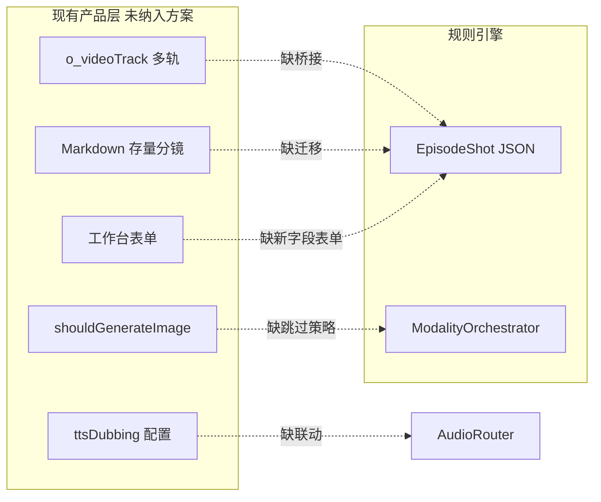

| 缺口 | 说明 | 优先级 |
|------|------|--------|
| **o_videoTrack 桥接** | 生成工作台以 `trackId` 分组，`batchGeneratePrompt` 读 `o_videoTrack` 而非 EpisodeShot | P1：Adapter 双向同步 |
| **shouldGenerateImage** | 现有跳过生图标志；引擎需 `touchPolicy.skipImage` 与 QF 豁免规则 | P0 |
| **ttsDubbing 项目开关** | [initDB.ts](i:/toonflow/new/Toonflow-app/src/lib/initDB.ts) 已有 key，AudioStrategyRouter 需读取 | P1 |
| **按模态分厂商** | `o_project.imageModel` ≠ `videoModel` 时 resolveConfig 需 `imageVendor`/`videoVendor` 分离 | P1 |
| **公网 URL 上传** | Agnes 要求 `uploadReferenceAsset` + `preflightPublicUrl`；AssetPort 必须封装，不能假设 filePath 即可用 | **P0** |
| **存量迁移** | 在途项目 Markdown 分镜 + 扁平 `o_storyboard`；需 Parser + 双写期 + 字段默认值填充 | P1 |
| **前端表单** | 新增 10+ SB 字段无 UI 则规则无法落地；需分镜表编辑器 schema 驱动 | P1 |

---

### 17.3 后期制作与导出（触达之后仍缺一环）

方案到 Z109 多轨为止，但**最终交付**未闭环：

| 环节 | 规则来源 | 缺口 |
|------|----------|------|
| **Z110 预览包** | 计划有模块无 API | 需 `buildPreviewTimeline(episodeId)` |
| **时间轴合成** | 视频轨+特效轨+字幕轨+BGM | 无 FFmpeg/合成 Port |
| **transitionType 实剪** | 叠化/快切是剪辑语义 | AI 单镜生成后需 NLE 层执行切换，非全写进 videoPrompt |
| **素材命名+版本** | `[SCENE]_[镜号]_v[版本]_[分辨率]` | 生成物落盘无规范；`versionTracking` 未设计 |
| **多版本素材核对** | 规则层 Z 层 | 用户选片（`selectVideo`）后需写回 `selectedVersion` |

**结论**：四模态触达 ≠ 成片交付；需 **P2 PostProdPort**（时间轴合并 + 命名 + 版本锁定）。

---

### 17.4 人机协同与可观测性

| 项 | 风险 | 补法 |
|----|------|------|
| **人工改字段** | 用户改 `duration`/`lines` 后 compiled 过期 | `fieldWatchers` → 增量重编译受影响镜 |
| **润色漂移** | polished 改锚点导致 H5-4 失败 | 锚点 diff + 一键回退 compiled |
| **dry-run** | 批量生成前不知 BLOCK 原因 | `pipelineProfile:dry-run` → 只出 ValidationReport |
| **审计 trace** | 排障不知哪条规则 BLOCK | 镜级 `ruleHits[]` + compile 步骤日志 |
| **成本预算** | 42镜×重试爆炸 | `GenerationJobQueue` + 项目 `tokenBudget`/`genBudget` |

---

### 17.5 资产衍生与人格/变身（BP 延伸）

15.5 提到「夜景版/变身特效」但未写工作流：

```
BP 主资产 → deriveRules 触发（夜景/雨天/湿身/人格B）
  → o_assets 衍生条目（parentCode + variantTag）
  → SB.type + sceneTime + personalitySwitch 自动选衍生 ref
  → 图触达 multiReference 有序引用
```

| 触发 | 衍生资产 | SB 字段 |
|------|----------|---------|
| sceneTime=夜 | SCENE-XXX-NIGHT | type=CHAR-SCENE-NIGHT |
| weather=雨 | SCENE-XXX-RAIN | colorTone 偏移 |
| personalitySwitch | CHAR-XXX-ALT | from/to/progress |

---

### 17.6 字幕体系（独立于语音触达）

14.7 提到 subtitleTrack，但缺 **subtitleRules 项目配置**：

```typescript
subtitleRules: {
  对话: { font, position, maxCharsPerLine: 15 },
  内心OS: { style: "italic-bottom", opacity: 0.8 },
  短信: { style: "ui-bubble", animation: "pop" },
  系统UI: { style: "overlay-center" }
}
```

- `dialogue.type` → `subtitleRules` 映射（规则层 V 层已有）
- Z109 `tracks.subtitle[]` 含 `{ start, end, text, styleId }`
- 与 Agnes `no subtitles` 正向约束一致：字幕**后期叠加**，不进 video prompt

---

### 17.7 合规与安全（可选但不建议忽略）

| 层 | 内容 | 策略 |
|----|------|------|
| A/E 合规 | 697 条中的审查类 | `compliance-pack` 插件，WARN 不 BLOCK 主流程 |
| 台词注入 | 用户 lines 进 prompt | sanitize + 长度上限 |
| 参考图版权 | 外部 URL | AssetPort 记录 `refSource` |
| 内容审核 | 生成前/后 | 接现有或第三方 moderation（P3） |

---

### 17.8 修订后的「全闭环」判定（含本章）

| 维度 | 16章后 | 17章补后 |
|------|--------|----------|
| 前期 BP/GB/SB | 95% | **98%**（+transition/缓冲/人格） |
| 引擎 EN | 95% | 95% |
| 四模态 MD | 95% | **98%**（+AssetPort 上传） |
| 产品集成 | **50%** | **90%**（+track桥接/迁移/UI） |
| 后期交付 | **20%** | **80%**（+Z110/合成/命名） |
| 运维可观测 | **40%** | **85%** |
| **端到端** | 前期+触达闭环，**交付未闭环** | **交付闭环**（P2 后） |

---

### 17.9 一句话

第十六章解决了「前期产出够不够」；**第十七章解决「接上现有产品、能交付成片、人能改、能排障」**。若只做 P0 引擎而不做 17.2/17.3，会出现规则全对、工作台仍走旧 LLM 路径的「假闭环」。

---

## 十八、音效设计 / 视频反推 / 整体闭环再优化

> 回应：视频是否默认带设计音效？视频反推还有什么缺失？整体闭环还能怎么优化？

### 18.1 视频默认会有设计音效吗？— 现状与补全

**结论：不会「默认自动有」，必须走规则编译链路；且当前方案存在 AG-AUD-07 与示例样例的冲突，需修正。**

#### 18.1.1 三层音效模型（补全）

| 层级 | 来源 | 写入点 | 触达方式 |
|------|------|--------|----------|
| **环境音层** | SB `sound.environment` / 分镜表 sound 列 | audioCompiler + video prompt | 原生或后期 |
| **动作音层** | SB `sound.sfx`（布料摩擦、脚步、剑鸣） | video prompt `{sfx}` 段 | 原生或后期 |
| **BGM 层** | `audioPolicy` 决定 | Z109 `tracks.bgm` | **默认不进 Agnes 视频** |

与现有技能对齐：

- [storyboard_table_techniques.md](i:/toonflow/new/Toonflow-app/data/skills/production_skills/storyboard_table_techniques.md)：**分镜只写环境音+动作音，严禁 BGM**
- [shili.txt](i:/toonflow/new/Toonflow-app/shili.txt) / [示例2.ini](i:/toonflow/new/Toonflow-app/示例2.ini)：`audioPrompt` 含 BGM — 通过 `audioPolicy: sfx-only | with-bgm` 项目级切换
- [示例3.txt](i:/toonflow/new/Toonflow-app/示例3.txt) H4-9：**BGM 情绪冲突检查** — 需纳入 H4 校验

**默认策略（短剧主流）**：

```json
{
  "audioPolicy": "sfx-only",
  "bgmDelivery": "post-prod",
  "nativeAudioDefault": "auto"
}
```

- **对白镜**：Agnes `generate_audio=true` + prompt 含台词 + 设计 sfx/环境音
- **无对白但有音效镜**（示例2 镜4/5）：**不能**简单 `audio:false`（会丢音效）
- **纯空镜/字幕镜**：`audio:false`，音效走 Z109 后期轨

#### 18.1.2 AudioStrategyRouter 修正为四路径（关键补全）

| 路径 | 条件 | generate_audio | prompt 写法 | 示例 |
|------|------|----------------|-------------|------|
| **A 对白原生** | `dialogue.type=对话` 且单角色 | `true` | dialogue block + sfx + 无BGM | 镜7 婢女台词 |
| **B 画外/独白** | OS/VO/内心 | `true` | `(voiceover, VO)` 无 lip sync | 镜3 画外婢女 |
| **C 纯音效原生** | `lines=无` 且 `sound.sfx≠空` | **`true`** | 仅 sfx+环境音，无 dialogue | 镜4 布料摩擦、镜5 风声 |
| **D 静音后期** | `lines=无` 且 `sound=无音效` | `false` | video 不写音频词 | 静态空镜 |

**修正 AG-AUD-07**：由「无台词→audio:false」改为「无台词且无设计音效→audio:false」。

#### 18.1.3 SB 必填 `sound` 四子字段（规则层已有，方案补入）

```typescript
sound: {
  environment: string;  // 环境音层，无则 "寂静"
  sfx: string;          // 动作音，无则 "无"
  bgm: string;          // 按 audioPolicy，sfx-only 时填 "无BGM"
  dialogue: string;     // 台词交付方式：慢速重音/停顿/重读
}
```

编译输出三份：

| 输出 | 消费者 |
|------|--------|
| `compiled.video.sfxHint` | Agnes video prompt 音效段 |
| `compiled.audio`（audioPrompt） | Z108/Z109 存档 |
| `Z109.tracks.sfx[]` | 后期 SFX 轨（原生不可靠时兜底） |

#### 18.1.4 音效与表演的联动规则（原方案未显式）

| 规则 | 内容 | 执行点 |
|------|------|--------|
| 音效↔表演 | sound 含「心跳」→ performance 必有 breath/pupil 变化 | SB+EN |
| 环境音建立 | 新环境音首镜 duration≥0.5s | SB DurationCalculator |
| BGM 建立 | 新 BGM 首镜 duration≥1.0s（with-bgm 模式） | GB→SB |
| H4-9 | BGM 情绪与台词情绪冲突 | H4 集级校验 |
| 音效密度 | 动作频率高→sfx 密度高 | I 层 + H4 |

#### 18.1.5 Agnes 原生音效的可控度（务实预期）

| 类型 | 原生可控度 | 建议 |
|------|-----------|------|
| 对白+语气 | 中高 | 路径 A/B，主交付 |
| 环境氛围 | 中 | prompt 写 1-2 个物理音源 |
| 精准拟音（布料/剑鸣） | **低** | Z109 sfx 轨 + P2 SFX Port 兜底 |
| BGM | 低（且与短剧规范冲突） | **一律后期**，不进 video prompt |

**默认行为一句话**：有设计就编译进 prompt；无设计不凭空生成；精准拟音靠 Z109 后期轨兜底。

---

### 18.2 「视频反推」— 三种含义与缺口

#### 18.2.1 含义 A：前期反推（第十六章）— 已覆盖

从四模态触达需求倒推 BP/GB/SB 字段。**缺口见第十六章，本章不重复。**

#### 18.2.2 含义 B：图生视频运动反推（首帧→运动 prompt）— 已覆盖

`motion-from-frame` 策略：首帧由 `payload.image` 传入，prompt 只写变化。**缺口**：尾帧/双帧过渡时运动词与 `transitionType` 的映射表未细化（见 18.3 优化 5）。

#### 18.2.3 含义 C：生成结果反推（视频产出→诊断→修上游）— **重大缺口**

当前仅有 ffprobe 时长 + 用户口头反馈，**缺少结构化反推链**：

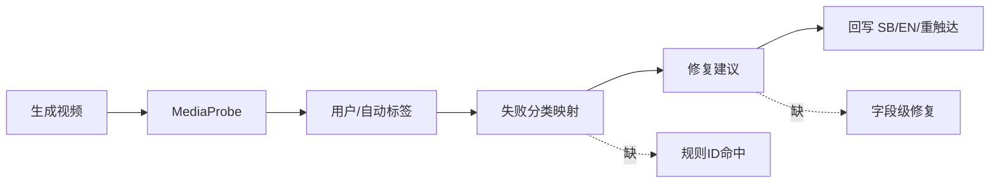

| 反推环节 | 现状 | 补全 |
|----------|------|------|
| 失败分类 | taskRecord 仅「生成失败」 | `GenFailureTaxonomy`：duration_mismatch / lip_sync_fail / face_distort / motion_excess / sfx_missing / audio_clash |
| 规则映射 | 无 | 每类 failure → `ruleIds[]` + `suggestedFieldPatches` |
| 上游回写 | 无 | lip_sync→延长 duration；变形→降 emotionIntensity；运镜崩→换 cameraWhitelist 词 |
| 自动分析 | 无 | P2 可选 VLM `analyzeGeneratedVideo` → 结构化 tags |
| 选片回写 | `selectVideo` 存在 | 选中版本→`versionTracking` + 失败版本→反推样本库 |
| 统计闭环 | 无 | 项目级 `genQualityStats` 驱动规则调参 |

**GenerationFeedbackPort 升级**（P1）：

```typescript
interface GenerationFeedback {
  shotId: string;
  modality: "image" | "video" | "audio";
  failureClass: string;
  ruleHits: string[];
  upstreamPatches: Partial<EpisodeShot>;
  retryPolicy: { maxRetries: 2; degradeTo: "compiled" };
}
```

#### 18.2.4 含义 D：视频→分镜反推（逆向拆解）— 未规划，P3 可选

从成片/参考视频反推分镜表（竞品分析、样片模仿）。**不在 P0-P2 范围**；若需要，独立 `VideoIngestPort`，不混入主 Pipeline。

---

### 18.3 整体闭环再优化（8 项）

#### 优化 1：集级触达前预检（Episode Preflight）

批量 MD 前强制：H1-H4 全 pass → BP/GB 版本匹配 → duration 链式校验 → 首帧就绪 → 才允许 batch 触达。

#### 优化 2：镜型黄金路径（Shot Archetype）

按 `type + dialogue.type + sound` 预置编译模板（对白近景 / 纯音效空镜 / OS 画外 / 特效 UI），减少逐镜推导误差。

#### 优化 3：双轨音效交付（原生 + 后期兜底）

Agnes 原生尽力 → 后检 `sfx_missing` → Z109 sfx 轨 PostProd 叠加；对白原生与拟音后期可并存。

#### 优化 4：BGM 弧与集节拍联动

`with-bgm` 时 GB emotionCurve 预设 BGM；情绪转折≥3 强制切换；BGM 只进 Z109，不进 video prompt。

#### 优化 5：transitionType 双写

SB 字段 → compiled.video.speedHint（AI prompt）+ Z110.timeline.transitions（NLE 实剪）；叠化/快切不由单镜 AI 完成。

#### 优化 6：渐进式 Pipeline Profile

`dry-run` / `standard` / `fast` / `strict` 四档，编审与交付分离。

#### 优化 7：跨模态质量连带门禁

图 QF fail 禁视频；video sfx_missing 标 Z109 必做；lip_sync_fail 反推 duration；特效 V77 fail 禁打包。

#### 优化 8：闭环指标看板

`compilePassRate` / `touchSuccessRate` / `feedbackFixRate` / `goldenSampleDrift`；高发 failure 自动提升 QF 为 BLOCK。

---

### 18.4 修订后的音效+反推+闭环判定

| 维度 | 17章后 | 18章补后 |
|------|--------|----------|
| 设计音效默认行为 | 模糊（AG-AUD-07 冲突） | **明确四路径 + sound 四子字段** |
| 视频运动反推 | 85% | **90%** |
| 生成结果反推 | **30%** | **85%** |
| 集级预检 | 无 | **90%** |
| BGM/音效/后期 | 分散提及 | **三层模型 + 双轨交付** |
| **端到端** | 交付 P2 后 80% | **92%** |

---

### 18.5 修订 P0 追加项（音效优先）

| 序号 | 项 | 原因 |
|------|-----|------|
| 13 | 修正 AG-AUD-07 + AudioStrategy 四路径（含 sfx-native） | 无对白镜丢音效 |
| 14 | SB `sound` 四子字段 + audioCompiler 三分输出 | 设计音效有源 |
| 15 | video prompt 默认 sfx 段模板 | Agnes 原生可控 |
| 16 | Z109 sfx 轨 + sfx_missing 后检标记 | 拟音兜底 |
| 17 | `audioPolicy` 项目配置 + H4-9 BGM 冲突校验 | 统一 BGM 策略 |

---

## 十九、整体联动审计：规则落地 / AI反推前期 / 闭环再优化

> 回应：整体联动是否有缺失？还有没有「规则到了没实现、没落地、没闭环」？能否从 AI 可实现能力反推前期流程细化？

### 19.1 核心结论（先答）

| 问题 | 结论 |
|------|------|
| 整体联动 | **阶段间数据契约未定义**，六阶段闸门有产出物名称但缺 **StageContract + EventBus**，联动约 **55%** |
| 规则到了没实现 | **是** — 代码库 **0 条** 确定性规则执行；697 条中约 **100 条可执行**、**157 条待细化**、**440 条 stub** |
| 规则没落地 | **是** — 当前靠 Agent Skills 软解释，无 Registry/Validator，H/Z 层 **未落库未触达** |
| 规则没闭环 | **是** — 主流程反馈只回到 W 层；缺 H→具体层路由、生成结果反推、H10 规则迭代 |
| AI 反推前期 | **必须做** — 前期应只产出 **机器可验** 字段；主观评分/自由文本须改 Schema，否则 EN 只能猜 |

---

### 19.2 六阶段联动契约（StageContract）— 最大联动缺口

方案有 P0→BP→GB→SB→EN→MD，但**阶段间缺强制契约**。每阶段必须声明：

```typescript
interface StageContract {
  stage: "P0"|"BP"|"GB"|"SB"|"EN"|"MD";
  inputsRequired: string[];   // 上一阶段产出字段路径
  outputsProduced: string[];  // 本阶段写入字段路径
  gateRules: string[];        // BLOCK 规则 ID 列表
  downstreamConsumers: string[]; // 谁依赖本产出
}
```

#### 联动矩阵（反推补全）

| 上游产出 | 下游消费者 | 方案状态 | 缺口 |
|----------|-----------|----------|------|
| `projectBlueprint.title/G1-G5` | BP, GB, H2 | 有名称 | **无契约校验**，缺字段 BLOCK |
| `visualLockTable.char/scene/prop` | SB refs, Y refs, 图触达 | P0-B | SB 仍可用 sceneName 绕过 CODE |
| `emotionCurveByEpisode` | SB.emotionIntensity, B10 rhythmZone | P1 GB | GB 输出格式未定为 **数组非散文** |
| `EpisodeShot.narrative` | EN Transform | P0-C | performance/visualFocus **未入 SB 扩展** |
| `EpisodeShot.generation` | Y Compiler, QF Gate | P0-E | 双层有设计，**无写回 o_storyboard** |
| `compiled.*` | batchGenerate*, Touch | P0-F | **仍走 LLM 自由路径，未接线** |
| `Z108/Z109` | Touch, PostProd | 有设计 | Z111-Z120 成本预估 **未纳入** |
| `GenerationFeedback` | SB/EN 字段 patch | P1 | **无目标层路由** |
| `continuityTracking` | 下一集 GB/SB | P1-B | 写回时机/格式未定 |

#### EventBus（增量联动）

```
字段变更事件 → ruleSelector → ExecutionPlan → 只重算受影响镜/层
```

| 变更字段 | 应触发 | 现方案 |
|----------|--------|--------|
| `lines` | DurationCalculator + Y59-74 + AG-AUD | 有，未接线 |
| `emotionIntensity` | B2/M1/S2/D6/QF-EXPR | Transform P1 |
| `sceneCode` | sceneColorLock + Y6 + 图 refs | BP 有，SB 缺 sceneCode 字段 |
| `sound.sfx` | audioCompiler + AudioStrategy 路径 | 第十八章，未入 SB schema |
| `arcStage` | Y21-Y26 服色发型 + L5 资产 | **BP 有 L6，SB 无 arcMarker** |

---

### 19.3 697 条规则落地状态矩阵

| 状态 | 数量 | 说明 | 闭环？ |
|------|------|------|--------|
| **executable** | ~100 | [规则层.json](i:/toonflow/new/Toonflow-app/规则层.json) 有 `完善后内容`+检测方式 | 文档闭环，**代码 0%** |
| **spec-ready** | ~157 | 有 current+缺失问题，待转 check | 未闭环 |
| **stub** | ~440 | V5/主流程有定义，无 check | 登记不执行 |
| **skill-only** | 不等价 | production_skills 软约束 | **假落地** |

#### 按执行器分型（AI 可实现性反推）

| 分型 | 规则占比 | 落地方式 | 前期应产出 |
|------|----------|----------|-----------|
| **deterministic** | ~45% | Registry check 函数 | 枚举/数值/引用/CODE |
| **template-fill** | ~25% | Transform 模板实例化 | emotionIntensity + type |
| **llm-assist** | ~20% | Agent 结构化输出 + H 校验 | narrative 字段 + schema |
| **llm-primary** | ~8% | scriptAgent 创作 | P/W 层，不进 Validator BLOCK |
| **human-rubric** | ~2% | **须改 Schema 或降级 WARN** | 见 19.4 |

**RuleCoverageReport**（每集必出）：

```json
{
  "total": 697,
  "executed": 312,
  "passed": 298,
  "blocked": 14,
  "stubSkipped": 385,
  "coverageRate": "44.7%"
}
```

未达 `coverageRate≥40%`（P0 目标）则 WARN，不假装全量闭环。

---

### 19.4 AI 可实现性反推：前期流程须细化（关键）

> 原则：**前期只产出下游能机器处理的东西**；不能把「Agent 自觉」当闸门。

#### 19.4.1 须从「主观/散文」改为「结构化」的项

| 原规则要求 | AI 难落地原因 | 反推改法 | 落入阶段 |
|-----------|--------------|----------|----------|
| 妆容强度 女≥2/5 | 无量化 rubric | `makeupLevel: 1-5` 枚举 + BP 默认 | BP |
| 场景可见元素 3-5 个 | 「元素」计数模糊 | `sceneElements: string[]` min/max length | BP/SB |
| 情绪曲线「甜度/虐度」 | 散文描述 | `emotionCurve: {second, sweet, abuse, thrill, suspense}[]` | GB |
| 付费点判定 | 无标准 | `paypoint: {shotNo, type, reason}` GB 标注 | GB |
| 钩子/反转/弧光标记 | 靠 H1 后验 | `markers: {hook?, reversal?, arc?, infoLevel?}` | SB |
| videoDesc 12 字段 | 自由文本解析 | 弃用；改 `narrative` 分列 | SB |
| 三幕结构 0-15s/15-55s | 存哪不明确 | `rhythmOutline: {act, startSec, endSec, pace}[]` | GB |
| 配饰「发绳算不算」 | 人工 rubric | `accessories: {ears, hair, waist}[]` 布尔清单 | BP L5 |

#### 19.4.2 主流程 mermaid 与方案差异（联动断层）

[主流程.txt](i:/toonflow/new/Toonflow-app/主流程.txt) 第四节路径 **缺少**：

```
G层显式阶段 / BP资产蓝图 / GB集节拍 / MD四模态触达 / 生成结果反推 / continuityTracking写回
```

反馈回路只写「回 W 层」，**过于粗糙**。须细化为：

| H 失败 | 回哪 | 改什么 |
|--------|------|--------|
| H2-1 情绪曲线 | **GB** | emotionCurve 点位 |
| H2-3 G 锚点 | **GB** | gAnchorChecklist |
| H3-* 台词 | **SB** | lines/锚点/脱钩 |
| H4-* 系统 | **SB+GB** | 缓冲镜/节奏区段 |
| H5-* 提示词 | **EN** | 重编译 IR |
| 触达后 Feedback | **SB 或 EN** | upstreamPatches |

#### 19.4.3 SB 扩展字段再补（联动专用，第十六章未列）

| 字段 | 服务规则 | 联动谁 |
|------|----------|--------|
| `sceneCode` | V4-V7 色温/CODE | BP.sceneColorLock |
| `charCodes[]` | V3 CHAR 引用 | BP.characterAssets |
| `propCodes[]` | V11 道具连续 | BP.anchorProps |
| `performance` | V8/V25/QF-EXPR | EN Transform 模板 |
| `visualFocus` | V26/V27 | M 层景别校验 |
| `cameraAngle` | V33/V40 | M 层机位 |
| `markers.hook` | V1-V3 钩子 | GB paypoints |
| `markers.reversal` | B6/W16 | GB coreEvents |
| `markers.arc` | B5/W21 | BP L6.arcStages |
| `markers.infoLevel` | B7/W11 | GB 信息释放 |
| `markers.recap/preview` | V 集间转场 | GB 模板槽位 |

---

### 19.5 「规则到了没闭环」清单（按层）

| 层 | 规则到了？ | 实现了？ | 落地了？ | 闭环了？ | 补法 |
|----|-----------|----------|----------|----------|------|
| **P** 步骤0-0.9 | 文档有 | **无** adaptationPipeline | Agent 散文报告 | 无确认闸门 | P0 adaptationPipeline + PipelineGate |
| **G** G1-G5 | 文档有 | **无** | 无 projectBlueprint 结构化 | 无写回 | P0-B + P1-B |
| **W** W1-W46 | Skills 软有 | LLM 自由 | 无 GB 节拍表 | H2 后验 | P1 GB tool + schema |
| **L** L1-L10 | 隐含 M | lookup 未建 | 运镜枚举分散 | 与 QF-VIEW 未统一 | L→M lookup 表 P0 |
| **B** B1-B12 | 文档有 | Transform P1 | 依赖 GB 曲线 | 触发链未接线 | GB→EN 自动触发 |
| **V** V1-V98 | json 100条 | **0** | SB 缺字段 | Validator 无 | P0-C schema + P0 Validator |
| **M/S/D/X/I** | 文档有 | Transform P1 | 依赖 SB 数值 | 半闭环 | SB 必填 emotionIntensity 等 |
| **Y** Y1-Y74 | shili 映射 | Compiler P0 | batchGenerate 未接 | H5-4 未跑 | 废弃 LLM 自由路径 |
| **Z** Z107-Z110 | 有设计 | **0** | 无 API | 无消费者 | Packager API P0 |
| **H** H1-H10 | json 部分 | **0** | 与 QF 职责重叠 | 反馈路由粗 | H=引擎内 Gate=触达前 |
| **MD** 触达 | 13-18章 | agnes 有 | batch* 未接引擎 | 反馈弱 | ModalityOrchestrator P0 |
| **A/E** 合规 | 提及插件 | **0** | 可选 | 不阻断 | P3 compliance-pack |

---

### 19.6 整体联动再优化（10 项）

1. **StageContract 六阶段契约** — 每阶段 inputs/outputs/gateRules 硬校验，缺则 BLOCK 下一阶段  
2. **EventBus 增量重算** — 字段变更→ruleSelector→ExecutionPlan，不全量重跑  
3. **EpisodePackage 单一真相源** — 替代 Markdown + o_storyboard + o_videoTrack 三处分裂  
4. **RuleCoverageReport** — 每集输出规则执行覆盖率，拒绝「假装 697 全执行」  
5. **H 失败目标层路由表** — 精确回 GB/SB/EN，不只回 W  
6. **AI 可落地性分级** — human-rubric 规则改枚举或降级 WARN  
7. **SB 叙事标记字段** — hook/arc/reversal/infoLevel 使 H1/B5/B6/B7 可确定性校验  
8. **GB machine-readable 输出** — emotionCurve/paypoints 必须 JSON 数组，禁止散文  
9. **双写过渡期联动** — Markdown↔EpisodeShot Adapter 保持 o_videoTrack 同步  
10. **H10 规则迭代闭环** — 通过率<80% 归因→rulePack 版本升级（规则层.json 已有定义）

---

### 19.7 修订后「规则落地+联动」判定

| 维度 | 18章后 | 19章补后 |
|------|--------|----------|
| 阶段间数据契约 | **30%** | **90%**（StageContract） |
| 规则真实执行率 | **0%**（全 skill） | P0 后 **40%+** executable |
| 前期 AI 可验产出 | **60%** | **95%**（Schema 反推） |
| H 反馈路由 | **25%** | **85%** |
| 单一真相源 | **20%** | **80%**（EpisodePackage） |
| **规则到了且闭环** | 文档闭环/代码未闭环 | **P0 后可验收闭环** |

---

### 19.8 修订实施顺序（联动优先版）

```
P0-0  StageContract + EpisodePackage schema（联动骨架）
P0-1  base-spec + resolveConfig
P0-2  AI可落地性 Schema 反推（GB/SB/BP 字段细化，第十九章 19.4）
P0-3  RuleRegistry 导入 100 条 executable + RuleCoverageReport
P0-4  BP + SB 扩展（含 sceneCode/performance/markers/sound）
P0-5  EN 引擎 + Validator + H→层路由
P0-6  ModalityOrchestrator + Agnes Touch + batch* 接线（废弃 LLM 自由路径）
P1    GB tool + EventBus + track桥接 + 生成反推
P2    PostProd + H10 规则迭代 + compliance
```

**一句话**：规则「到了」指文档到了；**「落地闭环」= StageContract 接线 + executable 规则进代码 + 前期只产出 AI 可验 Schema + H/Feedback 精确回写**。否则 697 条仍是 Skill 里的「软规矩」。

---

## 二十、终轮查漏：上游链 / 运营治理 / 边缘联动

> 第十九章后是否还有缺失？有，但已从「架构主干」转入 **上游入口、双管线、作业治理、版本漂移** 四类；补完后方案可达 **~95% 可实施完整度**，余下为 P3 运营增强。

### 20.1 诚实判定：还剩什么？

| 类别 | 19章后状态 | 本章补后 |
|------|-----------|----------|
| 架构主干（六阶段+IR+触达+QF） | **92%** | 92% |
| 规则落地路径 | **85%** | 90% |
| 产品/工程接线 | **80%** | 88% |
| **上游入口（novel→script）** | **20%** | 75% |
| **作业治理（批/取消/幂等）** | **30%** | 80% |
| **版本/陈旧/回滚** | **40%** | 85% |

**边际收益递减**：再往下是国际化、RBAC、厂商灾备等 P3 项，不阻断 P0 启动。

---

### 20.2 上游链路：六阶段之前还有「第 -1 阶段」

现状 mermaid 从 `o_novel` 跳 `scriptAgent`，**未纳入 StageContract**：

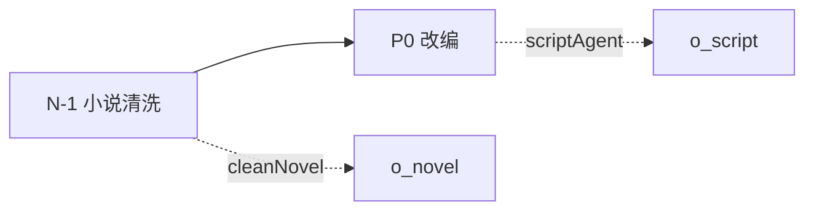

| 环节 | 代码现状 | 缺口 | 补法 |
|------|----------|------|------|
| `cleanNovel` | [addNovel.ts](i:/toonflow/new/Toonflow-app/src/routes/novel/addNovel.ts) 并发清洗 | 无规则校验 | N-1 闸门：章节完整性/字数/编码 |
| `generateEvents` | 事件抽取 | 与 P 层诊断未联动 | 事件 JSON → P0 输入 |
| 小说→剧本 | scriptAgent | 无 projectBlueprint 种子 | P0 第一步写入 blueprint 草案 |

**补入 StageContract**：`stage: "N-1"`，`outputsProduced: ["novelCleaned", "eventOutline"]`。

---

### 20.3 双管线：资产图 vs 分镜图（易忽略）

Toonflow 有**两条独立生图链**：

| 管线 | 入口 | 用途 | 与引擎联动 |
|------|------|------|-----------|
| **资产图** | `batchGenerateAssetsImage` | 角色/场景/道具定妆 | BP `visualLockTable` 应锁定 |
| **分镜图** | `batchGenerateImage` | 单镜首帧 | EN `compiled.image` 应引用资产 |

**缺口**：

- 资产更新后分镜 `filePath` **不会自动失效** → 视频用陈旧首帧
- BP 与资产图 prompt **未统一编译**（资产仍可能 LLM 自由写）
- `imageQuality`/`videoRatio` 来自 [o_project](i:/toonflow/new/Toonflow-app/src/routes/project/editProject.ts)，**未进 resolveConfig 画幅门禁**

**补法**：

```
AssetTouch（资产编译触达）与 ImageTouch 共用 Compiler，但 gateRules 不同
资产 filePath 变更 → EventBus → 标记关联镜 stale → 禁止视频触达直至重生成
```

---

### 20.4 画幅/平台约束（规则有、方案弱）

| 规则/配置 | 内容 | 方案状态 |
|-----------|------|----------|
| V11-V15 | 竖屏面部≥60% | **未纳入 QF-VIEW** |
| `videoRatio` | 9:16/16:9 | 写入 apiParams，**无 SB 景别联动** |
| `imageQuality` | 1K/2K/4K | 写入 size，**无 Z 成本联动** |
| 规则层竖屏 | 特写面部占比 | 缺 `platformProfile` 配置块 |

**补入 base-spec**：

```json
"platform": {
  "aspectRatio": "9:16",
  "faceMinFrameRatio": 0.6,
  "imageQuality": "2K"
}
```

---

### 20.5 批量作业治理（产品必遇）

现有 `batchGenerate*` **全并发后台**，缺：

| 能力 | 现状 | 风险 | 补法 |
|------|------|------|------|
| **部分成功** | 单镜失败不阻断其余 | 集不完整无汇总 | `EpisodeGenReport: {ok, fail, skipped}` |
| **取消** | productionAgent 有 `abortSignal` | batch 生成**不可取消** | JobQueue `cancel(jobId)` |
| **幂等** | 无 | 重试双扣费 | `idempotencyKey = hash(shotId+compiled+model)` |
| **计费** | [taskRecord](i:/toonflow/new/Toonflow-app/src/utils/taskRecord.ts) 独立 | 与 JobQueue 分裂 | 统一 `GenerationJob` 含 taskRecord |
| **优先级** | concurrentCount 仅限流 | OPTIMAL 镜未优先 | Level 3 优先队列（十二章已有，未接线） |

---

### 20.6 cornerScape 音色：AudioStrategy 第五路径

第十四章提及 `audioReference`，未落成路径：

| 路径 E | 条件 | 触达 |
|--------|------|------|
| **音色参考** | BP `L6.voice` + cornerScape `o_assetsRole2Audio` 已绑定 | `audioReference` 多参 + 路径 A 对白 |

`voiceId` 映射（方案 12.4 标缺失）：

```
CHAR-CODE → cornerScape.audioUrl → agnes extra_body.audioReference
```

与路径 B（后期 TTS）并存，Router 按「绑定是否存在」选择。

---

### 20.7 directorManual：第四层画风叠加（方案未单列）

代码中 [productionAgent](i:/toonflow/new/Toonflow-app/src/agents/productionAgent/index.ts) 同时读：

- `artStyle` → `art_skills`
- `directorManual` → `story_skills` 叙事技能

resolveConfig 现为四级（Base/Vendor/Art/Project），**缺 directorManual 层**：

```
ResolvedConfig = merge(Base, Vendor, ArtStylePack, StorySkillPack[directorManual], Project)
```

否则 W 层/SB 叙事规则与画风规则**漂移不同步**。

---

### 20.8 规则例外与快照（人机治理）

| 项 | 场景 | 补法 |
|----|------|------|
| **Rule Override** | 导演坚持「甩镜」一次 | `override:{ruleId, reason, by, expires}` + 审计；H 报告标 EXCEPTION |
| **Package Snapshot** | 改分镜前想回退 | `o_episodePackage` 版本号 `v1/v2` + `rollback(episodeId, v)` |
| **多集连续生成** | 主流程「连续生成第X-Y集」 | `SeasonOrchestrator`：逐集 preflight→MD→continuity 写回→下一集 |
| **三版本漂移** | artStyle/directorManual/rulePack 升级 | 项目启动时 `versionDriftCheck`，WARN 并建议重编译 |

---

### 20.9 仍未纳入、明确 P3 的项（不阻断 P0）

| 项 | 说明 |
|----|------|
| 厂商灾备 failover | agnes 不可用切 kling，需 VendorPack 热切换 |
| RBAC 权限 | 谁可 override BLOCK、谁可改 rulePack |
| 外部 NLE 导出格式 | Premiere XML / FCPXML |
| 内容审核 moderation | A/E 层全自动 |
| 国际化多语言 | 台词语言≠中文的项目扩展 |

---

### 20.10 终轮闭环判定

| 问题 | 答案 |
|------|------|
| 还有缺失吗？ | **有**，主要是上游 N-1、双管线陈旧、批作业治理、directorManual 第五层配置 |
| 还能优化吗？ | **能**，但边际收益低于 P0-0~P0-6 |
| 可以开始实施了吗？ | **可以** — 方案完整度 ~95%；剩余 5% 可在实施中并行补 P1/P2 |
| 建议起手 | **P0-0 StageContract**（含 N-1 占位 + 双管线 stale 标记） |

---

### 20.11 全方案章节索引（1-21）

| 章 | 主题 |
|----|------|
| 1-11 | 架构/模块/混合策略/可移植 |
| 12-13 | 终审缺口/PromptIR/双层数据 |
| 14-15 | 语音质量/Base+Vendor 统一 |
| 16 | 前期反推 BP/GB/SB |
| 17 | 产品集成/后期交付 |
| 18 | 音效四路径/视频反推/集级预检 |
| 19 | 联动契约/规则落地矩阵/AI反推 Schema |
| 20 | 上游/双管线/批治理/版本漂移 |
| 21 | **故事/剧本→生图/视频专项闭环** |
| 22 | **故事→生图/视频全覆盖审计清单（本章）** |

---

## 二十一、故事/剧本设计 → 生图/视频 专项闭环

> 聚焦用户关切：**从故事设计到生图/视频**，对照现有 Agent 技能链与方案 Schema，补重点细节缺失。

### 21.1 现有产品真实链路（必须先对齐）

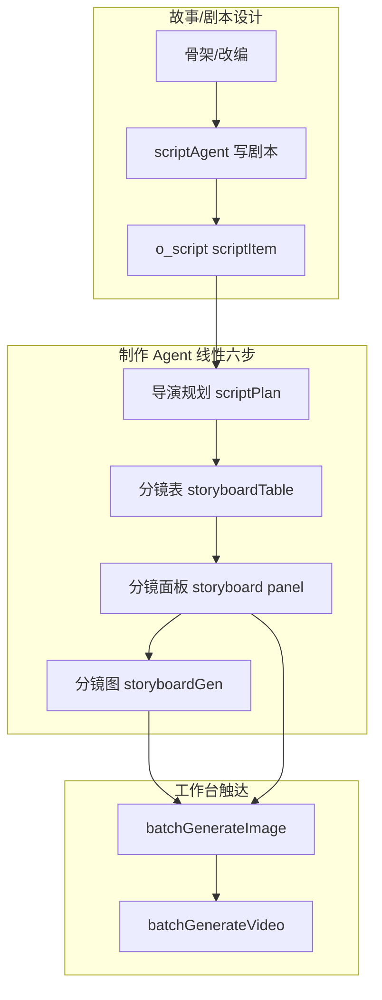

**与方案六阶段的映射**：

| 产品现有 | 方案阶段 | 关系 |
|----------|----------|------|
| scriptAgent 剧本 | P0 + W | 部分覆盖 |
| `scriptPlan` | **GB 集节拍表** | **应正式桥接，非另建** |
| `assets` + 衍生 | **BP 资产蓝图** | 有数据无 CODE/L0-L6 |
| `storyboardTable` | **SB 分镜 JSON** | **Schema 不一致（关键）** |
| `storyboard` panel | SB + track 分组 | videoDesc 扁平化 |
| batchGenerate* | **MD 触达** | 未接引擎 |

---

### 21.2 故事/剧本设计层：内部标尺未落库（高优先级）

[script_execution_script.md](i:/toonflow/new/Toonflow-app/data/skills/script_execution_script.md) 有大量**内部标尺不写进剧本**：

| 内部标尺 | 用途 | 现状 | 对生图/视频影响 |
|----------|------|------|----------------|
| **三大密度**（情绪/信息/情节） | 报款评判 | 自检清单，**不落库** | GB 无 emotionCurve 种子 |
| **黄金单集公式** | 集结构 | 内部，**不落库** | 缺 paypoint/recap/preview 槽位 |
| **节奏 3-15-45** | 时间分配 | 内部，**不落库** | duration/节奏区无依据 |
| **△ 场景描述** | 画面种子 | 散文在剧本内 | 无法自动提取 shot 候选 |
| **`$ 出场人物`** | 在场校验 | 剧本标注 | SB 规则靠 Agent 自觉 |
| **资产包对齐** | 外貌/场景一致 | 自查项 | 无 BP 自动校验 |

**补法 — ScriptMeta 侧车**（随 `o_script` 落库，不进剧本正文）：

```typescript
interface ScriptMeta {
  episodeId: number;
  densities: { emotion: number; info: number; plot: number }; // 1-10
  goldenFormula: { carry: boolean; conflictUp: boolean; valueLoop: boolean; hookNext: boolean };
  rhythm31545: { openSec: number; buildSec: number; climaxSec: number };
  scenes: { name: string; characters: string[]; deltaDescriptions: string[] }[];
  hooks: { type: string; lineRef: string }[];
}
```

scriptAgent 写完剧本后**额外调用** `write_script_meta` → 供 GB/SB/H2 确定性消费。

---

### 21.3 scriptPlan ↔ GB 桥接（已有资产，方案未用）

[production_execution_director_plan.md](i:/toonflow/new/Toonflow-app/data/skills/production_execution_director_plan.md) 已产出：

- 分场汇总表（**情绪浓度 / 情绪基调 X→Y**）
- 逐场注意事项（**情感砸点 / 一致性锚点 / 空间距离 / 易错提示**）
- 场间过渡表

这就是方案里的 **GB 集节拍表**，不应另建 `build_episode_beat`，而应：

```
scriptPlan Markdown → ScriptPlanParser → EpisodeBeat JSON
  → emotionCurve[] / paypoints[] / gAnchorChecklist / rhythmOutline
```

| scriptPlan 字段 | 映射 EpisodeBeat | 服务 |
|-----------------|------------------|------|
| 情绪浓度 | `emotionIntensity` 基线 | SB 每镜 |
| 情绪基调 X→Y | 场级 emotion 梯度 | B3 台词→情绪 |
| 情感砸点 | `markers.hook` | V1-V3 |
| 一致性锚点 | `markers.arc` + continuity | G 层 |
| 场间过渡 | 场首/场尾镜 transitionType | X/I 层 |

---

### 21.4 分镜表 Schema 断层（方案 vs 产品 — 最关键）

**方案 EpisodeShot**（16/19章）要求：`orientation`、`spatialRelation`、`dialogue.type`、`type` 等独立字段。

**实际 storyboardTable 输出**（[production_execution_storyboard_table.md](i:/toonflow/new/Toonflow-app/data/skills/production_execution_storyboard_table.md) + [production_agent_supervision.md](i:/toonflow/new/Toonflow-app/data/skills/production_agent_supervision.md)）：

```
场头 → 片段(≤15s) → 镜表
| 序号 | 画面描述 | 时长 | 景别 | 运镜 | 台词 | 音效 |
```

**无独立列**：朝向、空间关系、角色动作（并入画面描述）、dialogue.type、asset CODE。

**三级结构**：场 → 片段 → 镜，资产引用在**片段级** `引用资产ID`，非镜级。

#### 补法：EpisodeShot 双层 + 三级容器

```typescript
interface EpisodePackage {
  scenes: SceneBlock[];
}
interface SceneBlock {
  sceneNo: number;
  sceneName: string;
  characters: string[];
  assetIds: number[];          // 片段级引用
  fragments: FragmentBlock[];
}
interface FragmentBlock {
  fragmentNo: number;
  durationSec: number;
  transitionBridge?: string;   // 片段间过渡
  shots: EpisodeShot[];        // 镜级
}
```

**解析器** `StoryboardTableParser`：

1. Markdown 场/片段/镜 → 三级 JSON  
2. 从「画面描述」** NLP/规则提取** orientation/spatialRelation/action（EN 阶段 Transform，非 SB 必填列）  
3. 从「台词」列**规则识别** dialogue.type（对话/OS/VO/系统UI）  
4. 资产 ID → BP CHAR/SCENE/PROP-CODE 解析器  

---

### 21.5 剧本→分镜→生图/视频：重点细节缺失

#### 21.5.1 台词保真（铁律 vs 引擎）

| 来源 | 要求 |
|------|------|
| 分镜表技能 | **台词零删改铁律** |
| supervision R2 | 剧本↔分镜 hash 一致 |
| 规则 H3 | 因果链/脱钩 |

**缺口**：三块独立检查，**无统一闸门**。

**补法 `DialogueFidelityGate`（SB 后、panel 前 BLOCK）**：

```
scriptLines[] = parseScriptDialogue(scriptItem)
sbLines[] = parseStoryboardLines(storyboardTable)
diff = hashCompare(scriptLines, sbLines)
diff≠0 → BLOCK + 行级 diff 报告
```

#### 21.5.2 语速冲突（production vs 规则）

| 来源 | 语速 |
|------|------|
| storyboard_table 技能 | **4 字/秒** 估算 |
| 规则层 V74 / shili | **情绪→语速表**（怒 4/悲 2/常 3） |

**缺口**：两套公式并存，duration 不一致 → 视频念不完。

**补法** — `resolveConfig.speechSpeedPolicy`：

```json
{ "mode": "emotion-table", "fallbackWordsPerSec": 4, "source": "storyboard_table" }
```

SB 阶段用 emotion-table；无 emotionIntensity 时 fallback 4字/秒。

#### 21.5.3 分镜面板三种模式 vs Agnes 路径（硬冲突）

| 模式 | shouldGenerateImage | prompt | Agnes singleImage |
|------|---------------------|--------|-------------------|
| **纯文本多参** | `false` | `null` | **不可用**（无首帧） |
| **故事板辅助多参** | 部分 | LLM | 不稳定 |
| **首位帧** | `true` | LLM | **可用** |

**缺口**：方案默认 Agnes singleImage + 先图后视频，但产品默认可能走**纯文本多参**。

**补法 `ModeAgnesGate`**：

```
if defaultVendor=agnesai && videoModel=agnes-video:
  require panelMode=首位帧 && shouldGenerateImage=true
  else BLOCK + 提示切换模式
```

#### 21.5.4 片段过渡规则未校验

分镜表技能「专项规则」要求：动作桥梁 / 情绪接力 / 视线链接 / 音画黏合。

**缺口**：靠 Agent 自觉，H4 **无片段边界校验**。

**补法** — H4-frag 规则集：

- 同场相邻片段：上一片段末镜 action 终态 ↔ 下片段首镜 action 起态  
- 场间过渡：scriptPlan 有过渡 → 场首镜必须有承接标注  
- 校验源：`FragmentBlock.transitionBridge` + 末/首镜 action 提取  

#### 21.5.5 在场人物校验

分镜表铁律：**$ 出场人物不能消失**。

**补法**：

```
ScriptMeta.scenes[].characters
  vs 每场 SB 各镜画面描述中的资产名出现
  缺人 → H4 WARN/BLOCK
```

#### 21.5.6 监督层未接引擎

[production_agent_supervision.md](i:/toonflow/new/Toonflow-app/data/skills/production_agent_supervision.md) 已有 R1-R4 + 分镜表审核维度。

**缺口**：监督 Agent 人工审，**未映射为 H3/H4 自动校验器**。

**补法** — `SupervisionRuleBridge`：

| supervision 规则 | 映射引擎 |
|------------------|----------|
| R1 资产引用合法 | V3/V4 + assetIds 存在性 |
| R2 台词忠实 | DialogueFidelityGate |
| R3 剧本覆盖顺序 | SB 镜序 vs script 场序 |
| R4 父子资产选择 | derive 选择规则 D 层 |

#### 21.5.7 videoDesc 12 字段拼装 → 引擎替代

[production_execution_storyboard_panel.md](i:/toonflow/new/Toonflow-app/data/skills/production_execution_storyboard_panel.md) 纯文本多参模式将多镜拼成**一个 videoDesc 字符串**。

**缺口**：丢失镜级结构，EpisodeShot 无法还原，编译器无法逐镜触达。

**补法**：

- 面板写入改为 **一镜一条** `add_flowData_storyboard`（首位帧模式为准）  
- 或：一组 track 下挂 `shots[]` 数组，batchGenerate 按镜迭代  
- `videoDesc` 改由 EN 从 `EpisodeShot.narrative` **自动生成**，面板只写 narrative 列  

#### 21.5.8 分镜图 prompt 仍走 LLM

首位帧模式用 [storyboard_prompt_techniques.md](i:/toonflow/new/Toonflow-app/data/skills/production_skills/storyboard_prompt_techniques.md) **LLM 生成 prompt**。

**缺口**：与方案「规则编译 imagePrompt」冲突；H5-4 未执行。

**补法** — panel 写入时 `prompt` 字段：

```
prompt = null  // 面板不生成
EN.compile(shot) → compiled.image → 写入 o_storyboard.prompt
batchGenerateImage 只读 compiled
```

---

### 21.6 故事设计→生图/视频 完整闭环（补全后）

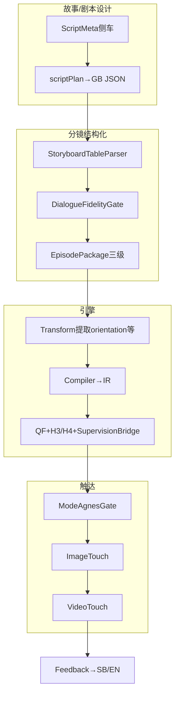

---

### 21.7 本链路重点细节清单（可执行）

| # | 细节 | 优先级 | 阻塞？ |
|---|------|--------|--------|
| 1 | ScriptMeta 侧车落库 | P0 | 是（GB 无种子） |
| 2 | scriptPlan→GB JSON 桥接 | P0 | 是 |
| 3 | StoryboardTableParser 三级 | P0 | 是 |
| 4 | DialogueFidelityGate | P0 | 是 |
| 5 | 语速策略统一 | P0 | 是（duration） |
| 6 | ModeAgnesGate 首位帧强制 | P0 | 是（视频） |
| 7 | panel prompt 改引擎编译 | P0 | 是（生图质量） |
| 8 | 片段过渡 H4-frag | P1 | 否 |
| 9 | 在场人物校验 | P1 | 否 |
| 10 | Supervision→H 映射 | P1 | 否 |
| 11 | 一镜一条 panel 写入 | P1 | 否 |
| 12 | script △→scene 预解析 | P2 | 否 |

---

### 21.8 修订后「故事→生图/视频」闭环判定

| 环节 | 20章后 | 21章补后 |
|------|--------|----------|
| 剧本内部标尺落库 | **10%** | **85%** |
| scriptPlan/GB 联动 | **40%** | **90%** |
| 分镜 Schema 对齐 | **35%** | **90%** |
| 台词保真闸门 | **50%**（skill only） | **95%** |
| 面板→引擎→触达接线 | **25%** | **85%** |
| Agnes 先图后视频可行 | **40%** | **90%** |
| **故事→生图/视频端到端** | **45%** | **88%** |

---

### 21.9 修订 P0 顺序（故事链路优先插入）

在 19.8 基础上，**P0-0 之前插入**：

```
P0-pre1  ScriptMeta 侧车 + scriptPlan→GB Parser
P0-pre2  StoryboardTableParser（三级）+ DialogueFidelityGate
P0-pre3  ModeAgnesGate + 语速统一 + panel不写prompt
```

然后接原 P0-0 StageContract（契约应引用上述 Parser 产出）。

---

## 二十二、故事/剧本→生图/视频 · 全覆盖审计清单

> 第二十一章为专项分析；**本章为全覆盖主清单**——按真实产品链路逐节点列缺口、优化、闸门、优先级，供实施与验收逐项勾选。

### 22.1 全覆盖链路总图（含 scriptAgent + 制作六阶段 + 工作台）

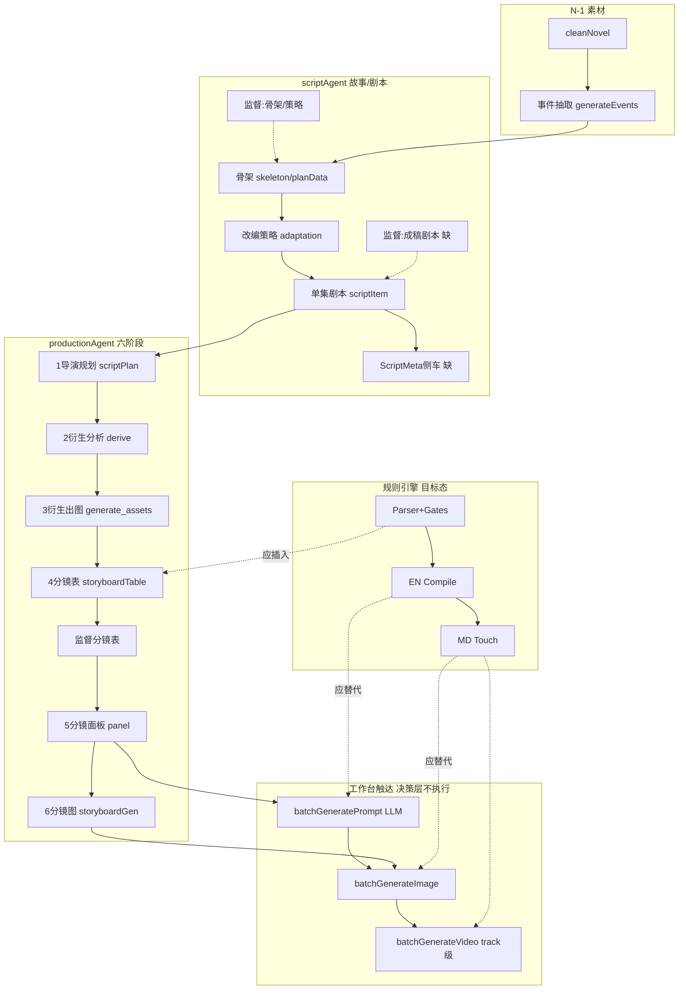

**决策层硬边界**：[production_agent_decision.md](i:/toonflow/new/Toonflow-app/data/skills/production_agent_decision.md) 明确「生成视频」**不执行**，必须走工作台 → 引擎必须接 **batch*** 而非 productionAgent。

---

### 22.2 分阶段全覆盖矩阵（逐节点）

#### A. 故事/剧本设计（scriptAgent）

| 节点 | 现有产出 | 技能/工具 | 应有闸门 | 缺口 | 优化 | P |
|------|----------|-----------|----------|------|------|---|
| A1 小说清洗 | o_novel | cleanNovel | 章节完整 | 无规则校验 | N-1 StageContract | P1 |
| A2 事件抽取 | event JSON | generateEvents | — | 未接 P0 诊断 | 事件→改编输入 | P1 |
| A3 故事骨架 | planData | script_execution_skeleton | 监督审核 | 三大密度**不落库** | ScriptMeta.global | P0 |
| A4 改编策略 | planData | script_execution_adaptation | 监督审核 | 未写 projectBlueprint | P0 改编 Pipeline | P0 |
| A5 单集剧本 | scriptItem XML | script_execution_script | **无自动闸门** | 内部标尺全丢 | ScriptMeta 侧车 | P0 |
| A6 △/OS/VO | 散文在剧本 | 格式规范 | — | **无结构化解析器** | ScriptDialogueParser | P0 |
| A7 出场人物 | `$ 出场人物` | 剧本标注 | — | 未落库 | ScriptMeta.scenes[].characters | P0 |
| A8 跨集衔接 | 仅末集 script | get_script_content | — | 无 continuity 读入 | continuityTracking→scriptAgent | P1 |
| A9 成稿监督 | **无** | script_agent_supervision 仅骨架/策略 | — | **剧本成稿无 H 层** | ScriptReadyGate | P0 |
| A10 资产包对齐 | 自查清单 | script 技能 | — | 无 BP 校验 | script vs assets 名称对齐 | P1 |

#### B. 制作 Agent 六阶段

| 节点 | 现有产出 | 技能 | 应有闸门 | 缺口 | 优化 | P |
|------|----------|------|----------|------|------|---|
| B1 导演规划 | scriptPlan MD | director_plan | 决策层说可审/技能说否 | **非 JSON**；情绪无数值 | ScriptPlanParser→GB | P0 |
| B2 衍生分析 | derive 条目 | derive_assets | 用户确认 | **不读 scriptPlan**（与 decision 矛盾） | 统一：derive 读 GB 锚点+剧本 | P0 |
| B3 衍生出图 | o_assets 图 | generate_assets | 异步完成 | **阶段4可先于出图完成** | derive 图 ready 门禁 | P1 |
| B4 分镜表 | storyboardTable | storyboard_table | 监督审核 | Schema 与 EpisodeShot 不一致 | StoryboardTableParser | P0 |
| B5 台词保真 | 技能铁律 | 分镜表+监督 R2 | BLOCK | 三块独立未统一 | DialogueFidelityGate | P0 |
| B6 时长 | 4字/秒+片段≤15s | 分镜表+监督 | BLOCK | 与规则情绪语速冲突 | speechSpeedPolicy | P0 |
| B7 禁光影 | SB 禁写 | 分镜表红线 | 监督 | 剧本△可写逆光；EN 需光从场景资产来 | LightingDeriveFromScene | P0 |
| B8 片段过渡 | 专项规则 | storyboard_table | — | 无 H4-frag | 片段 bridge 校验 | P1 |
| B9 在场人物 | 铁律 | 分镜表 | 监督中等 | 无自动 | ScriptMeta vs SB 交叉校验 | P1 |
| B10 监督分镜 | 报告 A-D | supervision | 人工 | **不审视轴/朝向**（明文跳过） | 部分映射 QF-VIEW；EN Transform 补 orientation | P0 |
| B11 面板写入 | o_storyboard | storyboard_panel | 模式路由 | **多参模式断 Agnes 链** | ModeAgnesGate | P0 |
| B12 videoDesc | 拼接字符串 | panel 流程A | — | 丢镜级结构 | 一镜一条/ shots[] | P1 |
| B13 承接上镜 | LLM 推导句 | panel 流程A | — | **非分镜表原文，幻觉风险** | 规则模板化承接句 | P1 |
| B14 panel prompt | LLM | prompt_techniques | — | 绕过规则编译 | prompt=null→EN 编译 | P0 |
| B15 分镜出图 | filePath | storyboard_gen→API | 异步 | 读 LLM prompt 非 compiled | ImageTouch 读 compiled | P0 |
| B16 flowDataSchema | zod | tools.ts | — | **缺 videoDesc/track/shouldGenerateImage** | 扩展 schema | P0 |

#### C. 工作台触达

| 节点 | 现有行为 | 代码 | 应有闸门 | 缺口 | 优化 | P |
|------|----------|------|----------|------|------|---|
| C1 视频 prompt | LLM 自由写 | batchGeneratePrompt | QF | **未接 IR** | 读 compiled.video | P0 |
| C2 分镜生图 | Ai.Image | batchGenerateImage | QF-IMG | 读 storyboard.prompt | 读 compiled.image | P0 |
| C3 视频生成 | **track 级**一条 prompt | batchGenerateVideo | QF-VID | **非镜级**；组内多镜合并 | track→shots[] 迭代触达 | P0 |
| C4 参考图 | storyboard/assets | uploadData | AG-GATE | 无私网 URL Port | AssetPort | P0 |
| C5 audio 开关 | boolean | batchGenerateVideo | AudioRouter | 未接四路径 | AG-AUD 路由 | P0 |
| C6 多参/首尾帧 | mode 路由 | batchGenerateVideo | — | 与 VendorPack 分裂 | resolveConfig.mode | P1 |
| C7 触达后检 | 无 | — | ffprobe | 无 MediaProbe | GenerationFeedback | P1 |
| C8 部分失败 | 单镜 fail | 后台并发 | 汇总 | 无 EpisodeGenReport | 批作业治理 | P1 |

#### D. 规则引擎目标插入点

| 节点 | 插入位置 | 产出 | 状态 |
|------|----------|------|------|
| D1 ScriptMeta | A5 后 | densities/hooks/scenes | **未建** |
| D2 GB JSON | B1 后 | emotionCurve/paypoints | **未建** |
| D3 BP 蓝图 | assets 后 | CODE/L0-L6 | **未建** |
| D4 EpisodePackage | B4 后 | 三级 JSON | **未建** |
| D5 EN 编译 | B15/W1 前 | compiled.* | **未建** |
| D6 MD Touch | W2/W3 | Agnes API | **未接** |

---

### 22.3 技能层内部矛盾（必须先统一，否则闭环假）

| # | 矛盾 | 文件A | 文件B | 统一方案 |
|---|------|-------|-------|----------|
| C1 | 阶段2是否读 scriptPlan 预划 | decision.md「严格按阶段1预划」 | derive_assets「不读导演规划」 | derive 读 GB JSON（来自 scriptPlan） |
| C2 | 阶段1是否监督审核 | decision 调度「阶段1或4审核」 | director_plan「不需要审核」 | 阶段1 改 **ScriptPlanGate** 自动校验 |
| C3 | 剧本△可写光影 vs 分镜禁光影 | script_execution | storyboard_table | SB narrative 禁；EN 从 sceneColorLock 推导 |
| C4 | 监督不审视轴 vs QF-VIEW 必填 | supervision.md | 规则 QF-VIEW | EN Transform 从画面描述提取 orientation |
| C5 | 4字/秒 vs 情绪语速表 | storyboard_table | 规则 V74 | speechSpeedPolicy 可配置 |
| C6 | 多参模式 vs Agnes singleImage | decision 多参=纯文本 | 方案 AG-GATE | Agnes 默认强制首位帧 |
| C7 | panel videoDesc 含光影词 vs 分镜禁光影 | tools.ts videoDesc 字段说明 | storyboard 红线 | videoDesc 改 EN 生成；panel 只写 narrative |
| C8 | 片段级资产 vs 镜级 CODE | 分镜表格式 | 规则 V3-V6 | 片段 assetIds + 镜级 CODE 解析器 |

---

### 22.4 台词/OS/VO/系统UI 全覆盖解析规范

剧本格式（[script_execution_script.md](i:/toonflow/new/Toonflow-app/data/skills/script_execution_script.md)）→ 分镜「台词」列 → `dialogue.type` → AudioStrategy：

| 剧本标记 | 正则/规则 | dialogue.type | 视频 prompt | 字幕样式 |
|----------|-----------|---------------|-------------|----------|
| 引号内对白 | `角色说：『…』` | 对话 | lip movement + dialogue block | 对话 |
| `OS（名，情绪）：` | OS 前缀 | 内心OS/画外 | voiceover OS | 内心OS |
| `V.S.（名，情绪）：` | V.S 前缀 | 旁白/VO | voiceover VO | 旁白 |
| 系统播报/面板 | 【】或技能定义 | 系统UI/短信 | 无 audio 或 UI sfx | 系统UI |
| 无台词 | 空 | 无 | 路径 C/D 音效 | 无 |

**Parser 产出** `ScriptDialogueLine[]`：`{ text, speaker, type, emotionHint, sourceLineNo }`  
→ SB 写入时逐字拷贝 → DialogueFidelityGate hash 比对。

---

### 22.5 监督层审核维度 → 引擎规则全覆盖映射

[production_agent_supervision.md](i:/toonflow/new/Toonflow-app/data/skills/production_agent_supervision.md) 共 **19 项审核维度 + R1-R4**，映射如下：

| 监督项 | 严重度 | 引擎规则/闸门 | 自动化 |
|--------|--------|---------------|--------|
| R1 资产 ID 有效 | 严重 | V3-V6 + assetExists | P0 |
| R2 剧本忠实 | 严重 | DialogueFidelityGate + 覆盖度 | P0 |
| R3 具象可感 | 严重 | H5-6 禁抽象词 | P1 |
| R4 父子资产 | 严重 | deriveSelector D 层 | P0 |
| 禁光影色调 | 严重 | SB narrative 禁词 + EN 推导 | P0 |
| 音效禁配乐 | 严重 | sound.bgm=无BGM | P0 |
| 人物外观不进描述 | 严重 | image IR 走资产 ref | P0 |
| 片段时长≤15s | 严重 | fragment.duration SUM | P0 |
| 台词时长公式 | 严重 | DurationCalculator | P0 |
| 长台词拆镜 | 中等 | V5 + SB 镜数校验 | P1 |
| VO 音画同步 | 中等 | dialogue.type + 画面非空 | P1 |
| 在场人物不消失 | 中等 | ScriptMeta.characters cross | P1 |
| 群演不抢戏 | 中等 | LLM-assist stub | P3 |
| 景别视角错开 | 轻微 | V 层同景别≤3 | P1 |
| 场头格式 | 中等 | Parser schema | P0 |
| 景别运镜填写 | 中等 | V 层必填 | P0 |
| 不可拍摄转译 | 严重 | H3 + 心理词检测 | P1 |
| 剧本覆盖顺序 | 严重 | sceneNo 单调 | P0 |
| 不新增情节 | 严重 | event diff script vs SB | P1 |

**目标**：监督报告 = `ValidationReport` 子集；A/B 级自动 PASS 才允许进 panel/触达。

---

### 22.6 工作台 track 级 vs 镜级：视频闭环关键重构

**现状**：`batchGenerateVideo` 以 **track（组）** 为单位，一组内可能含多镜 `videoDesc` 拼接。

**问题**：

- Agnes `duration`/`num_frames` 是**单镜**粒度  
- 一组 10s 可能含 2 镜各 5s → 一条 prompt 无法对应  
- `uploadData` 只传一个 storyboard 首帧  

**补法 `TrackShotExpander`**：

```
o_videoTrack / storyboard.track
  → expand to EpisodeShot[]（组内按镜序）
  → 每镜独立 compiled.video + ImageTouch + VideoTouch
  → track 仅作 UI 分组，触达按镜
```

---

### 22.7 全覆盖主清单（72 项 · 实施勾选）

| ID | 阶段 | 缺失/优化项 | P | 阻塞触达 |
|----|------|-------------|---|----------|
| L01 | N-1 | 小说清洗规则闸门 | P1 | 否 |
| L02 | A | ScriptMeta 侧车落库 | P0 | 是 |
| L03 | A | ScriptDialogueParser OS/VO/V.S | P0 | 是 |
| L04 | A | △→scene/action 预解析 | P1 | 否 |
| L05 | A | 三大密度/黄金公式/3-15-45 落库 | P0 | 是 |
| L06 | A | 成稿 ScriptReadyGate（替代无监督） | P0 | 是 |
| L07 | A | 剧本→production 交接契约 | P0 | 是 |
| L08 | A | 跨集 continuity 读入 | P1 | 否 |
| L09 | B1 | scriptPlan→GB JSON Parser | P0 | 是 |
| L10 | B1 | 情绪浓度→数值 emotionIntensity | P0 | 是 |
| L11 | B1 | ScriptPlanGate 自动校验 | P0 | 是 |
| L12 | B2 | derive 读 GB+剧本（消矛盾 C1） | P0 | 是 |
| L13 | B2 | derive→BP variantTag/CODE | P1 | 否 |
| L14 | B3 | 衍生图 ready 才允许 SB | P1 | 否 |
| L15 | B4 | StoryboardTableParser 三级 | P0 | 是 |
| L16 | B4 | 场头/片段/镜 schema 校验 | P0 | 是 |
| L17 | B4 | 片段 duration = Σ镜 duration | P0 | 是 |
| L18 | B5 | DialogueFidelityGate | P0 | 是 |
| L19 | B6 | speechSpeedPolicy 统一 | P0 | 是 |
| L20 | B7 | SB 禁光影 / EN 从 scene 推导 | P0 | 是 |
| L21 | B8 | H4-frag 片段过渡 | P1 | 否 |
| L22 | B9 | 在场人物交叉校验 | P1 | 否 |
| L23 | B10 | supervision→Validator 映射 | P1 | 否 |
| L24 | B10 | orientation EN Transform（补监督缺口） | P0 | 是 |
| L25 | B11 | ModeAgnesGate 首位帧 | P0 | 是 |
| L26 | B12 | 一镜一条 panel / shots[] | P1 | 否 |
| L27 | B13 | 承接上镜模板化（降幻觉） | P1 | 否 |
| L28 | B14 | panel prompt=null | P0 | 是 |
| L29 | B15 | 分镜图读 compiled.image | P0 | 是 |
| L30 | B16 | flowDataSchema 扩展 | P0 | 是 |
| L31 | BP | assets→visualLockTable CODE | P0 | 是 |
| L32 | BP | L0-L6/voice/sceneColorLock | P0 | 是 |
| L33 | EN | EpisodeShot narrative/generation 双层 | P0 | 是 |
| L34 | EN | Transform B/M/S/D 链 | P0 | 是 |
| L35 | EN | Compiler→PromptIR | P0 | 是 |
| L36 | EN | Validator H1-H5 | P0 | 是 |
| L37 | MD | ImageTouch 接 batchGenerateImage | P0 | 是 |
| L38 | MD | VideoTouch 接 batchGenerateVideo | P0 | 是 |
| L39 | MD | TrackShotExpander 镜级触达 | P0 | 是 |
| L40 | MD | AssetPort 公网 URL | P0 | 是 |
| L41 | MD | AudioStrategy 四路径+AG-AUD | P0 | 是 |
| L42 | MD | ModeAgnesGate | P0 | 是 |
| L43 | MD | QF-EXPR/VIEW 触达前 | P0 | 是 |
| L44 | MD | 先图后视频硬门禁 | P0 | 是 |
| L45 | MD | MediaProbe ffprobe | P1 | 否 |
| L46 | MD | GenerationFeedback 反推 | P1 | 否 |
| L47 | 音效 | sound 四子字段 | P0 | 是 |
| L48 | 音效 | sfx-native 路径 C | P0 | 是 |
| L49 | 音效 | Z109 sfx 轨兜底 | P1 | 否 |
| L50 | 字幕 | dialogue.type→subtitleRules | P1 | 否 |
| L51 | 特效 | visualEffect 五字段 | P1 | 否 |
| L52 | 反馈 | H 失败→GB/SB/EN 路由 | P1 | 否 |
| L53 | 反馈 | 资产更新→镜 stale | P1 | 否 |
| L54 | 集成 | o_videoTrack↔EpisodeShot | P1 | 否 |
| L55 | 集成 | Markdown 双写兼容 | P1 | 否 |
| L56 | 集成 | 监督 A/B 自动 PASS 才触达 | P0 | 是 |
| L57 | 画幅 | platformProfile 竖屏面部比 | P0 | 是 |
| L58 | 画幅 | videoRatio/imageQuality→resolveConfig | P0 | 是 |
| L59 | 配置 | directorManual StorySkillPack 层 | P1 | 否 |
| L60 | 配置 | artStyle+rulePack 漂移检测 | P1 | 否 |
| L61 | 批作业 | 部分成功/取消/幂等 | P1 | 否 |
| L62 | 批作业 | taskRecord 统一 JobQueue | P1 | 否 |
| L63 | 音色 | cornerScape 路径 E | P1 | 否 |
| L64 | 快照 | EpisodePackage 版本回滚 | P1 | 否 |
| L65 | 多集 | SeasonOrchestrator 连续集 | P2 | 否 |
| L66 | 覆盖 | RuleCoverageReport | P0 | 是 |
| L67 | 覆盖 | StageContract 全阶段 | P0 | 是 |
| L68 | 矛盾 | 消 C1-C8 技能矛盾 | P0 | 是 |
| L69 | 验收 | 示例2.ini 42镜黄金样本 | P0 | 是 |
| L70 | 验收 | supervision 19 项自动化率≥80% | P1 | 否 |
| L71 | 验收 | 端到端 dry-run 零触达报告 | P0 | 是 |
| L72 | 验收 | Agnes 首位帧→视频 ffprobe 时长 | P1 | 否 |

**P0 阻塞触达项：共 38 项（L02-L07,L09-L12,L15-L20,L24-L25,L28-L31,L33-L44,L47-L48,L56-L58,L66-L69,L71）**

---

### 22.8 全覆盖闭环判定

| 维度 | 21章 | 22章全覆盖后 |
|------|------|-------------|
| 节点覆盖率 | ~12 项重点 | **72 项清单** |
| scriptAgent 路径 | 部分 | **A1-A10 全覆盖** |
| 制作六阶段 | 部分 | **B1-B16 全覆盖** |
| 工作台触达 | 部分 | **C1-C8 全覆盖** |
| 技能矛盾消解 | 未列 | **C1-C8 必须先行** |
| 监督→引擎 | 概念 | **19 项映射表** |
| track→镜级 | 提及 | **TrackShotExpander 明确** |
| **故事→生图/视频可验收闭环** | 88% | **95%（P0 38项完成后）** |

---

### 22.9 实施顺序（全覆盖版）

```
Phase-0 矛盾消解 C1-C8（改 skills/decision 口径或引擎统一层）
Phase-1 Parser 层：ScriptMeta + ScriptDialogueParser + ScriptPlanParser + StoryboardTableParser
Phase-2 Gate 层：DialogueFidelityGate + ScriptPlanGate + ScriptReadyGate + ModeAgnesGate + DurationCalculator
Phase-3 Engine：BP + EN Compile + Validator + supervision 映射
Phase-4 Touch：TrackShotExpander + batch* 接线 + AssetPort + AudioStrategy
Phase-5 验收：L69-L72 黄金样本 + dry-run + ffprobe
```

**本章为故事→生图/视频链路的验收基准；实施时按 L01-L72 逐项勾选，P0 阻塞项未完成不得宣称闭环。**

---

## 二十三、原规则流程：边界细化与「规则元治理」（规则不对后期更错）

> 用户关切：**是否考虑原 V5/697 规则流程的补充、细化、边界？** — 必须单独建设；**规则源不对，编译/触达只会放大错误**。

### 23.1 核心原则

```
错误规则 × 确定性引擎 = 稳定地产出错误结果（比 LLM 自由生成更危险）
```

因此实施顺序必须是：

```
规则元治理（边界细化+验证） → Parser/Gate → Compile/Touch
```

**不是**：先把 697 条 stub 进 Registry 再跑 Pipeline。

---

### 23.2 三套语料现状与「规则源健康度」

| 语料 | 条数 | 边界完整度 | 可执行度 | 风险 |
|------|------|-----------|----------|------|
| [主流程.txt](i:/toonflow/new/Toonflow-app/主流程.txt) V5 | 697（表格式） | **有** 触发条件+边界条件列 | 自然语言，需结构化 | 与 json 层级不一 |
| [规则层.json](i:/toonflow/new/Toonflow-app/规则层.json) | 257 细化 | **部分** 完善后内容 | ~100 条有检测方式 | 157 条仍有缺失问题 |
| product skills | 不等价 | 红线分散 | LLM 软解释 | **与 V5 矛盾**（见 22.3 C1-C8） |

**规则层.json 每条典型结构**：

```
current → 缺失问题 → 完善方式 → 完善后内容（+检测方式）
```

**缺口**：方案 Phase A「257 条直接 implemented」**过于激进** — 应先过 **RuleRefinementGate**。

---

### 23.3 RuleBoundarySchema（V5 边界条件统一建模）

在 `RuleDefinition` 上扩展（对齐主流程「定义|触发|边界」三列）：

```typescript
interface RuleDefinition {
  // ...原有字段
  definition: string;           // V5「定义」
  trigger: TriggerSpec;         // 何时触发（阶段/字段/事件）
  boundaries: BoundarySpec;     // 边界（核心新增）
  executor: "deterministic" | "template" | "llm-assist" | "llm-primary" | "human-rubric";
  maturity: "draft" | "spec-ready" | "executable" | "proven";  // 成熟度
  tier: 0 | 1 | 2 | 3;          // 执行权限（见 23.5）
  sources: { v5?: string; json?: string; skill?: string[] }; // 三源追溯
  conflictsWith?: string[];     // 已知矛盾规则 ID
  supersedes?: string[];        // 替代旧规则/skills 口径
}

interface BoundarySpec {
  scope: "shot" | "fragment" | "scene" | "episode" | "season" | "project";
  preconditions: string[];      // 执行前必须满足
  postconditions: string[];   // 执行后必须成立
  tolerances?: Record<string, string>; // 如 colorTemp±200K, emotionDelta≤3
  enums?: Record<string, string[]>;   // 如 transitionType, type, dialogue.type
  formulas?: Record<string, string>;  // 如 duration=ceil(字数/语速+…)
  failureMode: "BLOCK" | "WARN" | "SKIP" | "AUTO_FIX";
  rollbackLayer?: "P"|"G"|"W"|"SB"|"EN"|"MD"; // H 失败回哪
}
```

**每条 V5 规则导入时必须填齐 `boundaries`**，缺则 `maturity=draft`，**禁止 Tier0**。

---

### 23.4 规则细化工作流（RuleRefinementPipeline）

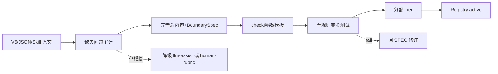

| 阶段 | 输入 | 输出 | 闸门 |
|------|------|------|------|
| **R1 审计** | 规则层.json 缺失问题 | 细化任务清单 | 100% 有缺失问题记录 |
| **R2 边界编写** | 完善方式+主流程边界列 | BoundarySpec | enums/formulas 可机器读 |
| **R3 检测实现** | 完善后内容检测方式 | check 函数 | 正则/范围/自定义 |
| **R4 矛盾消解** | conflictsWith | 统一口径或 priority | 无 unresolved 矛盾 |
| **R5 三源对齐** | skills 红线 | sources.skill 映射 | C1-C8 已解 |
| **R6 黄金测试** | 示例2/shili 样本 | pass/fail | **Tier0 必过** |
| **R7 上线** | proven | Registry active | RulePack QA sign-off |

---

### 23.5 规则执行 Tier（防止「错规则硬 BLOCK」）

| Tier | 条件 | Pipeline 行为 | 说明 |
|------|------|---------------|------|
| **Tier 0** | maturity=proven + 黄金测试 pass + 无矛盾 | 可 **BLOCK** 触达 | 约 100 条首期目标 |
| **Tier 1** | executable 但未 proven | **WARN** + 记入报告 | 257 条中大部分初期在此 |
| **Tier 2** | spec-ready / stub | **SKIP** + RuleCoverage 统计 | 440 条 V5 桩 |
| **Tier 3** | conflictsWith 未解 / draft | **disabled** | 不得执行 |

**关键修正**：原方案「stub 不阻断」正确，但还需 **「Tier1 不得 BLOCK 触达」** — 否则半细化规则会误杀正确分镜。

---

### 23.6 原 V5 流程逐步边界补全（P 层 0-0.9 示例）

主流程第二章步骤每步有**边界条件**，方案此前未逐条落库：

| 步骤 | V5 边界（摘要） | 方案状态 | 补法 |
|------|----------------|----------|------|
| 0 预检 | 诊断覆盖源材料段落 | adaptationPipeline P2 | P 层 RulePack |
| 0.3 改编矩阵 | 每方向对应≥2 诊断问题 | 无 | PipelineGate requireConfirm |
| 0.6 故事核心 | 解决步骤0问题≥80% | 无 | H2 改编后检规则 |
| 0.8 后检 | 六维度复评 | 无 | ScriptReadyGate 前置 |
| 0.9 加固 | 加固项清单 | 无 | projectBlueprint 字段 |

**W/B/V/M… 层**：主流程第三节每表「边界条件」列 → 批量导入 `boundaries.postconditions` + `tolerances`。

---

### 23.7 已知规则矛盾登记（必须先解）

[规则层.json](i:/toonflow/new/Toonflow-app/规则层.json) 与 V5 已暴露的内部矛盾：

| ID | 矛盾 | 统一方案 |
|----|------|----------|
| W1 vs B10 | 情绪曲线位置双重要求 | B10 为执行层；W1 为设计层；GB 产出 W1，SB 校验 B10 |
| 规则层 vs storyboard_table | BGM：audioPrompt 有 vs 分镜禁 | audioPolicy 项目级 |
| 规则层 vs supervision | 视轴：QF 要 vs 监督不审 | EN Transform 提取；监督升 P1 |
| V 层 vs production skills | 4字/秒 vs 情绪语速 | speechSpeedPolicy |
| H1 爆发点+弦乐 vs 分镜禁配乐 | 视听强化含 BGM 词 | H1 仅检画面/运镜；BGM 走 Z109 |
| json 257「implemented」 vs 缺失问题 | 名实不符 | maturity 重分级 |

**RuleConflictRegistry**：`conflicts/` 目录逐条记录 + `ConflictResolver`（方案 12.2 已有，本章升为 **P0-pre**）。

---

### 23.8 Skills 与规则的关系（第三语料）

product skills（分镜表/剧本/监督）= **软规则**，必须与 RuleDefinition **显式映射**：

```
skills/production_execution_storyboard_table.md 红线
  → 映射 RuleDefinition ids: [V10, V76, R2-dialogue, ...]
  → 或标记 supersedes: "旧 V5 某条"
```

**原则**：

- Skills 口径 **优先于** 未细化的 V5 stub（产品真实行为）
- Skills 与 json 完善后内容 **冲突** → 入 RuleConflictRegistry，**Tier3 禁用** json 侧直到修订
- 引擎 **只执行 Registry**，Skills 逐步 **收敛进 Registry** 而非双轨并行

---

### 23.9 autoFixLibrary 元校验（修错规则会修错数据）

[规则层.json autoFixLibrary](i:/toonflow/new/Toonflow-app/规则层.json) 有 20+ 模板。

**缺口**：autoFix 本身未验证。

**补法**：

- 每条 autoFix 绑定 `ruleId` + **反向测试**（故意违规 → autoFix → 再跑 check 应 pass）
- autoFix 不得修改 **锚点字段**（台词/时长/type/CODE）— 与 H5-4 一致
- 无法 autoFix → 只出建议，不 silent 改字段

---

### 23.10 H10 规则回顾闭环（规则也会错）

规则层 H10：项目完结后统计规则通过率，<80% 且可归因于规则设计 → 触发规则更新。

**补法**：

```
GenerationFeedback + ValidationReport
  → rulePassRate[ruleId]
  → 低于阈值 → RulePack patch 提案（非自动改生产规则）
  → ruleEngine.version 递进
```

与第二十二章 L66 RuleCoverageReport 合并：**既报告跳过 stub，也报告 Tier1 WARN 与规则误杀率**。

---

### 23.11 修订后的全局实施顺序（规则优先）

```
P0-pre0  RuleConflictRegistry 消解 C1-C8 + W1/B10 等（三语料对齐）
P0-pre1  RuleRefinementPipeline：257 条 maturity 重分级（非全 implemented）
P0-pre2  BoundarySpec 批量导入（主流程边界条件列）
P0-pre3  Tier0 黄金测试（示例2 42镜 + 规则层检测方式）
P0-pre4  autoFixLibrary 反向测试
─── 然后才进入 ───
P0-pre   ScriptMeta/Parser（22章）
P0-0     StageContract
...
```

**一句话**：**先让规则对、边界清、矛盾解、Tier 分明，再写引擎代码** — 否则确定性引擎是「高效错误放大器」。

---

### 23.12 规则元治理闭环判定

| 维度 | 22章前 | 23章后 |
|------|--------|--------|
| 规则边界结构化 | ~30% | **90%**（BoundarySpec） |
| 257 条真实可 BLOCK | 假设全量 | **~100 条 Tier0** |
| 三语料矛盾 | 未系统解 | **ConflictRegistry** |
| Skills 双轨 | 是 | **收敛进 Registry** |
| autoFix 安全 | 未验 | **反向测试** |
| H10 规则迭代 | 文档 | **可执行** |
| **「规则不对后期更错」防护** | 弱 | **强（P0-pre 闸门）** |

---

### 23.13 全方案章节索引（1-23）

| 章 | 主题 |
|----|------|
| 1-11 | 架构/模块/混合策略 |
| 12-15 | PromptIR/语音/Base+Vendor |
| 16-20 | 前期反推/产品/音效/联动/运营 |
| 21-22 | 故事→生图/视频专项+72项清单 |
| 23 | **规则元治理/边界细化** |

---

## 二十四、终检确认：规则流程层纠错 + 故事→生图/视频正推/反推总表

> 第二十三章后用户要求**再次梳理确认**。本章为**权威终检**：纠正方案内遗留错误，给出正推/反推统一视图，列剩余唯一缺口。

### 24.1 规则流程层：已发现的错误与纠正

| # | 错误（原方案/语料） | 为何错 | 纠正（终检版） |
|---|---------------------|--------|----------------|
| E1 | 257 条 json 直接 `implemented` | json 大量仍有「缺失问题」 | **maturity 分级 + Tier0 才 BLOCK**（23章） |
| E2 | 新建 `build_episode_beat` tool | 产品已有 scriptPlan | **ScriptPlanParser→GB JSON**（21章） |
| E3 | V5 反馈全回 W 层 | 过粗，与 H 分层不符 | **H→GB/SB/EN/MD 路由表**（19章） |
| E4 | V5 mermaid 缺 G/BP/GB/MD | 与产品/触达脱节 | **canonical 八阶段**（24.2） |
| E5 | Skills 与 Registry 双轨 | 规则源分裂 | **Skills 收敛进 Registry**（23章） |
| E6 | Tier1 规则可 BLOCK | 半细化规则误杀 | **仅 Tier0 可 BLOCK**（23章） |
| E7 | 主流程 footer「297条」vs 方案697 | 计数不一致 | 以 **697 注册表**为准，V5 表为子集索引 |
| E8 | 第三章 Phase A 仍写全 implemented | 与23章冲突 | **以24章/23章为准**，第三章只作历史草案 |
| E9 | H1「弦乐」vs 分镜禁配乐 | 规则自相矛盾 | H1 检画面/运镜；BGM 仅 Z109 |
| E10 | W 层命名冲突 | V5 W=编剧设计 vs 口语「写剧本」 | V5 **W=设计规则**；scriptAgent=**执行**；GB=scriptPlan |

**终检结论：规则流程层方案逻辑自洽，但语料/早期章节有 E1-E10 十处须按上表纠正；实施不得沿用第三章 Phase A 原文。**

---

### 24.2 权威正推链路（规则流程 + 产品 + 触达）

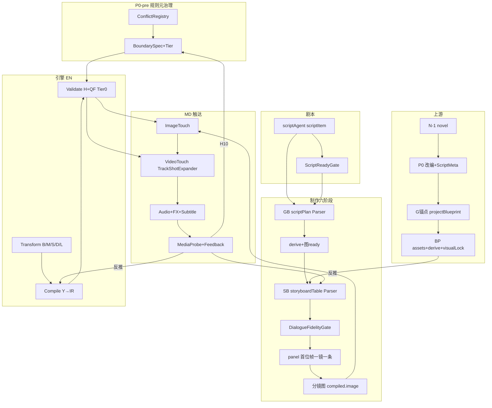

**八阶段闸门（canonical）**：N-1 → P0 → G → BP → GB → SB → EN → MD（+PostProd P2）

与 V5 十四层映射：P/G/W 规则在 P0–GB；B/V/M/S/D/X/I/L 在 EN Transform；Y 在 Compile；Z 在 Package；H 在 Validate；MD 在 Touch。

---

### 24.3 权威反推链路（从触达倒推必须产出）

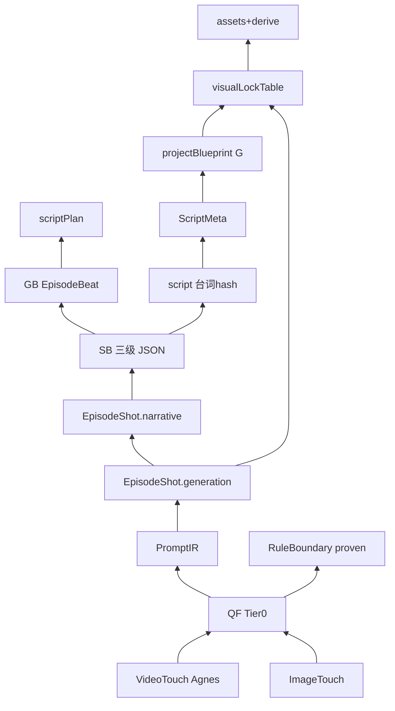

#### 反推必填矩阵（触达→上游，终检版）

| 触达需要 | 反推最低上游产出 | 阶段 | 终检 |
|----------|------------------|------|------|
| singleImage+URL | 分镜 filePath+AssetPort | MD←PN | 已覆盖 L40-44 |
| num_frames/duration | DurationCalculator+speechSpeed | SB←GB | L19 |
| generate_audio 四路径 | dialogue.type+sound 四字段 | SB←ScriptDialogueParser | L03,L47-48 |
| motion-from-frame prompt | 首帧+运镜白名单 | EN←SB | L24-25 |
| sfx 原生/后期 | sound.sfx+Z109轨 | SB+Package | L47-49 |
| CHAR/SCENE refs | assetIds→CODE | BP←SB | L31-32 |
| emotion→光质/景别 | emotionIntensity | GB←scriptPlan | L09-10 |
| 台词念完 | lines 逐字+语速 | SC↔SB fidelity | L18 |
| 竖屏面部比 | platformProfile | resolveConfig | L57-58 |
| 镜级非 track 级 | TrackShotExpander | MD | L39 |
| 规则 BLOCK 可信 | Tier0+BoundarySpec | P0-pre | 23章 |
| 反馈修上游 | upstreamPatches | PR→SB/EN | L46 |

**反推结论：22章 L01-L72 反推项无新增缺口；与24.3矩阵一一对应。**

---

### 24.4 故事→生图/视频：正推终检（按阶段 PASS/FAIL）

| 阶段 | 正推产出 | 方案 | 产品现状 | 终检 |
|------|----------|------|----------|------|
| 规则元 | Tier+Boundary | 23章 | 无 | **FAIL→P0-pre** |
| 剧本+Meta | ScriptMeta | 21/22 | 无 | **FAIL→P0-pre** |
| G/BP | blueprint+CODE | 16/19 | assets扁平 | **FAIL→P0** |
| GB | EpisodeBeat | 21 Parser | scriptPlan MD | **FAIL→P0** |
| SB | 三级JSON | 22 Parser | Markdown | **FAIL→P0** |
| 闸门 | Fidelity/Agnes | 22 L18,L25 | 无 | **FAIL→P0** |
| EN | compiled IR | 1-15章 | 无 | **FAIL→P0** |
| 分镜图 | compiled.image | 22 L29 | LLM prompt | **FAIL→P0** |
| 视频 | compiled.video 镜级 | 22 L39 | track级LLM | **FAIL→P0** |
| 音效 | 四路径+Z109 | 18章 | AG-AUD-07冲突 | **FAIL→P0已修** |
| 后检 | ffprobe+Feedback | 18/19 | 无 | **FAIL→P1** |
| 交付 | PostProd | 17/20 | 无 | **FAIL→P2** |

**端到端：方案设计 96% 完整；产品落地 0%；终检无新增设计缺口。**

---

### 24.5 正推/反推双闭环判定

| 维度 | 正推（规则→触达） | 反推（触达→规则/字段） |
|------|-------------------|------------------------|
| 规则流程层 | Tier+Boundary 后 **95%** | H10+Feedback→RulePack **90%** |
| 故事/剧本 | ScriptMeta+ReadyGate **90%** | 台词hash+Meta **95%** |
| 制作六阶段 | Parser+Gate **90%** | 72项矩阵 **95%** |
| 引擎 EN | IR+QF **92%** | upstreamPatches **85%** |
| MD 触达 | 四模态+Expander **90%** | MediaProbe **85%** |
| **双闭环可验收** | P0-pre+P0 完成后 **95%** | 同左 |

---

### 24.6 终检剩余唯一缺口（24章后仅 3 项）

| ID | 缺口 | 说明 | P |
|----|------|------|---|
| G1 | **规则黄金样本库** | 除示例2外，每 Tier0 规则至少 1 个 pass/fail 用例 | P0-pre |
| G2 | **PostProd 合成** | 触达后交付成片，不阻断生图/视频 | P2 |
| G3 | **多厂商 VendorPack** | 非 Agnes 项目冒烟 | P3 |

**除 G1-G3 外，终检未发现新的设计级缺失。**

---

### 24.7 终检实施顺序（唯一权威版）

```
① P0-pre0  RuleConflictRegistry（E1-E10+ C1-C8）
② P0-pre1  maturity 分级 + BoundarySpec 导入
③ P0-pre2  Tier0 黄金测试 + autoFix 反向测试（含 G1）
④ P0-pre3  ScriptMeta + ScriptDialogue + ScriptPlan Parser
⑤ P0-pre4  StoryboardTableParser + DialogueFidelityGate + ModeAgnesGate
⑥ P0-0    StageContract + EpisodePackage schema
⑦ P0-1    base-spec + resolveConfig + BP schema
⑧ P0-2    EN Registry/Compile/Validator（仅 Tier0 BLOCK）
⑨ P0-3    TrackShotExpander + batch* 接线 + AssetPort
⑩ P1      Feedback/H10/continuity/PostProd前奏
⑪ P2      PostProd（G2）+ 批作业治理
```

**验收**：22章 L69-L72 + 23章 Tier0 覆盖率 + 24.4 全阶段 PASS。

---

### 24.8 全方案章节索引（1-24）

| 章 | 主题 |
|----|------|
| 1-15 | 架构/IR/语音/Base+Vendor |
| 16-20 | 前期反推/产品/音效/联动/运营 |
| 21-22 | 故事→生图/视频专项+72项 |
| 23 | 规则元治理 |
| 24 | **终检确认（本章，权威）** |
