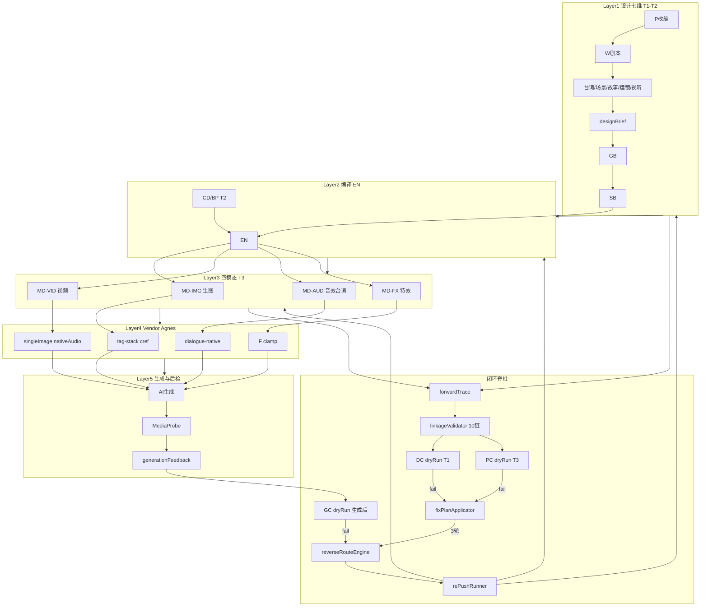
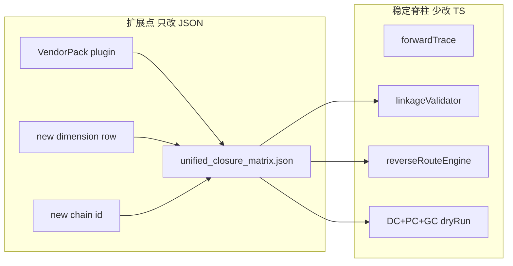
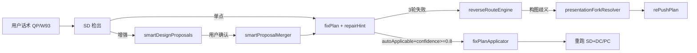
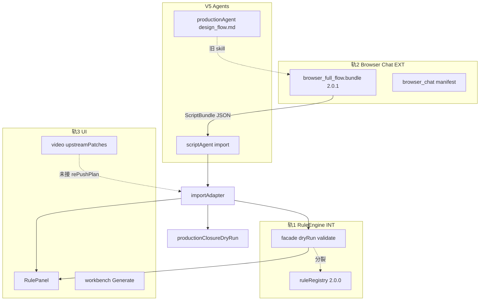

# 设计七维 + 四模态 AI 实现 · 统一闭环优化

> **对你问题的直接回答**  
> 1. **联动是否还有缺失？** 有。原「七维计划」与已落地的 §15 四模态 **未在同一 spine 上串联**——缺「设计字段 → EN compile → MD slot → Vendor → 生成 → MediaProbe → feedback」的 **十链 + 三级 dryRun**。  
> 2. **边界是否细化？** 本版补 **Tier×Stage×CAN/CANNOT** 矩阵（T1/T2/T3 × 七维 × 四模态）。  
> 3. **AI 生图/视频/音效/特效/台词闭环？** 全部纳入 **modality 链 + gen 链**，与台词/场景/运镜/视听设计维 **一一映射**。  
> 4. **正推反推？** 单一 `forwardTrace` + 单一 `reverseRouteEngine`（加载 `unified_closure_matrix.json`），消除三处路由漂移。  
> 5. **易扩展？** VendorPack / 新维度 / 新链 **只改 matrix JSON**，不改 spine 代码。

---

## 一、缺口诊断（原方案 vs 需补齐）

| 缺口 | 原七维计划 | §15 已落地 | 本版补齐 |
|------|-----------|-----------|----------|
| 台词 W3→SB→**AUD 生成** | dialogue 链到 lipSync | PC-10 native | **gen_dialogue 链** + GC-03 |
| 场景 B6→**IMG cref** | asset 链到 EN.cref | PC-11 | **scene_to_image 链** + DC-06 |
| 运镜 SB→**VID motion** | av 链到 EN.Y9 | PC-09 | **camera_to_video 链** + DC-09 |
| 视听 B4/B9→**AUD/VID** | av 链抽象 | videoAudioPolicy | **av_to_modality 链** + DC-10 |
| 故事 B5→**FX 可行性** | story→graph | PC-12 F5 | **story_to_fx 链** + DC-07 |
| 特效 W3→SB→**MD-FX→VID** | 未连 | fxFeasibilityAudit | **fx_to_video 链** + GC-05 |
| 生成失败→**设计反推** | reverseRoute 未接 design | generationFeedback P0-P3 | **gen 链** + rePush preserveFields |
| SUB/debut | 未入七维 | PR-16/PC-05 | **debut 链** + DC-11 |
| T2→T3 桥 | 弱 | modality_touch_matrix | **compile_to_md 链** + DC-12 |
| 边界 Tier | 口头 T1 禁 prompt | appendix P CAN/CANNOT | **unified_closure_matrix.boundaries** |

---

## 二、统一架构：十链 + 三级 dryRun



### 十链定义（扩展 [`linkage_chains.json`](i:/toonflow/new/Toonflow-app/data/fixtures/linkage_chains.json)）

| # | id | 节点 | 设计维 | 模态 | rollback |
|---|-----|------|--------|------|----------|
| 1 | dialogue | W3.script → SB.lines → EN.AUD → VID.lipSync | 台词 | AUD/VID | W3,SB,EN |
| 2 | asset | CD.L0 → BP.visualLock → SB.charCodes → EN.cref → **IMG.cref** | 场景/角色 | IMG | CD,BP,SB,EN,MD |
| 3 | continuity | prevSummary → GB → W3 → pipeline写回 | 连贯 | — | W3,continuity |
| 4 | av | B4 → GB.emotion → SB.emotion → EN.Y9 → **AUD.emotion / VID.expr** | 视听 | AUD/VID | brief,GB,SB,EN |
| 5 | story | W1 → B5 → SB.markers → narrativeGraph → **FX.level** | 故事推进 | FX | W1,W3,SB |
| 6 | scene | B6.scenes → GB场表 → SB.sceneName → BP.sceneColor → **IMG.scene** | 场景 | IMG | B,GB,SB,BP,EN |
| 7 | camera | B12/B13 → SB.shotSize/transition/rhythm → EN.motion → **VID.camera** | 运镜/切换 | VID | brief,SB,EN,MD |
| 8 | modality_compile | EN.compile → MD×4 slots → modalityPromptAudit | — | 全模态 | EN,MD |
| 9 | generation | MD prompts → VendorPack → generate → MediaProbe → feedback | — | 全模态 | MD,EN,SB |
| 10 | repair | SD → fixPlan → linkageRepair → rePushPlan | 修复 | — | reverse_route |

原六链保留 id 1–5 + 10；**新增 6–9** 为设计→AI 实现桥。

### 三级 dryRun

| 级别 | 文件 | 范围 | ID |
|------|------|------|-----|
| **DC** 设计 | `design_closure_checklist.json` | T1 export / import | DC-01~14 |
| **PC** 制作 | `production_closure_checklist.json`（已有） | T3 export | PC-01~14 |
| **GC** 生成 | `generation_closure_checklist.json`（新建） | 生成后 / dryRun | GC-01~08 |

**合流**：[`importAdapter.ts`](i:/toonflow/new/Toonflow-app/src/ruleEngine/bundle/importAdapter.ts) 按 tier 跑 DC | DC+PC | DC+PC+GC。

---

## 三、分层边界矩阵（Tier × 维 × CAN/CANNOT）

写入 [`unified_closure_matrix.json`](i:/toonflow/new/Toonflow-app/data/fixtures/unified_closure_matrix.json)（**单一扩展入口**）：

| Tier | 七维设计 | 四模态 AI | 生成 API |
|------|----------|-----------|----------|
| **T1** | CAN：剧本/分镜/lines/emotion/transition 抽象 | CANNOT：image/video/audio/fx prompt | CANNOT |
| **T2** | CAN：CD/BP/EN 草案、IMG subject/scene | CANNOT：完整 MD×4 | CANNOT |
| **T3** | CAN：读 T1 字段 trace 编译 | CAN：MD×4 + Vendor + audit | CAN：触达 L0 后生成 |
| **EN** | CAN：compile Y 映射 | CANNOT：改 lines / 调 API | CANNOT |
| **MD** | CAN：写 prompt slot | CANNOT：改 SB 叙事字段 | CANNOT |
| **Vendor** | CAN：叠加模板/门控 | CANNOT：改 Base ruleId | CANNOT |

每维增 **boundaryRef** 指向 appendix P（四模态）或 design_*（七维）。

---

## 四、七维 ↔ 四模态 正推映射（细节实现联动）

| 设计维 | 设计字段 | EN | MD 模态 | 生成物 | trace dimension |
|--------|----------|-----|---------|--------|-----------------|
| 台词 | W3/SB.lines | AUD compile | MD-AUD lines,voice | native/TTS 音频 | dialogue |
| 场景 | B6/SB.sceneName | IMG subject,cref | MD-IMG scene,cref | 分镜图/cref 图 | scene→asset |
| 故事 | B5/markers | FX 段 | MD-FX feasibility | 特效 prompt | story→fx |
| 运镜 | SB.shotSize,transition | VID motion,camera | MD-VID | 视频运镜 | camera |
| 视听 | B4/B9 | Y9,AUD mood | MD-AUD+VID expr | 情绪表演/BGM 词 | av |
| 角色 | CD/BP L0 | identity 全模态 | IMG/VID/AUD.identity | 跨模态一致 | asset |
| 特效 | SB.visualEffect | EN FX | MD-FX + VID.fx | F≤3 同镜 | fx_to_video |

**反推优先级（统一，写入 matrix.repairPriorityOrder）**：

```
P0: GEN失败(首帧/cref) → MD → EN
P0: GEN失败(视频/运镜) → MD-VID → EN
P1: GEN失败(语音/lines) → MD-AUD → EN → SB
P1: GEN失败(FX/F5) → MD-FX → SB → W3
P2: DC失败(台词hash/场景/故事) → SB → W3
P2: PC失败(identity) → EN → BP
P3: 叙事/改编 → GB/W2/W3
```

---

## 五、Wave 实施（全部落入，含 §15 已有项升级）

### R0 — Skill + 统一 Fixtures（P0 文档契约）

**Skill**

| 动作 | 文件 |
|------|------|
| 新建 | `design_dialogue.md`, `design_scene.md`, `design_story_push.md`, `design_camera_transition.md`, `design_av.md` |
| 扩展 | `design_brief.md`（B12 rhythm, B13 transitionPolicy）, `corridor_SB.md`（rhythmZone, markers, spatialRelation）, `corridor_GB.md`（场间过渡策略） |
| 扩展 | [`P_modality_touch_four.md`](i:/toonflow/new/Toonflow-app/data/skills/browser_chat/appendix/P_modality_touch_four.md) 增 **§15.9 设计→模态桥**（十链 6–9 说明） |
| 扩展 | `linkage_continuity.md`, `smart_detection.md`（SD-DLG/SCN/STP/CAM/AV + SD-IMG/VID/AUD/FX 并列）, `smart_fix.md` |
| 新建 | `appendix/T_unified_closure.md` — 十链总纲 + 三级 dryRun + 边界矩阵 |

**Fixtures**

| 文件 | 内容 |
|------|------|
| **`unified_closure_matrix.json`** | 十链 + 七维 + 四模态 + boundaries + repairPriority + rePushTargets + dryRunId 映射 |
| `design_dimension_matrix.json` | 七维 × stage × chain × ruleId |
| `forward_trace.schema.json` | dimension 含 modality 枚举 |
| `design_closure_checklist.json` | DC-01~14 |
| **`generation_closure_checklist.json`** | GC-01~08 |
| 扩展 `linkage_chains.json` | 链 6–10 |
| 扩展 `reverse_route_table.json` | 设计+模态+gen 全 trigger |
| 扩展 `modality_touch_matrix.json` | 增 `designSourceFields` 每模态 |
| 扩展 `modality_touch_matrix` ↔ `unified_closure_matrix` 交叉引用 |

**DC-01~14 / GC-01~08 清单**

| ID | 域 | 规则 |
|----|-----|------|
| DC-01 | dialogue | R2 lines 覆盖率 100% |
| DC-02 | dialogue | linesHash match |
| DC-03 | story | B5 markers ↔ SB.markers |
| DC-04 | av | B4 与 SB.emotion 偏差 ≤2 |
| DC-05 | continuity | B7/B8 多集非空 |
| DC-06 | scene | B6.scenes ↔ SB.sceneName |
| DC-07 | story→fx | markers 有 payoff 或 FX 等级 |
| DC-08 | asset | charCodes ↔ CD/BP |
| DC-09 | camera | transition/rhythm 合法枚举 |
| DC-10 | av→modality | B9 在 T3 有 AUD 槽位或标注 post |
| DC-11 | debut | 主角色/场景 debutIntro（WARN） |
| DC-12 | compile | T3 前 EN 草案存在（T2+） |
| DC-13 | linkage | 十链无 broken（linkageAudit） |
| DC-14 | forwardTrace | ≥N 条 trace 覆盖 dialogue+av+scene |
| GC-01 | gen | feedback 路由到 matrix 合法 target |
| GC-02 | gen | VID 首帧失败 → rePush MD 非 SB |
| GC-03 | gen | AUD native 失败 → EN 优先 |
| GC-04 | gen | IMG cref 失败 → EN/BP |
| GC-05 | gen | FX 失败 → SB/W3 |
| GC-06 | gen | MediaProbe duration 与 SB ±1s（预留） |
| GC-07 | gen | MediaProbe hasAudio 与 policy 一致（预留） |
| GC-08 | gen | 3 轮 SF 后 rePushPlan 非空 |

---

### R1 — PR 统一（阻塞路由）

同前方案：PR-01~16 以 [`production_reasonableness_PR.md`](i:/toonflow/new/Toonflow-app/data/skills/browser_chat/stages/production_reasonableness_PR.md) 为准；新增 **PR-CAM-01**；同步 O / qp_catalog / reverse_route / fix_templates。

---

### R2 — forwardTrace 全链（正推脊柱）

[`src/ruleEngine/design/forwardTrace.ts`](i:/toonflow/new/Toonflow-app/src/ruleEngine/design/forwardTrace.ts)：

- `buildForwardTrace(bundle, tier)` — 七维 + 四模态 + Vendor 节点
- 每条 trace：`preserveOnRePush`, `chainId`, `modality?`, `vendorGate?`
- import enrich；export 校验 DC-14

**验收 G86**：T1 ≥5 trace；**G96**：T3 样例含 IMG/VID/AUD/FX 各 ≥1 trace。

---

### R3 — linkageValidator + designClosureDryRun

[`src/ruleEngine/design/linkageValidator.ts`](i:/toonflow/new/Toonflow-app/src/ruleEngine/design/linkageValidator.ts) — 十链 walk  
[`src/ruleEngine/bundle/designClosureDryRun.ts`](i:/toonflow/new/Toonflow-app/src/ruleEngine/bundle/designClosureDryRun.ts) — DC-01~14

Golden：`golden/` 增 dialogue-break / scene-break / av-drift / camera-break / story-fx-break 等。

**验收 G87–G92**。

---

### R4 — 设计→模态桥接校验

[`src/ruleEngine/design/modalityDesignLinkage.ts`](i:/toonflow/new/Toonflow-app/src/ruleEngine/design/modalityDesignLinkage.ts)：

- 校验 SB/BP/brief 字段是否落到 MD slot（对照 modality_touch_matrix.designSourceFields）
- 与已有 [`productionClosureDryRun.ts`](i:/toonflow/new/Toonflow-app/src/ruleEngine/bundle/productionClosureDryRun.ts) PC-09~14 **交叉引用**（避免重复 BLOCK）
- 升级 [`modalityOrchestrator.ts`](i:/toonflow/new/Toonflow-app/src/ruleEngine/modalityOrchestrator.ts) `touchModalityWithAudit` 读取 forwardTrace.preserveFields

**验收 G97**：SB.lines 存在但 MD-AUD.lines 空 → PC-10 BLOCK + trace 指向 EN。

---

### R5 — reverseRouteEngine + SF + PR（反推脊柱）

[`src/ruleEngine/design/reverseRouteEngine.ts`](i:/toonflow/new/Toonflow-app/src/ruleEngine/design/reverseRouteEngine.ts) — **唯一加载** unified_closure_matrix + reverse_route_table  
[`src/ruleEngine/design/fixPlanApplicator.ts`](i:/toonflow/new/Toonflow-app/src/ruleEngine/design/fixPlanApplicator.ts)  
[`src/ruleEngine/design/rePushRunner.ts`](i:/toonflow/new/Toonflow-app/src/ruleEngine/design/rePushRunner.ts)  
[`src/ruleEngine/validators/prValidator.ts`](i:/toonflow/new/Toonflow-app/src/ruleEngine/validators/prValidator.ts)

- 合并 FEEDBACK_ROUTING / generationFeedback 优先级 → matrix.repairPriorityOrder
- applyAutoFix API 返回 rePushPlan
- importAdapter：DC+PC 失败 → 自动生成 linkageRepairPlan 或 rePushPlan

**验收 G93–G95**。

---

### R6 — narrativeGraph + story→FX 链

[`src/ruleEngine/design/narrativeGraphBuilder.ts`](i:/toonflow/new/Toonflow-app/src/ruleEngine/design/narrativeGraphBuilder.ts)：

- B5 + markers → graph；broken → reverseHints
- FX feasibility 与 story markers 联动（DC-07）

Golden：`story-marker-missing-block.json`, `story-fx-unhandled-block.json`

---

### R7 — 生成闭环 GC + MediaProbe

[`src/ruleEngine/bundle/generationClosureDryRun.ts`](i:/toonflow/new/Toonflow-app/src/ruleEngine/bundle/generationClosureDryRun.ts) — GC-01~08  
[`src/ruleEngine/ports/mediaProbe.ts`](i:/toonflow/new/Toonflow-app/src/ruleEngine/ports/mediaProbe.ts)（已有 stub）— 接入 GC-06/07 预留  
[`src/ruleEngine/ports/generationFeedback.ts`](i:/toonflow/new/Toonflow-app/src/ruleEngine/ports/generationFeedback.ts) — 改读 unified_matrix 优先级

**验收 G98–G100**。

---

### R8 — Bundle / 教程 / 统一测试

**Bundle** [`scripts/bundle-browser-full-flow.ts`](i:/toonflow/new/Toonflow-app/scripts/bundle-browser-full-flow.ts)：

- **§16** 设计七维（design_* skills）
- **§17** 统一闭环（appendix T + unified_closure_matrix + 十链图）
- **附录 T** unified_closure + DC/GC checklist
- **附录 U** 统一反推决策树（七维 + 四模态 + gen 合并）
- 保留 **§15 / 附录 P/Q**（四模态触达，不重复造 ID）

**教程** [`docs/BROWSER_CHAT_TUTORIAL.md`](i:/toonflow/new/Toonflow-app/docs/BROWSER_CHAT_TUTORIAL.md)：

- §七维设计 + §四模态 + §生成反推 **一棵决策树**
- §DC/PC/GC 导出前清单

**测试**

| 命令 | 覆盖 |
|------|------|
| `yarn test:unified-closure-golden` | DC+PC+GC 合流 G86–G100 |
| `yarn test:design-closure-golden` | DC 子集 |
| `yarn test:production-closure-golden` | PC 子集（已有 G72–G85） |
| `yarn test:forward-trace` | trace 生成 |
| `yarn test:reverse-route` | 路由一致性 |

**项目索引** [`plan/browser_chat_full_flow_优化版.plan.md`](i:/toonflow/new/Toonflow-app/plan/browser_chat_full_flow_优化版.plan.md) 增 §16/§17 条目。

---

## 六、易扩展实施方案



| 扩展场景 | 操作 |
|----------|------|
| 新 Vendor（kling） | `video_audio_policy.vendorDefaults` + VendorPack ts；Base/matrix 不变 |
| 新模态（如 LIP 独立轨） | matrix.modalities + linkage 链 + PC/GC 各 1 项 |
| 新设计维（如「节奏设计」） | design_dimension_matrix 一行 + design skill + DC 一项 |
| 新反推 trigger | reverse_route_table 一行 + autoFix 模板 |

---

## 七、验收 G86–G100 总表

| # | 验收 |
|---|------|
| G86 | T1 forwardTrace ≥5（dialogue+av+story） |
| G87–G92 | 十链 golden 各 BLOCK 对应 DC |
| G93 | R2 失败 rePush 含 preserveFields |
| G94 | av 偏差 linkageRepairPlan |
| G95 | SF 3 轮 escalate rePush |
| G96 | T3 trace 含 IMG/VID/AUD/FX |
| G97 | 设计→模态 slot 断裂 BLOCK |
| G98 | genFeedback 首帧→MD 优先于 SB |
| G99 | unified_matrix 十链均有 rePushTarget |
| G100 | yarn test:unified-closure-golden 全过 |

---

## 八、实施顺序（依赖）

```
R0 fixtures+skills → R1 PR统一 → R2 forwardTrace
  → R3 linkage+DC → R4 modalityDesignLinkage
  → R5 reverse+SF+PR → R6 narrative+storyFX
  → R7 GC+MediaProbe → R9 智能提示修复 → R10 双向trace+改编+SUB
  → R8 bundle+docs+tests
```

**与 §14/§15 关系**：PC-01~14 **保留不删**；DC 管设计、GC 管生成；§15 appendix P 边界 **被 unified_matrix.boundaries 引用**；本计划 **升级而非重写** 已落地四模态代码。

---

## 九、对你五项关切的最终对照

| 关切 | 本计划 |
|------|--------|
| 联动缺失 | 十链补 6–9（scene/camera/modality_compile/generation） |
| 边界细化 | unified_closure_matrix Tier×Stage CAN/CANNOT |
| AI 图/视/音/效/台词闭环 | 四模态链 + GC + genFeedback + Vendor 层 |
| 正推反推优化 | 单一 forwardTrace + reverseRouteEngine + preserveFields |
| 高质量/智能/易扩展 | DC+PC+GC 三级 SD/SF/rePush + JSON 扩展点 + G86–G100 |

---

## 十、逐项对比审计（逻辑 / 边界 / 正推反推互补 / 智能）

> **二次审计结论**：联动与 dryRun 骨架已齐；**智能提示（QP/W93–W100）与修复执行链**、**正推↔反推成对字段**、**改编维独立链**、**EXT/INT 双轨边界** 仍缺，已增 **R9/R10** 与 **IC-* 智能闭环**。

### 10.1 七维 + 四模态 + 改编 — 逐项矩阵

| 维度/模态 | 正推链 | 反推链 | 边界 Tier | DC/PC/GC | 智能提示 | 智能修复 | 计划状态 |
|-----------|--------|--------|-----------|----------|----------|----------|----------|
| **改编策略** P/W2 | P03→W2→W3 | W99→W2 | T1 CAN 策略 XML | — | W99, QP-08/09 | rePush W2 | **缺链** → R10 adaptation 链 |
| **剧本创作** W1/W3 | W1→W3→SB | W3 corridor | T1 禁分镜/运镜 | DC-01/02 | W94/W97 | fixPlan R2 | R0/R3 |
| **台词设计** | dialogue 链 | W3/SB/EN | T1 lines only | DC-01/02, PC-10 | QP-03/04/05/15 | SF R2/H3 模板 | R0/R3/R4 |
| **场景设计** | scene+asset 链 | BP/EN/MD | T2+ SCENE-CODE | DC-06/08, PC-11 | QP-11/12 | cref fix | R0/R4 |
| **故事推进** | story 链 | W1/W3/SB | B5 markers | DC-03/07, PC-04 | QP-07/10 | graph repair | R6 |
| **运镜/切换** | camera 链 | SB/EN/MD | SB 抽象/T3 白名单 | DC-09, PC-09 | QP-14 | PR-CAM-01 | R1/R4 |
| **视听设计** | av 链 | brief/GB/SB | B4/B9 抽象 | DC-04/10 | QP-06/13 | emotion fix | R0/R3 |
| **IMG 生图** | asset→EN→MD | EN/MD | T3 only | PC-11, GC-04 | QP-12 | AG-GATE-04 | §15+R4 |
| **VID 视频** | camera→EN→MD | MD/EN | Vendor 首帧 | PC-09, GC-02 | QP-14/16 | MODE-AGNES | §15+R7 |
| **AUD 音效/台词** | dialogue→EN→MD | EN/SB | native/post | PC-10, GC-03 | QP-15 | native route | §15+R7 |
| **FX 特效** | story→MD-FX→VID | W3/SB/EN | F5 禁 export | PC-02/12, GC-05 | QP-17 | fx_degrade | R6+R7 |
| **SUB 字幕** | debut→SUB slot | SB/EN-MD | PR-16 | PC-05, DC-11 | QP-19 | SUB 模板 | **R10 补** |
| **生成后检** | gen 链 | feedback | 触达后 | GC-01~08 | — | genFeedback | R7 |

### 10.2 仍缺 / 待补项（已全部加入计划任务）

| # | 遗漏 | 补齐 Wave | 交付物 |
|---|------|-----------|--------|
| 1 | **改编独立链**（P03→W2→W3 非 story 子集） | R10 | linkage 链 `adaptation` + DC-15 |
| 2 | **正推↔反推成对**：forwardTrace 无对应 reverseHints | R10 | `bidirectional_trace.schema.json` + trace 成对写入 |
| 3 | **preserveFields 互补表**（正推 preserveOnRePush ↔ rePush preserveFields） | R10 | unified_matrix.preservePairs |
| 4 | **QP-01~20 未接入 unified_matrix**（qp_catalog 已有 chain） | R9 | matrix.qpIndex + qp→fixTemplate 映射 |
| 5 | **W93–W100 智能设计提案无执行** | R9 | smartProposalMerger.ts + IC-01~06 |
| 6 | **presentationFork 无 resolver** | R9 | presentationForkResolver.ts |
| 7 | **单链/多链断裂分类器**（linkageRepair vs rePush） | R5 增 | chainBreakClassifier.ts |
| 8 | **repairHint 人读提示**（Chat 修复话术） | R9 | repair_hint_catalog.json + 教程 |
| 9 | **SD-S supervision blockNext 未进 dryRun** | R9 | IC-03 supervision C/D BLOCK |
| 10 | **autoApplicable + confidence** 未规范 | R5 增 | fixPlan confidence≥0.8 + IC-04 |
| 11 | **EXT Chat vs INT validate 双轨边界** | R0 | unified_matrix.tracks.ext/int |
| 12 | **fix_templates 七维+四模态全覆盖** | R1/R9 | ≥40 条含 QP/W93 映射 |
| 13 | **用户确认流**（W93 提案 pending→confirm→merge） | R9 | smartDesignProposals schema 执行 |
| 14 | **SUB 第五模态/sub 链** | R10 | modality SUB + debut 链合流 |

### 10.3 正推 ↔ 反推互补机制（新增规格）

```
正推 forwardTrace                反推 reverseRoute
─────────────────                ─────────────────
sourceField ───────────────────► reverseTarget stage
targetField  ◄── preserveFields ──  preserveOnRePush
chainId      ◄── reverseHints ────  brokenEdge / symptom
derivation   ◄── fixTemplate ─────  QP-id / ruleId
modality     ◄── repairPriority ──  P0-P3
```

- **成对规则**：每条 forwardTrace 在失败时必须能生成 ≥1 条 reverseHint（含 fix 文案 + targetStage）
- **互补校验 IC-05**：export 前 forwardTrace 条目数 = reverseHints 可生成条目数（dryRun WARN）

### 10.4 智能提示与修复闭环（新增 R9）



**新增 Fixtures**

| 文件 | 内容 |
|------|------|
| [`repair_hint_catalog.json`](i:/toonflow/new/Toonflow-app/data/fixtures/repair_hint_catalog.json) | ruleId/QP-id → 人读 symptom + action + Chat 话术模板 |
| [`intelligent_closure_checklist.json`](i:/toonflow/new/Toonflow-app/data/fixtures/intelligent_closure_checklist.json) | IC-01~06 |
| [`bidirectional_trace.schema.json`](i:/toonflow/new/Toonflow-app/data/fixtures/bidirectional_trace.schema.json) | forward+reverse 成对 |
| 扩展 `qp_catalog.json` | 增 fixTemplateRef、smartProposalRuleId、repairHintId |

**IC-01~06 智能闭环 dryRun**

| ID | 规则 |
|----|------|
| IC-01 | QP 触发项均有 repairHint 条目 |
| IC-02 | W93–W100 提案须 status=confirmed 才可 merge |
| IC-03 | supervision C/D → blockNext=true |
| IC-04 | autoApplicable 项 confidence≥0.8 |
| IC-05 | forwardTrace 与 reverseHints 成对覆盖率 |
| IC-06 | 单链断 → linkageRepairPlan；多链 → rePushPlan |

**新增代码（R9）**

| 模块 | 职责 |
|------|------|
| [`smartProposalMerger.ts`](i:/toonflow/new/Toonflow-app/src/ruleEngine/design/smartProposalMerger.ts) | W93–W100 确认后写入 fixPlan/rePushPlan |
| [`presentationForkResolver.ts`](i:/toonflow/new/Toonflow-app/src/ruleEngine/design/presentationForkResolver.ts) | fork-A/B 选择 + 写入 rePushPlan |
| [`chainBreakClassifier.ts`](i:/toonflow/new/Toonflow-app/src/ruleEngine/design/chainBreakClassifier.ts) | 单链/多链分类 |
| [`intelligentClosureDryRun.ts`](i:/toonflow/new/Toonflow-app/src/ruleEngine/bundle/intelligentClosureDryRun.ts) | IC-01~06 |

**Skill 扩展（R9）**

- 扩展 [`smart_fix.md`](i:/toonflow/new/Toonflow-app/data/skills/browser_chat/stages/smart_fix.md)：repairHint、confidence、autoApplicable 规范
- 扩展 [`G_smart_design_W93.md`](i:/toonflow/new/Toonflow-app/data/skills/browser_chat/appendix/G_smart_design_W93.md)：与十链/QP 映射表
- 新建 `appendix/V_intelligent_repair.md`：QP+W93+SF+rePush 用户可见流程
- 教程增 **§智能提示与修复**：用户怎么说 → 系统怎么提案 → 怎么确认 → 怎么反推

### 10.5 R10 — 双向 trace + 改编链 + SUB

| 动作 | 交付 |
|------|------|
| linkage 增链 `adaptation` | P03→W2→W3→designBrief |
| DC-15 | 改编矩阵关键维（台词策略/节奏）与 W2 策略 XML 一致 |
| SUB 合流 | modality_prompt_slots.SUB + debut→SUB + PC-05/PR-16 交叉 |
| bidirectional_trace | forwardTrace.build + reverseHints.generate 同接口 |
| preservePairs | unified_matrix 正推 preserveOnRePush ↔ rePush preserveFields |

**验收 G101–G108**

| # | 验收 |
|---|------|
| G101 | QP-03 触发 → repair_hint_catalog 有文案 |
| G102 | W93 提案 unconfirmed 不 merge（IC-02 BLOCK） |
| G103 | 单链断 → linkageRepairPlan 非 rePush |
| G104 | presentationFork 构图冲突输出 fork-A/B |
| G105 | forwardTrace/reverseHints 成对率 ≥90% |
| G106 | adaptation 链断 → reverseTarget W2 |
| G107 | supervision D → IC-03 BLOCK export |
| G108 | test:intelligent-closure-golden 全过 |

---

## 十一、更新后实施顺序

```
R0 → R1 → R2 → R3 → R4 → R5(+chainBreakClassifier)
  → R6 → R7 → R9(智能提示修复) → R10(双向trace+改编+SUB)
  → R8(bundle/docs/tests 最后合流)
```

**四级 dryRun 合流**：DC（设计）+ PC（制作）+ GC（生成）+ **IC（智能）** — import 按 tier 组合执行。

---

## 十二、对你本轮四问的直接回答

| 问题 | 回答 |
|------|------|
| **逐项对比是否还有缺失？** | 有 14 项（见 §10.2），已映射到 R9/R10 与 IC/DC-15 |
| **边界是否够细？** | Tier×Stage 已有；**补 EXT/INT 双轨** + **SF/rePush/W93 确认边界** + **SUB 轨** |
| **正推反推是否互补？** | 原仅 forwardTrace；**补 reverseHints 成对 + preservePairs + presentationFork** |
| **智能提示及修复是否考虑？** | 原偏弱；**R9 专章**：QP-01~20 + W93~100 + repairHint + merger + fork + IC dryRun |
| **是否加入计划任务？** | 是 — 新增 todo **r9-intelligent-hints-repair**、**r10-bidirectional-trace**，R5/R8 范围扩展 |

---

## 十三、多端统一闭环审计（Browser Chat / INT / Agent / FE）

> **三轮审计结论**：设计+模态+智能闭环在 **轨2 Chat bundle** 规格层较完整，但 **轨1 INT、V5 Agent、Toonflow-web FE、Electron 分发** 仍未纳入同一合流契约——**不算完整统一闭环**。

### 13.1 端/轨定义

| 端 | 代号 | 入口 | 当前 rulePack | 闭环状态 |
|----|------|------|---------------|----------|
| **Browser Chat EXT** | 轨2 | `browser_full_flow.bundle.md` / `browser_chat/` | **2.0.1** | DC/PC 部分落地；DC/GC/IC 计划中 |
| **RuleEngine INT** | 轨1 | `facade.validate/dryRun` | **2.0.0**（`ruleRegistry.ts`） | ~8 条 validator；与 Chat audit 分裂 |
| **V5 scriptAgent** | 内部 | `enterProduction` → importScriptBundle | 随 bundle | 合流 import ✓；无 Chat SD/SF |
| **V5 productionAgent** | 内部 | `design_flow.md`（非 browser 编排） | 旧 skill | **未统一** → R12 |
| **Toonflow-web FE** | 轨3-UI | RulePanel / workbench / video.vue | 消费 API | rePush/fixPlan UI 未接（见全链路 FE 计划） |
| **Electron 分发** | 打包 | `data/web` + `scripts/web` | 静态资源 | 与闭环逻辑无耦合，需版本 Banner |



### 13.2 多端仍缺项（16 项 → 已加入 R11/R12）

| # | 多端缺口 | 影响 | 计划 |
|---|----------|------|------|
| M1 | **rulePackVersion 2.0.0 vs 2.0.1** 分裂 | INT/episode-package-template 与 Chat golden 不一致 | R11 全仓升至 2.0.1 |
| M2 | **双 dryRun**（facade.dryRun vs productionClosureDryRun）未合流 | import 与 validate 结果不一致 | R11 `unifiedDryRun()` |
| M3 | **DC/GC/IC 未进 importAdapter/API** | 仅 PC-01~14 部分执行 | R11 API 响应扩展 |
| M4 | **applyAutoFix 不返回 rePushPlan** | FE/Chat 看不到反推计划 | R5+R11 API schema |
| M5 | **productionAgent 仍用 design_flow.md** | 内部设计轨与 Chat 双标准 | R12 改读 browser_flow_orchestration |
| M6 | **adaptation_flow.md 无 redirect**（仅 .bundle redirect） | 改编路径文档分裂 | R12 redirect + 索引 |
| M7 | **I1–I20 INT 缺口** 与 R0–R10 未交叉表 | 重复劳动或遗漏 | R11 `internalGaps` 映射表更新 |
| M8 | **FE RulePanel** 未展示 DC/PC/GC/IC 四级 | 用户不可见闭环 | R12 对接全链路 FE-2/FE-3 |
| M9 | **FE generationFeedback UI** 未接 upstreamPatches→rollbackLayer | 生成失败无法一键跳字段 | R12 FE-gen-feedback-ui |
| M10 | **human-edit-loop**（editImage 覆写）未入 trace | 正推 trace 断裂 | R11 preserveFields + humanOverride 标记 |
| M11 | **feature flag** ruleEngineEnabled 降级路径 | 旧项目无闭环 | R12 文档 + FE flag |
| M12 | **bundle 单文件 vs manifest 多文件** 版本同步 | Chat 产品形态分裂 | R11 manifest.bundleVersion 校验 |
| M13 | **adaptation 内部轨** scriptAgent steps vs Chat P 阶段 | 步骤名不一致 | R12 getAdaptationSteps 对齐 P0–P09 |
| M14 | **cornerScape/AudioStrategy 路径 E** | 音效多端策略未写入 unified_matrix | R11 matrix.audioPaths |
| M15 | **PostProd/Z110 导出** 与 SUB/FX F4 后期链 | 后期闭环未接 | R10 SUB + R11 postProd chain 预留 |
| M16 | **双仓契约测试**（app + Toonflow-web） | 回归无保障 | R12 fe-contract-test 联动 |

### 13.3 多端统一契约（新增 R11）

**[`multi_end_closure_matrix.json`](i:/toonflow/new/Toonflow-app/data/fixtures/multi_end_closure_matrix.json)**

| 字段 | 说明 |
|------|------|
| `ends[]` | ext / int / agent / fe / electron |
| `perEnd.capabilities` | 各端 CAN/CANNOT（EXT 禁 API；INT 禁替代 Chat 产出等） |
| `perEnd.dryRunLevels` | 各端执行 DC/PC/GC/IC 子集 |
| `perEnd.apiSurface` | validate / dryRunImport / applyAutoFix / enterProduction |
| `unifiedResponseSchema` | 所有 API 返回 `closureChecks: { dc, pc, gc, ic }` + `rePushPlan` + `forwardTrace` |
| `versionPolicy` | rulePackVersion 单一源 `2.0.1`；过期 Banner 规则 |

**代码 R11**

| 模块 | 变更 |
|------|------|
| [`ruleRegistry.ts`](i:/toonflow/new/Toonflow-app/src/ruleEngine/ruleRegistry.ts) | RULE_PACK_VERSION → `2.0.1` |
| [`episode-package-template.json`](i:/toonflow/new/Toonflow-app/data/fixtures/episode-package-template.json) | 对齐 2.0.1 |
| 新建 `unifiedDryRun.ts` | 合并 facade dryRun + designClosure + productionClosure + intelligentClosure + generationClosure |
| [`importAdapter.ts`](i:/toonflow/new/Toonflow-app/src/ruleEngine/bundle/importAdapter.ts) | buildDryRunSummary 返回四级 checks |
| [`facade.ts`](i:/toonflow/new/Toonflow-app/src/ruleEngine/facade.ts) | dryRun 调 unifiedDryRun |
| [`applyAutoFix.ts`](i:/toonflow/new/Toonflow-app/src/routes/ruleEngine/applyAutoFix.ts) | 返回 rePushTargets + rePushPlan + repairHints |
| 扩展 `rule_flow_unified.json` | internalGaps I1–I20 映射到 R0–R12 todo |

### 13.4 前端 & Agent 合流（R12，对接全链路计划）

与 [`plan/全链路前后端闭环_27979170.plan.md`](i:/toonflow/new/Toonflow-app/plan/全链路前后端闭环_27979170.plan.md) **交叉引用、不重复造轮子**：

| 本计划 R12 | 全链路 FE todo | 合流点 |
|------------|----------------|--------|
| unifiedResponseSchema | fe-rule-panel | RulePanel 展示 dc/pc/gc/ic |
| repair_hint_catalog | fe-gen-feedback-ui | 失败面板显示 repairHint + 跳转 rollbackLayer |
| rePushPlan schema | fe-shot-editor | 字段级跳转 targetField |
| presentationFork | fe-workbench-preflight | 构图歧义 fork-A/B 选择 UI |
| rulePackVersion Banner | fe-schema-align | 编译过期提示 |
| W93 用户确认 | fe-human-override | 提案确认后 merge |

**Agent R12**

- `productionAgent` 设计模式：改加载 `browser_flow_orchestration.md` + manifest stage 表
- `adaptation_flow.md` 头部增 redirect 至 browser_full_flow v2.0.1
- `getAdaptationSteps.ts` 步骤 id 对齐 Chat P0–P09

### 13.5 多端验收 G109–G115

| # | 验收 |
|---|------|
| G109 | ruleRegistry + golden + episode-template 均为 2.0.1 |
| G110 | importAdapter dryRun 返回 dc+pc（T1）/ 四级（T3） |
| G111 | applyAutoFix API 含 rePushPlan + repairHint |
| G112 | facade.dryRun 与 productionClosureDryRun 同一 shot 结论一致 |
| G113 | multi_end_closure_matrix 五端均有 dryRunLevels |
| G114 | productionAgent 读取 browser_flow 编排（非 design_flow 旧版） |
| G115 | test:multiterm-closure roundtrip（import→validate→applyAutoFix） |

---

## 十四、最终实施顺序（含多端）

```
R0 → R1 → R2 → R3 → R4 → R5 → R6 → R7
  → R9 → R10 → R11(多端统一) → R12(FE+Agent)
  → R8(bundle/docs/tests 最后合流，含 §18 多端附录)
```

**完整统一闭环定义**：轨2 Chat 产出 → 轨1 import/validate 四级 dryRun → 轨3 FE 可视 rePush/fix → Agent 同编排 — **五端同一 ruleId/schema/matrix**。

---

## 十五、对你本轮两问的直接回答

| 问题 | 回答 |
|------|------|
| **还有逐项缺失吗？** | 有 — §10.2 共 14 项设计侧 + §13.2 共 16 项多端侧（M1–M16），已全部映射 R9–R12 |
| **多端 Browser Chat 等是否完整统一？** | **尚未** — Chat bundle 2.0.1 与 INT 2.0.0、productionAgent 旧 skill、FE 未接 rePush 仍分裂；R11/R12 补齐 |
| **是否加入计划任务？** | 是 — 新增 **r11-multiterm-unify**、**r12-fe-agent-closure**；R8 扩展 G109–G115 与附录 W（多端矩阵） |
