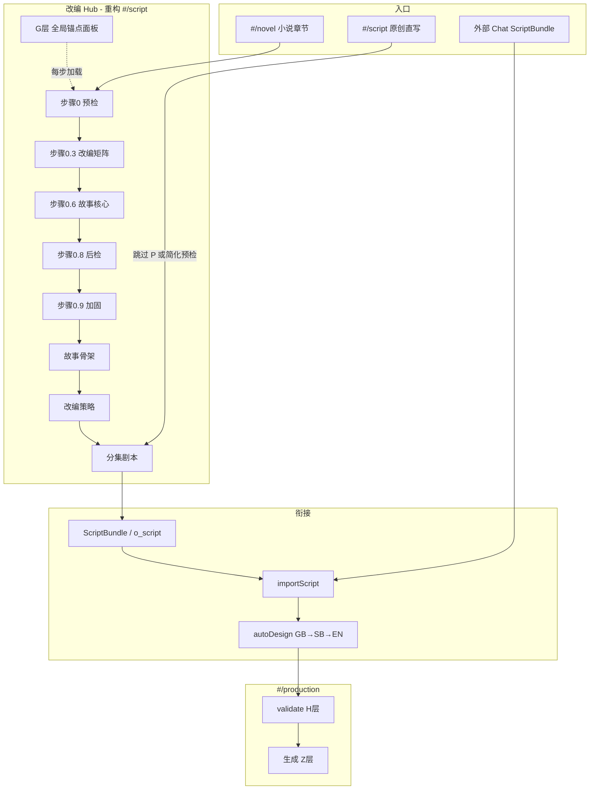
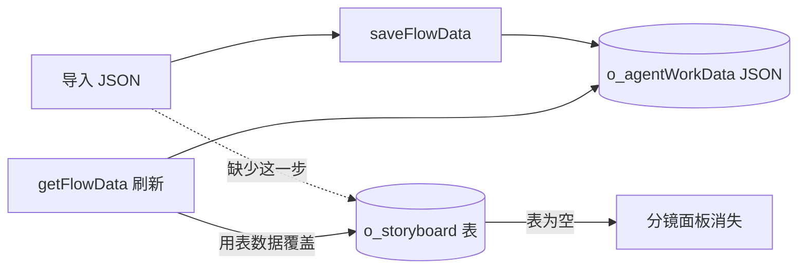
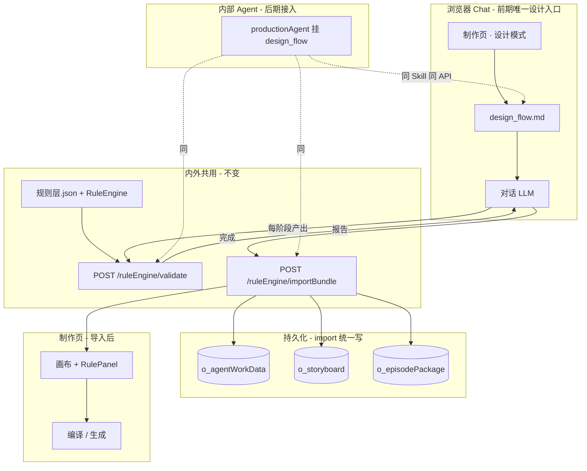
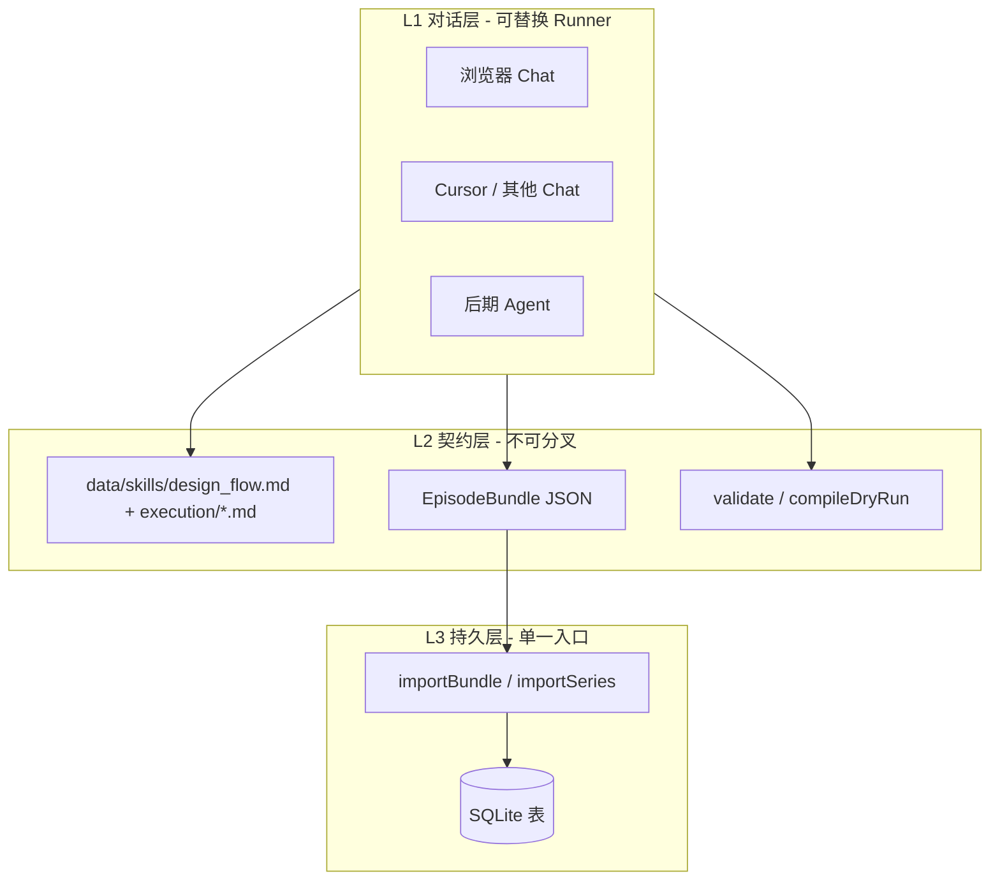

---

# 改编原创主流程重构（主流程.txt V5.0 → 前端链路）

## 现状 vs 主流程.txt


| 主流程 V5.0                    | 现有前端/后端                        | 缺口                              |
| --------------------------- | ------------------------------ | ------------------------------- |
| **P 步骤0** 源材料预检（六维度）        | 无                              | 缺 UI + planData 字段              |
| **P 步骤0.3** 改编矩阵（12维）       | 部分在 `adaptationStrategy`       | 未结构化、无矩阵 UI                     |
| **P 步骤0.6** 故事核心（人物锚点/事件序列） | 部分在 `storySkeleton`            | 缺改动日志、锚点表                       |
| **P 步骤0.8** 后检              | 无                              | 缺                               |
| **P 步骤0.9** 加固              | 无                              | 缺                               |
| **G 全局记忆锚点** G1-G5          | 无 planData/项目级存储               | 缺；与 ScriptBundle.continuity 未打通 |
| **W 编剧** 骨架/策略/剧本           | `#/script` 三 Tab + scriptAgent | 有，需对齐 0.6 产出                    |
| **B→H 分镜→校验**               | `#/production` + ruleEngine    | 与 design_flow 待接 autoDesign     |
| **Z 数据包**                   | exportPackage Z107-110         | 有，缺与改编阶段衔接                      |


当前路径：`#/novel` → `#/script`(骨架→策略→剧本) → `#/production`  
主流程路径：`源材料` → **P(0→0.9)** → **G锚点** → **W(剧本)** → **制作(B→Z→H)**

---

## 目标：统一「改编/原创 → 制作」链路




---

## 前端重构方案（Toonflow-web）

### 1. 改编 Hub 页（增强现有 `#/script`）

**顶部步骤条**（可折叠已完成步骤）：


| 步骤  | 标签    | planData 字段          | Agent 子 skill                        |
| --- | ----- | -------------------- | ------------------------------------ |
| 0   | 源材料预检 | `preCheck`           | `adaptation_execution_precheck.md`   |
| 0.3 | 改编矩阵  | `adaptationMatrix`   | `adaptation_execution_matrix.md`     |
| 0.6 | 故事核心  | `storyCore`          | `adaptation_execution_story_core.md` |
| 0.8 | 后检    | `postCheck`          | `adaptation_execution_postcheck.md`  |
| 0.9 | 加固    | `reinforcement`      | `adaptation_execution_reinforce.md`  |
| 1   | 故事骨架  | `storySkeleton`      | 现有 `script_execution_skeleton.md`    |
| 2   | 改编策略  | `adaptationStrategy` | 现有 `script_execution_adaptation.md`  |
| 3   | 分集剧本  | per `o_script`       | 现有 `script_execution_script.md`      |


**侧边栏固定**：**G 层全局锚点**（G1-G5 表单 + Markdown 预览，项目级 `o_projectBlueprint` 或 `planData.globalAnchors`）

**布局**：左侧步骤条 + 中间 Chat（scriptAgent）+ 右侧当前步骤 Markdown 预览（复用现有 AsyncMdPreview）

### 2. 双路径分流


| 项目类型          | 路径                                         |
| ------------- | ------------------------------------------ |
| **novel 改编**  | novel → 完整 P(0→0.9) → W(1→3) → 制作          |
| **script 原创** | 跳过 P 或仅步骤0轻量预检 → W3 直写 → 制作                |
| **外部导入**      | 制作页 importScript（带 continuity）→ autoDesign |


路由：`project.projectType === 'novel'` 时默认展开 P 阶段；`'script'` 时隐藏或折叠 P。

### 3. 进制作按钮

W3 某集剧本完成后：

- **本系统生成**：`写入 o_script` → 跳转 `#/production?scriptId=` → 可选「一键 autoDesign」
- **导出外部改**：export ScriptBundle
- **外部导入**：制作页粘贴 ScriptBundle

### 4. 与现有组件复用


| 现有                                    | 复用方式                                            |
| ------------------------------------- | ----------------------------------------------- |
| `index-ir0YQR9U.js` scriptAgent store | 扩展 planData 字段 + 多 Tab                          |
| scriptAgent socket                    | 扩展 `script_agent_decision.md` 派发 P 阶段 sub-agent |
| `#/novel`                             | 不变，作为步骤0输入源                                     |
| RulePanel                             | 制作页 H 层校验展示                                     |


---

## 后端扩展

### planData  schema（`[scriptAgent/tools.ts](src/agents/scriptAgent/tools.ts)`）

```typescript
planData = {
  preCheck: string,           // P 步骤0
  adaptationMatrix: string,   // P 步骤0.3
  storyCore: string,          // P 步骤0.6
  postCheck: string,          // P 步骤0.8
  reinforcement: string,      // P 步骤0.9
  globalAnchors: string,      // G 层 JSON/markdown
  storySkeleton: string,      // 现有
  adaptationStrategy: string, // 现有
  script: string,             // 现有（工作区草稿）
}
```

存储：继续 `o_agentWorkData` key=`scriptAgent`；`getPlanData` / `setPlanData` 向后兼容（缺字段默认 `""`）。

### 项目级 G 层

`[o_projectBlueprint](src/ruleEngine/storage/episodePackageStore.ts)` 已有表 → 存 `globalAnchors`（G1-G5），importScript / autoDesign 时加载。

### Skills


| 文件                          | 来源                       |
| --------------------------- | ------------------------ |
| `adaptation_flow.md`        | 内部主编排，引用 主流程.txt 步骤      |
| `adaptation_flow.bundle.md` | 外部单文件（P+W，无 API）         |
| `adaptation_execution_*.md` | 步骤0/0.3/0.6/0.8/0.9 执行细则 |


`script_agent_decision.md` 流水线改为：

```
项目初始化 → P(0→0.9) [novel] → W(骨架→策略→剧本) → 监督 → 进制作
```

---

## 与 design_flow / ScriptBundle 衔接


| 阶段          | 产出                                | 下一步           |
| ----------- | --------------------------------- | ------------- |
| W3 剧本       | `o_script.content` 或 ScriptBundle | importScript  |
| G 锚点        | `globalAnchors` + continuity      | autoDesign 注入 |
| autoDesign  | scriptPlan/SB/EN                  | validate (H层) |
| validate 通过 | EpisodePackage                    | 生成 (Z层)       |


**闭环**：改编 Hub 产出剧本 + G 锚点 → 制作页 autoDesign → RuleEngine → 生成。  
外部 Chat 仅产 ScriptBundle 时，G 锚点从项目库补或 JSON 带 `anchors`/`continuity`。

---

## 实施顺序

1. **adaptation_flow.md** + planData 扩展 + get/setPlanData 兼容
2. **script_agent_decision** 增加 P 阶段 sub-agent 派发
3. **前端步骤条** + G 锚点侧栏（Toonflow-web）
4. **importScript + autoDesign**（制作衔接）
5. **adaptation_flow.bundle.md**（外部 P+W 单文件，可选）
6. 297 规则与 H 层：逐步在 RuleEngine 落地，UI 先展示 getReport 覆盖率

---

## 验收

- novel 项目：走完 0→0.9→骨架→策略→第1集剧本→进制作→autoDesign→RulePanel
- script 原创：跳过 P，直写剧本→进制作
- G 锚点：第2集 autoDesign 能读到 G1-G5 + 上一集 script
- 外部 ScriptBundle 导入后，若项目已有 globalAnchors 则自动注入

## 先澄清：规则一样；「不落库」是什么

### 规则：内外完全一样

没有「外部一套规则、内部一套规则」。只有一份：

- 规则注册表：`[规则层.json](规则层.json)`
- 校验执行：`[src/ruleEngine/](src/ruleEngine/)` 的 `validate` / `compileDryRun` / `preflightTouch`
- Skill 里的「规则检查点」只是**引用同一份规则 ID 做设计引导**，真正判定仍走 RuleEngine API

浏览器 Chat、制作页 RulePanel、后期 Agent —— 全部调 `POST /ruleEngine/validate`，报告格式相同。

### 「不落库」≠ 规则不落库，是导入分镜的 Bug

当前导入链路有一个**实现缺陷**（不是刻意设计）：




具体代码行为：

1. **导入**只调 `saveFlowData` → 分镜写在 `o_agentWorkData.data` 的 JSON 里
2. **刷新**时 `getFlowData` 读到 `o_agentWorkData` 存在后，会用 `o_storyboard` 表**覆盖** `flowData.storyboard`（见 `[getFlowData.ts` L141-155](src/routes/production/getFlowData.ts)）
3. 新集/空白集的 `o_storyboard` 表是空的 → **导入的分镜刷新后丢失**
4. Agent 正常路径会调 `batchAddStoryboardInfo` 插入表；**导入路径漏了这步**


| 数据                                    | 导入后写哪                      | 刷新后          | 状态         |
| ------------------------------------- | -------------------------- | ------------ | ---------- |
| script / scriptPlan / storyboardTable | o_agentWorkData            | 正常           | OK         |
| EpisodePackage                        | o_episodePackage           | 正常           | OK         |
| **storyboard 分镜面板**                   | 仅 JSON，**未写 o_storyboard** | **被空表覆盖丢失**  | **Bug，需修** |
| validationReport                      | 未持久化                       | 需重新 validate | 优化项        |


**修复方式**：`importBundle` 导入时原子写入 — `o_agentWorkData` + `o_storyboard` + `o_episodePackage`，与 Agent 路径对齐。

---

## 目标：最简单浏览器 Chat + 边界清晰后入内部

### 整体一张图




---

## 一、浏览器 Chat 最简方案（推荐）

**原则：不新建复杂页面，复用制作页已有 Chat Socket + 导入按钮，只加一个「设计模式」开关。**

### 1.1 用户路径（3 步）

```
制作页 → 选剧集 → 切换「设计模式」
  → 对话中按 design_flow.md 逐阶段设计（贴原故事 / 改分镜）
  → 每阶段结束自动 validate（RulePanel 展示）
  → 点「导入当前设计」→ importBundle → 画布立即可用
```

### 1.2 技术实现（最小改动）


| 层          | 做什么                                                                                                    | 改动量   |
| ---------- | ------------------------------------------------------------------------------------------------------ | ----- |
| **前端**     | 制作页加 `designMode` 开关；开启后 Chat 标题变「设计对话」                                                                | 小     |
| **Socket** | `productionAgent` 加 `mode: "design"` 参数；design 模式加载 `design_flow.md` 作 system prompt，**不派发 sub-agent** | 小     |
| **对话**     | 仍是现有 `socket.on("chat")` → LLM 流式回复，无新协议                                                               | 无     |
| **校验**     | 前端检测阶段完成（或用户点「校验」）→ 调 `validate` → 复用 RulePanel 组件                                                     | 小     |
| **落库**     | 「导入」按钮 → `importBundle`（修 bug 后的版本）                                                                    | 中（后端） |
| **Skill**  | 新增 `design_flow.md`，引用现有 execution skills                                                              | 小     |


### 1.3 对话状态放哪（最简单）

**前期：前端内存 + 最后一轮 import 落库**（不增加后端会话表）

```
前端 productionAgent store.flowData  ← 对话中 LLM 产出逐步 merge
每阶段 validate 用当前 flowData 调 API
导入时把 flowData + package 组装成 EpisodeBundle → importBundle
```

这样 Chat 不需要直接写 DB，**落库统一走 importBundle 一个口**，边界最清晰。

### 1.4 不做的（前期避免过度工程）

- 不新建独立「设计对话」路由页
- 不让 Chat 直接调 saveFlowData / batchAddStoryboardInfo
- 不在 Chat 里内置规则逻辑（只调 validate API）
- 不做 Cursor 专用集成（Markdown Skill 文件通用，Cursor 只是另一个读者）

---

## 二、集成边界细则（外部细化验证 → 入内部）

### 2.1 三层边界




| 边界          | 归属               | 规则                               |
| ----------- | ---------------- | -------------------------------- |
| **对话怎么聊**   | L1 Runner        | 可换（浏览器 / Cursor / Agent），互不影响    |
| **设计标准是什么** | L2 Skill 文件      | 全项目唯一，`design_flow.md` 主编排       |
| **合格不合格**   | L2 RuleEngine    | 全项目唯一，`validate` 判定，Skill 只引用不复制 |
| **产出长什么样**  | L2 EpisodeBundle | 对话导出 = 导入 = 导出，一种 JSON           |
| **怎么进系统**   | L3 importBundle  | **唯一落库口**，Chat/Agent 不得绕过        |


### 2.2 入内部的条件（验收清单）

满足以下全部项后，Agent 直接挂入，**无需改 validate/import**：

- `design_flow.md` 三阶段在浏览器 Chat 跑通
- 每阶段 validate 报告与 RulePanel 一致
- importBundle 后刷新分镜不丢（o_storyboard 已写）
- exportBundle roundtrip 与导入格式一致
- importMode（create/update/upsert）+ mergeStrategy 单集场景验证
- 文档写明 episodeKey 命名约定

### 2.3 入内部时只改一处

`[production_agent_decision.md](data/skills/production_agent_decision.md)`：

```
现：六阶段硬编码 → 派发 sub-agent
后：引用 design_flow.md 同一阶段表 → 派发同名 execution sub-agent
validate / importBundle 不变
```

Agent 从「自动推进六阶段」变为「按 design_flow 阶段表推进」——**编排换，规则和数据契约不换**。

---

## 三、导入适配（基本都能适配，收敛为几个参数）

导入适配器处理格式差异，对外只暴露：

```typescript
importBundle({
  bundle: EpisodeBundle | 旧版 flowData,  // 自动识别
  importMode: "create" | "update" | "upsert",  // 默认 upsert
  mergeStrategy: "replaceAll" | "mergeLayers" | "preserveMedia",
  targetScriptId?: number,  // 更新时指定
})
```


| 场景        | importMode      | mergeStrategy      |
| --------- | --------------- | ------------------ |
| 新集首导      | create / upsert | replaceAll         |
| 改版覆盖      | update          | mergeLayers（只改动的层） |
| 改台词保留已生成图 | update          | preserveMedia      |
| 多集 JSON   | importSeries    | 逐集 upsert          |
| 对话完一键导入   | upsert          | replaceAll         |
| 导入前看看     | validateOnly    | —                  |


**向后兼容**：现有 `flow-data-template.json`、`{flowData, package}` 合并格式自动映射，无需用户改文件。

多集 `SeriesBundle`：`{ project, episodes: EpisodeBundle[] }`，`importSeries` 逐集调同一适配器。

---

## 四、其他实现细节

### 4.1 后端新增/修改文件


| 文件                                           | 作用                               |
| -------------------------------------------- | -------------------------------- |
| `src/ruleEngine/bundle/types.ts`             | EpisodeBundle / SeriesBundle 类型  |
| `src/ruleEngine/bundle/importAdapter.ts`     | 解析、合并、ID 映射、原子落库                 |
| `src/routes/ruleEngine/importBundle.ts`      | 单集导入 API                         |
| `src/routes/ruleEngine/importSeries.ts`      | 多集导入 API                         |
| `src/routes/ruleEngine/dryRunImport.ts`      | 预览 diff（可选，第二期）                  |
| `src/routes/ruleEngine/exportBundle.ts`      | 对称导出                             |
| `src/ruleEngine/bundle/storyboardSync.ts`    | 从 batchAddStoryboardInfo 提取的落库逻辑 |
| `data/skills/design_flow.md`                 | 主编排 Skill                        |
| `data/fixtures/episode-bundle-template.json` | 单集模板                             |


### 4.2 前端（Toonflow-web）


| 改动                                  | 作用             |
| ----------------------------------- | -------------- |
| 制作页 `designMode` 开关                 | 切换 Chat Skill  |
| Socket handshake 传 `mode: "design"` | 后端选 prompt     |
| 阶段完成 → 自动 validate                  | RulePanel 展示   |
| 「导入当前设计」按钮                          | 调 importBundle |
| 修复 RulePanel `visible`              | 校验面板显示         |
| 首集引导 + import 深链                    | 链路可测           |


### 4.3 Agent Socket 设计模式

`[productionAgent.ts](src/socket/routes/productionAgent.ts)` 已有 `chat` 事件。设计模式：

```typescript
if (mode === "design") {
  // 加载 design_flow.md 作为 system prompt
  // 不调用 runDecisionAI 的六阶段派发
  // 单次 LLM 对话，前端负责阶段感知的 validate 触发
} else {
  // 现有逻辑，暂默认关闭或保留
}
```

### 4.4 ID 映射（import 内部细节）

- `meta.projectId/scriptId: 0` → 当前项目/目标集
- `storyboard[].clientId`（或无 id 的项）→ 插入 `o_storyboard` 获真实 id → 回写 `package.shots[].storyboardId`
- `bundleHash` 可选，用于幂等检测

### 4.5 规则完善（与导入并行，不阻塞 Chat）

- P0：现有 Tier-0 Gate + applyAutoFix 接线
- P1：Skill 检查点引用规则 ID；RuleEngine 按 layer 扩展
- 覆盖率：`executed / registered / skipped` 三分，不误导

### 4.6 实施顺序

```
1. importBundle + storyboard 落库修复     ← 解除「导入无用」阻塞
2. design_flow.md + 设计模式 Socket       ← 浏览器 Chat 可跑
3. 前端设计模式 UI + validate + 导入按钮    ← 端到端可测
4. importMode / mergeStrategy / 多集        ← 适配扩展
5. exportBundle roundtrip                  ← 闭环验证
6. Agent 挂 design_flow                    ← 入内部
```

---

## 五、验收标准

1. **规则一致**：浏览器 Chat validate 与制作页 RulePanel 同一 report
2. **落库修复**：import 后刷新，分镜面板数据仍在
3. **Chat 最简**：制作页开设计模式 → 对话 → 校验 → 一键导入 → 画布可继续生成
4. **导入适配**：单集 upsert、更新 mergeLayers、多集 importSeries 至少各测一例
5. **入内部预留**：Agent 仅换 decision 引用 design_flow，validate/import 零改动

---

## 已交付：design_flow.bundle.md v1.1

- 外部默认：**ScriptBundle**（仅 `script` + meta）
- 内部导入后：**autoDesign** 自动生成 scriptPlan / 分镜表 / 分镜面板
- 高级可选：完整 EpisodeBundle（外部分镜已完成时）

样例：`data/fixtures/script-bundle-template.json`（待 Agent 模式创建）

---

## ScriptBundle 能否完全闭环？— 不能单靠 script 字段

**仅 `script` 文本不够。** 完整闭环 = ScriptBundle（外部） + 内部上下文解析 + autoDesign。

### 缺口清单


| 上下文             | 来源                               | ScriptBundle 仅导入时                                |
| --------------- | -------------------------------- | ------------------------------------------------ |
| 上一集剧本/末尾状态      | `o_script` 上一集 / `continuity` 字段 | 内部按 `episodeIndex-1` **自动读库**；首集无                |
| 集间衔接/集末钩子       | 上一集 script + episodeBeat         | autoDesign GB 阶段生成                               |
| 角色状态锚点          | 上一集 + assets                     | 内部读 `o_assets` + 可选 `continuity.characterState`  |
| 视觉一致性锚点         | projectBlueprint + assets        | 内部读 **项目已有数据**（G/BP 层）                           |
| 故事骨架/改编策略       | planData（剧本 Agent 路径）            | 若项目走过 `#/script` 骨架流程，**库里有**；纯外部导入**无**         |
| 原故事/事件表         | o_novel + events                 | 内部读 `provenance.chapterRange` 关联 novel；纯外部**可选** |
| recap/preview 位 | episodeBeat.markers              | autoDesign GB 产出                                 |
| Agent 对话记忆      | Memory 表                         | **内部** autoDesign 时用，外部不带                        |
| 项目配置            | o_project（时长/画幅/模型）              | 内部**自动读**                                        |


### 结论

```
完全闭环 ≠ 只导入 script 字符串

完全闭环 = ScriptBundle（剧本 + 可选 continuity）
           + 内部 importScript
           + 解析项目/上一集/资产/小说（能读库读库）
           + autoDesign（GB→SB→EN）
           + validate → 制作
```

### ScriptBundle v1.1 建议扩展（可选字段，外部有则带，无则内部补）

```json
{
  "bundleType": "script",
  "script": "...",
  "meta": { "episodeKey": "ep-02", "episodeIndex": 2, "prevEpisodeKey": "ep-01" },
  "continuity": {
    "prevEpisodeSummary": "上一集末尾一句话（外部写，或内部从 ep-01 自动生成）",
    "characterState": { "裴青梧": "认命期，刚苏醒" },
    "unresolvedHooks": ["身份之谜"],
    "recapHint": "本集开场需承接：..."
  },
  "anchors": {
    "visual": ["寝殿烛火", "角色认命期造型"],
    "emotionCarry": "茫然→认命"
  }
}
```

- **项目在 Toonflow 内已有上一集**：`continuity` 可省略，import 时内部读库
- **纯外部批量写多集、未进过系统**：建议每集带 `continuity` + `prevEpisodeKey`
- **记忆锚点**：`anchors` 供 autoDesign SB/EN 阶段锁定视觉与情绪；无则仅从 script 推断

### importScript 内部步骤（规划）

1. 解析 ScriptBundle（识别 `bundleType: script`）
2. upsert 剧集（episodeKey → o_script）
3. **resolveContext**：上一集 script、project、assets、novel、planData（有则读）
4. merge continuity（JSON 优先，缺项从库补）
5. **autoDesign**（design_flow GB→SB→EN，注入 resolveContext）
6. 落库 + validate
7. 返回 `{ scriptId, idMap, validationReport, resolvedContext }`

---

## 双轨导入契约


| 类型                    | 外部产出     | 导入 API         | 内部后续                             |
| --------------------- | -------- | -------------- | -------------------------------- |
| **ScriptBundle**（默认）  | 仅剧本 JSON | `importScript` | autoDesign → GB→SB→EN → validate |
| **EpisodeBundle**（高级） | 全字段 JSON | `importBundle` | 直接落库 → validate                  |


---

## 已交付：design_flow.md

完整主编排 Skill 已写入 `[data/skills/design_flow.md](data/skills/design_flow.md)`，内外共用：

- 三阶段：P0(可选) → GB → SB → EN
- 运行模式表：chat / design / agent 同一内容
- 每阶段规则检查点 + rollbackLayer
- EpisodeBundle / SeriesBundle 输出 schema
- 宿主集成指南（validate + importBundle）
- 对话话术模板

---

## 六、风险

1. **设计模式与旧 Agent 并存** — UI 明确标识，默认开设计模式、关自动六阶段
2. **对话状态在内存** — 导入前刷新页面会丢；导入按钮旁提示「请先导入保存」
3. **Toonflow-web 双仓库** — 前端改动需 build:integrate

---

# 缺失与优化清单（汇总）

## A. 阻塞闭环（Wave 1 必须先做）


| 项   | 缺失                               | 影响                    |
| --- | -------------------------------- | --------------------- |
| A1  | `importScript` + storyboard 落库   | 剧本 JSON / Hub 产出无法进制作 |
| A2  | `autoDesign` + `resolveContext`  | 导入后无分镜、无集间记忆          |
| A3  | 制作页导入 UI（首集、RulePanel、刷新）        | 现网链路不可测               |
| A4  | `script-bundle-template.json` 入库 | 缺官方样例                 |


## B. 改编 Hub（Wave 2）


| 项   | 缺失                            | 优化                               |
| --- | ----------------------------- | -------------------------------- |
| B1  | P 0→0.9 步骤/UI/Skill           | planData 扩展 + adaptation_flow.md |
| B2  | G 锚点 G1-G5 项目级 UI             | o_projectBlueprint 侧栏            |
| B3  | storyCore vs storySkeleton 重叠 | 0.6 定核心，骨架 Tab 引用                |
| B4  | 步骤0 与 `#/novel` 事件未联动         | 预检自动读 chapter/event              |
| B5  | 「进制作」+ `?autoDesign=1`        | Hub→production 一键                |


## C. 契约与外部（Wave 3-4）


| 项   | 缺失                          | 优化           |
| --- | --------------------------- | ------------ |
| C1  | `adaptation_flow.bundle.md` | 外部完整 P+W 单文件 |
| C2  | exportScriptBundle 对称       | 可导出给外部改      |
| C3  | importSeries / dryRunImport | 多集与预览，二期     |
| C4  | bundleVersion schema 校验     | 导入兼容         |


## D. 规则 297 条（持续）


| 项   | 缺失                                | 优化                        |
| --- | --------------------------------- | ------------------------- |
| D1  | 可执行 ~8 vs 注册 262+                 | P0 Gate 清单 + getReport 三分 |
| D2  | H 层反馈回滚 UI                        | rollbackLayer → 「回改编/回分镜」 |
| D3  | applyAutoFix / generationFeedback | RulePanel + 生成失败回写        |


## E. 工程与体验


| 项   | 说明                                      |
| --- | --------------------------------------- |
| E1  | autoDesign 服务端直写 flowData，不依赖 Socket 在线 |
| E2  | ProductionAgent 与设计模式 UI 开关，避免双编排困惑     |
| E3  | 一页纸用户文档（改编→制作→导入）                       |
| E4  | e2e：importScript→autoDesign→validate    |
| F1  | 步骤进度条、continuity 自动生成、dryRun 预览         |

---

# 高质量细节：实现 / 体验 / 智能（补充）

## G. 实现细节（易漏、影响生产稳定）

| 项 | 细节 | 建议 |
|----|------|------|
| G1 | **导入幂等** | 同 `bundleHash` 重复导入 → 提示「已导入」或 upsert 策略可选 |
| G2 | **冲突合并** | 画布已有人工修改时再 import：`replaceAll` / `preserveMedia` / 取消 |
| G3 | **ID 映射持久化** | `clientId`↔`o_storyboard.id` 存 `flowId`，export 可还原 |
| G4 | **autoDesign 事务** | GB 成功 SB 失败时：标记 partial，可「从 SB 重跑」不重头 |
| G5 | **JSON 脏数据** | import 前 schema 校验 + 剥离 `_comment`；台词编码 UTF-8 |
| G6 | **阶段状态机** | planData 每步 `status: pending/done/blocked` + `completedAt` |
| G7 | **服务端 autoDesign** | 不依赖 Socket；队列 job + 轮询 `/autoDesign/status` |
| G8 | **资产缺口** | script 角色名 vs `o_assets` diff → import 报告 WARN |
| G9 | **首集 bootstrap** | 无 G 锚点/blueprint 时从 script 抽 `scriptMeta` + 建议 anchors |
| G10 | **安全边界** | JSON 大小上限、import 频率、markdown 预览 XSS 消毒 |

## H. 体验（UX 高质量）

| 项 | 细节 | 建议 |
|----|------|------|
| H1 | **空状态引导** | 无剧集：「创建第1集 / 粘贴 ScriptBundle」一步向导 |
| H2 | **进度可感知** | autoDesign 分阶段进度条 GB→SB→EN + 可取消 |
| H3 | **导入前预览** | dryRun：将写入哪些表、是否覆盖、diff 摘要 |
| H4 | **导入后即时反馈** | 成功 → 自动跳 storyboardTable + RulePanel 展开 |
| H5 | **步骤解锁** | P0.8 未通过不能进 W1；视觉灰显 + 原因 |
| H6 | **一键 continuity** | 「从上一集生成衔接摘要」按钮（服务端 LLM 短摘要） |
| H7 | **双入口不迷路** | 顶栏面包屑：原著 / 改编(3/8) / 制作(第2集) |
| H8 | **外部工作流内嵌** | 制作页「复制 bundle 说明」+ 样例 JSON 折叠 |
| H9 | **错误可行动** | 「校验 BLOCK 12 条」→ 点击定位到 rollback 步骤/镜号 |
| H10 | **撤销导入** | 短时间窗口内 rollback 到 import 前 snapshot |

## I. 智能（非机械化、可定制）

| 项 | 细节 | 建议 |
|----|------|------|
| I1 | **P0 半自动** | 步骤0：读 novel.event 自动填六维度草稿，人确认后定稿 |
| I2 | **矩阵推荐** | 0.3 根据 P0 低分项推荐 12 维默认选项（可改） |
| I3 | **resolveContext 智能补全** | 无 continuity 时 LLM 读上一集末 500 字生成 summary |
| I4 | **autoDesign 质量环** | validate BLOCK>0 → 仅重跑对应 rollbackLayer（非全量） |
| I5 | **监督层卡点** | P0.8、SB 阶段可选调 supervision（与现 script 监督同源） |
| I6 | **规则解释** | RulePanel 每条 issue 附「规则 ID + 人话说明 + 怎么改」 |
| I7 | **生成反馈闭环** | 图/视频失败 → 归类 → 建议改 prompt 或回 SB |
| I8 | **资产建议** | 从 script 抽角色/场景 → 「是否创建资产」批量确认 |
| I9 | **钩子检测** | 剧本末自动标 `episodeBeat.markers.previewSlots` |
| I10 | **成本控制** | autoDesign 前估算 token/镜数；超阈值需确认 |

## J. 质量门禁（Definition of Done）

| 层级 | 门禁 |
|------|------|
| 导入 | schema 过 + script 非空 + episodeKey 唯一 |
| autoDesign | 三阶段落库 + storyboard 刷新仍在 |
| 规则 | Tier-0 BLOCK=0 才可批量生成；WARN 可 override 并记录 |
| 改编 | novel 项目 P0.8「通过」才解锁 W3 批量写集 |
| 外部 | bundle 输出通过 JSON schema 自测脚本 |
| 回归 | 黄金样例 ScriptBundle → import → validate 覆盖率基线 |

## K. 与原方案对齐的细节决策（待确认默认值）

| 决策 | 推荐默认 |
|------|---------|
| autoDesign 默认开还是手动 | 导入后弹窗「立即生成设计 / 仅保存剧本」 |
| 外部 JSON 缺 continuity | 库内有上一集则自动补，否则 WARN 继续 |
| P 阶段可否跳过 | novel 不可跳过；script 原创可跳过并记录 reason |
| storyCore 与 skeleton | 0.6 产出引用块，skeleton 生成时 `@include storyCore` |
| 智能 LLM 调用 | resolveContext 摘要 + I1/I2 可选「省 token 模式」 |

---

# 讨论覆盖核对表（全文议题 vs 计划）

> 说明：正文部分章节为讨论过程留存（含早期「制作页设计模式 Chat」方案）；**以本表 + frontmatter todos 为实施准绳**。外部主路径已收敛为 **ScriptBundle + importScript**，非制作页内调 API 的设计对话。

| # | 讨论议题 | 计划位置 | todos | 状态 |
|---|---------|---------|-------|------|
| 1 | 三问题：机械化/导入断/规则未闭环 | 全文 + A/D | rules-feedback, fix-* | 已收录 |
| 2 | 外部无 API，单文件 bundle | design_flow.bundle.md | bundle-script ✅ | 已交付 |
| 3 | 内部 design_flow + validate | design_flow.md | design-flow-internal ✅ | 已交付 |
| 4 | ScriptBundle 仅剧本，内部 autoDesign | importScript 步骤、双轨契约 | import-script-api, auto-design-pipeline | 已收录 |
| 5 | continuity/anchors/G 锚点 | ScriptBundle 扩展、resolveContext | import-script-api, blueprint-g-api | 已收录 |
| 6 | storyboard 不落库 Bug | 不落库澄清、storyboardSync | fix-storyboard-persist | 已收录 |
| 7 | 主流程.txt P0-0.9 + G + W | 改编 Hub 章节 | adaptation-*, plandata-*, frontend-* | 已收录 |
| 8 | #/script 重构步骤条、#/novel 联动 | 前端重构方案 | frontend-adaptation-hub, original-vs-adapt | 已收录 |
| 9 | novel/script 双路径 | 双路径分流 | original-vs-adapt-path | 已收录 |
| 10 | EpisodeBundle 高级导入 | 双轨契约、importBundle | import-bundle-api | 已收录 |
| 11 | importMode/mergeStrategy/SeriesBundle | 导入适配第三节 | import-bundle-api, dryrun-importseries | 已收录 |
| 12 | 入口：#/novel/#/script/#/production/外部 | 目标架构图 | （各 Wave UI） | 已收录 |
| 13 | 与原方案无冲突、分层 L1/L2/L3 | 集成边界细则 | — | 已收录 |
| 14 | 闭环：架构 vs 工程 30% | 验收 + J 质量门禁 | docs-e2e | 已收录 |
| 15 | Wave 1-4 优先级 | 缺失清单 A-E + 实施顺序 | todos 排序 | 已收录 |
| 16 | G-K 实现/体验/智能/DoD | 高质量细节章节 | ux-intelligence, rules-feedback | 已收录 |
| 17 | addScript 返回 scriptId | 4.2 前端（旧节） | addscript-scriptid | **已补 todo** |
| 18 | RulePanel visible 修复 | 4.2 前端 | fix-import-ui | 已收录 |
| 19 | exportScriptBundle 对称 | C2 | export-apis | **已补 todo** |
| 20 | dryRunImport / importSeries | C3 | dryrun-importseries | **已补 todo** |
| 21 | script-bundle-template.json | A4 | script-bundle-template | **已修正**（待实现） |
| 22 | yarn bundle:design-flow | C1 旁注 | bundle-script-gen | **已补 todo** |
| 23 | adaptation_execution_*.md ×5 | Skills 表 | adaptation-flow-skill | 已收录 |
| 24 | script_agent P sub-agent | script_agent_decision | script-agent-p-stages | **已补 todo** |
| 25 | ProductionAgent 后期挂接 | 2.3 / production-agent-defer | production-agent-defer | **已补 todo** |
| 26 | 制作页 designMode（内部可选） | 一、浏览器 Chat（**降级为可选**） | production-agent-defer | 已标注 |
| 27 | applyAutoFix / generationFeedback | D3, I7 | rules-feedback | **已补 todo** |
| 28 | getReport executed/registered/skipped | D1 | rules-feedback | 已收录 |
| 29 | autoDesign job 不依赖 Socket | G7, E1 | auto-design-pipeline | 已收录 |
| 30 | 文档 RULE_ENGINE + 用户一页纸 | E3 | docs-e2e | **已补 todo** |
| 31 | build:integrate CI | 风险 E | integrate-ci | **已补 todo** |
| 32 | 主流程 297 规则分批落地 | D + 实施顺序 6 | rules-feedback | 已收录 |
| 33 | 浏览器chat外部闭环.md | 独立文件 v5（**已过时**） | 以本计划为准 | 需废弃/合并 |

### 仍属「二期/可选」、不阻塞 Wave 1

- 制作页内置 designMode Chat（与外部 ScriptBundle 二选一，默认外部+导入）
- importSeries 多集批量
- adaptation_flow.bundle 完整 P+W 外部单文件
- ProductionAgent 全量接入
- 297 规则全可执行

### Wave 1 最小可交付（MVP）— 实施准绳

```
script-bundle-template → bundle-types-adapter → importScript+resolveContext
→ autoDesign(job) → storyboard落库 → fix-import-ui → docs-e2e 一条黄金路径
```

### 计划文档已知不一致（实施时以 todos 为准）

1. 正文「浏览器 Chat 设计模式 + importBundle」→ 外部已改为 **ScriptBundle**；内部全量分镜用 **importScript + autoDesign**
2. `script-bundle-template` frontmatter 曾标 completed，文件尚未入库 → **pending**
3. [`浏览器chat外部闭环.md`](浏览器chat外部闭环.md) 仍为 EpisodeBundle 旧版 → 合并进本计划或删除

