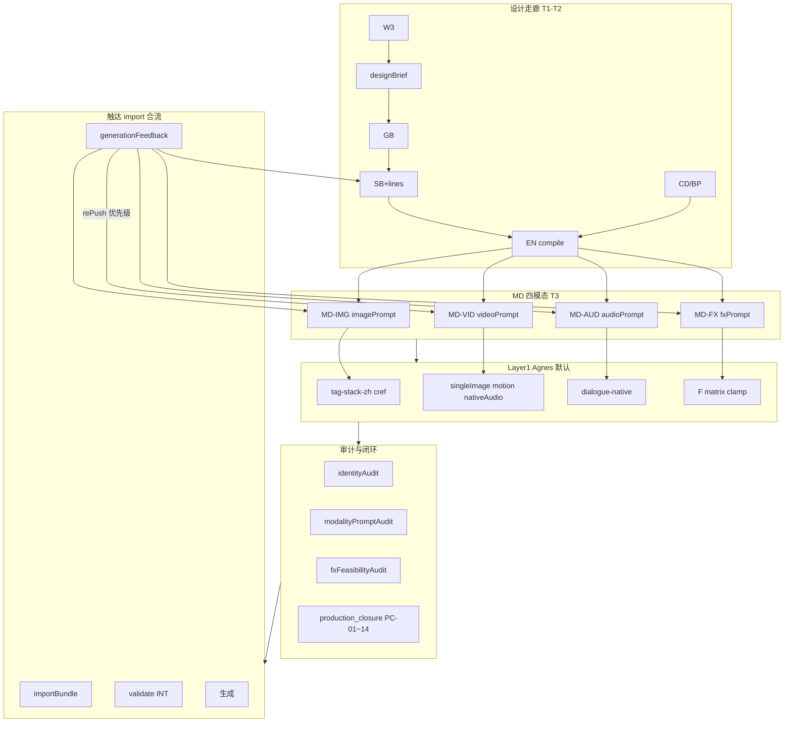

# 边界细化补充：四模态全闭环 + Agnes 默认 + 实施教程

> 回应：**是否全部（含可选/扩展）都细化到实施步骤？** 除视频外，图片/音频/特效是否多端闭环、边界细化、智能化、正推反推联动？  
> **结论**：原 §15 草案偏 VID/AUD；本版 **升级为四模态平行闭环**，并与 §14 制作闭环、§12 QP、附录 M/O 合流。

---

## 一、覆盖范围总览（你关心的「全部」）

| 维度 | IMG 图片 | VID 视频 | AUD 音频 | FX 特效 | 跨模态 |
|------|----------|----------|----------|---------|--------|
| **BaseSpec（主流公用）** | V1-V3 type/cref/negative | V9 duration、QF-VIEW、QF-DUR | R2/H3 lines、V74 字数 | V77 特效词、fx matrix F0-F5 | identityAudit、linkageAudit |
| **Agnes VendorPack（默认）** | tag-stack-zh、无 negative 通道 | singleImage、motion-from-frame、generate_audio | dialogue-native 原生语音 | F≤3 默认可出；F4/F5 降级 | AG-GATE-01~04 |
| **边界 CAN/CANNOT** | SB 禁 prompt；MD 禁改 lines | EN 禁 API；singleImage 禁改面部 | OS/VO 分型；一句一镜 | F5 禁未降级 export | T1 禁四模态 prompt |
| **智能化 SD** | SD-IMG：cref/identity/PURE 词 | SD-VID：首帧/时长/运镜 | SD-AUD：voice/lines hash | SD-FX：F 等级预检 | SD-S 监督汇总 |
| **智能化 SF** | V3 --ar、V2 negative 位置 | MODE-AGNES 首帧、QF-EXPR | identity_mismatch→EN | fx_degrade→SB | fix_templates 扩展 |
| **正推链** | CD→BP→SB→EN→MD-IMG | SB→EN→MD-VID→首帧图 | SB lines→EN→MD-AUD→native/TTS | W3→SB→FX→MD-FX | designBrief→六链 |
| **反推链** | cref 错→BP/EN | 首帧缺→MD/EN | 语音性别错→EN/BP | F5→W3/SB | rePushPlan+presentationFork |
| **dryRun PC** | PC-11 | PC-09 | PC-10 | PC-12 | PC-06/13/14 |
| **golden** | G79 cref 冲突 | G78 缺首帧 | G80 voice 冲突 | G81 F5 未降级 | G72 已有 identity |

**可选/扩展（P2，本计划均写入实施步骤，非「口头可选」）**：

- ModalityOrchestrator 与 Chat schema 字段对齐
- MediaProbe / ffprobe 生成后检（文档+接口预留）
- vendor 切换（kling/wan）仅换 VendorPack，Base 不动
- SUB 字幕轨与 no-subtitles 负向（PR-16）
- post-bgm / TTS-dubbing 分离路径（videoAudioPolicy=post）

---

## 二、四模态触达走廊架构（§15）



### 修复优先级铁律（四模态统一，写入 reverse_route + generationFeedback）

| 优先级 | 域 | 触发 | 先修 | 再修 | 最后 |
|--------|-----|------|------|------|------|
| **P0** | VID | 缺首帧/时长非法/运镜禁词 | MD-VID / EN | IMG 首帧 | SB |
| **P0** | IMG | 无 cref / identity 冲突 / PURE 词缺失 | MD-IMG / EN | BP | SB |
| **P1** | AUD | 原生语音与 lines 不一致 / voice 性别错 | MD-AUD / EN | BP L6 | SB |
| **P1** | FX | F5 未降级 / 与 VID 过载 | MD-FX / SB | W3 | — |
| **P2** | 跨模态 | identityAudit 失败 | EN 全模态重 compile | BP/CD | — |
| **P3** | 叙事 | PR/graph/linkage 断 | SB / W3 | designBrief | W1 |

---

## 三、分模态边界细化 + 正推反推（实施规格）

### 3.1 IMG 图片

| 项 | 正推 | 反推 | SD | SF | 规则 |
|----|------|------|----|----|------|
| 主体/场景 | BP L0 → SB charCodes → EN subject → imagePrompt | cref 无法解析 → EN/BP | SD-IMG-01 cref | V4 auto | V1-V4 |
| 纯景/纯道具 | SB type → PURE 词位置 | V2 BLOCK → EN 前置 negative 词 | SD-IMG-02 | V2/V3 | V2,V3 |
| 身份一致 | identityAudit.IMG slot | 与 VID/AUD 冲突 → EN | §14.2 | Y8 | identityAudit |
| Agnes | tag-stack-zh；无 @图N | AG-GATE-04 剥离 | — | — | VendorPack |

### 3.2 VID 视频（含 Agnes 带音频）

| 项 | 正推 | 反推 | SD | SF | 规则 |
|----|------|------|----|----|------|
| 首位帧 | SB shouldGenerateImage → 分镜图 → singleImage | 无图 BLOCK | SD-VID-01 | MODE-AGNES | B11, AG-GATE-01 |
| 运动 | motion 白名单；禁改面部 QF-EXPR-06 | motion_overflow → EN | SD-VID-02 | QF-EXPR | PR-05,14 |
| 时长 | SB duration → API num_frames | duration_clamp WARN | SD-VID-03 | — | V9, AG-GATE-03 |
| 原生语音 | lines + generate_audio=true | native_audio_mismatch → EN | SD-VID-04 lipSync | — | PR-09, PC-10 |
| 与 FX | FX F≤3 同镜 | F3+ 拆镜 | SD-FX 联动 | fx_degrade | PR-07,15 |

### 3.3 AUD 音频

| 项 | 正推 | 反推 | SD | SF | 规则 |
|----|------|------|----|----|------|
| 台词保真 | W3 → SB lines → AUD lines slot | R2/H3 hash → SB/W3 | SD-AUD-01 | R2 | R2,H3 |
| 音色/性别 | BP L6.voice → voiceProfile | identity_mismatch → EN/BP | SD-AUD-02 | Y8 | V74, §14.2 |
| 路径选择 | audioStrategyRouter：native vs TTS | vendor 不支持 → post | SD-AUD-03 | — | video_audio_policy |
| OS/VO | SB dialogue.type | PR-10 → SB | SD-AUD-04 | — | PR-10 |

### 3.4 FX 特效

| 项 | 正推 | 反推 | SD | SF | 规则 |
|----|------|------|----|----|------|
| 设计→prompt | W3 描写 → SB visualEffect → EN FX 段 | F5 → W3/SB | SD-FX-01 | fx_degrade | §14.3 |
| 可行性 | fx_feasibility_matrix × vendor | F5 silent pass BLOCK | SD-FX-02 | degradeFixPlan | G57,G70 |
| 与 VID | 同镜复杂度 PR-07 | 拆镜 rePush | SD-FX-03 | — | PR-07,15 |
| 后期 | F4 postProductionOnly | 仅基底 prompt | — | — | §14.3 |

### 3.5 跨模态联动（正推反推一体）

```
SB 字段 ──LINK──► EN compile ──► MD 四 slot ──► modalityPromptAudit
     ▲                                              │
     └──────── rePushPlan / linkageRepairPlan ◄─────┘
              ↑ generationFeedback / validate INT
```

- **linkageAudit** 六链 + **identityAudit** 跨 IMG/VID/AUD
- **fxFeasibilityAudit** 链 W3→SB→FX→VID
- **narrativeCausalityGraph** 链 W1→W3→SB markers
- 全部纳入 **production_closure_checklist** PC-01~14

---

## 四、交付物清单（全部可执行）

### A. Skill / 文档

| 文件 | 内容 |
|------|------|
| [`appendix/P_modality_touch_four.md`](i:/toonflow/new/Toonflow-app/data/skills/browser_chat/appendix/P_modality_touch_four.md) | §15 总纲：四模态 Base+Vendor、边界矩阵、SD/SF 挂载、正推反推总表 |
| [`production/MD_modality_IMG.md`](i:/toonflow/new/Toonflow-app/data/skills/browser_chat/production/MD_modality_IMG.md) | IMG 专章 + Agnes tag-stack |
| [`production/MD_modality_VID.md`](i:/toonflow/new/Toonflow-app/data/skills/browser_chat/production/MD_modality_VID.md) | VID + singleImage + nativeAudio + QF-EXPR |
| [`production/MD_modality_AUD.md`](i:/toonflow/new/Toonflow-app/data/skills/browser_chat/production/MD_modality_AUD.md) | AUD + native/TTS 双路径 |
| [`production/MD_modality_FX.md`](i:/toonflow/new/Toonflow-app/data/skills/browser_chat/production/MD_modality_FX.md) | FX + F matrix + degrade |
| [`stages/smart_detection_modality.md`](i:/toonflow/new/Toonflow-app/data/skills/browser_chat/stages/smart_detection_modality.md) | SD-IMG/VID/AUD/FX 子检 |
| [`docs/BROWSER_CHAT_TUTORIAL.md`](i:/toonflow/new/Toonflow-app/docs/BROWSER_CHAT_TUTORIAL.md) | **人读分步教程**（含四模态 T3 专章、反推决策树） |
| 更新 [`EXTERNAL_REVISION_GUIDE.md`](i:/toonflow/new/Toonflow-app/docs/EXTERNAL_REVISION_GUIDE.md) / [`DESIGN_FLOW_GUIDE.md`](i:/toonflow/new/Toonflow-app/docs/DESIGN_FLOW_GUIDE.md) | v2.0.1 + 教程链接 |

### B. Fixtures

| 文件 | 内容 |
|------|------|
| [`modality_touch_matrix.json`](i:/toonflow/new/Toonflow-app/data/fixtures/modality_touch_matrix.json) | 四模态 × Base/Vendor × slot × tier × rePushTarget |
| [`video_audio_policy.json`](i:/toonflow/new/Toonflow-app/data/fixtures/video_audio_policy.json) | native/post、Agnes 默认、台词镜策略 |
| [`agnes_vendor_gates.json`](i:/toonflow/new/Toonflow-app/data/fixtures/agnes_vendor_gates.json) | AG-GATE + QF-EXPR + 运镜白名单 |
| 扩展 [`production_closure_checklist.json`](i:/toonflow/new/Toonflow-app/data/fixtures/production_closure_checklist.json) | PC-09~14（见下表） |
| 扩展 [`reverse_route_table.json`](i:/toonflow/new/Toonflow-app/data/fixtures/reverse_route_table.json) | 四模态 failure trigger 全量 |
| [`golden/`](i:/toonflow/new/Toonflow-app/data/fixtures/golden/) | + img-cref-block、aud-voice-block（已有 identity/fx/graph/debut） |

**production_closure_checklist 扩展**：

| ID | 域 | 规则 | severity |
|----|-----|------|----------|
| PC-09 | VID | 首帧/时长/运镜（Agnes singleImage） | BLOCK |
| PC-10 | AUD | 台词镜 native 或 TTS 路径一致 + voiceProfile | BLOCK |
| PC-11 | IMG | cref/identity/PURE 词合规 | BLOCK |
| PC-12 | FX | 无未处理 F5；F4 有 postProductionOnly | BLOCK |
| PC-13 | 跨模态 | modalityPromptAudit 四 slot T3 齐全 | BLOCK |
| PC-14 | 跨模态 | identityAudit IMG/VID/AUD 一致 | BLOCK |

（PC-01~08 保持 §14/§14.11 已有项）

### C. 代码（Track 3）

| 文件 | 变更 |
|------|------|
| [`productionClosureDryRun.ts`](i:/toonflow/new/Toonflow-app/src/ruleEngine/bundle/productionClosureDryRun.ts) | 实现 PC-09~14 |
| [`generationFeedback.ts`](i:/toonflow/new/Toonflow-app/src/ruleEngine/ports/generationFeedback.ts) | 四模态分类路由 + P0-P3 优先级 |
| [`autoFix.ts`](i:/toonflow/new/Toonflow-app/src/ruleEngine/validators/autoFix.ts) | IMG/VID/AUD/FX 模板 + Vendor 规则 |
| [`modalityOrchestrator.ts`](i:/toonflow/new/Toonflow-app/src/ruleEngine/modalityOrchestrator.ts) | P2：输出与 Chat modalityPromptAudit 同构 |
| [`bundle-browser-full-flow.ts`](i:/toonflow/new/Toonflow-app/scripts/bundle-browser-full-flow.ts) | §15 + 附录 P/Q |

---

## 五、分步实施计划（全部条目，含 P2）

### Wave P0 — 文档与契约（可独立验收）

| 步骤 | 动作 | 产出 | 验收 |
|------|------|------|------|
| P0-1 | 写 appendix P 四模态总纲 | P_modality_touch_four.md | 含正推反推总表 |
| P0-2 | 写四模态 MD skill ×4 + SD_modality | production/*.md | 每文件含 CAN/CANNOT+SD/SF |
| P0-3 | 写 modality_touch_matrix.json | fixture | 四模态全覆盖 |
| P0-4 | 扩展 checklist PC-09~14 + reverse_route | fixtures | JSON 可 parse |
| P0-5 | 写 BROWSER_CHAT_TUTORIAL.md | docs | T1/T2/T3+四模态+反推树 |
| P0-6 | 更新 EXTERNAL/DESIGN 指南 | docs | 链接 v2.0.1 |
| P0-7 | bundle §15 + 附录 P/Q；yarn bundle | bundle.md | TOC 含四模态 |

### Wave P1 — dryRun / 反馈 / golden（合流）

| 步骤 | 动作 | 产出 | 验收 |
|------|------|------|------|
| P1-1 | productionClosureDryRun PC-09~14 | ts | yarn test:production-closure-golden |
| P1-2 | generationFeedback 四模态路由 | ts | 首位帧→MD 优先于 SB |
| P1-3 | autoFix 扩展 IMG/VID/AUD/FX | ts + fix_templates | ≥20 条含四模态 |
| P1-4 | golden 新增 img/aud 反例 | golden/*.json | G79-G81 BLOCK |
| P1-5 | test-production-closure-golden 扩展 | script | G78-G85 全过 |

### Wave P2 — 内部触达对齐（原「可选」，现纳入计划）

| 步骤 | 动作 | 产出 | 验收 |
|------|------|------|------|
| P2-1 | touchModality 输出 modalityPromptAudit 同构字段 | modalityOrchestrator.ts | import dryRun 与 Chat 一致 |
| P2-2 | MediaProbe 接口预留 + 文档 §15.8 | types + docs | generationFeedback 可接 ffprobe |
| P2-3 | vendor 切换说明（kling 仅换 VendorPack） | appendix P §切换 | Base 规则 ID 不变 |
| P2-4 | SUB 轨 PR-16 + debut SUB 联动 | MD + checklist | SUB 与 no-subtitles 检 |

---

## 六、BROWSER_CHAT_TUTORIAL 章节（四模态完整）

1. **准备**：bundle vs 多文件套件；rulePackVersion 2.0.1
2. **路径**：改编 P0–P09 / 原创；T1/T2/T3 选型
3. **T1**：W3 → designBrief → GB → SB → preDesignPack 导出
4. **T2**：CD → AS → BP → EN 草案
5. **T3 · 四模态**（分节）：
   - 5a IMG：cref、PURE 词、identity
   - 5b VID：首帧 → singleImage → motion → generate_audio
   - 5c AUD：native vs TTS；OS/VO；lines hash
   - 5d FX：F 等级；F4/F5 降级流程
6. **导出前 dryRun**：PC-01~14 清单勾选
7. **导入 Toonflow**：importScript / importBundle
8. **生成与失败反推**：四模态决策树（先 VID/IMG → AUD → FX → SB）
9. **黄金样例与测试命令**

---

## 七、验收 G73–G85

| # | 验收 |
|---|------|
| G73 | T3 台词镜含 videoAudioPolicy/native 或 audioRoute |
| G74 | Agnes singleImage 无首帧 → PC-09 BLOCK |
| G75 | generate_audio 与 lines 不一致 → PC-10 BLOCK |
| G76 | generationFeedback 视频/图片类优先 MD/EN |
| G77 | BROWSER_CHAT_TUTORIAL 含 T1/T2/T3 + 四模态 + 导入 |
| G78 | golden 缺首帧 BLOCK |
| G79 | golden IMG cref/identity 冲突 BLOCK |
| G80 | golden AUD voice 与 BP 冲突 BLOCK |
| G81 | golden FX F5 未降级 BLOCK（已有，纳入 G72 套件） |
| G82 | modality_touch_matrix 四模态均有 rePushTarget |
| G83 | SD_modality 四子检写入 smartDetection schema |
| G84 | bundle §15 含 IMG/VID/AUD/FX 四节 |
| G85 | P2 touchModality 与 Chat modalityPromptAudit 字段 roundtrip 一致 |

---

## 八、与既有计划关系

| 已有 | 本补充关系 |
|------|------------|
| §14 制作闭环 identity/fx/PR/debut | PC-14/12 与之合流，不重复造 ID |
| §14.11 PR-09~16 | VID/AUD/SUB 已覆盖；IMG/FX 本计划补 PC-11/12 |
| 规则引擎 §13–15 Agnes | VendorPack 下沉到 Chat appendix P |
| browser_chat_full_flow 主计划 | 索引增 **§15 四模态触达走廊** 条目 |

---

## 九、对你问题的直接回答

1. **全部是否细化到实施步骤？** 是。Wave P0/P1/P2 逐步表格，含原「可选」P2（MediaProbe、Vendor 切换、Orchestrator 对齐）。
2. **除视频外 IMG/AUD/FX？** 是。四模态平行：边界矩阵、SD/SF、正推反推、PC-09~14、golden、教程专章。
3. **多端闭环？** 是。identityAudit + modalityPromptAudit + fxFeasibility + linkageAudit + import dryRun 同一 schema（G64/G85）。
4. **智能化？** 是。SD_modality 四子检 + 既有 SF/fixPlan/rePushPlan 按模态路由。
5. **正推反推联动？** 是。每模态正推链 + reverse_route + rePush 优先级 P0–P3 + presentationFork 写入计划与 tutorial 决策树。
